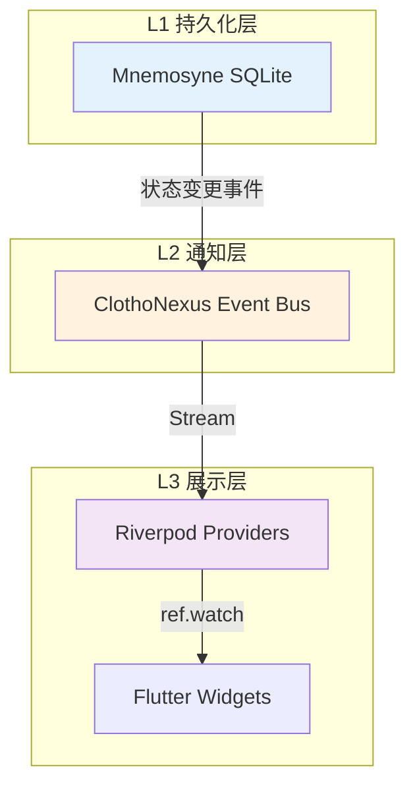

# 架构原则

**版本**: 1.1.0
**日期**: 2026-03-11
**状态**: Active
**作者**: Clotho 架构团队

---

> 术语体系参见 [naming-convention.md](naming-convention.md)

## 1. 核心设计原则

### 1.1 凯撒原则与混合代理 (The Caesar Principle & Hybrid Agency)

> **"Render unto Caesar the things that are Caesar's, and unto God the things that are God's."**

Clotho 的核心设计哲学遵循 **凯撒原则** 和 **混合代理** 模型。代码（凯撒）负责确定性逻辑，LLM（上帝）负责语义与创意，两者通过严格的协议协作，绝不混淆职责。

*详细定义请参阅 👉 **[愿景与哲学: 凯撒原则](vision-and-philosophy.md#2-设计哲学-凯撒原则-the-caesar-principle)**。*

### 1.2 缪斯原则 (The Muses Principle)

> **"凯撒掌管律法，上帝掌管灵魂，而缪斯掌管灵感与技艺。"**

- **辅助智能**: 在核心对话之外，广泛利用 LLM 处理辅助性任务（如记忆整理、属性提取、文本润色）。
- **独立信道**: 建立独立于主对话流的“缪斯信道”，使用专门的 Prompt 和（可选的）独立模型。
- **结构化输出**: 缪斯任务必须产出 Filament 结构化数据，以便系统自动采纳结果。

## 2. 系统架构原则

### 2.1 三层物理隔离

系统划分为三个物理隔离但逻辑紧密的层次：

1. **表现层 (Presentation)**
   - 职责: 用户交互与界面渲染
   - 技术: Flutter UI, Webview
   - 约束: **严禁包含业务逻辑**

2. **编排层 (Jacquard)**
   - 职责: 流程控制与 Prompt 组装
   - 特性: 插件化流水线，确定性编排
   - 核心: Skein 容器，模板渲染

3. **数据层 (Data & Infra)**
   - 职责: 数据存储、检索与快照生成
   - 组件: Mnemosyne 记忆引擎
   - 能力: 时空回溯，动态快照

### 2.2 单向数据流

- **UI → 逻辑**: UI 只能生成 Intent/Event，不能直接修改数据模型
- **逻辑 → UI**: 逻辑层通过 Stream 广播状态变更，UI 被动接收并重绘
- **数据权威**: Mnemosyne 是唯一的状态权威源

### 2.3 状态管理分层 (State Management Layers)

为解决状态管理职责的清晰划分，Clotho 采用三层状态管理架构：

| 层级 | 名称 | 负责组件 | 职责 | 技术实现 |
|------|------|----------|------|----------|
| **L1** | 持久化层 | Mnemosyne | 状态存储、快照生成、历史回溯 | SQLite + OpLog |
| **L2** | 通知层 | ClothoNexus | 状态变更事件广播、生命周期通知 | Stream + Event Bus |
| **L3** | 展示层 | Riverpod | UI 状态投影与缓存、组件重绘 | StateNotifier + Provider |

**核心原则**:

1. **状态存储唯一性**: Mnemosyne 是唯一的状态存储权威源 (SSOT for State Storage)
2. **状态通知解耦**: ClothoNexus 是状态变更通知总线 (State Change Notification Bus)，不存储状态
3. **状态投影局部性**: Riverpod 管理 UI 层的状态投影，数据来源于 ClothoNexus 事件流

**数据流示意图**:

**职责边界说明**:

| 操作 | 负责组件 | 说明 |
|------|----------|------|
| 状态持久化 | Mnemosyne | 将状态变更写入 SQLite，生成 OpLog |
| 快照生成 | Mnemosyne | 按需生成 Punchcards 快照 |
| 历史回溯 | Mnemosyne | 应用 OpLog 回滚到历史状态 |
| 事件广播 | ClothoNexus | 将状态变更事件广播给订阅者 |
| 状态投影 | Riverpod | 将事件流转换为 UI 可读状态 |
| 组件重绘 | Flutter | 根据 Riverpod 状态变化重建 Widget |

### 2.4 协议统一化 (Filament Unification)

- **统一格式**: "XML + YAML IN, XML + JSON OUT"
- **统一范畴**: 统一 Clotho 与 LLM 之间的提示词格式、标签类型与嵌入式前端指令
- **统一解析**: 实时流式解析，路由分发

### 2.5 数据与表现解耦 (Decoupling Data from Presentation)

上下文格式化是编排层的职责，非数据层。Mnemosyne 只提供纯净的结构化数据对象，不含任何 LLM 格式化逻辑；Jacquard 负责将原始数据转换为 LLM 格式并组装 Prompt。

## 3. 开发与维护原则

### 3.1 绝对约束 (The "Must-Nots")

1. **UI 层严禁包含业务逻辑**: UI 组件不得直接修改数据模型
2. **LLM 输出严禁直接执行**: 必须经过 Parser 清洗与校验，严禁 `eval`
3. **状态严禁多头管理**: 所有状态变更必须提交给 Mnemosyne 统一处理
4. **严禁 Prompt 污染**: 严禁在 Prompt 中包含复杂的逻辑运算指令

### 3.2 可扩展性原则

- **插件化**: Jacquard 采用插件化流水线，支持自定义逻辑单元
- **模板化**: 使用 Jinja2 模板引擎，支持动态逻辑控制
- **协议化**: Filament 协议提供标准化的扩展接口

### 3.3 兼容性原则

- **向后兼容**: 支持 SillyTavern 角色卡导入与迁移
- **向前兼容**: 协议版本演进保持兼容性
- **生态兼容**: 通过 WebView 兼容第三方 HTML/JS 内容

## 4. 性能与质量原则

### 4.1 性能基调

- **首屏加载**: < 1s
- **长列表滚动**: 60fps（即使在大量消息历史下）
- **内存占用**: 严格控制图片与上下文对象缓存策略
- **响应时间**: 用户操作到视觉反馈 < 100ms

### 4.2 质量属性

- **可靠性**: 异常转化机制，防止崩溃传播
- **可维护性**: 清晰的架构分层，模块化设计
- **可测试性**: 依赖倒置，支持单元测试和集成测试
- **可观测性**: 完整的日志和监控体系

### 4.3 安全原则

- **沙箱隔离**: 脚本运行在受限沙箱中
- **输入验证**: 所有外部输入必须经过严格验证
- **权限控制**: 细粒度的数据访问权限
- **隐私保护**: 用户数据本地优先，可选加密

## 5. 演进与变更原则

### 5.1 版本管理

- **语义化版本**: 遵循语义化版本规范
- **协议版本**: Filament 协议独立版本管理
- **数据迁移**: 提供自动化数据迁移工具

### 5.2 变更控制

- **架构变更**: 必须经过架构评审委员会批准
- **协议变更**: 保持向后兼容，提供迁移指南
- **数据变更**: 支持数据结构的渐进式演进

### 5.3 文档同步

- **代码即文档**: 关键设计决策必须在代码注释中记录
- **文档更新**: 架构变更必须同步更新相关文档
- **知识共享**: 建立架构决策记录 (ADR) 库

## 6. 关联文档

- **[愿景与哲学](vision-and-philosophy.md)**: 项目根本指导思想
- **[架构索引](README.md)**: 核心组件架构索引
- **[Filament Canonical Spec](protocols/filament-canonical-spec.md)**: 协议设计原则
- **[分层运行时架构](runtime/layered-runtime-architecture.md)**: 运行时设计原则

---

**最后更新**: 2025-12-30  
**文档状态**: 草案，待架构评审委员会审议
