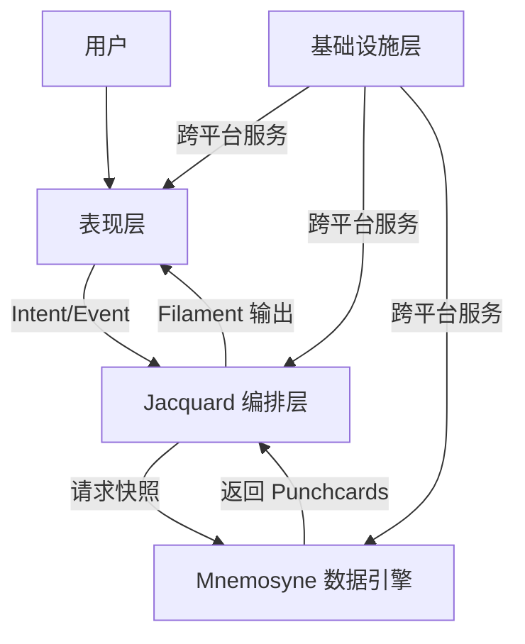

# 核心架构文档目录

**定位**: 系统核心组件的详细设计  
**目标读者**: 系统架构师、核心开发者  
**文档状态**: 已重组 (2025-12-30)

---

## 📖 目录简介

本目录包含 Clotho 系统核心组件的详细设计文档。这些文档深入描述了系统的三大核心生态（编排、数据、表现）以及基础设施层的具体实现。

## 📚 文档列表

### 1. Jacquard 编排层

- **文件**: [`jacquard-orchestration.md`](jacquard-orchestration.md)
- **简介**: 系统的"大脑"与"总线"，负责流程控制与 Prompt 组装的插件化流水线。
- **核心概念**: Skein（结构化容器）、插件化流水线、模板渲染、Filament 解析
- **阅读建议**: 理解系统如何处理用户输入、组装 Prompt 并协调各组件工作
- **关联文档**: 协议目录 [`../protocols/`](../protocols/)，工作流目录 [`../workflows/`](../workflows/)

### 2. Mnemosyne 数据引擎

- **文件**: [`mnemosyne-data-engine.md`](mnemosyne-data-engine.md)
- **简介**: 系统的"海马体"，负责管理多维上下文链的动态快照生成引擎。
- **核心概念**: VWD（Value with Description）数据模型、多维上下文链、状态快照、模板继承
- **阅读建议**: 理解系统如何存储和管理状态，支持时空回溯和动态补丁
- **关联文档**: 运行时目录 [`../runtime/`](../runtime/)，参考目录 [`../reference/`](../reference/)

### 3. 表现层

- **文件**: [`presentation-layer.md`](presentation-layer.md)
- **简介**: 系统的"舞台"，负责将底层数据流转化为可视化像素的交互界面。
- **核心概念**: Hybrid SDUI（混合服务端驱动 UI）、Stage & Control 布局、InputDraft 控制器
- **阅读建议**: 理解用户如何与系统交互，以及界面如何响应状态变化
- **关联文档**: 基础设施目录 [`infrastructure-layer.md`](infrastructure-layer.md)，UI 设计规范 [`../ui-design-specs/`](../ui-design-specs/)

### 4. 基础设施层

- **文件**: [`infrastructure-layer.md`](infrastructure-layer.md)
- **简介**: 系统的"地基"，提供跨平台抽象和基础服务。
- **核心概念**: 依赖倒置、差异化通信策略、容错机制、ClothoNexus 事件总线
- **阅读建议**: 理解系统如何在 Android 和 Windows 平台上实现一致体验
- **关联文档**: 表现层 [`presentation-layer.md`](presentation-layer.md)，参考目录 [`../reference/`](../reference/)

## 🔗 核心架构关系

## 🧭 导航指南

### 从哪里开始？

如果您是**系统架构师**：

1. 按顺序阅读本目录的所有文档：Jacquard → Mnemosyne → Presentation → Infrastructure
2. 重点关注组件间的接口定义和数据流

如果您是**特定组件开发者**：

1. 直接阅读对应组件的详细文档
2. 查阅关联文档理解依赖关系

如果您是**集成开发者**：

1. 阅读 [`infrastructure-layer.md`](infrastructure-layer.md) 了解跨平台抽象
2. 查阅参考目录 [`../reference/`](../reference/) 了解 API 和配置

### 相邻目录

- **概览** ([`../overview/`](../overview/)): 高层次介绍与设计原则
- **协议与格式** ([`../protocols/`](../protocols/)): 通信协议和数据格式规范
- **工作流与处理** ([`../workflows/`](../workflows/)): 具体业务处理流程
- **运行时环境** ([`../runtime/`](../runtime/)): 系统运行时行为与状态管理
- **参考文档** ([`../reference/`](../reference/)): 技术参考与工具文档

## 📝 文档更新记录

| 日期 | 版本 | 变更说明 |
|------|------|----------|
| 2025-12-30 | 2.0.0 | 文档重组，创建本目录和 README，文件重命名 |
| 2025-12-23 | 1.0.0 | 原始文档创建 |

---

**最后更新**: 2025-12-30  
**维护者**: Clotho 架构团队
