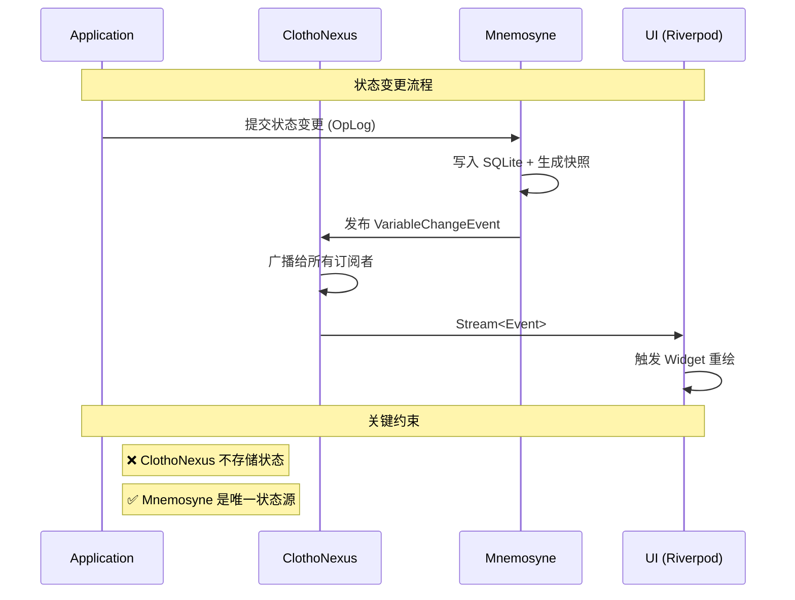
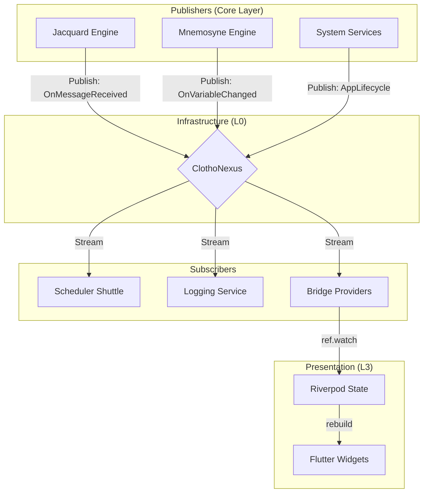

# ClothoNexus: 核心事件总线 (Core Event Bus)

**版本**: 1.1.0
**日期**: 2026-03-11
**状态**: Active
**所属模块**: Infrastructure (L0)

---

## 📖 术语使用说明

本文档使用**技术语义术语**：

| 术语 | 说明 |
|------|------|
| **Jacquard** | 编排层 |
| **Mnemosyne** | 数据引擎 |
| **Session** | 会话实例 |

在代码实现时，请使用 [`../naming-convention.md`](../naming-convention.md) 中定义的技术术语。

---

## 1. 概述 (Overview)

**ClothoNexus** 是 Clotho 架构中的中枢神经系统，位于基础设施层（L0）。它提供了一个类型安全、异步、解耦的事件通信机制，允许系统的不同模块（Jacquard, Mnemosyne, Presentation）在不直接依赖彼此的情况下进行交互。

ClothoNexus 是实现 **"凯撒原则"** (确定性控制) 的关键组件，它确保所有的系统状态变更都是可见的、可追踪的，并且能够触发确定性的副作用（如自动化调度）。

---

## 2. 核心职责 (Core Responsibilities)

1.  **解耦通信**: 允许 Core 层发出事件，UI 层或插件层监听事件，消除循环依赖。
2.  **生命周期广播**: 广播系统级的关键生命周期事件（如 `AppStarted`, `SessionCreated`）。
3.  **驱动自动化**: 作为 Jacquard Scheduler Shuttle 的输入源，驱动基于事件的自动化逻辑。
4.  **UI 响应**: 通过 Bridge Provider 将底层事件流暴露给 Riverpod，驱动 UI 更新。

### 2.1 与 Mnemosyne 的职责边界 (Boundary with Mnemosyne)

**核心原则**: ClothoNexus 是状态变更**通知总线**，Mnemosyne 是状态**存储权威源**。

| 职责 | ClothoNexus | Mnemosyne |
|------|-------------|-----------|
| **状态存储** | ❌ 不存储任何状态 | ✅ 唯一状态存储权威源 (SSOT) |
| **事件广播** | ✅ 负责广播状态变更事件 | ❌ 不直接广播，通过 ClothoNexus 发布 |
| **历史回溯** | ❌ 无回溯能力 | ✅ 通过 OpLog 实现时间旅行 |
| **快照生成** | ❌ 不生成快照 | ✅ 生成 Punchcards 快照 |
| **数据持久化** | ❌ 无持久化能力 | ✅ SQLite 持久化存储 |

**协作流程**:



**状态管理分层**:

详见 **[架构原则 - 状态管理分层](../architecture-principles.md#23-状态管理分层-state-management-layers)**。

---

## 3. 架构设计 (Architecture)

ClothoNexus 基于 Dart 的 `Stream` 和 `StreamController` 实现，采用 **Publish-Subscribe (发布-订阅)** 模式。



---

## 4. 事件分类体系 (Event Taxonomy)

所有事件必须继承自抽象基类 `ClothoEvent`。

### 4.1 基础定义

```dart
abstract class ClothoEvent {
  final String id;
  final int timestamp;
  final Map<String, dynamic>? metadata;

  ClothoEvent({this.metadata}) 
      : id = Uuid().v4(), 
        timestamp = DateTime.now().millisecondsSinceEpoch;
}
```

### 4.2 核心事件类型

| 类型 | 类名 | 描述 | 关键载荷 (Payload) |
| :--- | :--- | :--- | :--- |
| **系统级** | `AppLifecycleEvent` | 应用启动、暂停、恢复、关闭 | `state: AppLifecycleState` |
| **会话级** | `SessionEvent` | 会话加载、保存、销毁 | `sessionId`, `action` |
| **消息级** | `MessageEvent` | 消息发送、接收、更新、删除 | `messageId`, `type` (User/Model), `content` |
| **数据级** | `VariableChangeEvent` | 状态变量变更 | `path` (e.g. `character.hp`), `oldValue`, `newValue` |
| **生成级** | `GenerationEvent` | LLM 生成开始、Token流式传输、结束 | `step`, `chunk` |
| **错误级** | `ErrorEvent` | 系统异常或警告 | `code`, `message`, `stackTrace` |

---

## 5. 接口规范 (Interface Specification)

ClothoNexus 作为单例服务由 `GetIt` 管理。

```dart
abstract class IClothoNexus {
  /// 发布一个事件
  void publish(ClothoEvent event);

  /// 订阅特定类型的事件流
  Stream<T> on<T extends ClothoEvent>();
  
  /// 订阅所有事件（用于日志或调试）
  Stream<ClothoEvent> get allEvents;
}
```

### 5.1 实现示例 (Implementation Example)

```dart
@singleton
class ClothoNexusImpl implements IClothoNexus {
  final _controller = StreamController<ClothoEvent>.broadcast();

  @override
  void publish(ClothoEvent event) {
    if (!_controller.isClosed) {
      _controller.add(event);
      // 可选：集成日志记录
      print('[Nexus] Event: ${event.runtimeType}'); 
    }
  }

  @override
  Stream<T> on<T extends ClothoEvent>() {
    return _controller.stream.where((e) => e is T).cast<T>();
  }

  @override
  Stream<ClothoEvent> get allEvents => _controller.stream;
  
  void dispose() => _controller.close();
}
```

---

## 6. 集成模式 (Integration Patterns)

### 6.1 Core Layer 发布事件

```dart
class MnemosyneEngine {
  final IClothoNexus _nexus;
  
  MnemosyneEngine(this._nexus);

  void updateVariable(String path, dynamic value) {
    // 1. 更新内部状态
    _store.set(path, value);
    
    // 2. 发布事件
    _nexus.publish(VariableChangeEvent(
      path: path,
      newValue: value,
    ));
  }
}
```

### 6.2 Jacquard Scheduler 订阅事件

```dart
class SchedulerShuttle {
  final IClothoNexus _nexus;
  
  void init() {
    // 监听变量变化以触发自动化规则
    _nexus.on<VariableChangeEvent>().listen((event) {
      _checkRules(event.path, event.newValue);
    });
  }
}
```

### 6.3 Presentation Layer (Riverpod) 桥接

为了遵守 **依赖注入规范**，UI 层通过 Provider 监听事件流。

```dart
// providers.dart

// 1. 获取 Nexus 实例
final nexusProvider = Provider((ref) => GetIt.I<IClothoNexus>());

// 2. 定义特定事件流的 Provider
final lastMessageEventProvider = StreamProvider<MessageEvent>((ref) {
  final nexus = ref.watch(nexusProvider);
  return nexus.on<MessageEvent>();
});

// 3. 在 UI 中消费
class StatusBar extends ConsumerWidget {
  @override
  Widget build(BuildContext context, WidgetRef ref) {
    final lastEvent = ref.watch(lastMessageEventProvider);
    
    return lastEvent.when(
      data: (e) => Text('Last action: ${e.runtimeType}'),
      loading: () => Text('Ready'),
      error: (_, __) => Icon(Icons.error),
    );
  }
}
```

---

## 7. 性能与限制 (Performance & Constraints)

1.  **同步 vs 异步**: 默认情况下，`StreamController.broadcast()` 是异步的。对于必须同步处理的关键逻辑（极少见），需谨慎处理。
2.  **背压 (Backpressure)**: Nexus 不处理背压。如果事件产生速度快于消费速度，消费者必须自己处理（例如使用 `debounce` 或 `throttle`）。
3.  **异常隔离**: 订阅者的未捕获异常不应导致 Nexus 崩溃。建议在 `listen` 中添加 `onError` 处理。