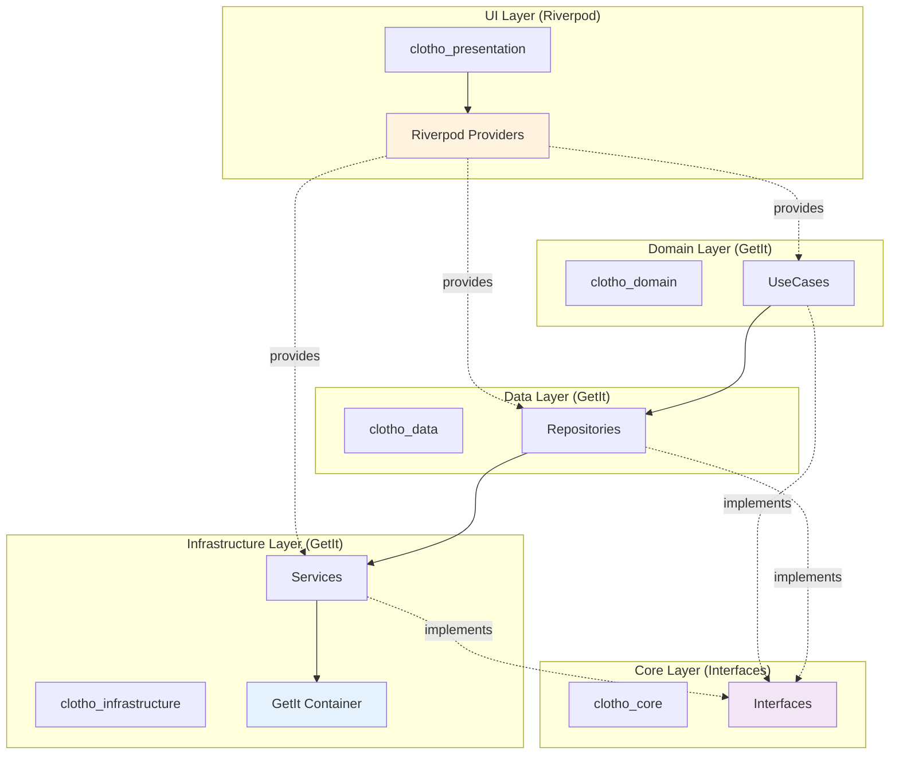

# 依赖注入规范 (Dependency Injection Specification)

**版本**: 1.0.0
**日期**: 2026-02-26
**状态**: Active
**作者**: Clotho 架构团队
**关联文档**:
- [`multi-package-architecture.md`](multi-package-architecture.md) - 多包架构设计
- [`clotho-nexus-events.md`](clotho-nexus-events.md) - 事件总线规范

---

## 1. 概述 (Overview)

本文档定义了 Clotho 项目的依赖注入 (DI) 架构，解决了架构审计中发现的 H-03 问题（依赖注入方案描述不一致）。

### 1.1 设计目标

1. **清晰的职责边界**: 明确 GetIt 和 Riverpod 的各自职责
2. **统一的暴露模式**: 定义服务从核心层暴露到 UI 层的标准方式
3. **生命周期管理**: 明确各层服务的生命周期
4. **跨包依赖管理**: 定义包间依赖注入的实现模式

### 1.2 核心原则

| 原则 | 说明 |
|------|------|
| **单向依赖** | 依赖方向严格从外层指向内层，禁止循环依赖 |
| **接口隔离** | 跨包调用通过接口进行，实现细节对调用方透明 |
| **懒加载优先** | 服务默认懒加载，避免启动时过度初始化 |
| **生命周期匹配** | 服务生命周期与其所在层级的生命周期一致 |

---

## 2. 依赖注入架构全景 (DI Architecture Overview)

### 2.1 分层 DI 架构图



### 2.2 职责边界

| 层级 | 容器 | 职责 | 生命周期 | 典型服务 |
|------|------|------|----------|----------|
| **UI Layer** | Riverpod | UI 状态管理、Widget 重建驱动 | Widget 生命周期 | `StateNotifier`, `StreamProvider` |
| **Domain Layer** | GetIt | 业务逻辑、用例编排 | 应用生命周期 | `CreateTurnUseCase`, `GenerateResponseUseCase` |
| **Data Layer** | GetIt | 数据访问、持久化 | 应用生命周期 | `TurnRepository`, `SessionRepository` |
| **Infrastructure** | GetIt | 基础设施服务 | 单例/应用生命周期 | `Logger`, `FileSystemService`, `ClothoNexus` |
| **Core Layer** | 无 | 接口定义、类型定义 | 无状态 | `ITurnRepository`, `ILogger` |

---

## 3. GetIt 容器配置 (GetIt Container Configuration)

### 3.1 容器初始化

```dart
// clotho_infrastructure/lib/src/di/get_it_container.dart
import 'package:get_it/get_it.dart';
import 'package:injectable/injectable.dart';

/// 全局 GetIt 容器
/// 
/// 这是 Clotho 应用的核心层 DI 容器，所有非 UI 层的服务都注册于此。
final getIt = GetIt.instance;

/// 初始化依赖注入
/// 
/// 应在 main() 函数中最早调用，确保所有服务可用。
@InjectableInit(
  initializerName: 'init',
  preferRelativeImports: true,
  asExtension: true,
)
Future<void> configureDependencies() async {
  // 1. 注册基础设施服务（最底层，无依赖）
  getIt.registerLazySingleton<ILogger>(() => CoreLogger());
  getIt.registerLazySingleton<IClothoNexus>(() => ClothoNexusImpl());
  getIt.registerLazySingleton<IFileSystemService>(() => FileSystemServiceImpl());
  
  // 2. 运行代码生成初始化
  await getIt.init();
  
  // 3. 验证容器完整性
  await _validateContainer();
}

/// 验证容器完整性
Future<void> _validateContainer() async {
  final logger = getIt<ILogger>();
  logger.info('DI Container initialized successfully', category: 'Infra.DI');
}
```

### 3.2 服务注册模式

#### 3.2.1 单例服务 (Singleton)

适用于无状态或全局共享的服务：

```dart
// clotho_infrastructure/lib/src/services/clotho_nexus.dart
import 'package:injectable/injectable.dart';
import 'package:clotho_core/clotho_core.dart';

/// ClothoNexus 实现
/// 
/// 作为全局事件总线，必须是单例。
@LazySingleton(as: IClothoNexus)
class ClothoNexusImpl implements IClothoNexus {
  final _controller = StreamController<ClothoEvent>.broadcast();
  
  @override
  void publish(ClothoEvent event) {
    if (!_controller.isClosed) {
      _controller.add(event);
    }
  }
  
  @override
  Stream<T> on<T extends ClothoEvent>() {
    return _controller.stream.where((e) => e is T).cast<T>();
  }
  
  @override
  void dispose() => _controller.close();
}
```

#### 3.2.2 工厂服务 (Factory)

适用于每次调用都需要新实例的服务：

```dart
// clotho_data/lib/src/repository/turn_repository.dart
import 'package:injectable/injectable.dart';
import 'package:clotho_domain/clotho_domain.dart';
import 'package:clotho_core/clotho_core.dart';

@LazySingleton(as: TurnRepository)
class TurnRepositoryImpl implements TurnRepository {
  final DatabaseClient _db;
  final ILogger _logger;
  
  // 依赖通过构造函数注入
  TurnRepositoryImpl(this._db, @factoryParam this._logger);
  
  @override
  Future<Turn> getById(String id) async {
    // 实现
  }
}
```

#### 3.2.3 带参数工厂 (Factory with Parameters)

适用于需要运行时参数的服务：

```dart
// clotho_data/lib/src/database/session_database.dart
import 'package:injectable/injectable.dart';
import 'package:clotho_core/clotho_core.dart';

@LazySingleton(as: SessionDatabase)
class SessionDatabaseImpl implements SessionDatabase {
  final String _sessionId;
  final ILogger _logger;
  
  // 使用 @factoryParam 注入运行时参数
  SessionDatabaseImpl(
    @factoryParam this._sessionId,
    @factoryParam this._logger,
  );
  
  // 使用方式:
  // final db = getIt<SessionDatabase>(param1: sessionId, param2: logger);
}
```

### 3.3 服务生命周期管理

```dart
// clotho_infrastructure/lib/src/di/service_lifecycle.dart

/// 服务生命周期管理器
/// 
/// 管理 GetIt 容器中服务的生命周期事件。
class ServiceLifecycleManager {
  final GetIt _getIt;
  final ILogger _logger;
  
  ServiceLifecycleManager(this._getIt, this._logger);
  
  /// 应用启动时调用
  Future<void> onAppStart() async {
    _logger.info('Starting application services', category: 'Infra.Lifecycle');
    
    // 启动需要初始化的服务
    await _getIt<IClothoNexus>().initialize();
    await _getIt<IFileSystemService>().initialize();
  }
  
  /// 应用暂停时调用
  Future<void> onAppPause() async {
    _logger.info('Pausing application services', category: 'Infra.Lifecycle');
    
    // 暂停后台任务
    await _getIt<ISchedulerService>().pause();
  }
  
  /// 应用恢复时调用
  Future<void> onAppResume() async {
    _logger.info('Resuming application services', category: 'Infra.Lifecycle');
    
    // 恢复后台任务
    await _getIt<ISchedulerService>().resume();
  }
  
  /// 应用关闭时调用
  Future<void> onAppStop() async {
    _logger.info('Stopping application services', category: 'Infra.Lifecycle');
    
    // 停止所有服务
    await _getIt<ISchedulerService>().stop();
    await _getIt<IClothoNexus>().dispose();
    
    // 关闭 GetIt 容器
    await _getIt.reset();
  }
}
```

---

## 4. Riverpod Provider 配置 (Riverpod Provider Configuration)

### 4.1 Provider 类型选择

| Provider 类型 | 用途 | 适用场景 |
|--------------|------|----------|
| `Provider<T>` | 只读数据提供 | 配置、常量 |
| `StateProvider<T>` | 简单状态 | 计数器、开关 |
| `StateNotifierProvider<T>` | 复杂状态 | 表单状态、列表状态 |
| `StreamProvider<T>` | 流式数据 | 事件流、实时数据 |
| `FutureProvider<T>` | 异步数据 | 一次性加载 |

### 4.2 GetIt 到 Riverpod 的桥接模式

#### 4.2.1 服务暴露模式

```dart
// clotho_presentation/lib/providers/core_providers.dart
import 'package:flutter_riverpod/flutter_riverpod.dart';
import 'package:clotho_infrastructure/clotho_infrastructure.dart';
import 'package:clotho_domain/clotho_domain.dart';

/// GetIt 容器 Provider
/// 
/// 这是 Riverpod 访问 GetIt 服务的唯一入口。
final getItProvider = Provider<GetIt>((ref) {
  return getIt;
});

/// IClothoNexus Provider
/// 
/// 从 GetIt 容器获取单例服务。
final clothoNexusProvider = Provider<IClothoNexus>((ref) {
  final getIt = ref.watch(getItProvider);
  return getIt<IClothoNexus>();
});

/// ILogger Provider
final loggerProvider = Provider<ILogger>((ref) {
  final getIt = ref.watch(getItProvider);
  return getIt<ILogger>();
});
```

#### 4.2.2 UseCase 暴露模式

```dart
// clotho_presentation/lib/providers/use_case_providers.dart
import 'package:flutter_riverpod/flutter_riverpod.dart';
import 'package:clotho_domain/clotho_domain.dart';

/// CreateTurnUseCase Provider
final createTurnProvider = Provider<CreateTurnUseCase>((ref) {
  final getIt = ref.watch(getItProvider);
  return getIt<CreateTurnUseCase>();
});

/// GenerateResponseUseCase Provider
final generateResponseProvider = Provider<GenerateResponseUseCase>((ref) {
  final getIt = ref.watch(getItProvider);
  return getIt<GenerateResponseUseCase>();
});
```

#### 4.2.3 Repository 暴露模式

```dart
// clotho_presentation/lib/providers/repository_providers.dart
import 'package:flutter_riverpod/flutter_riverpod.dart';
import 'package:clotho_domain/clotho_domain.dart';

/// TurnRepository Provider
final turnRepositoryProvider = Provider<TurnRepository>((ref) {
  final getIt = ref.watch(getItProvider);
  return getIt<TurnRepository>();
});

/// SessionRepository Provider
final sessionRepositoryProvider = Provider<SessionRepository>((ref) {
  final getIt = ref.watch(getItProvider);
  return getIt<SessionRepository>();
});
```

### 4.3 StateNotifier 模式

```dart
// clotho_presentation/lib/providers/session_state_provider.dart
import 'package:flutter_riverpod/flutter_riverpod.dart';
import 'package:clotho_domain/clotho_domain.dart';

/// 会话状态
class SessionState {
  final Session? currentSession;
  final Turn? activeTurn;
  final bool isLoading;
  final String? error;
  
  SessionState({
    this.currentSession,
    this.activeTurn,
    this.isLoading = false,
    this.error,
  });
  
  SessionState copyWith({
    Session? currentSession,
    Turn? activeTurn,
    bool? isLoading,
    String? error,
  }) {
    return SessionState(
      currentSession: currentSession ?? this.currentSession,
      activeTurn: activeTurn ?? this.activeTurn,
      isLoading: isLoading ?? this.isLoading,
      error: error ?? this.error,
    );
  }
}

/// 会话状态通知器
class SessionStateNotifier extends StateNotifier<SessionState> {
  final SessionRepository _repository;
  final IClothoNexus _nexus;
  final ILogger _logger;
  
  SessionStateNotifier(
    this._repository,
    this._nexus,
    this._logger,
  ) : super(SessionState()) {
    // 订阅事件
    _nexus.on<SessionEvent>().listen(_onSessionEvent);
  }
  
  Future<void> loadSession(String sessionId) async {
    state = state.copyWith(isLoading: true);
    
    try {
      final session = await _repository.getById(sessionId);
      state = state.copyWith(
        currentSession: session,
        isLoading: false,
      );
    } catch (e, stack) {
      _logger.error(
        'Failed to load session',
        error: e,
        stack: stack,
        category: 'UI.Session',
      );
      state = state.copyWith(
        isLoading: false,
        error: e.toString(),
      );
    }
  }
  
  void _onSessionEvent(SessionEvent event) {
    switch (event.action) {
      case SessionAction.loaded:
        // 会话已加载，更新状态
        break;
      case SessionAction.saved:
        // 会话已保存，更新状态
        break;
    }
  }
}

/// SessionStateNotifier Provider
final sessionStateProvider = StateNotifierProvider<SessionStateNotifier, SessionState>((ref) {
  final repository = ref.watch(sessionRepositoryProvider);
  final nexus = ref.watch(clothoNexusProvider);
  final logger = ref.watch(loggerProvider);
  
  return SessionStateNotifier(repository, nexus, logger);
});
```

### 4.4 StreamProvider 模式（事件流）

```dart
// clotho_presentation/lib/providers/event_stream_providers.dart
import 'package:flutter_riverpod/flutter_riverpod.dart';
import 'package:clotho_infrastructure/clotho_infrastructure.dart';

/// MessageEvent 流 Provider
final messageEventStreamProvider = StreamProvider<MessageEvent>((ref) {
  final nexus = ref.watch(clothoNexusProvider);
  return nexus.on<MessageEvent>();
});

/// SystemErrorEvent 流 Provider
final errorEventStreamProvider = StreamProvider<SystemErrorEvent>((ref) {
  final nexus = ref.watch(clothoNexusProvider);
  return nexus.on<SystemErrorEvent>();
});

/// GenerationEvent 流 Provider
final generationEventStreamProvider = StreamProvider<GenerationEvent>((ref) {
  final nexus = ref.watch(clothoNexusProvider);
  return nexus.on<GenerationEvent>();
});
```

---

## 5. 跨包依赖注入模式 (Inter-Package DI Patterns)

### 5.1 接口定义模式

```dart
// clotho_core/lib/src/repository/turn_repository_interface.dart

/// Turn 实体的仓储接口
/// 
/// 定义在 core 层，由 data 层实现。
abstract class TurnRepository {
  /// 根据 ID 获取 Turn
  Future<Turn> getById(String id);
  
  /// 创建新的 Turn
  Future<Turn> create(Turn turn);
  
  /// 更新 Turn
  Future<void> update(Turn turn);
  
  /// 删除 Turn
  Future<void> delete(String id);
  
  /// 获取会话的所有 Turns
  Future<List<Turn>> getBySession(String sessionId);
}
```

### 5.2 实现注册模式

```dart
// clotho_data/lib/src/di/data_injection.dart
import 'package:injectable/injectable.dart';
import 'package:clotho_core/clotho_core.dart';

@module
abstract class DataInjectionModule {
  // 注册 TurnRepository 实现
  @LazySingleton(as: TurnRepository)
  TurnRepositoryImpl get turnRepository;
  
  // 注册 SessionRepository 实现
  @LazySingleton(as: SessionRepository)
  SessionRepositoryImpl get sessionRepository;
}
```

### 5.3 跨包访问模式

```dart
// clotho_jacquard/lib/src/jacquard_engine.dart
import 'package:clotho_core/clotho_core.dart';
import 'package:clotho_domain/clotho_domain.dart';

/// Jacquard 引擎
/// 
/// 通过接口访问数据层服务，不直接依赖实现。
class JacquardEngine {
  final TurnRepository _turnRepository;
  final SessionRepository _sessionRepository;
  final GenerateResponseUseCase _generateUseCase;
  final IClothoNexus _nexus;
  
  JacquardEngine(
    this._turnRepository,
    this._sessionRepository,
    this._generateUseCase,
    this._nexus,
  );
  
  Future<void> generateResponse(String sessionId, String userInput) async {
    // 通过接口访问仓储，不关心具体实现
    final session = await _sessionRepository.getById(sessionId);
    final turn = await _turnRepository.create(Turn.empty());
    
    // 执行生成
    final result = await _generateUseCase.execute(
      sessionId: sessionId,
      turnId: turn.id,
      userInput: userInput,
    );
    
    // 发布事件
    _nexus.publish(MessageEvent(
      messageId: result.messageId,
      content: result.content,
    ));
  }
}
```

---

## 6. 依赖注入验证 (Dependency Injection Validation)

### 6.1 容器验证

```dart
// clotho_infrastructure/test/di/container_validation_test.dart
import 'package:flutter_test/flutter_test.dart';
import 'package:clotho_infrastructure/clotho_infrastructure.dart';

void main() {
  group('DI Container Validation', () {
    setUpAll(() async {
      await configureDependencies();
    });
    
    test('should register all core services', () {
      expect(getIt.isRegistered<ILogger>(), isTrue);
      expect(getIt.isRegistered<IClothoNexus>(), isTrue);
      expect(getIt.isRegistered<IFileSystemService>(), isTrue);
    });
    
    test('should register all repositories', () {
      expect(getIt.isRegistered<TurnRepository>(), isTrue);
      expect(getIt.isRegistered<SessionRepository>(), isTrue);
    });
    
    test('should register all use cases', () {
      expect(getIt.isRegistered<CreateTurnUseCase>(), isTrue);
      expect(getIt.isRegistered<GenerateResponseUseCase>(), isTrue);
    });
    
    test('should not have circular dependencies', () async {
      // 尝试解析所有服务，检测循环依赖
      expect(() => getIt<ILogger>(), returnsNormally);
      expect(() => getIt<IClothoNexus>(), returnsNormally);
      expect(() => getIt<TurnRepository>(), returnsNormally);
      expect(() => getIt<CreateTurnUseCase>(), returnsNormally);
    });
  });
}
```

### 6.2 包依赖验证

```yaml
# melos.yaml
name: clotho

packages:
  - packages/*
  - packages_dev/*

command:
  bootstrap:
    usePubspecOverrides: true

scripts:
  verify:
    description: 验证包依赖关系
    run: |
      echo "Checking for circular dependencies..."
      dart pub global activate melos
      melos bootstrap
      melos exec -- "dart pub get"
```

---

## 7. 最佳实践 (Best Practices)

### 7.1 服务注册最佳实践

| 实践 | 说明 | 示例 |
|------|------|------|
| **使用接口注册** | 始终使用 `as: Interface` 注册实现 | `@LazySingleton(as: TurnRepository)` |
| **懒加载优先** | 除非必要，否则使用 `@LazySingleton` | 避免启动时过度初始化 |
| **明确依赖** | 通过构造函数明确声明依赖 | `Service(this.dep1, this.dep2)` |
| **避免服务定位器反模式** | 不要在业务代码中直接使用 `getIt()` | 使用依赖注入 |

### 7.2 Provider 最佳实践

| 实践 | 说明 | 示例 |
|------|------|------|
| **Provider 组合** | 在 Provider 内部组合多个依赖 | `ref.watch(dep1) + ref.watch(dep2)` |
| **避免 Provider 嵌套** | 不要在 Provider 内部创建新的 Provider | 使用 `ProviderContainer` |
| **使用 `ref.watch`** | 正确追踪依赖变化 | `ref.watch(provider)` |
| **清理资源** | 在 `dispose` 中清理订阅 | `ref.onDispose(() => subscription.cancel())` |

### 7.3 生命周期最佳实践

| 实践 | 说明 |
|------|------|
| **应用启动时初始化核心服务** | `ILogger`, `IClothoNexus`, `IFileSystemService` |
| **按需加载业务服务** | UseCase、Repository 懒加载 |
| **Widget 销毁时清理** | 取消订阅、关闭流 |
| **应用关闭时释放资源** | 关闭数据库、文件句柄 |

---

## 8. 常见问题解答 (FAQ)

### Q1: 为什么使用 GetIt + Riverpod 混合架构？

**A**: GetIt 适合管理应用级单例服务（如 Repository、UseCase），Riverpod 适合管理 UI 状态和 Widget 重建。两者结合可以发挥各自优势。

### Q2: 如何在测试中 Mock 依赖？

**A**: 使用 `getIt.reset()` 清空容器，然后注册 Mock 实现：

```dart
test('should create turn', () async {
  // 清空容器
  await getIt.reset();
  
  // 注册 Mock
  getIt.registerLazySingleton<TurnRepository>(() => MockTurnRepository());
  
  // 运行测试
  final useCase = getIt<CreateTurnUseCase>();
  final result = await useCase.execute(...);
  
  expect(result, isNotNull);
});
```

### Q3: 如何处理带参数的依赖？

**A**: 使用 `@factoryParam` 注解：

```dart
@LazySingleton(as: SessionDatabase)
class SessionDatabaseImpl implements SessionDatabase {
  SessionDatabaseImpl(
    @factoryParam this.sessionId,
    @factoryParam this.logger,
  );
}

// 使用
final db = getIt<SessionDatabase>(
  param1: sessionId,
  param2: logger,
);
```

---

## 9. 变更历史 (Changelog)

| 版本 | 日期 | 变更内容 | 作者 |
|------|------|----------|------|
| 1.0.0 | 2026-02-26 | 初始版本，解决 H-03 问题 | Clotho 架构团队 |

---

**最后更新**: 2026-02-26  
**维护者**: Clotho 架构团队
