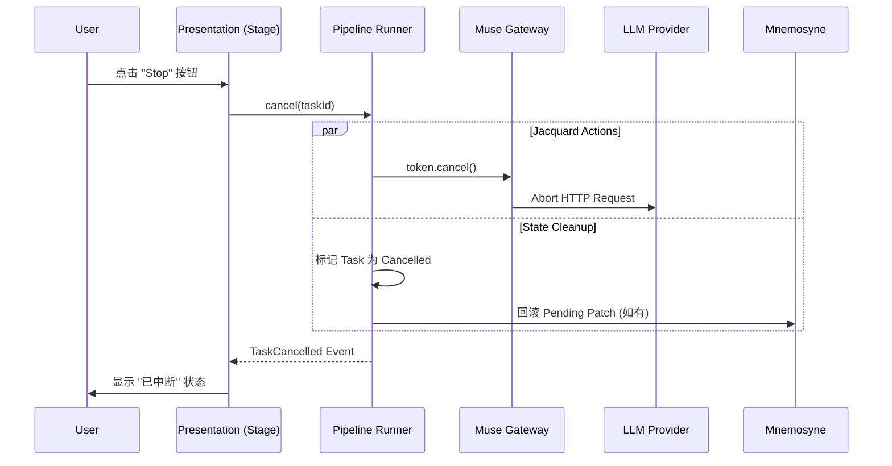

# 错误处理与任务取消设计规范 (Error Handling & Cancellation)

**版本**: 1.0.0
**日期**: 2026-02-12
**状态**: Active
**关联文档**:
- `jacquard/README.md`
- `muse/README.md`
- `protocols/filament-parsing-workflow.md`
- `infrastructure/clotho-nexus-events.md`

---

## 1. 概述 (Overview)

本文档定义了 Clotho 系统中的**错误恢复 (Error Recovery)** 和 **任务取消 (Task Cancellation)** 机制。
针对 `DESIGN_MATURITY_ASSESSMENT.md` 中提出的缺失点：
1.  **[Medium] 错误恢复机制**: 网络超时、LLM 格式错误的重试与熔断。
2.  **[Medium] 任务取消**: 优雅地中断生成流程，回滚或清理状态。

---

## 2. 错误恢复机制 (Error Recovery)

Clotho 采用分层防御策略处理运行时错误，确保用户体验的连续性。

### 2.1 错误分类与策略

| 错误类型 | 典型场景 | 恢复策略 | 负责层级 |
| :--- | :--- | :--- | :--- |
| **Transient (瞬态)** | 网络超时 (504), 速率限制 (429) | 指数退避重试 (Exponential Backoff Retry) | Muse Gateway |
| **Structural (结构)** | XML 标签未闭合, 必需标签缺失 | 流式模糊修正 (Fuzzy Correction) + 二阶段重整 | Filament Parser |
| **Logic (逻辑)** | JSON Schema 校验失败, 幻觉参数 | 自我修正 (Self-Correction Loop) | Jacquard Pipeline |
| **Critical (致命)** | API Key 无效, 额度耗尽, 模型下线 | 快速失败 (Fail Fast) + UI 错误提示 | Muse Gateway -> UI |

### 2.2 策略实现细节

#### 2.2.1 指数退避重试 (Muse Gateway)

在 `Muse Gateway` 层实现重试逻辑，对上层 Jacquard 透明。

```dart
// 伪代码: Muse Gateway 重试逻辑
Future<Response> executeWithRetry(Request req) async {
  int attempt = 0;
  while (attempt < maxAttempts) {
    try {
      return await _client.send(req);
    } catch (e) {
      if (isTransientError(e)) {
        attempt++;
        // 计算退避时间: base * 2^attempt + jitter
        await delay(calculateBackoff(attempt)); 
        continue;
      }
      rethrow; // 非瞬态错误直接抛出
    }
  }
  throw MaxRetryExceededException();
}
```

*   **配置**:
    *   `max_attempts`: 3 (默认)
    *   `base_delay_ms`: 500
    *   `max_delay_ms`: 5000

#### 2.2.2 熔断机制 (Circuit Breaker)

当特定 Provider (如 OpenAI) 连续失败率过高时，自动触发熔断，暂时屏蔽该 Provider 或切换至备用路由。

*   **状态**: `Closed` (正常) -> `Open` (熔断) -> `Half-Open` (尝试恢复)
*   **触发阈值**: 30秒内 5 次失败。
*   **冷却时间**: 60秒。

#### 2.2.3 自我修正循环 (Jacquard Self-Correction)

当 Jacquard 检测到 LLM 返回的内容虽然格式合法（通过了 Parser），但业务逻辑错误（例如生成的 JSON 无法反序列化，或违反了游戏规则）时，触发自我修正。

1.  **检测**: `Validator` 组件校验 Skein 中的生成结果。
2.  **触发**: 如果校验失败，且剩余 `correction_budget > 0`。
3.  **动作**:
    *   回滚 Mnemosyne 的临时状态（如果有）。
    *   构建一个新的 `Correction Block`，包含错误详情 (`<system>Your last response failed validation: {reason}. Please try again.</system>`)。
    *   将其追加到 Skein 末尾，重新提交给 Muse Gateway。
4.  **限制**: 最大修正次数通常限制为 1 次，防止无限循环消耗 Token。

---

## 3. 任务取消机制 (Task Cancellation)

用户中断生成是一个高频操作，系统必须保证取消后的状态一致性。

### 3.1 取消传播流 (Cancellation Propagation)

利用 Dart 的 `CancelableOperation` 或 `CancellationTokens` 模式，将取消信号从 UI 层一路传递到底层。



### 3.2 组件级取消行为

#### 3.2.1 Muse Gateway
*   **动作**: 立即中断底层的 HTTP 连接（关闭 Socket）。
*   **资源**: 释放相关持有的资源。
*   **异常**: 抛出 `CancellationException`，不再返回任何后续 Chunk。

#### 3.2.2 Filament Parser
*   **动作**: 接收到流中断信号 (`EOF` 或 `Cancel`)。
*   **逻辑**:
    *   如果是因为 `Cancel`，**不**执行自动闭合标签（Auto-Close），因为用户意图是丢弃。
    *   抛弃当前缓冲区中的数据。

#### 3.2.3 Jacquard Runner
*   **状态回滚**:
    *   Jacquard 在执行 Pipeline 时，会对 Mnemosyne 进行“预写”或生成“Draft Patch”。
    *   收到取消信号后，Jacquard 必须通知 Mnemosyne **丢弃**当前关联的 Draft Patch，确保数据库状态不包含半成品的更新。
    *   `Mnemosyne.discardPatch(patchId)`

#### 3.2.4 Presentation (UI)
*   **渲染**: 立即停止打字机效果。
*   **反馈**:
    *   如果是用户主动取消，保留已生成的部分文本（可选，取决于产品定义，通常保留以便用户参考或重试）。
    *   显示“重新生成”按钮。
    *   不在历史记录中持久化该条目（或标记为 `aborted`）。

---

## 4. 异常处理规范 (Error Handling Standards)

### 4.1 统一错误码 (Error Codes)

所有子系统抛出的异常应封装为 `ClothoException`，包含标准错误码。

| 错误码范围 | 模块 | 示例 |
| :--- | :--- | :--- |
| `1000-1999` | Infrastructure | `1001:NetworkUnreachable`, `1002:DiskFull` |
| `2000-2999` | Muse (AI) | `2001:ProviderOverload`, `2002:ContextLimitExceeded`, `2003:SafetyFilterTriggered` |
| `3000-3999` | Jacquard (Logic) | `3001:TemplateRenderError`, `3002:PluginCrash`, `3003:MaxCorrectionsExceeded` |
| `4000-4999` | Mnemosyne (Data) | `4001:SchemaViolation`, `4002:MigrationFailed` |
| `5000-5999` | Presentation (UI) | `5001:AssetNotFound`, `5002:RFWRenderError` |

### 4.2 错误事件定义

在 `ClothoNexus` 总线中定义标准错误事件：

```dart
class SystemErrorEvent extends ClothoEvent {
  final String errorCode;
  final String message;
  final String? technicalDetails; // 仅 Debug 模式显示
  final ErrorSeverity severity; // Info, Warning, Error, Fatal
  final bool userActionable; // 是否需要用户干预
}
```

---

## 5. 设计行动项 (Action Items)

1.  **[Infra]** 实现 `CancellationScope` 和 `CancellationToken` 基础类。
2.  **[Muse]** 在 `BaseLLMClient` 中集成 Retry Policy 和 Circuit Breaker。
3.  **[Jacquard]** 在 Pipeline 执行器中添加 `try-catch` 块，捕获异常并触发自我修正或回滚逻辑。
4.  **[UI]** 设计全局 Toast/Snackbar 系统，用于展示 `SystemErrorEvent`。