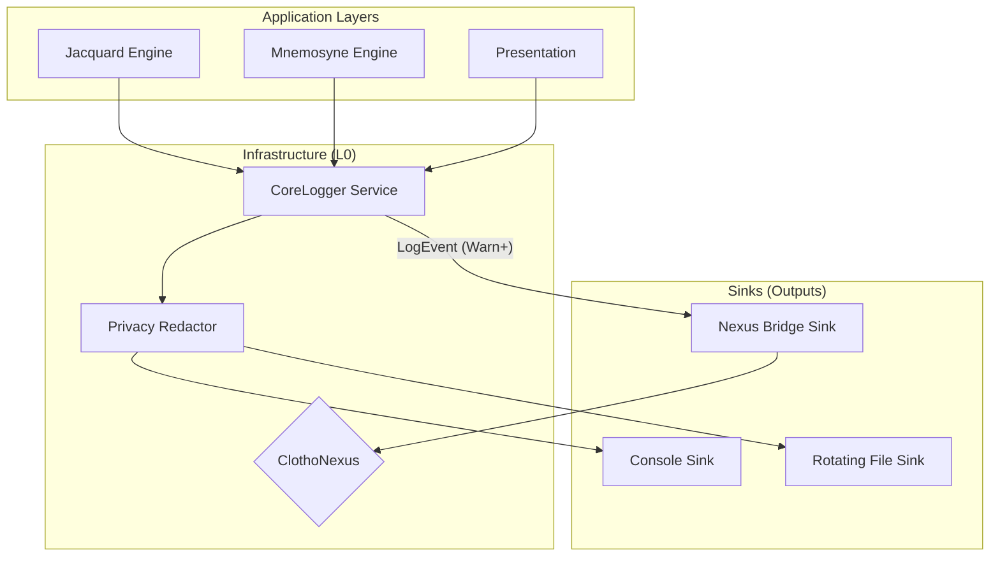

# Logging Standards (日志分级与输出规范)

**版本**: 1.0.0  
**日期**: 2026-02-12  
**状态**: Active  
**所属模块**: Infrastructure (L0)

---

## 1. 概述 (Overview)

日志服务是 Clotho 基础设施层（L0）的核心组件，负责提供统一、结构化、高性能的运行时记录能力。

鉴于 Clotho 作为纯客户端 Dart/Flutter 应用的特性，日志系统设计遵循以下核心原则：

1.  **独立性 (Independence)**: 日志服务是比 ClothoNexus 更底层的设施，不依赖事件总线即可工作，确保在系统故障时仍能保留现场。
2.  **混合分发 (Hybrid Dispatch)**: 采用"旁路模式"，常规日志直接输出，关键业务日志（Warning+）桥接到 Nexus 事件总线。
3.  **隐私优先 (Privacy First)**: 所有持久化日志默认进行脱敏处理，严格保护用户 API Key 和私密对话内容。
4.  **结构化 (Structured)**: 强制使用结构化日志格式，便于后续的机器解析和自动化分析。

---

## 2. 架构设计 (Architecture)

日志系统采用 **Sink-based** 架构，核心是一个单例的 `CoreLogger` 服务。



### 2.1 核心组件

*   **CoreLogger**: 全局单例入口，提供 `trace`, `debug`, `info`, `warn`, `error`, `fatal` 标准接口。
*   **Privacy Redactor**: 敏感信息过滤器，在日志写入任何 Sink 之前拦截并替换敏感模式（如 API Key）。
*   **Sinks**:
    *   **Console Sink**: 用于开发环境的标准输出 (`stdout`)。
    *   **File Sink**: 基于文件大小轮转的本地文件存储，用于持久化取证。
    *   **Nexus Bridge Sink**: 将高优先级的日志转换为 `SystemEvent` 发布到 ClothoNexus，供 UI 显示或触发自动化逻辑。

---

## 3. 日志分级 (Log Levels)

Clotho 采用标准的 6 级日志体系：

| 等级 | 缩写 | 描述 | 适用场景 (Example) | 生产环境策略 | Nexus 桥接 |
| :--- | :--- | :--- | :--- | :--- | :--- |
| **Trace** | `TRC` | 极低层细节 | 循环内部变量、I/O 字节数、锁状态 | 关闭 | 否 |
| **Debug** | `DBG` | 开发调试信息 | 组件初始化、状态变迁、逻辑分支 | 按需开启 | 否 |
| **Info** | `INF` | 关键业务里程碑 | 会话启动、Prompt 生成完毕、文件保存成功 | 开启 | 否 |
| **Warning**| `WRN` | 预期内的异常 | 网络超时重试、资源缺失(使用了Fallback)、配置项过时 | 开启 | **是** |
| **Error** | `ERR` | 预期外的故障 | 解析失败、数据库写入错误、未捕获异常 | 开启 | **是** |
| **Fatal** | `FTL` | 致命错误 | 应用即将崩溃、核心数据损坏 | 开启 | **是** |

---

## 4. 数据结构 (Data Schema)

所有日志必须包含以下标准字段：

```dart
class LogRecord {
  final LogLevel level;
  final DateTime timestamp;
  final String category;    // 模块分类 (e.g., "Jacquard.Planner")
  final String message;     // 人类可读消息
  final Object? error;      // 异常对象 (可选)
  final StackTrace? stack;  // 堆栈信息 (可选)
  final Map<String, Object>? context; // 结构化上下文 (可选)
}
```

### 4.1 Category 命名规范

使用点号分隔的命名空间，与目录结构保持一致：

*   `Infra.Storage`
*   `Infra.Network`
*   `Jacquard.Weaving`
*   `Jacquard.Planner`
*   `Mnemosyne.SQL`
*   `Muse.Gateway`
*   `UI.Stage`

---

## 5. 隐私与脱敏 (Privacy & Redaction)

由于 AI RPG 涉及极高的用户隐私，日志系统必须内置脱敏机制。

### 5.1 敏感字段清单 (Red List)
以下字段在写入文件或控制台前**必须**被替换：

1.  **API Keys**: `sk-proj-...`
2.  **Auth Tokens**: Bearer Tokens
3.  **Raw Prompts**: 发送给 LLM 的完整 Prompt（包含用户设定）。
4.  **User Inputs**: 用户的直接输入内容。

### 5.2 脱敏策略

*   **替换 (Masking)**: 将敏感串替换为 `***` 或部分掩码 (e.g., `sk-proj-****AbCd`).
*   **截断 (Truncation)**: 对于超长文本（如 Prompt），仅保留前 50 个字符。

```dart
// 示例：Redactor 逻辑
String redact(String input) {
  // 移除常见的 API Key 格式
  input = input.replaceAll(RegExp(r'sk-[a-zA-Z0-9]{20,}'), 'sk-***');
  return input;
}
```

---

## 6. 持久化策略 (Persistence)

为了支持事后调试（Post-mortem Analysis），同时不占用过多存储空间，采用 **Rotating File Strategy**。

### 6.1 配置参数

*   **Max File Size**: 5 MB
*   **Max Backup Index**: 5 (保留最近 5 个文件)
*   **File Name Format**: `clotho_app.log`, `clotho_app.1.log` ...
*   **Directory**: 
    *   Windows: `%APPDATA%\Clotho\Logs\`
    *   Android/iOS: `ApplicationDocumentsDirectory/logs/`

---

## 7. 接口定义 (Interface Definition)

```dart
abstract class ICoreLogger {
  void trace(String message, {String? category, Map<String, Object>? context});
  void debug(String message, {String? category, Map<String, Object>? context});
  void info(String message, {String? category, Map<String, Object>? context});
  void warn(String message, {Object? error, StackTrace? stack, String? category});
  void error(String message, {Object? error, StackTrace? stack, String? category});
  void fatal(String message, {Object? error, StackTrace? stack, String? category});
}
```

### 7.1 与 Nexus 的集成示例

```dart
class NexusBridgeSink extends LogSink {
  final IClothoNexus _nexus;

  NexusBridgeSink(this._nexus);

  @override
  void write(LogRecord record) {
    if (record.level >= LogLevel.warning) {
      _nexus.publish(SystemErrorEvent(
        code: record.level.name,
        message: record.message,
        details: record.error?.toString(),
      ));
    }
  }
}
```