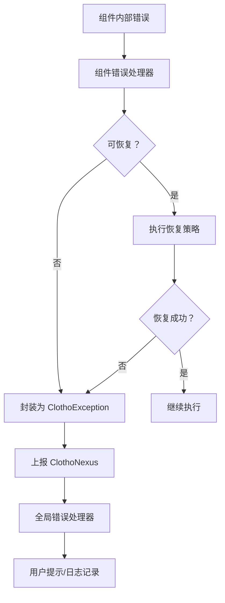

# 模块错误处理策略详解 (Module Error Handling Strategies)

**版本**: 1.0.0
**日期**: 2026-02-26
**状态**: Active
**作者**: Clotho 架构团队
**关联文档**:
- [`error-handling-and-cancellation.md`](error-handling-and-cancellation.md) - 通用错误处理框架
- [`clotho-nexus-events.md`](clotho-nexus-events.md) - 事件总线规范
- [`logging-standards.md`](logging-standards.md) - 日志规范

---

## 1. 概述 (Overview)

本文档是 [`error-handling-and-cancellation.md`](error-handling-and-cancellation.md) 的补充规范，针对架构审计中发现的 H-02 问题（错误处理机制在关键模块缺失），为以下关键模块定义详细的错误处理策略：

1. **Jacquard Pipeline** - 编排层流水线
2. **Filament Parser** - 协议解析器
3. **Mnemosyne OpLog** - 数据引擎操作日志
4. **Muse Gateway** - 智能服务网关

---

## 2. 统一错误传播架构 (Unified Error Propagation Architecture)

所有模块遵循统一的错误传播链：



---

## 3. Jacquard Pipeline 错误处理策略

### 3.1 错误分类与响应

| 错误类型 | 错误码 | 触发条件 | 恢复策略 | 升级条件 |
| :--- | :--- | :--- | :--- | :--- |
| **PluginCrash** | `3002` | 插件执行抛出未捕获异常 | 跳过该插件，记录错误日志 | 连续 3 个插件崩溃 |
| **PipelineTimeout** | `3004` | Pipeline 执行超过预设时限 | 中止当前执行，回滚状态 | - |
| **SkeinBuildFailure** | `3005` | Skein 构建失败 | 重试构建（最多 2 次） | 重试后仍失败 |
| **TemplateRenderError** | `3001` | Jinja2 模板渲染失败 | 使用降级模板 | 降级模板也失败 |
| **MaxCorrectionsExceeded** | `3003` | 自我修正次数超限 | 终止生成，返回部分结果 | - |

### 3.2 Pipeline 错误处理器

```dart
/// Jacquard Pipeline 错误处理器
class PipelineErrorHandler {
  final IClothoNexus _nexus;
  final ICoreLogger _logger;
  
  /// 插件执行错误处理
  Future<void> handlePluginError(
    JacquardPlugin plugin,
    Object error,
    StackTrace stack,
    JacquardContext context,
  ) async {
    // 1. 记录错误
    _logger.error(
      'Plugin crashed: ${plugin.id}',
      error: error,
      stack: stack,
      category: 'Jacquard.Pipeline',
    );
    
    // 2. 发布错误事件
    _nexus.publish(SystemErrorEvent(
      code: '3002',
      message: '插件执行失败：${plugin.id}',
      severity: ErrorSeverity.warning,
      userActionable: false,
    ));
    
    // 3. 决策：跳过还是中止
    if (plugin is RequiredPlugin) {
      // 关键插件崩溃，中止 Pipeline
      context.abort();
      await _rollbackState(context);
    } else {
      // 非关键插件，跳过继续执行
      _logger.warn('Skipping non-critical plugin: ${plugin.id}');
    }
  }
  
  /// 状态回滚
  Future<void> _rollbackState(JacquardContext context) async {
    // 通知 Mnemosyne 丢弃 Draft Patch
    await context.mnemosyne.discardPendingChanges(context.sessionId);
  }
}
```

### 3.3 Pipeline 执行器错误包装

```dart
class PipelineExecutor {
  final PipelineErrorHandler _errorHandler;
  
  Future<void> execute(JacquardContext context) async {
    final cancelToken = CancelToken();
    
    try {
      for (final plugin in _plugins) {
        if (cancelToken.isCancelled) {
          _logger.info('Pipeline cancelled by user');
          return;
        }
        
        try {
          await plugin.execute(context);
        } catch (error, stack) {
          await _errorHandler.handlePluginError(
            plugin,
            error,
            stack,
            context,
          );
          
          if (context.isAborted) {
            throw PipelineAbortedException('Pipeline aborted due to plugin error');
          }
        }
      }
    } on PipelineTimeoutException catch (e) {
      // Pipeline 超时处理
      _nexus.publish(SystemErrorEvent(
        code: '3004',
        message: 'Pipeline 执行超时',
        severity: ErrorSeverity.error,
        userActionable: true,
      ));
      rethrow;
    } catch (e, stack) {
      // 未知错误，封装后上报
      _nexus.publish(SystemErrorEvent(
        code: '3999',
        message: 'Pipeline 执行失败：$e',
        severity: ErrorSeverity.fatal,
        userActionable: true,
      ));
      rethrow;
    }
  }
}
```

---

## 4. Filament Parser 错误处理策略

### 4.1 错误分类与响应

| 错误类型 | 错误码 | 触发条件 | 恢复策略 | 升级条件 |
| :--- | :--- | :--- | :--- | :--- |
| **MalformedXML** | `3101` | XML 结构不完整或标签未闭合 | 流式模糊修正 (Fuzzy Correction) | 修正失败 |
| **InvalidJSON** | `3102` | JSON 格式错误 | 尝试修复 JSON，使用默认值 | 修复失败 |
| **SchemaViolation** | `3103` | 违反 ESR 约束 | 降级为纯文本处理 | - |
| **UnknownTag** | `3104` | 未注册的标签 | 视为普通文本 | - |
| **ESREmpty** | `3105` | ESR 注册表为空 | 使用默认 Core Schema | - |

### 4.2 期望结构注册表 (ESR) 降级策略

```dart
class FilamentParser {
  ExpectedStructureRegistry? _esr;
  
  /// 初始化 ESR
  void initializeESR(JacquardContext context) {
    // 1. 尝试从 blackboard 读取 ESR
    final esrData = context.blackboard['expected_structure_registry'];
    
    if (esrData == null) {
      // ESR 为空，使用默认 Core Schema
      _logger.warn('ESR is empty, using default Core Schema');
      _esr = ExpectedStructureRegistry.defaultCore();
      
      // 发布警告事件
      _nexus.publish(SystemErrorEvent(
        code: '3105',
        message: 'ESR 注册表为空，使用默认配置',
        severity: ErrorSeverity.warning,
        userActionable: false,
      ));
    } else {
      _esr = ExpectedStructureRegistry.fromJson(esrData);
    }
  }
  
  /// 标签分类（带容错）
  TagType classifyTag(String tag) {
    if (_esr == null) {
      return TagType.unknown;
    }
    
    // 1. 检查是否注册
    if (_esr!.expectedTags.contains(tag)) {
      return _isCoreTag(tag) ? TagType.core : TagType.extension;
    }
    
    // 2. 尝试模糊匹配
    final match = _attemptFuzzyMatch(tag, _esr!);
    if (match != null) {
      _logger.debug('Fuzzy matched tag: $tag -> $match');
      return TagType.extension;
    }
    
    // 3. 未匹配，视为普通文本
    return TagType.unknown;
  }
  
  /// 模糊匹配
  String? _attemptFuzzyMatch(String tag, ExpectedStructureRegistry esr) {
    // 计算编辑距离
    for (final expectedTag in esr.expectedTags) {
      final distance = _levenshteinDistance(tag, expectedTag);
      if (distance <= esr.policies.fuzzyThreshold) {
        return expectedTag;
      }
    }
    return null;
  }
}
```

### 4.3 流式模糊修正器

```dart
class StreamingFuzzyCorrector {
  /// 自动补全缺失的标签
  String autoCloseTags(String input, List<String> openTags) {
    final buffer = StringBuffer(input);
    
    // 从后向前闭合未闭合的标签
    for (final tag in openTags.reversed) {
      if (!input.contains('</$tag>')) {
        buffer.write('</$tag>');
        _logger.debug('Auto-closed tag: $tag');
      }
    }
    
    return buffer.toString();
  }
  
  /// 修复常见 JSON 错误
  String? fixJSON(String jsonInput) {
    try {
      // 尝试直接解析
      jsonDecode(jsonInput);
      return jsonInput;
    } catch (e) {
      // 尝试修复
      String fixed = jsonInput;
      
      // 修复 1: 移除末尾逗号
      fixed = fixed.replaceAll(RegExp(r',\s*}'), '}');
      fixed = fixed.replaceAll(RegExp(r',\s*]'), ']');
      
      // 修复 2: 添加缺失的引号
      fixed = fixed.replaceAll(RegExp(r'(\w+):'), '"$1":');
      
      // 修复 3: 替换单引号为双引号
      fixed = fixed.replaceAll("'", '"');
      
      // 验证修复结果
      try {
        jsonDecode(fixed);
        _logger.info('JSON auto-corrected');
        return fixed;
      } catch (e2) {
        _logger.warn('JSON correction failed: $e2');
        return null;
      }
    }
  }
}
```

### 4.4 解析器状态机错误处理

```dart
enum ParserState {
  idle,
  parsingContent,
  parsingThought,
  parsingVariableUpdate,
  error,
}

class FilamentParserStateMachine {
  ParserState _state = ParserState.idle;
  final List<String> _openTags = [];
  
  void onToken(String token) {
    try {
      switch (_state) {
        case ParserState.idle:
          _handleIdleState(token);
          break;
        case ParserState.parsingContent:
          _handleContent(token);
          break;
        case ParserState.parsingThought:
          _handleThought(token);
          break;
        case ParserState.parsingVariableUpdate:
          _handleVariableUpdate(token);
          break;
        case ParserState.error:
          // 错误状态下丢弃所有输入
          break;
      }
    } on ParseException catch (e) {
      _state = ParserState.error;
      _handleParseError(e);
    }
  }
  
  void _handleParseError(ParseException e) {
    // 发布错误事件
    _nexus.publish(SystemErrorEvent(
      code: '3101',
      message: '解析失败：${e.message}',
      severity: ErrorSeverity.error,
      userActionable: false,
    ));
    
    // 尝试恢复：丢弃当前缓冲区，等待下一个完整标签
    _buffer.clear();
    _openTags.clear();
    _state = ParserState.idle;
  }
}
```

---

## 5. Mnemosyne OpLog 错误处理策略

### 5.1 错误分类与响应

| 错误类型 | 错误码 | 触发条件 | 恢复策略 | 升级条件 |
| :--- | :--- | :--- | :--- | :--- |
| **OpLogApplyFailure** | `4003` | OpLog 应用失败（路径不存在/类型不匹配） | 跳过该 OpLog，记录错误 | 连续 5 次失败 |
| **SnapshotCorruption** | `4004` | 快照数据损坏 | 使用更早的快照 + 重放 OpLog | 无可用快照 |
| **ConstraintViolation** | `4001` | 违反数据库约束 | 回滚事务 | - |
| **MigrationFailed** | `4002` | 数据迁移失败 | 回滚到迁移前状态 | - |
| **StateInconsistency** | `4005` | Head State 与 OpLog 不一致 | 重建 Head State | 重建失败 |

### 5.2 OpLog 应用错误处理

```dart
class OpLogApplier {
  final ICoreLogger _logger;
  final IClothoNexus _nexus;
  
  /// 应用单个 OpLog（带错误处理）
  Future<ApplyResult> applyOpLog(
    StateOpLog oplog,
    StateTree tree,
  ) async {
    try {
      final path = JsonPath(oplog.path);
      
      switch (oplog.operation) {
        case 'replace':
          return _applyReplace(path, oplog.value, tree);
        case 'add':
          return _applyAdd(path, oplog.value, tree);
        case 'remove':
          return _applyRemove(path, tree);
        default:
          throw UnknownOpException('Unknown operation: ${oplog.operation}');
      }
    } on PathNotFoundException catch (e) {
      // 路径不存在
      _logger.warn('OpLog path not found: ${oplog.path}');
      
      _nexus.publish(SystemErrorEvent(
        code: '4003',
        message: 'OpLog 应用失败：路径不存在',
        technicalDetails: 'Path: ${oplog.path}, Op: ${oplog.operation}',
        severity: ErrorSeverity.warning,
        userActionable: false,
      ));
      
      return ApplyResult.skipped(oplog, reason: 'Path not found');
    } on TypeMismatchException catch (e) {
      // 类型不匹配
      _logger.warn('OpLog type mismatch: ${oplog.path}');
      
      return ApplyResult.skipped(oplog, reason: 'Type mismatch');
    } catch (e, stack) {
      // 未知错误
      _logger.error(
        'OpLog apply failed',
        error: e,
        stack: stack,
        category: 'Mnemosyne.OpLog',
      );
      
      _nexus.publish(SystemErrorEvent(
        code: '4003',
        message: 'OpLog 应用失败',
        technicalDetails: e.toString(),
        severity: ErrorSeverity.error,
        userActionable: false,
      ));
      
      return ApplyResult.failed(oplog, error: e);
    }
  }
  
  /// 批量应用 OpLogs（原子性保证）
  Future<BatchApplyResult> applyBatch(
    List<StateOpLog> oplogs,
    StateTree tree,
  ) async {
    final results = <ApplyResult>[];
    final checkpoint = tree.createCheckpoint();
    
    try {
      for (final oplog in oplogs) {
        final result = await applyOpLog(oplog, tree);
        results.add(result);
        
        if (result.isFailed && result.isCritical) {
          // 关键错误，回滚
          tree.restoreCheckpoint(checkpoint);
          return BatchApplyResult.failed(results, rolledBack: true);
        }
      }
      
      return BatchApplyResult.success(results);
    } catch (e) {
      // 异常，回滚
      tree.restoreCheckpoint(checkpoint);
      rethrow;
    }
  }
}
```

### 5.3 快照损坏恢复策略

```dart
class SnapshotRecoveryStrategy {
  final ICoreLogger _logger;
  
  /// 从损坏的快照中恢复
  Future<StateTree> recoverFromCorruption({
    required String sessionId,
    required StateSnapshot corruptedSnapshot,
  }) async {
    _logger.error('Snapshot corruption detected for session: $sessionId');
    
    // 1. 尝试加载上一个有效快照
    final previousSnapshot = await _loadPreviousSnapshot(sessionId);
    
    if (previousSnapshot != null) {
      _logger.info('Recovered from previous snapshot');
      
      // 2. 重放 OpLogs
      final oplogs = await _loadOpLogsSince(previousSnapshot.turnId);
      final tree = StateTree.fromJson(previousSnapshot.stateJson);
      
      final applier = OpLogApplier(_logger, _nexus);
      await applier.applyBatch(oplogs, tree);
      
      return tree;
    }
    
    // 3. 无可用快照，从初始状态重建
    _logger.warn('No valid snapshot available, rebuilding from initial state');
    
    final initialState = await _loadInitialState(sessionId);
    final allOplogs = await _loadAllOpLogs(sessionId);
    
    final tree = StateTree.fromJson(initialState);
    final applier = OpLogApplier(_logger, _nexus);
    await applier.applyBatch(allOplogs, tree);
    
    return tree;
  }
  
  /// 验证快照完整性
  bool validateSnapshot(StateSnapshot snapshot) {
    try {
      // 验证 JSON 格式
      final json = jsonDecode(snapshot.stateJson);
      
      // 验证必需字段
      if (json is! Map) return false;
      if (!json.containsKey('character')) return false;
      
      // 验证版本哈希
      final computedHash = _computeHash(snapshot.stateJson);
      return computedHash == snapshot.versionHash;
    } catch (e) {
      return false;
    }
  }
}
```

### 5.4 Head State 一致性检查

```dart
class HeadStateConsistencyChecker {
  /// 检查 Head State 与 OpLog 的一致性
  Future<ConsistencyResult> checkConsistency({
    required String sessionId,
    required StateTree headState,
    required int headTurnId,
  }) async {
    // 1. 获取 Head State 之后的所有 OpLogs
    final oplogs = await _loadOpLogsSince(headTurnId);
    
    if (oplogs.isEmpty) {
      return ConsistencyResult.consistent;
    }
    
    // 2. 在副本上应用 OpLogs
    final testTree = headState.clone();
    final applier = OpLogApplier(_logger, _nexus);
    
    try {
      final result = await applier.applyBatch(oplogs, testTree);
      
      if (result.hasFailures) {
        // 3. 不一致，需要重建
        _logger.warn('Head State inconsistency detected');
        
        _nexus.publish(SystemErrorEvent(
          code: '4005',
          message: 'Head State 与 OpLog 不一致',
          severity: ErrorSeverity.warning,
          userActionable: false,
        ));
        
        return ConsistencyResult.inconsistent(
          reason: 'OpLog application failed',
          failedOpLogs: result.failedOpLogs,
        );
      }
      
      return ConsistencyResult.consistent;
    } catch (e) {
      return ConsistencyResult.inconsistent(
        reason: 'Exception during consistency check',
        error: e,
      );
    }
  }
  
  /// 重建 Head State
  Future<StateTree> rebuildHeadState(String sessionId) async {
    _logger.info('Rebuilding Head State for session: $sessionId');
    
    // 1. 加载最近的快照
    final snapshot = await _loadLatestSnapshot(sessionId);
    
    if (snapshot == null) {
      // 无快照，从初始状态开始
      final initialState = await _loadInitialState(sessionId);
      final allOplogs = await _loadAllOpLogs(sessionId);
      
      final tree = StateTree.fromJson(initialState);
      final applier = OpLogApplier(_logger, _nexus);
      await applier.applyBatch(allOplogs, tree);
      
      return tree;
    }
    
    // 2. 快照 + OpLogs
    final oplogs = await _loadOpLogsSince(snapshot.turnId);
    final tree = StateTree.fromJson(snapshot.stateJson);
    
    final applier = OpLogApplier(_logger, _nexus);
    await applier.applyBatch(oplogs, tree);
    
    return tree;
  }
}
```

---

## 6. Muse Gateway 错误处理策略

### 6.1 错误分类与响应

| 错误类型 | 错误码 | 触发条件 | 恢复策略 | 升级条件 |
| :--- | :--- | :--- | :--- | :--- |
| **ProviderOverload** | `2001` | Provider 返回 429/503 | 指数退避重试 | 重试超限 |
| **ContextLimitExceeded** | `2002` | Token 超出上下文限制 | 自动裁剪上下文 | 裁剪后仍超限 |
| **SafetyFilterTriggered** | `2003` | 触发安全过滤 | 修改 Prompt 重试 | 重试后仍触发 |
| **InvalidAPIKey** | `2010` | API Key 无效 | 提示用户更新配置 | - |
| **QuotaExhausted** | `2011` | 额度耗尽 | 提示用户充值 | - |
| **ModelUnavailable** | `2012` | 模型下线 | 切换到备用模型 | 无备用模型 |

### 6.2 重试策略与熔断器

```dart
class MuseGatewayWithRetry {
  final RetryPolicy _retryPolicy;
  final CircuitBreaker _circuitBreaker;
  final ICoreLogger _logger;
  final IClothoNexus _nexus;
  
  Future<LLMResponse> executeWithRetry(
    LLMRequest request,
  ) async {
    int attempt = 0;
    Exception? lastException;
    
    while (attempt < _retryPolicy.maxAttempts) {
      try {
        // 检查熔断器状态
        if (_circuitBreaker.state == CircuitState.open) {
          throw CircuitOpenException(
            'Circuit breaker is open for provider: ${request.provider}',
          );
        }
        
        // 执行请求
        final response = await _executeRequest(request);
        
        // 成功，关闭熔断器
        _circuitBreaker.recordSuccess();
        return response;
        
      } on RateLimitException catch (e) {
        lastException = e;
        attempt++;
        
        // 记录失败
        _circuitBreaker.recordFailure();
        
        if (attempt < _retryPolicy.maxAttempts) {
          final delay = _calculateBackoff(attempt, e.retryAfter);
          _logger.warn(
            'Rate limited, retrying in ${delay.inSeconds}s (attempt $attempt)',
          );
          await Future.delayed(delay);
        }
        
      } on InvalidRequestException catch (e) {
        // 无效请求，不重试
        _logger.error('Invalid request: ${e.message}');
        
        _nexus.publish(SystemErrorEvent(
          code: '2004',
          message: '请求无效：${e.message}',
          severity: ErrorSeverity.error,
          userActionable: true,
        ));
        rethrow;
        
      } on AuthenticationException catch (e) {
        // 认证失败，不重试
        _logger.error('Authentication failed: ${e.message}');
        
        _nexus.publish(SystemErrorEvent(
          code: '2010',
          message: 'API 认证失败',
          severity: ErrorSeverity.fatal,
          userActionable: true,
        ));
        rethrow;
        
      } catch (e, stack) {
        lastException = e as Exception;
        _logger.error(
          'Unexpected error in Muse Gateway',
          error: e,
          stack: stack,
          category: 'Muse.Gateway',
        );
        
        // 未知错误，记录失败但不重试
        _circuitBreaker.recordFailure();
        break;
      }
    }
    
    // 重试耗尽
    _logger.error('Max retry attempts exceeded');
    
    _nexus.publish(SystemErrorEvent(
      code: '2001',
      message: '请求失败：重试次数超限',
      technicalDetails: lastException?.toString(),
      severity: ErrorSeverity.error,
      userActionable: true,
    ));
    
    throw MaxRetryExceededException(
      'Max retry attempts (${_retryPolicy.maxAttempts}) exceeded',
      lastException,
    );
  }
  
  /// 计算退避延迟
  Duration _calculateBackoff(int attempt, Duration? retryAfter) {
    if (retryAfter != null) {
      return retryAfter;
    }
    
    // 指数退避 + 抖动
    final baseDelay = _retryPolicy.baseDelay;
    final exponentialDelay = baseDelay * pow(2, attempt - 1);
    final jitter = Duration(milliseconds: Random().nextInt(1000));
    
    return (exponentialDelay + jitter).clamp(
      baseDelay,
      _retryPolicy.maxDelay,
    );
  }
}
```

### 6.3 熔断器实现

```dart
class CircuitBreaker {
  final Duration slidingWindow;
  final int failureThreshold;
  final Duration openTimeout;
  
  CircuitState _state = CircuitState.closed;
  DateTime? _openedAt;
  int _failureCount = 0;
  int _successCount = 0;
  
  CircuitState get state {
    if (_state == CircuitState.open) {
      // 检查是否应该进入半开状态
      if (DateTime.now().difference(_openedAt!) >= openTimeout) {
        _state = CircuitState.halfOpen;
        _logger.info('Circuit breaker entering half-open state');
      }
    }
    return _state;
  }
  
  void recordSuccess() {
    _failureCount = 0;
    _successCount++;
    
    if (_state == CircuitState.halfOpen) {
      _state = CircuitState.closed;
      _logger.info('Circuit breaker closed after successful request');
    }
  }
  
  void recordFailure() {
    _failureCount++;
    
    if (_state == CircuitState.halfOpen) {
      // 半开状态下失败，立即打开
      _open();
    } else if (_failureCount >= failureThreshold) {
      _open();
    }
  }
  
  void _open() {
    _state = CircuitState.open;
    _openedAt = DateTime.now();
    _failureCount = 0;
    
    _logger.warn(
      'Circuit breaker opened after $_failureCount failures',
    );
    
    _nexus.publish(SystemErrorEvent(
      code: '2005',
      message: 'Provider 熔断器已打开',
      severity: ErrorSeverity.warning,
      userActionable: true,
    ));
  }
}

enum CircuitState {
  closed,    // 正常状态
  open,      // 熔断状态
  halfOpen,  // 半开状态（尝试恢复）
}
```

### 6.4 上下文超限自动裁剪

```dart
class ContextLimitHandler {
  final int maxTokens;
  final ICoreLogger _logger;
  
  /// 自动裁剪上下文以适应限制
  Future<List<Message>> trimContext(
    List<Message> messages,
    int currentTokenCount,
  ) async {
    if (currentTokenCount <= maxTokens) {
      return messages;
    }
    
    _logger.warn(
      'Context limit exceeded: $currentTokenCount > $maxTokens',
    );
    
    _nexus.publish(SystemErrorEvent(
      code: '2002',
      message: '上下文超出限制，自动裁剪中',
      severity: ErrorSeverity.warning,
      userActionable: false,
    ));
    
    List<Message> trimmed = List.from(messages);
    
    // 策略 1: 移除最早的对话（保留最近的）
    while (_countTokens(trimmed) > maxTokens && trimmed.length > 2) {
      // 保留第一条（通常是 System）和最后一条
      trimmed.removeAt(1);
      _logger.debug('Removed oldest message to reduce tokens');
    }
    
    // 策略 2: 如果仍然超限，裁剪消息内容
    if (_countTokens(trimmed) > maxTokens) {
      trimmed = _truncateMessages(trimmed);
    }
    
    // 策略 3: 如果还是超限，移除思维链
    if (_countTokens(trimmed) > maxTokens) {
      trimmed = _removeThoughts(trimmed);
    }
    
    final finalCount = _countTokens(trimmed);
    _logger.info(
      'Context trimmed: $currentTokenCount -> $finalCount tokens',
    );
    
    return trimmed;
  }
  
  List<Message> _truncateMessages(List<Message> messages) {
    // 按比例裁剪每条消息
    final targetPerMessage = maxTokens ~/ messages.length;
    
    return messages.map((msg) {
      if (msg.content.length > targetPerMessage) {
        return msg.copyWith(
          content: msg.content.substring(0, targetPerMessage) + '...',
        );
      }
      return msg;
    }).toList();
  }
  
  List<Message> _removeThoughts(List<Message> messages) {
    return messages
        .where((msg) => msg.type != MessageType.thought)
        .toList();
  }
  
  int _countTokens(List<Message> messages) {
    // 简化的 token 计数（实际应使用 tokenizer）
    return messages.fold(
      0,
      (sum, msg) => sum + (msg.content.length ~/ 4),
    );
  }
}
```

---

## 7. 错误事件集成 (Error Event Integration)

### 7.1 错误事件到 ClothoNexus 的映射

所有模块的错误事件统一通过 ClothoNexus 广播：

```dart
class ErrorEventMapper {
  final IClothoNexus _nexus;
  
  void publishModuleError({
    required String module,
    required String errorCode,
    required String message,
    required ErrorSeverity severity,
    String? technicalDetails,
    bool userActionable = false,
  }) {
    _nexus.publish(SystemErrorEvent(
      code: errorCode,
      message: message,
      technicalDetails: technicalDetails,
      severity: severity,
      userActionable: userActionable,
      metadata: {
        'module': module,
        'timestamp': DateTime.now().millisecondsSinceEpoch,
      },
    ));
  }
}
```

### 7.2 错误严重性分级响应

| 严重性 | 用户提示 | 日志级别 | 自动上报 |
|--------|----------|----------|----------|
| **Info** | 不提示 | Debug | 否 |
| **Warning** | Toast 轻提示 | Warning | 否 |
| **Error** | Snackbar 错误提示 | Error | 可选 |
| **Fatal** | 模态错误对话框 | Fatal | 是 |

---

## 8. 错误处理验证清单 (Error Handling Validation Checklist)

在实现每个模块的错误处理时，应验证以下项目：

### 8.1 通用检查项

- [ ] 所有公共方法都有 try-catch 包装
- [ ] 错误被正确记录到日志系统
- [ ] 适当的错误事件发布到 ClothoNexus
- [ ] 错误码符合统一规范
- [ ] 用户可见的错误消息已本地化

### 8.2 模块特定检查项

#### Jacquard Pipeline
- [ ] 插件崩溃不会导致整个 Pipeline 崩溃
- [ ] 关键插件失败时正确回滚状态
- [ ] Pipeline 超时正确处理

#### Filament Parser
- [ ] ESR 为空时有降级策略
- [ ] 模糊修正器能处理常见错误
- [ ] 未知标签正确处理为普通文本

#### Mnemosyne OpLog
- [ ] OpLog 应用失败不影响数据一致性
- [ ] 快照损坏时能恢复
- [ ] Head State 不一致时能重建

#### Muse Gateway
- [ ] 重试策略正确配置
- [ ] 熔断器正常工作
- [ ] 上下文超限自动裁剪

---

**最后更新**: 2026-02-26  
**维护者**: Clotho 架构团队
