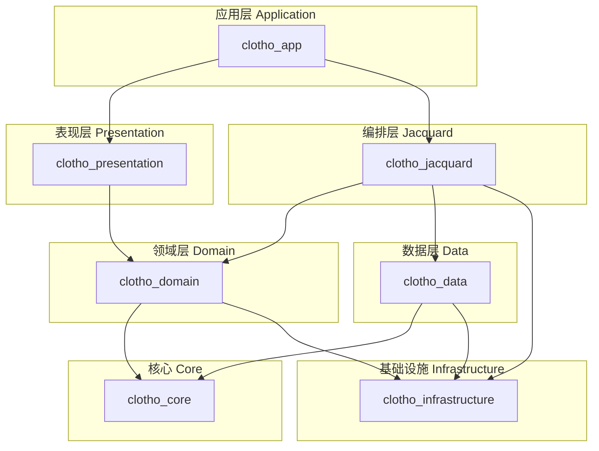
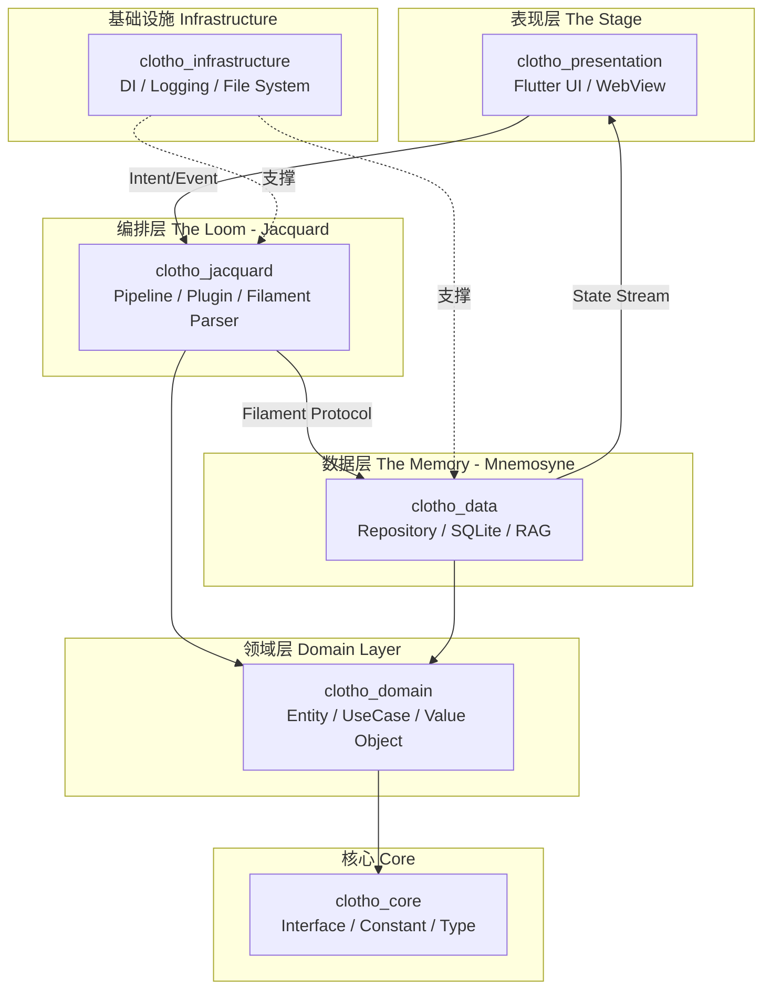

# 多包架构设计 (Multi-Package Architecture)

**版本**: 1.0.0
**日期**: 2026-02-26
**状态**: Draft
**作者**: Clotho 架构团队

---

## 1. 概述 (Overview)

多包架构（Multi-Package Architecture）是 Clotho Flutter 客户端的物理组织策略，旨在将单体应用拆分为多个职责单一、依赖明确的独立 Dart 包。该架构通过**物理隔离实现逻辑解耦**，完美契合 [凯撒原则](../vision-and-philosophy.md#2-设计哲学 - 凯撒原则-the-caesar-principle) 的核心思想。

### 1.1 问题域

当前单体应用结构存在以下技术债务：

| 问题 | 优先级 | 影响范围 |
|------|--------|----------|
| 单体应用结构 | 🟡 中 | 模块解耦困难、团队协作效率低 |
| 缺乏依赖注入容器 | 🔴 高 | 可测试性、可维护性差 |

### 1.2 设计目标

1. **物理隔离** - 各层代码位于独立包中，通过依赖关系约束保证架构纯净
2. **向下依赖** - 依赖方向严格单向，禁止循环依赖
3. **独立测试** - 各包可独立进行单元测试和集成测试
4. **并行开发** - 不同团队可并行开发不同包，减少代码冲突

---

## 2. 架构结构 (Architecture Structure)

### 2.1 Monorepo 目录结构

采用 Melos 管理的 monorepo 结构：

```yaml
clotho/
├── packages/
│   ├── clotho_core/              # 核心库（接口定义、常量）
│   ├── clotho_infrastructure/    # 基础设施（DI、日志、错误处理）
│   ├── clotho_data/              # 数据层（Mnemosyne、Repository）
│   ├── clotho_domain/            # 领域层（实体、用例）
│   ├── clotho_jacquard/          # 编排层（Jacquard、Plugin）
│   ├── clotho_presentation/      # 表现层（UI 组件）
│   └── clotho_app/              # 应用入口
├── packages_dev/
│   ├── lint_rules/              # 代码规范
│   └── build_runner/            # 代码生成配置
└── melos.yaml                   # Melos 配置
```

### 2.2 各包职责

| 包名 | 职责 | 对应 Clotho 子系统 | 主要依赖 |
|------|------|-------------------|----------|
| **`clotho_core`** | 接口定义、常量、基础类型 | 跨层 | `flutter`, `meta` |
| **`clotho_infrastructure`** | DI 容器、日志、错误处理、文件系统抽象 | Infrastructure | `get_it`, `injectable`, `logger` |
| **`clotho_domain`** | 实体 (Entity)、用例 (UseCase)、值对象 | 领域层 | `clotho_core`, `freezed` |
| **`clotho_data`** | Repository 实现、SQLite、RAG 检索 | Mnemosyne | `clotho_domain`, `sqflite`, `drift` |
| **`clotho_jacquard`** | Pipeline、Plugin、Skein、Filament 解析 | Jacquard | `clotho_domain`, `clotho_infrastructure`, `xml`, `yaml` |
| **`clotho_presentation`** | UI 组件、主题、设计令牌 | The Stage | `flutter`, `flutter_riverpod` |
| **`clotho_app`** | 应用入口、平台特定代码、路由 | 应用层 | 所有上述包 |

### 2.3 依赖关系图



---

## 3. 与三层架构的映射 (Mapping to Three-Layer Architecture)

根据 [架构原则](../architecture-principles.md#21-三层物理隔离) 定义的三层物理隔离架构：



### 3.1 各层约束

| 层 | 包 | 约束 |
|----|-----|------|
| **表现层** | `clotho_presentation` | ✅ 仅负责渲染和用户交互<br>❌ **严禁包含业务逻辑** |
| **编排层** | `clotho_jacquard` | ✅ 负责流程控制和 Prompt 组装<br>✅ 确定性编排 |
| **数据层** | `clotho_data` | ✅ 负责数据存储和检索<br>✅ **唯一状态源** |
| **领域层** | `clotho_domain` | ✅ 定义业务实体和用例<br>❌ 不包含技术实现细节 |
| **核心层** | `clotho_core` | ✅ 定义接口和常量<br>❌ 不包含业务逻辑 |
| **基础设施** | `clotho_infrastructure` | ✅ 提供跨平台抽象<br>✅ 依赖注入容器 |

---

## 4. 依赖注入设计 (Dependency Injection Design)

依赖注入的详细规范定义在 **[依赖注入规范](dependency-injection.md)** 文档中，包括：

### 4.1 技术选型

| 工具 | 用途 | 版本 |
|------|------|------|
| `get_it` | 服务定位器 | ^7.6.0 |
| `injectable` | 代码生成注解 | ^2.3.0 |
| `flutter_riverpod` | UI 状态管理 | ^2.4.9 |

### 4.2 混合 DI 架构

采用 **GetIt（核心层） + Riverpod（UI 层）** 的混合架构。

**详细说明**: 请参阅 **[依赖注入规范](dependency-injection.md#2-依赖注入架构全景-di-architecture-overview)**。

### 4.3 服务注册

**详细说明**: 请参阅 **[依赖注入规范](dependency-injection.md#3-getit-容器配置-getit-container-configuration)**。

### 4.4 Riverpod Provider 配置

**详细说明**: 请参阅 **[依赖注入规范](dependency-injection.md#4-riverpod-provider-配置-riverpod-provider-configuration)**。

### 4.5 跨包依赖注入模式

**详细说明**: 请参阅 **[依赖注入规范](dependency-injection.md#5-跨包依赖注入模式-inter-package-di-patterns)**。

### 4.6 依赖验证

**详细说明**: 请参阅 **[依赖注入规范](dependency-injection.md#6-依赖注入验证-dependency-injection-validation)**。

---

## 5. 包通信机制 (Inter-Package Communication)

### 5.1 通信方式

| 方式 | 适用场景 | 实现 |
|------|----------|------|
| **接口依赖** | 跨包服务调用 | 通过 `clotho_core` 定义接口 |
| **事件总线** | 异步解耦通信 | ClothoNexus 事件总线 |
| **流式数据** | 状态同步 | `Stream<T>` + Riverpod |

根据 **[依赖注入规范](dependency-injection.md)** 定义的跨包依赖注入模式，所有跨包调用应：

1. 通过 `clotho_core` 定义的接口进行
2. 实现细节对调用方透明
3. 依赖方向严格从外层指向内层

### 5.2 事件类型

根据 [ClothoNexus 事件总线规范](./clotho-nexus-events.md)：

| 事件类别 | 事件类型 | 用途 |
|----------|----------|------|
| `SystemEvent` | `AppStarted`, `AppResumed` | 应用生命周期 |
| `SessionEvent` | `SessionCreated`, `SessionLoaded` | 织卷 (Tapestry) 管理 |
| `MessageEvent` | `MessageSent`, `MessageReceived` | 丝络 (Threads) 管理 |
| `DataEvent` | `DataUpdated`, `DataDeleted` | 数据变更通知 |

---

## 6. 实施计划 (Implementation Plan)

### 6.1 阶段一：基础架构重构

根据 [Flutter 开发路线图](../../02_active_plans/flutter-development-roadmap.md#51-阶段一基础架构完善)：

| 任务 | 工期 | 依赖 | 优先级 |
|------|------|------|--------|
| 创建 Melos 配置 | 1 天 | 无 | 🔴 P0 |
| 拆分 `clotho_core` | 1 天 | Melos 配置 | 🔴 P0 |
| 拆分 `clotho_infrastructure` | 1 天 | `clotho_core` | 🔴 P0 |
| 拆分 `clotho_domain` | 1 天 | `clotho_domain` | 🔴 P0 |
| 拆分 `clotho_data` | 2 天 | `clotho_domain` | 🔴 P0 |
| 拆分 `clotho_jacquard` | 2 天 | `clotho_domain`, `clotho_infrastructure` | 🔴 P0 |
| 拆分 `clotho_presentation` | 2 天 | `clotho_domain` | 🔴 P0 |
| 配置 `clotho_app` | 1 天 | 所有包 | 🔴 P0 |
| 实现 GetIt 容器 | 1 天 | 所有包 | 🔴 P0 |
| 配置 Injectable | 1 天 | GetIt 容器 | 🔴 P0 |

### 6.2 关键路径

```
Melos 配置 → clotho_core → clotho_infrastructure → clotho_domain
                                              ↓
                                    clotho_data ← clotho_jacquard
                                              ↓
                                    clotho_presentation
                                              ↓
                                         clotho_app
```

---

## 7. 代码规范 (Code Conventions)

### 7.1 包命名规范

| 类型 | 规范 | 示例 |
|------|------|------|
| 包名 | `snake_case` | `clotho_core`, `clotho_data` |
| 库名 | `snake_case` | `clotho_core.dart` |
| 目录 | `snake_case` | `lib/src/repository/` |

### 7.2 导出规范

每个包应提供主导出文件：

```dart
// clotho_domain/lib/clotho_domain.dart
export 'src/entity/turn.dart';
export 'src/entity/message.dart';
export 'src/entity/state_tree.dart';
export 'src/repository/turn_repository.dart';
export 'src/use_case/create_turn.dart';
```

### 7.3 测试规范

```dart
// clotho_infrastructure/lib/src/di/injection.dart
import 'package:get_it/get_it.dart';
import 'package:injectable/injectable.dart';

final getIt = GetIt.instance;

@InjectableInit(
  initializerName: 'init',
  preferRelativeImports: true,
  asExtension: true,
)
void configureDependencies() => getIt.init();
```

```dart
// clotho_data/lib/src/repository/turn_repository.dart
import 'package:injectable/injectable.dart';
import 'package:clotho_domain/clotho_domain.dart';

@LazySingleton(as: TurnRepository)
class TurnRepositoryImpl implements TurnRepository {
  final DatabaseClient _db;
  
  TurnRepositoryImpl(this._db);
  
  @override
  Future<Turn> getById(String id) async {
    // 实现细节
  }
}
```

---

## 5. 包通信机制 (Inter-Package Communication)

### 5.1 通信方式

| 方式 | 适用场景 | 实现 |
|------|----------|------|
| **接口依赖** | 跨包服务调用 | 通过 `clotho_core` 定义接口 |
| **事件总线** | 异步解耦通信 | ClothoNexus 事件总线 |
| **流式数据** | 状态同步 | `Stream<T>` + Riverpod |

### 5.2 事件类型

根据 [ClothoNexus 事件总线规范](./clotho-nexus-events.md)：

| 事件类别 | 事件类型 | 用途 |
|----------|----------|------|
| `SystemEvent` | `AppStarted`, `AppResumed` | 应用生命周期 |
| `SessionEvent` | `SessionCreated`, `SessionLoaded` | 织卷 (Tapestry) 管理 |
| `MessageEvent` | `MessageSent`, `MessageReceived` | 丝络 (Threads) 管理 |
| `DataEvent` | `DataUpdated`, `DataDeleted` | 数据变更通知 |

---

## 6. 实施计划 (Implementation Plan)

### 6.1 阶段一：基础架构重构

根据 [Flutter 开发路线图](../../02_active_plans/flutter-development-roadmap.md#51-阶段一基础架构完善)：

| 任务 | 工期 | 依赖 | 优先级 |
|------|------|------|--------|
| 创建 Melos 配置 | 1 天 | 无 | 🔴 P0 |
| 拆分 `clotho_core` | 1 天 | Melos 配置 | 🔴 P0 |
| 拆分 `clotho_infrastructure` | 1 天 | `clotho_core` | 🔴 P0 |
| 拆分 `clotho_domain` | 1 天 | `clotho_core` | 🔴 P0 |
| 拆分 `clotho_data` | 2 天 | `clotho_domain` | 🔴 P0 |
| 拆分 `clotho_jacquard` | 2 天 | `clotho_domain`, `clotho_infrastructure` | 🔴 P0 |
| 拆分 `clotho_presentation` | 2 天 | `clotho_domain` | 🔴 P0 |
| 配置 `clotho_app` | 1 天 | 所有包 | 🔴 P0 |
| 实现 GetIt 容器 | 1 天 | 所有包 | 🔴 P0 |
| 配置 Injectable | 1 天 | GetIt 容器 | 🔴 P0 |

### 6.2 关键路径

```
Melos 配置 → clotho_core → clotho_infrastructure → clotho_domain
                                              ↓
                                    clotho_data ← clotho_jacquard
                                              ↓
                                    clotho_presentation
                                              ↓
                                         clotho_app
```

---

## 7. 代码规范 (Code Conventions)

### 7.1 包命名规范

| 类型 | 规范 | 示例 |
|------|------|------|
| 包名 | `snake_case` | `clotho_core`, `clotho_data` |
| 库名 | `snake_case` | `clotho_core.dart` |
| 目录 | `snake_case` | `lib/src/repository/` |

### 7.2 导出规范

每个包应提供主导出文件：

```dart
// clotho_domain/lib/clotho_domain.dart
export 'src/entity/turn.dart';
export 'src/entity/message.dart';
export 'src/entity/state_tree.dart';
export 'src/repository/turn_repository.dart';
export 'src/use_case/create_turn.dart';
```

### 7.3 测试规范

```dart
// clotho_data/test/turn_repository_test.dart
import 'package:flutter_test/flutter_test.dart';
import 'package:clotho_data/clotho_data.dart';

void main() {
  group('TurnRepositoryImpl', () {
    late TurnRepository repository;
    
    setUp(() {
      repository = TurnRepositoryImpl(mockDb);
    });
    
    test('should create turn with valid data', () async {
      // 测试实现
    });
  });
}
```

---

## 8. 风险与缓解 (Risks and Mitigations)

| 风险 | 影响 | 缓解措施 |
|------|------|----------|
| 重构引入破坏性变更 | 高 | 分步进行，每步验证 |
| 循环依赖 | 高 | 使用 `melos verify` 检查 |
| 构建时间增加 | 中 | 使用增量编译 |
| 学习曲线 | 中 | 提供开发文档和示例 |

---

## 9. 关联文档 (Related Documents)

### 9.1 上游文档

| 文档 | 关系 |
|------|------|
| [架构原则](../architecture-principles.md) | 三层物理隔离架构 |
| [愿景与哲学](../vision-and-philosophy.md) | 凯撒原则 |
| [依赖注入规范](./dependency-injection.md) | DI 实现细节 |

### 9.2 同级文档

| 文档 | 关系 |
|------|------|
| [ClothoNexus 事件总线](./clotho-nexus-events.md) | 包间通信机制 |
| [日志规范](./logging-standards.md) | 跨包日志策略 |
| [文件系统抽象](./file-system-abstraction.md) | 跨平台文件操作 |

### 9.3 下游文档

| 文档 | 关系 |
|------|------|
| [Jacquard 编排层](../jacquard/README.md) | 编排层实现 |
| [Mnemosyne 数据引擎](../mnemosyne/README.md) | 数据层实现 |
| [表现层](../presentation/README.md) | UI 层实现 |

### 9.4 实施计划

| 文档 | 关系 |
|------|------|
| [Flutter 开发路线图](../../02_active_plans/flutter-development-roadmap.md) | 实施时间线 |

---

## 10. 变更历史 (Changelog)

| 版本 | 日期 | 变更内容 | 作者 |
|------|------|----------|------|
| 1.0.0 | 2026-02-26 | 初始版本 | Clotho 架构团队 |

---

*文档状态：Draft*  
*最后更新：2026-02-26*
