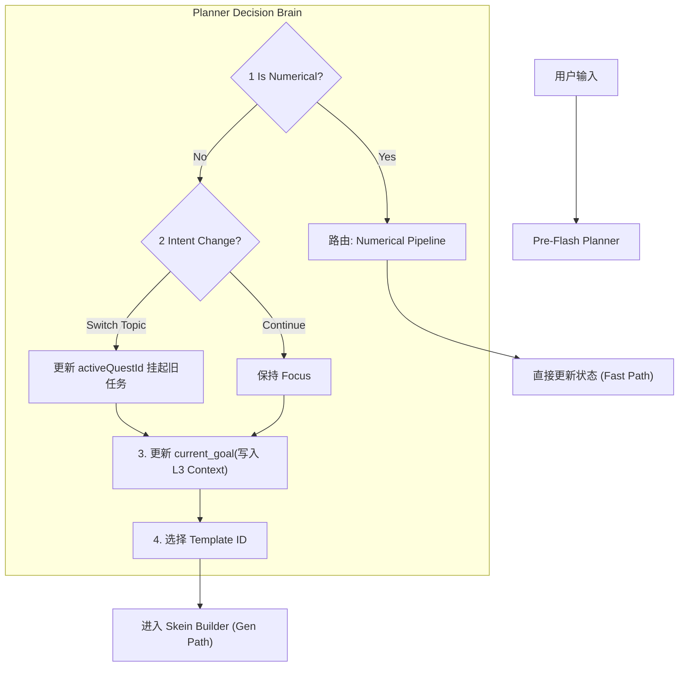

# 核心组件：规划器 (Planner)

**版本**: 1.0.0
**日期**: 2026-01-12
**状态**: Draft
**作者**: 资深系统架构师 (Architect Mode)
**源文档**: `jacquard-orchestration.md`, `mnemosyne-data-engine.md`

---

## 1. 概述 (Overview)

**Pre-Flash (Planner) Plugin** 是 Jacquard 编排流水线中的第一道关卡，也是整个 Clotho 系统的“副官 (Adjutant)”。它的核心使命是在主生成模型 (Main LLM) 介入之前，对当前的对话上下文进行**战术分析**和**聚焦管理**。

它不负责生成最终的回复文本，而是负责回答三个关键问题：
1.  **Intent**: 用户现在想做什么？（闲聊？推进剧情？还是查数值？）
2.  **Focus**: 我们应该聚焦于哪个任务？（继续当前话题？还是响应打断？）
3.  **Strategy**: 我们该用什么模板和策略来生成回复？

---

## 2. 核心职责 (The 4 Pillars)

Planner 的功能构建在四大支柱之上，确保 AI 的行为既具有长期的连贯性，又具备短期的灵活性。

### 2.1 意图分流 (Triage)

识别用户输入的性质，决定将其路由到哪个处理管线。这是系统的“快速反应机制”。

*   **数值化交互 (Numerical Route)**:
    *   **特征**: 短文本、高频、重复性强、无复杂语义（如“摸摸头”、“每日签到”）。
    *   **处理**: 绕过 Skein Builder 和 Main LLM，直接调用 `State Updater` 修改数值，并返回预设的反馈（如 `*affinity +1*`）。
    *   **价值**: 节省 Token 成本，防止无意义文本污染 Context Window。
*   **剧情化交互 (Narrative Route)**:
    *   **特征**: 需要理解、需要生成、涉及复杂逻辑。
    *   **处理**: 进入标准的 Jacquard 生成流水线。

### 2.2 聚焦管理 (Focus Management)

这是 v1.3 引入的 **"聚光灯 (Spotlight)"** 机制。Planner 负责管理 L3 State 中的 `activeQuestId` 指针。

*   **背景**: 系统中可能同时存在多个 `active` 状态的任务（如“主线”、“支线A”、“支线B”）。
*   **逻辑**:
    1.  **检测切换**: 分析用户输入是否包含“打断”、“切换话题”或“启动新任务”的意图。
    2.  **更新指针**:
        *   **保持 (Keep)**: 如果用户仍在聊当前话题，保持 `activeQuestId` 不变。
        *   **切换 (Switch)**: 如果用户明显转向（如“先别管这个了，快看那只猫！”），将 `activeQuestId` 指向新的任务 ID（或创建新任务）。
        *   **挂起 (Suspend)**: 旧任务的状态保留在后台，等待未来被唤醒。

### 2.3 目标规划 (Goal Planning)

在确定了“焦点”之后，Planner 需要为 Main LLM 设定具体的战术目标。

*   **操作**: Planner 直接修改 L3 Session State 中的 `planner_context` 对象。
*   **写入内容**:
    *   `current_goal`: 当前回合的显式目标（如“引导玩家发现受伤的猫”）。
    *   `pending_subtasks`: 待解决的子问题列表。
*   **意义**: Main LLM 在随后的 Prompt 中会直接看到这个 `current_goal`，从而生成高度聚焦的内容，避免“不知所措”。

### 2.4 策略选型 (Strategy Selection)

决定使用哪个 **Skein Template** 来构建 Prompt。

*   **场景示例**:
    *   **日常对话**: 使用标准 `Chat Template`。
    *   **战斗遭遇**: 使用 `Combat Encounter Template` (强调数值、回合制逻辑)。
    *   **回忆模式**: 使用 `Flashback Template` (强调叙事、弱化当前状态)。
*   **产出**: `PlanContext.templateId`。

---

## 3. 决策工作流 (Decision Workflow)

---

## 4. 数据权限与交互 (Data Interactions)

Planner 拥有系统中最特殊的权限集，因为它处于“生成前 (Pre-Generation)”的上帝视角。

### 4.1 Read Access (读权限)
*   **History Chain**: 读取最近的 N 条对话，用于判断上下文连贯性。
*   **Active Quests**: 读取 `state.quests` 中所有活跃任务的状态，以便决定切换目标。
*   **Lorebook Metadata**: 读取世界书目录，辅助策略选择。

### 4.2 Write Access (写权限)
*   **Planner Context**:
    *   **对象**: `state.planner_context`
    *   **时机**: **Before** Prompt Generation (在 Skein Builder 运行之前)。
    *   **性质**: 这是 **Hard Write**（直接修改内存对象），而非 Soft Suggestion。
*   **Quest Pointers**:
    *   **对象**: `state.planner_context.activeQuestId`
    *   **作用**: 改变系统关注的焦点任务。

---

## 5. 与其他组件的关系

| 组件 | 关系 |
| :--- | :--- |
| **Skein Builder** | 下游消费者。Builder 根据 Planner 指定的 `templateId` 和 `planner_context` 来组装 Prompt。 |
| **Main LLM** | 执行者。LLM 不需要猜测“我要做什么”，而是直接执行 `planner_context.current_goal`。 |
| **State Updater** | 后处理者。Updater 负责解析 LLM 执行后的结果，并更新 Quest 的具体进度（如 1/3 -> 2/3）。 |
