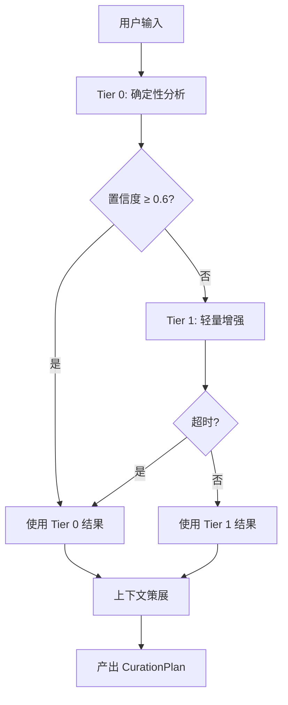
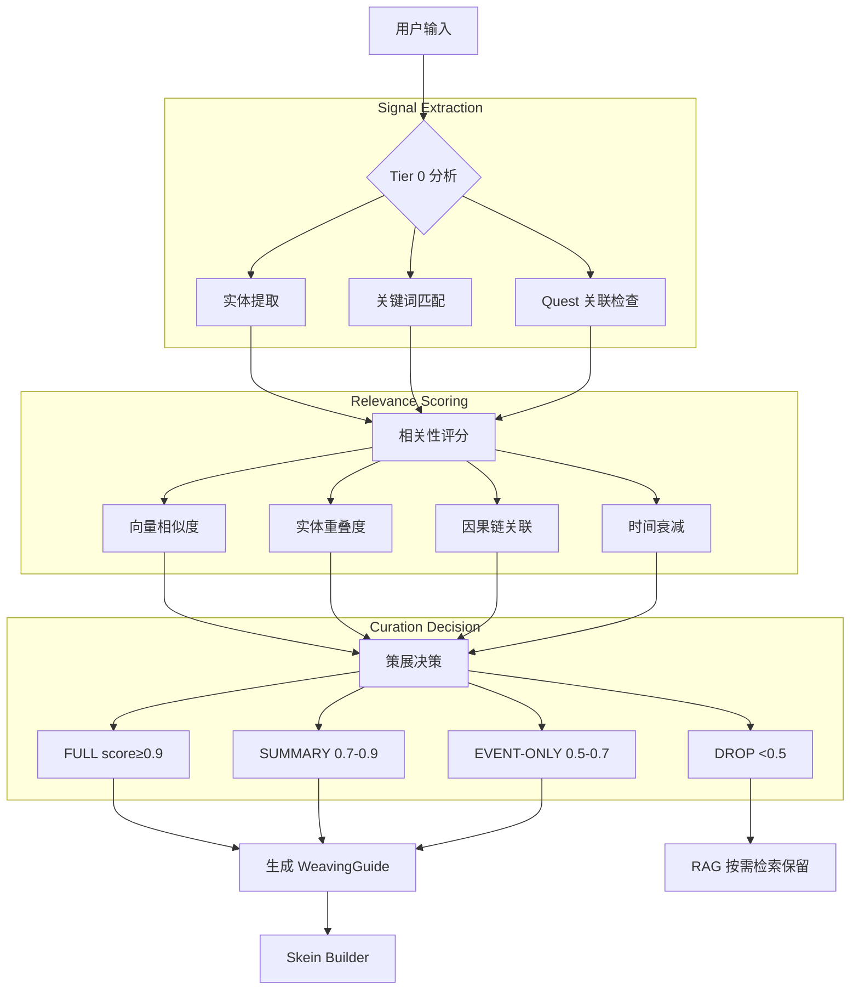

# 核心组件：规划器 (Planner)

**版本**: 1.3.0
**日期**: 2026-03-11
**状态**: Active
**作者**: 资深系统架构师 (Architect Mode)
**关联文档**: [`jacquard-orchestration.md`](README.md), [`../mnemosyne/abstract-data-structures.md`](../mnemosyne/abstract-data-structures.md), [`skein-and-weaving.md`](skein-and-weaving.md)

---

> 术语体系参见 [naming-convention.md](../naming-convention.md)

## 1. 概述 (Overview)

**Planning Phase (Planner) Plugin** 是 Jacquard 编排流水线中的第一道关卡，也是整个 Clotho 系统的"副官 (Adjutant)"与"上下文策展人 (Context Curator)"。

不同于传统 RPG 客户端简单加载"最近 N 条消息"的做法，Planner 的核心使命是**基于对 Mnemosyne 历史数据结构的深度分析，为下游的提示词构建提供指导**，使上下文更为简洁突出。

它回答三个关键问题：
1.  **Curation**: 哪些历史应该完整加载？哪些应该摘要化？哪些应该省略？
2.  **Focus**: 我们应该聚焦于哪个任务？（继续当前话题？还是响应打断？）
3.  **Strategy**: 我们该用什么模板和策略来生成回复？

---

## 2. 核心职责 (The 3 Pillars)

Planner 的功能构建在三大支柱之上，确保 AI 的行为既具有长期的连贯性，又具备短期的灵活性，同时避免元认知递归陷阱。

### 2.1 上下文策展 (Context Curation)

Planner 的核心创新在于作为**上下文策展人**，基于对 Mnemosyne 数据结构的分析，智能决定历史内容的加载策略。

**输入分析**:
*   **用户输入**: 提取实体 (NPC名、物品、地点)、关键词、时间参照 ("三天前")
*   **历史数据源**: Messages, Events, Turn Summaries, Macro Narratives
*   **Quest 上下文**: 当前 `activeQuestId` 关联的 Events 链

**分层策展决策**:

| 评分区间 | 处理方式 | 进入 Skein 的形式 |
|----------|----------|-------------------|
| score ≥ 0.9 | **FULL**: 完整加载该 Turn 的 Messages | History Chain (高优先级, depth 小) |
| 0.7 ≤ score < 0.9 | **SUMMARY**: 仅加载 Turn Summary | Floating Asset (depth=中等) |
| 0.5 ≤ score < 0.7 | **EVENT-ONLY**: 仅加载结构化 Events | System Extension (事实列表) |
| score < 0.5 | **DROP**: 不加载 (保留 RAG 按需检索入口) | 不进入 |

**产出**: `CurationPlan` - 包含完整加载的 Turns、摘要资产、Event Facts 的策展方案。

### 2.2 聚焦管理 (Focus Management)

这是 v1.3 引入的 **"聚光灯 (Spotlight)"** 机制。Planner 负责管理 L3 State 中的 `activeQuestId` 指针。

*   **背景**: 系统中可能同时存在多个 `active` 状态的任务（如"主线"、"支线A"、"支线B"）。
*   **逻辑**:
    1.  **检测切换**: 分析用户输入是否包含"打断"、"切换话题"或"启动新任务"的意图。
    2.  **产出建议**:
        *   **保持 (Keep)**: 如果用户仍在聊当前话题，建议保持 `activeQuestId` 不变。
        *   **切换 (Switch)**: 如果用户明显转向（如"先别管这个了，快看那只猫！"），建议将 `activeQuestId` 指向新的任务 ID（或创建新任务）。
        *   **挂起 (Suspend)**: 旧任务的状态保留在后台，等待未来被唤醒。

> **注意**: Planner **不直接修改** `activeQuestId`，而是将建议写入 `planner_context.suggestion`，由 State Updater 在 Main LLM 生成后确认生效。

### 2.3 策略选型 (Strategy Selection)

决定使用哪个 **Skein Template** 来构建 Prompt。

*   **场景示例**:
    *   **日常对话**: 使用标准 `Chat Template`。
    *   **战斗遭遇**: 使用 `Combat Encounter Template` (强调数值、回合制逻辑)。
    *   **回忆模式**: 使用 `Flashback Template` (强调叙事、弱化当前状态)。
    *   **高信息密度**: 当 CurationPlan 包含大量历史时，使用 `Dense Context Template`。
*   **产出**: `CurationPlan.recommendedTemplate`。

---

## 3. 分层智能模型 (Tiered Intelligence)

为避免"谁为 Planner 做 Plan"的元认知递归，Planner 采用**分层智能模型**，明确区分确定性基线与可选增强。

### 3.1 Tier 0: 确定性基线 (Deterministic Baseline)

**必选项，无 LLM，100% 可靠**。

| 功能 | 实现方式 | 产出 |
|------|----------|------|
| 实体提取 | 关键词词典 + Regex | entity_list[] |
| 历史评分 | 向量相似度 (Turn Summary 预计算) + 实体重叠计数 | relevance_score |
| 意图分类 | 规则匹配 (打断词表、Quest 关键词) | intent_class |
| Goal 生成 | Quest 默认描述提取 | default_goal |
| Template 选择 | 决策树 (基于 intent + event_type) | template_id |

**回退策略**: Tier 0 总有输出，保证系统可用性。采用保守策略 (保持当前 Focus，加载更多上下文)。

### 3.2 Tier 1: 轻量增强 (Lightweight Enhancement)

**可选项，单次轻量 LLM 调用，明确边界**。

**触发条件**: 仅当 Tier 0 置信度 < 0.6 或检测到模糊信号时触发。

**输入边界** (严格受限):
*   用户输入 (≤200 tokens)
*   最近 3 轮 Turn Summaries (已结构化)
*   当前 activeQuest 描述

**输出边界** (JSON Schema 约束):
```json
{
  "intent_classification": "CONTINUE|SWITCH|BRANCH",
  "focus_shift_confidence": 0.0-1.0,
  "suggested_goal": "string (≤100 chars)"
}
```

**超时回退**: 500ms 未返回 → 使用 Tier 0 结果。

### 3.3 分层决策流程


```mermaid
graph TD
    UserInput[用户输入] --> Tier0[Tier 0: 确定性分析]
    
    Tier0 --> ConfidenceCheck{置信度 ≥ 0.6?}
    
    ConfidenceCheck -- 是 --> UseTier0[使用 Tier 0 结果]
    ConfidenceCheck -- 否 --> Tier1[Tier 1: 轻量增强]
    
    Tier1 --> TimeoutCheck{超时?}
    TimeoutCheck -- 是 --> UseTier0
    TimeoutCheck -- 否 --> UseTier1[使用 Tier 1 结果]
    
    UseTier0 & UseTier1 --> Curation[上下文策展]
    Curation --> Output[产出 CurationPlan]
```

---

## 4. 决策工作流：策展流程 (Curation Workflow)


```mermaid
graph TD
    UserInput[用户输入] --> Tier0{Tier 0 分析}
    
    subgraph "Signal Extraction"
        Tier0 --> Entities[实体提取]
        Tier0 --> Keywords[关键词匹配]
        Tier0 --> QuestCheck[Quest 关联检查]
    end
    
    Entities & Keywords & QuestCheck --> Scoring[相关性评分]
    
    subgraph "Relevance Scoring"
        Scoring --> VectorSim[向量相似度]
        Scoring --> EntityOverlap[实体重叠度]
        Scoring --> CausalChain[因果链关联]
        Scoring --> TimeDecay[时间衰减]
    end
    
    VectorSim & EntityOverlap & CausalChain & TimeDecay --> CurationDecision[策展决策]
    
    subgraph "Curation Decision"
        CurationDecision --> Full[FULL score≥0.9]
        CurationDecision --> Summary[SUMMARY 0.7-0.9]
        CurationDecision --> Events[EVENT-ONLY 0.5-0.7]
        CurationDecision --> Drop[DROP <0.5]
    end
    
    Full & Summary & Events --> WeavingGuide[生成 WeavingGuide]
    Drop --> RAGFallback[RAG 按需检索保留]
    
    WeavingGuide --> SkeinBuilder[Skein Builder]
```

---

## 5. 数据结构 (Data Structures)

### 5.1 CurationPlan (策展计划)

Planner 的核心产出，指导 Skein 构建。

```typescript
interface CurationPlan {
  // 完整加载的 Turns (进入 History Chain)
  fullHistory: {
    turnId: string;
    turnIndex: number;
    messages: Message[];
    priority: number;      // History Chain 中的优先级
    reason: string;        // 加载原因: "实体匹配: 石中剑", "因果链: 获得钥匙"
  }[];
  
  // 摘要形式加载 (Floating Assets)
  summaryAssets: {
    turnId: string;
    summary: string;       // Turn.summary
    depth: number;         // History Chain 注入深度
    relevanceScore: number;
  }[];
  
  // 仅加载结构化 Events
  eventFacts: {
    eventId: string;
    type: GameEvent['type'];
    payload: any;
    compactForm: string;   // "[Event] 获得物品: 石中剑 (Turn 10)"
  }[];
  
  // Quest 上下文
  questContext: {
    activeQuestId: string;
    relevantObjectives: string[];
    relatedPastEvents: string[];
  };
  
  // Skein 构建指导
  recommendedTemplate: string;
  
  // Focus 建议 (非命令)
  suggestion: {
    targetQuestId: string;
    confidence: number;
    reasoning: string;
  };
  
  // 元数据
  metadata: {
    tierUsed: 0 | 1;                    // 使用的智能层级
    totalUnitsConsidered: number;
    totalTokensEstimated: number;
    confidence: number;
  };
}
```

### 5.2 WeavingGuide (编织指导)

给 Skein Builder 的具体指令。

```dart
// lib/models/weaving_guide.dart
/// WeavingGuide - 给 Skein Builder 的具体指令
class WeavingGuide {
  /// History Chain 构建指令
  final List<PromptBlock> historyChain;
  
  /// Floating Assets
  final List<FloatingAsset> floatingAssets;
  
  /// System Extension 指令
  final List<SystemExtension> systemExtensions;
  
  /// Template 选择
  final String recommendedTemplate;
  
  /// 特殊指令
  final List<WeavingDirective> directives;
  
  const WeavingGuide({
    required this.historyChain,
    required this.floatingAssets,
    required this.systemExtensions,
    required this.recommendedTemplate,
    required this.directives,
  });
}

/// 系统扩展指令
class SystemExtension {
  /// 扩展类型
  final SystemExtensionType type;
  
  /// 扩展内容
  final String content;
  
  const SystemExtension({
    required this.type,
    required this.content,
  });
}

/// 系统扩展类型枚举
enum SystemExtensionType {
  relevantFacts,
  questContext,
}

/// 编织指令
class WeavingDirective {
  /// 指令类型
  final DirectiveType type;
  
  /// 目标
  final String target;
  
  /// 指令内容
  final String content;
  
  const WeavingDirective({
    required this.type,
    required this.target,
    required this.content,
  });
}

/// 指令类型枚举
enum DirectiveType {
  emphasize,
  suppress,
  injectFirst,
}
```

---

## 6. 数据权限与交互 (Data Interactions)

### 6.1 Read Access (读权限)

| 数据源 | 用途 | 层级 |
|--------|------|------|
| **Recent Messages** (最近 3-5 轮) | 实体提取、上下文连贯性 | Tier 0 |
| **Turn Summaries** | RAG 语义检索、相似度计算 | Tier 0 |
| **Game Events** | 因果链追踪、事实提取 | Tier 0 |
| **Quest State** | 目标关联、Focus 判断 | Tier 0 |
| **Macro Narratives** | 长时记忆检索 | Tier 0 (按需) |

### 6.2 Write Access (写权限)

Planner **不直接修改** State，而是产出建议：

| 写入对象 | 内容 | 性质 |
|----------|------|------|
| `planner_context.suggestion` | targetQuestId, confidence, reasoning | Soft Suggestion |
| `planner_context.curation_plan` | CurationPlan 对象 | 只读参考 |

> **硬写入时机**: State Updater 在 Main LLM 生成后，根据 `<planner_override>` 或默认确认逻辑，将 suggestion 应用到 `activeQuestId`。

---

## 7. 元认知边界与失效处理

### 7.1 避免递归

| 设计决策 | 机制 |
|----------|------|
| Tier 0 | 纯确定性规则，无 LLM |
| Tier 1 | 单次轻量调用，输入为原始输入+结构化摘要，无需预处理 |
| 无 Pre-Planner | Tier 1 的触发是简单的置信度阈值判断 |

### 7.2 失效检测

| 检测机制 | 说明 |
|----------|------|
| **自检** | 连续 3 轮建议切换但话题连续性高 → 触发"过度敏感"告警 |
| **覆盖检测** | Main LLM 输出 `<planner_override>` 时记录原因 |
| **用户干预** | UI 提供"锁定当前任务"功能，禁用 Planner 切换建议 |
| **置信度显化** | `metadata.confidence` < 0.5 时 UI 显示"不确定"提示 |

---

## 8. 与其他组件的关系

| 组件 | 关系 |
| :--- | :--- |
| **Skein Builder** | 下游消费者。Builder 根据 `WeavingGuide` 组装 Prompt，包括历史链构建和 Floating Assets 注入。 |
| **Mnemosyne** | 数据提供者。Planner 读取 Turn Summaries、Events、Quest State 进行策展分析。 |
| **Main LLM** | 执行者。接收由 CurationPlan 构建的精简上下文，可输出 `<planner_override>` 覆盖建议。 |
| **State Updater** | 后处理者。确认或拒绝 Planner 的 Focus 建议，更新 `activeQuestId` 和 Quest 进度。 |

### 8.1 接口契约 (Interface Contract)

Planner 通过 `JacquardContext.plannerContext` 向下游组件传递产物：

```dart
// lib/models/planner_context.dart
/// PlannerContext - Planner 产出写入位置
///
/// Planner 通过 `JacquardContext.plannerContext` 向下游组件传递产物
class PlannerContext {
  /// 上下文策展方案 (v1.2+)
  final CurationPlan curationPlan;
  
  /// 编织指导指令 (v1.2+)
  final WeavingGuide weavingGuide;
  
  /// 焦点切换建议 (软写入，需 State Updater 确认)
  final FocusSuggestion? suggestion;
  
  const PlannerContext({
    required this.curationPlan,
    required this.weavingGuide,
    this.suggestion,
  });
}
```

**Skein Builder 消费方式**:
- 从 `context.plannerContext.weaving_guide` 读取编织指令
- `WeavingGuide.historyChain` → 映射到 `SkeinInstance.historyChain`
- `WeavingGuide.floatingAssets` → 映射到 `SkeinInstance.floatingChain`
- `WeavingGuide.systemExtensions` → 合并入 `SkeinInstance.systemChain` 末尾

---

## 9. 配置与调优

### 9.1 Tier 1 触发策略

```yaml
planner:
  tier1:
    enabled: true              # 是否启用 Tier 1
    trigger_threshold: 0.6     # 置信度低于此值时触发
    timeout_ms: 500            # 超时回退时间
    model: "lightweight-classifier"  # 轻量模型标识
```

### 9.2 评分权重

```yaml
planner:
  scoring:
    vector_similarity: 0.4     # 向量相似度权重
    entity_overlap: 0.3        # 实体重叠权重
    causal_chain: 0.2          # 因果链权重
    time_decay: 0.1            # 时间衰减权重
```

### 9.3 阈值调整

```yaml
planner:
  thresholds:
    full_load: 0.9             # 完整加载阈值
    summary_load: 0.7          # 摘要加载阈值
    event_only: 0.5            # Event-only 阈值
```
