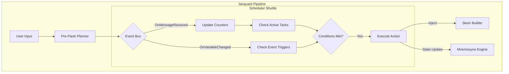

# Jacquard 调度穿梭机 (Scheduler Shuttle) 组件规范

**版本**: 1.0.0
**日期**: 2026-01-15
**状态**: Draft
**关联文档**:
- `../mnemosyne/abstract-data-structures.md` (L3 状态定义)
- `README.md` (Jacquard 概览)

---

## 1. 组件概述

**Scheduler Shuttle** 是 Jacquard 编排层中的一个核心插件（Plugin），负责执行**基于时间和事件的自动化任务**。它实现了 LittleWhiteBox (LWB) 风格的精细化调度逻辑，遵循 **"凯撒原则"**，即调度逻辑属于确定性的代码领域，必须由系统精确控制。

### 1.1 核心职责

1.  **事件监听 (Event Listening)**: 订阅系统生命周期事件（如 `OnMessageReceived`, `OnVariableChanged`）。
2.  **计数器维护 (Counter Maintenance)**: 自动更新 Mnemosyne 中的 `scheduler_context`（楼层计数、时间戳）。
3.  **规则评估 (Rule Evaluation)**: 检查活跃的调度任务（Scheduler Tasks），判断是否满足触发条件。
4.  **动作执行 (Action Execution)**: 执行满足条件的任务动作，如注入 Prompt、更新状态或强制回复。

---

## 2. 架构集成

Scheduler Shuttle 作为 Jacquard 流水线的一环，与 Event Bus 和 Mnemosyne 紧密交互。



---

## 3. 调度逻辑 (Scheduling Logic)

### 3.1 计数器系统 (Counters)

Scheduler 维护以下核心计数器，存储于 Mnemosyne 的 `scheduler_context.counters` 中：

| 计数器 | 定义 | 更新时机 |
| :--- | :--- | :--- |
| **total_floor** | 总消息数 | 任意角色 (User/Model) 发送消息后 +1 |
| **user_floor** | 用户消息数 | 仅 User 发送消息后 +1 |
| **model_floor** | 模型回复数 | 仅 Model 发送回复后 +1 |
| **last_interaction_ts**| 最后交互时间 | 任意消息发送后的 Unix 时间戳 |

### 3.2 触发类型 (Trigger Types)

调度任务支持以下触发器：

#### 3.2.1 间隔触发 (Interval)
基于楼层计数的模运算触发。
- **参数**: `counter` (计数器名), `mod` (模数)
- **逻辑**: `state.counters[counter] % mod == 0`
- **示例**: 每 10 楼触发一次环境描写。

#### 3.2.2 事件触发 (Event)
基于系统事件或变量变更触发。
- **参数**: `event` (事件名), `condition` (条件表达式)
- **逻辑**: 当事件发生且条件为真时触发。
- **示例**: 当 `character.health < 20` 时触发受伤状态。

#### 3.2.3 时间触发 (Time) - *Planned*
基于真实世界时间或游戏内时间流逝触发。
- **参数**: `interval` (时间间隔)
- **逻辑**: `current_ts - last_triggered_ts >= interval`

### 3.3 冷却机制 (Cooldown)

为了防止任务过于频繁触发，每个任务可以定义 `cooldown`（冷却回合数）。
- **检查**: `current_floor - task.last_triggered_floor >= task.cooldown`
- **更新**: 任务触发后，更新 `last_triggered_floor`。

---

## 4. 配置规范 (Configuration Spec)

调度规则作为 **元数据 (Metadata)** 存在于 `World Info` 或 `Character Card` 中。

**JSON 结构**:

```json
{
  "scheduler_rules": [
    {
      "id": "unique_task_id",
      "type": "interval | event | time",
      "trigger": {
        // Interval
        "counter": "total_floor",
        "mod": 10,
        
        // Event
        "event": "OnVariableChanged",
        "path": "character.hp",
        "operator": "<",
        "value": 20
      },
      "action": [
        {
          "type": "inject_system | force_thought | update_state",
          "content": "String content or JSON value",
          "probability": 1.0 // 0.0 - 1.0
        }
      ],
      "conditions": ["world.location != 'home'"], // 额外前置条件
      "cooldown": 5,
      "enabled": true
    }
  ]
}
```

---

## 5. 动作系统 (Action System)

当任务触发时，Scheduler 可以执行以下动作：

1.  **Inject System/User**: 向当前回合的 Skein 中注入临时的 System 或 User 指令（不存入历史）。
2.  **Force Thought**: 强制模型输出一段思维链（Thought Block），常用于引导剧情走向。
3.  **Update State**: 直接修改 Mnemosyne 中的状态变量（如减少金币、给予物品）。
4.  **Suspend/Resume Task**: 动态控制其他调度任务的启用状态。

---

## 6. 安全与限制 (Safety & Limits)

为了防止死循环和资源滥用，Scheduler 实施以下限制：

1.  **Max Recursion Depth**: 单次 Pipeline 执行中，`OnVariableChanged` 触发链的最大深度限制为 3。
2.  **Unique Trigger**: 同一回合内，同一 Task ID 只能触发一次。
3.  **Sandboxed Evaluation**: 条件表达式必须在受限沙箱中执行，禁止访问文件系统或网络。
