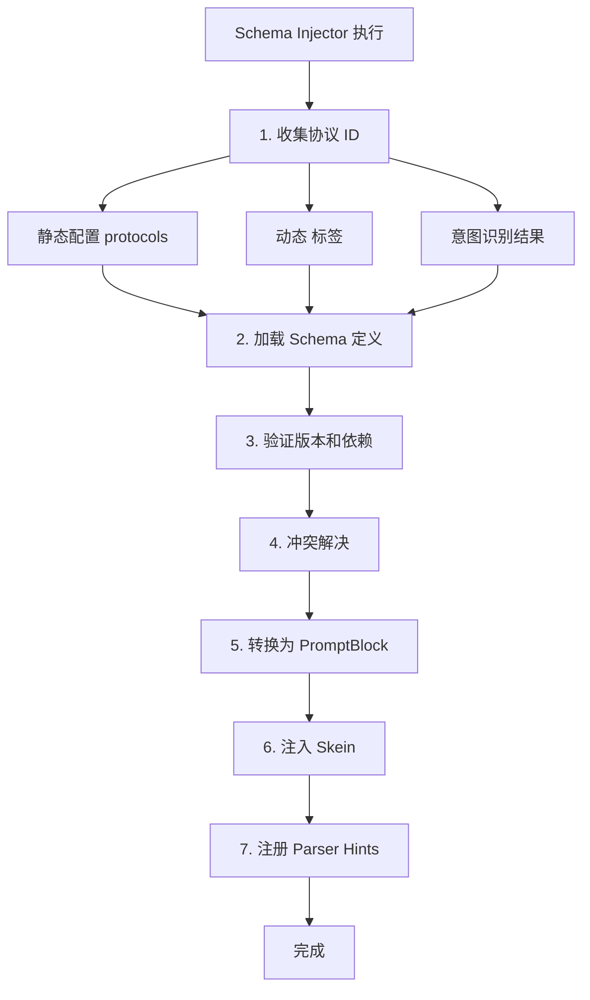

# Schema Injector 组件规范 (Schema Injector Specification)

**版本**: 1.0.0
**日期**: 2026-02-19
**状态**: Draft
**作者**: 资深系统架构师
**关联文档**:
- [`README.md`](README.md) - Jacquard 概览
- [`skein-and-weaving.md`](skein-and-weaving.md) - Skein 编织系统
- [`preset-system.md`](preset-system.md) - 预设系统
- [`../protocols/schema-library.md`](../protocols/schema-library.md) - Schema 库规范
- [`../workflows/prompt-processing.md`](../workflows/prompt-processing.md) - 提示词处理工作流
- [`../workflows/post-generation-processing.md`](../workflows/post-generation-processing.md) - 生成后处理工作流

---

## 1. 概述 (Overview)

**Schema Injector** 是 Jacquard 编排流水线中的核心插件，负责**动态协议 Schema 的加载与注入**。它将角色卡配置的协议定义和运行时动态触发的协议模式（如 `<use_protocol>` 标签）转换为 PromptBlock，并合并到 Skein 中。

### 1.1 设计目标

1. **协议复用**: 将通用协议规则（如变量更新、思维链）从角色卡抽离，标准化存储
2. **动态激活**: 支持运行时通过标签或意图识别动态加载协议
3. **版本管理**: 支持协议版本控制和兼容性检查
4. **冲突解决**: 处理多协议同时激活时的冲突和优先级

### 1.2 在流水线中的位置

```
Pipeline Flow (优先级排序):
...
300: Skein Builder (构建基础 Skein)
350: Schema Injector (注入协议 Schema) ← 本组件
400: Template Renderer (渲染模板)
...
```

Schema Injector 位于 Skein Builder 之后，负责向已构建的 Skein 中注入额外的协议定义内容。

---

## 2. 核心职责 (Responsibilities)

### 2.1 协议收集

| 来源 | 方式 | 示例 |
|------|------|------|
| **静态配置** | Pattern 配置的 `protocols` 列表 | `configuration.protocols: ["variable_update", "chain_of_thought"]` |
| **动态标签** | 检测 `<use_protocol>` 标签 | `<use_protocol>live_stream</use_protocol>` |
| **意图触发** | Planner 识别的协议意图 | 用户输入"进入直播模式"触发 `live_stream` |

### 2.2 协议加载

从 Schema Library 加载对应的 YAML 定义文件：

```dart
final schema = await _schemaLoader.load(
  id: "variable_update",
  versionConstraint: "^1.0.0",  // 支持语义化版本约束
);
```

### 2.3 内容转换

将 Schema 转换为 Skein 可消费的 Block 结构：

| Schema 字段 | 转换目标 | BlockType |
|-------------|----------|-----------|
| `instruction` | System Prompt 扩展 | `META_FORMAT` 或 `META_FORMAT_OVERRIDE` |
| `examples` | Few-shot 示例 | `COGNITION_EXAMPLE` |
| `lore_context` | 世界观补充 | `ENCYCLOPEDIA` |

### 2.4 依赖注册

向 Filament Parser 注册解析提示：

```dart
// 写入 blackboard 供 Parser 读取
// 详见 ../workflows/post-generation-processing.md 第2.1节
context.blackboard['parser_hints'] = {
  "variable_update": {
    "root_tag": "variable_update",
    "required_fields": ["path", "operation", "value"],
  },
  "live_stream": {
    "root_tag": "live",
    "streaming": true,
  },
};
```

**消费端**: Filament Parser 在生成后处理阶段读取这些 hints，动态扩展标签路由表，支持 Schema 自定义标签的流式解析。

---

## 3. 数据结构 (Data Structures)

### 3.1 SchemaDefinition (协议定义)

```dart
// lib/models/schema_definition.dart
/// SchemaDefinition - 协议定义
///
/// 定义 Filament 扩展协议的规则、示例和解析提示
class SchemaDefinition {
  /// 唯一标识，如 "variable_update"
  final String id;
  
  /// 语义化版本，如 "1.2.0"
  final String version;
  
  /// 协议类型
  final SchemaType type;
  
  /// 协议规则说明（注入 System Prompt）
  final String instruction;
  
  /// Few-shot 示例
  final List<Example>? examples;
  
  /// 世界观补充（可选）
  final String? loreContext;
  
  /// 解析提示（供 Filament Parser 使用）
  final ParserHints parserHints;
  
  /// 注入优先级（决定覆盖关系）
  final int priority;
  
  /// 注入位置策略
  final PositionStrategy positionStrategy;
  
  const SchemaDefinition({
    required this.id,
    required this.version,
    required this.type,
    required this.instruction,
    this.examples,
    this.loreContext,
    required this.parserHints,
    required this.priority,
    required this.positionStrategy,
  });
}

/// 协议类型枚举
enum SchemaType {
  /// 核心协议：仅包含 <think> 和 <content>，始终启用，不可覆盖
  core,
  
  /// 扩展协议：按需启用，完全解耦，不自动加载
  extension,
  
  /// 模式协议：全局输出风格，与其他 Mode 互斥
  mode,
  
  /// 覆盖协议：替换特定 Extension 的实现
  override,
}

/// 解析提示
class ParserHints {
  /// 根标签名，如 "variable_update"
  final String rootTag;
  
  /// 必需字段列表
  final List<String>? requiredFields;
  
  /// 是否支持流式解析
  final bool? streamingSupport;
  
  /// 流式分块标签（如 "partial"）
  final String? partialTag;
  
  const ParserHints({
    required this.rootTag,
    this.requiredFields,
    this.streamingSupport,
    this.partialTag,
  });
}

/// 注入位置策略枚举
enum PositionStrategy {
  /// System Chain 起始（高优先级覆盖）
  systemStart,
  
  /// System Chain 末尾（默认）
  systemEnd,
  
  /// History Chain 之前（Few-shot）
  beforeHistory,
  
  /// History Chain 之后
  afterHistory,
  
  /// Floating Chain（动态注入）
  floating,
}

/// Few-shot 示例
class Example {
  /// 输入示例
  final String input;
  
  /// 输出示例
  final String output;
  
  /// 示例描述
  final String? description;
  
  const Example({
    required this.input,
    required this.output,
    this.description,
  });
}
```

### 3.2 SchemaInjectionConfig (注入配置)

```dart
// lib/models/schema_injection_config.dart
/// SchemaInjectionConfig - Schema 注入配置
class SchemaInjectionConfig {
  /// 是否启用动态检测
  final bool dynamicDetection;
  
  /// 检测方法
  final DetectionMethod detectionMethod;
  
  /// Schema 库路径，如 "data/schemas"
  final String libraryPath;
  
  /// 默认启用的协议（除 core 外）
  final List<String> defaultProtocols;
  
  /// 最大同时激活协议数
  final int maxConcurrent;
  
  /// 冲突解决策略
  final ConflictResolution conflictResolution;
  
  /// 注入策略
  final InjectionStrategy injectionStrategy;
  
  const SchemaInjectionConfig({
    required this.dynamicDetection,
    required this.detectionMethod,
    required this.libraryPath,
    required this.defaultProtocols,
    required this.maxConcurrent,
    required this.conflictResolution,
    required this.injectionStrategy,
  });
}

/// 检测方法枚举
enum DetectionMethod {
  tag,
  intent,
  both,
}

/// 冲突解决策略枚举
enum ConflictResolution {
  priority,
  merge,
  error,
}

/// 注入策略
class InjectionStrategy {
  /// 指令注入位置
  final InstructionPosition instruction;
  
  /// 示例注入位置
  final ExamplePosition examples;
  
  const InjectionStrategy({
    required this.instruction,
    required this.examples,
  });
}

/// 指令位置枚举
enum InstructionPosition {
  systemStart,
  systemEnd,
}

/// 示例位置枚举
enum ExamplePosition {
  beforeHistory,
  afterHistory,
}
```

---

## 4. 注入流程 (Injection Workflow)

### 4.1 执行流程



### 4.2 详细步骤

```dart
class SchemaInjectorPlugin implements JacquardPlugin {
  static const int priority = 350;
  
  @override
  Future<void> execute(JacquardContext context) async {
    // Step 1: 收集协议 ID
    final schemaIds = _collectSchemaIds(context);
    
    if (schemaIds.isEmpty) {
      return; // 无协议需要注入
    }
    
    // Step 2: 加载 Schema
    final schemas = await _loadSchemas(schemaIds);
    
    // Step 3: 验证
    for (final schema in schemas) {
      _validateSchema(schema, context);
    }
    
    // Step 4: 冲突解决
    final resolved = _conflictResolver.resolve(schemas);
    
    // Step 5 & 6: 转换并注入
    for (final schema in resolved) {
      final blocks = _convertToBlocks(schema);
      _injectIntoSkein(context.skein, blocks, schema);
    }
    
    // Step 7: 注册 Parser Hints
    context.blackboard['schema_parser_hints'] = 
      _collectParserHints(resolved);
    context.blackboard['active_schemas'] = 
      resolved.map((s) => s.id).toList();
  }
}
```

---

## 5. 与 Block Taxonomy 的映射

Schema 内容通过特定的 BlockType 注入 Skein，与 `preset-system.md` 定义的 Taxonomy 对齐：

| Schema 内容 | BlockType | 语义分类 | 注入位置 | 默认优先级 |
|-------------|-----------|----------|----------|-----------|
| `instruction` (extension) | `META_FORMAT` | Meta | System Chain 末尾 | 150 |
| `instruction` (mode/override) | `META_FORMAT_OVERRIDE` | Meta | System Chain 起始 | 200 |
| `examples` | `COGNITION_EXAMPLE` | Cognitive | History Chain 前 | 80 |
| `lore_context` | `ENCYCLOPEDIA` | Content | Floating Chain | 50 |

### 5.1 BlockType 映射逻辑

```dart
BlockType _mapSchemaToBlockType(SchemaDefinition schema) {
  switch (schema.type) {
    case SchemaType.core:
    case SchemaType.extension:
      return BlockType.META_FORMAT;
    case SchemaType.mode:
    case SchemaType.override:
      return BlockType.META_FORMAT_OVERRIDE;
  }
}

PositionStrategy _determinePosition(SchemaDefinition schema, BlockType type) {
  if (schema.position_strategy != null) {
    return schema.position_strategy;
  }
  
  // 默认策略
  switch (type) {
    case BlockType.META_FORMAT_OVERRIDE:
      return PositionStrategy.system_start;
    case BlockType.META_FORMAT:
      return PositionStrategy.system_end;
    case BlockType.COGNITION_EXAMPLE:
      return PositionStrategy.before_history;
    case BlockType.ENCYCLOPEDIA:
      return PositionStrategy.floating;
    default:
      return PositionStrategy.system_end;
  }
}
```

---

## 6. 与 Skein 的集成

### 6.1 注入方法

根据 PositionStrategy 将 Block 插入 Skein 的不同 Chain：

```dart
void _injectIntoSkein(
  SkeinInstance skein, 
  List<PromptBlock> blocks, 
  SchemaDefinition schema,
) {
  for (final block in blocks) {
    final position = _determinePosition(schema, block.type);
    
    switch (position) {
      case PositionStrategy.system_start:
        // 插入 System Chain 起始（高优先级覆盖）
        skein.systemChain.insert(0, block);
        break;
        
      case PositionStrategy.system_end:
        // 追加到 System Chain 末尾
        skein.systemChain.add(block);
        break;
        
      case PositionStrategy.before_history:
        // 作为 History Chain 的前置示例
        // 转换为 FloatingAsset 并标记 depth
        skein.floatingChain.add(FloatingAsset(
          id: block.id,
          sourceType: 'schema_example',
          content: block.content,
          injection: InjectionConfig(
            priority: schema.priority,
            depthHint: 999, // 最深层，实际在 History 之前
            positionStrategy: 'user_anchor',
          ),
        ));
        break;
        
      case PositionStrategy.floating:
        // 加入 Floating Chain，由 Weaving 阶段决定位置
        skein.floatingChain.add(FloatingAsset(
          id: block.id,
          sourceType: 'schema_lore',
          content: block.content,
          injection: InjectionConfig(
            priority: schema.priority,
            depthHint: 5,
            positionStrategy: 'floating_relative',
          ),
        ));
        break;
    }
  }
}
```

### 6.2 元数据传递

注入的 Block 携带 Schema 元数据，供后续阶段使用：

```dart
PromptBlock(
  id: 'schema_${schema.id}_instruction',
  type: BlockType.META_FORMAT,
  role: 'system',
  content: schema.instruction,
  isActive: true,
  metadata: {
    'source': 'schema_injector',
    'schema_id': schema.id,
    'schema_version': schema.version,
    'schema_type': schema.type,
    'injected_at': DateTime.now().iso8601,
  },
)
```

---

## 7. 冲突解决 (Conflict Resolution)

当多个 Schema 同时激活时，按以下规则解决冲突：

### 7.1 冲突类型

| 冲突类型 | 说明 | 处理策略 |
|----------|------|----------|
| **Root Tag 冲突** | 多个 Schema 定义相同的 `parser_hints.root_tag` | 优先级高的覆盖 |
| **Override 互斥** | 多个 `type: override` 的 Schema 同时激活 | 仅保留优先级最高的，警告其余 |
| **Core 版本冲突** | Core Schema 版本不匹配 | 抛出异常，阻止执行 |
| **Max Concurrent 超限** | 激活协议数超过配置上限 | 按优先级截断，警告被忽略的 |

### 7.2 冲突解决器实现

```dart
class SchemaConflictResolver {
  final SchemaInjectionConfig config;
  
  List<SchemaDefinition> resolve(List<SchemaDefinition> schemas) {
    // 1. 按优先级排序（高优先级在前）
    final sorted = schemas.sorted(
      (a, b) => b.priority.compareTo(a.priority)
    );
    
    final result = <SchemaDefinition>[];
    final rootTagMap = <String, SchemaDefinition>{};
    SchemaDefinition? overrideSchema;
    
    for (final schema in sorted) {
      // 检查 Max Concurrent
      if (result.length >= config.max_concurrent) {
        log.warning('Schema concurrent limit reached, '
            'ignoring ${schema.id}');
        continue;
      }
      
      // Core 类型特殊处理：版本必须匹配
      if (schema.type == SchemaType.core) {
        final existing = result.where((s) => s.id == schema.id);
        if (existing.isNotEmpty && existing.first.version != schema.version) {
          throw SchemaException(
            'Core schema version mismatch: ${schema.id} '
            '(expected ${existing.first.version}, got ${schema.version})'
          );
        }
      }
      
      // 检查 Override 互斥
      if (schema.type == SchemaType.override) {
        if (overrideSchema != null) {
          log.warning('Multiple override schemas detected: '
              '${overrideSchema.id} and ${schema.id}. '
              'Keeping ${overrideSchema.id}.');
          continue;
        }
        overrideSchema = schema;
      }
      
      // 检查 Root Tag 冲突
      final rootTag = schema.parser_hints?.rootTag;
      if (rootTag != null) {
        if (rootTagMap.containsKey(rootTag)) {
          log.info('Root tag "$rootTag" conflict: '
              '${rootTagMap[rootTag]!.id} overridden by ${schema.id}');
        }
        rootTagMap[rootTag] = schema;
      }
      
      result.add(schema);
    }
    
    return result;
  }
}
```

---

## 8. 配置规范

在 `preset-system.md` 的 `configuration` 部分添加 Schema Injector 配置：

```yaml
configuration:
  # ... 其他配置 ...
  
  schema_injection:
    # 是否启用动态协议检测
    dynamic_detection: true
    
    # 动态检测方式：tag(标签) | intent(意图) | both
    detection_method: "both"
    
    # Schema 库加载路径
    library_path: "data/schemas"
    
    # 默认启用的协议（除 filament_v2 外）
    default_protocols: []
    
    # 最大同时激活协议数
    max_concurrent: 5
    
    # 冲突解决策略：priority | merge | error
    conflict_resolution: "priority"
    
    # 注入位置策略
    injection_strategy:
      instruction: "system_end"      # system_start | system_end
      examples: "before_history"     # before_history | after_history
      lore_context: "floating"       # floating | system_end
    
    # 意图识别映射（当 detection_method 包含 intent 时）
    intent_mappings:
      - keywords: ["直播", "直播间", "stream"]
        schema: "live_stream"
      - keywords: ["战斗", "进入战斗", "combat"]
        schema: "combat_mode"
      - keywords: ["回忆", "回想", "flashback"]
        schema: "flashback_narrative"
```

---

## 9. 标准库定义 (Standard Library)

### 9.1 Core Schema（始终启用，无需声明）

| 标签 | 描述 | Parser 行为 |
|------|------|-------------|
| `<think>` | 思维链、推理过程 | 存储思维日志，默认折叠 |
| `<content>` | 最终回复内容 | 推送正文，支持 HTML 注释 |

> **注意**: Core 仅包含 2 个标签，**不**包含 variable_update、choice 等其他标签。所有其他功能必须通过 Extension 显式启用。

### 9.2 Extension Schema（按需启用，无不自动加载）

| ID | 描述 | 提供的标签 | 默认启用 |
|----|------|-----------|----------|
| `variable_update` | 变量更新规则 | `<variable_update>` | 否 |
| `choice` | 选择菜单 | `<choice>` | 否 |
| `status_bar` | 状态栏 | `<status_bar>` | 否 |
| `tool_call` | 工具调用 | `<tool_call>` | 否 |
| `chain_of_thought` | 强制思维链格式 | -（格式化 think） | 否 |
| `details` | 折叠摘要 | `<details>` | 否 |
| `ui_component` | 嵌入式 UI | `<ui_component>` | 否 |

### 9.3 Mode Schema（互斥，仅选一个）

| ID | 描述 | 覆盖范围 |
|----|------|----------|
| `live_stream` | 直播间格式 | 全局输出风格 |
| `text_adventure` | 文字冒险游戏格式 | 全局输出风格 |
| `json_mode` | 强制 JSON 输出 | 全局输出格式 |

### 9.4 Override Schema（替换 Extension 实现）

| ID | 描述 | 覆盖目标 |
|----|------|----------|
| `options_format` | 九选项格式 | 替换 `choice` 的标准实现 |
| `json_variable_update` | JSON 变量更新 | 替换 `variable_update` 的格式 |

---

## 10. 与其他组件的关系

| 组件 | 关系说明 |
|------|----------|
| **Skein Builder** | 上游组件。Schema Injector 向 Skein Builder 构建的 Skein 中注入 Block |
| **Template Renderer** | 下游组件。Schema 注入的 Block 会被 Renderer 处理为最终 Prompt |
| **Filament Parser** | 协作组件。Schema Injector 构建 ESR 写入 `blackboard['expected_structure_registry']`，Parser 初始化时读取并注册合法标签 |
| **Planner** | 可选触发源。Planner 可通过意图识别触发动态协议加载 |
| **Schema Library** | 数据来源。从文件系统或数据库加载 Schema YAML 定义 |

### 10.1 与 Filament Parser 的集成

Schema Injector 在构建阶段向 blackboard 写入两个关键数据结构：

```dart
// 1. ESR (期望结构注册表)
context.blackboard['expected_structure_registry'] = {
  'version': '2.5',
  'expected_tags': ['think', 'content', 'variable_update', 'choice'], // 注册标签
  'topology': {...},
  'cardinality': {...},
};

// 2. Parser Hints (标签解析提示)
context.blackboard['parser_hints'] = {
  'variable_update': {
    'root_tag': 'variable_update',
    'required_fields': ['path', 'operation'],
  },
  'choice': {
    'root_tag': 'choice',
    'component_type': 'choice_buttons',
  },
};
```

Parser 初始化时读取 ESR，**只识别 `expected_tags` 列表内的标签**，未注册的标签视为普通文本。

---

## 11. 错误处理

| 错误类型 | 说明 | 处理方式 |
|----------|------|----------|
| `SchemaNotFoundException` | 请求的 Schema ID 不存在 | 记录警告，跳过该 Schema，继续执行 |
| `SchemaVersionException` | 版本不匹配或约束不满足 | 记录错误，尝试加载兼容版本，失败则跳过 |
| `SchemaConflictException` | 冲突解决策略为 error 时发生冲突 | 抛出异常，中断 Pipeline |
| `SchemaParseException` | Schema YAML 格式错误 | 记录错误，跳过该 Schema |

---

*本文档遵循 [Clotho 文档标准](../../AGENTS.md)*
