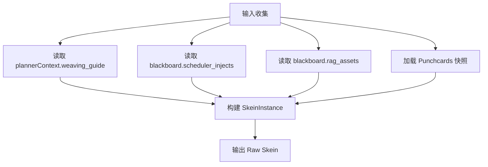

# Skein 编织系统设计规范 (Skein Weaving System)

**版本**: 1.1.0
**日期**: 2026-02-19
**状态**: Draft
**关联文档**:
- [`README.md`](README.md)
- [`preset-system.md`](preset-system.md)
- [`../mnemosyne/abstract-data-structures.md`](../mnemosyne/abstract-data-structures.md)
- [`../workflows/prompt-processing.md`](../workflows/prompt-processing.md)

---

## 1. 核心概念 (Core Concepts)

**Skein (绞纱)** 是 Jacquard 编排层中的核心数据容器。与传统的 Prompt 字符串拼接不同，Skein 是一个**具备语义感知的异构区块容器**。它不仅承载文本，还承载了每个文本块的意图、优先级和编织逻辑。

**编织 (Weaving)** 是指将来自不同源头（系统预设、对话历史、世界书、RAG 检索）的零散信息，按照预定策略"缝合"成一个连贯的线性上下文的过程。

### 1.1 核心价值
1.  **像素级控制**: 精确控制每条信息在 Context Window 中的位置（如"倒数第3条"）。
2.  **语义去重**: 基于语义标签防止信息重复（如避免 System Prompt 和 Lorebook 同时介绍"世界背景"）。
3.  **动态聚焦**: 根据 Planner 的决策（如"战斗中"）动态调整不同类型信息的权重。

---

## 2. 数据结构 (Data Structures)

Skein 概念根据生命周期和用途明确区分为三种形态：**SkeinTemplate（静态配置）**、**SkeinInstance（运行时实例）**、**SkeinFragment（编织中间产物）**。

### 2.1 SkeinTemplate — 静态配置

定义 Prompt 组装的骨架结构和编织规则，随 Preset 持久化存储，可跨会话复用。

```typescript
interface SkeinTemplate {
  // 槽位定义：systemChain 的结构框架
  slots: SlotDefinition[];
  
  // 编织规则：FloatingAsset 的注入策略
  weavingRules: WeavingRule[];
  
  // 默认约束
  defaultBudget: number;
  defaultFocusMode: string; // e.g., "narrative", "combat"
}

interface SlotDefinition {
  slotId: string;
  allowedTypes: BlockType[];
  position: 'system_start' | 'system_end' | 'before_history' | 'after_history';
  appendStrategy?: 'replace' | 'concat' | 'ignore_if_empty';
}

interface WeavingRule {
  assetType: 'lore' | 'event' | 'narrative' | 'thought';
  sourceQuadrant: 'axiom' | 'agent' | 'encyclopedia' | 'directive';
  injection: {
    priority: number;
    depthRange: [number, number]; // [min, max] relative depth
    positionStrategy: 'system_extension' | 'floating_relative' | 'user_anchor';
  };
}
```

**生命周期**：随 L1 Preset 配置持久化，可被多个 Tapestry 共享。

### 2.2 SkeinInstance — 运行时实例

单次 LLM 调用的完整上下文载体，由 SkeinTemplate 实例化而来，绑定特定 Tapestry 和 Turn。

```typescript
interface SkeinInstance {
  // 实例身份
  instanceId: string;
  templateId: string;              // 引用 SkeinTemplate
  tapestryId: string;              // 绑定的织卷
  turnId: string;                  // 绑定的回合
  
  // 1. 经线 (System Chain): 已渲染的系统提示
  systemChain: PromptBlock[];
  
  // 2. 纬线 (History Chain): 从 Mnemosyne 拉取的历史记录
  historyChain: PromptBlock[];
  
  // 3. 浮线 (Floating Chain): 已激活的动态资产
  floatingChain: FloatingAsset[];
  
  // 运行时约束与状态
  metadata: {
    tokenLimit: number;
    focusMode: string;
    createdAt: number;
    expiresAt: number;             // 调用超时时间
  };
}
```

**生命周期**：单次 LLM 调用周期（从 Planner 决策到收到回复），不可跨会话复用。

### 2.3 SkeinFragment — 编织中间产物

Weaving 算法各步骤的临时输出，携带阶段标记用于调试和状态追踪。

```typescript
interface SkeinFragment {
  // 当前编织阶段
  stage: 'skeleton' | 'anchored' | 'stitched' | 'deduplicated' | 'truncated';
  
  // 当前步骤处理后的区块列表
  blocks: PromptBlock[];
  
  // 待处理资产池（随步骤推进逐步消耗）
  pendingAssets: FloatingAsset[];
  
  // 跨步骤传递的中间状态
  carryOver: {
    depthMap?: Map<string, number>;     // 消息深度映射
    tokenAcc?: number;                   // 当前累计 Token
    dedupSet?: Set<string>;              // 已去重资产 ID
  };
}
```

**生命周期**：单个 Weaving 步骤内，随用随弃，不持久化。

---

### 2.4 PromptBlock (基础区块)

构成 System Chain 和 History Chain 的原子单位。

```typescript
interface PromptBlock {
  id: string;
  type: BlockType; // 见 preset-system.md 定义 (e.g., META_IDENTITY, CHAT_HISTORY)
  
  role: 'system' | 'user' | 'assistant' | 'tool';
  content: string; // 支持 Jinja2 模板
  
  // 动态状态
  isActive: boolean;
  tokenCount?: number; // 预估或实测值
}
```

### 2.5 FloatingAsset (浮动资产)

Floating Chain 中的节点。它是 Mnemosyne 数据在 Jacquard 中的投影。

```typescript
interface FloatingAsset {
  // 1. 资产身份
  id: string;          // 对应 LorebookEntry.id 或 Event.id
  sourceType: 'lore' | 'event' | 'narrative' | 'thought';
  
  // 2. 内容载体 (Lazy Load)
  content: string;     // 实际文本
  summary?: string;    // 用于去重比对的摘要
  
  // 3. 编织参数 (Injection Strategy)
  injection: {
    priority: number;         // 排序权重 (绝对值)
    depthHint: number;        // 期望深度 (0 = 紧贴最新消息)
    positionStrategy: 'system_extension' | 'floating_relative' | 'user_anchor';
    budgetCost: number;       // Token 消耗预估
  };
  
  // 4. 上下文关联
  triggers: string[];       // 触发词
  refersTo: string[];       // 关联实体 ID
}
```

---

## 3. 输入接口规范 (Input Interface)

Skein Builder 从多个来源消费数据，构建完整的 SkeinInstance。

### 3.1 输入来源汇总

| 来源 | 位置 | 数据类型 | 说明 |
|------|------|----------|------|
| **Planner** | `context.plannerContext` | `CurationPlan`, `WeavingGuide` | 策展决策和编织指令 |
| **Scheduler** | `context.blackboard` | `List[PromptBlock]` | 定时任务注入块 |
| **RAG Retriever** | `context.blackboard` | `List[FloatingAsset]` | 检索到的浮动资产 |
| **Mnemosyne** | 直接查询 | `Punchcards` (快照) | L1/L2/L3 状态快照 |

### 3.2 输入处理流程



### 3.3 字段映射规范

| WeavingGuide 字段 | SkeinInstance 字段 | 处理方式 |
|-------------------|-------------------|----------|
| `historyChain` | `historyChain` | 直接赋值 |
| `floatingAssets` | `floatingChain` | 直接赋值 |
| `systemExtensions` | `systemChain` | 追加到末尾 |
| `recommendedTemplate` | `templateId` | 用于实例化 Template |

## 4. Mnemosyne 映射策略 (Mnemosyne Integration)

根据 Mnemosyne 的 **4-Quadrant Static Taxonomy**，我们将不同类型的记忆映射到不同的编织策略上。

| Mnemosyne 分类 | 语义位置 (Semantic Slot) | 注入策略 (`injection`) | 典型示例 |
| :--- | :--- | :--- | :--- |
| **Axiom (公理)** | **System Extension** | `pos: system_extension`, `prio: 100` | 物理法则、魔法基础设定、绝对的世界观。 |
| **Agent (代理)** | **Recent History** | `pos: floating_relative`, `depth: 2-4`, `prio: 90` | 在场 NPC 状态、当前场景环境描述。 |
| **Encyclopedia (百科)** | **Deep Context** | `pos: floating_relative`, `depth: 5-10`, `prio: 50` | 历史背景、物品详细说明、RAG 检索结果。 |
| **Directive (指令)** | **User Anchor** | `pos: user_anchor`, `prio: 110` | 针对当前回合的 GM 指令、越狱 Prompt。 |

---

## 4. 编织算法 (The Weaving Algorithm)

Assembler 组件执行的核心逻辑，负责将 `SkeinInstance` 的三条链通过一系列 `SkeinFragment` 阶段，最终坍缩为单一消息列表。

### Step 1: 骨架构建 (Skeleton Construction) → Fragment: `skeleton`

该步骤由 `SkeinTemplate.slots` 配置驱动，产出 `SkeinFragment(stage='skeleton')`。

**输入**: `SkeinInstance`
**输出**: `SkeinFragment(stage='skeleton')`

1.  **初始化 Fragment**: 创建 `SkeinFragment`，`stage='skeleton'`，`pendingAssets = instance.floatingChain`。
2.  **加载 System Chain**: 遍历 `template.slots` 定义的槽位。
3.  **填充 Slot**: 从 `instance.systemChain` 中查找匹配 `allowed_types` 的 Block 填充各 Slot。
4.  **Axiom 注入**: 扫描 `pendingAssets` 中所有 `positionStrategy == 'system_extension'` 的资产，追加到指定了 `append` 策略的 Slot（如 `world_context`）。已注入的资产从 `pendingAssets` 移除。
5.  **产出**: 将构建好的骨架区块存入 `fragment.blocks`。

### Step 2: 锚点定位 (Anchoring) → Fragment: `anchored`

处理 `History Chain`，为后续浮线插入建立深度坐标系。

**输入**: `SkeinFragment(stage='skeleton')`, `instance.historyChain`
**输出**: `SkeinFragment(stage='anchored')`

1.  反向遍历 `historyChain` (Newest -> Oldest)。
2.  为每条消息分配 **相对深度索引 (Depth Index)**：
    *   最新消息 Depth = 0。
    *   次新消息 Depth = 1。
    *   ...
3.  将深度映射存入 `fragment.carryOver.depthMap`。

### Step 3: 浮线缝合 (Floating Stitching) → Fragment: `stitched`

该步骤由 `SkeinTemplate.weavingRules` 配置驱动。

**输入**: `SkeinFragment(stage='anchored')`
**输出**: `SkeinFragment(stage='stitched')`

处理剩余的 `pendingAssets` (Agent, Encyclopedia)。
1.  **规则匹配**: 遍历每个待处理资产，根据其 `sourceType` 匹配 `weavingRules` 中定义的注入策略（深度范围、优先级）。
2.  **分组与排序**: 将资产分配到目标深度，并在同一深度内按 `priority` 降序排序。
3.  **插入遍历**: 按时间顺序遍历 History Chain，在每个 Depth 节点前插入对应资产。
4.  **User Anchor 处理**: 对于 `positionStrategy == 'user_anchor'` 的资产，紧贴最新的 User Message 插入。
5.  **产出**: 缝合完成的完整区块列表存入 `fragment.blocks`。

### Step 4: RAG 融合与去重 (RAG Fusion & Deduplication) → Fragment: `deduplicated`

**输入**: `SkeinFragment(stage='stitched')`
**输出**: `SkeinFragment(stage='deduplicated')`

1.  **精准去重**: 检查 `FloatingAsset.id`，利用 `fragment.carryOver.dedupSet` 确保同一条 Lore 不会被多次插入。
2.  **语义覆盖**:
    *   如果已插入高优先级的 **Agent** 条目（如"Alice 的详细状态"）。
    *   且存在低优先级的 **Encyclopedia** 条目（如"Alice 的简略介绍"）。
    *   检测到两者 `refersTo` 包含相同实体 ID，则丢弃低优先级条目。
3.  **产出**: 去重后的区块列表。

### Step 5: 预算裁剪 (Budget Truncation) → Fragment: `truncated` / Final Output

**输入**: `SkeinFragment(stage='deduplicated')`
**输出**: `List<Message>` (Filament 协议格式)

1.  计算累计 Token，存入 `fragment.carryOver.tokenAcc`。
2.  若超限，执行 **智能丢弃 (Smart Eviction)**：
    *   **Phase 1 (Low Value)**: 移除优先级 < 50 的 Encyclopedia 条目。
    *   **Phase 2 (History Trim)**: 从最久远的 History 消息开始丢弃。
    *   **Phase 3 (Emergency)**: 仅保留 System + Recent History。
3.  **最终产出**: 将 `fragment.blocks` 转换为 Filament 协议的 `List<Message>` 格式。

**注意**: 所有中间阶段的 `SkeinFragment` 可用于调试和流水线拦截，但不应持久化。

---

## 5. 算法伪代码 (Pseudocode)

```python
def weave(instance: SkeinInstance, template: SkeinTemplate) -> List[Message]:
    # Step 1: Skeleton Construction
    frag1 = SkeinFragment(
        stage='skeleton',
        pendingAssets=instance.floatingChain[:]
    )
    # Fill slots from template
    for slot in template.slots:
        blocks = [b for b in instance.systemChain if b.type in slot.allowedTypes]
        frag1.blocks.extend(blocks)
    # Inject axioms
    axioms = [a for a in frag1.pendingAssets if a.injection.positionStrategy == 'system_extension']
    frag1.blocks.extend(to_prompt_blocks(axioms))
    frag1.pendingAssets = [a for a in frag1.pendingAssets if a not in axioms]
    
    # Step 2: Anchoring
    frag2 = SkeinFragment(stage='anchored', pendingAssets=frag1.pendingAssets)
    frag2.carryOver.depthMap = build_depth_map(instance.historyChain)
    
    # Step 3: Floating Stitching
    frag3 = SkeinFragment(stage='stitched', blocks=frag1.blocks[:])
    frag3.pendingAssets = frag2.pendingAssets[:]
    frag3.carryOver.depthMap = frag2.carryOver.depthMap
    
    # Match and sort assets
    for asset in frag3.pendingAssets:
        rule = find_matching_rule(template.weavingRules, asset)
        asset.targetDepth = calculate_depth(rule, frag3.carryOver.depthMap)
    
    # Insert into history
    final_history = []
    sorted_history = sorted(instance.historyChain, key=lambda m: m.timestamp, reverse=True)
    for depth, msg in enumerate(sorted_history):
        injects = [a for a in frag3.pendingAssets if a.targetDepth == depth]
        if msg.role == 'user' and depth == 0:
            directives = [a for a in frag3.pendingAssets if a.injection.positionStrategy == 'user_anchor']
            injects.extend(directives)
        final_history.extend(to_prompt_blocks(injects))
        final_history.append(msg)
    final_history.reverse()  # Restore chronological order
    frag3.blocks.extend(final_history)
    
    # Step 4: Deduplication
    frag4 = SkeinFragment(stage='deduplicated', blocks=[])
    frag4.carryOver.dedupSet = set()
    for block in frag3.blocks:
        if block.type == 'FLOATING_ASSET':
            if block.id in frag4.carryOver.dedupSet:
                continue  # Skip duplicate
            # Check semantic coverage
            if is_semantically_covered(block, frag4.blocks):
                continue
            frag4.carryOver.dedupSet.add(block.id)
        frag4.blocks.append(block)
    
    # Step 5: Truncation
    frag5 = SkeinFragment(stage='truncated', blocks=frag4.blocks[:])
    frag5.carryOver.tokenAcc = sum(b.tokenCount for b in frag5.blocks)
    if frag5.carryOver.tokenAcc > instance.metadata.tokenLimit:
        frag5.blocks = smart_evict(frag5.blocks, instance.metadata.tokenLimit)
    
    # Final: Convert to Filament Messages
    return to_filament_messages(frag5.blocks)
```

---

## 6. 优势总结

1.  **生命周期清晰**: 通过 `SkeinTemplate` / `SkeinInstance` / `SkeinFragment` 的区分，明确了静态配置、运行时数据和中间产物的边界。
2.  **结构化有序**: 彻底告别"把所有 Lore 塞到开头"的粗放做法，实现了信息的**情境化注入**。
3.  **Mnemosyne 协同**: 完美承接数据层的结构化设计，让"数据分类"真正转化为"生成效果"。
4.  **Token 效率**: 智能去重和分级丢弃策略，确保有限的上下文窗口被最高价值的信息填充。
5.  **可调试性**: `SkeinFragment` 的阶段标记允许开发者在任意编织步骤拦截和检查中间状态。
