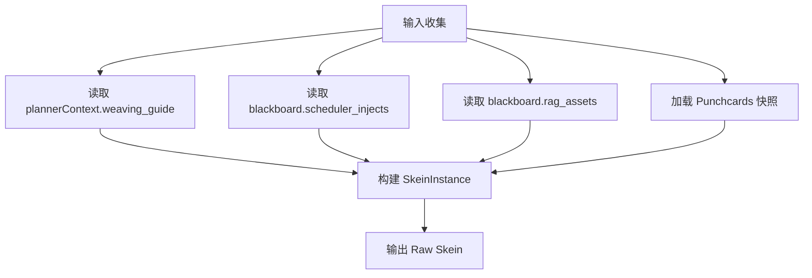

# Skein 编织系统设计规范 (Skein Weaving System)

**版本**: 1.2.0
**日期**: 2026-03-11
**状态**: Active
**关联文档**:
- [`README.md`](README.md)
- [`preset-system.md`](preset-system.md)
- [`../mnemosyne/abstract-data-structures.md`](../mnemosyne/abstract-data-structures.md)
- [`../workflows/prompt-processing.md`](../workflows/prompt-processing.md)

---

## 📖 术语使用说明

本文档使用**隐喻术语**进行架构描述：

| 隐喻术语 | 技术术语 | 说明 |
|---------|---------|------|
| Skein (绞纱) | **PromptBundle** (提示词包) | Prompt 组装容器 |
| Weaving (编织) | **Assemble** (组装) | Prompt 构建过程 |
| Shuttle (梭子) | **Plugin** (插件) | 流水线功能单元 |

在代码实现时，请使用 [`../naming-convention.md`](../naming-convention.md) 中定义的技术术语。

---

## 1. 核心概念 (Core Concepts)

**Skein (绞纱)** 是 Jacquard 编排层中的核心数据容器。与传统的 Prompt 字符串拼接不同，Skein 是一个**具备语义感知的异构区块容器**。它不仅承载文本，还承载了每个文本块的意图、优先级和编织逻辑。

**编织 (Weaving)** 是指将来自不同源头（系统预设、对话历史、世界书、RAG 检索）的零散信息，按照预定策略"缝合"成一个连贯的线性上下文的过程。

### 1.1 核心价值
1.  **像素级控制**: 精确控制每条信息在 Context Window 中的位置（如"倒数第3条"）。
2.  **语义去重**: 基于语义标签防止信息重复（如避免 System Prompt 和 Lorebook 同时介绍"世界背景"）。
3.  **动态聚焦**: 根据 Planner 的决策（如"战斗中"）动态调整不同类型信息的权重。

---

## 2. 数据结构 (Data Structures)

Skein 概念根据生命周期和用途明确区分为三种形态：**SkeinTemplate（静态配置）**、**SkeinInstance（运行时实例）**、**SkeinFragment（编织中间产物）**。

### 2.1 SkeinTemplate — 静态配置

定义 Prompt 组装的骨架结构和编织规则，随 Preset 持久化存储，可跨会话复用。

```dart
// lib/models/skein_template.dart
/// SkeinTemplate - Skein 静态配置
///
/// 定义 Prompt 组装的骨架结构和编织规则，随 Preset 持久化存储
class SkeinTemplate {
  /// 槽位定义：systemChain 的结构框架
  final List<SlotDefinition> slots;
  
  /// 编织规则：FloatingAsset 的注入策略
  final List<WeavingRule> weavingRules;
  
  /// 默认 Token 预算
  final int defaultBudget;
  
  /// 默认聚焦模式 (e.g., "narrative", "combat")
  final String defaultFocusMode;
  
  const SkeinTemplate({
    required this.slots,
    required this.weavingRules,
    required this.defaultBudget,
    required this.defaultFocusMode,
  });
}

/// 槽位定义
class SlotDefinition {
  /// 槽位唯一标识
  final String slotId;
  
  /// 允许的区块类型
  final List<BlockType> allowedTypes;
  
  /// 注入位置
  final SlotPosition position;
  
  /// 追加策略
  final AppendStrategy? appendStrategy;
  
  const SlotDefinition({
    required this.slotId,
    required this.allowedTypes,
    required this.position,
    this.appendStrategy,
  });
}

/// 槽位位置枚举
enum SlotPosition {
  systemStart,
  systemEnd,
  beforeHistory,
  afterHistory,
}

/// 追加策略枚举
enum AppendStrategy {
  replace,
  concat,
  ignoreIfEmpty,
}

/// 编织规则
class WeavingRule {
  /// 资产类型
  final AssetType assetType;
  
  /// 来源象限
  final SourceQuadrant sourceQuadrant;
  
  /// 注入配置
  final InjectionConfig injection;
  
  const WeavingRule({
    required this.assetType,
    required this.sourceQuadrant,
    required this.injection,
  });
}

/// 资产类型枚举
enum AssetType {
  lore,
  event,
  narrative,
  thought,
}

/// 来源象限枚举
enum SourceQuadrant {
  axiom,
  agent,
  encyclopedia,
  directive,
}

/// 注入配置
class InjectionConfig {
  /// 优先级
  final int priority;
  
  /// 深度范围 [min, max]
  final (int, int) depthRange;
  
  /// 位置策略
  final PositionStrategy positionStrategy;
  
  const InjectionConfig({
    required this.priority,
    required this.depthRange,
    required this.positionStrategy,
  });
}

/// 位置策略枚举
enum PositionStrategy {
  systemExtension,
  floatingRelative,
  userAnchor,
}
```

**生命周期**：随 L1 Preset 配置持久化，可被多个 Tapestry 共享。

### 2.2 SkeinInstance — 运行时实例

单次 LLM 调用的完整上下文载体，由 SkeinTemplate 实例化而来，绑定特定 Tapestry 和 Turn。

```dart
// lib/models/skein_instance.dart
/// SkeinInstance - Skein 运行时实例
///
/// 单次 LLM 调用的完整上下文载体，由 SkeinTemplate 实例化而来
class SkeinInstance {
  /// 实例唯一标识
  final String instanceId;
  
  /// 引用 SkeinTemplate ID
  final String templateId;
  
  /// 绑定的织卷 ID
  final String tapestryId;
  
  /// 绑定的回合 ID
  final String turnId;
  
  /// 1. 经线 (System Chain): 已渲染的系统提示
  final List<PromptBlock> systemChain;
  
  /// 2. 纬线 (History Chain): 从 Mnemosyne 拉取的历史记录
  final List<PromptBlock> historyChain;
  
  /// 3. 浮线 (Floating Chain): 已激活的动态资产
  final List<FloatingAsset> floatingChain;
  
  /// 运行时约束与状态
  final SkeinInstanceMetadata metadata;
  
  const SkeinInstance({
    required this.instanceId,
    required this.templateId,
    required this.tapestryId,
    required this.turnId,
    required this.systemChain,
    required this.historyChain,
    required this.floatingChain,
    required this.metadata,
  });
}

/// SkeinInstance 元数据
class SkeinInstanceMetadata {
  /// Token 限制
  final int tokenLimit;
  
  /// 聚焦模式
  final String focusMode;
  
  /// 创建时间戳
  final DateTime createdAt;
  
  /// 超时时间戳
  final DateTime expiresAt;
  
  const SkeinInstanceMetadata({
    required this.tokenLimit,
    required this.focusMode,
    required this.createdAt,
    required this.expiresAt,
  });
}
```

**生命周期**：单次 LLM 调用周期（从 Planner 决策到收到回复），不可跨会话复用。

### 2.3 SkeinFragment — 编织中间产物

Weaving 算法各步骤的临时输出，携带阶段标记用于调试和状态追踪。

```dart
// lib/models/skein_fragment.dart
/// SkeinFragment - Weaving 算法中间产物
///
/// 携带阶段标记用于调试和状态追踪
class SkeinFragment {
  /// 当前编织阶段
  final WeavingStage stage;
  
  /// 当前步骤处理后的区块列表
  final List<PromptBlock> blocks;
  
  /// 待处理资产池（随步骤推进逐步消耗）
  final List<FloatingAsset> pendingAssets;
  
  /// 跨步骤传递的中间状态
  final FragmentCarryOver? carryOver;
  
  const SkeinFragment({
    required this.stage,
    required this.blocks,
    required this.pendingAssets,
    this.carryOver,
  });
}

/// 编织阶段枚举
enum WeavingStage {
  skeleton,
  anchored,
  stitched,
  deduplicated,
  truncated,
}

/// 片段中间状态
class FragmentCarryOver {
  /// 消息深度映射
  final Map<String, int>? depthMap;
  
  /// 当前累计 Token
  final int? tokenAcc;
  
  /// 已去重资产 ID 集合
  final Set<String>? dedupSet;
  
  const FragmentCarryOver({
    this.depthMap,
    this.tokenAcc,
    this.dedupSet,
  });
}
```

**生命周期**：单个 Weaving 步骤内，随用随弃，不持久化。

---

### 2.4 PromptBlock (基础区块)

构成 System Chain 和 History Chain 的原子单位。

```dart
// lib/models/prompt_block.dart
/// PromptBlock - 构成 System Chain 和 History Chain 的原子单位
class PromptBlock {
  /// 唯一标识
  final String id;
  
  /// 区块类型 (e.g., META_IDENTITY, CHAT_HISTORY)
  final BlockType type;
  
  /// 消息角色
  final MessageRole role;
  
  /// 内容 (支持 Jinja2 模板)
  final String content;
  
  /// 是否激活
  final bool isActive;
  
  /// Token 计数（预估或实测值）
  final int? tokenCount;
  
  const PromptBlock({
    required this.id,
    required this.type,
    required this.role,
    required this.content,
    required this.isActive,
    this.tokenCount,
  });
}

/// 区块类型枚举
enum BlockType {
  metaIdentity,
  metaUiSchema,
  characterDefinition,
  loreEntry,
  chatHistory,
  systemInstruction,
  floatingAsset,
}

/// 消息角色枚举
enum MessageRole {
  system,
  user,
  assistant,
  tool,
}
```

### 2.5 FloatingAsset (浮动资产)

Floating Chain 中的节点。它是 Mnemosyne 数据在 Jacquard 中的投影。

```dart
// lib/models/floating_asset.dart
/// FloatingAsset - Floating Chain 中的节点
///
/// Mnemosyne 数据在 Jacquard 中的投影
class FloatingAsset {
  /// 资产唯一标识 (对应 LorebookEntry.id 或 Event.id)
  final String id;
  
  /// 来源类型
  final AssetType sourceType;
  
  /// 实际文本内容
  final String content;
  
  /// 用于去重比对的摘要
  final String? summary;
  
  /// 编织参数
  final AssetInjection injection;
  
  /// 触发词列表
  final List<String> triggers;
  
  /// 关联实体 ID 列表
  final List<String> refersTo;
  
  const FloatingAsset({
    required this.id,
    required this.sourceType,
    required this.content,
    this.summary,
    required this.injection,
    required this.triggers,
    required this.refersTo,
  });
}

/// 资产注入配置
class AssetInjection {
  /// 排序权重 (绝对值)
  final int priority;
  
  /// 期望深度 (0 = 紧贴最新消息)
  final int depthHint;
  
  /// 位置策略
  final PositionStrategy positionStrategy;
  
  /// Token 消耗预估
  final int budgetCost;
  
  const AssetInjection({
    required this.priority,
    required this.depthHint,
    required this.positionStrategy,
    required this.budgetCost,
  });
}
```

---

## 3. 输入接口规范 (Input Interface)

Skein Builder 从多个来源消费数据，构建完整的 SkeinInstance。

### 3.1 输入来源汇总

Skein Builder 通过统一接口消费上游插件产物。这些插件的执行顺序由 [动态优先级编排](../plugin-architecture.md#43-动态优先级编排) 决定：

| 来源 | 位置 | 数据类型 | 说明 | 默认优先级 |
|------|------|----------|------|-----------|
| **Planner** | `context.plannerContext` | `CurationPlan`, `WeavingGuide` | 策展决策和编织指令 | 100 (`decision` 阶段) |
| **Scheduler** | `context.blackboard['scheduler_injects']` | `List[PromptBlock]` | 定时任务注入块 | 200 (`preparation` 阶段) |
| **RAG Retriever** | `context.blackboard['rag_assets']` | `List[FloatingAsset]` | 检索到的浮动资产 | 250 (`preparation` 阶段) |
| **Mnemosyne** | 直接查询 | `Punchcards` (快照) | L1/L2/L3 状态快照 | - |

> **注意**: Scheduler 和 RAG Retriever 同属 `preparation` 阶段，其相对顺序可通过 L2 Pattern 的 `orchestration.overrides` 配置调整。详见 [Scheduler 与 RAG 职责分工](../scheduler-component.md#7-与-rag-retriever-的职责分工)。

### 3.2 输入处理流程



### 3.3 字段映射规范

#### 3.3.1 WeavingGuide 映射

| WeavingGuide 字段 | SkeinInstance 字段 | 处理方式 |
|-------------------|-------------------|----------|
| `historyChain` | `historyChain` | 直接赋值 |
| `floatingAssets` | `floatingChain` | 直接赋值 |
| `systemExtensions` | `systemChain` | 追加到末尾 |
| `recommendedTemplate` | `templateId` | 用于实例化 Template |

#### 3.3.2 Blackboard 产物处理

| Blackboard Key | 产物类型 | 映射目标 | 优先级处理 |
|----------------|----------|----------|------------|
| `scheduler_injects` | `List[PromptBlock]` | 根据 `block.type` 分别注入：<br>- `inject_system` → `systemChain`<br>- `inject_user` → `historyChain`<br>- `force_thought` → `floatingChain` | Scheduler 优先级：120-150 |
| `rag_assets` | `List[FloatingAsset]` | `floatingChain` | Encyclopedia 默认优先级：50 |

> **冲突解决**: 当 Scheduler 注入和 RAG 检索内容存在语义重叠时，Builder 根据 `priority` 字段和 `sourceQuadrant` 进行去重和排序。详见 [Step 4: RAG 融合与去重](#step-4-rag-融合与去重-rag-fusion--deduplication--fragment-deduplicated)。

## 4. Mnemosyne 映射策略 (Mnemosyne Integration)

根据 Mnemosyne 的 **4-Quadrant Static Taxonomy**，我们将不同类型的记忆映射到不同的编织策略上。

| Mnemosyne 分类 | 语义位置 (Semantic Slot) | 注入策略 (`injection`) | 典型示例 |
| :--- | :--- | :--- | :--- |
| **Axiom (公理)** | **System Extension** | `pos: system_extension`, `prio: 100` | 物理法则、魔法基础设定、绝对的世界观。 |
| **Agent (代理)** | **Recent History** | `pos: floating_relative`, `depth: 2-4`, `prio: 90` | 在场 NPC 状态、当前场景环境描述。 |
| **Encyclopedia (百科)** | **Deep Context** | `pos: floating_relative`, `depth: 5-10`, `prio: 50` | 历史背景、物品详细说明、RAG 检索结果。 |
| **Directive (指令)** | **User Anchor** | `pos: user_anchor`, `prio: 110` | 针对当前回合的 GM 指令、越狱 Prompt。 |

---

## 4. 编织算法 (The Weaving Algorithm)

Assembler 组件执行的核心逻辑，负责将 `SkeinInstance` 的三条链通过一系列 `SkeinFragment` 阶段，最终坍缩为单一消息列表。

### Step 1: 骨架构建 (Skeleton Construction) → Fragment: `skeleton`

该步骤由 `SkeinTemplate.slots` 配置驱动，产出 `SkeinFragment(stage='skeleton')`。

**输入**: `SkeinInstance`
**输出**: `SkeinFragment(stage='skeleton')`

1.  **初始化 Fragment**: 创建 `SkeinFragment`，`stage='skeleton'`，`pendingAssets = instance.floatingChain`。
2.  **加载 System Chain**: 遍历 `template.slots` 定义的槽位。
3.  **填充 Slot**: 从 `instance.systemChain` 中查找匹配 `allowed_types` 的 Block 填充各 Slot。
4.  **Axiom 注入**: 扫描 `pendingAssets` 中所有 `positionStrategy == 'system_extension'` 的资产，追加到指定了 `append` 策略的 Slot（如 `world_context`）。已注入的资产从 `pendingAssets` 移除。
5.  **产出**: 将构建好的骨架区块存入 `fragment.blocks`。

### Step 2: 锚点定位 (Anchoring) → Fragment: `anchored`

处理 `History Chain`，为后续浮线插入建立深度坐标系。

**输入**: `SkeinFragment(stage='skeleton')`, `instance.historyChain`
**输出**: `SkeinFragment(stage='anchored')`

1.  反向遍历 `historyChain` (Newest -> Oldest)。
2.  为每条消息分配 **相对深度索引 (Depth Index)**：
    *   最新消息 Depth = 0。
    *   次新消息 Depth = 1。
    *   ...
3.  将深度映射存入 `fragment.carryOver.depthMap`。

### Step 3: 浮线缝合 (Floating Stitching) → Fragment: `stitched`

该步骤由 `SkeinTemplate.weavingRules` 配置驱动。

**输入**: `SkeinFragment(stage='anchored')`
**输出**: `SkeinFragment(stage='stitched')`

处理剩余的 `pendingAssets` (Agent, Encyclopedia)。
1.  **规则匹配**: 遍历每个待处理资产，根据其 `sourceType` 匹配 `weavingRules` 中定义的注入策略（深度范围、优先级）。
2.  **分组与排序**: 将资产分配到目标深度，并在同一深度内按 `priority` 降序排序。
3.  **插入遍历**: 按时间顺序遍历 History Chain，在每个 Depth 节点前插入对应资产。
4.  **User Anchor 处理**: 对于 `positionStrategy == 'user_anchor'` 的资产，紧贴最新的 User Message 插入。
5.  **产出**: 缝合完成的完整区块列表存入 `fragment.blocks`。

### Step 4: RAG 融合与去重 (RAG Fusion & Deduplication) → Fragment: `deduplicated`

**输入**: `SkeinFragment(stage='stitched')`
**输出**: `SkeinFragment(stage='deduplicated')`

1.  **精准去重**: 检查 `FloatingAsset.id`，利用 `fragment.carryOver.dedupSet` 确保同一条 Lore 不会被多次插入。
2.  **语义覆盖**:
    *   如果已插入高优先级的 **Agent** 条目（如"Alice 的详细状态"）。
    *   且存在低优先级的 **Encyclopedia** 条目（如"Alice 的简略介绍"）。
    *   检测到两者 `refersTo` 包含相同实体 ID，则丢弃低优先级条目。
3.  **产出**: 去重后的区块列表。

### Step 5: 预算裁剪 (Budget Truncation) → Fragment: `truncated` / Final Output

**输入**: `SkeinFragment(stage='deduplicated')`
**输出**: `List<Message>` (Filament 协议格式)

1.  计算累计 Token，存入 `fragment.carryOver.tokenAcc`。
2.  若超限，执行 **智能丢弃 (Smart Eviction)**：
    *   **Phase 1 (Low Value)**: 移除优先级 < 50 的 Encyclopedia 条目。
    *   **Phase 2 (History Trim)**: 从最久远的 History 消息开始丢弃。
    *   **Phase 3 (Emergency)**: 仅保留 System + Recent History。
3.  **最终产出**: 将 `fragment.blocks` 转换为 Filament 协议的 `List<Message>` 格式。

**注意**: 所有中间阶段的 `SkeinFragment` 可用于调试和流水线拦截，但不应持久化。

---

## 5. 算法伪代码 (Pseudocode)

```
// 伪代码：Weaving 算法
// 输入：SkeinInstance (运行时实例), SkeinTemplate (模板配置)
// 输出：List<Message> (Filament 消息列表)

FUNCTION weave(SkeinInstance instance, SkeinTemplate template) -> List<Message>:
  
  // ========== Step 1: Skeleton Construction (骨架构建) ==========
  CREATE frag1 AS SkeinFragment(
    stage: WeavingStage.skeleton,
    pendingAssets: COPY(instance.floatingChain),
    blocks: []
  )
  
  // 填充模板槽位
  FOR EACH slot IN template.slots:
    blocks = FILTER instance.systemChain WHERE block.type IN slot.allowedTypes
    ADD ALL blocks TO frag1.blocks
  
  // 注入公理 (Axioms)
  axioms = FILTER frag1.pendingAssets
           WHERE injection.positionStrategy == PositionStrategy.systemExtension
  ADD ALL to_prompt_blocks(axioms) TO frag1.blocks
  REMOVE axioms FROM frag1.pendingAssets
  
  // ========== Step 2: Anchoring (锚定) ==========
  CREATE frag2 AS SkeinFragment(
    stage: WeavingStage.anchored,
    pendingAssets: frag1.pendingAssets,
    blocks: frag1.blocks,
    carryOver: FragmentCarryOver(
      depthMap: BUILD_DEPTH_MAP(instance.historyChain)
    )
  )
  
  // ========== Step 3: Floating Stitching (浮线编织) ==========
  CREATE frag3 AS SkeinFragment(
    stage: WeavingStage.stitched,
    blocks: COPY(frag1.blocks),
    pendingAssets: COPY(frag2.pendingAssets),
    carryOver: COPY(frag2.carryOver)
  )
  
  // 匹配并排序资产
  FOR EACH asset IN frag3.pendingAssets:
    rule = FIND_MATCHING_RULE(template.weavingRules, asset)
    asset.targetDepth = CALCULATE_DEPTH(rule, frag3.carryOver.depthMap)
  
  // 插入历史记录
  final_history = EMPTY_LIST
  sorted_history = SORT_BY(instance.historyChain, timestamp, DESCENDING)
  
  FOR EACH (depth, msg) IN ENUMERATE(sorted_history):
    injects = FILTER frag3.pendingAssets WHERE targetDepth == depth
    
    // 用户锚点策略：在最新消息后注入指令
    IF msg.role == MessageRole.user AND depth == 0:
      directives = FILTER frag3.pendingAssets
                   WHERE injection.positionStrategy == PositionStrategy.userAnchor
      ADD ALL directives TO injects
    
    ADD ALL to_prompt_blocks(injects) TO final_history
    ADD msg TO final_history
  
  REVERSE(final_history)  // 恢复时间顺序
  ADD ALL final_history TO frag3.blocks
  
  // ========== Step 4: Deduplication (去重) ==========
  CREATE frag4 AS SkeinFragment(
    stage: WeavingStage.deduplicated,
    blocks: [],
    carryOver: FragmentCarryOver(dedupSet: EMPTY_SET)
  )
  
  FOR EACH block IN frag3.blocks:
    IF block.type == BlockType.floatingAsset:
      IF block.id IN frag4.carryOver.dedupSet:
        CONTINUE  // 跳过重复项
      
      // 检查语义覆盖
      IF IS_SEMANTICALLY_COVERED(block, frag4.blocks):
        CONTINUE
      
      ADD block.id TO frag4.carryOver.dedupSet
    
    ADD block TO frag4.blocks
  
  // ========== Step 5: Truncation (截断) ==========
  CREATE frag5 AS SkeinFragment(
    stage: WeavingStage.truncated,
    blocks: COPY(frag4.blocks),
    carryOver: FragmentCarryOver(
      tokenAcc: SUM(block.tokenCount FOR block IN frag4.blocks)
    )
  )
  
  IF frag5.carryOver.tokenAcc > instance.metadata.tokenLimit:
    frag5.blocks = SMART_EVICT(frag5.blocks, instance.metadata.tokenLimit)
  
  // ========== Final: 转换为 Filament Messages ==========
  RETURN TO_FILAMENT_MESSAGES(frag5.blocks)
```

---

## 6. 优势总结

1.  **生命周期清晰**: 通过 `SkeinTemplate` / `SkeinInstance` / `SkeinFragment` 的区分，明确了静态配置、运行时数据和中间产物的边界。
2.  **结构化有序**: 彻底告别"把所有 Lore 塞到开头"的粗放做法，实现了信息的**情境化注入**。
3.  **Mnemosyne 协同**: 完美承接数据层的结构化设计，让"数据分类"真正转化为"生成效果"。
4.  **Token 效率**: 智能去重和分级丢弃策略，确保有限的上下文窗口被最高价值的信息填充。
5.  **可调试性**: `SkeinFragment` 的阶段标记允许开发者在任意编织步骤拦截和检查中间状态。
