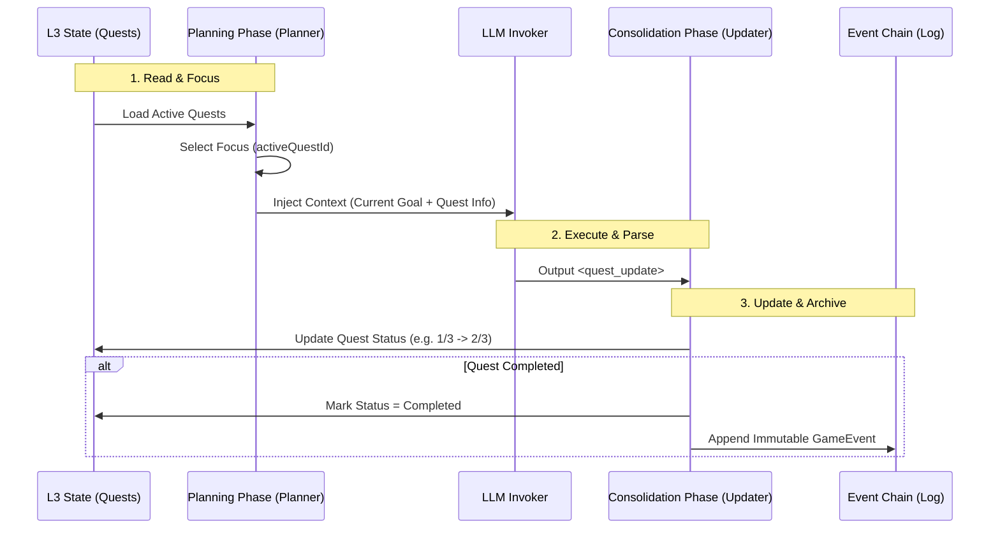

# 第三章：数据中枢与记忆引擎 (Mnemosyne Layer)

**版本**: 1.2.0
**日期**: 2026-03-11
**状态**: Active
**作者**: 资深系统架构师 (Architect Mode)
**源文档**: `system_architecture.md`, `mvu_integration_design.md`

> 术语体系参见 [naming-convention.md](../naming-convention.md)

---

## 1. 引擎概览 (Mnemosyne Overview)

**Mnemosyne** 是数据层的核心，它不再仅仅是静态数据的仓库，而是升级为 **动态上下文生成引擎 (Dynamic Context Generation Engine)**。它负责管理系统的"长期记忆"与"瞬时状态"，并为编排层提供精准的上下文快照。

**v1.1 变更**: 采用 Turn-Centric 架构，将微观叙事功能整合进 Turn 对象，消除与 NarrativeLog (Micro) 的冗余。

详细的底层存储与数据架构设计，请参阅：
* 👉 **[Mnemosyne SQLite 存储架构设计](../mnemosyne/sqlite-architecture.md)**
* 👉 **[混合资源管理与存储规范](../mnemosyne/hybrid-resource-management.md)** (v1.2 新增: 动静分离架构)
* 👉 **[Mnemosyne 抽象数据结构设计](../mnemosyne/abstract-data-structures.md)** (v1.1 更新: Turn-Centric)
* 👉 **[完整世界模型层设计](../mnemosyne/world-model-layer.md)** (v1.0.0 新增: Timeline/Location/Faction/Economy)
* 👉 **[Turn-Centric 架构决策](../../01_drafts/mnemosyne_architecture_decision_matrix.md)**

### 1.1 核心职责

1. **数据托管**: 管理 Lorebook, Presets, World Rules。
2. **混合事件存储**: 区分 **数值 (VWD)** 与 **事件 (Events)**，实现日常互动与关键剧情的分离处理。
3. **快照生成**: 根据 Time Pointer 聚合数据，生成不可变的 `Punchcards` (隐喻：织谱+丝络的切片)。
4. **状态管理**: 维护 RPG 变量，处理 VWD (Value with Description) 数据模型，并执行 **ACL 访问控制**。

---

## 2. 多维上下文链 (Multi-dimensional Context Chains)

虽然数据在物理上以 **增量 (Incremental)** 形式存储，但在逻辑上，Mnemosyne 将其投影为数条平行的 **上下文链网**。

### 2.1 链网结构

1. **History Chain (历史链)**:
    * 内容: 标准对话记录。
    * 逻辑: 线性投影，提供 LLM 理解剧情的连贯性。
2. **State Chain (状态链)**:
    * 内容: 结构化的 RPG 数值与状态 (VWD State Tree)。
    * 策略: **稀疏快照 (Sparse Snapshots) + 操作日志 (OpLog)**。
    * 隐喻: **丝络 (Threads)**。它是编织过程中不断加入的、改变织卷走向的"线"。
    * 作用: 确保"时间旅行"时，世界状态能精确回滚，并优化长对话性能。
3. **Event Chain (事件链)**:
    * 内容: **关键逻辑节点** (Quest, Achievement, Relationship Milestones)。
    * 逻辑: 稀疏存储，专用于游戏逻辑判断 (如 "Has completed Quest X?")。
4. **Narrative Chain (叙事链) - v1.1 重构**:
    * **v1.1 变更**: 采用 Turn-Centric 架构，移除独立的 Micro Narrative Log。
    * **内容**:
        * **Turn Summary (微观)**: 每个回合的摘要，由 Consolidation Phase LLM 生成，直接存储在 Turn 对象中，用于 RAG 检索。
        * **Macro Narrative (宏观)**: 跨时间段的章节总结，存储在 `macro_narratives` 表中。
    * **逻辑**: Turn Summary 作为 RAG 的最小检索单元，Macro Narrative 作为长期记忆的高级单元。
    * **显式叙事链接 (Explicit Narrative Linking)**:
        * Event Schema 中保留 `source_refs` 字段，允许检索时"下钻"到原始对话。
        * 示例:
          ```json
          // Event Chain Entry
          {
            "event_id": "evt_defeat_wolf",
            "summary": "击败了暗影狼", // 可选，仅用于调试
            "source_refs": ["msg_turn_105", "msg_turn_106"]
          }
          ```
5. **RAG Chain (检索增强链)**:
    * 内容: 向量化的记忆片段。
    * 逻辑: 基于 Turn Summaries 和 Macro Narratives 的语义检索结果，动态注入背景知识。

### 2.2 Context Pipeline 工作流

当 Jacquard 请求快照时，Pipeline 执行 **投影 (Projection)** 操作：

1. **Trace**: 根据 Session Pointer 回溯树路径。
2. **Restore**: 查找最近快照并应用 OpLog，恢复基础状态。
3. **Lazy View**: 返回 `Punchcards` 代理对象，仅在访问时执行 Deep Merge（惰性求值）。
4. **ACL Filtering**: 对 RAG 检索结果和 Event Chain 内容进行权限过滤 (Global/Shared/Private)。

---

## 3. Turn-Centric 架构 (v1.1 新增)

**v1.1 变更**: 采用 Turn-Centric 架构，将微观叙事功能整合进 Turn 对象，消除与 NarrativeLog (Micro) 的冗余，简化 RAG 流程。

> 详细数据结构与字段定义参见 **[Mnemosyne 抽象数据结构设计](../mnemosyne/abstract-data-structures.md)** 中的 Turn 模型章节。

---

## 4. Value with Description (VWD) 数据模型

VWD 模型使状态节点支持 `[Value, Description]` 复合结构，解决"数值对 LLM 缺乏语义"的问题。渲染时，System Prompt 输出完整 `[Value, Description]`，UI 仅显示 Value。

> 详细结构定义、渲染策略与完整规范参见 **[Mnemosyne 抽象数据结构设计](../mnemosyne/abstract-data-structures.md#31-vwd-模型-value-with-description)**。

---

## 5. 状态 Schema 与元数据 ($meta)

Mnemosyne 通过 `$meta` 字段规范状态树结构，支持模板继承、权限控制和 UI 渲染定义。

**核心元数据字段**: `template` (默认结构, 支持多级继承), `updatable` (修改控制), `necessary` (删除保护), `extensible` (扩展控制), `required` (必填约束), `ui_schema` (v1.2 新增, UI 呈现定义)。

> 详细的 $meta 规范、Standard RPG Schema、多级模板继承机制与完整示例，请参阅 **[Mnemosyne 抽象数据结构设计](../mnemosyne/abstract-data-structures.md)**。

---

## 6. 性能优化策略 (Performance Strategy)

为应对长对话 (1000+ 轮次) 和复杂织谱带来的性能挑战，Mnemosyne 采用了以下核心优化策略：

* **Head State 持久化**: 维护当前会话最新时刻的完整状态树副本，实现 O(1) 级启动体验。
* **稀疏快照 + OpLog**: 每 50 轮生成全量 Keyframe，变更以结构化 JSON Patch 记录，支持高效状态重建。
* **确定性回溯**: 基于 OpLog 回放，用户回滚时能精确重建历史状态。

> 详细的存储引擎设计、Head State 回写策略、惰性求值视图 (可选) 等，请参阅 **[Mnemosyne SQLite 存储架构设计](../mnemosyne/sqlite-architecture.md)** 和 **[混合资源管理与存储规范](../mnemosyne/hybrid-resource-management.md)**。

## 7. L3 Patching 机制集成

### 7.1 机制摘要

Mnemosyne 负责执行 **L3 (The Threads)** 层对 **L2 (The Pattern)** 层的动态补丁应用，这个过程隐喻为“将新的丝线编织进原始图样中”。

具体的 **Patching 工作原理**、**Deep Merge 算法** 以及 **分层架构定义**，已迁移至单一事实来源 (SSOT) 文档，请务必查阅：

* 👉 **[分层运行时环境架构](../runtime/layered-runtime-architecture.md#3-patching-机制-the-patching-mechanism)**

Mnemosyne 在此过程中扮演执行者的角色，但不是每次推理时临时计算，而是采用 **上下文生命周期 (Context Lifecycle)** 管理：

1. **Context Load (加载)**: 当用户激活 **织谱 (Pattern)** 或切换 **织卷 (Tapestry)** 时，Mnemosyne 读取 L2 静态资源，并立即应用 L3 中的持久化 Patches，在内存中构建出 **Projected Entity**。
2. **Runtime Sync (运行时同步)**: 所有的属性变更请求（如脚本修改）直接作用于内存中的 Projected Entity，确保即时生效。
3. **Persist (持久化)**: 变更同时被捕获并回写到 L3 的 `patches` 结构中，确保状态在会话结束或切换后得以保存。

---

## 8. 高级特性：动态作用域与 ACL (Advanced Features)

Mnemosyne 引入了动态作用域 (Global/Shared/Private/Conditional) 与 ACL 访问控制，以处理多角色互动与隐私保护。检索时自动执行 ACL 过滤，仅返回当前角色可见的记忆片段。

> 详细作用域定义与 ACL 检查机制参见 **[Mnemosyne 抽象数据结构设计](../mnemosyne/abstract-data-structures.md)** 中的 ACL 与动态作用域章节。

---

## 9. 记忆生命周期管理 (Memory Lifecycle Management)

Mnemosyne 不仅是静态数据的存储器，更是记忆全生命周期的管理者。为了支持长线叙事并优化上下文效率，引擎引入了 **聚焦管理 (Focus Management)** 和 **整合 (Consolidation)** 机制，将原本平铺直叙的 LLM 交互转化为结构化的长期资产。

详细的业务场景实现规范（以 Galgame 为例），请参考：
* 👉 **[Galgame 特化记忆系统设计规范](../../plans/galgame-memory-system-spec.md)**

### 9.1 Planning Phase: 聚焦与规划 (Focus & Planning)

Planning Phase 是 Mnemosyne 在主推理循环之前引入的 **Ingestion Pipeline**，用于为 Main LLM 设定战术目标和聚焦方向。

1.  **聚焦管理 (Focus Management)**:
    *   检测用户是否想切换话题或启动新任务。
    *   更新 `state.planner_context.activeQuestId`，实现任务的挂起与激活。
2.  **目标规划 (Goal Planning)**:
    *   为 Main LLM 设定当前回合的具体战术目标（如 `current_goal`）。
    *   写入 L3 Session State 的 `planner_context` 对象。

### 9.2 Consolidation Phase: 记忆整合与归档 (Consolidation & Archival)

Consolidation Phase 是 Mnemosyne 的异步 **Consolidation Worker**，当活跃上下文 (Active Context) 超出窗口限制或会话结束时触发，将短期记忆转化为长期记忆。

**核心流程**:

1.  **Log Consolidation (日志压缩)**: 读取缓冲区内的原始对话，生成精简摘要。
2.  **Event Extraction (事件提取)**: 从非结构化对话中提取结构化事实（如“去过地点X”，“获得物品Y”），存入 **Event Chain**。
3.  **Reflection (反思与内化)**: 生成角色的主观记忆或私有日志 (Private Logs)，存入向量数据库以供 RAG 检索。
4.  **Archival (归档)**: 原始对话移入冷存储 (Cold Storage)，从活跃上下文中移除。

> **Galgame 实现**: 参见规范中的 **Consolidation Phase** 机制，它在缓冲区满或会话结束时触发，负责生成角色的“内心独白”并更新全局事件表。

---

## 10. 任务与宏观事件系统 (Quest & Macro-Event System)

为了解决长线剧情在 LLM 概率生成中容易被遗忘或过早终结的问题，Mnemosyne 在 v1.3 引入了 **状态化 (Stateful) 的任务系统**。

### 10.1 状态 vs 日志 (State vs Log)

这是理解该系统的核心差异：

1.  **Event Chain (事件日志)**:
    *   **定义**: 历史的投影。
    *   **性质**: **Immutable (不可变)**, **Append-only (仅追加)**。
    *   **例子**: `Event: { type: "enemy_killed", target: "goblin_king", turn: 5 }`
    *   **作用**: 用于 RAG 检索过去发生的事实。

2.  **Quest System (任务状态)**:
    *   **定义**: 当前的义务与目标。
    *   **性质**: **Mutable (可变)**, **Stateful (状态化)**。
    *   **例子**: `Quest: { id: "purge_goblins", status: "active", progress: "1/3" }`
    *   **作用**: 驻留在 L3 State 中，作为明确的约束条件注入 Prompt，防止任务因为玩家聊偏了而被 AI 遗忘。

### 10.2 交互闭环 (The Interaction Loop)

Quest System 与 Planner 紧密配合，形成一个闭环：

1.  **Read (Planner)**: Jacquard 启动时，`Planner Plugin` 读取 `state.quests` 中所有状态为 `active` 的任务。
2.  **Focus (Attention)**: `PlannerContext` 根据当前对话上下文，决定聚焦于哪个具体的 Quest，并更新 `activeQuestId`。
3.  **Execute (LLM)**: LLM 接收 Prompt，生成剧情文本。
4.  **Update (State Updater)**: `State Updater` 解析 LLM 输出的 `<quest_update>` 指令，更新 `state.quests` (如标记子目标完成)。
5.  **Log (Consolidation)**: 如果某个 Quest 状态变为 `completed`，Mnemosyne 会自动在 Event Chain 中生成一条对应的永久记录。



### 10.3 任务切换与多线程 (Context Switching & Multi-threading)

针对“更换对象”或“暂时搁置”的场景，Mnemosyne 采用了 **“聚光灯 (Spotlight)”** 机制。

1.  **后台挂起 (Background Active)**:
    *   系统中可以同时存在多个 `status: active` 的任务（如“游乐园约会”、“寻找丢失的猫”、“主线：击败魔王”）。
    *   它们的状态（子目标进度、变量）均保留在 `L3 State` 中，不会丢失。

2.  **前台聚焦 (Foreground Focus)**:
    *   `PlannerContext.activeQuestId` 是唯一的聚光灯。
    *   **切换逻辑**: 当检测到用户意图改变（如“先不约会了，帮那个老奶奶找猫”）时，Planner 仅仅是将 `activeQuestId` 指向新的任务 ID。

3.  **示例流程 (搁置与恢复)**:
    *   **Step 1 (约会中)**: `activeQuestId` = "quest_date_alice"。 Prompt 注入约会相关子任务。
    *   **Step 2 (被打断)**: 用户触发支线。Planner 更新 `activeQuestId` = "quest_find_cat"。
    *   **Step 3 (执行支线)**: 此时 LLM 专注于找猫，"约会"任务在后台静默（进度保持 2/3）。
    *   **Step 4 (恢复)**: 支线完成或用户说“回游乐园吧”。Planner 重新将 `activeQuestId` 切回 "quest_date_alice"。
    *   **结果**: LLM 立即读取到约会进度为 2/3，无缝接续之前的对话。

---

## 附录 A: 完整 Schema 示例 (v1.1)

(原 4.4 节内容移动至此)

```json
{
  "character": {
    "$meta": {
      "extensible": false,
      "required": ["name", "description"]
    },
    "name": "Alice",
    "description": "A shy healer from the forest."
  },
  "session_state": {
    "$meta": {
      "extensible": true
    },
    "patches": {
      "character.description": "A brave warrior protecting her village."
    },
    "history": []
  }
}
```