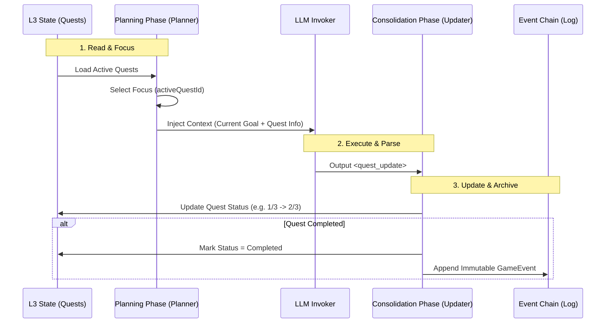

# 第三章：数据中枢与记忆引擎 (Mnemosyne Layer)

**版本**: 1.2.0
**日期**: 2026-03-11
**状态**: Active
**作者**: 资深系统架构师 (Architect Mode)
**源文档**: `system_architecture.md`, `mvu_integration_design.md`

> 术语体系参见 [naming-convention.md](../naming-convention.md)

---

## 1. 引擎概览 (Mnemosyne Overview)

**Mnemosyne** 是数据层的核心，它不再仅仅是静态数据的仓库，而是升级为 **动态上下文生成引擎 (Dynamic Context Generation Engine)**。它负责管理系统的"长期记忆"与"瞬时状态"，并为编排层提供精准的上下文快照。

**v1.1 变更**: 采用 Turn-Centric 架构，将微观叙事功能整合进 Turn 对象，消除与 NarrativeLog (Micro) 的冗余。

详细的底层存储与数据架构设计，请参阅：
* 👉 **[Mnemosyne SQLite 存储架构设计](../mnemosyne/sqlite-architecture.md)**
* 👉 **[混合资源管理与存储规范](../mnemosyne/hybrid-resource-management.md)** (v1.2 新增: 动静分离架构)
* 👉 **[Mnemosyne 抽象数据结构设计](../mnemosyne/abstract-data-structures.md)** (v1.1 更新: Turn-Centric)
* 👉 **[完整世界模型层设计](../mnemosyne/world-model-layer.md)** (v1.0.0 新增: Timeline/Location/Faction/Economy)
* 👉 **[Turn-Centric 架构决策](../../01_drafts/mnemosyne_architecture_decision_matrix.md)**

### 1.1 核心职责

1. **数据托管**: 管理 Lorebook, Presets, World Rules。
2. **混合事件存储**: 区分 **数值 (VWD)** 与 **事件 (Events)**，实现日常互动与关键剧情的分离处理。
3. **快照生成**: 根据 Time Pointer 聚合数据，生成不可变的 `Punchcards` (隐喻：织谱+丝络的切片)。
4. **状态管理**: 维护 RPG 变量，处理 VWD (Value with Description) 数据模型，并执行 **ACL 访问控制**。

---

## 2. 多维上下文链 (Multi-dimensional Context Chains)

虽然数据在物理上以 **增量 (Incremental)** 形式存储，但在逻辑上，Mnemosyne 将其投影为数条平行的 **上下文链网**。

### 2.1 链网结构

1. **History Chain (历史链)**:
    * 内容: 标准对话记录。
    * 逻辑: 线性投影，提供 LLM 理解剧情的连贯性。
2. **State Chain (状态链)**:
    * 内容: 结构化的 RPG 数值与状态 (VWD State Tree)。
    * 策略: **稀疏快照 (Sparse Snapshots) + 操作日志 (OpLog)**。
    * 隐喻: **丝络 (Threads)**。它是编织过程中不断加入的、改变织卷走向的"线"。
    * 作用: 确保"时间旅行"时，世界状态能精确回滚，并优化长对话性能。
3. **Event Chain (事件链)**:
    * 内容: **关键逻辑节点** (Quest, Achievement, Relationship Milestones)。
    * 逻辑: 稀疏存储，专用于游戏逻辑判断 (如 "Has completed Quest X?")。
4. **Narrative Chain (叙事链) - v1.1 重构**:
    * **v1.1 变更**: 采用 Turn-Centric 架构，移除独立的 Micro Narrative Log。
    * **内容**:
        * **Turn Summary (微观)**: 每个回合的摘要，由 Consolidation Phase LLM 生成，直接存储在 Turn 对象中，用于 RAG 检索。
        * **Macro Narrative (宏观)**: 跨时间段的章节总结，存储在 `macro_narratives` 表中。
    * **逻辑**: Turn Summary 作为 RAG 的最小检索单元，Macro Narrative 作为长期记忆的高级单元。
    * **显式叙事链接 (Explicit Narrative Linking)**:
        * Event Schema 中保留 `source_refs` 字段，允许检索时"下钻"到原始对话。
        * 示例:
          ```json
          // Event Chain Entry
          {
            "event_id": "evt_defeat_wolf",
            "summary": "击败了暗影狼", // 可选，仅用于调试
            "source_refs": ["msg_turn_105", "msg_turn_106"]
          }
          ```
5. **RAG Chain (检索增强链)**:
    * 内容: 向量化的记忆片段。
    * 逻辑: 基于 Turn Summaries 和 Macro Narratives 的语义检索结果，动态注入背景知识。

### 2.2 Context Pipeline 工作流

当 Jacquard 请求快照时，Pipeline 执行 **投影 (Projection)** 操作：

1. **Trace**: 根据 Session Pointer 回溯树路径。
2. **Restore**: 查找最近快照并应用 OpLog，恢复基础状态。
3. **Lazy View**: 返回 `Punchcards` 代理对象，仅在访问时执行 Deep Merge（惰性求值）。
4. **ACL Filtering**: 对 RAG 检索结果和 Event Chain 内容进行权限过滤 (Global/Shared/Private)。

---

## 3. Turn-Centric 架构 (v1.1 新增)

### 3.1 核心设计

**v1.1 变更**: 采用 Turn-Centric 架构，将微观叙事功能整合进 Turn 对象。

- **Turn Summary**: 每个回合的摘要，由 Consolidation Phase LLM 生成，用于 RAG 检索
- **Vector ID**: 关联向量库，支持语义检索
- **优势**:
    - 消除与 NarrativeLog (Micro) 的冗余
    - 简化 RAG 流程：Search → Turn.summary → Direct Access
    - Turn 是最小的完整叙事单元

### 3.2 数据结构变更

```dart
// lib/models/turn.dart
/// Turn - 回合数据模型
///
/// 最小的完整叙事单元，包含消息、事件和摘要
class Turn {
  /// 唯一标识符
  final String id;
  
  /// 回合索引
  final int index;
  
  /// 回合摘要 (v1.1 新增)
  final String summary;
  
  /// 向量 ID，用于 RAG 检索 (v1.1 新增)
  final String vectorId;
  
  /// 消息列表
  final List<Message> messages;
  
  /// 游戏事件列表
  final List<GameEvent> events;
  
  const Turn({
    required this.id,
    required this.index,
    required this.summary,
    required this.vectorId,
    required this.messages,
    required this.events,
  });
}
```

---

## 4. Value with Description (VWD) 数据模型

为了解决"数值对 LLM 缺乏语义"的问题，我们引入了 MVU 的 **VWD** 模型。

### 4.1 结构定义

状态节点不再是简单的 Key-Value，而是支持 `[Value, Description]` 的复合结构。详细定义请参阅 👉 **[Mnemosyne 抽象数据结构设计](../mnemosyne/abstract-data-structures.md#31-vwd-模型-value-with-description)**。

```text
// 抽象结构示意 (Abstract Structure)
VWDNode<T> = T | [T, String]

// JSON 示例
"health": [80, "HP, 0 is dead"]
"mana": 50 // 简写形式，无描述
```

### 3.2 渲染策略

* **System Prompt (给 LLM 看)**: 渲染完整的 `[Value, Description]`，让 LLM 理解变量含义。
  * `"health": [80, "HP, 0 is dead"]`
* **UI Display (给用户看)**: 仅渲染 `Value`。
  * `Health: 80`

---

## 5. 状态 Schema 与元数据 ($meta)

为了规范状态树的结构并增强数据引擎的灵活性，Mnemosyne 支持 `$meta` 字段定义约束、模板与权限。

### 4.1 核心元数据定义

* **template**: 定义当前层级及其子层级的默认结构（支持多级继承）。
* **updatable**: 是否允许修改该节点的值（默认 true）。
* **necessary**: 删除保护级别 (`self` | `children` | `all`)。
* **description**: 语义化描述（VWD 集成）。
* **extensible**: 是否允许 LLM 在根节点下添加新属性。
* **required**: 必须存在的字段列表。
* **ui_schema**: (v1.2 新增) 定义数据的视觉呈现方式（表格列宽、排序、图标等），供 Presentation 层 Inspector 组件使用。

### 4.2 Standard RPG Schema (v1.2 新增)

为了吸收 ACU 插件的成熟数据模型，Clotho 定义了一套标准的 RPG 状态 Schema，作为官方推荐的最佳实践。

| 节点路径 | 对应 ACU 表格 | 结构定义 | 说明 |
| :--- | :--- | :--- | :--- |
| `world` | Global Data | `{ time: VWD, location: str, weather: str }` | 世界状态锚点 |
| `characters.{id}` | Protagonist/NPC | `{ status: VWD_Tree, stats: Map, traits: List }` | 角色核心数据 |
| `characters.{id}.inventory` | Inventory | `List<{ id, count, type, desc }>` | 物品列表，支持 `$meta.template` 定义默认结构 |
| `relationships` | N/A (新增) | `{ {char_id}: { affinity: int, status: str } }` | 全局关系矩阵 |

**Inventory 模板示例**:
```json
"inventory": {
  "$meta": {
    "template": {
      "id": "unknown_item",
      "count": 1,
      "type": "misc",
      "desc": "No description",
      "$meta": { "necessary": "self" }
    }
  }
}
```

### 4.3 多级模板继承 (Multi-level Template Inheritance)

Mnemosyne 支持在状态树中定义 `$meta.template`，并在数据访问时动态计算继承链。

**继承逻辑**:

1. **向上查找**: 从目标节点向上遍历至根节点，收集所有 `$meta.template`。
2. **深度合并**: 按 "父级 -> 子级 -> 自身数据" 的顺序进行深度合并 (Deep Merge)。
3. **覆盖机制**: 子级模板覆盖父级，实际数据覆盖所有模板。

**示例**:

```json
{
  "characters": {
    "$meta": {
      "template": { "hp": 100, "level": 1 } // 基类模板
    },
    "npcs": {
      "$meta": {
        "template": { "faction": "neutral" } // 子类模板，继承 hp=100
      },
      "guard": { "class": "Warrior" } // 实际数据，隐含 hp=100, faction=neutral
    }
  }
}
```

### 4.3 细粒度权限控制 (Fine-grained Permission) - v1.1

引入 `$meta.necessary` 和 `$meta.updatable` 实现数据保护。

| 权限字段 | 值 | 行为 |
| :--- | :--- | :--- |
| **necessary** | `"self"` | 保护节点自身不被删除 |
| | `"children"` | 保护直属子节点不被删除 |
| | `"all"` | 保护整个子树不被删除 |
| **updatable** | `false` | 锁定节点值，禁止修改（除非操作显式覆盖） |

### 5.5 递归规划上下文 (Recursive Planner Context) - v1.2

为了增强长线叙事的稳定性，Mnemosyne 在 L3 Session State 中引入了专用的 `planner_context` 节点，用于持久化 Planner 插件生成的短期目标与即时念头。

```json
// L3 Session State 中的 planner_context
"planner_context": {
  "current_goal": "探索低语森林深处",
  "pending_subtasks": ["寻找水源", "设立营地"],
  "last_thought": "玩家似乎对那个发光的蘑菇感兴趣，下一轮引导他去查看。"
}
```

*   **读写循环**: Jacquard 在启动时读取此上下文注入 Prompt，LLM 生成响应后更新此上下文。
*   **价值**: 即使玩家中断当前话题，`current_goal` 依然保留，确保 AI 不会遗忘主线任务。

### 5.6 完整 Schema 示例

```json
{
  "character": {
    "$meta": {
      "extensible": false,
      "required": ["health", "mood"]
    },
    "health": [100, "当前生命值"],
    "inventory": {
      "$meta": {
        "extensible": true,
        "template": {
           "name": "Unknown Item", 
           "desc": "物品描述",
           "$meta": { "necessary": "self" }
        }
      }
    }
  }
}
```

---

## 6. 性能优化策略 (Performance Strategy)

为了应对长对话（1000+ 轮次）和复杂织谱 (Pattern)（几千条 World Info）带来的性能挑战，Mnemosyne 采用了激进的优化策略。

### 5.0 Head State 持久化 (Head State Persistence)

为了实现 **O(1)** 级别的极速启动体验，Mnemosyne 引入了 **Head State** 机制。

*   **定义**: Head State 是当前会话最新时刻的完整状态树 (VWD Tree) 的序列化副本。
*   **存储**: 位于 SQLite 的 `active_states` 表中。
*   **回写策略 (Write-Back)**: 每次 Turn 结束时，系统将内存中的 Projected State 同步回写到数据库。
*   **价值**: 无论历史有多长，启动时直接加载 Head State，无需重放 OpLogs。

### 5.1 稀疏快照与 OpLog (Sparse Snapshots & OpLog)

传统的 "Keyframe + Delta" 在长对话中会因 Delta 链过长导致读取性能崩塌。我们引入了 **稀疏快照** 机制：

* **快照密度**: 强制每 **50 轮** 对话生成一个全量 Keyframe。
* **重建逻辑**: 查找最近的前向 Keyframe -> 顺序应用随后的 Deltas。
* **结构优化 (OpLog)**: Delta 不再是简单的 JSON Diff，而是结构化的操作日志，遵循 JSON Patch 标准：

    ```json
    { "op": "replace", "path": "/character/hp", "value": 80 }
    ```

### 5.2 惰性求值视图 (Lazy Evaluation View) - [Low Priority / Optional]

> **注意**: 随着 **Head State** 机制的引入以及现代设备内存容量的提升，针对纯文本 RPG 场景，**全量加载 (Eager Load)** 通常已足够高效且代码更简单。本机制降级为处理极端大规模静态资源（如数百 MB 设定集或 Base64 图片库）时的**可选防御性优化**。

为了避免在极端场景下全量组装庞大的 Lorebook 导致内存压力，Mnemosyne 保留了 **按需加载** 的设计蓝图。

* **优化设计**: `Punchcards` 可返回一个 **Proxy (代理对象)**。
* **触发机制**:
  * 只有当 Jinja2 模板真正访问变量（如 `{{ character.inventory }}`）时，Mnemosyne 才会去计算该节点的最终状态。
  * 对于未被引用的数据（如深埋的 Lore），跳过 Deep Merge 过程。

### 5.3 状态更新流程

1. Jacquard 解析出 `State Delta`。
2. Mnemosyne 接收 Delta，写入 OpLog。
3. 检查是否达到快照阈值（50轮），若达到则异步生成新的 Keyframe。
4. 计算用于 UI 展示的 **Display Data** (纯值) 和 **Change Log**。

### 5.4 确定性回溯

由于采用了 OpLog 回放机制，当用户回滚到之前的消息时，Mnemosyne 能瞬间重建当时的状态，确保剧情与数值的完美一致。

## 6. L3 Patching 机制集成

### 6.1 机制摘要

Mnemosyne 负责执行 **L3 (The Threads)** 层对 **L2 (The Pattern)** 层的动态补丁应用，这个过程隐喻为“将新的丝线编织进原始图样中”。

具体的 **Patching 工作原理**、**Deep Merge 算法** 以及 **分层架构定义**，已迁移至单一事实来源 (SSOT) 文档，请务必查阅：

* 👉 **[分层运行时环境架构](../runtime/layered-runtime-architecture.md#3-patching-机制-the-patching-mechanism)**

Mnemosyne 在此过程中扮演执行者的角色，但不是每次推理时临时计算，而是采用 **上下文生命周期 (Context Lifecycle)** 管理：

1. **Context Load (加载)**: 当用户激活 **织谱 (Pattern)** 或切换 **织卷 (Tapestry)** 时，Mnemosyne 读取 L2 静态资源，并立即应用 L3 中的持久化 Patches，在内存中构建出 **Projected Entity**。
2. **Runtime Sync (运行时同步)**: 所有的属性变更请求（如脚本修改）直接作用于内存中的 Projected Entity，确保即时生效。
3. **Persist (持久化)**: 变更同时被捕获并回写到 L3 的 `patches` 结构中，确保状态在会话结束或切换后得以保存。

---

## 7. 高级特性：动态作用域与 ACL (Advanced Features)

Mnemosyne 引入了动态作用域 (Dynamic Scopes) 与访问控制列表 (ACL)，以处理复杂的多角色互动与隐私保护。

### 7.1 作用域定义

| 作用域 (Scope) | 定义 | 可见性规则 | 典型应用 |
| :--- | :--- | :--- | :--- |
| **Global (全局)** | 公开的事实 | 所有角色、系统旁白可见 | 天气、公共场所事件 |
| **Shared (共享)** | 特定群体共享 | 仅 `participants` 列表中的角色可见 | 两人约会、特定小团体 |
| **Private (私有)** | 角色内心独白 | 仅 Owner 可见 | 日记、内心独白 |
| **Conditional (条件)** | 需满足特定条件 | 满足 `condition` (如好感度 > 90) 可见 | 隐藏剧情、特定回忆 |

### 7.2 ACL 检查机制

检索时，Mnemosyne 会自动执行 ACL 过滤：
1. 检查当前活跃角色 (Active Character)。
2. 遍历记忆片段，验证 `canAccessMemory(actor, memory)`。
3. 仅返回通过验证的片段，防止信息泄漏（如 B 知道 A 的私密想法）。

---

## 8. 记忆生命周期管理 (Memory Lifecycle Management)

Mnemosyne 不仅是静态数据的存储器，更是记忆全生命周期的管理者。为了支持长线叙事并优化上下文效率，引擎引入了 **聚焦管理 (Focus Management)** 和 **整合 (Consolidation)** 机制，将原本平铺直叙的 LLM 交互转化为结构化的长期资产。

详细的业务场景实现规范（以 Galgame 为例），请参考：
* 👉 **[Galgame 特化记忆系统设计规范](../../plans/galgame-memory-system-spec.md)**

### 8.1 Planning Phase: 聚焦与规划 (Focus & Planning)

Planning Phase 是 Mnemosyne 在主推理循环之前引入的 **Ingestion Pipeline**，用于为 Main LLM 设定战术目标和聚焦方向。

1.  **聚焦管理 (Focus Management)**:
    *   检测用户是否想切换话题或启动新任务。
    *   更新 `state.planner_context.activeQuestId`，实现任务的挂起与激活。
2.  **目标规划 (Goal Planning)**:
    *   为 Main LLM 设定当前回合的具体战术目标（如 `current_goal`）。
    *   写入 L3 Session State 的 `planner_context` 对象。

### 8.2 Consolidation Phase: 记忆整合与归档 (Consolidation & Archival)

Consolidation Phase 是 Mnemosyne 的异步 **Consolidation Worker**，当活跃上下文 (Active Context) 超出窗口限制或会话结束时触发，将短期记忆转化为长期记忆。

**核心流程**:

1.  **Log Consolidation (日志压缩)**: 读取缓冲区内的原始对话，生成精简摘要。
2.  **Event Extraction (事件提取)**: 从非结构化对话中提取结构化事实（如“去过地点X”，“获得物品Y”），存入 **Event Chain**。
3.  **Reflection (反思与内化)**: 生成角色的主观记忆或私有日志 (Private Logs)，存入向量数据库以供 RAG 检索。
4.  **Archival (归档)**: 原始对话移入冷存储 (Cold Storage)，从活跃上下文中移除。

> **Galgame 实现**: 参见规范中的 **Consolidation Phase** 机制，它在缓冲区满或会话结束时触发，负责生成角色的“内心独白”并更新全局事件表。

---

## 9. 任务与宏观事件系统 (Quest & Macro-Event System)

为了解决长线剧情在 LLM 概率生成中容易被遗忘或过早终结的问题，Mnemosyne 在 v1.3 引入了 **状态化 (Stateful) 的任务系统**。

### 9.1 状态 vs 日志 (State vs Log)

这是理解该系统的核心差异：

1.  **Event Chain (事件日志)**:
    *   **定义**: 历史的投影。
    *   **性质**: **Immutable (不可变)**, **Append-only (仅追加)**。
    *   **例子**: `Event: { type: "enemy_killed", target: "goblin_king", turn: 5 }`
    *   **作用**: 用于 RAG 检索过去发生的事实。

2.  **Quest System (任务状态)**:
    *   **定义**: 当前的义务与目标。
    *   **性质**: **Mutable (可变)**, **Stateful (状态化)**。
    *   **例子**: `Quest: { id: "purge_goblins", status: "active", progress: "1/3" }`
    *   **作用**: 驻留在 L3 State 中，作为明确的约束条件注入 Prompt，防止任务因为玩家聊偏了而被 AI 遗忘。

### 9.2 交互闭环 (The Interaction Loop)

Quest System 与 Planner 紧密配合，形成一个闭环：

1.  **Read (Planner)**: Jacquard 启动时，`Planner Plugin` 读取 `state.quests` 中所有状态为 `active` 的任务。
2.  **Focus (Attention)**: `PlannerContext` 根据当前对话上下文，决定聚焦于哪个具体的 Quest，并更新 `activeQuestId`。
3.  **Execute (LLM)**: LLM 接收 Prompt，生成剧情文本。
4.  **Update (State Updater)**: `State Updater` 解析 LLM 输出的 `<quest_update>` 指令，更新 `state.quests` (如标记子目标完成)。
5.  **Log (Consolidation)**: 如果某个 Quest 状态变为 `completed`，Mnemosyne 会自动在 Event Chain 中生成一条对应的永久记录。



### 9.3 任务切换与多线程 (Context Switching & Multi-threading)

针对“更换对象”或“暂时搁置”的场景，Mnemosyne 采用了 **“聚光灯 (Spotlight)”** 机制。

1.  **后台挂起 (Background Active)**:
    *   系统中可以同时存在多个 `status: active` 的任务（如“游乐园约会”、“寻找丢失的猫”、“主线：击败魔王”）。
    *   它们的状态（子目标进度、变量）均保留在 `L3 State` 中，不会丢失。

2.  **前台聚焦 (Foreground Focus)**:
    *   `PlannerContext.activeQuestId` 是唯一的聚光灯。
    *   **切换逻辑**: 当检测到用户意图改变（如“先不约会了，帮那个老奶奶找猫”）时，Planner 仅仅是将 `activeQuestId` 指向新的任务 ID。

3.  **示例流程 (搁置与恢复)**:
    *   **Step 1 (约会中)**: `activeQuestId` = "quest_date_alice"。 Prompt 注入约会相关子任务。
    *   **Step 2 (被打断)**: 用户触发支线。Planner 更新 `activeQuestId` = "quest_find_cat"。
    *   **Step 3 (执行支线)**: 此时 LLM 专注于找猫，"约会"任务在后台静默（进度保持 2/3）。
    *   **Step 4 (恢复)**: 支线完成或用户说“回游乐园吧”。Planner 重新将 `activeQuestId` 切回 "quest_date_alice"。
    *   **结果**: LLM 立即读取到约会进度为 2/3，无缝接续之前的对话。

---

## 附录 A: 完整 Schema 示例 (v1.1)

(原 4.4 节内容移动至此)

```json
{
  "character": {
    "$meta": {
      "extensible": false,
      "required": ["name", "description"]
    },
    "name": "Alice",
    "description": "A shy healer from the forest."
  },
  "session_state": {
    "$meta": {
      "extensible": true
    },
    "patches": {
      "character.description": "A brave warrior protecting her village."
    },
    "history": []
  }
}
```