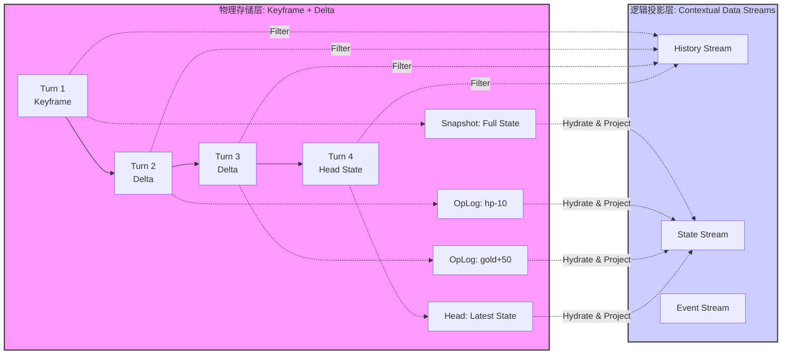
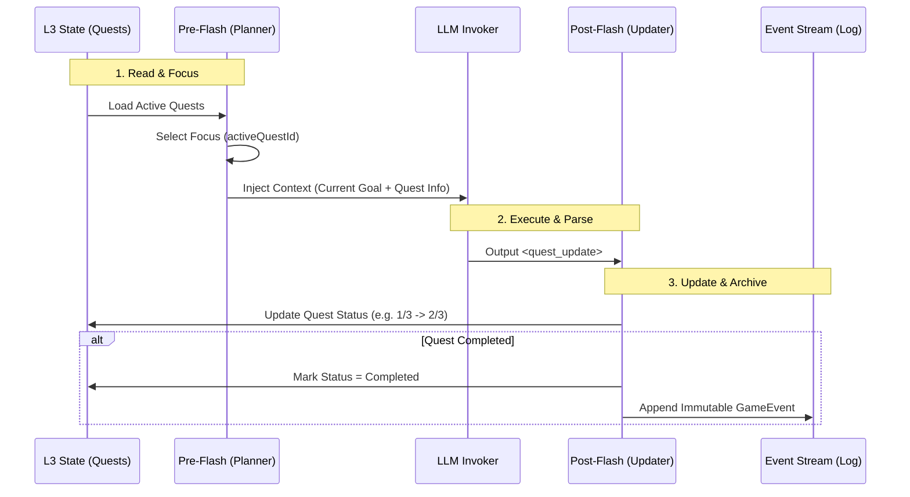

# 第三章：数据中枢与记忆引擎 (Mnemosyne Layer)

**版本**: 1.0.0
**日期**: 2025-12-23
**状态**: Draft
**作者**: 资深系统架构师 (Architect Mode)
**源文档**: `system_architecture.md`, `mvu_integration_design.md`

---

## 1. 引擎概览 (Mnemosyne Overview)

**Mnemosyne** 是数据层的核心，它不再仅仅是静态数据的仓库，而是升级为 **动态上下文生成引擎 (Dynamic Context Generation Engine)**。它负责管理系统的“长期记忆”与“瞬时状态”，并为编排层提供精准的上下文快照。

详细的底层存储与数据架构设计，请参阅：
* 👉 **[Mnemosyne SQLite 存储架构设计](../mnemosyne/sqlite-architecture.md)**
* 👉 **[混合资源管理与存储规范](./hybrid-resource-management.md)** (v1.2 新增: 动静分离架构)
* 👉 **[State Schema v2.0 规格文档](./state_schema_v2_spec.md)** (v2.0 新增: 原型链继承)
 
 ### 1.1 核心职责
 
 1. **数据托管**: 管理 Lorebook, Presets, World Rules。
2. **混合事件存储**: 区分 **数值 (VWD)** 与 **事件 (Events)**，实现日常互动与关键剧情的分离处理。
3. **快照生成**: 根据 Time Pointer 聚合数据，生成不可变的 `Punchcards` (隐喻：织谱+丝络的切片)。
4. **状态管理**: 维护 RPG 变量，处理 VWD (Value with Description) 数据模型，并执行 **ACL 访问控制**。

---

## 2. 上下文数据流 (Contextual Data Streams)

**上下文数据流**是指 Mnemosyne 引擎基于 **关键帧 + 增量 (Keyframe + Delta)** 混合存储架构所构建的逻辑数据视图。

### 2.1 物理混合存储 vs. 逻辑流投影

Mnemosyne 的设计核心在于分离“怎么存”与“怎么用”。

1.  **物理层 (The Increments)**:
    在数据库层面，我们没有任何一张物理表叫做 "Stream"。所有数据都作为 **原子性的增量**，离散地挂载在唯一的 **时间轴 (Timeline/Turns)** 上。
    *   **Head State (热端点)**: 存储当前的完整 VWD 状态树，确保 O(1) 极速启动。
    *   **Keyframes (稀疏快照)**: 每隔 N 轮（如 50 轮）存储一次全量状态，作为回溯的“锚点”。
    *   **Deltas (增量)**: 记录每一轮的细粒度变更 (OpLogs/Messages)。

2.  **逻辑层 (The Streams)**:
     **Hydration (水合)** 过程：即加载最近的 Keyframe 并重放后续的 Deltas——将碎片化的物理数据投影为连续流动的“数据流”：

    *   **History Stream (历史流)**: 原始对话文本的线性投影，用于 LLM 的上下文补全。
    *   **State Stream (状态流)**: 状态树 (State Tree) 的动态演进视图，由 Snapshots 和 OpLogs 实时重构而成。
    *   **Event Stream (事件流)**: 关键逻辑节点的稀疏投影，用于逻辑判断 (Trigger) 和查询。
    *   **Narrative Stream (叙事流)**: 用于 RAG 的长时记忆摘要流。



### 2.2 显式叙事链接 (Explicit Narrative Linking)

在 **Event Stream** 和 **Narrative Stream** 中，为了解决 RAG 检索"有大概无细节"的问题，我们引入了 `source_refs` 字段。

*   示例:
  ```json
  // Event Stream Entry
  {
    "event_id": "evt_defeat_wolf",
    "summary": "击败了暗影狼，获得了核心。",
    "timestamp": 170000000,
    // 显式引用原始对话日志的 ID，允许系统在检索到该事件时，精确"下钻"到当时的原始对话
    "source_refs": ["msg_turn_105", "msg_turn_106"]
  }
  ```

### 2.3 Context Pipeline 工作流

当 Jacquard 请求快照时，Pipeline 执行 **投影 (Projection)** 操作：

1. **Trace**: 根据 Session Pointer 回溯树路径。
2. **Restore**: 查找最近快照并应用 OpLog，恢复基础状态。
3. **Lazy View**: 返回 `Punchcards` 代理对象，仅在访问时执行 Deep Merge（惰性求值）。
4. **ACL Filtering**: 对 RAG 检索结果和 Event Stream 内容进行权限过滤 (Global/Shared/Private)。

---

## 3. Value with Description (VWD) 数据模型

为了解决“数值对 LLM 缺乏语义”的问题，我们引入了 MVU 的 **VWD** 模型。

### 3.1 结构定义

状态节点不再是简单的 Key-Value，而是支持 `[Value, Description]` 的复合结构。详细定义请参阅 👉 **[Mnemosyne 抽象数据结构设计](../mnemosyne/abstract-data-structures.md#31-vwd-模型-value-with-description)**。

```text
// 抽象结构示意 (Abstract Structure)
VWDNode<T> = T | [T, String]

// JSON 示例
"health": [80, "HP, 0 is dead"]
"mana": 50 // 简写形式，无描述
```

### 3.2 数据输出 (Data Output)

Mnemosyne 的 Context Projector 仅返回**原生数据对象 (Native Objects)**，不做任何格式化（如 Markdown 或 YAML 转换）。

*   **输出格式**: 纯净的 VWD 树结构（JSON Object）。
*   **格式化职责**: 由消费者（如 Jacquard）决定如何将此对象转换为字符串。详见 [Jacquard 编排层文档](../jacquard/README.md) 中的上下文格式化章节。

---

## 4. 状态 Schema 与元数据 ($meta)

为了规范状态树的结构并增强数据引擎的灵活性，Mnemosyne 支持 `$meta` 字段定义约束、模板与权限。

从 v2.0 开始，我们引入了基于**原型链继承**的 Schema 定义范式，以解决冗余并增强可扩展性。详细设计请参阅：
* 👉 **[State Schema v2.0 规格文档](./state_schema_v2_spec.md)**

### 4.1 核心元数据定义

* **template**: 定义当前层级及其子层级的默认结构（支持多级继承）。
* **updatable**: 是否允许修改该节点的值（默认 true）。
* **necessary**: 删除保护级别 (`self` | `children` | `all`)。
* **description**: 语义化描述（VWD 集成）。
* **extensible**: 是否允许 LLM 在根节点下添加新属性。
* **required**: 必须存在的字段列表。
* **ui_schema**: (v1.2 新增) 定义数据的视觉呈现方式（表格列宽、排序、图标等），供 Presentation 层 Inspector 组件使用。

### 4.2 Standard RPG Schema (v1.2 新增)

为了吸收 ACU 插件的成熟数据模型，Clotho 定义了一套标准的 RPG 状态 Schema，作为官方推荐的最佳实践。

| 节点路径 | 对应 ACU 表格 | 结构定义 | 说明 |
| :--- | :--- | :--- | :--- |
| `world` | Global Data | `{ time: VWD, location: str, weather: str }` | 世界状态锚点 |
| `characters.{id}` | Protagonist/NPC | `{ status: VWD_Tree, stats: Map, traits: List }` | 角色核心数据 |
| `characters.{id}.inventory` | Inventory | `List<{ id, count, type, desc }>` | 物品列表，支持 `$meta.template` 定义默认结构 |
| `relationships` | N/A (新增) | `{ {char_id}: { affinity: int, status: str } }` | 全局关系矩阵 |

**Inventory 模板示例**:
```json
"inventory": {
  "$meta": {
    "template": {
      "id": "unknown_item",
      "count": 1,
      "type": "misc",
      "desc": "No description",
      "$meta": { "necessary": "self" }
    }
  }
}
```

### 4.3 多级模板继承 (Multi-level Template Inheritance)

Mnemosyne 支持在状态树中定义 `$meta.template`，并在数据访问时动态计算继承链。

**继承逻辑**:

1. **向上查找**: 从目标节点向上遍历至根节点，收集所有 `$meta.template`。
2. **深度合并**: 按 "父级 -> 子级 -> 自身数据" 的顺序进行深度合并 (Deep Merge)。
3. **覆盖机制**: 子级模板覆盖父级，实际数据覆盖所有模板。

**示例**:

```json
{
  "characters": {
    "$meta": {
      "template": { "hp": 100, "level": 1 } // 基类模板
    },
    "npcs": {
      "$meta": {
        "template": { "faction": "neutral" } // 子类模板，继承 hp=100
      },
      "guard": { "class": "Warrior" } // 实际数据，隐含 hp=100, faction=neutral
    }
  }
}
```

### 4.3 细粒度权限控制 (Fine-grained Permission) - v1.1

引入 `$meta.necessary` 和 `$meta.updatable` 实现数据保护。

| 权限字段 | 值 | 行为 |
| :--- | :--- | :--- |
| **necessary** | `"self"` | 保护节点自身不被删除 |
| | `"children"` | 保护直属子节点不被删除 |
| | `"all"` | 保护整个子树不被删除 |
| **updatable** | `false` | 锁定节点值，禁止修改（除非操作显式覆盖） |

### 4.5 递归规划上下文 (Recursive Planner Context) - v1.2

为了增强长线叙事的稳定性，Mnemosyne 在 L3 Session State 中引入了专用的 `planner_context` 节点，用于持久化 Pre-Flash 插件生成的短期目标与即时念头。

```json
// L3 Session State 中的 planner_context
"planner_context": {
  "current_goal": "探索低语森林深处",
  "pending_subtasks": ["寻找水源", "设立营地"],
  "last_thought": "玩家似乎对那个发光的蘑菇感兴趣，下一轮引导他去查看。"
}
```

*   **读写循环**: Jacquard 在启动时读取此上下文注入 Prompt，LLM 生成响应后更新此上下文。
*   **价值**: 即使玩家中断当前话题，`current_goal` 依然保留，确保 AI 不会遗忘主线任务。

### 4.6 完整 Schema 示例

```json
{
  "character": {
    "$meta": {
      "extensible": false,
      "required": ["health", "mood"]
    },
    "health": [100, "当前生命值"],
    "inventory": {
      "$meta": {
        "extensible": true,
        "template": {
           "name": "Unknown Item", 
           "desc": "物品描述",
           "$meta": { "necessary": "self" }
        }
      }
    }
  }
}
```

---

## 5. 性能优化策略 (Performance Strategy)

为了应对长对话（1000+ 轮次）和复杂织谱 (Pattern)（几千条 World Info）带来的性能挑战，Mnemosyne 采用了激进的优化策略。

### 5.0 Head State 持久化 (Head State Persistence)

为了实现 **O(1)** 级别的极速启动体验，Mnemosyne 引入了 **Head State** 机制。

*   **定义**: Head State 是当前会话**所有上下文数据流 (Contextual Data Streams)** 在最新时刻的完整序列化副本。它不仅包含 VWD 状态树，还包含最新的历史记录、事件索引与叙事摘要。
*   **存储**: 位于 SQLite 的 `active_states` 表中，作为当前织卷 (Tapestry) 的热端点。
*   **同步策略**: 每次 Turn 结束时，系统将内存中所有活跃流的 Projected State 同步回写到数据库。
*   **Hydration (水合) 的角色**: Hydration (基于 Keyframe + OpLogs 的重放) 仅在**回退分叉 (Branching/Rollback)** 或**查看历史快照**时触发。对于正常的会话继续 (Continue)，系统总是直接加载 Head State，实现零延迟启动。

### 5.1 稀疏快照与 OpLog (Sparse Snapshots & OpLog)

传统的 "Keyframe + Delta" 在长对话中会因 Delta 链过长导致读取性能崩塌。我们引入了 **稀疏快照** 机制：

* **快照密度**: 强制每 **50 轮** 对话生成一个全量 Keyframe。
* **重建逻辑**: 查找最近的前向 Keyframe -> 顺序应用随后的 Deltas。
* **结构优化 (OpLog)**: Delta 不再是简单的 JSON Diff，而是结构化的操作日志，遵循 JSON Patch 标准：

    ```json
    { "op": "replace", "path": "/character/hp", "value": 80 }
    ```

### 5.2 惰性求值视图 (Lazy Evaluation View) - [Low Priority / Optional]

> **注意**: 随着 **Head State** 机制的引入以及现代设备内存容量的提升，针对纯文本 RPG 场景，**全量加载 (Eager Load)** 通常已足够高效且代码更简单。本机制降级为处理极端大规模静态资源（如数百 MB 设定集或 Base64 图片库）时的**可选防御性优化**。

为了避免在极端场景下全量组装庞大的 Lorebook 导致内存压力，Mnemosyne 保留了 **按需加载** 的设计蓝图。

* **优化设计**: `Punchcards` 可返回一个 **Proxy (代理对象)**。
* **触发机制**:
  * 只有当 Jinja2 模板真正访问变量（如 `{{ character.inventory }}`）时，Mnemosyne 才会去计算该节点的最终状态。
  * 对于未被引用的数据（如深埋的 Lore），跳过 Deep Merge 过程。

### 5.3 状态更新流程

1. Jacquard 解析出 `State Delta`。
2. Mnemosyne 接收 Delta，写入 OpLog。
3. 检查是否达到快照阈值（50轮），若达到则异步生成新的 Keyframe。
4. 计算用于 UI 展示的 **Display Data** (纯值) 和 **Change Log**。

### 5.4 确定性回溯

由于采用了 OpLog 回放机制，当用户回滚到之前的消息时，Mnemosyne 能瞬间重建当时的状态，确保剧情与数值的完美一致。

## 6. L3 Patching 机制集成

### 6.1 机制摘要

Mnemosyne 负责执行 **L3 (The Threads)** 层对 **L2 (The Pattern)** 层的动态补丁应用，这个过程隐喻为“将新的丝线编织进原始图样中”。

具体的 **Patching 工作原理**、**Deep Merge 算法** 以及 **分层架构定义**，已迁移至单一事实来源 (SSOT) 文档，请务必查阅：

* 👉 **[分层运行时环境架构](../runtime/layered-runtime-architecture.md#3-patching-机制-the-patching-mechanism)**

Mnemosyne 在此过程中扮演执行者的角色，但不是每次推理时临时计算，而是采用 **上下文生命周期 (Context Lifecycle)** 管理：

1. **Context Load (加载)**: 当用户激活 **织谱 (Pattern)** 或切换 **织卷 (Tapestry)** 时，Mnemosyne 读取 L2 静态资源，并立即应用 L3 中的持久化 Patches，在内存中构建出 **Projected Entity**。
2. **Runtime Sync (运行时同步)**: 所有的属性变更请求（如脚本修改）直接作用于内存中的 Projected Entity，确保即时生效。
3. **Persist (持久化)**: 变更同时被捕获并回写到 L3 的 `patches` 结构中，确保状态在会话结束或切换后得以保存。

---

## 7. 高级特性：动态作用域与 ACL (Advanced Features)

Mnemosyne 引入了动态作用域 (Dynamic Scopes) 与访问控制列表 (ACL)，以处理复杂的多角色互动与隐私保护。

### 7.1 作用域定义

| 作用域 (Scope) | 定义 | 可见性规则 | 典型应用 |
| :--- | :--- | :--- | :--- |
| **Global (全局)** | 公开的事实 | 所有角色、系统旁白可见 | 天气、公共场所事件 |
| **Shared (共享)** | 特定群体共享 | 仅 `participants` 列表中的角色可见 | 两人约会、特定小团体 |
| **Private (私有)** | 角色内心独白 | 仅 Owner 可见 | 日记、内心独白 |
| **Conditional (条件)** | 需满足特定条件 | 满足 `condition` (如好感度 > 90) 可见 | 隐藏剧情、特定回忆 |

### 7.2 ACL 检查机制

检索时，Mnemosyne 会自动执行 ACL 过滤：
1. 检查当前活跃角色 (Active Character)。
2. 遍历记忆片段，验证 `canAccessMemory(actor, memory)`。
3. 仅返回通过验证的片段，防止信息泄漏（如 B 知道 A 的私密想法）。

---

## 8. 记忆生命周期管理 (Memory Lifecycle Management)

Mnemosyne 不仅是静态数据的存储器，更是记忆全生命周期的管理者。为了支持长线叙事并优化上下文效率，引擎引入了 **分流 (Triage)** 和 **整合 (Consolidation)** 机制，将原本平铺直叙的 LLM 交互转化为结构化的长期资产。

详细的业务场景实现规范（以 Galgame 为例），请参考：
* 👉 **[Galgame 特化记忆系统设计规范](../../plans/galgame-memory-system-spec.md)**

### 8.1 Pre-Flash: 输入分流 (Input Triage)

Pre-Flash 是 Mnemosyne 在主推理循环之前引入的 **Ingestion Pipeline**，用于对输入意图进行分级处理。它识别并非所有用户交互都具有同等叙事权重的事实。

1.  **数值化交互 (Numerical Route)**:
    *   针对高频、重复、低信息量的行为（如“摸头”、“签到”）。
    *   **处理**: 直接转化为 VWD 状态树的数值变更（如 `affinity +1`），**不进入** 长期叙事流 (History Stream)。
    *   **优势**: 避免上下文窗口被无意义的重复文本污染，同时保留行为的长效影响。
2.  **事件化交互 (Event Route)**:
    *   针对关键剧情节点、重大抉择或复杂对话。
    *   **处理**: 完整记录对话历史，并触发 **Event Recorder** 生成结构化事件，存入 **Event Stream**。

> **Galgame 实现**: 参见规范中的 **Pre-Flash** 机制，它通过轻量级模型对用户意图进行分类 (Routine vs Event)，并动态挂载相应的 Schema。

### 8.2 Post-Flash: 记忆整合与归档 (Consolidation & Archival)

Post-Flash 是 Mnemosyne 的异步 **Consolidation Worker**，当活跃上下文 (Active Context) 超出窗口限制或会话结束时触发，将短期记忆转化为长期记忆。

**核心流程**:

1.  **Log Consolidation (日志压缩)**: 读取缓冲区内的原始对话，生成精简摘要。
2.  **Event Extraction (事件提取)**: 从非结构化对话中提取结构化事实（如“去过地点X”，“获得物品Y”），存入 **Event Stream**。
3.  **Reflection (反思与内化)**: 生成角色的主观记忆或私有日志 (Private Logs)，存入向量数据库以供 RAG 检索。
4.  **Archival (归档)**: 原始对话移入冷存储 (Cold Storage)，从活跃上下文中移除。

> **Galgame 实现**: 参见规范中的 **Post-Flash** 机制，它在缓冲区满或会话结束时触发，负责生成角色的“内心独白”并更新全局事件表。

---

## 9. 任务与宏观事件系统 (Quest & Macro-Event System)

为了解决长线剧情在 LLM 概率生成中容易被遗忘或过早终结的问题，Mnemosyne 在 v1.3 引入了 **状态化 (Stateful) 的任务系统**。

### 9.1 状态 vs 日志 (State vs Log)

这是理解该系统的核心差异：

1.  **Event Stream (事件日志)**:
    *   **定义**: 历史的投影。
    *   **性质**: **Immutable (不可变)**, **Append-only (仅追加)**。
    *   **例子**: `Event: { type: "enemy_killed", target: "goblin_king", turn: 5 }`
    *   **作用**: 用于 RAG 检索过去发生的事实。

2.  **Quest System (任务状态)**:
    *   **定义**: 当前的义务与目标。
    *   **性质**: **Mutable (可变)**, **Stateful (状态化)**。
    *   **例子**: `Quest: { id: "purge_goblins", status: "active", progress: "1/3" }`
    *   **作用**: 驻留在 L3 State 中，作为明确的约束条件注入 Prompt，防止任务因为玩家聊偏了而被 AI 遗忘。

### 9.2 交互闭环 (The Interaction Loop)

Quest System 与 Planner 紧密配合，形成一个闭环：

1.  **Read (Pre-Flash)**: Jacquard 启动时，`Planner Plugin` 读取 `state.quests` 中所有状态为 `active` 的任务。
2.  **Focus (Attention)**: `PlannerContext` 根据当前对话上下文，决定聚焦于哪个具体的 Quest，并更新 `currentObjectiveId`。
3.  **Execute (LLM)**: LLM 接收 Prompt，生成剧情文本。
4.  **Update (Post-Flash)**: `State Updater` 解析 LLM 输出的 `<quest_update>` 指令，更新 `state.quests` (如标记子目标完成)。
*   **Log (Consolidation)**: 如果某个 Quest 状态变为 `completed`，Mnemosyne 会自动在 Event Stream 中生成一条对应的永久记录。



### 9.3 任务切换与多线程 (Context Switching & Multi-threading)

针对“更换对象”或“暂时搁置”的场景，Mnemosyne 采用了 **“聚光灯 (Spotlight)”** 机制。

1.  **后台挂起 (Background Active)**:
    *   系统中可以同时存在多个 `status: active` 的任务（如“游乐园约会”、“寻找丢失的猫”、“主线：击败魔王”）。
    *   它们的状态（子目标进度、变量）均保留在 `L3 State` 中，不会丢失。

2.  **前台聚焦 (Foreground Focus)**:
    *   `PlannerContext.activeQuestId` 是唯一的聚光灯。
    *   **切换逻辑**: 当检测到用户意图改变（如“先不约会了，帮那个老奶奶找猫”）时，Planner 仅仅是将 `activeQuestId` 指向新的任务 ID。

3.  **示例流程 (搁置与恢复)**:
    *   **Step 1 (约会中)**: `activeQuestId` = "quest_date_alice"。 Prompt 注入约会相关子任务。
    *   **Step 2 (被打断)**: 用户触发支线。Planner 更新 `activeQuestId` = "quest_find_cat"。
    *   **Step 3 (执行支线)**: 此时 LLM 专注于找猫，"约会"任务在后台静默（进度保持 2/3）。
    *   **Step 4 (恢复)**: 支线完成或用户说“回游乐园吧”。Planner 重新将 `activeQuestId` 切回 "quest_date_alice"。
    *   **结果**: LLM 立即读取到约会进度为 2/3，无缝接续之前的对话。

---

## 附录 A: 完整 Schema 示例 (v1.1)

(原 4.4 节内容移动至此)

```json
{
  "character": {
    "$meta": {
      "extensible": false,
      "required": ["name", "description"]
    },
    "name": "Alice",
    "description": "A shy healer from the forest."
  },
  "session_state": {
    "$meta": {
      "extensible": true
    },
    "patches": {
      "character.description": "A brave warrior protecting her village."
    },
    "history": []
  }
}
```
