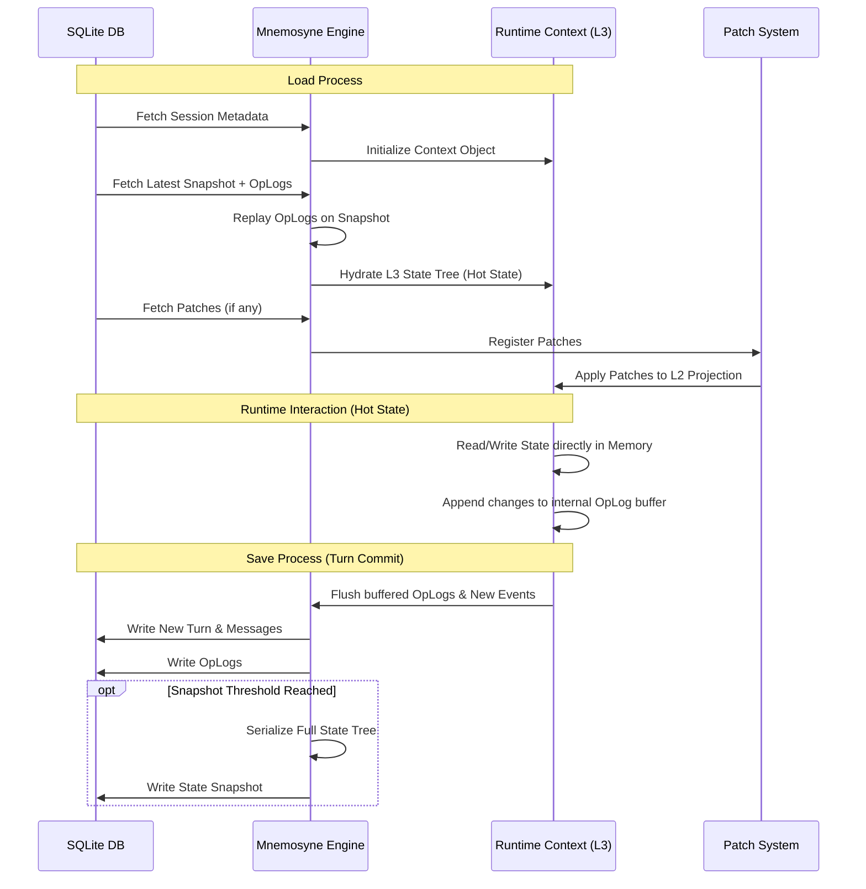
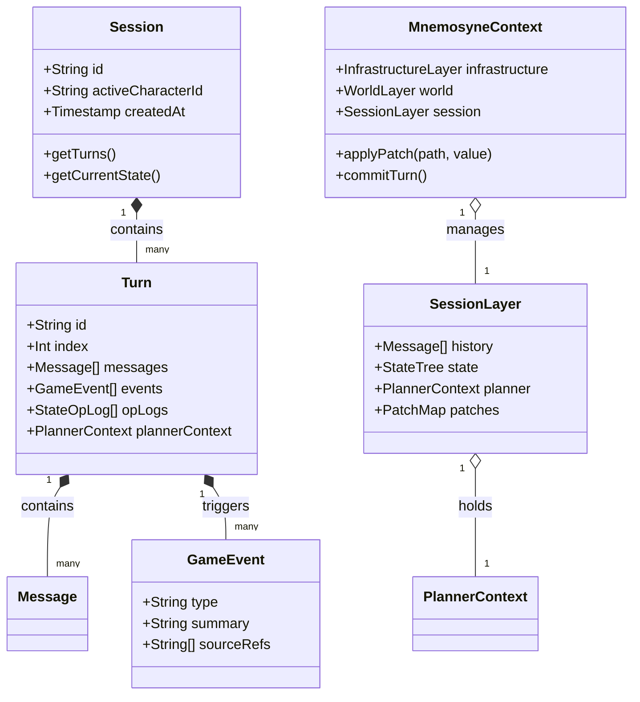

# Mnemosyne 抽象数据结构设计 (Abstract Data Structures)

**版本**: 1.0.0
**日期**: 2026-01-04
**状态**: Draft
**作者**: 资深系统架构师 (Architect Mode)
**关联文档**:

- `mnemosyne-data-engine.md` (逻辑规范)
- `sqlite-architecture.md` (物理存储)
- `layered-runtime-architecture.md` (运行时分层)

---

## 1. 设计概述 (Design Overview)

本文档定义了 Mnemosyne 引擎在 **内存中** (In-Memory) 和 **应用层** (Application Layer) 交互时使用的核心数据结构。这些结构充当了 SQLite 物理存储与运行时逻辑之间的桥梁。

设计遵循以下原则：
- **平台无关性 (Platform Agnostic)**: 仅使用标准数据类型，不依赖特定语言（如 TypeScript/Python）的特性，便于移植。
- **不可变性 (Immutability)**: 鼓励使用不可变对象，特别是在 Snapshot 和 History 链的处理中。
- **分层清晰**: 明确区分 `PersistedEntity` (持久化实体) 和 `RuntimeContext` (运行时上下文)。
- **VWD 原生支持**: 状态管理深度集成 Value-With-Description 模型。

---

## 2. 核心实体 (Core Entities)

这些实体直接映射到数据库表结构，但在应用层可能包含额外的便利方法或展开的 JSON 字段。

### 2.1 会话 (Session)

`Session` 是存档的根节点，代表一个独立的时间线。

- **id**: String (UUID)
- **title**: String
- **activeCharacterId**: String
- **createdAt**: Timestamp (Unix ms)
- **updatedAt**: Timestamp (Unix ms)
- **meta**: Dictionary<String, Any> (扩展元数据)

### 2.2 回合 (Turn)

`Turn` 是时间的基本单位，是原子性的事务边界。在持久化层（数据库）中，Turn 尽可能的存储增量（Messages, Events, OpLogs）以节省空间。

- **id**: String (UUID)
- **sessionId**: String (Session ID)
- **index**: Integer (全局递增序列号)
- **createdAt**: Timestamp
- **messages**: List<Message> (可选，懒加载)
- **events**: List<GameEvent> (可选，懒加载)
- **stateSnapshot**: StateSnapshot (可选，仅当此 Turn 触发快照时存在)
- **opLogs**: List<StateOpLog> (可选)
- **plannerContext**: PlannerContext (可选，用于持久化当前 Turn 的规划上下文)

### 2.2.1 活跃回合 (Active Turn)

在 **运行时内存** 中，Mnemosyne 维护一个特殊的 `ActiveTurn` 概念。它不直接对应数据库表，而是当前会话的"热端点" (Hot Endpoint)。

- **目的**: 维护当前全量的状态树 (State Tree) 和上下文，避免每次交互都重新计算。
- **生命周期**:
    1. **Session Load**: 基于最近快照 + OpLogs 重建，生成初始的 Active Turn。
    2. **Runtime**: 所有的读取操作直接访问内存中的 `state`。所有的写入操作先更新内存 `state`，同时追加到 `opLogs` 缓冲区。
    3. **Turn Commit**: 当回合结束时，将缓冲区内的 `messages`, `events`, `opLogs` 刷入数据库，并根据策略决定是否生成 `stateSnapshot`。
    4. **Context Switch**: 仅在切换 Session 时或者是回滚的时候销毁当前 Active Turn 并重新执行 Load。

### 2.3 消息 (Message)

`Message` 记录了对话和交互的原始内容。

- **id**: String (UUID)
- **turnId**: String (Turn ID)
- **role**: Enum { user, assistant, system, pre_flash, post_flash }
- **content**: String
- **type**: Enum { text, thought, command }
- **isActive**: Boolean (支持软删除/隐藏)
- **meta**: Dictionary<String, Any> (Token 消耗, 模型名称等)

### 2.4 事件 (Event)

`GameEvent` 是结构化的事实记录，用于逻辑判断和 RAG。

- **id**: String (UUID)
- **turnId**: String (Turn ID)
- **type**: Enum { plot_point, item_get, location_change, relationship_change, quest_update }
- **summary**: String (简短描述)
- **participants**: List<String> (涉及的角色 ID 列表)
- **location**: String (可选)
- **payload**: Dictionary<String, Any> (灵活的事件数据, e.g. `{ itemId: "sword_01", count: 1 }`)
- **sourceRefs**: List<String> (关联的原始 Message ID)

### 2.5 叙事日志 (Narrative Log)

`NarrativeLog` 用于长时记忆和 RAG 检索。

- **id**: String (UUID)
- **turnId**: String (Turn ID)
- **level**: Enum { micro, macro }
- **content**: String
- **scope**: Enum { global, shared, private }
- **ownerId**: String (可选, if scope is private)
- **vectorId**: String (关联向量库 ID)

### 2.6 规划上下文 (Planner Context)

v1.2 新增，用于长线目标管理。PlannerContext 随 Turn 变化，是 Turn 的一部分。

- **currentGoal**: String (当前主要目标)
- **pendingSubtasks**: List<String> (待办子任务列表)
- **lastThought**: String (上一轮的思维链残留)
- **archivedGoals**: List<String> (已完成目标, 可选)

### 2.7 世界书条目 (Lorebook Entry)

`LorebookEntry` 是 RAG 的静态知识库源，存储关于世界观、历史、魔法系统等非叙事性知识。

v1.2 引入了 **4-Quadrant Static Taxonomy** 分类法，以支持差异化的注入策略。

- **id**: String (UUID)
- **keys**: List<String> (触发关键词，用于关键词匹配)
- **content**: String (实际内容)
- **category**: Enum { axiom, agent, encyclopedia, directive } (标准化分类)
    - **axiom**: 法则与公理 (注入 System Chain)
    - **agent**: 角色与代理 (注入 Floating Chain 高优先级/浅层)
    - **encyclopedia**: 博物与百科 (注入 Floating Chain 标准/深层)
    - **directive**: 风格与元指令 (注入 Instruction Block/User 附近)
- **activeStatus**: Enum { active, inactive } (是否启用)
- **vectorId**: String (关联向量库 ID, 指向 `vec_lorebook` 表)
- **metadata**: Dictionary<String, Any> (扩展元数据)
    - **injection_policy**: Dictionary<String, Any> (可选，覆盖默认策略)
        - **scope**: Enum { global, session }
        - **position**: Enum { system, floating_head, floating_tail, user_instruction }
        - **priority**: Integer (0-100)

---

## 3. 状态管理结构 (State Management Structures)

这是 Mnemosyne 最复杂的部分，涉及 VWD 模型、状态树和 Patching 机制。

### 3.1 VWD 模型 (Value With Description)

为了让 LLM 理解数值的含义，任何状态节点都可以是一个 `[Value, Description]` 元组。

- **结构**: `Value` OR `[Value, String]`
- **Value 类型**: String | Number | Boolean | Null
- **说明**: 在 JSON 中存储为 `[80, "Health Point"]` 或仅仅是 `80`。

### 3.2 状态元数据 ($meta)

用于定义权限、模板和 UI 呈现。

- **template**: Dictionary<String, Any> (子节点默认模板)
- **required**: List<String> (必填字段)
- **extensible**: Boolean (是否允许 LLM 添加新字段)
- **updatable**: Boolean (是否只读)
- **necessary**: Enum { self, children, all } (删除保护)
- **description**: String (节点本身的描述)
- **uiSchema**: UISchema (v1.2, 定义 Inspector 如何渲染)

**UISchema 结构**:
- **viewType**: Enum { table, list, card, raw }
- **columns**: List<{ key: String, label: String, width: String }> (用于表格视图)
- **icon**: String
- **color**: String

### 3.3 状态树 (State Tree)

完整的状态树是一个嵌套的字典，包含普通数据和 `$meta` 字段。

- **$meta**: StateMeta (可选)
- **[key]**: Any | StateTree (递归定义)

### 3.4 操作日志 (OpLog)

基于 JSON Patch (RFC 6902) 标准的变更记录。

- **op**: Enum { add, remove, replace, move, copy, test }
- **path**: String (JSON Pointer, e.g., "/character/hp")
- **value**: Any (新值)
- **from**: String (仅用于 move/copy 操作)
- **turnId**: String (Turn ID)
- **reason**: String (变更原因，调试用)

---

## 4. 运行时上下文 (Runtime Context)

这是 Jacquard 在执行推理时持有的聚合对象，对应 "Layered Runtime Architecture"。

### 4.1 Mnemosyne Context (聚合根)

- **infrastructure**: InfrastructureLayer (Read-Only)
  - **preset**: PromptTemplate
  - **apiConfig**: ApiConfiguration

- **world**: WorldLayer (Read-Only Source, patched by L3)
  - **activeCharacter**: ProjectedCharacter (L2 + L3 Patch)
  - **globalLore**: List<LorebookEntry> (L1 + L3 Status)
  - **user**: PersonaData (L1)

- **session**: SessionLayer (Read-Write)
  - **id**: String (Session ID)
  - **turnIndex**: Integer
  - **history**: List<Message> (历史窗口)
  - **state**: StateTree (完整的状态树视图)
  - **planner**: PlannerContext (当前活跃的规划上下文，源自 Turn)
  - **patches**: PatchMap (持久化变更集)

### 4.2 投影角色 (Projected Character)

L2 静态资源与 L3 Patch 合并后的结果。

- **name**: String
- **description**: String
- **personality**: String
- **firstMessage**: String
- **status**: Dictionary<String, Any> (hp, mp, mood, etc.)
- **inventory**: Dictionary<String, Any>
- **relationships**: Dictionary<String, Any>

### 4.3 补丁映射 (Patch Map)

L3 层用于存储对 L2/Global 数据的修改。

- **类型**: Dictionary<String, Any>
- **Key**: JSON Path (e.g., "character.description")
- **Value**: The new value

---

## 5. 数据流转与操作 (Data Flow & Operations)

### 5.1 数据流转 (Data Flow)

描述数据如何在 SQLite 持久化层与运行时内存层之间转换。



### 5.2 操作接口 (Operations)

抽象定义了对这些数据结构的核心操作。

#### 5.2.1 状态树操作 (State Tree Operations)

- `getValue(path: String) -> VWDNode | Any`: 获取指定路径的值。
- `setValue(path: String, value: Any, reason: String) -> StateOpLog`: 更新值并生成 OpLog。
- `deleteNode(path: String) -> StateOpLog`: 删除节点（需检查 `$meta.necessary`）。
- `mergeTemplate(path: String) -> void`: 强制应用 `$meta.template` 到当前节点。

#### 5.2.2 补丁操作 (Patch Operations)

- `applyPatch(path: String, value: Any) -> void`: 在内存投影中应用补丁。
- `commitPatches() -> void`: 将内存中的补丁变更持久化到 L3 Session 数据中。

#### 5.2.3 时间旅行操作 (Time Travel Operations)

- `rollback(targetTurnIndex: Integer) -> void`:
    1. 查找 `index <= targetTurnIndex` 的最近快照。
    2. 清除当前内存状态。
    3. 加载快照。
    4. 重放 OpLogs 直到 `targetTurnIndex`。
    5. 截断 `targetTurnIndex` 之后的 History 和 Events。

#### 5.2.4 RAG 检索操作 (RAG Retrieval Operations)

- `search(query: RetrievalQuery) -> List<RetrievalResult>`:
    执行混合检索（向量相似度 + 关键词/元数据过滤）。

**检索请求 (RetrievalQuery)**:
- **text**: String (查询文本)
- **embedding**: List<Float> (查询向量，可选)
- **topK**: Integer (返回数量，默认 5)
- **threshold**: Float (相似度阈值，默认 0.7)
- **filters**: Dictionary<String, Any> (混合检索过滤器, e.g., `{ "turnId": { "$gt": 10 } }`)
- **sources**: List<Enum> { narrative, event, lore } (指定检索源)

**检索结果 (RetrievalResult)**:
- **score**: Float (相似度分数/距离)
- **sourceType**: Enum { narrative, event, lore }
- **content**: String
- **originalId**: String (原始实体的 ID)
- **metadata**: Dictionary<String, Any> (额外上下文，如 Turn ID)

### 5.3 聚合存储与分支切换 (Aggregated Storage & Branching)

为了支持“时间旅行”和“分支切换”，Mnemosyne 采用了 **Turn-Centric (以回合为中心)** 的存储策略。

#### 5.3.1 Turn 作为聚合根

所有的持久化数据都严格关联到特定的 `Turn ID`。这确保了只要我们能定位到一个 `Turn`，就能检索到该时间点所有的上下文。

*   **关联性**: `Messages`, `Events`, `OpLogs`, `StateSnapshots`, `NarrativeLogs`, `PlannerContext` 都有一个非空的 `turnId` 字段（或直接作为 Turn 的一部分）。
*   **原子性**: 在 SQLite 中，一个 Turn 及其所有附属数据的写入必须在一个数据库事务 (Transaction) 中完成。要么全部写入，要么全部不写入。

#### 5.3.2 分支切换逻辑 (Branch Switching Logic)

当用户决定“从这里重新开始”或切换到一个平行的故事线时，Mnemosyne 执行以下操作：

1.  **Target Identification**: 确定目标切入点 `Target Turn T`.
2.  **Full Context Reconstruction (Rollback/Forward)**:
    *   **State Tree**: 找到 `T` 之前的最近快照 `S`，重放 OpLogs，生成 `T` 时刻的精确 VWD 状态树。
    *   **Event Chain**: 重新加载并索引 `T` 之前的所有关键 `Events` (用于逻辑判断，如 "HasMetKeyNPC")。
    *   **Narrative Chain**: 重新加载 `T` 之前的 `NarrativeLogs` (用于 RAG 上下文注入)。
    *   **Planner Context**: 直接从 `Target Turn T` 加载 `PlannerContext` 对象 (Goals, Subtasks, Thought)。
3.  **Context Pruning (Memory Only)**:
    *   清空内存中的 `ActiveTurn` 缓冲区。
    *   加载 `T` 之前的最后 N 条消息到 `history` 窗口。
    *   将重构后的 State, Events, NarrativeLogs 设置为当前上下文。
4.  **New Timeline Creation (Optional)**:
    *   如果是“分支”，系统可能会创建一个新的 `Session ID` (Fork)，并将 `T` 作为新 Session 的起点（复制一份初始状态）。
    *   如果是“重试” (Retry)，则直接丢弃 `T` 之后的所有 Turns（级联删除），并从 `T` 继续。

#### 5.3.3 级联删除与外键

依赖 SQLite 的 `ON DELETE CASCADE` 特性：

```sql
-- 当删除一个 Turn 时...
DELETE FROM turns WHERE id = 'turn_xyz';

-- 自动删除所有关联数据：
-- - messages WHERE turn_id = 'turn_xyz'
-- - events WHERE turn_id = 'turn_xyz'
-- - state_oplogs WHERE turn_id = 'turn_xyz'
```

---

## 6. JSON 数据示例 (JSON Examples)

### 6.1 复合 VWD 状态树

```json
{
  "character": {
    "hp": [85, "Current Health Points"],
    "inventory": {
      "$meta": {
        "uiSchema": { "viewType": "table", "columns": [{"key": "name", "label": "Item"}, {"key": "count", "label": "Qty"}] }
      },
      "potion_01": { "name": "Health Potion", "count": 3, "effect": "Heal 50 HP" }
    }
  }
}
```

### 6.2 规划上下文 (Planner Context)

```json
{
  "planner_context": {
    "currentGoal": "Infiltrate the Dark Castle",
    "pendingSubtasks": ["Find the sewers entrance", "Obtain a disguise"],
    "lastThought": "The guard mentioned a shift change at midnight.",
    "archivedGoals": ["Cross the Silent River"]
  }
}
```

### 6.3 显式叙事链接 (Event with Source Refs)

```json
{
  "event_id": "evt_12345",
  "type": "item_get",
  "summary": "Obtained the Ancient Key from the Old Man.",
  "timestamp": 1704350000000,
  "sourceRefs": ["msg_turn_10_user", "msg_turn_10_assistant"],
  "payload": { "itemId": "key_ancient", "count": 1 }
}
```

---

## 7. 类图概览 (Class Diagram)


