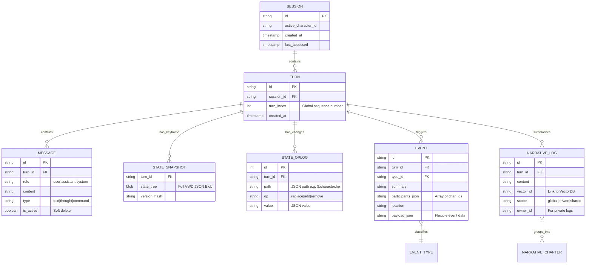

# Mnemosyne SQLite 数据架构设计方案

## 1. 架构概述

本方案采用 **Unified SQLite Architecture** 作为 Mnemosyne 的核心存储引擎。利用现代 SQLite 的 JSON 处理能力和关系型数据库的强一致性，构建一个高性能、易移植、支持复杂查询的混合数据层。

### 1.1 核心设计理念

*   **单一事实来源 (SSOT)**: 所有的运行时状态、历史记录、事件日志均存储在单一的 `.db` 文件中，便于存档管理。
*   **混合存储 (Hybrid Storage)**:
    *   **Relational**: 用于需要索引、聚合查询、外键约束的数据（如 `Event Log`, `History Chain`）。
    *   **JSON Document**: 用于结构多变、层级深、Schema 不固定的数据（如 `State Tree (VWD)`, `Character Profile`）。
*   **Event Sourcing (事件溯源)**: 状态不仅仅是快照，而是由一系列 `OpLog` 演变而来，支持完美的时间旅行 (Time Travel)。

---

## 2. 实体关系模型 (ER Diagram)

Mnemosyne 的数据模型围绕着 **Timeline (时间轴)** 展开，连接着四条核心数据链。



---

## 3. 详细 Schema 设计 (DDL)

以下是核心表的 SQLite DDL 定义，使用了 `STRICT` 模式（如果 SQLite 版本支持）以确保类型安全。

### 3.1 会话与时间轴 (Session & Timeline)

```sql
-- 会话表：存档的根节点
CREATE TABLE sessions (
    id TEXT PRIMARY KEY,
    title TEXT NOT NULL,
    active_character_id TEXT NOT NULL,
    created_at INTEGER NOT NULL, -- Unix Timestamp (ms)
    updated_at INTEGER NOT NULL,
    meta_json TEXT DEFAULT '{}' -- 存储额外元数据
);

-- 回合表：时间的基本单位
-- 每次交互（用户输入 + AI 回复）构成一个 Turn
CREATE TABLE turns (
    id TEXT PRIMARY KEY,
    session_id TEXT NOT NULL REFERENCES sessions(id) ON DELETE CASCADE,
    turn_index INTEGER NOT NULL, -- 线性递增序号，用于排序和回溯
    created_at INTEGER NOT NULL,
    UNIQUE(session_id, turn_index)
);

-- 索引：加速按时间轴查询
CREATE INDEX idx_turns_session_index ON turns(session_id, turn_index);
```

### 3.2 历史链 (History Chain)

```sql
-- 消息表：实际的对话内容
CREATE TABLE messages (
    id TEXT PRIMARY KEY,
    turn_id TEXT NOT NULL REFERENCES turns(id) ON DELETE CASCADE,
    role TEXT NOT NULL CHECK(role IN ('user', 'assistant', 'system', 'pre_flash', 'post_flash')),
    content TEXT NOT NULL,
    
    -- 类型区分：普通文本、思维链、系统指令
    msg_type TEXT DEFAULT 'text', 
    
    -- 元数据：如 Token 消耗、模型名称等
    meta_json TEXT DEFAULT '{}'
);

CREATE INDEX idx_messages_turn ON messages(turn_id);
```

### 3.3 状态链 (State Chain: Snapshot + OpLog)

采用 **混合存储策略**：
*   `snapshots` 表存储完整的 JSON 状态树（VWD 结构），作为 Keyframe。
*   `oplogs` 表存储 JSON Patch 操作，作为 Delta。

```sql
-- 状态快照表：Keyframes
-- 策略：每 N 个 Turn (如 50) 存储一次全量快照
CREATE TABLE state_snapshots (
    turn_id TEXT PRIMARY KEY REFERENCES turns(id) ON DELETE CASCADE,
    
    -- 核心：存储完整的 VWD State Tree
    -- 格式：{"character": {"hp": [100, "Health"], ...}}
    state_json TEXT NOT NULL 
);

-- 操作日志表：Deltas
-- 记录每个 Turn 产生的状态变更
CREATE TABLE state_oplogs (
    id INTEGER PRIMARY KEY AUTOINCREMENT,
    turn_id TEXT NOT NULL REFERENCES turns(id) ON DELETE CASCADE,
    
    -- JSON Patch 标准字段
    op TEXT NOT NULL CHECK(op IN ('add', 'remove', 'replace', 'move', 'copy', 'test')),
    path TEXT NOT NULL, -- e.g., "/character/inventory/0"
    value_json TEXT,    -- 存储值的 JSON 序列化形式
    
    -- 变更原因（可选，用于调试）
    reason TEXT 
);

CREATE INDEX idx_oplogs_turn ON state_oplogs(turn_id);
```

### 3.4 事件链 (Event Chain)

采用 **结构化存储**，以便于 SQL 查询统计（如“查询在地点 X 发生的所有事件”）。

```sql
CREATE TABLE events (
    id TEXT PRIMARY KEY,
    turn_id TEXT NOT NULL REFERENCES turns(id) ON DELETE CASCADE,
    
    -- 事件类型：plot_point, item_get, location_change, relationship_change
    event_type TEXT NOT NULL,
    
    summary TEXT NOT NULL,
    location TEXT,
    
    -- 参与者：使用 JSON 数组存储，便于查询
    -- 也可以拆分为多对多关联表，视查询复杂度而定。
    -- 在 SQLite 中，使用 json_each 查询 participants_json 通常足够快且灵活。
    participants_json TEXT NOT NULL DEFAULT '[]', 
    
    -- 灵活载荷：存储具体事件数据，如获得的物品 ID、好感度数值
    payload_json TEXT DEFAULT '{}',
    
    -- 显式引用：关联的原始消息 ID (Narrative Linking)
    source_refs_json TEXT DEFAULT '[]'
);

-- 索引：查询特定类型的事件
CREATE INDEX idx_events_type ON events(event_type);
-- 索引：查询特定 Turn 的事件
CREATE INDEX idx_events_turn ON events(turn_id);
```

### 3.5 叙事链 (Narrative Chain)

用于 RAG 和长时记忆。

```sql
CREATE TABLE narrative_logs (
    id TEXT PRIMARY KEY,
    turn_id TEXT NOT NULL REFERENCES turns(id) ON DELETE CASCADE,
    
    -- 内容层级：micro (单轮总结) | macro (章节大纲)
    level TEXT NOT NULL DEFAULT 'micro',
    
    content TEXT NOT NULL,
    
    -- ACL 权限控制
    scope TEXT NOT NULL DEFAULT 'global' CHECK(scope IN ('global', 'shared', 'private')),
    owner_id TEXT, -- 如果是 private，则由于此字段指定拥有者
    
    -- 向量数据库关联 ID (如果使用外置向量库)
    vector_id TEXT
);
```

### 3.6 世界书链 (Lorebook Chain)

用于存储静态的世界观知识 (RAG 语义记忆)。

```sql
CREATE TABLE lorebook_entries (
    id TEXT PRIMARY KEY,
    
    -- 关键词列表：用于简单的关键词匹配 (JSON Array of strings)
    keys_json TEXT NOT NULL,
    
    content TEXT NOT NULL,
    category TEXT, -- e.g. "Location", "History", "Magic"
    
    is_active BOOLEAN DEFAULT 1,
    updated_at INTEGER NOT NULL,
    
    -- 向量关联 ID (Shadow Table Link)
    vector_id TEXT
);
```

### 3.7 向量存储 (Vector Stores using sqlite-vec)

采用 **Shadow Table** 模式：实体表存数据，虚拟表存向量。通过应用层逻辑保持 ID 同步。

> **注意**: `vec0` 是 `sqlite-vec` 扩展提供的虚拟表引擎。
> 假设 embedding 维度为 1536 (OpenAI text-embedding-3-small)。

```sql
-- 叙事向量表 (关联 narrative_logs.vector_id)
CREATE VIRTUAL TABLE vec_narratives USING vec0(
    id TEXT PRIMARY KEY,
    embedding FLOAT[1536]
);

-- 知识向量表 (关联 lorebook_entries.vector_id)
CREATE VIRTUAL TABLE vec_lorebook USING vec0(
    id TEXT PRIMARY KEY,
    embedding FLOAT[1536]
);
```

---

## 4. 关键查询与性能优化策略

### 4.1 状态重构 (State Reconstruction)

当需要获取 Turn `T` 的状态时，采用 **"最近快照 + 前滚"** 策略。

**SQL 逻辑**:

1.  **查找快照**: 找到 `turn_index <= T.index` 的最近一个 `state_snapshot`。
2.  **加载 OpLogs**: 查询该快照之后，直到 `T` 为止的所有 `state_oplogs`。
3.  **内存计算**: 在内存中将 OpLogs 依次应用到快照 JSON 上。

```sql
-- 1. 获取最近快照
SELECT s.state_json, t.turn_index 
FROM state_snapshots s
JOIN turns t ON s.turn_id = t.id
WHERE t.session_id = ? AND t.turn_index <= ?
ORDER BY t.turn_index DESC
LIMIT 1;

-- 2. 获取随后的 Deltas
SELECT o.op, o.path, o.value_json
FROM state_oplogs o
JOIN turns t ON o.turn_id = t.id
WHERE t.session_id = ? 
  AND t.turn_index > ? -- 快照的 turn_index
  AND t.turn_index <= ? -- 目标的 turn_index
ORDER BY t.turn_index ASC, o.id ASC;
```

### 4.2 稀疏快照策略 (Sparse Snapshot Strategy)

*   **写入时**: 每次写入 `turn` 检查 `turn_index % 50 == 0`。如果是，则异步触发全量状态计算并写入 `state_snapshots` 表。
*   **优势**: 极大减少存储空间，同时限制了“前滚”计算的最大步数（最多 50 步），保证了读取性能的上限。

### 4.3 复杂 JSON 查询

利用 SQLite 的 `json_extract` 和 `json_tree` 进行深度查询。

*   **示例**: 查询所有包含 "sword" 的物品。

```sql
SELECT t.turn_index, json_extract(value_json, '$.name') as item_name
FROM state_oplogs, json_tree(value_json)
WHERE path LIKE '%/inventory/%'
  AND json_extract(value_json, '$.type') = 'weapon';
```

### 4.4 RAG 混合检索 (Hybrid Search)

结合向量相似度 (Semantic) 和 SQL 过滤 (Metadata/Recency)。

*   **示例**: 查找最近 20 回合内，关于 "Dark Magic" 的叙事记录。

```sql
SELECT
    n.content,
    n.turn_id,
    vec_distance_cosine(v.embedding, ?) AS distance
FROM vec_narratives v
JOIN narrative_logs n ON v.id = n.vector_id  -- 通过 vector_id 关联
JOIN turns t ON n.turn_id = t.id
WHERE distance < 0.3              -- 向量相似度阈值
  AND t.turn_index > (Current_Index - 20) -- SQL 时间过滤 (Recency Bias)
ORDER BY distance ASC
LIMIT 5;
```

---

## 5. 数据一致性与事务

*   **原子性提交**: 每一个 Turn 的写入（Turns + Messages + Oplogs + Events）必须包裹在一个 `BEGIN TRANSACTION ... COMMIT` 块中。这保证了要么整个 Turn 写入成功，要么完全不写入，不会出现“有消息但没状态”的断裂数据。
*   **外键约束**: 全面启用 `PRAGMA foreign_keys = ON;`，利用 `ON DELETE CASCADE` 自动清理关联数据（例如删除一个 Session 自动删除所有 Turns 和 Messages）。

## 6. 扩展性考量

*   **向量搜索集成**: 架构预留了 `vector_id` 字段。未来可以通过 `sqlite-vec` 插件直接在 SQLite 中添加向量表，或者通过 FFI 桥接外部向量库，将 ID 存回此表，保持松耦合。
*   **多端同步**: 单一 `.db` 文件结构极易通过云盘或 WebDAV 进行文件级同步。对于更细粒度的同步，可以基于 `state_oplogs` 表实现基于 Log 的增量同步协议。

### 6.1 跨平台扩展加载 (Extension Loading)

为了在 Flutter (Windows/Android) 环境下支持 `sqlite-vec`，我们需要处理原生扩展的加载问题。

*   **架构决策**: 仅支持 64 位架构 (Arm64-v8a for Android, x64 for Windows) 以简化编译和兼容性测试。
*   **加载流程**:
    1.  **Android**: 将编译好的 `libsqlite_vec.so` (arm64-v8a) 放入 `jniLibs` 目录。在 Dart 中通过 `DynamicLibrary.open('libsqlite_vec.so')` 加载，并调用 `sqlite3_vec_init`。
    2.  **Windows**: 将 `sqlite_vec.dll` (x64) 随应用分发。在 Dart 中通过 `DynamicLibrary.open('sqlite_vec.dll')` 加载。
    3.  **运行时绑定**: 使用 `sqlite3` Dart 包的 `loadExtension` 接口在数据库连接打开时注入扩展。

