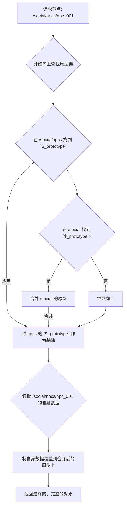

# Clotho State Schema v2.0 - 规格文档

**版本**: 2.0.0
**日期**: 2026-01-15
**状态**: Active

---

## 1. 概述 (Overview)

State Schema V2.0 是一次重大的范式升级，旨在解决 V1 设计中存在的**数据冗余**和**上下文割裂**问题。通过借鉴业界成熟的“原型链继承”思想（参考自 ERA 插件及 JavaScript 原型链），V2 方案引入了 `$_prototype` 机制，实现了**数据与模式 (Schema) 的优雅结合**。

本规格文档将详细阐述 V2 方案的核心概念、设计原则、技术实现及具体应用示例。

### 1.1 核心目标

- **消除冗余 (DRY)**: 避免在大量相似的数据节点（如 NPC 列表）中重复定义 `$meta` 指令。
- **数据内聚 (Cohesion)**: 让数据与其“类型”的定义在结构上保持临近，提高 State Tree 的可读性和可维护性。
- **高效解析 (Efficiency)**: 允许解析器在一次遍历中完成数据读取和模板应用，无需额外的 I/O 开销。
- **强大扩展 (Extensibility)**: 支持多级继承和特异性覆盖，以应对未来复杂的业务场景。

### 1.2 指导原则：引擎与内容分离

State Schema V2 的设计严格遵循 Clotho 的核心架构原则：**引擎作为通用容器，具体业务逻辑在 L2 (The Pattern / Schema) 层定义**。

- **Mnemosyne (引擎层)**: 核心职责是高效、确定性地读写一个灵活的、可嵌套的 JSON 树 (State Tree)，并应用 Patch。它**不关心**也不应该硬编码任何具体的 RPG 状态（如 `hp`, `gold`）。
- **L2 / The Pattern (内容层)**: 负责定义具体的游戏世界规则。我们现在讨论的 `$_prototype` 机制，就是内容层用于**自我描述**和**指导引擎**的工具。它不是引擎的一部分，而是由引擎读取和解释的“说明书”。

### 1.3 关键变更

- **引入 `$_prototype`**: 一个特殊的内部键，用于在父节点中定义可被所有子节点继承的模板。这是实现“原型链继承”的核心。
- **净化数据节点**: 数据实例（如 `npc_001`）本身不再包含 `$meta`，只存储纯粹的值。
- **结构化 `$meta`**: `$meta` 的内容被进一步结构化，包含 `description`, `updateRule`, `constraints` 等丰富的指令字段，作为指导 LLM 和其他系统的“操作手册”。

---

## 2. 核心设计：原型链继承 (Prototype-Chain Inheritance)

V2 方案的核心是“原型链继承”范式。该范式规定：

> 任何一个对象节点都可以通过在其内部定义一个 `$_prototype` 对象，来为它的**所有直接子节点**提供一个共享的“原型模板”。当解析一个子节点时，系统会自动将父节点中定义的 `$_prototype` 与子节点自身的数据进行合并，形成一个完整的、包含“数据”和“指令”的对象。

### 2.1 基础示例

```json
{
  "social": {
    "npcs": {
      "$_prototype": {
        "name": {
          "$meta": { "description": "NPC 的名字", "type": "string" }
        },
        "affection": {
          "$meta": { "description": "好感度", "type": "integer", "updateRule": "Increase on positive interactions." }
        }
      },
      "npc_001": {
        "name": "爱丽丝",
        "affection": 75
      },
      "npc_002": {
        "name": "鲍勃",
        "affection": 20
      }
    }
  }
}
```

- **定义**: 在 `npcs` 节点中，我们定义了一个 `$_prototype`。
- **继承**: `npc_001` 和 `npc_002` 作为 `npcs` 的子节点，会自动继承这个原型。
- **解析**: 当系统解析 `npc_001` 时，它会得到一个等效于如下结构的完整对象：
  ```json
  {
    "name": {
      "$meta": { "description": "NPC 的名字", "type": "string" },
      "value": "爱丽丝" // "value" 字段被自动推断
    },
    "affection": {
      "$meta": { "description": "好感度", "type": "integer", "updateRule": "Increase on positive interactions." },
      "value": 75
    }
  }
  ```
  
  ### 2.2 标准原型设计 (Standard Prototypes)
  
  为了提供开箱即用的体验并促进社区内容的标准化，我们建议在 Clotho 的核心库中提供一套官方的标准原型。用户可以在此基础上进行扩展和定制。
  
  以下是一套推荐的基础原型设计：
  
  #### 基础实体 (`base_entity`)
  所有游戏世界内实体的最顶层基类。
  
  ```json
  {
    "$_prototype": {
      "name": {
        "$meta": { "description": "实体的唯一名称", "type": "string" }
      }
    }
  }
  ```
  
  #### 角色 (`character`) - 继承自 `base_entity`
  所有可交互角色的基类，包括玩家和 NPC。
  
  ```json
  {
    "$_prototype": {
      "//": "继承自 base_entity",
      "appearance": {
        "$meta": { "description": "外貌的客观描述", "type": "string" }
      },
      "status": {
        "$_prototype": {
          "hp": {
            "$meta": { "description": "生命值", "type": "integer", "range": [0, 100] },
            "value": 100
          },
          "mp": {
            "$meta": { "description": "法力值", "type": "integer", "range": [0, 100] },
            "value": 100
          }
        }
      }
    }
  }
  ```
  
  #### 非玩家角色 (`npc`) - 继承自 `character`
  专门用于 NPC 的原型，增加了 `affection` 等特有属性。
  
  ```json
  {
    "$_prototype": {
      "//": "继承自 character",
      "affection": {
        "$meta": { "description": "对玩家的好感度", "type": "integer", "range": [0, 100] },
        "value": 50
      },
      "relationship": {
        "$meta": { "description": "当前关系状态", "type": "enum", "values": ["Stranger", "Acquaintance", "Friend", "Enemy"] },
        "value": "Stranger"
      }
    }
  }
  ```
  
  ### 2.3 多级继承与覆盖 (Multi-level Inheritance & Overriding)
  
  原型链可以嵌套，形成强大的继承链。子级的定义会**覆盖**父级的同名定义。

```json
{
  "inventory": {
    "$_prototype": { // Level 1: 所有物品的基类
      "weight": { "$meta": { "description": "物品重量" }, "value": 1.0 },
      "stackable": { "$meta": { "description": "是否可堆叠" }, "value": true }
    },

    "weapons": {
      "$_prototype": { // Level 2: 武器类，继承自“物品”
        "damage": { "$meta": { "description": "伤害值" } },
        "stackable": { "value": false } // 覆盖父级模板，武器默认不可堆叠
      },
      "sword_01": { "damage": 12, "weight": 5.0 }, // 继承了 stackable: false
      "axe_01": { "damage": 15, "weight": 8.0 }
    },
    
    "potions": {
       "$_prototype": { // Level 2: 药水类，继承自“物品”
         "effect": { "$meta": { "description": "药水效果" } }
       },
       "health_potion_01": { "effect": "Restore 50 HP", "stackable": true } // 继承了 stackable: true
    }
  }
}
```

- **解析 `sword_01`**:
  1. 获取 `sword_01` 自身数据 (`damage`, `weight`)。
  2. 应用其父节点 `weapons` 的 `$_prototype`，获得 `damage` 的 `$meta` 和 `stackable` 的新默认值 `false`。
  3. 应用其祖父节点 `inventory` 的 `$_prototype`，获得 `weight` 的 `$meta`。
  4. 最终合并成一个完整的对象，其中 `stackable` 为 `false`，`weight` 为 `5.0`。

---

## 3. `$meta` 结构化指令详解

为实现对 LLM 的精确控制，`$meta` 内部的指令字段被高度结构化。

| 字段名 | 类型 | 描述 | 示例 |
| :--- | :--- | :--- | :--- |
| **`description`** | `string` | **核心语义描述**。告诉 LLM 这个字段代表什么。 | `"角色的当前生命值，0为死亡"` |
| **`type`** | `string` | **数据类型**。可以是 `string`, `integer`, `float`, `boolean`, `enum`, `object`, `array`。 | `"integer"` |
| **`range`** | `[min, max]` | **数值范围**。用于 `integer` 和 `float` 类型。 | `[0, 100]` |
| **`values`** | `string[]` | **枚举值**。用于 `enum` 类型。 | `["Neutral", "Ally", "Hostile"]` |
| **`updateRule`** | `string` | **更新规则**。用自然语言描述何时以及如何更新此字段。这是指导 LLM 的核心指令。 | `"Decrease upon taking damage; increase upon healing."` |
| **`constraints`** | `string[]` | **操作约束**。定义了对该字段的允许操作。 | `["readonly_after_init"]`, `["append-only"]` |
| **`validation`** | `object` | **校验规则**。LLM 完成操作后的自我检查清单。 | `{"check": "Is this summary under 300 words?", "maxLength": 300}` |
| **`ui`** | `object` | **UI 渲染提示**。用于解耦前后端，指导 UI 如何展示该数据。 | `{"widget": "ProgressBar", "color": "red"}` |

---

## 4. 实现细节与解析逻辑

### 4.1 `$_prototype` 键

- 键名 `$_prototype` 中的 `$` 和 `_` 前缀表明这是一个**内部使用的、非数据内容的特殊键**。
- 在对 State Tree 进行纯数据操作（如序列化、发送给 UI）时，所有以 `$_` 开头的键都**应被默认忽略**。

### 4.2 解析器 (Parser) 行为

当系统的任何部分（主要是 Jacquard 编排器）需要获取一个节点的“完整信息”时，解析器应执行以下逻辑：



1.  **向上遍历**: 从请求的节点开始，逐级向上查找父节点中的 `$_prototype` 对象。
2.  **原型合并**: 将所有在原型链中找到的 `$_prototype` 对象进行深度合并 (deep merge)。层级更近的（子级）原型具有更高优先级，会覆盖层级更远的（父级）原型的同名属性。
3.  **最终覆盖**: 将数据节点自身的属性值，覆盖到合并后的原型模板上。如果数据节点的值不是一个对象（例如 `affection: 75`），则系统会智能地将其赋值给原型中对应属性的 `value` 字段。
4.  **返回结果**: 返回一个临时的、在内存中合成的完整对象，该对象包含了最终的数据和完整的 `$meta` 指令。

---

## 5. 废弃的方案 (Deprecated Designs)

为确保设计的演进过程清晰可追溯，特此记录被此 V2 方案替代的早期设计。

- **V1 - VWD (Value-With-Description)**: `[value, "description"]` 的元组形式。因其表达能力有限，无法承载结构化的指令而被废弃。
- **V1.5 - 内联 `$meta` (Inline $meta)**: 每个数据节点都完整地内联一个 `$meta` 对象。因其会导致大量数据冗余而被废弃。
- **引用式 Schema (Schema as a Service)**: 数据通过 `$schema` 引用外部独立的 Schema 文件。因其造成上下文割裂和潜在的运行时开销，最终被“原型链继承”方案取代。

通过采纳 State Schema v2.0，Clotho 将拥有一个既符合 DRY 原则，又具备高度灵活性和强大指令能力的顶级状态管理核心。