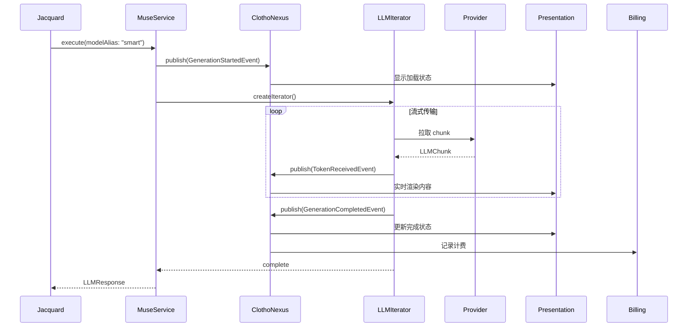
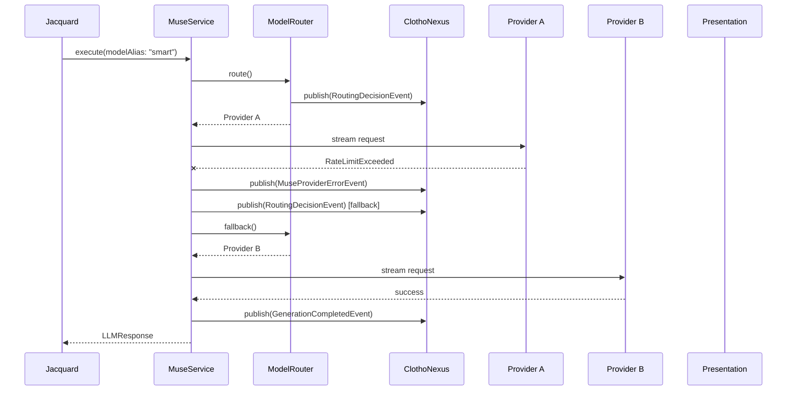

# Muse 与 ClothoNexus 事件总线集成规范

**版本**: 1.1.0
**日期**: 2026-03-11
**状态**: Active
**作者**: Clotho 架构团队
**关联文档**:
- [Muse 智能服务架构](README.md) - Muse 服务概览
- [ClothoNexus 事件总线](../infrastructure/clotho-nexus-events.md) - 核心事件系统
- [流式响应与计费设计](streaming-and-billing-design.md) - 流式处理流程
- [Provider 适配器规范](muse-provider-adapters.md) - Provider 适配器实现

> 术语体系参见 [naming-convention.md](../naming-convention.md)

---

## 1. 概述

本文档定义 Muse 智能服务与 ClothoNexus 核心事件总线的集成规范。通过事件总线，Muse 将其内部状态变化、生成进度、错误信息等以事件形式广播给系统的其他模块（如 Jacquard 编排层、Presentation 表现层、Scheduler 调度器等），实现松耦合的分布式协作。

### 1.1 集成原则

- **事件驱动**: Muse 不直接调用其他模块，仅通过事件通知状态变化
- **类型安全**: 所有事件继承自 `ClothoEvent`，携带强类型载荷
- **不可变事件**: 事件对象一旦创建不可修改，确保时序一致性
- **异步广播**: 事件通过 `Stream` 异步广播，消费者自行决定处理策略

### 1.2 事件分类

| 类别 | 事件前缀 | 说明 | 主要消费者 |
|------|----------|------|-----------|
| **生命周期** | `Generation` | 生成请求的生命周期 | Jacquard, UI |
| **Token 流** | `Token` | 流式 Token 传输 | UI, Billing |
| **Provider** | `Provider` | Provider 状态变化 | Router, Health Monitor |
| **计费** | `Billing` | 费用和配额事件 | Billing UI, Alert |
| **错误** | `MuseError` | Muse 异常事件 | Logger, Error Handler |

---

## 2. 核心事件定义

### 2.1 生命周期事件

```dart
/// 生成请求开始
/// 
/// 触发时机: Jacquard 发起生成请求，Muse 开始处理
/// 消费者: Jacquard（跟踪请求状态）、UI（显示加载状态）
class GenerationStartedEvent extends ClothoEvent {
  final String requestId;           // 唯一请求 ID
  final String sessionId;           // 所属会话 ID
  final String providerId;          // Provider 标识
  final String modelId;             // 模型标识
  final String? modelAlias;         // 使用的模型别名（如 "smart"）
  final int estimatedPromptTokens;  // 预估输入 Token 数
  final Map<String, dynamic>? metadata;  // 额外元数据（如 temperature、maxTokens）
  
  GenerationStartedEvent({
    required this.requestId,
    required this.sessionId,
    required this.providerId,
    required this.modelId,
    this.modelAlias,
    required this.estimatedPromptTokens,
    this.metadata,
  });
  
  @override
  String toString() => 
      'GenerationStartedEvent(requestId: $requestId, model: $modelId@$providerId)';
}

/// Token 接收事件（流式传输中）
/// 
/// 触发时机: 从 Provider 接收到每一个 Token Chunk
/// 消费者: UI（实时渲染）、Filament Parser（增量解析）
class TokenReceivedEvent extends ClothoEvent {
  final String requestId;
  final String sessionId;
  final int chunkIndex;             // Chunk 序号（从 0 开始）
  final String content;             // Token 内容（可能为空字符串，如仅 metadata）
  final int? promptTokens;          // 首次 chunk 可能包含 prompt tokens
  final DateTime providerTimestamp; // Provider 返回的时间戳
  final Duration latency;           // 从请求发送到接收到此 chunk 的延迟
  
  TokenReceivedEvent({
    required this.requestId,
    required this.sessionId,
    required this.chunkIndex,
    required this.content,
    this.promptTokens,
    required this.providerTimestamp,
    required this.latency,
  });
  
  @override
  String toString() => 
      'TokenReceivedEvent(requestId: $requestId, chunk: $chunkIndex, latency: ${latency.inMilliseconds}ms)';
}

/// 生成进度事件（可选，用于长文本生成）
/// 
/// 触发时机: 每累计一定 Token 数或时间间隔
/// 消费者: UI（进度条）、Scheduler（超时检测）
class GenerationProgressEvent extends ClothoEvent {
  final String requestId;
  final String sessionId;
  final int generatedTokens;        // 已生成 Token 数
  final int? totalTokens;           // 预估总 Token 数（如果有）
  final Duration elapsed;           // 已用时间
  final double? tokensPerSecond;    // 生成速度
  
  GenerationProgressEvent({
    required this.requestId,
    required this.sessionId,
    required this.generatedTokens,
    this.totalTokens,
    required this.elapsed,
    this.tokensPerSecond,
  });
}

/// 生成完成事件
/// 
/// 触发时机: Provider 流式传输结束，收到最终 chunk
/// 消费者: Jacquard（触发后处理）、Billing（记录费用）、UI（完成状态）
class GenerationCompletedEvent extends ClothoEvent {
  final String requestId;
  final String sessionId;
  final String providerId;
  final String modelId;
  final TokenUsage usage;           // 最终 Token 使用量
  final double cost;                // 计算成本
  final Duration totalDuration;     // 总耗时
  final FinishReason finishReason;  // 完成原因
  final int totalChunks;            // 总 chunk 数
  
  GenerationCompletedEvent({
    required this.requestId,
    required this.sessionId,
    required this.providerId,
    required this.modelId,
    required this.usage,
    required this.cost,
    required this.totalDuration,
    required this.finishReason,
    required this.totalChunks,
  });
  
  @override
  String toString() => 
      'GenerationCompletedEvent(requestId: $requestId, tokens: ${usage.totalTokens}, cost: \$${cost.toStringAsFixed(4)})';
}

/// 生成取消事件
/// 
/// 触发时机: 用户或系统主动取消生成
/// 消费者: UI（更新状态）、Billing（可能仍需记录已产生费用）
class GenerationCancelledEvent extends ClothoEvent {
  final String requestId;
  final String sessionId;
  final String? reason;             // 取消原因
  final TokenUsage? partialUsage;   // 已产生的 Token 使用量（如果有）
  final double? partialCost;        // 已产生费用
  
  GenerationCancelledEvent({
    required this.requestId,
    required this.sessionId,
    this.reason,
    this.partialUsage,
    this.partialCost,
  });
}
```

### 2.2 Provider 状态事件

```dart
/// Provider 健康状态变化
/// 
/// 触发时机: HealthMonitor 检测到 Provider 健康状态变化
/// 消费者: ModelRouter（更新路由表）、UI（显示 Provider 状态）
class ProviderHealthChangedEvent extends ClothoEvent {
  final String providerId;
  final HealthStatus previousStatus;
  final HealthStatus currentStatus;
  final String? reason;             // 状态变化原因
  final DateTime checkedAt;         // 检查时间
  
  ProviderHealthChangedEvent({
    required this.providerId,
    required this.previousStatus,
    required this.currentStatus,
    this.reason,
    required this.checkedAt,
  });
  
  bool get becameUnhealthy => previousStatus.isHealthy && !currentStatus.isHealthy;
  bool get becameHealthy => !previousStatus.isHealthy && currentStatus.isHealthy;
}

/// Provider 配额预警
/// 
/// 触发时机: 配额使用率达到阈值（如 80%、95%、100%）
/// 消费者: UI（显示预警）、Alert Manager（发送通知）
class ProviderQuotaWarningEvent extends ClothoEvent {
  final String providerId;
  final QuotaType quotaType;        // rate_limit | monthly_budget | token_limit
  final double usagePercent;        // 使用率百分比（0-100）
  final double used;                // 已使用量
  final double limit;               // 限制量
  final WarningLevel level;         // info | warning | critical
  
  ProviderQuotaWarningEvent({
    required this.providerId,
    required this.quotaType,
    required this.usagePercent,
    required this.used,
    required this.limit,
    required this.level,
  });
}

enum QuotaType { rateLimit, monthlyBudget, tokenLimit }
enum WarningLevel { info, warning, critical }

/// 路由决策事件（用于调试和审计）
/// 
/// 触发时机: ModelRouter 完成路由决策
/// 消费者: Logger（审计日志）、Debugger（路由分析）
class RoutingDecisionEvent extends ClothoEvent {
  final String requestId;
  final String requestedAlias;      // 请求的模型别名
  final String selectedProvider;    // 选中的 Provider
  final String selectedModel;       // 选中的模型
  final String strategy;            // 使用的路由策略
  final List<RoutingCandidate> candidates;  // 所有候选及其分数
  final String? fallbackFrom;       // 如果是 fallback，原 Provider 是谁
  
  RoutingDecisionEvent({
    required this.requestId,
    required this.requestedAlias,
    required this.selectedProvider,
    required this.selectedModel,
    required this.strategy,
    required this.candidates,
    this.fallbackFrom,
  });
}

/// 路由候选信息
class RoutingCandidate {
  final String providerId;
  final String modelId;
  final int priority;
  final double? latencyScore;
  final double? costScore;
  final bool isHealthy;
  final bool hasQuota;
  final String? excludeReason;      // 如果被排除，原因是什么
  
  RoutingCandidate({
    required this.providerId,
    required this.modelId,
    required this.priority,
    this.latencyScore,
    this.costScore,
    required this.isHealthy,
    required this.hasQuota,
    this.excludeReason,
  });
}
```

### 2.3 计费事件

```dart
/// 计费记录创建
/// 
/// 触发时机: Generation 完成后，BillingManager 创建计费记录
/// 消费者: Billing UI（更新统计）、Analytics（成本分析）
class BillingRecordCreatedEvent extends ClothoEvent {
  final String recordId;
  final String requestId;
  final String sessionId;
  final String providerId;
  final String modelId;
  final TokenUsage usage;
  final double cost;
  final String currency;
  final DateTime timestamp;
  
  BillingRecordCreatedEvent({
    required this.recordId,
    required this.requestId,
    required this.sessionId,
    required this.providerId,
    required this.modelId,
    required this.usage,
    required this.cost,
    this.currency = 'USD',
    required this.timestamp,
  });
}

/// 预算超限事件
/// 
/// 触发时机: 请求费用导致月度/日度预算超限
/// 消费者: UI（显示警告）、Generation（拦截新请求）
class BudgetExceededEvent extends ClothoEvent {
  final BudgetType budgetType;      // daily | monthly | custom
  final double budgetLimit;
  final double currentUsage;
  final double exceededBy;
  final String? providerId;         // 如果是 Provider 级别预算
  
  BudgetExceededEvent({
    required this.budgetType,
    required this.budgetLimit,
    required this.currentUsage,
    required this.exceededBy,
    this.providerId,
  });
}

enum BudgetType { daily, monthly, custom }
```

### 2.4 错误事件

```dart
/// Muse Provider 错误
/// 
/// 触发时机: Provider 调用失败
/// 消费者: Logger（错误日志）、Router（触发 fallback）、UI（显示错误）
class MuseProviderErrorEvent extends ClothoEvent {
  final String requestId;
  final String? sessionId;
  final String providerId;
  final String modelId;
  final MuseErrorCode errorCode;    // 标准化错误码
  final String errorMessage;
  final String? providerErrorCode;  // Provider 原始错误码
  final bool isRetryable;
  final int retryCount;             // 已重试次数
  final StackTrace? stackTrace;
  
  MuseProviderErrorEvent({
    required this.requestId,
    this.sessionId,
    required this.providerId,
    required this.modelId,
    required this.errorCode,
    required this.errorMessage,
    this.providerErrorCode,
    required this.isRetryable,
    this.retryCount = 0,
    this.stackTrace,
  });
  
  @override
  String toString() => 
      'MuseProviderErrorEvent(requestId: $requestId, code: ${errorCode.name}, message: $errorMessage)';
}

/// Muse 内部错误
/// 
/// 触发时机: Muse 内部逻辑错误（如配置错误、序列化错误）
/// 消费者: Logger（严重错误日志）、Error Handler（上报）
class MuseInternalErrorEvent extends ClothoEvent {
  final String component;           // 发生错误的组件
  final String operation;           // 正在执行的操作
  final String errorMessage;
  final StackTrace? stackTrace;
  final bool isRecoverable;
  
  MuseInternalErrorEvent({
    required this.component,
    required this.operation,
    required this.errorMessage,
    this.stackTrace,
    required this.isRecoverable,
  });
}
```

---

## 3. Muse 事件发布实现

### 3.1 事件发布器

```dart
/// Muse 事件发布器 —— 封装 IClothoNexus，自动注入 sessionId
///
/// 职责：
/// - 提供类型安全的 publish 方法，每个方法对应一种事件类型
/// - 自动为所有事件填充 sessionId
/// - 内部通过 _nexus.publish(event) 广播到 ClothoNexus
///
/// 接口签名：
class MuseEventPublisher {
  final IClothoNexus _nexus;
  final String _sessionId;

  // 生命周期事件
  void publishGenerationStarted({required String requestId, required String providerId, required String modelId, String? modelAlias, required int estimatedPromptTokens, Map<String, dynamic>? metadata});
  void publishTokenReceived({required String requestId, required int chunkIndex, required String content, int? promptTokens, required DateTime providerTimestamp, required Duration latency});
  void publishGenerationCompleted({required String requestId, required String providerId, required String modelId, required TokenUsage usage, required double cost, required Duration totalDuration, required FinishReason finishReason, required int totalChunks});
  void publishGenerationCancelled({required String requestId, String? reason, TokenUsage? partialUsage, double? partialCost});

  // Provider 状态事件
  void publishProviderHealthChanged({required String providerId, required HealthStatus previousStatus, required HealthStatus currentStatus, String? reason});
  void publishRoutingDecision({required String requestId, required String requestedAlias, required String selectedProvider, required String selectedModel, required String strategy, required List<RoutingCandidate> candidates, String? fallbackFrom});

  // 计费事件
  void publishBillingRecord({required String recordId, required String requestId, required String providerId, required String modelId, required TokenUsage usage, required double cost});

  // 错误事件
  void publishProviderError({required String requestId, required String providerId, required String modelId, required MuseProviderException error, int retryCount = 0});
}
// 具体实现见代码仓库
```

### 3.2 在流式迭代器中集成

```dart
/// 集成事件发布的 LLM 迭代器装饰器
///
/// 职责：
/// - 包装底层 LLMIterator（如 OpenAIIterator），在每次 next()/cancel() 时发布对应事件
/// - next(): 发布 TokenReceivedEvent；最后一个 chunk 时发布 GenerationCompletedEvent
/// - cancel(): 发布 GenerationCancelledEvent
/// - 异常时发布 MuseProviderErrorEvent 后 rethrow
///
/// 接口签名：
class EventPublishingLLMIterator implements LLMIterator {
  EventPublishingLLMIterator({required LLMIterator innerIterator, required MuseEventPublisher eventPublisher, required String requestId, required String providerId, required String modelId});
  Future<LLMChunk?> next();   // 每次返回 chunk 时发布 TokenReceivedEvent，isLast 时发布 GenerationCompletedEvent
  Future<void> cancel();      // 发布 GenerationCancelledEvent
  bool get hasNext;
}
// 具体实现见代码仓库
```

---

## 4. 消费者实现示例

### 4.1 UI 层消费（Riverpod Bridge）

UI 层通过 Riverpod 的 `StateNotifier` 模式监听 Muse 事件，将事件流转换为响应式 UI 状态。

```dart
/// UI 状态定义
class GenerationState {
  final bool isGenerating;
  final String? currentRequestId;
  final String accumulatedContent;
  final int tokenCount;
  final double? estimatedCost;
  final String? error;
}

/// 事件 → UI 状态映射（Riverpod StateNotifier）
///
/// 职责：
/// - 订阅 ClothoNexus 的 GenerationStarted/TokenReceived/Completed/Cancelled/Error 事件
/// - 按 sessionId 过滤，仅处理当前会话事件
/// - 将事件转换为 GenerationState 状态更新
///
/// 事件处理规则：
/// | 事件类型                   | 状态变更                                        |
/// |---------------------------|------------------------------------------------|
/// | GenerationStartedEvent    | isGenerating=true, currentRequestId=新 ID      |
/// | TokenReceivedEvent        | accumulatedContent 追加内容, tokenCount++       |
/// | GenerationCompletedEvent  | isGenerating=false, estimatedCost=最终成本       |
/// | MuseProviderErrorEvent    | isGenerating=false, error=错误信息               |
///
/// Provider 定义：
/// final generationStateProvider = StateNotifierProvider<GenerationStateNotifier, GenerationState>(...);
// 具体实现见代码仓库
```

### 4.2 Billing 模块消费

```dart
/// Billing 事件处理器
///
/// 职责：
/// - 订阅 BillingRecordCreatedEvent
/// - 将事件转换为 BillingRecord 写入 BillingLedger
/// - 调用 BillingManager.checkBudget() 检查预算是否超限
///
/// 接口签名：
class BillingEventHandler {
  final BillingLedger _ledger;
  final BillingManager _manager;
  void startListening(IClothoNexus nexus);  // 订阅 BillingRecordCreatedEvent
  void dispose();
}
// 具体实现见代码仓库
```

### 4.3 Scheduler 消费（触发自动化）

```dart
/// Scheduler 事件桥接器
///
/// 职责：
/// - 订阅 GenerationCompleted / ProviderHealthChanged / BudgetExceeded 事件
/// - 将事件转换为 Scheduler 触发动作
///
/// 事件 → 自动化映射规则：
/// | 事件                                | 触发自动化                | 参数                               |
/// |------------------------------------|--------------------------|-----------------------------------|
/// | GenerationCompletedEvent           | post_message_processing  | session_id, request_id, finish_reason |
/// | ProviderHealthChangedEvent (unhealthy) | provider_health_alert    | provider_id, reason               |
/// | BudgetExceededEvent                | budget_throttle          | budget_type, exceeded_by          |
///
/// 接口签名：
class MuseEventSchedulerBridge {
  final SchedulerShuttle _scheduler;
  void startListening(IClothoNexus nexus);  // 订阅上述三种事件
}
// 具体实现见代码仓库
```

---

## 5. 事件序列图

### 5.1 正常流式生成流程



### 5.2 故障转移流程



---

## 6. 性能考量

### 6.1 事件频率控制

TokenReceivedEvent 可能在每秒产生数十次，需要通过节流策略优化：

**策略**: `ThrottledMuseEventPublisher` 继承 `MuseEventPublisher`，在 `publishTokenReceived` 中：
1. 将每次接收到的 content 缓冲到内部列表
2. 仅当距上次发布超过 `_minEventInterval` 时才发布聚合后的内容
3. 聚合发布时将缓冲区所有 content join 为单一字符串，清空缓冲区

```
// 接口签名
class ThrottledMuseEventPublisher extends MuseEventPublisher {
  final Duration _minEventInterval;
  // override publishTokenReceived，增加缓冲与节流逻辑
}
// 具体实现见代码仓库
```

### 6.2 内存管理

长时间运行的事件订阅需要生命周期管理，防止内存泄漏：

**策略**: `EventSubscriptionManager` 提供基于 key 的订阅注册与自动清理：
1. `subscribe(key, stream, handler)` —— 注册新订阅，自动取消同名旧订阅
2. `cleanupOlderThan(maxAge)` —— 清理超过指定时间的订阅，释放 StreamSubscription 资源

```
// 接口签名
class EventSubscriptionManager {
  void subscribe(String key, Stream stream, void Function(dynamic) handler);
  void cleanupOlderThan(Duration maxAge);
}
// 具体实现见代码仓库
```

---

## 7. 后续工作

- [ ] 实现事件持久化（用于审计和故障排查）
- [ ] 添加事件采样机制（高频事件按比例采样）
- [ ] 实现跨会话的事件聚合统计
- [ ] 添加事件驱动的 A/B 测试框架

---

**最后更新**: 2026-02-26  
**维护者**: Clotho 架构团队
