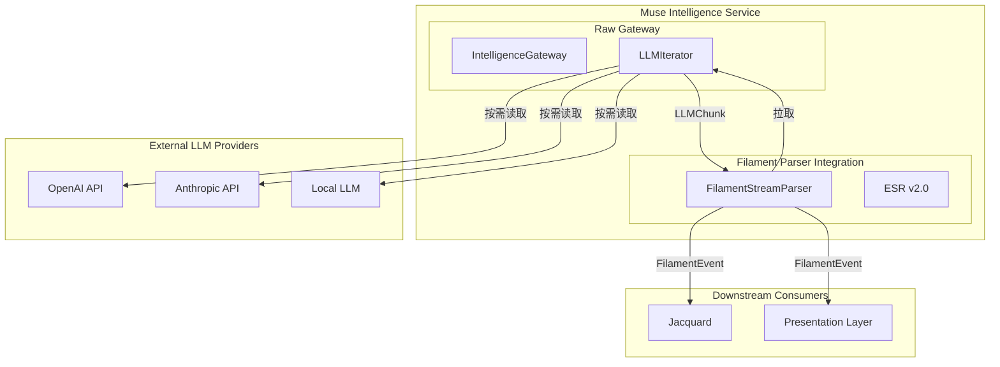
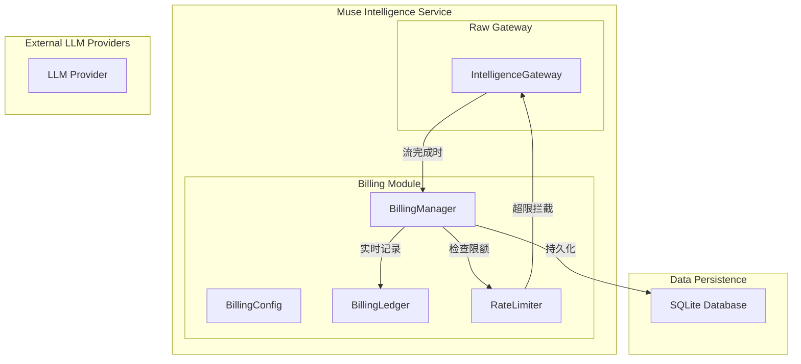

# Muse 流式响应与计费设计规范

**版本**: 1.1.0
**日期**: 2026-03-11
**状态**: Active
**作者**: Clotho 架构团队

**关联文档**:
- [Muse 智能服务架构](README.md) - Muse 服务概览
- [Filament 解析流程](../protocols/filament-parsing-workflow.md) - Filament 协议解析
- [架构原则](../architecture-principles.md) - 凯撒原则与缪斯原则

> 术语体系参见 [naming-convention.md](../naming-convention.md)

---

## 概述

本文档定义了 Muse 智能服务的流式响应处理和实时计费模块的详细设计规范。这些设计解决了审计报告中指出的 P0 优先级问题（流式响应处理缺失）和 High 优先级问题（Token 计费实现未定义）。

---

## 1. 流式响应处理设计

### 1.1 设计决策

采用 **异步迭代器（拉取模式）** 作为流式响应处理架构。

**选择理由**:
- Filament Parser 处理速度足够快，可以跟上 LLM 输出速度
- 零缓冲设计，内存占用最优
- 延迟最低，用户可实时看到输出
- 实现简单，易于调试和维护

### 1.2 架构图



### 1.3 核心接口定义

#### 1.3.1 LLMChunk 数据结构

```dart
/// LLM Chunk 数据结构
class LLMChunk {
  final String content;           // 文本内容
  final int index;                // Chunk 序号
  final bool isLast;              // 是否为最后一个 Chunk
  final TokenUsage? usage;       // Token 使用统计（仅在 isLast=true 时）
  final DateTime timestamp;      // 接收时间戳
}
```

#### 1.3.2 LLMIterator 接口

```dart
/// LLM 异步迭代器接口
abstract class LLMIterator {
  /// 获取下一个 Chunk
  /// 当流结束时返回 null
  Future<LLMChunk?> next();
  
  /// 取消当前请求
  Future<void> cancel();
  
  /// 检查是否还有更多数据
  bool get hasNext;
}
```

#### 1.3.3 IntelligenceGateway 接口（更新版）

```dart
/// 原始智能网关接口（更新版）
abstract class IntelligenceGateway {
  /// 执行一次性生成（非流式）
  Future<LLMResponse> executeRaw({
    required ModelConfig config,
    required List<RawMessage> messages,
    GenerationOptions? options,
  });

  /// 创建流式迭代器（拉取模式）
  LLMIterator createIterator({
    required ModelConfig config,
    required List<RawMessage> messages,
    GenerationOptions? options,
  });
}
```

### 1.4 OpenAI 适配器实现

```dart
class OpenAIIterator implements LLMIterator {
  final OpenAIClient _client;
  final ModelConfig _config;
  final List<RawMessage> _messages;
  final GenerationOptions _options;
  
  SSEStream? _stream;
  bool _cancelled = false;
  bool _ended = false;
  
  OpenAIIterator({
    required OpenAIClient client,
    required ModelConfig config,
    required List<RawMessage> messages,
    GenerationOptions? options,
  }) : _client = client,
       _config = config,
       _messages = messages,
       _options = options ?? GenerationOptions();
  
  @override
  Future<LLMChunk?> next() async {
    if (_cancelled || _ended) return null;
    
    // 首次调用时初始化流
    _stream ??= await _client.streamChatCompletion(
      model: _config.model,
      messages: _messages,
      temperature: _options.temperature,
      maxTokens: _options.maxTokens,
    );
    
    // 拉取下一个事件
    final event = await _stream.next();
    
    if (event == null) {
      _ended = true;
      return null;
    }
    
    // 解析 Token 使用情况（仅在流结束时）
    TokenUsage? usage;
    if (event.isDone) {
      usage = TokenUsage(
        promptTokens: event.promptTokens,
        completionTokens: event.completionTokens,
        totalTokens: event.totalTokens,
      );
    }
    
    return LLMChunk(
      content: event.deltaContent,
      index: event.index,
      isLast: event.isDone,
      usage: usage,
      timestamp: DateTime.now(),
    );
  }
  
  @override
  Future<void> cancel() async {
    _cancelled = true;
    await _stream?.cancel();
  }
  
  @override
  bool get hasNext => !_cancelled && !_ended;
}
```

### 1.5 Filament 流式解析器集成

```dart
/// Filament 流式解析器（拉取模式）
class FilamentStreamParser {
  final LLMIterator _iterator;
  final ExpectedStructureRegistry _esr;
  
  String _buffer = '';
  int _chunkIndex = 0;
  
  FilamentStreamParser({
    required LLMIterator iterator,
    required ExpectedStructureRegistry esr,
  }) : _iterator = iterator,
       _esr = esr;
  
  /// 启动解析（由消费者调用）
  Stream<FilamentEvent> parse() async* {
    while (_iterator.hasNext) {
      // 拉取下一个 Chunk
      final chunk = await _iterator.next();
      if (chunk == null) break;
      
      // 更新缓冲区
      _buffer += chunk.content;
      _chunkIndex = chunk.index;
      
      // 增量解析
      yield* _parseIncremental();
      
      // 如果是最后一个 Chunk，处理剩余内容
      if (chunk.isLast) {
        yield* _parseFinal(chunk.usage);
      }
    }
  }
  
  /// 增量解析（处理当前缓冲区）
  Stream<FilamentEvent> _parseIncremental() async* {
    // 使用 ESR v2.0 的 DFA 状态机进行增量解析
    final events = _esr.parseChunk(_buffer, _chunkIndex);
    
    for (final event in events) {
      yield event;
    }
  }
  
  /// 最终解析（流结束时）
  Stream<FilamentEvent> _parseFinal(TokenUsage? usage) async* {
    // 处理未闭合的标签
    final events = _esr.finalize(_buffer);
    
    for (final event in events) {
      yield event;
    }
    
    // 发送完成事件（包含 Token 使用统计）
    yield FilamentCompleteEvent(usage: usage);
  }
  
  /// 取消解析
  Future<void> cancel() async {
    await _iterator.cancel();
  }
}
```

### 1.6 Jacquard 集成示例

```dart
/// Jacquard 编排层使用示例
class JacquardOrchestrator {
  final IntelligenceGateway _gateway;
  
  Future<void> executeRoleplayLoop({
    required ModelConfig config,
    required List<RawMessage> messages,
    required ExpectedStructureRegistry esr,
  }) async {
    // 1. 创建迭代器
    final iterator = _gateway.createIterator(
      config: config,
      messages: messages,
    );
    
    // 2. 创建 Filament 解析器
    final parser = FilamentStreamParser(
      iterator: iterator,
      esr: esr,
    );
    
    // 3. 启动解析（拉取模式）
    await for (final event in parser.parse()) {
      // 4. 根据事件类型分发处理
      switch (event.type) {
        case FilamentEventType.content:
          _handleContent(event as ContentEvent);
          break;
        case FilamentEventType.variableUpdate:
          _handleVariableUpdate(event as VariableUpdateEvent);
          break;
        case FilamentEventType.complete:
          _handleComplete(event as FilamentCompleteEvent);
          break;
      }
    }
  }
  
  void _handleContent(ContentEvent event) {
    // 推送到 Presentation 层
    _presentationStream.add(MessageUpdateEvent(
      content: event.content,
      isStreaming: true,
    ));
  }
  
  void _handleVariableUpdate(VariableUpdateEvent event) {
    // 提交到 Mnemosyne
    _mnemosyne.updateState(event.updates);
  }
  
  void _handleComplete(FilamentCompleteEvent event) {
    // 记录 Token 使用情况
    _billing.recordUsage(
      model: _currentModel,
      usage: event.usage!,
    );
    
    // 标记消息完成
    _presentationStream.add(MessageUpdateEvent(
      isStreaming: false,
    ));
  }
}
```

---

## 2. 实时计费模块设计

### 2.1 设计决策

采用 **实时计费** 模式：每次流式完成时立即记录，支持实时预算控制和超限拦截。

**选择理由**:
- 用户需要实时了解 API 使用成本
- 支持预算超限时立即拦截，避免意外费用
- 数据实时写入，无需批量处理延迟

### 2.2 架构图



### 2.3 数据模型

#### 2.3.1 TokenUsage

```dart
/// Token 使用统计
class TokenUsage {
  final int promptTokens;       // 输入 Token 数
  final int completionTokens;   // 输出 Token 数
  final int totalTokens;        // 总 Token 数
  
  const TokenUsage({
    required this.promptTokens,
    required this.completionTokens,
    required this.totalTokens,
  });
  
  /// 计算成本（根据模型定价）
  double calculateCost(ModelPricing pricing) {
    return (promptTokens * pricing.promptPrice) +
           (completionTokens * pricing.completionPrice);
  }
}
```

#### 2.3.2 BillingRecord

```dart
/// 计费记录
class BillingRecord {
  final String id;              // 记录 ID
  final String requestId;       // 关联的请求 ID
  final String model;           // 使用的模型
  final String provider;        // Provider
  final TokenUsage usage;       // Token 使用量
  final double cost;            // 计算成本
  final DateTime timestamp;     // 记录时间
  final String? sessionId;      // 会话 ID（可选）
  final String? userId;         // 用户 ID（可选）
  
  BillingRecord({
    required this.id,
    required this.requestId,
    required this.model,
    required this.provider,
    required this.usage,
    required this.cost,
    required this.timestamp,
    this.sessionId,
    this.userId,
  });
  
  /// 转换为 JSON（用于存储）
  Map<String, dynamic> toJson() => {
    'id': id,
    'request_id': requestId,
    'model': model,
    'provider': provider,
    'prompt_tokens': usage.promptTokens,
    'completion_tokens': usage.completionTokens,
    'total_tokens': usage.totalTokens,
    'cost': cost,
    'timestamp': timestamp.toIso8601String(),
    'session_id': sessionId,
    'user_id': userId,
  };
  
  /// 从 JSON 创建
  factory BillingRecord.fromJson(Map<String, dynamic> json) => BillingRecord(
    id: json['id'],
    requestId: json['request_id'],
    model: json['model'],
    provider: json['provider'],
    usage: TokenUsage(
      promptTokens: json['prompt_tokens'],
      completionTokens: json['completion_tokens'],
      totalTokens: json['total_tokens'],
    ),
    cost: json['cost'],
    timestamp: DateTime.parse(json['timestamp']),
    sessionId: json['session_id'],
    userId: json['user_id'],
  );
}
```

#### 2.3.3 ModelPricing

```dart
/// 模型定价配置
class ModelPricing {
  final String model;           // 模型名称
  final String provider;        // Provider
  final double promptPrice;      // 输入 Token 单价（每 1K）
  final double completionPrice; // 输出 Token 单价（每 1K）
  final String currency;        // 货币单位
  
  const ModelPricing({
    required this.model,
    required this.provider,
    required this.promptPrice,
    required this.completionPrice,
    this.currency = 'USD',
  });
  
  /// 计算输入 Token 成本
  double calculatePromptCost(int tokens) {
    return (tokens / 1000) * promptPrice;
  }
  
  /// 计算输出 Token 成本
  double calculateCompletionCost(int tokens) {
    return (tokens / 1000) * completionPrice;
  }
}
```

#### 2.3.4 BillingConfig

```dart
/// 计费配置
class BillingConfig {
  final Map<String, ModelPricing> pricingMap;  // 模型定价映射
  final double monthlyBudget;                  // 月度预算
  final bool enableRateLimit;                  // 是否启用速率限制
  final int maxRequestsPerMinute;              // 每分钟最大请求数
  
  const BillingConfig({
    required this.pricingMap,
    required this.monthlyBudget,
    this.enableRateLimit = true,
    this.maxRequestsPerMinute = 60,
  });
  
  /// 获取模型定价
  ModelPricing? getPricing(String model, String provider) {
    final key = '$provider:$model';
    return pricingMap[key];
  }
}
```

### 2.4 计费管理器

```dart
/// 计费管理器
class BillingManager {
  final BillingConfig _config;
  final BillingLedger _ledger;
  final RateLimiter _rateLimiter;
  
  BillingManager({
    required BillingConfig config,
    required BillingLedger ledger,
    required RateLimiter rateLimiter,
  }) : _config = config,
       _ledger = ledger,
       _rateLimiter = rateLimiter;
  
  /// 记录 Token 使用（实时）
  Future<BillingRecord> recordUsage({
    required String requestId,
    required String model,
    required String provider,
    required TokenUsage usage,
    String? sessionId,
    String? userId,
  }) async {
    // 1. 获取定价
    final pricing = _config.getPricing(model, provider);
    if (pricing == null) {
      throw BillingException('Unknown model: $provider:$model');
    }
    
    // 2. 计算成本
    final cost = usage.calculateCost(pricing);
    
    // 3. 创建记录
    final record = BillingRecord(
      id: _generateId(),
      requestId: requestId,
      model: model,
      provider: provider,
      usage: usage,
      cost: cost,
      timestamp: DateTime.now(),
      sessionId: sessionId,
      userId: userId,
    );
    
    // 4. 实时记录到账本
    await _ledger.addRecord(record);
    
    // 5. 检查预算
    if (userId != null) {
      await _checkBudget(userId, cost);
    }
    
    return record;
  }
  
  /// 检查预算是否超限
  Future<void> _checkBudget(String userId, double cost) async {
    final monthlyUsage = await _ledger.getMonthlyUsage(userId);
    final totalCost = monthlyUsage + cost;
    
    if (totalCost > _config.monthlyBudget) {
      throw BudgetExceededException(
        budget: _config.monthlyBudget,
        used: monthlyUsage,
        requested: cost,
      );
    }
  }
  
  /// 检查速率限制
  Future<void> checkRateLimit(String userId) async {
    if (!_config.enableRateLimit) return;
    
    final allowed = await _rateLimiter.acquire(userId);
    if (!allowed) {
      throw RateLimitExceededException(
        maxRequests: _config.maxRequestsPerMinute,
      );
    }
  }
  
  String _generateId() => 'billing_${DateTime.now().millisecondsSinceEpoch}_${Random().nextInt(10000)}';
}

/// 计费异常
class BillingException implements Exception {
  final String message;
  BillingException(this.message);
  
  @override
  String toString() => 'BillingException: $message';
}

/// 预算超限异常
class BudgetExceededException extends BillingException {
  final double budget;
  final double used;
  final double requested;
  
  BudgetExceededException({
    required this.budget,
    required this.used,
    required this.requested,
  }) : super('Budget exceeded: $budget (used: $used, requested: $requested)');
}

/// 速率限制超限异常
class RateLimitExceededException extends BillingException {
  final int maxRequests;
  
  RateLimitExceededException({required this.maxRequests})
      : super('Rate limit exceeded: $maxRequests requests per minute');
}
```

### 2.5 计费账本（持久化层）

```dart
/// 计费账本接口
abstract class BillingLedger {
  /// 添加记录
  Future<void> addRecord(BillingRecord record);
  
  /// 获取月度使用量
  Future<double> getMonthlyUsage(String userId);
  
  /// 获取历史记录
  Future<List<BillingRecord>> getHistory({
    String? userId,
    DateTime? startDate,
    DateTime? endDate,
    int limit = 100,
  });
  
  /// 获取统计摘要
  Future<BillingSummary> getSummary(String userId);
}

/// SQLite 计费账本实现
class SQLiteBillingLedger implements BillingLedger {
  final Database _db;
  
  SQLiteBillingLedger(this._db);
  
  @override
  Future<void> addRecord(BillingRecord record) async {
    await _db.insert(
      'billing_records',
      record.toJson(),
      conflictAlgorithm: ConflictAlgorithm.replace,
    );
  }
  
  @override
  Future<double> getMonthlyUsage(String userId) async {
    final now = DateTime.now();
    final startOfMonth = DateTime(now.year, now.month, 1);
    
    final result = await _db.rawQuery('''
      SELECT SUM(cost) as total
      FROM billing_records
      WHERE user_id = ?
        AND timestamp >= ?
    ''', [userId, startOfMonth.toIso8601String()]);
    
    return (result.first['total'] as num?)?.toDouble() ?? 0.0;
  }
  
  @override
  Future<List<BillingRecord>> getHistory({
    String? userId,
    DateTime? startDate,
    DateTime? endDate,
    int limit = 100,
  }) async {
    final where = <String>[];
    final args = <dynamic>[];
    
    if (userId != null) {
      where.add('user_id = ?');
      args.add(userId);
    }
    if (startDate != null) {
      where.add('timestamp >= ?');
      args.add(startDate.toIso8601String());
    }
    if (endDate != null) {
      where.add('timestamp <= ?');
      args.add(endDate.toIso8601String());
    }
    
    final whereClause = where.isEmpty ? '' : 'WHERE ${where.join(' AND ')}';
    
    final result = await _db.rawQuery('''
      SELECT * FROM billing_records
      $whereClause
      ORDER BY timestamp DESC
      LIMIT ?
    ''', [...args, limit]);
    
    return result.map((json) => BillingRecord.fromJson(json)).toList();
  }
  
  @override
  Future<BillingSummary> getSummary(String userId) async {
    final now = DateTime.now();
    final startOfMonth = DateTime(now.year, now.month, 1);
    
    final result = await _db.rawQuery('''
      SELECT 
        COUNT(*) as request_count,
        SUM(total_tokens) as total_tokens,
        SUM(cost) as total_cost
      FROM billing_records
      WHERE user_id = ?
        AND timestamp >= ?
    ''', [userId, startOfMonth.toIso8601String()]);
    
    final row = result.first;
    return BillingSummary(
      requestCount: row['request_count'] as int,
      totalTokens: (row['total_tokens'] as num?)?.toInt() ?? 0,
      totalCost: (row['total_cost'] as num?)?.toDouble() ?? 0.0,
      period: startOfMonth,
    );
  }
}

/// 计费摘要
class BillingSummary {
  final int requestCount;
  final int totalTokens;
  final double totalCost;
  final DateTime period;
  
  BillingSummary({
    required this.requestCount,
    required this.totalTokens,
    required this.totalCost,
    required this.period,
  });
}
```

### 2.6 速率限制器

```dart
/// 速率限制器接口
abstract class RateLimiter {
  /// 尝试获取许可
  Future<bool> acquire(String userId);
  
  /// 重置计数
  Future<void> reset(String userId);
}

/// 滑动窗口速率限制器实现
class SlidingWindowRateLimiter implements RateLimiter {
  final int maxRequests;
  final Duration window;
  final Map<String, List<DateTime>> _requests = {};
  
  SlidingWindowRateLimiter({
    required this.maxRequests,
    this.window = const Duration(minutes: 1),
  });
  
  @override
  Future<bool> acquire(String userId) async {
    final now = DateTime.now();
    final windowStart = now.subtract(window);
    
    // 获取或创建用户请求历史
    final history = _requests.putIfAbsent(userId, () => []);
    
    // 清理过期记录
    history.removeWhere((t) => t.isBefore(windowStart));
    
    // 检查是否超限
    if (history.length >= maxRequests) {
      return false;
    }
    
    // 记录新请求
    history.add(now);
    return true;
  }
  
  @override
  Future<void> reset(String userId) async {
    _requests.remove(userId);
  }
}
```

### 2.7 SQLite Schema

```sql
-- 计费记录表
CREATE TABLE billing_records (
  id TEXT PRIMARY KEY,
  request_id TEXT NOT NULL,
  model TEXT NOT NULL,
  provider TEXT NOT NULL,
  prompt_tokens INTEGER NOT NULL,
  completion_tokens INTEGER NOT NULL,
  total_tokens INTEGER NOT NULL,
  cost REAL NOT NULL,
  timestamp TEXT NOT NULL,
  session_id TEXT,
  user_id TEXT
);

-- 索引
CREATE INDEX idx_billing_user_id ON billing_records(user_id);
CREATE INDEX idx_billing_timestamp ON billing_records(timestamp);
CREATE INDEX idx_billing_session_id ON billing_records(session_id);
```

### 2.8 初始化示例

```dart
/// 初始化计费模块
BillingManager createBillingManager(Database db) {
  // 定义模型定价
  final pricingMap = {
    'openai:gpt-4': const ModelPricing(
      model: 'gpt-4',
      provider: 'openai',
      promptPrice: 0.03,      // $0.03 per 1K
      completionPrice: 0.06,   // $0.06 per 1K
    ),
    'openai:gpt-3.5-turbo': const ModelPricing(
      model: 'gpt-3.5-turbo',
      provider: 'openai',
      promptPrice: 0.0015,    // $0.0015 per 1K
      completionPrice: 0.002,  // $0.002 per 1K
    ),
    'anthropic:claude-3-opus': const ModelPricing(
      model: 'claude-3-opus',
      provider: 'anthropic',
      promptPrice: 0.015,     // $0.015 per 1K
      completionPrice: 0.075,  // $0.075 per 1K
    ),
  };
  
  // 创建配置
  final config = BillingConfig(
    pricingMap: pricingMap,
    monthlyBudget: 50.0,       // $50 月度预算
    enableRateLimit: true,
    maxRequestsPerMinute: 60,
  );
  
  // 创建组件
  final ledger = SQLiteBillingLedger(db);
  final rateLimiter = SlidingWindowRateLimiter(
    maxRequests: config.maxRequestsPerMinute,
  );
  
  return BillingManager(
    config: config,
    ledger: ledger,
    rateLimiter: rateLimiter,
  );
}
```

---

## 3. 设计优势总结

### 3.1 流式响应处理（异步迭代器模式）

| 特性 | 说明 |
|------|------|
| 零缓冲 | Parser 拉取即处理，无需缓冲区 |
| 内存最优 | 仅保留当前处理的 Chunk |
| 延迟最低 | 无队列等待，实时响应 |
| 实现简单 | 逻辑清晰，易于调试 |
| 可取消 | 支持中途取消，释放资源 |

### 3.2 实时计费模块

| 特性 | 说明 |
|------|------|
| 实时记录 | 每次流式完成时立即记录 |
| 预算控制 | 支持月度预算和实时超限拦截 |
| 速率限制 | 支持每分钟最大请求数限制 |
| 持久化存储 | SQLite 存储计费记录 |
| 统计分析 | 支持历史记录查询和摘要统计 |

---

## 4. 设计成熟度评估

| 模块 | 之前成熟度 | 当前成熟度 | 改进内容 |
|------|-----------|-----------|---------|
| 流式响应处理 | 未定义 | L3.0 | 完整的异步迭代器接口和实现 |
| Token 计费 | 未定义 | L3.0 | 完整的实时计费模块和数据模型 |
| 模型路由配置 | 未定义 | L1.0 | 基础路由接口（待后续完善） |

---

## 5. 后续工作

- [ ] 实现 Anthropic 和 Local LLM 的迭代器适配器
- [ ] 完善模型路由配置（`router_config.yaml`）
- [ ] 添加计费模块的单元测试
- [ ] 实现计费数据的可视化界面
- [ ] 支持多用户计费隔离
