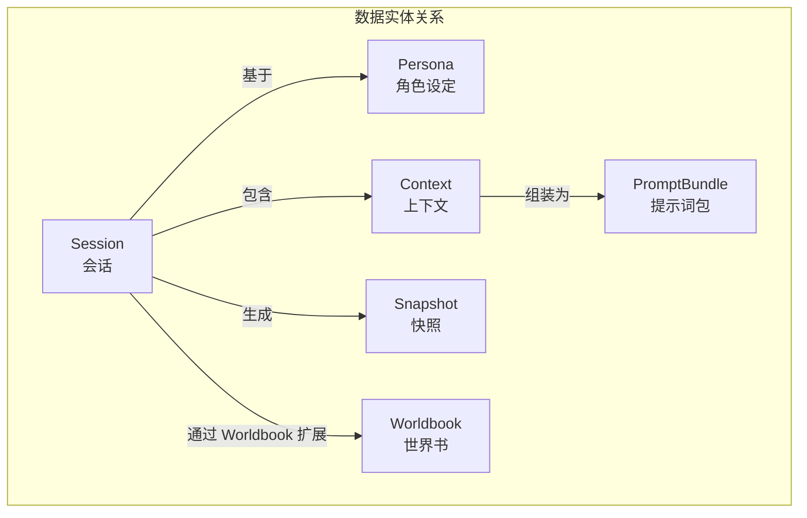
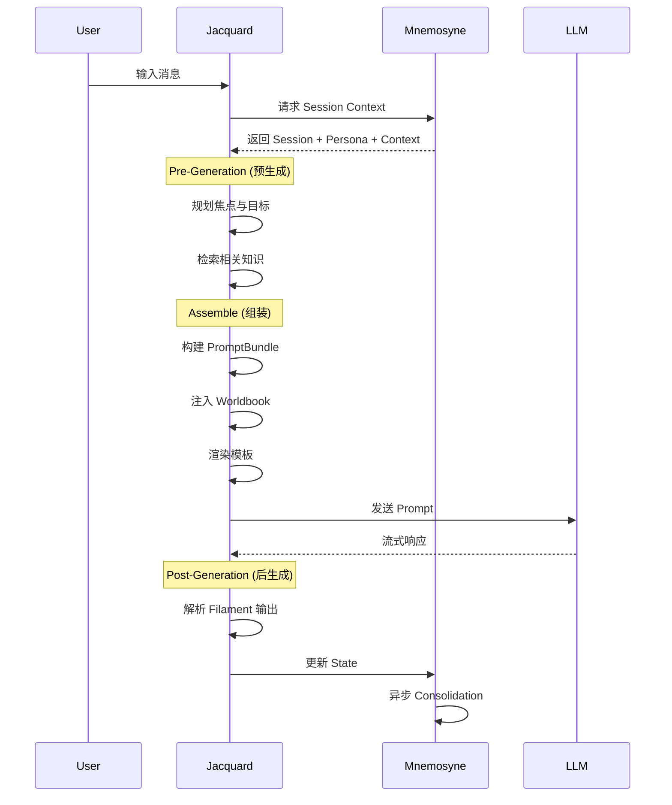

# Clotho 命名规范 (Naming Convention)

**版本**: 1.0.0  
**日期**: 2026-03-11  
**状态**: Active  
**作者**: 系统架构团队  

---

## 1. 概述

本文档定义 Clotho 项目的标准术语体系。与 [`metaphor-glossary.md`](metaphor-glossary.md) 中的纺织隐喻体系并行，本规范提供一套以**技术语义为核心**的精确命名方案，用于代码实现、API 设计和日常技术交流。

### 1.1 两种术语体系的定位

| 场景 | 推荐体系 | 说明 |
|-----|---------|------|
| 架构设计文档 | 隐喻体系 / 技术体系 混合 | 保持概念形象化的同时确保技术准确 |
| 代码实现 | **技术语义体系** | 变量名、类名、API 路径 |
| 用户界面 | 技术语义体系 | 用户可见的标签、提示文字 |
| 对外交流 | 视受众而定 | 向开发者解释技术体系，向普通用户可用隐喻体系 |

### 1.2 命名原则

1. **准确性**: 术语应精确反映技术概念，避免歧义
2. **简洁性**: 优先使用行业通用短词，避免冗长
3. **一致性**: 同一概念在全系统使用相同术语
4. **可发现性**: 新开发者能通过术语推断其用途

---

## 2. 系统组件命名

希腊神话系统名称作为品牌标识保留，在代码中作为命名空间前缀。

| 系统名称 | 命名空间 | 职责描述 |
|---------|---------|---------|
| **Clotho** | `clotho` | 整个应用系统，用户交互的主入口 |
| **Jacquard** | `jacquard` | 编排引擎 (Orchestration Engine)，负责 Prompt 组装与流程调度 |
| **Mnemosyne** | `mnemosyne` | 数据引擎 (Data Engine)，负责状态管理与记忆存储 |
| **Muse** | `muse` | 智能服务层 (LLM Service Layer)，封装模型调用与流式处理 |
| **Stage** | `stage` | 表现层 (Presentation Layer)，负责 UI 渲染与用户交互 |

### 2.1 代码命名示例

```dart
// lib/jacquard/pipeline_runner.dart
class JacquardPipelineRunner {
  final List<JacquardPlugin> plugins;
  final MnemosyneDataEngine dataEngine;
  
  Future<SessionSnapshot> run(PromptBundle bundle) async { ... }
}

// lib/mnemosyne/data_engine.dart
class MnemosyneDataEngine {
  Future<SessionSnapshot> getSnapshot(String sessionId) async { ... }
  Future<void> applyPatches(String sessionId, List<StatePatch> patches) async { ... }
}
```

---

## 3. 数据实体命名

### 3.1 核心实体

| 隐喻术语 | 技术术语 | 英文标识符 | 定义 |
|---------|---------|-----------|------|
| The Tapestry (织卷) | **Session (会话)** | `session` | 运行时实例，用户感知的"一个存档"或"一段人生" |
| The Pattern (织谱) | **Persona (角色设定)** | `persona` | 静态定义集/蓝图，原"Character Card"，决定角色基因 |
| The Threads (丝络) | **Context (上下文)** | `context` | 动态状态流，包含历史记录、状态变量、补丁 |
| Punchcards (穿孔卡) | **Snapshot (快照)** | `snapshot` | 世界状态的静态切片，用于序列化和恢复 |
| Skein (绞纱) | **PromptBundle (提示词包)** | `promptBundle` | Prompt 组装阶段的结构化容器 |
| Filament (纤丝) | **Filament Protocol** | `filament` | 与 LLM 的专用通信协议（保留原名） |
| Lore / Texture | **Worldbook (世界书)** | `worldbook` | 背景知识库，为 Session 提供世界设定 |

### 3.2 数据实体关系



### 3.3 代码数据结构示例

```dart
// lib/models/session.dart          → Session (Tapestry 织卷)
class Session {
  final String id;
  final String personaId;
  final SessionContext context;
  final DateTime createdAt;
  final DateTime updatedAt;
}

// lib/models/persona.dart          → Persona (Pattern 织谱)
class Persona {
  final String id;
  final String name;
  final String description;
  final List<WorldbookEntry> worldbooks;
}

// lib/models/session_context.dart  → SessionContext (Threads 丝络)
class SessionContext {
  final List<Turn> history;
  final StateTree state;
  final List<StatePatch> patches;
}

// lib/models/prompt_bundle.dart    → PromptBundle (Skein 绞纱)
class PromptBundle {
  final List<PromptBlock> systemBlocks;
  final List<PromptBlock> historyBlocks;
  final List<PromptBlock> floatingBlocks;
}
```

---

## 4. 流程阶段命名

### 4.1 核心流程

| 隐喻术语 | 技术术语 | 英文标识符 | 说明 |
|---------|---------|-----------|------|
| Planning Phase | **Pre-Generation (预生成)** | `preGen` | 生成前的战术规划阶段 |
| Consolidation Phase | **Post-Generation (后生成)** | `postGen` | 生成后的记忆整合与归档阶段 |
| Weaving (编织) | **Assemble (组装)** | `assemble` | Prompt 的组装/构造过程 |
| Projection (投影) | **Hydrate (注水)** | `hydrate` | 将静态定义与动态状态合并为运行时对象 |

### 4.2 完整处理流程



---

## 5. 分层架构命名

### 5.1 四层模型

| 层级 | 隐喻术语 | 技术术语 | 英文标识符 | 职责 | 权限 |
|-----|---------|---------|-----------|------|------|
| L0 | Infrastructure | **Config (配置层)** | `config` | Prompt 模板、API 配置 | Read-Only |
| L1 | Environment | **World (世界层)** | `world` | 全局 Worldbook、用户 Persona | Read-Only |
| L2 | The Pattern | **Persona (角色层)** | `persona` | 静态角色设定 | Read-Only |
| L3 | The Threads | **State (状态层)** | `state` | 动态上下文、历史记录 | Read-Write |

### 5.2 分层叠加关系

```dart
// lib/models/layered_state.dart
class LayeredState {
  final ConfigLayer l0;      // 配置层
  final WorldLayer l1;       // 世界层
  final PersonaLayer l2;     // 角色层 (静态)
  final StateLayer l3;       // 状态层 (动态)

  ProjectedState hydrate();                        // 将各层合并为运行时投影
  PersonaLayer _applyPatches(PersonaLayer base, List<StatePatch> patches); // Deep Merge
}
```

---

## 6. 关键子概念命名

### 6.1 状态管理

| 概念 | 技术术语 | 英文标识符 | 说明 |
|-----|---------|-----------|------|
| Patch (补丁) | **StatePatch** | `statePatch` | L3 对 L2 的非破坏性修改 |
| VWD 模型 | **VwdValue** | `vwdValue` | Value with Description 复合结构 |
| Deep Merge | **DeepMerge** | `deepMerge` | 分层状态的深度合并算法 |
| OpLog | **OpLog** | `opLog` | 操作日志，用于状态回溯 |

### 6.2 记忆系统

| 概念 | 技术术语 | 英文标识符 | 说明 |
|-----|---------|-----------|------|
| History Chain | **TurnHistory** | `turnHistory` | 标准对话记录列表 |
| State Chain | **StateTree** | `stateTree` | 结构化 RPG 数值与状态 |
| Event Chain | **EventLog** | `eventLog` | 关键逻辑节点记录 |
| Narrative Chain | **NarrativeLog** | `narrativeLog` | 宏观叙事摘要 |
| RAG Chain | **VectorIndex** | `vectorIndex` | 向量化记忆片段索引 |

### 6.3 组件与插件

| 概念 | 技术术语 | 英文标识符 | 说明 |
|-----|---------|-----------|------|
| Shuttle (梭子) | **Plugin** | `plugin` | Jacquard 流水线中的功能单元 |
| Planner | **Planner** | `planner` | 预生成阶段决策器 |
| Scheduler | **Scheduler** | `scheduler` | 自动化任务触发器 |
| Renderer | **TemplateRenderer** | `templateRenderer` | Jinja2 模板渲染器 |

---

## 7. 概念映射对照表

### 7.1 从传统概念映射

| 传统概念 (Legacy) | 隐喻体系 (Metaphor) | 技术体系 (Technical) | 备注 |
|------------------|--------------------|---------------------|------|
| Character Card (角色卡) | Pattern (织谱) | **Persona** | 静态角色设定 |
| Chat / Session (对话) | Tapestry (织卷) | **Session** | 运行时实例 |
| Message History (历史) | Threads (丝络) | **History** / **TurnHistory** | 对话记录 |
| World Info (世界书) | Lore / Texture | **Worldbook** | 背景知识库 |
| Save File (存档) | Punchcards | **Snapshot** | 状态快照 |
| Prompt Blocks | Skein | **PromptBundle** | 结构化 Prompt |

### 7.2 双体系快速对照

| 技术术语 | 隐喻术语 | 代码变量示例 |
|---------|---------|-------------|
| Session | Tapestry | `session`, `sessionId` |
| Persona | Pattern | `persona`, `personaId`, `personaData` |
| Context | Threads | `context`, `sessionContext` |
| Snapshot | Punchcards | `snapshot`, `snapshotId` |
| PromptBundle | Skein | `bundle`, `promptBundle` |
| Worldbook | Lore | `worldbook`, `worldbookEntry` |
| Pre-Generation | Planning Phase | `preGen`, `planningPhase` |
| Post-Generation | Consolidation Phase | `postGen`, `consolidationPhase` |
| Assemble | Weaving | `assemble()`, `weave()` |
| Hydrate | Projection | `hydrate()`, `project()` |

---

## 8. API 与接口命名规范

### 8.1 RESTful 风格路径

```
GET    /api/v1/sessions              # 获取会话列表
POST   /api/v1/sessions              # 创建新会话
GET    /api/v1/sessions/{id}         # 获取会话详情
PUT    /api/v1/sessions/{id}         # 更新会话
DELETE /api/v1/sessions/{id}         # 删除会话

GET    /api/v1/personas              # 获取角色设定列表
GET    /api/v1/personas/{id}         # 获取角色设定详情

GET    /api/v1/sessions/{id}/history # 获取会话历史
GET    /api/v1/sessions/{id}/state   # 获取会话状态
POST   /api/v1/sessions/{id}/turns   # 创建新回合
```

### 8.2 方法命名规范

```dart
// Mnemosyne 数据引擎 — 查询
Future<Session?> getSession(String sessionId);
Future<List<Session>> listSessions({SessionFilter? filter});
Future<SessionSnapshot> getSnapshot(String sessionId);

// Mnemosyne 数据引擎 — 修改
Future<void> createSession(CreateSessionRequest request);
Future<void> updateState(String sessionId, List<StatePatch> patches);
Future<void> deleteSession(String sessionId);

// Mnemosyne 数据引擎 — 特殊操作
Future<Session> forkSession(String sessionId, {int? turnIndex});
Future<Snapshot> createSnapshot(String sessionId);

// Jacquard 编排引擎
Future<TurnResult> processTurn(ProcessTurnRequest request);
Future<PromptBundle> assemblePrompt(String sessionId, String userInput);
Stream<LLMChunk> invokeLLM(PromptBundle bundle);
```

---

## 9. 文件与目录命名规范

### 9.1 目录结构

```
lib/
├── clotho/                    # 应用主入口
│   └── app.dart
├── config/                    # L0 配置层
│   ├── presets/
│   └── templates/
├── jacquard/                  # 编排引擎
│   ├── plugins/
│   ├── pipeline_runner.dart
│   └── prompt_assembler.dart
├── mnemosyne/                 # 数据引擎
│   ├── models/                # 数据模型
│   │   ├── session.dart
│   │   ├── persona.dart
│   │   ├── context.dart
│   │   └── snapshot.dart
│   ├── repositories/
│   └── data_engine.dart
├── muse/                      # 智能服务层
│   ├── adapters/
│   └── stream_handler.dart
├── stage/                     # 表现层
│   ├── screens/
│   ├── widgets/
│   └── themes/
└── filament/                  # 协议定义
    ├── parser.dart
    └── schema/
```

### 9.2 文件命名规则

| 类型 | 命名风格 | 示例 |
|-----|---------|------|
| 类文件 | `snake_case.dart` | `session_context.dart` |
| 模型类 | `PascalCase` | `class SessionContext` |
| 接口/抽象类 | `PascalCase` | `abstract class DataEngine` |
| 枚举 | `PascalCase` | `enum SessionStatus` |
| 常量 | `camelCase` | `const defaultSessionLimit = 100;` |
| 私有成员 | `_camelCase` | `final String _sessionId;` |

---

## 10. 最佳实践与示例

### 10.1 变量命名示例

```dart
// ✅ 正确：使用技术语义术语
final session = await dataEngine.getSession(sessionId);
final persona = session.persona;
final context = session.context;
final bundle = await assembler.assemble(sessionId, userInput);

// ❌ 错误：使用隐喻术语
final tapestry = await dataEngine.getTapestry(tapestryId);
final pattern = tapestry.pattern;
final threads = tapestry.threads;
final skein = await weaver.weave(tapestryId, userInput);
```

### 10.2 注释规范

```dart
/// Session 管理器 — 对应隐喻体系中的 "Tapestry (织卷)" 管理
class SessionManager {
  Future<Session> createSession({required String personaId, SessionContext? initialContext});
  Future<Session> loadSession(String sessionId);
  Future<void> saveSession(Session session);
  Future<void> deleteSession(String sessionId);
}
```

---

## 附录 A: 术语速查表

| 中文 | 英文 | 代码示例 | 隐喻对照 |
|-----|------|---------|---------|
| 会话 | Session | `Session session` | Tapestry (织卷) |
| 角色设定 | Persona | `Persona persona` | Pattern (织谱) |
| 上下文 | Context | `SessionContext context` | Threads (丝络) |
| 快照 | Snapshot | `SessionSnapshot snapshot` | Punchcards |
| 提示词包 | PromptBundle | `PromptBundle bundle` | Skein (绞纱) |
| 世界书 | Worldbook | `WorldbookEntry entry` | Lore (纹理) |
| 预生成 | Pre-Generation | `preGen()` | Planning Phase |
| 后生成 | Post-Generation | `postGen()` | Consolidation Phase |
| 组装 | Assemble | `assemblePrompt()` | Weaving |
| 注水 | Hydrate | `hydrateState()` | Projection |
| 补丁 | Patch | `StatePatch patch` | - |
| 回合 | Turn | `Turn turn` | - |
| 插件 | Plugin | `JacquardPlugin plugin` | Shuttle |

---

## 相关文档

- [隐喻体系与术语表](metaphor-glossary.md) - 纺织隐喻体系完整定义
- [分层运行时架构](runtime/layered-runtime-architecture.md) - 四层架构详细说明
- [Mnemosyne 数据引擎](mnemosyne/README.md) - 数据引擎设计
- [Jacquard 编排层](jacquard/README.md) - 编排引擎设计
- [文档标准](reference/documentation_standards.md) - 文档编写规范

---

**最后更新**: 2026-03-11  
**维护者**: Clotho 架构团队
