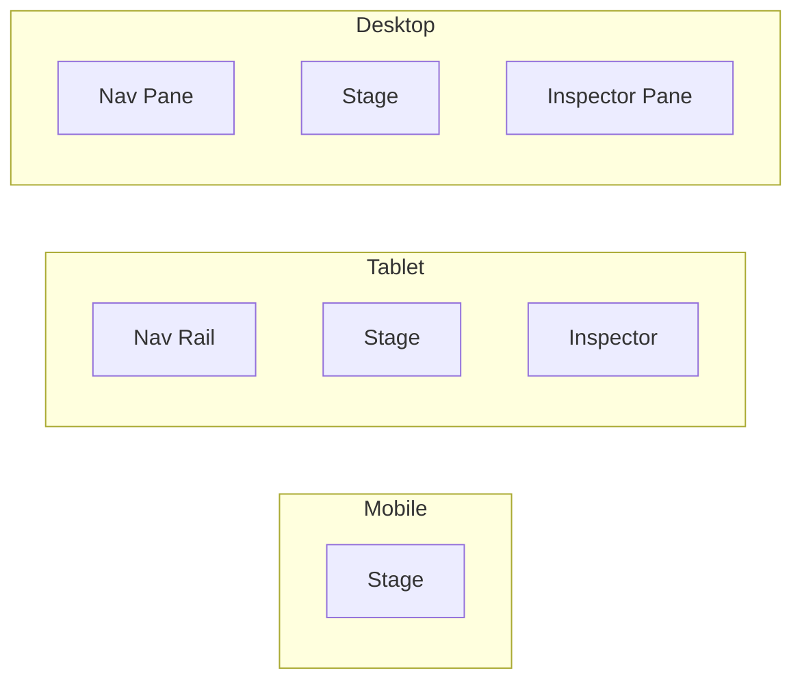

# 响应式布局系统 (Responsive Layout System)

**版本**: 1.0.0
**日期**: 2026-02-11
**状态**: Draft
**参考**: `99_archive/legacy_ui/11-响应式设计.md`

---

## 1. 概述 (Overview)

Clotho 表现层采用响应式三栏架构，基于 `AdaptiveScaffold` 实现 Desktop/Tablet/Mobile 自适应布局。本规范定义断点系统、布局策略和 Stage & Control 布局哲学。

### 1.1 布局哲学

| 概念 | 说明 |
| :--- | :--- |
| **Stage (舞台)** | 核心对话区域，最大化展示空间，减少视觉干扰 |
| **Control (控制台)** | 参数配置与辅助信息，需要时触手可及 |

---

## 2. 断点系统 (Breakpoint System)

### 2.1 断点定义

```dart
class ClothoBreakpoints {
  // 基于 Material 3 标准断点
  static const double mobile = 600;   // 移动设备
  static const double tablet = 840;   // 平板设备
  static const double desktop = 1200; // 桌面设备
}
```

### 2.2 断点范围

| 断点名称 | 最小宽度 (dp) | 最大宽度 (dp) | 典型设备 | 布局策略 |
| :--- | :--- | :--- | :--- | :--- |
| **Mobile** | 0 | 599 | 手机 | 单栏流式 |
| **Tablet** | 600 | 839 | 平板 | 双栏/抽屉 |
| **Desktop** | 840 | ∞ | 桌面/笔记本 | 三栏全开 |

### 2.3 迁移对照表

| 旧 UI 断点 | 新 UI 断点 | 变化 |
| :--- | :--- | :--- |
| `768px` (Mobile) | `600dp` (Mobile) | 更早触发移动端布局 |
| `1000px` (Tablet) | `840dp` (Tablet) | 更早触发平板布局 |
| `1280px` (Desktop) | `1200dp` (Desktop) | 更早触发桌面布局 |

---

## 3. 响应式三栏架构 (Responsive 3-Pane Architecture)

### 3.1 布局策略



### 3.2 布局配置表

| 模式 | 宽度 (dp) | 布局策略 | 组件可见性 |
| :--- | :--- | :--- | :--- |
| **Mobile** | ≤ 600 | **单栏流式** | 仅显示 Stage，其他通过 Drawer/Sheet 呼出 |
| **Tablet** | 600 - 839 | **双栏/抽屉** | Nav 收起为 Rail，Inspector 默认隐藏 |
| **Desktop** | ≥ 840 | **三栏全开** | Nav (左) - Stage (中) - Inspector (右) |

---

## 4. Stage & Control 布局实现

### 4.1 核心布局结构

```dart
class ClothoLayout extends StatelessWidget {
  @override
  Widget build(BuildContext context) {
    return AdaptiveScaffold(
      // 根据断点自动切换布局
      primaryNavigation: SlotLayout(
        config: <Breakpoint, SlotLayoutConfig>{
          Breakpoints.small: SlotLayout.from(
            key: Key('mobile-nav'),
            builder: (_) => MobileNavigationDrawer(),
          ),
          Breakpoints.medium: SlotLayout.from(
            key: Key('tablet-nav'),
            builder: (_) => NavigationRail(),
          ),
          Breakpoints.large: SlotLayout.from(
            key: Key('desktop-nav'),
            builder: (_) => NavigationPane(),
          ),
        },
      ),
      // Stage 区域（核心对话区）
      body: StageView(),
      // Inspector 区域（数据检视器）
      secondaryBody: InspectorView(),
    );
  }
}
```

### 4.2 断点检测工具

```dart
class LayoutHelper {
  static bool isMobile(BuildContext context) {
    return MediaQuery.of(context).size.width < ClothoBreakpoints.mobile;
  }

  static bool isTablet(BuildContext context) {
    final width = MediaQuery.of(context).size.width;
    return width >= ClothoBreakpoints.mobile &&
           width < ClothoBreakpoints.desktop;
  }

  static bool isDesktop(BuildContext context) {
    return MediaQuery.of(context).size.width >= ClothoBreakpoints.desktop;
  }
}
```

---

## 5. 组件响应式适配 (Component Responsive Adaptation)

### 5.1 消息气泡宽度

```dart
class MessageBubble extends StatelessWidget {
  @override
  Widget build(BuildContext context) {
    final isMobile = LayoutHelper.isMobile(context);
    final maxWidth = isMobile
        ? MediaQuery.of(context).size.width * 0.8
        : MediaQuery.of(context).size.width * 0.75;

    return ConstrainedBox(
      constraints: BoxConstraints(maxWidth: maxWidth),
      child: Container(
        decoration: BoxDecoration(
          color: isUser
              ? Theme.of(context).colorScheme.primaryContainer
              : Theme.of(context).colorScheme.surfaceContainerLow,
          borderRadius: BorderRadius.circular(16),
        ),
        child: Text(message.content),
      ),
    );
  }
}
```

### 5.2 导航栏适配

```dart
class AdaptiveNavigation extends StatelessWidget {
  @override
  Widget build(BuildContext context) {
    if (LayoutHelper.isMobile(context)) {
      // Mobile: 抽屉导航
      return Drawer(
        child: NavigationDrawerContent(),
      );
    } else if (LayoutHelper.isTablet(context)) {
      // Tablet: 侧边导航栏
      return NavigationRail(
        destinations: [
          NavigationRailDestination(
            icon: Icon(Icons.chat),
            label: Text('对话'),
          ),
          NavigationRailDestination(
            icon: Icon(Icons.settings),
            label: Text('设置'),
          ),
        ],
      );
    } else {
      // Desktop: 完整导航面板
      return NavigationPane(
        destinations: [
          NavigationPaneItem(
            icon: Icon(Icons.chat),
            label: Text('对话'),
          ),
          NavigationPaneItem(
            icon: Icon(Icons.settings),
            label: Text('设置'),
          ),
        ],
      );
    }
  }
}
```

### 5.3 输入区域适配

```dart
class AdaptiveInputArea extends StatelessWidget {
  @override
  Widget build(BuildContext context) {
    final isMobile = LayoutHelper.isMobile(context);

    return Container(
      padding: EdgeInsets.symmetric(
        horizontal: isMobile ? 12 : 16,
        vertical: isMobile ? 8 : 12,
      ),
      child: Row(
        children: [
          Expanded(
            child: TextField(
              style: TextStyle(
                fontSize: isMobile ? 14 : 16,
              ),
              decoration: InputDecoration(
                hintText: '输入消息...',
                contentPadding: EdgeInsets.symmetric(
                  horizontal: isMobile ? 12 : 16,
                  vertical: isMobile ? 8 : 12,
                ),
              ),
            ),
          ),
          SizedBox(width: isMobile ? 8 : 12),
          FloatingActionButton(
            mini: isMobile,
            onPressed: () {},
            child: Icon(Icons.send),
          ),
        ],
      ),
    );
  }
}
```

---

## 6. Stage 布局规范 (Stage Layout Specification)

### 6.1 Stage 核心结构

```dart
class StageView extends StatelessWidget {
  @override
  Widget build(BuildContext context) {
    return Scaffold(
      backgroundColor: Theme.of(context).colorScheme.background,
      // 顶部菜单栏（固定）
      appBar: AppBar(
        backgroundColor: Theme.of(context).colorScheme.surfaceContainer,
        elevation: 0,
        toolbarHeight: 56,
        title: Text('Clotho'),
        actions: [
          IconButton(icon: Icon(Icons.settings), onPressed: () {}),
          IconButton(icon: Icon(Icons.more_vert), onPressed: () {}),
        ],
      ),
      // 中部消息区域（可滚动）
      body: MessageListView(),
      // 底部输入区域（固定）
      bottomNavigationBar: InputArea(),
    );
  }
}
```

### 6.2 消息列表布局

```dart
class MessageListView extends StatelessWidget {
  @override
  Widget build(BuildContext context) {
    return ListView.builder(
      padding: EdgeInsets.symmetric(
        horizontal: 16,
        vertical: 12,
      ),
      physics: BouncingScrollPhysics(),
      itemCount: messages.length,
      itemBuilder: (context, index) {
        return Padding(
          padding: EdgeInsets.only(bottom: 16),
          child: MessageBubble(message: messages[index]),
        );
      },
    );
  }
}
```

---

## 7. Inspector 布局规范 (Inspector Layout Specification)

### 7.1 Inspector 核心结构

```dart
class InspectorView extends StatelessWidget {
  @override
  Widget build(BuildContext context) {
    if (LayoutHelper.isMobile(context)) {
      // Mobile: 通过 BottomSheet 呼出
      return Container(); // 由触发器打开
    } else if (LayoutHelper.isTablet(context)) {
      // Tablet: 默认隐藏，通过按钮呼出
      return Container(); // 由触发器打开
    } else {
      // Desktop: 右侧固定面板
      return Container(
        width: 320,
        color: Theme.of(context).colorScheme.surfaceContainer,
        child: Column(
          children: [
            InspectorHeader(),
            Expanded(child: StateTreeViewer()),
          ],
        ),
      );
    }
  }
}
```

---

## 8. 响应式工具类 (Responsive Utilities)

### 8.1 响应式间距

```dart
class ResponsivePadding {
  static EdgeInsets get padding => EdgeInsets.symmetric(
    horizontal: LayoutHelper.isMobile(context) ? 12 : 16,
    vertical: LayoutHelper.isMobile(context) ? 8 : 12,
  );
}
```

### 8.2 响应式尺寸

```dart
class ResponsiveSize {
  static double get avatarSize => LayoutHelper.isMobile(context) ? 32.0 : 40.0;
  static double get iconSize => LayoutHelper.isMobile(context) ? 20.0 : 24.0;
}
```

---

## 9. 性能优化 (Performance Optimization)

### 9.1 避免重复布局计算

```dart
class OptimizedLayout extends StatelessWidget {
  @override
  Widget build(BuildContext context) {
    // 缓存断点判断结果
    final isMobile = LayoutHelper.isMobile(context);

    return LayoutBuilder(
      builder: (context, constraints) {
        // 使用 constraints.maxWidth 而非 MediaQuery
        if (constraints.maxWidth < ClothoBreakpoints.mobile) {
          return MobileLayout();
        } else if (constraints.maxWidth < ClothoBreakpoints.desktop) {
          return TabletLayout();
        } else {
          return DesktopLayout();
        }
      },
    );
  }
}
```

### 9.2 使用 const 构造函数

```dart
// ✅ 推荐：使用 const
const SizedBox(width: 16);
const EdgeInsets.all(16);

// ❌ 避免：重复创建
SizedBox(width: 16);
EdgeInsets.all(16);
```

---

## 10. 迁移检查清单 (Migration Checklist)

- [ ] CSS 媒体查询转换为 Flutter 断点系统
- [ ] `@media (max-width: 768px)` 转换为 `LayoutHelper.isMobile()`
- [ ] `100vh` 转换为 `MediaQuery.sizeOf(context).height`
- [ ] Flexbox 布局转换为 Flutter `Row`/`Column`
- [ ] Grid 布局转换为 Flutter `GridView`
- [ ] 动态视口单位 (`dvh`) 转换为 Flutter `SafeArea`

---

**关联文档**:
- [`01-design-tokens.md`](./01-design-tokens.md) - 设计令牌系统
- [`02-color-theme.md`](./02-color-theme.md) - 颜色与主题系统
- [`03-typography.md`](./03-typography.md) - 排版系统
- [`README.md`](./README.md) - 表现层概览
- [`../architecture-principles.md`](../architecture-principles.md) - 架构原则
