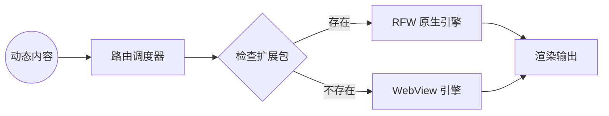

# Hybrid SDUI 引擎 (Hybrid SDUI Engine)

**版本**: 1.0.0
**日期**: 2026-02-11
**状态**: Draft
**参考**: `00_active_specs/presentation/README.md`

---

## 1. 概述 (Overview)

Clotho 表现层采用 **Hybrid SDUI (混合服务端驱动 UI)** 架构，兼顾官方高性能组件与社区多样化内容。本规范定义双轨渲染引擎的设计和实现。

### 1.1 设计原则

| 原则 | 说明 |
| :--- | :--- |
| **原生优先** | 优先使用 RFW 原生渲染，确保最佳性能 |
| **兼容兜底** | 无 RFW 包时降级到 WebView，确保兼容性 |
| **动态路由** | 根据内容类型自动选择渲染轨道 |
| **安全隔离** | 外部内容在隔离容器中渲染 |

---

## 2. 渲染路由机制 (Rendering Routing)

### 2.1 路由流程



### 2.2 路由优先级

| 优先级 | 轨道 | 条件 | 性能 |
| :--- | :--- | :--- | :--- |
| **1** | RFW 原生引擎 | 存在匹配的 `.rfw` 包 | ⭐⭐⭐⭐⭐ |
| **2** | WebView 引擎 | 无匹配包 | ⭐⭐⭐ |

---

## 3. 路由调度器 (Dispatcher)

### 3.1 调度器实现

```dart
class SDUIDispatcher {
  final Map<String, RFWPackage> _rfwPackages = {};
  final WebViewFallback _webViewFallback = WebViewFallback();

  /// 注册 RFW 包
  void registerPackage(String type, RFWPackage package) {
    _rfwPackages[type] = package;
  }

  /// 路由到渲染器
  Widget dispatch(SDUIContent content) {
    // 检查是否存在 RFW 包
    final package = _rfwPackages[content.type];

    if (package != null) {
      // 使用 RFW 原生渲染
      return RFWSlotRenderer(
        package: package,
        content: content,
        onError: (error) {
          // RFW 渲染失败，降级到 WebView
          return _webViewFallback.render(content);
        },
      );
    } else {
      // 降级到 WebView
      return _webViewFallback.render(content);
    }
  }
}
```

### 3.2 内容模型

```dart
enum SDUIContentType {
  characterStatus,  // 角色状态
  lorebookCard,     // Lore (纹理) 卡片
  customWidget,     // 自定义组件
}

class SDUIContent {
  final String id;
  final SDUIContentType type;
  final Map<String, dynamic> data;
  final Map<String, dynamic>? metadata;
  final int? maxHeight;
  final int? maxWidth;
}
```

---

## 4. RFW 原生引擎 (RFW Engine)

### 4.1 RFW 包定义

```dart
class RFWPackage {
  final String name;
  final String version;
  final Map<String, dynamic> schema;
  final Widget Function(Map<String, dynamic> data) builder;

  RFWPackage({
    required this.name,
    required this.version,
    required this.schema,
    required this.builder,
  });
}
```

### 4.2 RFW 渲染器

```dart
class RFWSlotRenderer extends StatefulWidget {
  final RFWPackage package;
  final SDUIContent content;
  final Widget Function(Object error)? onError;

  @override
  _RFWSlotRendererState createState() => _RFWSlotRendererState();
}

class _RFWSlotRendererState extends State<RFWSlotRenderer> {
  Object? _error;

  @override
  Widget build(BuildContext context) {
    if (_error != null) {
      return widget.onError?.call(_error!) ??
          FallbackSlotRenderer(content: widget.content);
    }

    try {
      return Container(
        constraints: BoxConstraints(
          maxHeight: widget.content.maxHeight?.toDouble() ?? 300,
          maxWidth: widget.content.maxWidth?.toDouble() ?? double.infinity,
        ),
        child: widget.package.builder(widget.content.data),
      );
    } catch (e) {
      setState(() {
        _error = e;
      });
      return widget.onError?.call(e) ??
          FallbackSlotRenderer(content: widget.content);
    }
  }
}
```

---

## 5. WebView 兜底机制 (WebView Fallback)

### 5.1 WebView 渲染器

```dart
class WebViewSlotRenderer extends StatefulWidget {
  final SDUIContent content;

  @override
  _WebViewSlotRendererState createState() => _WebViewSlotRendererState();
}

class _WebViewSlotRendererState extends State<WebViewSlotRenderer> {
  late WebViewController _controller;
  bool _isLoading = true;
  bool _hasError = false;

  @override
  void initState() {
    super.initState();
    _controller = WebViewController()
      ..setJavaScriptMode(JavaScriptMode.unrestricted)
      ..setNavigationDelegate(
        NavigationDelegate(
          onPageFinished: (_) {
            setState(() {
              _isLoading = false;
            });
          },
          onWebResourceError: (error) {
            setState(() {
              _isLoading = false;
              _hasError = true;
            });
          },
        ),
      );
  }

  @override
  Widget build(BuildContext context) {
    if (_hasError) {
      return FallbackSlotRenderer(content: widget.content);
    }

    return Container(
      constraints: BoxConstraints(
        maxHeight: widget.content.maxHeight?.toDouble() ?? 300,
      ),
      decoration: BoxDecoration(
        color: Theme.of(context).colorScheme.surfaceContainerLow,
        borderRadius: BorderRadius.circular(8),
      ),
      child: _isLoading
          ? Center(
              child: CircularProgressIndicator(),
            )
          : WebViewWidget(controller: _controller),
    );
  }
}
```

### 5.2 HTML 生成器

```dart
class HTMLGenerator {
  static String generate(SDUIContent content) {
    final buffer = StringBuffer();

    buffer.writeln('<!DOCTYPE html>');
    buffer.writeln('<html>');
    buffer.writeln('<head>');
    buffer.writeln('<meta charset="UTF-8">');
    buffer.writeln('<meta name="viewport" content="width=device-width, initial-scale=1.0">');
    buffer.writeln('<style>');
    buffer.writeln(_generateStyles());
    buffer.writeln('</style>');
    buffer.writeln('</head>');
    buffer.writeln('<body>');
    buffer.writeln(_generateBody(content));
    buffer.writeln('</body>');
    buffer.writeln('</html>');

    return buffer.toString();
  }

  static String _generateStyles() {
    return '''
      body {
        margin: 0;
        padding: 16px;
        font-family: -apple-system, BlinkMacSystemFont, 'Segoe UI', Roboto, sans-serif;
        background-color: transparent;
        color: #DCDCD2;
      }
      * {
        box-sizing: border-box;
      }
    ''';
  }

  static String _generateBody(SDUIContent content) {
    switch (content.type) {
      case SDUIContentType.characterStatus:
        return _generateCharacterStatus(content.data);
      case SDUIContentType.lorebookCard:
        return _generateLorebookCard(content.data);
      default:
        return '<div>未知内容类型</div>';
    }
  }

  static String _generateCharacterStatus(Map<String, dynamic> data) {
    final name = data['name'] ?? '未知';
    final status = data['status'] ?? '离线';

    return '''
      <div class="character-status">
        <h3>$name</h3>
        <p>状态: <span class="status">$status</span></p>
      </div>
    ''';
  }

  static String _generateLorebookCard(Map<String, dynamic> data) {
    final title = data['title'] ?? '无标题';
    final content = data['content'] ?? '';

    return '''
      <div class="lorebook-card">
        <h4>$title</h4>
        <p>$content</p>
      </div>
    ''';
  }
}
```

---

## 6. 扩展包注册表 (Extension Registry)

### 6.1 注册表实现

```dart
class SDUIExtensionRegistry {
  static final SDUIExtensionRegistry _instance =
      SDUIExtensionRegistry._internal();

  factory SDUIExtensionRegistry() => _instance;

  SDUIExtensionRegistry._internal();

  final Map<String, RFWPackage> _packages = {};

  /// 注册扩展包
  void register(String type, RFWPackage package) {
    _packages[type] = package;
  }

  /// 获取扩展包
  RFWPackage? getPackage(String type) {
    return _packages[type];
  }

  /// 注销扩展包
  void unregister(String type) {
    _packages.remove(type);
  }

  /// 获取所有已注册类型
  List<String> getRegisteredTypes() {
    return _packages.keys.toList();
  }
}
```

### 6.2 扩展包初始化

```dart
void initializeSDUIExtensions() {
  final registry = SDUIExtensionRegistry();

  // 注册角色状态包
  registry.register(
    'characterStatus',
    RFWPackage(
      name: 'CharacterStatus',
      version: '1.0.0',
      schema: {
        'name': 'string',
        'status': 'string',
      },
      builder: (data) => CharacterStatusWidget(
        name: data['name'],
        status: data['status'],
      ),
    ),
  );

  // 注册 Lore (纹理) 卡片包
  registry.register(
    'lorebookCard',
    RFWPackage(
      name: 'LorebookCard',
      version: '1.0.0',
      schema: {
        'title': 'string',
        'content': 'string',
      },
      builder: (data) => LorebookCardWidget(
        title: data['title'],
        content: data['content'],
      ),
    ),
  );
}
```

---

## 7. 性能优化 (Performance Optimization)

### 7.1 RFW 缓存

```dart
class RFWCache {
  final Map<String, Widget> _cache = {};

  Widget get(String key, Widget Function() builder) {
    return _cache.putIfAbsent(key, builder);
  }

  void clear() {
    _cache.clear();
  }
}
```

### 7.2 WebView 池化

```dart
class WebViewPool {
  final Queue<WebViewController> _pool = Queue();
  final int _maxSize = 3;

  WebViewController acquire() {
    if (_pool.isNotEmpty) {
      return _pool.removeFirst();
    }
    return WebViewController();
  }

  void release(WebViewController controller) {
    if (_pool.length < _maxSize) {
      _pool.add(controller);
    } else {
      controller.clearCache();
    }
  }
}
```

---

## 8. 安全考虑 (Security Considerations)

### 8.1 内容过滤

```dart
class ContentSanitizer {
  static String sanitizeHTML(String html) {
    // 移除危险标签
    return html
        .replaceAll(RegExp(r'<script[^>]*>.*?</script>', caseSensitive: false), '')
        .replaceAll(RegExp(r'<iframe[^>]*>.*?</iframe>', caseSensitive: false), '')
        .replaceAll(RegExp(r'on\w+="[^"]*"', caseSensitive: false), '')
        .replaceAll(RegExp(r'javascript:', caseSensitive: false), '');
  }
}
```

### 8.2 CSP 策略

```dart
class ContentSecurityPolicy {
  static String get policy => '''
    default-src 'self';
    script-src 'none';
    style-src 'self';
    img-src 'self' data:;
    connect-src 'self';
  ''';
}
```

---

## 9. 迁移对照表 (Migration Reference)

| 旧 UI 概念 | 新 UI 组件 | 变化 |
| :--- | :--- | :--- |
| 内联 HTML | `WebViewSlotRenderer` | 直接嵌入 → 隔离容器 |
| 状态栏渲染 | `SDUIDispatcher` | 直接渲染 → 路由调度 |
| 组件扩展 | `SDUIExtensionRegistry` | 无 → 扩展注册表 |

---

**关联文档**:
- [`01-design-tokens.md`](./01-design-tokens.md) - 设计令牌系统
- [`02-color-theme.md`](./02-color-theme.md) - 颜色与主题系统
- [`03-typography.md`](./03-typography.md) - 排版系统
- [`04-responsive-layout.md`](./04-responsive-layout.md) - 响应式布局
- [`07-message-status-slot.md`](./07-message-status-slot.md) - 消息状态槽
- [`11-rfw-renderer.md`](./11-rfw-renderer.md) - RFW 渲染器
- [`12-webview-fallback.md`](./12-webview-fallback.md) - WebView 兜底
