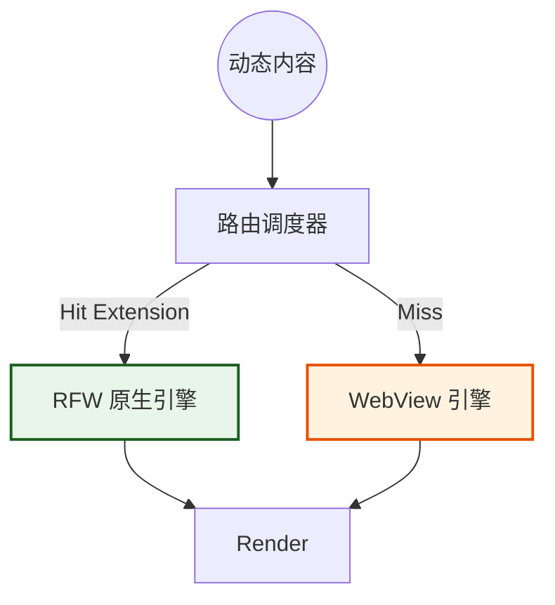
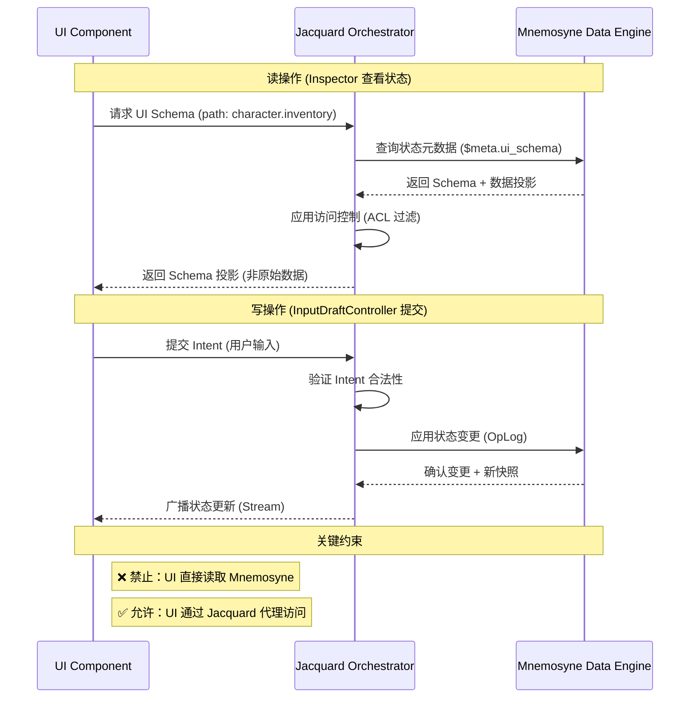

# 第四章：表现层与交互体系 (Presentation Layer)

**版本**: 1.2.0
**日期**: 2026-03-11
**状态**: Active
**作者**: 资深系统架构师 (Architect Mode)
**源文档**: `ui_layout_design.md`, `ui_subsystem_design.md`

> 术语体系参见 [naming-convention.md](../naming-convention.md)

---

## 1. 表现层概览 (Presentation Overview)

表现层负责将底层数据流转化为可视化的像素。我们基于 **Flutter** 构建了高性能的跨平台渲染体系，采用 **"Hybrid SDUI (混合服务端驱动 UI)"** 架构，旨在实现：

1.  **多端一致性**: 确保 Windows 桌面端与 Android 移动端拥有统一的视觉语言与交互逻辑。
2.  **高性能原生体验**: 利用 Flutter 的 Skia/Impeller 引擎实现 60fps+ 的流畅渲染。
3.  **兼容性**: 通过 Webview 容器兼顾海量第三方 Web 生态内容。

### 1.1 核心设计理念

1. **Stage & Control**: 布局哲学，区分沉浸区与控制区。
2. **Hybrid Rendering**: 原生 RFW 与 Webview 双轨并行。
3. **Unidirectional Control**: 单向受控，UI 不直接修改数据，通过 Intent 通信。

---

## 2. 布局哲学与响应式设计

### 2.1 Stage & Control (舞台与控制台)

* **Stage (舞台)**: 核心对话区域，应最大化展示空间，减少视觉干扰。
* **Control (控制台)**: 参数配置与辅助信息（如 Lorebook, Status），应在需要时触手可及。

### 2.2 响应式三栏架构 (Responsive 3-Pane)

基于 `AdaptiveScaffold`，系统根据屏幕宽度自动适配：

| 模式 | 宽度 (dp) | 布局策略 |
| :--- | :--- | :--- |
| **Desktop** | ≥ 840 | **三栏全开**: Nav (左) - Stage (中) - Inspector (右) |
| **Tablet** | 600 - 839 | **双栏/抽屉**: Nav 收起为 Rail，Inspector 默认隐藏 |
| **Mobile** | ≤ 599 | **单栏流式**: 仅显示 Stage，其他功能通过 Drawer/Sheet 呼出 |

---

## 3. Hybrid SDUI 引擎 (混合驱动 UI)

为了兼顾官方高性能组件与社区多样化内容，我们设计了双轨渲染引擎。

### 3.1 渲染路由机制

当系统需要渲染动态内容（如角色状态栏）时，**路由调度器** 按以下优先级执行：

1. **Extension Check**: 查询 UI 扩展包注册表。
2. **Native Track (优先)**: 若存在匹配的 `.rfw` (Remote Flutter Widgets) 包，加载并注入数据，执行原生渲染。
3. **Web Track (兜底)**: 若无匹配包，降级使用 WebView 渲染 HTML/JS，确保兼容性。

### 3.2 架构拓扑



---

## 4. 关键组件体系

### 4.1 MessageStatusSlot (消息状态槽)

* **定位**: 嵌入在 `ChatMessageItem` 底部的动态容器。
* **生命周期**: 随消息创建而初始化。
* **职责**: 作为“防火墙”隔离外部内容，管理渲染器的尺寸约束与异常处理。

### 4.2 Inspector (数据检视器 - 新增)
*   **定位**: `Control` 区域的核心组件，通常在桌面模式下的右侧边栏。
*   **职责**: 提供对 `Mnemosyne` 状态树的 **只读** 可视化界面，方便用户调试和理解当前世界状态。
*   **Schema 驱动渲染**:
    *   当用户在 Inspector 中选择查看某个状态节点时（如 `character.inventory`）。
    *   系统会检查该节点及其父节点中的 `$meta.ui_schema` 属性。
    *   **如果找到 Schema**: 
        * UI 层检查 `$meta.ui_schema` 定义（例如表格列宽、排序规则、图标）。
        * 使用 `Hybrid SDUI` 的 Web 轨道，加载一个通用的、由 Schema 定义的 "Table Renderer" 或 "Card Renderer" 组件。
    *   **如果未找到**: 回退到默认的、格式化的 JSON Tree 视图。
*   **价值**: 复刻 ACU Visualizer 的灵活性，让用户/创作者可以自定义数据的展示方式，而无需修改客户端代码。

### 4.3 InputDraftController (输入草稿控制器)
UI 子系统与用户输入之间的**唯一写通道**。


* **安全约束**: 状态栏严禁直接发送消息。
* **工作流**:
    1. 用户点击状态栏的“攻击”按钮。
    2. UI 捕捉意图，生成 Draft ("尝试攻击哥布林")。
    3. 填入输入框，供用户二次编辑。

---

## 5. 交互法则

### 5.1 单向数据流

* **UI 是消费者**: 监听 Jacquard 的 Filament 流，渲染 `<content>` 和 `<thought>`。
* **UI 是触发者**: 将点击事件转化为 Intent，但不直接操作 `World State`。

### 5.2 状态同步

UI 不维护权威状态。当 `Mnemosyne` 更新状态后，通过 Stream 广播新快照，UI 接收后触发 `build` 重绘。这种机制确保了在回溯历史时，UI 状态能自动且正确地回滚。

### 5.3 数据访问边界 (Data Access Boundaries)

**核心原则**: UI 组件严禁直接访问 Mnemosyne 状态树。所有数据访问必须通过 Jacquard 编排层进行代理。

| 组件 | 数据访问路径 | 说明 |
|------|-------------|------|
| **Inspector** | UI → Jacquard → Mnemosyne → Jacquard → UI | Jacquard 返回 Schema 投影，而非原始数据 |
| **StateTreeViewer** | UI → Jacquard → Mnemosyne → Jacquard → UI | 仅请求当前选中节点的数据 |
| **InputDraftController** | UI → Jacquard → Mnemosyne | 写操作通过 Jacquard 验证后应用 |
| **MessageBubble** | UI ← Jacquard (Filament 流) | 只读消费，不直接访问状态 |

**数据访问序列图**:



**违反边界的后果**:

| 违规行为 | 后果 | 正确做法 |
|---------|------|---------|
| UI 直接读取 `$meta.ui_schema` | 绕过 ACL 过滤，可能泄露敏感数据 | 通过 `Jacquard.requestUISchema(path)` |
| UI 直接写入 Mnemosyne | 破坏 OpLog 链，无法回溯历史 | 通过 `Jacquard.submitIntent(intent)` |
| UI 缓存状态快照 | 导致状态不一致，回溯失效 | 监听 Jacquard 的 Stream 流 |

**实现指南**:

```dart
// ❌ 错误示例：UI 直接访问 Mnemosyne
class Inspector extends StatelessWidget {
  void _onNodeSelected(String path) {
    // 错误：直接读取 Mnemosyne 状态树
    final schema = Mnemosyne.getState(path).meta.uiSchema;
    _render(schema);
  }
}

// ✅ 正确示例：UI 通过 Jacquard 代理访问
class Inspector extends StatelessWidget {
  void _onNodeSelected(String path) {
    // 正确：通过 Jacquard 请求 UI Schema 投影
    final schema = await Jacquard.requestUISchema(path);
    _render(schema);
  }
}
```

---

## 6. 设计规范文档 (Design Specifications)

本节包含 Clotho 表现层的设计规范文档，定义了设计令牌、颜色主题、排版系统、响应式布局和组件规范。

### 6.1 Phase 1: 基础架构 (Foundation)

| 文档 | 描述 | 状态 |
| :--- | :--- | :--- |
| [`01-design-tokens.md`](./01-design-tokens.md) | 设计令牌系统：间距、圆角、阴影、尺寸、动画 | Active |
| [`02-color-theme.md`](./02-color-theme.md) | 颜色与主题系统：Material 3 ColorScheme、语义色映射 | Active |
| [`03-typography.md`](./03-typography.md) | 排版系统：字体族、字号、行高、字重 | Active |
| [`04-responsive-layout.md`](./04-responsive-layout.md) | 响应式布局：断点系统、三栏架构、组件适配 | Active |

### 6.2 Phase 2: Stage 核心 (Stage Core)

| 文档 | 描述 | 状态 |
| :--- | :--- | :--- |
| [`05-message-bubble.md`](./05-message-bubble.md) | 消息气泡组件：结构、样式、状态、交互 | Active |
| [`06-input-area.md`](./06-input-area.md) | 输入区域组件：输入框、工具栏、生成状态 | Active |
| [`07-message-status-slot.md`](./07-message-status-slot.md) | 消息状态槽：渲染隔离、路由调度、异常处理 | Active |

### 6.3 Phase 3: 导航与布局 (Navigation & Layout)

| 文档 | 描述 | 状态 |
| :--- | :--- | :--- |
| [`08-navigation.md`](./08-navigation.md) | 导航系统：顶部导航栏、NavigationRail、NavigationDrawer | Active |
| [`09-drawers-sheets.md`](./09-drawers-sheets.md) | 抽屉与面板：模态对话框、确认框、底部面板 | Active |

### 6.4 Phase 4: Hybrid SDUI

| 文档 | 描述 | 状态 |
| :--- | :--- | :--- |
| [`10-hybrid-sdui.md`](./10-hybrid-sdui.md) | Hybrid SDUI 引擎：路由调度、扩展包注册表 | Active |
| [`11-rfw-renderer.md`](./11-rfw-renderer.md) | RFW 渲染器实现草稿：代码结构示例 | Draft |
| [`sdui-rfw-protocol.md`](./sdui-rfw-protocol.md) | **[核心]** RFW 协议与包规范：.cpk 格式、组件映射、合规分级 | Active |
| [`12-webview-fallback.md`](./12-webview-fallback.md) | WebView 渲染器实现草稿：代码结构示例 | Draft |
| [`webview-bridge-api.md`](./webview-bridge-api.md) | **[核心]** WebView 桥接 API：JSON-RPC 协议、分级能力 | Active |

### 6.5 Phase 5: 高级组件 (Advanced Components)

| 文档 | 描述 | 状态 |
| :--- | :--- | :--- |
| [`13-inspector.md`](./13-inspector.md) | Inspector 组件：状态树查看器、Schema 驱动渲染 | Active |
| [`14-state-tree-viewer.md`](./14-state-tree-viewer.md) | 状态树查看器：树形渲染、搜索、类型标注 | Active |
| [`15-input-draft-controller.md`](./15-input-draft-controller.md) | 输入草稿控制器：草稿管理、Intent 转换、验证器 | Active |

### 6.6 Phase 6: 优化与文档 (Optimization & Documentation)

| 文档 | 描述 | 状态 |
| :--- | :--- | :--- |
| [`16-performance.md`](./16-performance.md) | 性能优化：渲染优化、列表优化、内存优化 | Active |
| [`17-animation.md`](./17-animation.md) | 动画与过渡：时长、缓动曲线、组件动画 | Active |

### 6.7 设计规范概览

#### 设计令牌系统 ([`01-design-tokens.md`](./01-design-tokens.md))

定义了表现层的原子设计单位，包括：
- **间距令牌**: 基于 4px 基准网格的间距系统
- **圆角令牌**: 组件圆角半径定义
- **阴影令牌**: Material 3 层级阴影
- **尺寸令牌**: 图标、头像等组件尺寸
- **动画令牌**: 时长和缓动曲线

#### 颜色与主题系统 ([`02-color-theme.md`](./02-color-theme.md))

基于 Flutter Material 3 的颜色体系，包括：
- **主题配置**: `ColorScheme.fromSeed` 深色主题
- **语义色映射**: 旧 UI 颜色到 Material 3 的转换
- **组件颜色应用**: 消息气泡、导航栏、输入区域等
- **透明度系统**: 标准透明度阶梯
- **主题切换**: 支持系统主题和动态切换

#### 排版系统 ([`03-typography.md`](./03-typography.md))

定义统一的字体和文本样式，包括：
- **字体族**: Noto Sans（主字体）和 Noto Sans Mono（等宽字体）
- **字号系统**: Material 3 TextTheme 映射
- **行高系统**: 标准行高定义
- **字重系统**: FontWeight 枚举应用
- **特殊文本样式**: 代码块、引用文本等
- **动态字体缩放**: 支持系统字体大小设置

#### 响应式布局 ([`04-responsive-layout.md`](./04-responsive-layout.md))

定义跨平台响应式布局策略，包括：
- **断点系统**: Mobile (≤600dp)、Tablet (600-839dp)、Desktop (≥840dp)
- **三栏架构**: Nav - Stage - Inspector 的自适应布局
- **Stage & Control 布局哲学**: 沉浸区与控制区分离
- **组件响应式适配**: 消息气泡、导航栏、输入区域等
- **性能优化**: 避免重复布局计算

#### 输入区域 ([`06-input-area.md`](./06-input-area.md))

定义输入区域的交互组件，包括：
- **输入框组件**: 自适应高度、Token 计数
- **状态工具栏**: 生成状态指示器、快捷操作
- **键盘快捷键**: Enter 发送、Shift+Enter 换行、Ctrl+K 清空

#### 消息状态槽 ([`07-message-status-slot.md`](./07-message-status-slot.md))

定义消息底部动态容器的渲染机制，包括：
- **渲染隔离**: 作为防火墙隔离外部内容
- **路由调度**: RFW 优先、WebView 兜底
- **异常处理**: 统一异常捕获和降级方案

#### 导航系统 ([`08-navigation.md`](./08-navigation.md))

定义响应式导航组件，包括：
- **顶部导航栏**: 自适应高度、响应式按钮
- **NavigationRail**: 侧边栏导航（Tablet 模式）
- **NavigationDrawer**: 抽屉导航（Mobile 模式）
- **NavigationPane**: 面板导航（Desktop 模式）

#### 抽屉与面板 ([`09-drawers-sheets.md`](./09-drawers-sheets.md))

定义弹窗组件，包括：
- **模态对话框**: 响应式尺寸、动画过渡
- **确认对话框**: 标准确认流程
- **底部面板**: 移动端适配、响应式切换
- **菜单组件**: 子菜单支持、分隔线

#### Hybrid SDUI 引擎 ([`10-hybrid-sdui.md`](./10-hybrid-sdui.md))

定义混合渲染引擎，包括：
- **路由调度器**: RFW 优先、WebView 兜底
- **扩展包注册表**: 动态注册和查询
- **内容模型**: SDUIContent 和类型定义

#### RFW 渲染器 ([`11-rfw-renderer.md`](./11-rfw-renderer.md))

定义 RFW 原生渲染，包括：
- **RFW 包结构**: Schema 定义、验证机制
- **RFW 加载器**: 本地加载、动态代码加载
- **内置包**: Pattern (织谱) 状态包、Lore (纹理) 卡片包

#### WebView 兜底 ([`12-webview-fallback.md`](./12-webview-fallback.md))

定义 WebView 兜底机制，包括：
- **WebView 渲染器**: 安全策略、异常处理
- **HTML 生成器**: 统一生成、CSP 策略
- **WebView 池**: 资源复用、性能优化

#### Inspector 组件 ([`13-inspector.md`](./13-inspector.md))

定义数据检视器，包括：
- **状态树查看器**: 实时同步、路径选择
- **Schema 驱动渲染**: 表格、卡片、列表渲染器
- **详情面板**: 路径、类型、值显示

#### 状态树查看器 ([`14-state-tree-viewer.md`](./14-state-tree-viewer.md))

定义树形查看器，包括：
- **树节点模型**: 层级、展开状态
- **搜索功能**: 路径搜索、值搜索
- **类型标注**: 颜色编码、类型标签

#### 输入草稿控制器 ([`15-input-draft-controller.md`](./15-input-draft-controller.md))

定义输入草稿管理，包括：
- **草稿管理**: 自动保存、恢复、清空
- **Intent 转换**: 用户操作转换为 Intent
- **验证器**: 输入验证、Token 计数

#### 性能优化 ([`16-performance.md`](./16-performance.md))

定义性能优化策略，包括：
- **渲染优化**: const 构造函数、RepaintBoundary
- **列表优化**: ListView.builder、虚拟滚动
- **图片优化**: 缓存、压缩、懒加载
- **状态管理优化**: Selector、ChangeNotifier
- **WebView 优化**: 池化、懒加载
- **内存优化**: 资源释放、缓存清理
- **性能监控**: 帧率监控、指标记录

#### 动画与过渡 ([`17-animation.md`](./17-animation.md))

定义动画系统，包括：
- **动画时长**: fast、medium、slow、extraSlow
- **缓动曲线**: standard、emphasized、emphasizedDecelerate
- **页面过渡**: 滑动、淡入淡出
- **组件动画**: 消息气泡、输入框、按钮
- **加载动画**: 圆形进度条、脉冲加载
- **动画禁用**: 全局设置、性能优化

---

## 7. 关联文档 (Related Documents)

- **[架构原则](../architecture-principles.md)**: Clotho 系统架构原则
- **[隐喻术语表](../metaphor-glossary.md)**: 纺织隐喻术语定义
- **[分层运行时架构](../runtime/layered-runtime-architecture.md)**: 运行时架构规范
- **[Filament 协议概览](../protocols/filament-protocol-overview.md)**: 交互协议规范
- **[UI 设计路线图](../../02_active_plans/ui-design-roadmap.md)**: UI 设计实施路线图
- **[旧 UI 索引](../../99_archive/legacy_ui/00-索引.md)**: 旧 UI 设计规范索引
