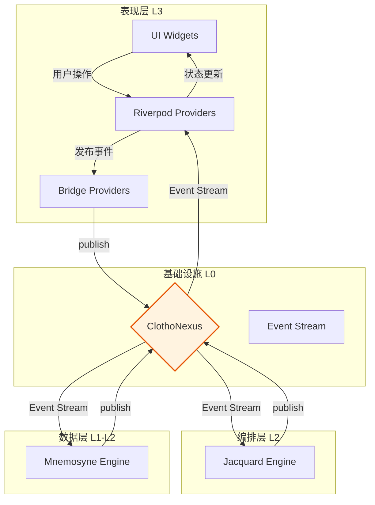
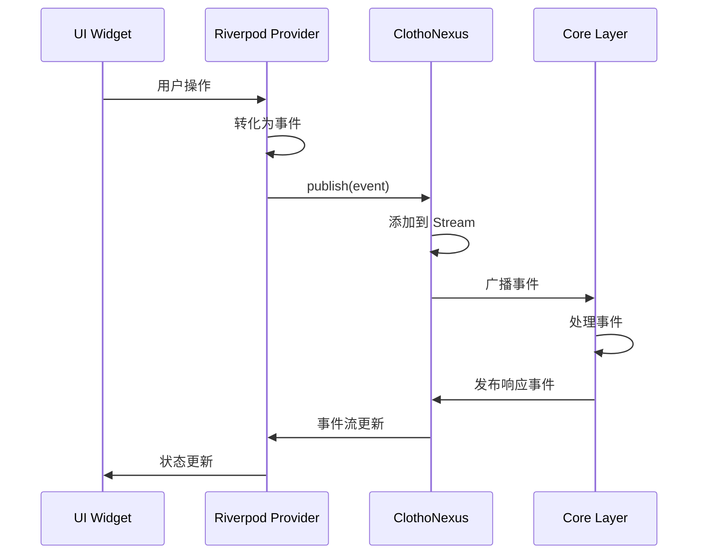
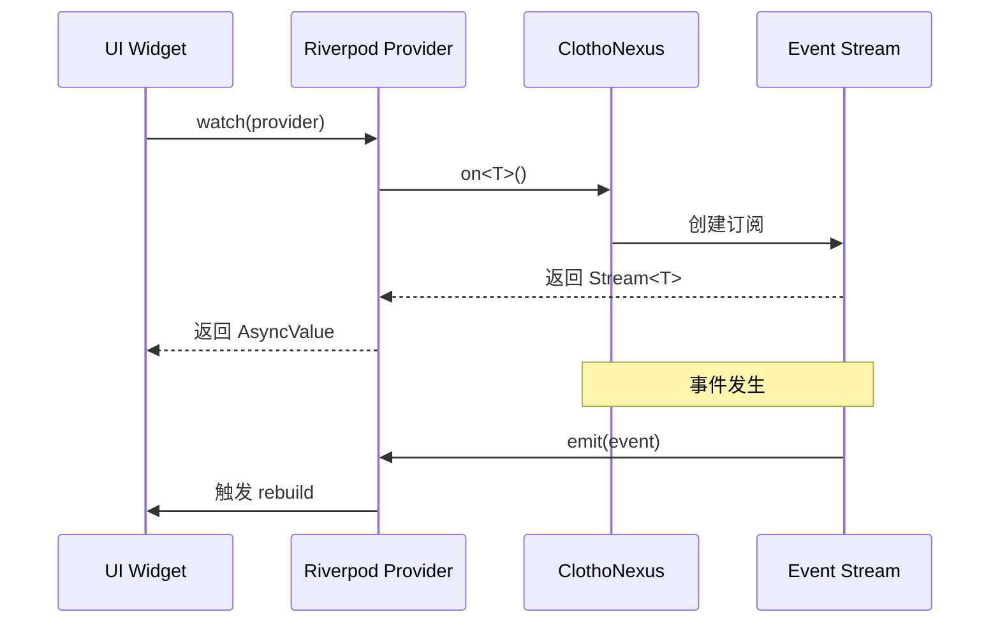

# ClothoNexus 集成 (ClothoNexus Integration)

**版本**: 1.0.0
**日期**: 2026-02-25
**状态**: Draft
**类型**: Architecture Spec
**作者**: Clotho 架构团队

---

## 1. 概述 (Overview)

ClothoNexus 是 Clotho 架构的核心事件总线，位于基础设施层（L0）。表现层通过 ClothoNexus 与核心层（Jacquard、Mnemosyne）进行解耦通信。本规范定义表现层如何集成和使用 ClothoNexus。

### 1.1 核心设计原则

| 原则 | 说明 |
| :--- | :--- |
| **解耦通信** | UI 层不直接依赖核心层，通过事件总线通信 |
| **类型安全** | 所有事件都继承自 `ClothoEvent` 基类 |
| **异步处理** | 基于 Stream 的异步事件流 |
| **单向传播** | 事件从发布者流向订阅者，无反向依赖 |
| **生命周期管理** | 订阅在组件销毁时自动清理 |

---

## 2. 事件总线架构 (Event Bus Architecture)

### 2.1 架构概览

ClothoNexus 采用发布-订阅（Publish-Subscribe）模式，连接表现层与核心层。



### 2.2 ClothoNexus 接口

```dart
/// ClothoNexus 核心接口
abstract class IClothoNexus {
  /// 发布一个事件
  void publish(ClothoEvent event);

  /// 订阅特定类型的事件流
  Stream<T> on<T extends ClothoEvent>();
  
  /// 订阅所有事件（用于日志或调试）
  Stream<ClothoEvent> get allEvents;
  
  /// 获取事件流控制器（用于测试）
  StreamController<ClothoEvent>? get controller;
}

/// ClothoNexus 实现
@singleton
class ClothoNexusImpl implements IClothoNexus {
  final StreamController<ClothoEvent> _controller = StreamController.broadcast();
  
  @override
  void publish(ClothoEvent event) {
    if (!_controller.isClosed) {
      _controller.add(event);
    }
  }

  @override
  Stream<T> on<T extends ClothoEvent>() {
    return _controller.stream.where((e) => e is T).cast<T>();
  }

  @override
  Stream<ClothoEvent> get allEvents => _controller.stream;
  
  @override
  StreamController<ClothoEvent>? get controller => _controller;
  
  void dispose() {
    _controller.close();
  }
}
```

---

## 3. ClothoNexus 事件模型 (Event Model)

### 3.1 基础事件类

所有事件必须继承自 `ClothoEvent` 基类。

```dart
/// Clotho 事件基类
abstract class ClothoEvent {
  final String id;
  final int timestamp;
  final Map<String, dynamic>? metadata;

  ClothoEvent({this.metadata}) 
      : id = const Uuid().v4(), 
        timestamp = DateTime.now().millisecondsSinceEpoch;

  @override
  String toString() {
    return '$runtimeType(id: $id, timestamp: $timestamp)';
  }
}
```

### 3.2 表现层事件定义

表现层定义的事件分为三类：UI 事件、导航事件、业务事件。

```dart
// ==================== UI 事件 ====================

/// UI 事件基类
abstract class UIEvent extends ClothoEvent {
  final String widgetId;
  
  UIEvent({
    required this.widgetId,
    super.metadata,
  });
}

/// 按钮点击事件
class ButtonClickEvent extends UIEvent {
  final String buttonId;
  final Map<String, dynamic>? data;
  
  ButtonClickEvent({
    required String widgetId,
    required this.buttonId,
    this.data,
    super.metadata,
  }) : super(widgetId: widgetId);
}

/// 输入框事件
class InputEvent extends UIEvent {
  final String inputId;
  final String value;
  
  InputEvent({
    required String widgetId,
    required this.inputId,
    required this.value,
    super.metadata,
  }) : super(widgetId: widgetId);
}

/// 选择事件
class SelectionEvent extends UIEvent {
  final String selectId;
  final String selectedValue;
  
  SelectionEvent({
    required String widgetId,
    required this.selectId,
    required this.selectedValue,
    super.metadata,
  }) : super(widgetId: widgetId);
}

// ==================== 导航事件 ====================

/// 导航事件基类
abstract class NavigationEvent extends ClothoEvent {
  final String route;
  final Map<String, dynamic>? params;
  
  NavigationEvent({
    required this.route,
    this.params,
    super.metadata,
  });
}

/// 推送导航事件
class PushNavigationEvent extends NavigationEvent {
  PushNavigationEvent({
    required String route,
    Map<String, dynamic>? params,
    super.metadata,
  }) : super(route: route, params: params);
}

/// 替换导航事件
class ReplaceNavigationEvent extends NavigationEvent {
  ReplaceNavigationEvent({
    required String route,
    Map<String, dynamic>? params,
    super.metadata,
  }) : super(route: route, params: params);
}

/// 返回导航事件
class PopNavigationEvent extends NavigationEvent {
  final dynamic result;
  
  PopNavigationEvent({
    this.result,
    super.metadata,
  }) : super(route: '');
}

// ==================== 业务事件 ====================

/// 业务事件基类
abstract class BusinessEvent extends ClothoEvent {
  final String sessionId;
  
  BusinessEvent({
    required this.sessionId,
    super.metadata,
  });
}

/// 消息发送事件
class SendMessageEvent extends BusinessEvent {
  final String content;
  final Map<String, dynamic>? options;
  
  SendMessageEvent({
    required String sessionId,
    required this.content,
    this.options,
    super.metadata,
  }) : super(sessionId: sessionId);
}

/// 消息编辑事件
class EditMessageEvent extends BusinessEvent {
  final String messageId;
  final String newContent;
  
  EditMessageEvent({
    required String sessionId,
    required this.messageId,
    required this.newContent,
    super.metadata,
  }) : super(sessionId: sessionId);
}

/// 消息删除事件
class DeleteMessageEvent extends BusinessEvent {
  final String messageId;
  
  DeleteMessageEvent({
    required String sessionId,
    required this.messageId,
    super.metadata,
  }) : super(sessionId: sessionId);
}

/// 消息重新生成事件
class RegenerateMessageEvent extends BusinessEvent {
  final String messageId;
  
  RegenerateMessageEvent({
    required String sessionId,
    required this.messageId,
    super.metadata,
  }) : super(sessionId: sessionId);
}

/// 变量变更事件
class VariableChangeEvent extends BusinessEvent {
  final String path;
  final dynamic oldValue;
  final dynamic newValue;
  
  VariableChangeEvent({
    required String sessionId,
    required this.path,
    required this.oldValue,
    required this.newValue,
    super.metadata,
  }) : super(sessionId: sessionId);
}

/// 状态快照事件
class StateSnapshotEvent extends BusinessEvent {
  final Punchcards snapshot;
  
  StateSnapshotEvent({
    required String sessionId,
    required this.snapshot,
    super.metadata,
  }) : super(sessionId: sessionId);
}

// ==================== 用户意图事件 ====================

/// 用户意图事件（由 InputDraftController 转化）
class UserIntentEvent extends ClothoEvent {
  final UserIntent intent;
  
  UserIntentEvent({
    required this.intent,
    super.metadata,
  });
}

/// 用户意图定义
enum IntentType {
  sendMessage,
  editMessage,
  deleteMessage,
  regenerateMessage,
  navigateTo,
  toggleInspector,
  changeVariable,
}

class UserIntent {
  final String id;
  final IntentType type;
  final Map<String, dynamic> payload;
  final DateTime timestamp;
  
  UserIntent({
    required this.type,
    required this.payload,
  })  : id = const Uuid().v4(),
        timestamp = DateTime.now();
}
```

---

## 4. 表现层事件适配器 (Event Adapter)

### 4.1 Riverpod Provider 桥接

表现层通过 Riverpod Provider 将 ClothoNexus 事件流暴露给 UI。

```dart
// providers/nexus_providers.dart

/// ClothoNexus Provider
final nexusProvider = Provider<IClothoNexus>((ref) {
  return GetIt.I<IClothoNexus>();
});

/// UI 事件流 Provider
final uiEventProvider = StreamProvider<UIEvent>((ref) {
  final nexus = ref.watch(nexusProvider);
  return nexus.on<UIEvent>();
});

/// 导航事件流 Provider
final navigationEventProvider = StreamProvider<NavigationEvent>((ref) {
  final nexus = ref.watch(nexusProvider);
  return nexus.on<NavigationEvent>();
});

/// 业务事件流 Provider
final businessEventProvider = StreamProvider<BusinessEvent>((ref) {
  final nexus = ref.watch(nexusProvider);
  return nexus.on<BusinessEvent>();
});

/// 消息事件流 Provider
final messageEventProvider = StreamProvider<MessageEvent>((ref) {
  final nexus = ref.watch(nexusProvider);
  return nexus.on<MessageEvent>();
});

/// 变量变更事件流 Provider
final variableChangeEventProvider = StreamProvider<VariableChangeEvent>((ref) {
  final nexus = ref.watch(nexusProvider);
  return nexus.on<VariableChangeEvent>();
});

/// 状态快照事件流 Provider
final stateSnapshotEventProvider = StreamProvider<StateSnapshotEvent>((ref) {
  final nexus = ref.watch(nexusProvider);
  return nexus.on<StateSnapshotEvent>();
});

/// 错误事件流 Provider（带状态管理）
final errorEventProvider = StateNotifierProvider<ErrorEventNotifier, List<ErrorEvent>>((ref) {
  final nexus = ref.watch(nexusProvider);
  final notifier = ErrorEventNotifier();
  
  final subscription = nexus.on<ErrorEvent>().listen(notifier.add);
  
  ref.onDispose(() {
    subscription.cancel();
  });
  
  return notifier;
});

class ErrorEventNotifier extends StateNotifier<List<ErrorEvent>> {
  ErrorEventNotifier() : super([]);
  
  void add(ErrorEvent event) {
    state = [...state, event];
  }
  
  void dismiss(int index) {
    state = [...state]..removeAt(index);
  }
  
  void clear() {
    state = [];
  }
}
```

### 4.2 事件发布辅助函数

```dart
// helpers/nexus_helpers.dart

/// 发布 UI 事件
void publishUIEvent(WidgetRef ref, UIEvent event) {
  final nexus = ref.read(nexusProvider);
  nexus.publish(event);
}

/// 发布按钮点击事件
void publishButtonClick(
  WidgetRef ref, {
  required String widgetId,
  required String buttonId,
  Map<String, dynamic>? data,
}) {
  final event = ButtonClickEvent(
    widgetId: widgetId,
    buttonId: buttonId,
    data: data,
  );
  publishUIEvent(ref, event);
}

/// 发布输入事件
void publishInput(
  WidgetRef ref, {
  required String widgetId,
  required String inputId,
  required String value,
}) {
  final event = InputEvent(
    widgetId: widgetId,
    inputId: inputId,
    value: value,
  );
  publishUIEvent(ref, event);
}

/// 发布导航事件
void publishNavigation(
  WidgetRef ref, {
  required String route,
  Map<String, dynamic>? params,
}) {
  final nexus = ref.read(nexusProvider);
  final event = PushNavigationEvent(
    route: route,
    params: params,
  );
  nexus.publish(event);
}

/// 发布业务事件
void publishBusinessEvent(WidgetRef ref, BusinessEvent event) {
  final nexus = ref.read(nexusProvider);
  nexus.publish(event);
}

/// 发布发送消息事件
void publishSendMessage(
  WidgetRef ref, {
  required String sessionId,
  required String content,
  Map<String, dynamic>? options,
}) {
  final event = SendMessageEvent(
    sessionId: sessionId,
    content: content,
    options: options,
  );
  publishBusinessEvent(ref, event);
}

/// 发布编辑消息事件
void publishEditMessage(
  WidgetRef ref, {
  required String sessionId,
  required String messageId,
  required String newContent,
}) {
  final event = EditMessageEvent(
    sessionId: sessionId,
    messageId: messageId,
    newContent: newContent,
  );
  publishBusinessEvent(ref, event);
}

/// 发布删除消息事件
void publishDeleteMessage(
  WidgetRef ref, {
  required String sessionId,
  required String messageId,
}) {
  final event = DeleteMessageEvent(
    sessionId: sessionId,
    messageId: messageId,
  );
  publishBusinessEvent(ref, event);
}

/// 发布变量变更事件
void publishVariableChange(
  WidgetRef ref, {
  required String sessionId,
  required String path,
  required dynamic oldValue,
  required dynamic newValue,
}) {
  final event = VariableChangeEvent(
    sessionId: sessionId,
    path: path,
    oldValue: oldValue,
    newValue: newValue,
  );
  publishBusinessEvent(ref, event);
}
```

---

## 5. 事件处理流程 (Event Processing Flow)

### 5.1 事件发布流程



### 5.2 事件订阅流程



### 5.3 完整的事件处理示例

```dart
// widgets/message_input.dart

class MessageInput extends ConsumerStatefulWidget {
  final String sessionId;
  
  const MessageInput({required this.sessionId});
  
  @override
  ConsumerState<MessageInput> createState() => _MessageInputState();
}

class _MessageInputState extends ConsumerState<MessageInput> {
  final TextEditingController _controller = TextEditingController();
  bool _isSending = false;
  
  void _sendMessage() {
    if (_controller.text.isEmpty || _isSending) return;
    
    setState(() {
      _isSending = true;
    });
    
    // 发布发送消息事件
    publishSendMessage(
      ref,
      sessionId: widget.sessionId,
      content: _controller.text,
    );
    
    _controller.clear();
    
    // 模拟发送完成
    Future.delayed(Duration(milliseconds: 500), () {
      if (mounted) {
        setState(() {
          _isSending = false;
        });
      }
    });
  }
  
  @override
  Widget build(BuildContext context) {
    return Container(
      padding: EdgeInsets.all(16),
      child: Row(
        children: [
          Expanded(
            child: TextField(
              controller: _controller,
              decoration: InputDecoration(
                hintText: '输入消息...',
                border: OutlineInputBorder(),
                enabled: !_isSending,
              ),
              onSubmitted: (_) => _sendMessage(),
            ),
          ),
          SizedBox(width: 16),
          ElevatedButton(
            onPressed: _isSending ? null : _sendMessage,
            child: _isSending
                ? SizedBox(
                    width: 16,
                    height: 16,
                    child: CircularProgressIndicator(strokeWidth: 2),
                  )
                : Text('发送'),
          ),
        ],
      ),
    );
  }
  
  @override
  void dispose() {
    _controller.dispose();
    super.dispose();
  }
}

// widgets/message_bubble.dart

class MessageBubble extends ConsumerWidget {
  final Message message;
  
  const MessageBubble({required this.message});
  
  @override
  Widget build(BuildContext context, WidgetRef ref) {
    return Container(
      margin: EdgeInsets.symmetric(vertical: 8),
      padding: EdgeInsets.all(12),
      decoration: BoxDecoration(
        color: message.role == 'user'
            ? Theme.of(context).colorScheme.primaryContainer
            : Theme.of(context).colorScheme.surfaceContainer,
        borderRadius: BorderRadius.circular(8),
      ),
      child: Column(
        crossAxisAlignment: CrossAxisAlignment.start,
        children: [
          Text(
            message.role == 'user' ? '用户' : 'AI',
            style: TextStyle(
              fontSize: 12,
              fontWeight: FontWeight.bold,
            ),
          ),
          SizedBox(height: 4),
          Text(message.content),
          SizedBox(height: 8),
          Row(
            children: [
              if (message.role == 'assistant')
                IconButton(
                  icon: Icon(Icons.refresh),
                  onPressed: () {
                    publishRegenerateMessage(
                      ref,
                      sessionId: message.sessionId,
                      messageId: message.id,
                    );
                  },
                  tooltip: '重新生成',
                ),
              IconButton(
                icon: Icon(Icons.edit),
                onPressed: () {
                  _showEditDialog(context, ref, message);
                },
                tooltip: '编辑',
              ),
              IconButton(
                icon: Icon(Icons.delete),
                onPressed: () {
                  publishDeleteMessage(
                    ref,
                    sessionId: message.sessionId,
                    messageId: message.id,
                  );
                },
                tooltip: '删除',
              ),
            ],
          ),
        ],
      ),
    );
  }
  
  void _showEditDialog(BuildContext context, WidgetRef ref, Message message) {
    final controller = TextEditingController(text: message.content);
    
    showDialog(
      context: context,
      builder: (context) => AlertDialog(
        title: Text('编辑消息'),
        content: TextField(
          controller: controller,
          maxLines: 5,
          decoration: InputDecoration(
            border: OutlineInputBorder(),
          ),
        ),
        actions: [
          TextButton(
            onPressed: () => Navigator.pop(context),
            child: Text('取消'),
          ),
          TextButton(
            onPressed: () {
              publishEditMessage(
                ref,
                sessionId: message.sessionId,
                messageId: message.id,
                newContent: controller.text,
              );
              Navigator.pop(context);
            },
            child: Text('保存'),
          ),
        ],
      ),
    );
  }
}
```

---

## 6. 错误处理与重试 (Error Handling & Retry)

### 6.1 错误事件处理

```dart
// widgets/error_handler.dart

class ErrorHandler extends ConsumerWidget {
  final Widget child;
  
  const ErrorHandler({required this.child});
  
  @override
  Widget build(BuildContext context, WidgetRef ref) {
    final errorEvents = ref.watch(errorEventProvider);
    
    return Stack(
      children: [
        child,
        if (errorEvents.isNotEmpty)
          Positioned(
            top: 16,
            right: 16,
            child: _ErrorNotification(
              events: errorEvents,
              onDismiss: (index) {
                ref.read(errorEventProvider.notifier).dismiss(index);
              },
              onRetry: (event) {
                _handleRetry(ref, event);
              },
            ),
          ),
      ],
    );
  }
  
  void _handleRetry(WidgetRef ref, ErrorEvent event) {
    switch (event.code) {
      case 'NETWORK_ERROR':
        // 重试网络请求
        ref.read(nexusProvider).publish(RetryEvent(
          originalEvent: event.metadata?['originalEvent'],
        ));
        break;
      case 'GENERATION_FAILED':
        // 重试生成
        ref.read(nexusProvider).publish(RegenerateMessageEvent(
          sessionId: event.metadata?['sessionId'],
          messageId: event.metadata?['messageId'],
        ));
        break;
      default:
        // 其他错误不支持重试
        break;
    }
  }
}

class _ErrorNotification extends StatelessWidget {
  final List<ErrorEvent> events;
  final Function(int) onDismiss;
  final Function(ErrorEvent) onRetry;
  
  const _ErrorNotification({
    required this.events,
    required this.onDismiss,
    required this.onRetry,
  });
  
  @override
  Widget build(BuildContext context) {
    return Column(
      crossAxisAlignment: CrossAxisAlignment.end,
      children: events.map((event) {
        final canRetry = event.code == 'NETWORK_ERROR' || 
                         event.code == 'GENERATION_FAILED';
        
        return Card(
          margin: EdgeInsets.only(bottom: 8),
          color: _getSeverityColor(context, event.severity),
          child: Padding(
            padding: EdgeInsets.all(12),
            child: Row(
              children: [
                Icon(_getSeverityIcon(event.severity)),
                SizedBox(width: 8),
                Expanded(
                  child: Column(
                    crossAxisAlignment: CrossAxisAlignment.start,
                    children: [
                      Text(
                        event.code,
                        style: TextStyle(
                          fontWeight: FontWeight.bold,
                          fontSize: 12,
                        ),
                      ),
                      Text(event.message),
                    ],
                  ),
                ),
                if (canRetry)
                  TextButton(
                    onPressed: () => onRetry(event),
                    child: Text('重试'),
                  ),
                IconButton(
                  icon: Icon(Icons.close),
                  onPressed: () => onDismiss(events.indexOf(event)),
                ),
              ],
            ),
          ),
        );
      }).toList(),
    );
  }
  
  Color _getSeverityColor(BuildContext context, ErrorSeverity severity) {
    switch (severity) {
      case ErrorSeverity.info:
        return Theme.of(context).colorScheme.primaryContainer;
      case ErrorSeverity.warning:
        return Theme.of(context).colorScheme.tertiaryContainer;
      case ErrorSeverity.error:
        return Theme.of(context).colorScheme.errorContainer;
      case ErrorSeverity.critical:
        return Colors.red.shade900;
    }
  }
  
  IconData _getSeverityIcon(ErrorSeverity severity) {
    switch (severity) {
      case ErrorSeverity.info:
        return Icons.info;
      case ErrorSeverity.warning:
        return Icons.warning;
      case ErrorSeverity.error:
        return Icons.error;
      case ErrorSeverity.critical:
        return Icons.dangerous;
    }
  }
}
```

### 6.2 重试机制

```dart
// models/retry_event.dart

/// 重试事件
class RetryEvent extends ClothoEvent {
  final ClothoEvent? originalEvent;
  
  RetryEvent({
    this.originalEvent,
    super.metadata,
  });
}

// helpers/retry_helper.dart

class RetryHelper {
  /// 自动重试（带指数退避）
  static Future<void> autoRetry<T>(
    Future<T> Function() operation, {
    int maxRetries = 3,
    Duration initialDelay = const Duration(seconds: 1),
    Function(int)? onRetry,
  }) async {
    int attempt = 0;
    Duration delay = initialDelay;
    
    while (attempt < maxRetries) {
      try {
        return await operation();
      } catch (e) {
        attempt++;
        if (attempt >= maxRetries) rethrow;
        
        onRetry?.call(attempt);
        await Future.delayed(delay);
        delay = delay * 2; // 指数退避
      }
    }
    
    throw StateError('Max retries exceeded');
  }
}

// 使用示例
class MessageGenerator {
  final IClothoNexus _nexus;
  
  MessageGenerator(this._nexus);
  
  Future<void> generateMessage(String sessionId, String prompt) async {
    await RetryHelper.autoRetry(
      () => _doGenerate(sessionId, prompt),
      maxRetries: 3,
      onRetry: (attempt) {
        _nexus.publish(ErrorEvent(
          code: 'GENERATION_RETRY',
          message: '生成失败，正在重试 ($attempt/3)',
          severity: ErrorSeverity.warning,
          metadata: {'attempt': attempt},
        ));
      },
    );
  }
  
  Future<void> _doGenerate(String sessionId, String prompt) async {
    // 实际生成逻辑
    throw UnimplementedError();
  }
}
```

---

## 7. 代码示例 (Code Examples)

### 7.1 完整的事件处理示例

```dart
class CompleteEventHandlingExample extends ConsumerWidget {
  @override
  Widget build(BuildContext context, WidgetRef ref) {
    return ErrorHandler(
      child: Scaffold(
        appBar: AppBar(
          title: Text('ClothoNexus 集成示例'),
        ),
        body: Column(
          children: [
            // 消息列表
            Expanded(
              child: MessageList(),
            ),
            // 输入区域
            MessageInput(sessionId: 'session_001'),
          ],
        ),
      ),
    );
  }
}

class MessageList extends ConsumerWidget {
  @override
  Widget build(BuildContext context, WidgetRef ref) {
    final messages = ref.watch(messageListProvider);
    
    return ListView.builder(
      itemCount: messages.length,
      itemBuilder: (context, index) {
        return MessageBubble(message: messages[index]);
      },
    );
  }
}
```

### 7.2 导航事件处理示例

```dart
class NavigationHandler extends ConsumerStatefulWidget {
  @override
  ConsumerState<NavigationHandler> createState() => _NavigationHandlerState();
}

class _NavigationHandlerState extends ConsumerState<NavigationHandler> {
  final GlobalKey<NavigatorState> _navigatorKey = GlobalKey();
  
  @override
  void initState() {
    super.initState();
    
    // 监听导航事件
    ref.listen(navigationEventProvider, (previous, next) {
      next.value?.when(
        data: (event) {
          _handleNavigationEvent(event);
        },
        loading: () {},
        error: (error, stack) {},
      );
    });
  }
  
  void _handleNavigationEvent(NavigationEvent event) {
    if (event is PushNavigationEvent) {
      _navigatorKey.currentState?.pushNamed(
        event.route,
        arguments: event.params,
      );
    } else if (event is ReplaceNavigationEvent) {
      _navigatorKey.currentState?.pushReplacementNamed(
        event.route,
        arguments: event.params,
      );
    } else if (event is PopNavigationEvent) {
      _navigatorKey.currentState?.pop(event.result);
    }
  }
  
  @override
  Widget build(BuildContext context) {
    return Navigator(
      key: _navigatorKey,
      onGenerateRoute: (settings) {
        return MaterialPageRoute(
          builder: (context) => _buildRoute(settings.name),
        );
      },
    );
  }
  
  Widget _buildRoute(String? routeName) {
    switch (routeName) {
      case '/home':
        return HomeScreen();
      case '/settings':
        return SettingsScreen();
      case '/inspector':
        return InspectorScreen();
      default:
        return HomeScreen();
    }
  }
}
```

---

## 8. 性能考虑 (Performance Considerations)

### 8.1 事件流优化

| 优化策略 | 说明 | 实现 |
| :--- | :--- | :--- |
| **事件过滤** | 只订阅需要的事件类型 | 使用 `where` 过滤 |
| **事件节流** | 限制事件处理频率 | 使用 `throttle` |
| **事件去重** | 避免重复处理相同事件 | 使用 `distinct` |
| **批量处理** | 合并多个事件一起处理 | 使用 `buffer` |

```dart
// 事件过滤示例
final filteredEvents = nexus.on<VariableChangeEvent>()
    .where((event) => event.path.startsWith('characters.'));

// 事件节流示例
final throttledEvents = nexus.on<VariableChangeEvent>()
    .throttleTime(Duration(milliseconds: 100));

// 事件去重示例
final distinctEvents = nexus.on<VariableChangeEvent>()
    .distinct((prev, next) => prev.path == next.path);

// 批量处理示例
final batchedEvents = nexus.on<VariableChangeEvent>()
    .bufferTime(Duration(milliseconds: 50))
    .where((batch) => batch.isNotEmpty);
```

### 8.2 订阅管理

及时清理不再使用的订阅，避免内存泄漏。

```dart
class SubscriptionManager {
  final List<StreamSubscription> _subscriptions = [];
  
  void add<T>(Stream<T> stream, void Function(T) onData) {
    final subscription = stream.listen(onData);
    _subscriptions.add(subscription);
  }
  
  void dispose() {
    for (final subscription in _subscriptions) {
      subscription.cancel();
    }
    _subscriptions.clear();
  }
}

// 在 StatefulWidget 中使用
class MyWidget extends ConsumerStatefulWidget {
  @override
  ConsumerState<MyWidget> createState() => _MyWidgetState();
}

class _MyWidgetState extends ConsumerState<MyWidget> {
  late final SubscriptionManager _subscriptionManager;
  
  @override
  void initState() {
    super.initState();
    _subscriptionManager = SubscriptionManager();
    
    final nexus = ref.read(nexusProvider);
    _subscriptionManager.add(
      nexus.on<MessageEvent>(),
      (event) => _handleMessageEvent(event),
    );
  }
  
  @override
  void dispose() {
    _subscriptionManager.dispose();
    super.dispose();
  }
  
  @override
  Widget build(BuildContext context) {
    return Container();
  }
}
```

---

## 9. 安全考虑 (Security Considerations)

### 9.1 事件验证

所有发布的事件必须经过验证。

```dart
class EventValidator {
  /// 验证消息内容
  static bool validateMessageContent(String content) {
    if (content.isEmpty) return false;
    if (content.length > 10000) return false;
    // 检查恶意内容
    if (content.contains('<script>')) return false;
    return true;
  }
  
  /// 验证路径
  static bool validatePath(String path) {
    if (path.isEmpty) return false;
    if (!RegExp(r'^[a-zA-Z0-9_.]+$').hasMatch(path)) return false;
    // 检查路径遍历攻击
    if (path.contains('..')) return false;
    return true;
  }
  
  /// 验证导航路由
  static bool validateRoute(String route) {
    final allowedRoutes = ['/home', '/settings', '/inspector'];
    return allowedRoutes.contains(route);
  }
}

// 在发布事件前验证
void safePublishSendMessage(
  WidgetRef ref, {
  required String sessionId,
  required String content,
}) {
  if (!EventValidator.validateMessageContent(content)) {
    ref.read(nexusProvider).publish(ErrorEvent(
      code: 'INVALID_MESSAGE',
      message: '消息内容无效',
      severity: ErrorSeverity.warning,
    ));
    return;
  }
  
  publishSendMessage(ref, sessionId: sessionId, content: content);
}
```

### 9.2 权限控制

UI 层只能发布特定类型的事件。

```dart
class EventPermissionChecker {
  static final Map<Type, bool> _allowedEvents = {
    ButtonClickEvent: true,
    InputEvent: true,
    SelectionEvent: true,
    SendMessageEvent: true,
    EditMessageEvent: true,
    DeleteMessageEvent: true,
    RegenerateMessageEvent: true,
    NavigationEvent: true,
  };
  
  static bool isAllowed(ClothoEvent event) {
    return _allowedEvents[event.runtimeType] ?? false;
  }
}

// 在 ClothoNexus 中检查权限
@override
void publish(ClothoEvent event) {
  if (!EventPermissionChecker.isAllowed(event)) {
    // 记录非法事件
    print('[Nexus] Unauthorized event: ${event.runtimeType}');
    return;
  }
  
  if (!_controller.isClosed) {
    _controller.add(event);
  }
}
```

---

## 10. 测试策略 (Testing Strategy)

### 10.1 单元测试

```dart
void main() {
  group('ClothoNexus 集成', () {
    late IClothoNexus nexus;
    
    setUp(() {
      nexus = ClothoNexusImpl();
    });
    
    tearDown(() {
      nexus.dispose();
    });
    
    test('发布和订阅事件', () async {
      final events = <ButtonClickEvent>[];
      final subscription = nexus.on<ButtonClickEvent>().listen(events.add);
      
      final event = ButtonClickEvent(
        widgetId: 'test_widget',
        buttonId: 'test_button',
      );
      
      nexus.publish(event);
      
      await Future.delayed(Duration.zero);
      
      expect(events.length, 1);
      expect(events.first.widgetId, 'test_widget');
      expect(events.first.buttonId, 'test_button');
      
      subscription.cancel();
    });
    
    test('过滤事件类型', () async {
      final uiEvents = <UIEvent>[];
      final navEvents = <NavigationEvent>[];
      
      nexus.on<UIEvent>().listen(uiEvents.add);
      nexus.on<NavigationEvent>().listen(navEvents.add);
      
      nexus.publish(ButtonClickEvent(
        widgetId: 'test',
        buttonId: 'button',
      ));
      
      nexus.publish(PushNavigationEvent(route: '/home'));
      
      await Future.delayed(Duration.zero);
      
      expect(uiEvents.length, 1);
      expect(navEvents.length, 1);
    });
  });
}
```

### 10.2 Widget 测试

```dart
void main() {
  testWidgets('消息输入 - 发送按钮点击', (tester) async {
    await tester.pumpWidget(
      ProviderScope(
        overrides: [
          nexusProvider.overrideWithValue(MockClothoNexus()),
        ],
        child: MaterialApp(
          home: Scaffold(
            body: MessageInput(sessionId: 'test_session'),
          ),
        ),
      ),
    );
    
    // 输入消息
    await tester.enterText(find.byType(TextField), 'Hello');
    
    // 点击发送按钮
    await tester.tap(find.byType(ElevatedButton));
    
    // 验证输入框已清空
    expect(find.text('Hello'), findsNothing);
  });
}
```

---

## 11. 关联文档 (Related Documents)

- [`../infrastructure/clotho-nexus-events.md`](../infrastructure/clotho-nexus-events.md) - ClothoNexus 事件总线
- [`state-sync-events.md`](./state-sync-events.md) - 状态同步与事件流
- [`README.md`](./README.md) - 表现层总览
- [`../mnemosyne/README.md`](../mnemosyne/README.md) - Mnemosyne 数据引擎
- [`../jacquard/README.md`](../jacquard/README.md) - Jacquard 编排层

---

**最后更新**: 2026-02-25  
**文档状态**: 草案，待架构评审委员会审议
