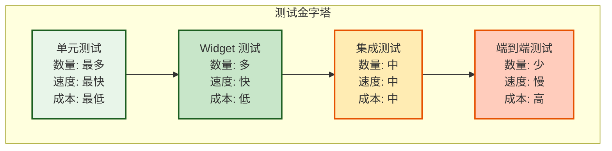

# 组件测试策略 (Component Testing)

**版本**: 1.0.0
**日期**: 2026-02-26
**状态**: Draft
**类型**: Implementation Guide
**作者**: Clotho 架构团队

---

## 1. 概述 (Overview)

本规范定义了 Clotho 表现层的组件测试策略，涵盖单元测试、Widget 测试和集成测试的完整测试体系。测试策略遵循 Flutter 最佳实践，确保 UI 组件的质量、稳定性和可维护性。

### 1.1 核心测试原则

| 原则 | 说明 |
| :--- | :--- |
| **测试金字塔** | 大量单元测试，适量 Widget 测试，少量集成测试 |
| **快速反馈** | 单元测试应在毫秒级完成，Widget 测试在秒级完成 |
| **可重复性** | 测试结果应独立于执行环境和执行顺序 |
| **可读性** | 测试代码应清晰表达意图，易于理解和维护 |
| **隔离性** | 每个测试应独立运行，不依赖其他测试的状态 |

### 1.2 测试类型概览



---

## 2. 单元测试 (Unit Testing)

单元测试针对独立的函数、类和方法进行测试，验证其行为是否符合预期。单元测试应快速、独立且不依赖外部资源。

### 2.1 测试目录结构

```text
lib/
├── models/
│   ├── message.dart
│   └── state_node.dart
├── providers/
│   └── state_providers.dart
└── widgets/
    └── ...

test/
├── unit/
│   ├── models/
│   │   ├── message_test.dart
│   │   └── state_node_test.dart
│   └── providers/
│       └── state_providers_test.dart
├── widget/
│   ├── message_bubble_test.dart
│   └── input_area_test.dart
└── integration/
    └── app_test.dart
```

### 2.2 模型单元测试

```dart
// test/unit/models/message_test.dart

import 'package:flutter_test/flutter_test.dart';
import 'package:clotho_ui_demo/models/message.dart';

void main() {
  group('Message Model', () {
    test('should create a user message', () {
      // Arrange & Act
      final message = Message(
        id: 'msg-001',
        role: MessageRole.user,
        content: 'Hello, Clotho!',
        timestamp: DateTime(2026, 2, 26, 12, 0),
      );

      // Assert
      expect(message.id, 'msg-001');
      expect(message.role, MessageRole.user);
      expect(message.content, 'Hello, Clotho!');
      expect(message.timestamp, DateTime(2026, 2, 26, 12, 0));
    });

    test('should create an assistant message', () {
      // Arrange & Act
      final message = Message(
        id: 'msg-002',
        role: MessageRole.assistant,
        content: 'I am Clotho.',
        timestamp: DateTime(2026, 2, 26, 12, 1),
      );

      // Assert
      expect(message.role, MessageRole.assistant);
    });

    test('should serialize to JSON correctly', () {
      // Arrange
      final message = Message(
        id: 'msg-003',
        role: MessageRole.system,
        content: 'System prompt',
        timestamp: DateTime(2026, 2, 26, 12, 2),
      );

      // Act
      final json = message.toJson();

      // Assert
      expect(json['id'], 'msg-003');
      expect(json['role'], 'system');
      expect(json['content'], 'System prompt');
      expect(json['timestamp'], '2026-02-26T12:02:00.000');
    });

    test('should deserialize from JSON correctly', () {
      // Arrange
      final json = {
        'id': 'msg-004',
        'role': 'user',
        'content': 'Test message',
        'timestamp': '2026-02-26T12:03:00.000',
      };

      // Act
      final message = Message.fromJson(json);

      // Assert
      expect(message.id, 'msg-004');
      expect(message.role, MessageRole.user);
      expect(message.content, 'Test message');
    });

    test('should validate required fields', () {
      // Act & Assert
      expect(
        () => Message(
          id: '', // Empty ID should throw
          role: MessageRole.user,
          content: 'Test',
          timestamp: DateTime.now(),
        ),
        throwsArgumentError,
      );
    });
  });
}
```

### 2.3 Provider 单元测试

```dart
// test/unit/providers/state_providers_test.dart

import 'package:flutter_riverpod/flutter_riverpod.dart';
import 'package:flutter_test/flutter_test.dart';
import 'package:clotho_ui_demo/providers/state_providers.dart';

void main() {
  group('State Providers', () {
    late ProviderContainer container;

    setUp(() {
      container = ProviderContainer();
    });

    tearDown(() {
      container.dispose();
    });

    test('should provide initial message list', () {
      // Act
      final messages = container.read(messageListProvider);

      // Assert
      expect(messages, isEmpty);
    });

    test('should add message to list', () {
      // Arrange
      final notifier = container.read(messageListProvider.notifier);

      // Act
      notifier.addMessage(
        Message(
          id: 'msg-001',
          role: MessageRole.user,
          content: 'Test message',
          timestamp: DateTime.now(),
        ),
      );

      // Assert
      final messages = container.read(messageListProvider);
      expect(messages.length, 1);
      expect(messages.first.content, 'Test message');
    });

    test('should remove message from list', () {
      // Arrange
      final notifier = container.read(messageListProvider.notifier);
      final message = Message(
        id: 'msg-002',
        role: MessageRole.user,
        content: 'To be removed',
        timestamp: DateTime.now(),
      );
      notifier.addMessage(message);

      // Act
      notifier.removeMessage('msg-002');

      // Assert
      final messages = container.read(messageListProvider);
      expect(messages, isEmpty);
    });

    test('should clear all messages', () {
      // Arrange
      final notifier = container.read(messageListProvider.notifier);
      notifier.addMessage(Message(
        id: 'msg-001',
        role: MessageRole.user,
        content: 'Message 1',
        timestamp: DateTime.now(),
      ));
      notifier.addMessage(Message(
        id: 'msg-002',
        role: MessageRole.user,
        content: 'Message 2',
        timestamp: DateTime.now(),
      ));

      // Act
      notifier.clearMessages();

      // Assert
      final messages = container.read(messageListProvider);
      expect(messages, isEmpty);
    });
  });
}
```

---

## 3. Widget 测试 (Widget Testing)

Widget 测试验证单个 Widget 的渲染和行为，包括用户交互、状态变化和布局。Widget 测试运行在模拟的 Flutter 环境中，比集成测试更快。

### 3.1 基础 Widget 测试

```dart
// test/widget/message_bubble_test.dart

import 'package:flutter/material.dart';
import 'package:flutter_test/flutter_test.dart';
import 'package:clotho_ui_demo/models/message.dart';
import 'package:clotho_ui_demo/widgets/stage/message_bubble.dart';

void main() {
  group('MessageBubble Widget', () {
    testWidgets('should display user message correctly', (tester) async {
      // Arrange
      final message = Message(
        id: 'msg-001',
        role: MessageRole.user,
        content: 'Hello, World!',
        timestamp: DateTime(2026, 2, 26, 12, 0),
      );

      // Act
      await tester.pumpWidget(
        MaterialApp(
          home: Scaffold(
            body: MessageBubble(message: message),
          ),
        ),
      );

      // Assert
      expect(find.text('Hello, World!'), findsOneWidget);
      expect(find.byType(MessageBubble), findsOneWidget);
    });

    testWidgets('should display assistant message correctly', (tester) async {
      // Arrange
      final message = Message(
        id: 'msg-002',
        role: MessageRole.assistant,
        content: 'I am Clotho.',
        timestamp: DateTime(2026, 2, 26, 12, 1),
      );

      // Act
      await tester.pumpWidget(
        MaterialApp(
          home: Scaffold(
            body: MessageBubble(message: message),
          ),
        ),
      );

      // Assert
      expect(find.text('I am Clotho.'), findsOneWidget);
    });

    testWidgets('should display timestamp', (tester) async {
      // Arrange
      final message = Message(
        id: 'msg-003',
        role: MessageRole.user,
        content: 'Test',
        timestamp: DateTime(2026, 2, 26, 12, 0),
      );

      // Act
      await tester.pumpWidget(
        MaterialApp(
          home: Scaffold(
            body: MessageBubble(message: message),
          ),
        ),
      );

      // Assert
      expect(find.textContaining('12:00'), findsOneWidget);
    });

    testWidgets('should handle long messages', (tester) async {
      // Arrange
      final longContent = 'A' * 1000;
      final message = Message(
        id: 'msg-004',
        role: MessageRole.user,
        content: longContent,
        timestamp: DateTime.now(),
      );

      // Act
      await tester.pumpWidget(
        MaterialApp(
          home: Scaffold(
            body: MessageBubble(message: message),
          ),
        ),
      );

      // Assert
      expect(find.text(longContent), findsOneWidget);
    });
  });
}
```

### 3.2 交互测试

```dart
// test/widget/input_area_test.dart

import 'package:flutter/material.dart';
import 'package:flutter_riverpod/flutter_riverpod.dart';
import 'package:flutter_test/flutter_test.dart';
import 'package:clotho_ui_demo/widgets/stage/input_area.dart';

void main() {
  group('InputArea Widget', () {
    testWidgets('should update text field on input', (tester) async {
      // Arrange
      await tester.pumpWidget(
        ProviderScope(
          child: MaterialApp(
            home: Scaffold(
              body: InputArea(),
            ),
          ),
        ),
      );

      // Act
      await tester.enterText(find.byType(TextField), 'Hello, Clotho!');
      await tester.pump();

      // Assert
      expect(find.text('Hello, Clotho!'), findsOneWidget);
    });

    testWidgets('should send message on button press', (tester) async {
      // Arrange
      await tester.pumpWidget(
        ProviderScope(
          child: MaterialApp(
            home: Scaffold(
              body: InputArea(),
            ),
          ),
        ),
      );

      // Act
      await tester.enterText(find.byType(TextField), 'Test message');
      await tester.pump();
      await tester.tap(find.byType(IconButton));
      await tester.pump();

      // Assert
      expect(find.text(''), findsOneWidget); // Text field should be cleared
    });

    testWidgets('should disable send button when empty', (tester) async {
      // Arrange
      await tester.pumpWidget(
        ProviderScope(
          child: MaterialApp(
            home: Scaffold(
              body: InputArea(),
            ),
          ),
        ),
      );

      // Act & Assert
      final button = tester.widget<IconButton>(find.byType(IconButton));
      expect(button.onPressed, isNull); // Should be disabled
    });

    testWidgets('should enable send button with text', (tester) async {
      // Arrange
      await tester.pumpWidget(
        ProviderScope(
          child: MaterialApp(
            home: Scaffold(
              body: InputArea(),
            ),
          ),
        ),
      );

      // Act
      await tester.enterText(find.byType(TextField), 'Test');
      await tester.pump();

      // Assert
      final button = tester.widget<IconButton>(find.byType(IconButton));
      expect(button.onPressed, isNotNull); // Should be enabled
    });
  });
}
```

### 3.3 状态测试

```dart
// test/widget/state_tree_viewer_test.dart

import 'package:flutter/material.dart';
import 'package:flutter_test/flutter_test.dart';
import 'package:clotho_ui_demo/models/state_node.dart';
import 'package:clotho_ui_demo/widgets/inspector/state_tree_viewer.dart';

void main() {
  group('StateTreeViewer Widget', () {
    testWidgets('should display state tree', (tester) async {
      // Arrange
      final root = StateNode(
        key: 'root',
        value: {
          'character': {
            'name': 'Alice',
            'hp': 100,
          },
          'world': {
            'time': 'day',
          },
        },
      );

      // Act
      await tester.pumpWidget(
        MaterialApp(
          home: Scaffold(
            body: StateTreeViewer(root: root),
          ),
        ),
      );

      // Assert
      expect(find.text('root'), findsOneWidget);
      expect(find.text('character'), findsOneWidget);
      expect(find.text('world'), findsOneWidget);
    });

    testWidgets('should expand node on tap', (tester) async {
      // Arrange
      final root = StateNode(
        key: 'root',
        value: {'nested': {'deep': 'value'}},
      );

      await tester.pumpWidget(
        MaterialApp(
          home: Scaffold(
            body: StateTreeViewer(root: root),
          ),
        ),
      );

      // Act
      await tester.tap(find.text('root'));
      await tester.pump();

      // Assert
      expect(find.text('nested'), findsOneWidget);
    });
  });
}
```

---

## 4. 集成测试 (Integration Testing)

集成测试验证多个组件协同工作的行为，模拟真实用户场景。集成测试运行在实际的 Flutter 引擎上，可以测试完整的应用流程。

### 4.1 应用启动测试

```dart
// test/integration/app_test.dart

import 'package:flutter/material.dart';
import 'package:flutter_test/flutter_test.dart';
import 'package:clotho_ui_demo/main.dart';

void main() {
  group('App Integration Tests', () {
    testWidgets('app should launch and display home screen', (tester) async {
      // Act
      await tester.pumpWidget(const ClothoApp());
      await tester.pumpAndSettle();

      // Assert
      expect(find.text('Clotho'), findsOneWidget);
      expect(find.byType(HomeScreen), findsOneWidget);
    });

    testWidgets('should navigate between screens', (tester) async {
      // Arrange
      await tester.pumpWidget(const ClothoApp());
      await tester.pumpAndSettle();

      // Act - Tap navigation item
      await tester.tap(find.byIcon(Icons.settings));
      await tester.pumpAndSettle();

      // Assert
      expect(find.text('Settings'), findsOneWidget);
    });

    testWidgets('should send and display message', (tester) async {
      // Arrange
      await tester.pumpWidget(const ClothoApp());
      await tester.pumpAndSettle();

      // Act
      await tester.enterText(find.byType(TextField), 'Hello, Clotho!');
      await tester.pump();
      await tester.tap(find.byIcon(Icons.send));
      await tester.pumpAndSettle();

      // Assert
      expect(find.text('Hello, Clotho!'), findsOneWidget);
    });
  });
}
```

### 4.2 完整流程测试

```dart
// test/integration/message_flow_test.dart

import 'package:flutter/material.dart';
import 'package:flutter_test/flutter_test.dart';
import 'package:clotho_ui_demo/main.dart';

void main() {
  group('Message Flow Integration Tests', () {
    testWidgets('should handle complete conversation flow', (tester) async {
      // Arrange
      await tester.pumpWidget(const ClothoApp());
      await tester.pumpAndSettle();

      // Act 1: Send user message
      await tester.enterText(find.byType(TextField), 'Tell me a story');
      await tester.pump();
      await tester.tap(find.byIcon(Icons.send));
      await tester.pumpAndSettle();

      // Assert 1
      expect(find.text('Tell me a story'), findsOneWidget);

      // Act 2: Verify assistant response (mocked)
      // In real test, this would wait for actual response
      await tester.pump(const Duration(seconds: 1));

      // Act 3: Send another message
      await tester.enterText(find.byType(TextField), 'Continue');
      await tester.pump();
      await tester.tap(find.byIcon(Icons.send));
      await tester.pumpAndSettle();

      // Assert 2
      expect(find.text('Continue'), findsOneWidget);
    });

    testWidgets('should handle error states', (tester) async {
      // Arrange
      await tester.pumpWidget(const ClothoApp());
      await tester.pumpAndSettle();

      // Act - Simulate network error
      // This would require mocking the API client
      await tester.enterText(find.byType(TextField), 'Test error');
      await tester.pump();
      await tester.tap(find.byIcon(Icons.send));
      await tester.pumpAndSettle();

      // Assert - Error message should be displayed
      // expect(find.text('Network error'), findsOneWidget);
    });
  });
}
```

---

## 5. 测试覆盖率 (Test Coverage)

### 5.1 覆盖率目标

| 层级 | 目标覆盖率 | 说明 |
| :--- | :--- | :--- |
| **模型层** | 100% | 所有数据模型应有完整测试 |
| **Provider 层** | 90%+ | 状态管理逻辑应有高覆盖率 |
| **Widget 层** | 80%+ | 主要 UI 组件应有测试 |
| **集成测试** | 关键流程 | 覆盖主要用户流程 |

### 5.2 生成覆盖率报告

```bash
# 运行测试并生成覆盖率报告
flutter test --coverage

# 生成 HTML 报告（需要 lcov）
genhtml coverage/lcov.info -o coverage/html

# 在浏览器中打开报告
open coverage/html/index.html
```

### 5.3 覆盖率配置

在 `pubspec.yaml` 中添加覆盖率配置：

```yaml
dev_dependencies:
  flutter_test:
    sdk: flutter
  flutter_lints: ^3.0.1
  test: ^1.24.0
  coverage: ^1.6.3
```

---

## 6. Mock 与 Stub (Mocking & Stubbing)

### 6.1 使用 mockito

```dart
// test/unit/services/mnemosyne_service_test.dart

import 'package:flutter_test/flutter_test.dart';
import 'package:mockito/annotations.dart';
import 'package:mockito/mockito.dart';
import 'package:clotho_ui_demo/services/mnemosyne_service.dart';

@GenerateMocks([MnemosyneService])
import 'mnemosyne_service_test.mocks.dart';

void main() {
  group('MnemosyneService Tests', () {
    late MockMnemosyneService mockService;

    setUp(() {
      mockService = MockMnemosyneService();
    });

    test('should return state snapshot', () async {
      // Arrange
      when(mockService.getStateSnapshot())
          .thenAnswer((_) async => {'key': 'value'});

      // Act
      final snapshot = await mockService.getStateSnapshot();

      // Assert
      expect(snapshot, {'key': 'value'});
      verify(mockService.getStateSnapshot()).called(1);
    });

    test('should handle errors', () async {
      // Arrange
      when(mockService.getStateSnapshot())
          .thenThrow(Exception('Network error'));

      // Act & Assert
      expect(
        () => mockService.getStateSnapshot(),
        throwsException,
      );
    });
  });
}
```

### 6.2 使用 fake_async

```dart
import 'package:flutter_test/flutter_test.dart';
import 'package:fake_async/fake_async.dart';

void main() {
  test('should debounce user input', () {
    // Arrange
    int callCount = 0;
    void Function(String) debounce = (value) {
      callCount++;
    };

    // Act
    fakeAsync((async) {
      debounce('A');
      debounce('AB');
      debounce('ABC');
      
      // Fast-forward past debounce delay
      async.elapse(const Duration(milliseconds: 500));
    });

    // Assert
    expect(callCount, 1); // Should only call once
  });
}
```

---

## 7. 测试工具 (Testing Tools)

### 7.1 推荐测试库

| 库 | 用途 | 版本 |
| :--- | :--- | :--- |
| **flutter_test** | Flutter 官方测试框架 | SDK 内置 |
| **mockito** | Mock 对象生成 | ^5.4.4 |
| **fake_async** | 时间控制 | ^1.3.1 |
| **golden_toolkit** | Golden 测试 | ^0.15.0 |
| **patrol** | 高级集成测试 | ^3.0.0 |

### 7.2 pubspec.yaml 配置

```yaml
dev_dependencies:
  flutter_test:
    sdk: flutter
  flutter_lints: ^3.0.1
  
  # 测试工具
  mockito: ^5.4.4
  build_runner: ^2.4.6
  fake_async: ^1.3.1
  golden_toolkit: ^0.15.0
  patrol: ^3.0.0
  
  # 覆盖率
  coverage: ^1.6.3
```

---

## 8. 测试最佳实践 (Testing Best Practices)

### 8.1 命名约定

```dart
// 测试文件命名
// 格式: {name}_test.dart

// 测试组命名
group('ComponentName Tests', () {
  // 测试用例命名
  test('should do something when condition', () {
    // Arrange - 准备测试数据
    // Act - 执行被测试的代码
    // Assert - 验证结果
  });
});

// Widget 测试命名
testWidgets('should display component when state is X', (tester) async {
  // ...
});
```

### 8.2 AAA 模式

每个测试应遵循 Arrange-Act-Assert 模式：

```dart
test('should calculate total price', () {
  // Arrange - 准备测试数据
  final cart = Cart();
  cart.addItem(Item(price: 10));
  cart.addItem(Item(price: 20));

  // Act - 执行被测试的代码
  final total = cart.calculateTotal();

  // Assert - 验证结果
  expect(total, 30);
});
```

### 8.3 测试独立性

```dart
// ❌ 错误 - 测试之间有依赖
group('Bad Tests', () {
  late User user;
  
  setUp(() {
    user = User(name: 'Alice');
  });
  
  test('test 1', () {
    user.age = 25;
  });
  
  test('test 2', () {
    // 依赖 test 1 的状态
    expect(user.age, 25); // 可能失败
  });
});

// ✅ 正确 - 每个测试独立
group('Good Tests', () {
  test('test 1', () {
    final user = User(name: 'Alice');
    user.age = 25;
    expect(user.age, 25);
  });
  
  test('test 2', () {
    final user = User(name: 'Bob');
    user.age = 30;
    expect(user.age, 30);
  });
});
```

### 8.4 使用描述性断言

```dart
// ❌ 错误 - 不清晰的断言
expect(result, isTrue);

// ✅ 正确 - 描述性断言
expect(result, isTrue, reason: 'User should be logged in after successful login');

// ✅ 更好的方式
expect(
  user.isLoggedIn,
  isTrue,
  reason: 'User should be logged in after providing valid credentials',
);
```

### 8.5 避免测试实现细节

```dart
// ❌ 错误 - 测试实现细节
test('should call _internalMethod', () {
  final service = Service();
  // 测试私有方法
  expect(service._internalMethod(), returnsNormally);
});

// ✅ 正确 - 测试公共接口
test('should return correct result', () {
  final service = Service();
  // 测试公共方法
  expect(service.publicMethod(), expectedValue);
});
```

---

## 9. 持续集成 (Continuous Integration)

### 9.1 GitHub Actions 配置

```yaml
# .github/workflows/test.yml

name: Flutter Tests

on:
  push:
    branches: [main, develop]
  pull_request:
    branches: [main, develop]

jobs:
  test:
    runs-on: ubuntu-latest
    
    steps:
      - uses: actions/checkout@v3
      
      - name: Setup Flutter
        uses: subosito/flutter-action@v2
        with:
          flutter-version: '3.16.0'
          channel: 'stable'
      
      - name: Get dependencies
        run: flutter pub get
      
      - name: Generate mocks
        run: dart run build_runner build --delete-conflicting-outputs
      
      - name: Run tests
        run: flutter test --coverage
      
      - name: Upload coverage
        uses: codecov/codecov-action@v3
        with:
          files: coverage/lcov.info
```

### 9.2 测试报告

```yaml
# .github/workflows/test-report.yml

name: Test Report

on:
  pull_request:
    types: [opened, synchronize]

jobs:
  report:
    runs-on: ubuntu-latest
    
    steps:
      - uses: actions/checkout@v3
      
      - name: Setup Flutter
        uses: subosito/flutter-action@v2
        with:
          flutter-version: '3.16.0'
      
      - name: Get dependencies
        run: flutter pub get
      
      - name: Run tests with report
        run: |
          flutter test --coverage
          genhtml coverage/lcov.info -o coverage/html
      
      - name: Archive test results
        uses: actions/upload-artifact@v3
        with:
          name: test-report
          path: coverage/html
```

---

## 10. 性能测试 (Performance Testing)

### 10.1 Widget 渲染性能

```dart
testWidgets('should render efficiently', (tester) async {
  // Arrange
  final messages = List.generate(
    100,
    (i) => Message(
      id: 'msg-$i',
      role: MessageRole.user,
      content: 'Message $i',
      timestamp: DateTime.now(),
    ),
  );

  // Act & Assert
  await tester.pumpWidget(
    MaterialApp(
      home: Scaffold(
        body: ListView.builder(
          itemCount: messages.length,
          itemBuilder: (context, index) {
            return MessageBubble(message: messages[index]);
          },
        ),
      ),
    ),
  );

  // Measure rendering time
  final duration = await tester.pumpAndSettle();
  expect(duration.inMilliseconds, lessThan(100));
});
```

### 10.2 帧率测试

```dart
testWidgets('should maintain 60fps', (tester) async {
  // Arrange
  await tester.pumpWidget(const ClothoApp());

  // Act - Measure frame time
  final frameTimings = <int>[];
  
  for (int i = 0; i < 60; i++) {
    final stopwatch = Stopwatch()..start();
    await tester.pump(const Duration(milliseconds: 16));
    stopwatch.stop();
    frameTimings.add(stopwatch.elapsedMilliseconds);
  }

  // Assert - All frames should be under 16.67ms (60fps)
  for (final timing in frameTimings) {
    expect(timing, lessThan(17), reason: 'Frame took $timing ms');
  }
});
```

---

## 11. 调试测试 (Debugging Tests)

### 11.1 打印调试信息

```dart
test('should process data correctly', () {
  final data = {'key': 'value'};
  
  // 打印调试信息
  print('Input data: $data');
  
  final result = processData(data);
  
  print('Output result: $result');
  
  expect(result, isNotNull);
});
```

### 11.2 使用 debugger

```dart
test('should handle edge case', () {
  final service = Service();
  
  // 设置断点
  debugger();
  
  final result = service.method();
  
  expect(result, expectedValue);
});
```

### 11.3 运行单个测试

```bash
# 运行单个测试文件
flutter test test/unit/models/message_test.dart

# 运行特定测试组
flutter test --name "Message Model"

# 运行包含特定名称的测试
flutter test --name "should create"
```

---

## 12. 测试维护 (Test Maintenance)

### 12.1 定期审查

- **每周**: 检查测试失败率
- **每月**: 审查测试覆盖率
- **每季度**: 更新测试策略

### 12.2 测试清理

```bash
# 清理生成的 mock 文件
dart run build_runner clean

# 重新生成 mock 文件
dart run build_runner build --delete-conflicting-outputs
```

### 12.3 测试文档

每个测试文件应包含文档注释：

```dart
/// Message Model Tests
///
/// This test suite validates the behavior of the [Message] model,
/// including serialization, deserialization, and validation.
void main() {
  group('Message Model', () {
    // Tests...
  });
}
```

---

## 13. 关联文档 (Related Documents)

- [`00_active_specs/presentation/README.md`](../00_active_specs/presentation/README.md) - 表现层总览
- [`00_active_specs/presentation/state-sync-events.md`](../00_active_specs/presentation/state-sync-events.md) - 状态同步与事件流
- [`00_active_specs/presentation/clotho-nexus-integration.md`](../00_active_specs/presentation/clotho-nexus-integration.md) - ClothoNexus 集成
- [`00_active_specs/infrastructure/logging-standards.md`](../00_active_specs/infrastructure/logging-standards.md) - 日志规范
- [`00_active_specs/reference/documentation_standards.md`](../00_active_specs/reference/documentation_standards.md) - 文档编写规范

---

**最后更新**: 2026-02-26  
**文档状态**: 草案，待架构评审委员会审议
