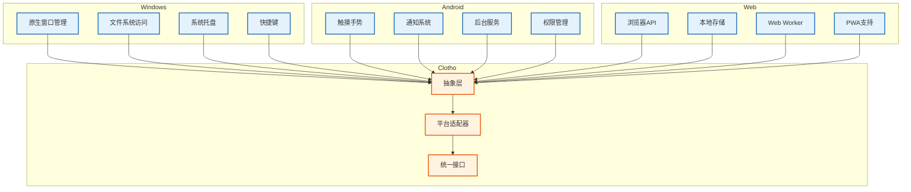

# 跨平台兼容性 (Cross-Platform Compatibility)

**版本**: 1.0.0
**日期**: 2026-02-26
**状态**: Draft
**类型**: Implementation Guide
**作者**: Clotho 架构团队

---

## 1. 概述 (Overview)

本规范定义了 Clotho 表现层的跨平台兼容性策略，确保应用在 Windows、Android、iOS 和 Web 平台上提供一致的用户体验。Flutter 的跨平台能力结合 Clotho 的抽象层设计，实现了"一次编写，多处运行"的目标。

### 1.1 支持的平台

| 平台 | 最低版本 | 渲染引擎 | 状态 | 优先级 |
| :--- | :--- | :--- | :--- | :--- |
| **Windows** | Windows 10+ | Skia/Impeller | ✅ 稳定 | P0 |
| **Android** | Android 5.0+ (API 21+) | Skia/Impeller | ✅ 稳定 | P0 |
| **iOS** | iOS 12.0+ | Skia/Impeller | ✅ 稳定 | P0 |
| **Web** | Chrome 90+, Firefox 88+, Safari 14+ | HTML5 Canvas | ✅ 稳定 | P2 |

### 1.2 核心设计原则

| 原则 | 说明 |
| :--- | :--- |
| **渐进增强** | 核心功能在所有平台可用，高级功能根据平台能力提供 |
| **优雅降级** | 当平台不支持某功能时，提供替代方案或隐藏该功能 |
| **平台适配** | 遵循各平台的设计规范和交互模式 |
| **性能优先** | 根据平台特性优化性能表现 |
| **统一体验** | 在保证平台特性的同时，保持 Clotho 的核心体验一致性 |

---

## 2. 平台支持概述 (Platform Support Overview)

### 2.1 平台能力矩阵



### 2.2 平台差异处理策略

| 差异类型 | 处理方式 | 示例 |
| :--- | :--- | :--- |
| **UI 布局** | 响应式设计 + 平台特定布局 | Windows 使用三栏，Android 使用抽屉 |
| **交互方式** | 统一手势 + 平台特定交互 | Windows 支持键盘快捷键，Android 支持滑动 |
| **文件路径** | 文件系统抽象层 | 使用语义化路径别名 |
| **存储** | 统一存储接口 + 平台特定实现 | Windows 使用文件系统，Web 使用 IndexedDB |
| **通知** | 抽象通知接口 | Windows 使用 Toast，Android 使用系统通知 |

---

## 3. Windows 平台特性 (Windows Platform Features)

### 3.1 窗口管理

```dart
// lib/platform/windows/window_manager.dart

import 'package:flutter/material.dart';
import 'package:window_manager/window_manager.dart';

class WindowsWindowManager {
  /// 初始化窗口管理
  static Future<void> initialize() async {
    await windowManager.ensureInitialized();

    const windowOptions = WindowOptions(
      size: Size(1200, 800),
      minimumSize: Size(800, 600),
      center: true,
      backgroundColor: Colors.transparent,
      skipTaskbar: false,
      titleBarStyle: TitleBarStyle.normal,
      windowButtonVisibility: true,
    );

    await windowManager.waitUntilReadyToShow(windowOptions, () async {
      await windowManager.show();
      await windowManager.focus();
    });
  }

  /// 设置窗口标题
  static Future<void> setTitle(String title) async {
    await windowManager.setTitle(title);
  }

  /// 最小化窗口
  static Future<void> minimize() async {
    await windowManager.minimize();
  }

  /// 最大化窗口
  static Future<void> maximize() async {
    await windowManager.maximize();
  }

  /// 关闭窗口
  static Future<void> close() async {
    await windowManager.close();
  }

  /// 设置窗口大小
  static Future<void> setSize(Size size) async {
    await windowManager.setSize(size);
  }

  /// 设置窗口位置
  static Future<void> setPosition(Offset offset) async {
    await windowManager.setPosition(offset);
  }
}
```

### 3.2 快捷键支持

```dart
// lib/platform/windows/shortcuts.dart

import 'package:flutter/material.dart';
import 'package:flutter/services.dart';

class WindowsShortcuts {
  /// 定义快捷键
  static Map<LogicalKeySet, Intent> get shortcuts => {
    // 文件操作
    LogicalKeySet(LogicalKeyboardKey.control, LogicalKeyboardKey.keyS):
      const SaveIntent(),
    LogicalKeySet(LogicalKeyboardKey.control, LogicalKeyboardKey.keyO):
      const OpenIntent(),
    LogicalKeySet(LogicalKeyboardKey.control, LogicalKeyboardKey.keyN):
      const NewIntent(),
    
    // 编辑操作
    LogicalKeySet(LogicalKeyboardKey.control, LogicalKeyboardKey.keyC):
      const CopyIntent(),
    LogicalKeySet(LogicalKeyboardKey.control, LogicalKeyboardKey.keyV):
      const PasteIntent(),
    LogicalKeySet(LogicalKeyboardKey.control, LogicalKeyboardKey.keyX):
      const CutIntent(),
    
    // 导航操作
    LogicalKeySet(LogicalKeyboardKey.control, LogicalKeyboardKey.keyW):
      const CloseTabIntent(),
    LogicalKeySet(LogicalKeyboardKey.control, LogicalKeyboardKey.tab):
      const NextTabIntent(),
    LogicalKeySet(LogicalKeyboardKey.control, LogicalKeyboardKey.shift, LogicalKeyboardKey.tab):
      const PreviousTabIntent(),
    
    // 应用操作
    LogicalKeySet(LogicalKeyboardKey.f5):
      const RefreshIntent(),
    LogicalKeySet(LogicalKeyboardKey.escape):
      const CancelIntent(),
  };
}

/// 快捷键意图
class SaveIntent extends Intent {
  const SaveIntent();
}

class OpenIntent extends Intent {
  const OpenIntent();
}

class NewIntent extends Intent {
  const NewIntent();
}

class CopyIntent extends Intent {
  const CopyIntent();
}

class PasteIntent extends Intent {
  const PasteIntent();
}

class CutIntent extends Intent {
  const CutIntent();
}

class CloseTabIntent extends Intent {
  const CloseTabIntent();
}

class NextTabIntent extends Intent {
  const NextTabIntent();
}

class PreviousTabIntent extends Intent {
  const PreviousTabIntent();
}

class RefreshIntent extends Intent {
  const RefreshIntent();
}

class CancelIntent extends Intent {
  const CancelIntent();
}

/// 快捷键操作
class ShortcutActions {
  static CallbackAction<SaveIntent> get save =>
    CallbackAction<SaveIntent>(onInvoke: (intent) => _handleSave());
  
  static CallbackAction<OpenIntent> get open =>
    CallbackAction<OpenIntent>(onInvoke: (intent) => _handleOpen());
  
  static CallbackAction<NewIntent> get createNew =>
    CallbackAction<NewIntent>(onInvoke: (intent) => _handleNew());
  
  static CallbackAction<CopyIntent> get copy =>
    CallbackAction<CopyIntent>(onInvoke: (intent) => _handleCopy());
  
  static CallbackAction<PasteIntent> get paste =>
    CallbackAction<PasteIntent>(onInvoke: (intent) => _handlePaste());
  
  static CallbackAction<CutIntent> get cut =>
    CallbackAction<CutIntent>(onInvoke: (intent) => _handleCut());
  
  static CallbackAction<CloseTabIntent> get closeTab =>
    CallbackAction<CloseTabIntent>(onInvoke: (intent) => _handleCloseTab());
  
  static CallbackAction<NextTabIntent> get nextTab =>
    CallbackAction<NextTabIntent>(onInvoke: (intent) => _handleNextTab());
  
  static CallbackAction<PreviousTabIntent> get previousTab =>
    CallbackAction<PreviousTabIntent>(onInvoke: (intent) => _handlePreviousTab());
  
  static CallbackAction<RefreshIntent> get refresh =>
    CallbackAction<RefreshIntent>(onInvoke: (intent) => _handleRefresh());
  
  static CallbackAction<CancelIntent> get cancel =>
    CallbackAction<CancelIntent>(onInvoke: (intent) => _handleCancel());
  
  // 处理函数
  static void _handleSave() {
    // 实现保存逻辑
  }
  
  static void _handleOpen() {
    // 实现打开逻辑
  }
  
  static void _handleNew() {
    // 实现新建逻辑
  }
  
  static void _handleCopy() {
    // 实现复制逻辑
  }
  
  static void _handlePaste() {
    // 实现粘贴逻辑
  }
  
  static void _handleCut() {
    // 实现剪切逻辑
  }
  
  static void _handleCloseTab() {
    // 实现关闭标签页逻辑
  }
  
  static void _handleNextTab() {
    // 实现下一个标签页逻辑
  }
  
  static void _handlePreviousTab() {
    // 实现上一个标签页逻辑
  }
  
  static void _handleRefresh() {
    // 实现刷新逻辑
  }
  
  static void _handleCancel() {
    // 实现取消逻辑
  }
}
```

### 3.3 系统托盘

```dart
// lib/platform/windows/system_tray.dart

import 'package:flutter/material.dart';
import 'package:system_tray/system_tray.dart';
import 'package:window_manager/window_manager.dart';

class WindowsSystemTray {
  static final AppWindow _appWindow = AppWindow();
  static final SystemTray _systemTray = SystemTray();
  static final Menu _menu = Menu();

  /// 初始化系统托盘
  static Future<void> initialize() async {
    // 等待应用窗口初始化
    await _appWindow.setPreventClose(true);

    // 初始化系统托盘
    await _systemTray.initSystemTray(
      iconPath: 'assets/icons/tray_icon.png',
      toolTip: 'Clotho - AI RPG Client',
    );

    // 创建菜单
    await _createMenu();

    // 监听托盘事件
    _systemTray.registerSystemTrayEventHandler((eventName) {
      if (eventName == kSystemTrayEventClick) {
        _appWindow.show();
      } else if (eventName == kSystemTrayEventRightClick) {
        _systemTray.popUpContextMenu();
      }
    });

    // 监听窗口关闭事件
    windowManager.addListener(_onWindowClose);
  }

  /// 创建托盘菜单
  static Future<void> _createMenu() async {
    await _menu.buildFrom([
      MenuItemLabel(label: '显示 Clotho', onClicked: (menuItem) {
        _appWindow.show();
      }),
      MenuItemLabel(label: '隐藏 Clotho', onClicked: (menuItem) {
        _appWindow.hide();
      }),
      MenuSeparator(),
      MenuItemLabel(label: '退出', onClicked: (menuItem) {
        _appWindow.close();
      }),
    ]);

    await _systemTray.setContextMenu(_menu);
  }

  /// 窗口关闭事件处理
  static void _onWindowClose() {
    _appWindow.hide();
  }

  /// 显示通知
  static Future<void> showNotification(String title, String message) async {
    // Windows 使用系统通知
    // 需要集成 local_notifications 包
  }
}
```

---

## 4. Android 平台特性 (Android Platform Features)

### 4.1 权限管理

```dart
// lib/platform/android/permission_manager.dart

import 'package:permission_handler/permission_handler.dart';

class AndroidPermissionManager {
  /// 请求存储权限
  static Future<bool> requestStoragePermission() async {
    final status = await Permission.storage.request();
    return status.isGranted;
  }

  /// 请求相机权限
  static Future<bool> requestCameraPermission() async {
    final status = await Permission.camera.request();
    return status.isGranted;
  }

  /// 请求麦克风权限
  static Future<bool> requestMicrophonePermission() async {
    final status = await Permission.microphone.request();
    return status.isGranted;
  }

  /// 请求通知权限
  static Future<bool> requestNotificationPermission() async {
    final status = await Permission.notification.request();
    return status.isGranted;
  }

  /// 检查权限状态
  static Future<bool> checkPermission(Permission permission) async {
    final status = await permission.status;
    return status.isGranted;
  }

  /// 打开应用设置
  static Future<void> openAppSettings() async {
    await openAppSettings();
  }
}
```

### 4.2 通知系统

```dart
// lib/platform/android/notification_manager.dart

import 'package:flutter_local_notifications/flutter_local_notifications.dart';

class AndroidNotificationManager {
  static final FlutterLocalNotificationsPlugin _notificationsPlugin =
      FlutterLocalNotificationsPlugin();

  /// 初始化通知
  static Future<void> initialize() async {
    const AndroidInitializationSettings initializationSettingsAndroid =
        AndroidInitializationSettings('@mipmap/ic_launcher');

    const InitializationSettings initializationSettings =
        InitializationSettings(android: initializationSettingsAndroid);

    await _notificationsPlugin.initialize(initializationSettings);
  }

  /// 显示通知
  static Future<void> showNotification({
    required int id,
    required String title,
    required String body,
    String? payload,
  }) async {
    const AndroidNotificationDetails androidPlatformChannelSpecifics =
        AndroidNotificationDetails(
      'clotho_channel',
      'Clotho Notifications',
      channelDescription: 'Notifications from Clotho',
      importance: Importance.max,
      priority: Priority.high,
      showWhen: true,
    );

    const NotificationDetails platformChannelSpecifics =
        NotificationDetails(android: androidPlatformChannelSpecifics);

    await _notificationsPlugin.show(
      id,
      title,
      body,
      platformChannelSpecifics,
      payload: payload,
    );
  }

  /// 取消通知
  static Future<void> cancelNotification(int id) async {
    await _notificationsPlugin.cancel(id);
  }

  /// 取消所有通知
  static Future<void> cancelAllNotifications() async {
    await _notificationsPlugin.cancelAll();
  }
}
```

### 4.3 触摸手势

```dart
// lib/platform/android/gesture_handler.dart

import 'package:flutter/material.dart';

class AndroidGestureHandler {
  /// 创建滑动检测器
  static Widget buildSwipeDetector({
    required Widget child,
    required VoidCallback onSwipeLeft,
    required VoidCallback onSwipeRight,
    required VoidCallback onSwipeUp,
    required VoidCallback onSwipeDown,
  }) {
    return GestureDetector(
      onHorizontalDragEnd: (details) {
        if (details.primaryVelocity == null) return;
        if (details.primaryVelocity! > 0) {
          onSwipeRight();
        } else {
          onSwipeLeft();
        }
      },
      onVerticalDragEnd: (details) {
        if (details.primaryVelocity == null) return;
        if (details.primaryVelocity! > 0) {
          onSwipeDown();
        } else {
          onSwipeUp();
        }
      },
      child: child,
    );
  }

  /// 创建长按检测器
  static Widget buildLongPressDetector({
    required Widget child,
    required VoidCallback onLongPress,
    Duration duration = const Duration(milliseconds: 500),
  }) {
    return GestureDetector(
      onLongPress: onLongPress,
      child: child,
    );
  }

  /// 创建双击检测器
  static Widget buildDoubleTapDetector({
    required Widget child,
    required VoidCallback onDoubleTap,
  }) {
    return GestureDetector(
      onDoubleTap: onDoubleTap,
      child: child,
    );
  }
}
```

---

## 5. Web 平台特性 (Web Platform Features)

### 5.1 PWA 支持

```dart
// lib/platform/web/pwa_manager.dart

import 'package:flutter/material.dart';

class WebPWAManager {
  /// 检查是否为 PWA 环境
  static bool get isPWA {
    return kIsWeb && window.matchMedia('(display-mode: standalone)').matches;
  }

  /// 安装 PWA
  static Future<void> install() async {
    if (!kIsWeb) return;
    
    // 使用 beforeinstallprompt 事件
    final deferredPrompt = await _getInstallPrompt();
    if (deferredPrompt != null) {
      await deferredPrompt.prompt();
    }
  }

  /// 获取安装提示
  static Future<dynamic> _getInstallPrompt() async {
    // 实现获取 beforeinstallprompt 事件的逻辑
    return null;
  }

  /// 检查是否可安装
  static Future<bool> canInstall() async {
    if (!kIsWeb) return false;
    
    // 检查是否支持安装
    return await _getInstallPrompt() != null;
  }
}
```

### 5.2 本地存储

```dart
// lib/platform/web/storage_manager.dart

import 'package:flutter/material.dart';

class WebStorageManager {
  /// 存储数据
  static Future<void> setItem(String key, String value) async {
    if (!kIsWeb) return;
    
    // 使用 localStorage
    window.localStorage[key] = value;
  }

  /// 获取数据
  static Future<String?> getItem(String key) async {
    if (!kIsWeb) return null;
    
    return window.localStorage[key];
  }

  /// 删除数据
  static Future<void> removeItem(String key) async {
    if (!kIsWeb) return;
    
    window.localStorage.remove(key);
  }

  /// 清空所有数据
  static Future<void> clear() async {
    if (!kIsWeb) return;
    
    window.localStorage.clear();
  }

  /// 使用 IndexedDB 存储大数据
  static Future<void> setIndexedDBItem(String dbName, String storeName, String key, dynamic value) async {
    if (!kIsWeb) return;
    
    // 实现 IndexedDB 存储
  }

  /// 从 IndexedDB 获取数据
  static Future<dynamic> getIndexedDBItem(String dbName, String storeName, String key) async {
    if (!kIsWeb) return null;
    
    // 实现 IndexedDB 读取
    return null;
  }
}
```

### 5.3 浏览器 API 集成

```dart
// lib/platform/web/browser_api.dart

import 'dart:html' as html;
import 'package:flutter/material.dart';

class WebBrowserAPI {
  /// 复制到剪贴板
  static Future<void> copyToClipboard(String text) async {
    if (!kIsWeb) return;
    
    await html.Navigator.clipboard.writeText(text);
  }

  /// 从剪贴板读取
  static Future<String?> readFromClipboard() async {
    if (!kIsWeb) return null;
    
    return await html.Navigator.clipboard.readText();
  }

  /// 下载文件
  static void downloadFile(String filename, String content) {
    if (!kIsWeb) return;
    
    final blob = html.Blob([content], 'text/plain');
    final url = html.Url.createObjectUrlFromBlob(blob);
    final anchor = html.AnchorElement(href: url)
      ..setAttribute('download', filename)
      ..click();
    html.Url.revokeObjectUrl(url);
  }

  /// 上传文件
  static Future<html.File?> uploadFile() async {
    if (!kIsWeb) return null;
    
    final input = html.FileUploadInputElement();
    input.accept = '*/*';
    input.click();
    
    await input.onChange.first;
    
    if (input.files != null && input.files!.isNotEmpty) {
      return input.files!.first;
    }
    
    return null;
  }

  /// 打开外部链接
  static void openUrl(String url) {
    if (!kIsWeb) return;
    
    html.window.open(url, '_blank');
  }

  /// 获取用户语言
  static String getLanguage() {
    if (!kIsWeb) return 'en';
    
    return html.window.navigator.language;
  }
}
```

---

## 6. iOS 平台特性 (iOS Platform Features)

### 6.1 权限管理

```dart
// lib/platform/ios/permission_manager.dart

import 'package:permission_handler/permission_handler.dart';

class IOSPermissionManager {
  /// 请求照片库权限
  static Future<bool> requestPhotosPermission() async {
    final status = await Permission.photos.request();
    return status.isGranted;
  }

  /// 请求相机权限
  static Future<bool> requestCameraPermission() async {
    final status = await Permission.camera.request();
    return status.isGranted;
  }

  /// 请求麦克风权限
  static Future<bool> requestMicrophonePermission() async {
    final status = await Permission.microphone.request();
    return status.isGranted;
  }

  /// 请求通知权限
  static Future<bool> requestNotificationPermission() async {
    final status = await Permission.notification.request();
    return status.isGranted;
  }

  /// 请求追踪权限 (ATT 框架)
  static Future<bool> requestTrackingPermission() async {
    final status = await Permission.appTrackingTransparency.request();
    return status.isGranted;
  }

  /// 检查权限状态
  static Future<bool> checkPermission(Permission permission) async {
    final status = await permission.status;
    return status.isGranted;
  }

  /// 打开应用设置
  static Future<void> openAppSettings() async {
    await openAppSettings();
  }
}
```

### 6.2 iOS 设计规范适配

```dart
// lib/platform/ios/ui_adapter.dart

import 'package:flutter/cupertino.dart';
import 'package:flutter/material.dart';
import 'package:flutter/services.dart';

class IOSUIAdapter {
  /// 获取 iOS 风格的组件
  static Widget getCupertinoButton({
    required VoidCallback onPressed,
    required Widget child,
    Color? color,
  }) {
    return CupertinoButton(
      onPressed: onPressed,
      color: color,
      child: child,
    );
  }

  /// 获取 iOS 风格的开关
  static Widget getCupertinoSwitch({
    required bool value,
    required ValueChanged<bool> onChanged,
    Color? activeColor,
  }) {
    return CupertinoSwitch(
      value: value,
      onChanged: onChanged,
      activeColor: activeColor,
    );
  }

  /// 获取 iOS 风格的滑动开关
  static Widget getCupertinoSlider({
    required double value,
    required ValueChanged<double> onChanged,
    required double min,
    required double max,
  }) {
    return CupertinoSlider(
      value: value,
      onChanged: onChanged,
      min: min,
      max: max,
    );
  }

  /// 配置状态栏样式
  static Future<void> configureStatusBarStyle() async {
    SystemChrome.setSystemUIOverlayStyle(
      const SystemUiOverlayStyle(
        statusBarBrightness: Brightness.light,
        statusBarIconBrightness: Brightness.dark,
      ),
    );
  }

  /// 获取安全区域 insets
  static EdgeInsets getSafeAreaInsets(BuildContext context) {
    return MediaQuery.of(context).padding;
  }

  /// 获取导航栏高度
  static double getNavigationBarHeight() {
    // iOS 设备通常有底部安全区域
    return 34.0; // iPhone X 及更新机型
  }

  /// 检查是否为刘海屏设备
  static bool hasNotch(BuildContext context) {
    final padding = MediaQuery.of(context).padding;
    return padding.top > 20;
  }
}
```

### 6.3 iOS 性能优化

```dart
// lib/platform/ios/performance_optimizer.dart

import 'package:flutter/material.dart';
import 'package:flutter/services.dart';

class IOSPerformanceOptimizer {
  /// 初始化 iOS 特定优化
  static Future<void> initialize() async {
    // 启用 Metal 渲染
    await SystemChrome.setPreferredOrientations([
      DeviceOrientation.portraitUp,
      DeviceOrientation.portraitDown,
      DeviceOrientation.landscapeLeft,
      DeviceOrientation.landscapeRight,
    ]);

    // 优化内存使用
    await _optimizeMemoryUsage();
  }

  /// 优化内存使用
  static Future<void> _optimizeMemoryUsage() async {
    // iOS 设备内存管理策略
    // 1. 及时释放不用的资源
    // 2. 使用图片缓存
    // 3. 避免内存泄漏
  }

  /// 获取 iOS 特定渲染配置
  static Map<String, dynamic> getRenderConfig() {
    return {
      'enableImpeller': true, // iOS 默认启用 Impeller
      'enableMetal': true,
      'maxTextureSize': 8192, // iOS 设备纹理大小限制
      'enableCache': true,
    };
  }

  /// 优化长列表滚动
  static Widget optimizeListView({
    required Widget child,
    int cacheExtent = 500,
  }) {
    return ScrollConfiguration(
      behavior: const ScrollBehavior().copyWith(
        physics: const BouncingScrollPhysics(), // iOS 风格弹性滚动
      ),
      child: child,
    );
  }

  /// 图片加载优化
  static ImageProvider getOptimizedImageProvider(String path) {
    // 根据 iOS 设备像素比选择合适的图片
    return AssetImage(path);
  }
}
```

### 6.4 iOS 后台任务处理

```dart
// lib/platform/ios/background_task_handler.dart

import 'package:workmanager/workmanager.dart';

class IOSBackgroundTaskHandler {
  /// 初始化后台任务
  static Future<void> initialize() async {
    await Workmanager().initialize(
      callbackDispatcher,
      isInDebugMode: false,
    );
  }

  /// 注册周期性后台任务
  static Future<void> registerPeriodicTask() async {
    await Workmanager().registerPeriodicTask(
      'clotho-sync',
      'syncData',
      frequency: const Duration(minutes: 15), // iOS 限制最小 15 分钟
      constraints: Constraints(
        networkType: NetworkType.connected,
        requiresBatteryNotLow: true,
      ),
    );
  }

  /// 后台任务回调
  @pragma('vm:entry-point')
  static void callbackDispatcher() {
    Workmanager().executeTask((task, inputData) async {
      switch (task) {
        case 'syncData':
          // 执行数据同步
          await _performSync();
          break;
      }
      return true;
    });
  }

  /// 执行同步
  static Future<void> _performSync() async {
    // 实现数据同步逻辑
  }
}
```

### 6.5 iOS 安全机制

```dart
// lib/platform/ios/security_manager.dart

import 'package:flutter/services.dart';
import 'package:local_auth/local_auth.dart';

class IOSSecurityManager {
  static final LocalAuthentication _localAuth = LocalAuthentication();

  /// 检查生物识别是否可用
  static Future<bool> isBiometricAvailable() async {
    return await _localAuth.canCheckBiometrics;
  }

  /// 获取支持的生物识别类型
  static Future<List<BiometricType>> getSupportedBiometrics() async {
    return await _localAuth.getAvailableBiometrics();
  }

  /// 执行生物识别认证
  static Future<bool> authenticateWithBiometrics({
    String reason = '请认证以访问 Clotho',
  }) async {
    return await _localAuth.authenticate(
      localizedReason: reason,
      options: const AuthenticationOptions(
        stickyAuth: true,
        biometricOnly: true,
      ),
    );
  }

  /// 使用 Keychain 存储敏感数据
  static Future<void> storeInKeychain(String key, String value) async {
    const platform = MethodChannel('clotho/keychain');
    await platform.invokeMethod('store', {'key': key, 'value': value});
  }

  /// 从 Keychain 读取敏感数据
  static Future<String?> getFromKeychain(String key) async {
    const platform = MethodChannel('clotho/keychain');
    return await platform.invokeMethod('get', {'key': key});
  }

  /// 从 Keychain 删除数据
  static Future<void> deleteFromKeychain(String key) async {
    const platform = MethodChannel('clotho/keychain');
    await platform.invokeMethod('delete', {'key': key});
  }
}
```

---

## 7. 平台差异处理 (Platform Differences Handling)

### 7.1 条件编译

```dart
// lib/platform/platform.dart

import 'dart:io';
import 'package:flutter/foundation.dart';

/// 平台类型枚举
enum PlatformType {
  windows,
  android,
  web,
  ios,
  macos,
  linux,
}

/// 平台工具类
class PlatformUtils {
  /// 获取当前平台类型
  static PlatformType get platform {
    if (kIsWeb) return PlatformType.web;
    
    if (Platform.isWindows) return PlatformType.windows;
    if (Platform.isAndroid) return PlatformType.android;
    if (Platform.isIOS) return PlatformType.ios;
    if (Platform.isMacOS) return PlatformType.macos;
    if (Platform.isLinux) return PlatformType.linux;
    
    return PlatformType.web;
  }

  /// 是否为桌面平台
  static bool get isDesktop {
    return platform == PlatformType.windows ||
           platform == PlatformType.macos ||
           platform == PlatformType.linux;
  }

  /// 是否为移动平台
  static bool get isMobile {
    return platform == PlatformType.android ||
           platform == PlatformType.ios;
  }

  /// 是否为 Web 平台
  static bool get isWeb => kIsWeb;

  /// 是否支持系统托盘
  static bool get supportsSystemTray {
    return platform == PlatformType.windows;
  }

  /// 是否支持通知
  static bool get supportsNotifications {
    return !isWeb || _checkWebNotificationSupport();
  }

  /// 检查 Web 通知支持
  static bool _checkWebNotificationSupport() {
    if (!kIsWeb) return false;
    
    // 检查浏览器是否支持通知
    return true; // 简化实现
  }

  /// 获取平台特定配置
  static Map<String, dynamic> getPlatformConfig() {
    switch (platform) {
      case PlatformType.windows:
        return {
          'defaultWidth': 1200,
          'defaultHeight': 800,
          'minWidth': 800,
          'minHeight': 600,
          'supportsSystemTray': true,
          'supportsShortcuts': true,
        };
      case PlatformType.android:
        return {
          'supportsShortcuts': false,
          'supportsSystemTray': false,
          'defaultLayout': 'mobile',
        };
      case PlatformType.ios:
        return {
          'supportsShortcuts': false,
          'supportsSystemTray': false,
          'defaultLayout': 'mobile',
          'supportsSafeArea': true,
          'supportsBiometric': true,
        };
      case PlatformType.web:
        return {
          'supportsShortcuts': true,
          'supportsSystemTray': false,
          'defaultLayout': 'responsive',
        };
      default:
        return {};
    }
  }
}
```

### 6.2 平台特定代码

```dart
// lib/platform/platform_specific.dart

import 'dart:io';
import 'package:flutter/foundation.dart';

/// 平台特定功能抽象
abstract class PlatformSpecific {
  /// 初始化平台特定功能
  Future<void> initialize();

  /// 显示通知
  Future<void> showNotification(String title, String message);

  /// 获取平台名称
  String get platformName;
}

/// Windows 平台实现
class WindowsPlatform extends PlatformSpecific {
  @override
  Future<void> initialize() async {
    // 初始化窗口管理
    // 初始化系统托盘
    // 初始化快捷键
  }

  @override
  Future<void> showNotification(String title, String message) async {
    // Windows 通知实现
  }

  @override
  String get platformName => 'Windows';
}

/// Android 平台实现
class AndroidPlatform extends PlatformSpecific {
  @override
  Future<void> initialize() async {
    // 请求权限
    // 初始化通知
  }

  @override
  Future<void> showNotification(String title, String message) async {
    // Android 通知实现
  }

  @override
  String get platformName => 'Android';
}

/// Web 平台实现
class WebPlatform extends PlatformSpecific {
  @override
  Future<void> initialize() async {
    // 初始化 PWA
    // 初始化本地存储
  }

  @override
  Future<void> showNotification(String title, String message) async {
    // Web 通知实现
  }

  @override
  String get platformName => 'Web';
}

/// 平台工厂
class PlatformFactory {
  static PlatformSpecific create() {
    if (kIsWeb) {
      return WebPlatform();
    }

    if (Platform.isWindows) {
      return WindowsPlatform();
    }

    if (Platform.isAndroid) {
      return AndroidPlatform();
    }

    return WebPlatform(); // 默认
  }
}
```

### 6.3 响应式布局

```dart
// lib/widgets/layout/responsive_layout.dart

import 'package:flutter/material.dart';

/// 响应式布局
class ResponsiveLayout extends StatelessWidget {
  final Widget mobile;
  final Widget? tablet;
  final Widget? desktop;

  const ResponsiveLayout({
    super.key,
    required this.mobile,
    this.tablet,
    this.desktop,
  });

  @override
  Widget build(BuildContext context) {
    return LayoutBuilder(
      builder: (context, constraints) {
        if (constraints.maxWidth >= 1200 && desktop != null) {
          return desktop!;
        } else if (constraints.maxWidth >= 600 && tablet != null) {
          return tablet!;
        } else {
          return mobile;
        }
      },
    );
  }
}

/// 响应式值
class ResponsiveValue<T> {
  final T mobile;
  final T? tablet;
  final T? desktop;

  const ResponsiveValue({
    required this.mobile,
    this.tablet,
    this.desktop,
  });

  T getValue(BuildContext context) {
    final width = MediaQuery.of(context).size.width;

    if (width >= 1200 && desktop != null) {
      return desktop!;
    } else if (width >= 600 && tablet != null) {
      return tablet!;
    } else {
      return mobile;
    }
  }
}

/// 使用示例
class ExampleWidget extends StatelessWidget {
  @override
  Widget build(BuildContext context) {
    return ResponsiveLayout(
      mobile: _buildMobileLayout(),
      tablet: _buildTabletLayout(),
      desktop: _buildDesktopLayout(),
    );
  }

  Widget _buildMobileLayout() {
    return Column(
      children: [
        // 移动端布局
      ],
    );
  }

  Widget _buildTabletLayout() {
    return Row(
      children: [
        // 平板布局
      ],
    );
  }

  Widget _buildDesktopLayout() {
    return Row(
      children: [
        // 桌面端布局
      ],
    );
  }
}
```

---

## 7. 兼容性测试 (Compatibility Testing)

### 8.1 测试矩阵

| 平台 | 版本 | 测试类型 | 自动化 | 手动 |
| :--- | :--- | :--- | :--- | :--- |
| **Windows** | 10, 11 | 功能测试 | ✅ | ✅ |
| **Windows** | 10, 11 | UI 测试 | ✅ | ✅ |
| **Android** | 5.0, 6.0, 7.0, 8.0, 9.0, 10, 11, 12, 13, 14 | 功能测试 | ✅ | ✅ |
| **Android** | 5.0, 6.0, 7.0, 8.0, 9.0, 10, 11, 12, 13, 14 | UI 测试 | ✅ | ✅ |
| **iOS** | 12.0, 13.0, 14.0, 15.0, 16.0, 17.0 | 功能测试 | ✅ | ✅ |
| **iOS** | 12.0, 13.0, 14.0, 15.0, 16.0, 17.0 | UI 测试 | ✅ | ✅ |
| **Web** | Chrome 90+, Firefox 88+, Safari 14+, Edge 90+ | 功能测试 | ✅ | ✅ |
| **Web** | Chrome 90+, Firefox 88+, Safari 14+, Edge 90+ | UI 测试 | ✅ | ✅ |

### 7.2 测试脚本

```bash
#!/bin/bash

# test_all_platforms.sh

echo "开始跨平台测试..."

# Windows 测试
echo "运行 Windows 测试..."
flutter test -d windows

# Android 测试
echo "运行 Android 测试..."
flutter test -d android

# Web 测试
echo "运行 Web 测试..."
flutter test -d chrome

# 集成测试
echo "运行集成测试..."
flutter test integration_test/

echo "测试完成！"
```

### 7.3 测试覆盖率

```dart
// test/platform/platform_test.dart

import 'package:flutter_test/flutter_test.dart';
import 'package:clotho_ui_demo/platform/platform.dart';

void main() {
  group('Platform Utils Tests', () {
    test('should detect platform correctly', () {
      // Act
      final platform = PlatformUtils.platform;

      // Assert
      expect(platform, isNotNull);
    });

    test('should return correct platform config', () {
      // Act
      final config = PlatformUtils.getPlatformConfig();

      // Assert
      expect(config, isNotEmpty);
    });

    test('should detect desktop platform', () {
      // Act
      final isDesktop = PlatformUtils.isDesktop;

      // Assert
      // 根据测试平台断言
    });

    test('should detect mobile platform', () {
      // Act
      final isMobile = PlatformUtils.isMobile;

      // Assert
      // 根据测试平台断言
    });
  });
}
```

---

## 8. 降级策略 (Fallback Strategy)

### 8.1 功能降级

```dart
// lib/platform/fallback.dart

import 'package:flutter/material.dart';

/// 功能降级管理器
class FallbackManager {
  /// 检查功能是否可用
  static bool isFeatureAvailable(String feature) {
    switch (feature) {
      case 'system_tray':
        return PlatformUtils.supportsSystemTray;
      case 'notifications':
        return PlatformUtils.supportsNotifications;
      case 'shortcuts':
        return true; // 大多数平台都支持
      case 'file_picker':
        return !kIsWeb; // Web 需要特殊处理
      default:
        return true;
    }
  }

  /// 获取功能降级组件
  static Widget getFallbackWidget(String feature, {String? message}) {
    switch (feature) {
      case 'system_tray':
        return _SystemTrayFallback(message: message);
      case 'notifications':
        return _NotificationFallback(message: message);
      case 'file_picker':
        return _FilePickerFallback(message: message);
      default:
        return _GenericFallback(message: message);
    }
  }
}

/// 系统托盘降级组件
class _SystemTrayFallback extends StatelessWidget {
  final String? message;

  const _SystemTrayFallback({this.message});

  @override
  Widget build(BuildContext context) {
    return Card(
      child: Padding(
        padding: const EdgeInsets.all(16.0),
        child: Column(
          children: [
            Icon(Icons.info_outline, size: 48),
            const SizedBox(height: 16),
            Text(
              message ?? '系统托盘功能在此平台不可用',
              style: Theme.of(context).textTheme.bodyMedium,
            ),
          ],
        ),
      ),
    );
  }
}

/// 通知降级组件
class _NotificationFallback extends StatelessWidget {
  final String? message;

  const _NotificationFallback({this.message});

  @override
  Widget build(BuildContext context) {
    return Card(
      child: Padding(
        padding: const EdgeInsets.all(16.0),
        child: Column(
          children: [
            Icon(Icons.notifications_off, size: 48),
            const SizedBox(height: 16),
            Text(
              message ?? '通知功能在此平台不可用',
              style: Theme.of(context).textTheme.bodyMedium,
            ),
          ],
        ),
      ),
    );
  }
}

/// 文件选择器降级组件
class _FilePickerFallback extends StatelessWidget {
  final String? message;

  const _FilePickerFallback({this.message});

  @override
  Widget build(BuildContext context) {
    return Card(
      child: Padding(
        padding: const EdgeInsets.all(16.0),
        child: Column(
          children: [
            Icon(Icons.folder_off, size: 48),
            const SizedBox(height: 16),
            Text(
              message ?? '文件选择功能在此平台不可用',
              style: Theme.of(context).textTheme.bodyMedium,
            ),
          ],
        ),
      ),
    );
  }
}

/// 通用降级组件
class _GenericFallback extends StatelessWidget {
  final String? message;

  const _GenericFallback({this.message});

  @override
  Widget build(BuildContext context) {
    return Card(
      child: Padding(
        padding: const EdgeInsets.all(16.0),
        child: Column(
          children: [
            Icon(Icons.warning_amber_outlined, size: 48),
            const SizedBox(height: 16),
            Text(
              message ?? '此功能在此平台不可用',
              style: Theme.of(context).textTheme.bodyMedium,
            ),
          ],
        ),
      ),
    );
  }
}
```

### 8.2 渲染降级

```dart
// lib/widgets/rendering/fallback_renderer.dart

import 'package:flutter/material.dart';

/// 渲染降级管理器
class FallbackRenderer {
  /// 根据平台能力选择渲染器
  static Widget render({
    required String content,
    required String type,
    Widget? nativeRenderer,
    Widget? webRenderer,
    Widget? fallbackRenderer,
  }) {
    // 优先使用原生渲染器
    if (nativeRenderer != null && !kIsWeb) {
      return nativeRenderer;
    }

    // 其次使用 Web 渲染器
    if (webRenderer != null && kIsWeb) {
      return webRenderer;
    }

    // 最后使用降级渲染器
    return fallbackRenderer ?? _DefaultFallback(content: content);
  }
}

/// 默认降级渲染器
class _DefaultFallback extends StatelessWidget {
  final String content;

  const _DefaultFallback({required this.content});

  @override
  Widget build(BuildContext context) {
    return Card(
      child: Padding(
        padding: const EdgeInsets.all(16.0),
        child: Column(
          crossAxisAlignment: CrossAxisAlignment.start,
          children: [
            Row(
              children: [
                Icon(Icons.error_outline, color: Colors.orange),
                const SizedBox(width: 8),
                Text(
                  '无法渲染此内容',
                  style: Theme.of(context).textTheme.titleSmall,
                ),
              ],
            ),
            const SizedBox(height: 8),
            Text(
              content,
              style: Theme.of(context).textTheme.bodyMedium,
            ),
          ],
        ),
      ),
    );
  }
}
```

---

## 9. 平台特定配置 (Platform-Specific Configuration)

### 10.1 Windows 配置

```yaml
# windows/runner/Runner.rc

VS_VERSION_INFO VERSIONINFO
 FILEVERSION 1,0,0,1
 PRODUCTVERSION 1,0,0,1
 FILEFLAGSMASK 0x3fL
#ifdef _DEBUG
 FILEFLAGS 0x1L
#else
 FILEFLAGS 0x0L
#endif
 FILEOS 0x40004L
 FILETYPE 0x1L
 FILESUBTYPE 0x0L
BEGIN
    BLOCK "StringFileInfo"
    BEGIN
        BLOCK "040904b0"
        BEGIN
            VALUE "CompanyName", "Clotho Team"
            VALUE "FileDescription", "Clotho - AI RPG Client"
            VALUE "FileVersion", "1.0.0.1"
            VALUE "InternalName", "clotho"
            VALUE "LegalCopyright", "Copyright (C) 2026"
            VALUE "OriginalFilename", "clotho.exe"
            VALUE "ProductName", "Clotho"
            VALUE "ProductVersion", "1.0.0.1"
        END
    END
    BLOCK "VarFileInfo"
    BEGIN
        VALUE "Translation", 0x409, 1200
    END
END
```

### 10.2 Android 配置

```xml
<!-- android/app/src/main/AndroidManifest.xml -->

<manifest xmlns:android="http://schemas.android.com/apk/res/android">
    <uses-permission android:name="android.permission.INTERNET"/>
    <uses-permission android:name="android.permission.READ_EXTERNAL_STORAGE"/>
    <uses-permission android:name="android.permission.WRITE_EXTERNAL_STORAGE"/>
    <uses-permission android:name="android.permission.CAMERA"/>
    <uses-permission android:name="android.permission.RECORD_AUDIO"/>
    <uses-permission android:name="android.permission.POST_NOTIFICATIONS"/>

    <application
        android:label="Clotho"
        android:name="${applicationName}"
        android:icon="@mipmap/ic_launcher">
        <activity
            android:name=".MainActivity"
            android:exported="true"
            android:launchMode="singleTop"
            android:theme="@style/LaunchTheme"
            android:configChanges="orientation|keyboardHidden|keyboard|screenSize|smallestScreenSize|locale|layoutDirection|fontScale|screenLayout|density|uiMode"
            android:hardwareAccelerated="true"
            android:windowSoftInputMode="adjustResize">
            <meta-data
              android:name="io.flutter.embedding.android.NormalTheme"
              android:resource="@style/NormalTheme"
              />
            <intent-filter>
                <action android:name="android.intent.action.MAIN"/>
                <category android:name="android.intent.category.LAUNCHER"/>
            </intent-filter>
        </activity>
    </application>
</manifest>
```

### 10.3 Web 配置

### 10.4 iOS 配置

```xml
<!-- ios/Runner/Info.plist (excerpt) -->

<key>CFBundleName</key>
<string>Clotho</string>
<key>CFBundleDisplayName</key>
<string>Clotho - AI RPG Client</string>
<key>CFBundleIdentifier</key>
<string>com.clotho.app</string>
<key>CFBundleVersion</key>
<string>1</string>
<key>CFBundleShortVersionString</key>
<string>1.0.0</string>

<!-- 权限描述 -->
<key>NSCameraUsageDescription</key>
<string>Clotho 需要访问相机以拍摄照片</string>
<key>NSPhotoLibraryUsageDescription</key>
<string>Clotho 需要访问照片库以选择图片</string>
<key>NSMicrophoneUsageDescription</key>
<string>Clotho 需要访问麦克风以录制音频</string>
<key>NSUserTrackingUsageDescription</key>
<string>用于提供个性化体验</string>

<!-- 后台模式 -->
<key>UIBackgroundModes</key>
<array>
    <string>fetch</string>
    <string>remote-notification</string>
</array>

<!-- 安全区域适配 -->
<key>UIViewControllerBasedStatusBarAppearance</key>
<true/>
```

```swift
// ios/Runner/AppDelegate.swift

import UIKit
import Flutter

@UIApplicationMain
@objc class AppDelegate: FlutterAppDelegate {
  override func application(
    _ application: UIApplication,
    didFinishLaunchingWithOptions launchOptions: [UIApplication.LaunchOptionsKey: Any]?
  ) -> Bool {
    // 配置 iOS 特定功能
    if #available(iOS 10.0, *) {
      UNUserNotificationCenter.current().delegate = self as UNUserNotificationCenterDelegate
    }
    
    GeneratedPluginRegistrant.register(with: self)
    return super.application(application, didFinishLaunchingWithOptions: launchOptions)
  }
}
```

```html
<!-- web/index.html -->

<!DOCTYPE html>
<html>
<head>
  <meta charset="UTF-8">
  <title>Clotho - AI RPG Client</title>
  <meta name="description" content="Clotho - Next generation AI RPG client">
  <meta name="viewport" content="width=device-width, initial-scale=1.0">
  
  <!-- PWA Manifest -->
  <link rel="manifest" href="manifest.json">
  <meta name="theme-color" content="#1976D2">
  
  <!-- Icons -->
  <link rel="icon" type="image/png" href="icons/icon-192x192.png">
  <link rel="apple-touch-icon" href="icons/icon-192x192.png">
</head>
<body>
  <script>
    // Service Worker Registration
    if ('serviceWorker' in navigator) {
      window.addEventListener('load', function() {
        navigator.serviceWorker.register('flutter_service_worker.js');
      });
    }
  </script>
</body>
</html>
```

---

## 10. 性能优化 (Performance Optimization)

### 11.1 平台特定优化

```dart
// lib/platform/performance.dart

import 'package:flutter/material.dart';

/// 平台性能优化
class PlatformPerformance {
  /// 获取平台特定的性能配置
  static Map<String, dynamic> getPerformanceConfig() {
    switch (PlatformUtils.platform) {
      case PlatformType.windows:
        return {
          'enableImpeller': true,
          'enableSkia': false,
          'maxTextureSize': 16384,
          'enableCache': true,
        };
      case PlatformType.android:
        return {
          'enableImpeller': true,
          'enableSkia': false,
          'maxTextureSize': 4096,
          'enableCache': true,
        };
      case PlatformType.ios:
        return {
          'enableImpeller': true, // iOS 默认启用 Impeller
          'enableSkia': false,
          'maxTextureSize': 8192, // iOS 设备纹理大小限制
          'enableCache': true,
          'enableMetal': true, // 使用 Metal 渲染
        };
      case PlatformType.web:
        return {
          'enableImpeller': false,
          'enableSkia': true,
          'maxTextureSize': 4096,
          'enableCache': false,
        };
      default:
        return {};
    }
  }

  /// 获取平台特定的渲染优化
  static RenderOptimization getRenderOptimization() {
    switch (PlatformUtils.platform) {
      case PlatformType.windows:
        return RenderOptimization.high;
      case PlatformType.android:
        return RenderOptimization.medium;
      case PlatformType.web:
        return RenderOptimization.low;
      default:
        return RenderOptimization.medium;
    }
  }
}

/// 渲染优化级别
enum RenderOptimization {
  low,
  medium,
  high,
}
```

### 10.2 资源优化

```dart
// lib/platform/resource_optimization.dart

import 'package:flutter/material.dart';

/// 资源优化管理器
class ResourceOptimization {
  /// 根据平台选择合适的图片格式
  static String getImageFormat() {
    switch (PlatformUtils.platform) {
      case PlatformType.windows:
      case PlatformType.android:
        return 'webp'; // WebP 格式
      case PlatformType.web:
        return 'png'; // PNG 格式（兼容性更好）
      default:
        return 'png';
    }
  }

  /// 获取平台特定的图片分辨率
  static int getImageResolution() {
    switch (PlatformUtils.platform) {
      case PlatformType.windows:
        return 2; // 2x
      case PlatformType.android:
        return 3; // 3x
      case PlatformType.ios:
        return 3; // 3x (Retina 显示屏)
      case PlatformType.web:
        return 1; // 1x
      default:
        return 2;
    }
  }

  /// 获取平台特定的字体大小
  static double getFontSize(double baseSize) {
    switch (PlatformUtils.platform) {
      case PlatformType.windows:
        return baseSize * 1.0;
      case PlatformType.android:
        return baseSize * 1.1;
      case PlatformType.ios:
        return baseSize * 1.0;
      case PlatformType.web:
        return baseSize * 0.95;
      default:
        return baseSize;
    }
  }
}
```

---

## 11. 关联文档 (Related Documents)

- [`00_active_specs/presentation/README.md`](../00_active_specs/presentation/README.md) - 表现层总览
- [`00_active_specs/presentation/04-responsive-layout.md`](../00_active_specs/presentation/04-responsive-layout.md) - 响应式布局
- [`00_active_specs/infrastructure/file-system-abstraction.md`](../00_active_specs/infrastructure/file-system-abstraction.md) - 文件系统抽象
- [`00_active_specs/presentation/component-testing.md`](../00_active_specs/presentation/component-testing.md) - 组件测试策略
- [`00_active_specs/reference/documentation_standards.md`](../00_active_specs/reference/documentation_standards.md) - 文档编写规范

---

**最后更新**: 2026-02-26  
**文档状态**: 草案，待架构评审委员会审议
