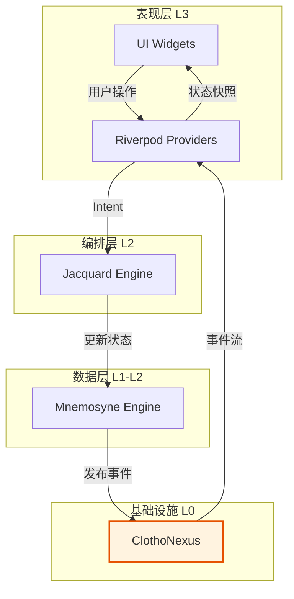
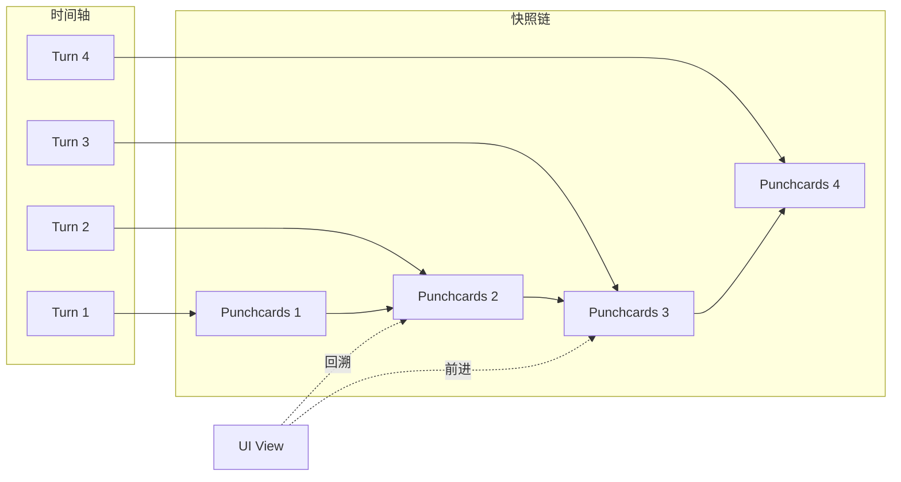

# 状态同步与事件流 (State Sync & Events)

**版本**: 1.0.0
**日期**: 2026-02-25
**状态**: Draft
**类型**: Architecture Spec
**作者**: Clotho 架构团队

---

## 1. 概述 (Overview)

表现层的状态同步与事件流机制是 Clotho 架构中连接 UI 层与数据层（Mnemosyne）和编排层（Jacquard）的核心桥梁。本规范定义了 UI 如何监听状态变化、响应事件、以及如何支持时间旅行等高级功能。

### 1.1 核心设计原则

| 原则 | 说明 |
| :--- | :--- |
| **单向数据流** | UI 是消费者，只监听状态变化，不直接修改数据 |
| **事件驱动** | 用户操作转化为事件，通过 ClothoNexus 传播 |
| **确定性回溯** | 状态变更可追溯，支持时间旅行 |
| **性能优先** | 使用节流、防抖、增量更新优化性能 |
| **解耦架构** | UI 层通过事件总线与核心层解耦 |

---

## 2. 状态同步机制 (State Synchronization)

### 2.1 单向数据流架构

Clotho 表现层采用严格单向数据流，确保 UI 不直接修改 Mnemosyne 状态。



### 2.2 Mnemosyne 状态流订阅

UI 层通过 Riverpod Provider 订阅 Mnemosyne 的状态流。

```dart
// providers/state_providers.dart

/// Mnemosyne 状态快照 Provider
final stateSnapshotProvider = StreamProvider<Punchcards>((ref) {
  final mnemosyne = ref.watch(mnemosyneProvider);
  return mnemosyne.stateStream;
});

/// 特定路径的状态 Provider
final statePathProvider = Provider.family<Map<String, dynamic>?, String>((ref, path) {
  final snapshot = ref.watch(stateSnapshotProvider).valueOrNull;
  if (snapshot == null) return null;
  return _getValueAtPath(snapshot, path);
});

Map<String, dynamic>? _getValueAtPath(Map<String, dynamic> snapshot, String path) {
  final parts = path.split('.');
  dynamic current = snapshot;
  
  for (final part in parts) {
    if (current is Map && current.containsKey(part)) {
      current = current[part];
    } else {
      return null;
    }
  }
  
  return current;
}
```

### 2.3 状态变更传播

当 Mnemosyne 更新状态时，通过 ClothoNexus 广播事件，UI 层自动响应。

```dart
// Mnemosyne 侧的状态更新
class MnemosyneEngine {
  final IClothoNexus _nexus;
  
  void updateVariable(String path, dynamic value) {
    // 1. 更新内部状态
    _store.set(path, value);
    
    // 2. 发布变量变更事件
    _nexus.publish(VariableChangeEvent(
      path: path,
      oldValue: _oldValue,
      newValue: value,
    ));
    
    // 3. 广播新的状态快照
    _nexus.publish(StateSnapshotEvent(
      snapshot: _generateSnapshot(),
    ));
  }
}

// UI 层的状态监听
class CharacterStatusWidget extends ConsumerWidget {
  @override
  Widget build(BuildContext context, WidgetRef ref) {
    final status = ref.watch(statePathProvider('characters.player.status'));
    
    return Card(
      child: Column(
        children: [
          Text('HP: ${status?['hp'] ?? 0}'),
          Text('MP: ${status?['mp'] ?? 0}'),
        ],
      ),
    );
  }
}
```

---

## 3. 状态回溯与恢复 (State Rollback & Recovery)

### 3.1 时间旅行支持

Clotho 支持基于 Punchcards 快照的时间旅行，UI 层可以无缝回退到历史状态。



### 3.2 状态回溯实现

```dart
// providers/time_travel_provider.dart

/// 时间旅行 Provider
final timeTravelProvider = StateNotifierProvider<TimeTravelNotifier, TimeTravelState>((ref) {
  return TimeTravelNotifier(
    mnemosyne: ref.watch(mnemosyneProvider),
  );
});

class TimeTravelNotifier extends StateNotifier<TimeTravelState> {
  final MnemosyneEngine _mnemosyne;
  
  TimeTravelNotifier({required MnemosyneEngine mnemosyne})
      : _mnemosyne = mnemosyne,
        super(TimeTravelState.initial());

  /// 回退到指定 Turn
  Future<void> rollbackToTurn(int turnIndex) async {
    final snapshot = await _mnemosyne.getSnapshotAtTurn(turnIndex);
    if (snapshot != null) {
      state = state.copyWith(
        currentTurn: turnIndex,
        snapshot: snapshot,
        isRollback: true,
      );
    }
  }

  /// 前进到下一个 Turn
  Future<void> forward() async {
    if (state.currentTurn < state.maxTurn) {
      await rollbackToTurn(state.currentTurn + 1);
    }
  }

  /// 恢复到最新状态
  Future<void> resume() async {
    final snapshot = await _mnemosyne.getCurrentSnapshot();
    state = state.copyWith(
      currentTurn: state.maxTurn,
      snapshot: snapshot,
      isRollback: false,
    );
  }
}

@immutable
class TimeTravelState {
  final int currentTurn;
  final int maxTurn;
  final Punchcards? snapshot;
  final bool isRollback;

  const TimeTravelState({
    required this.currentTurn,
    required this.maxTurn,
    this.snapshot,
    required this.isRollback,
  });

  factory TimeTravelState.initial() {
    return TimeTravelState(
      currentTurn: 0,
      maxTurn: 0,
      isRollback: false,
    );
  }

  TimeTravelState copyWith({
    int? currentTurn,
    int? maxTurn,
    Punchcards? snapshot,
    bool? isRollback,
  }) {
    return TimeTravelState(
      currentTurn: currentTurn ?? this.currentTurn,
      maxTurn: maxTurn ?? this.maxTurn,
      snapshot: snapshot ?? this.snapshot,
      isRollback: isRollback ?? this.isRollback,
    );
  }
}
```

### 3.3 UI 层的时间旅行控件

```dart
class TimeTravelControls extends ConsumerWidget {
  @override
  Widget build(BuildContext context, WidgetRef ref) {
    final timeTravel = ref.watch(timeTravelProvider);
    
    return Container(
      padding: EdgeInsets.all(16),
      decoration: BoxDecoration(
        color: Theme.of(context).colorScheme.surfaceContainer,
        border: Border(
          top: BorderSide(
            color: timeTravel.isRollback
                ? Theme.of(context).colorScheme.primary
                : Colors.transparent,
            width: 2,
          ),
        ),
      ),
      child: Row(
        children: [
          Icon(
            Icons.history,
            color: timeTravel.isRollback
                ? Theme.of(context).colorScheme.primary
                : Theme.of(context).colorScheme.onSurfaceVariant,
          ),
          SizedBox(width: 16),
          Text('Turn ${timeTravel.currentTurn} / ${timeTravel.maxTurn}'),
          Spacer(),
          IconButton(
            icon: Icon(Icons.chevron_left),
            onPressed: timeTravel.currentTurn > 0
                ? () => ref.read(timeTravelProvider.notifier).backward()
                : null,
          ),
          IconButton(
            icon: Icon(Icons.chevron_right),
            onPressed: timeTravel.currentTurn < timeTravel.maxTurn
                ? () => ref.read(timeTravelProvider.notifier).forward()
                : null,
          ),
          if (timeTravel.isRollback)
            TextButton.icon(
              icon: Icon(Icons.restore),
              label: Text('恢复最新'),
              onPressed: () => ref.read(timeTravelProvider.notifier).resume(),
            ),
        ],
      ),
    );
  }
}
```

---

## 4. 事件流处理 (Event Stream Processing)

### 4.1 事件分类

表现层处理的事件分为三大类：

| 事件类型 | 描述 | 示例 |
| :--- | :--- | :--- |
| **用户意图事件** | 用户操作触发的意图 | 点击按钮、输入文本、选择选项 |
| **系统响应事件** | 系统内部产生的响应 | 消息生成完成、状态变更、错误发生 |
| **错误与异常事件** | 异常情况的通知 | 网络错误、解析失败、渲染异常 |

### 4.2 用户意图事件

用户操作通过 InputDraftController 转化为 Intent。

```dart
// models/intent.dart

enum IntentType {
  sendMessage,
  editMessage,
  deleteMessage,
  regenerateMessage,
  navigateTo,
  toggleInspector,
  changeVariable,
}

class UserIntent {
  final String id;
  final IntentType type;
  final Map<String, dynamic> payload;
  final DateTime timestamp;

  UserIntent({
    required this.type,
    required this.payload,
  })  : id = Uuid().v4(),
        timestamp = DateTime.now();
}

// controllers/intent_controller.dart

class IntentController {
  final IClothoNexus _nexus;
  
  IntentController(this._nexus);
  
  /// 发送消息意图
  void sendMessage(String content) {
    final intent = UserIntent(
      type: IntentType.sendMessage,
      payload: {'content': content},
    );
    _nexus.publish(UserIntentEvent(intent: intent));
  }
  
  /// 编辑消息意图
  void editMessage(String messageId, String newContent) {
    final intent = UserIntent(
      type: IntentType.editMessage,
      payload: {
        'messageId': messageId,
        'content': newContent,
      },
    );
    _nexus.publish(UserIntentEvent(intent: intent));
  }
  
  /// 导航意图
  void navigateTo(String route) {
    final intent = UserIntent(
      type: IntentType.navigateTo,
      payload: {'route': route},
    );
    _nexus.publish(UserIntentEvent(intent: intent));
  }
}
```

### 4.3 系统响应事件

系统响应事件由核心层发布，UI 层订阅并更新界面。

```dart
// UI 层订阅系统响应事件
class SystemResponseListener extends ConsumerStatefulWidget {
  @override
  ConsumerState<SystemResponseListener> createState() => _SystemResponseListenerState();
}

class _SystemResponseListenerState extends ConsumerState<SystemResponseListener> {
  StreamSubscription? _subscription;
  
  @override
  void initState() {
    super.initState();
    final nexus = ref.read(nexusProvider);
    
    // 监听消息事件
    _subscription = nexus.on<MessageEvent>().listen((event) {
      _handleMessageEvent(event);
    });
    
    // 监听变量变更事件
    nexus.on<VariableChangeEvent>().listen((event) {
      _handleVariableChangeEvent(event);
    });
    
    // 监听错误事件
    nexus.on<ErrorEvent>().listen((event) {
      _handleErrorEvent(event);
    });
  }
  
  void _handleMessageEvent(MessageEvent event) {
    switch (event.type) {
      case MessageType.received:
        // 显示新消息
        _showNewMessageNotification(event.message);
        break;
      case MessageType.updated:
        // 更新现有消息
        _updateMessageInList(event.message);
        break;
      case MessageType.deleted:
        // 从列表中删除消息
        _removeMessageFromList(event.messageId);
        break;
    }
  }
  
  void _handleVariableChangeEvent(VariableChangeEvent event) {
    // 可以在这里触发特定的 UI 更新
    if (event.path == 'characters.player.status.hp') {
      _showHPChangeNotification(event.oldValue, event.newValue);
    }
  }
  
  void _handleErrorEvent(ErrorEvent event) {
    // 显示错误提示
    ScaffoldMessenger.of(context).showSnackBar(
      SnackBar(
        content: Text(event.message),
        backgroundColor: Theme.of(context).colorScheme.error,
      ),
    );
  }
  
  @override
  void dispose() {
    _subscription?.cancel();
    super.dispose();
  }
  
  @override
  Widget build(BuildContext context) {
    return Container(); // 纯监听组件，不渲染内容
  }
}
```

### 4.4 错误与异常事件

错误事件需要特殊处理，确保用户得到清晰的反馈。

```dart
// models/error_event.dart

enum ErrorSeverity {
  info,
  warning,
  error,
  critical,
}

class ErrorEvent extends ClothoEvent {
  final String code;
  final String message;
  final ErrorSeverity severity;
  final String? stackTrace;
  final Map<String, dynamic>? context;

  ErrorEvent({
    required this.code,
    required this.message,
    this.severity = ErrorSeverity.error,
    this.stackTrace,
    this.context,
    super.metadata,
  });
}

// widgets/error_handler.dart

class ErrorHandler extends ConsumerWidget {
  final Widget child;
  
  const ErrorHandler({required this.child});
  
  @override
  Widget build(BuildContext context, WidgetRef ref) {
    final errorEvents = ref.watch(errorEventProvider);
    
    return Stack(
      children: [
        child,
        if (errorEvents.isNotEmpty)
          Positioned(
            top: 16,
            right: 16,
            child: _ErrorNotification(
              events: errorEvents,
              onDismiss: (index) {
                ref.read(errorEventProvider.notifier).dismiss(index);
              },
            ),
          ),
      ],
    );
  }
}

class _ErrorNotification extends StatelessWidget {
  final List<ErrorEvent> events;
  final Function(int) onDismiss;
  
  const _ErrorNotification({
    required this.events,
    required this.onDismiss,
  });
  
  @override
  Widget build(BuildContext context) {
    return Column(
      crossAxisAlignment: CrossAxisAlignment.end,
      children: events.map((event) {
        return Card(
          margin: EdgeInsets.only(bottom: 8),
          color: _getSeverityColor(context, event.severity),
          child: Padding(
            padding: EdgeInsets.all(12),
            child: Row(
              children: [
                Icon(_getSeverityIcon(event.severity)),
                SizedBox(width: 8),
                Expanded(
                  child: Column(
                    crossAxisAlignment: CrossAxisAlignment.start,
                    children: [
                      Text(
                        event.code,
                        style: TextStyle(
                          fontWeight: FontWeight.bold,
                          fontSize: 12,
                        ),
                      ),
                      Text(event.message),
                    ],
                  ),
                ),
                IconButton(
                  icon: Icon(Icons.close),
                  onPressed: () => onDismiss(events.indexOf(event)),
                ),
              ],
            ),
          ),
        );
      }).toList(),
    );
  }
  
  Color _getSeverityColor(BuildContext context, ErrorSeverity severity) {
    switch (severity) {
      case ErrorSeverity.info:
        return Theme.of(context).colorScheme.primaryContainer;
      case ErrorSeverity.warning:
        return Theme.of(context).colorScheme.tertiaryContainer;
      case ErrorSeverity.error:
        return Theme.of(context).colorScheme.errorContainer;
      case ErrorSeverity.critical:
        return Colors.red.shade900;
    }
  }
  
  IconData _getSeverityIcon(ErrorSeverity severity) {
    switch (severity) {
      case ErrorSeverity.info:
        return Icons.info;
      case ErrorSeverity.warning:
        return Icons.warning;
      case ErrorSeverity.error:
        return Icons.error;
      case ErrorSeverity.critical:
        return Icons.dangerous;
    }
  }
}
```

---

## 5. ClothoNexus 集成 (ClothoNexus Integration)

### 5.1 事件发布

UI 层通过 ClothoNexus 发布事件。

```dart
// providers/event_providers.dart

/// ClothoNexus Provider
final nexusProvider = Provider<IClothoNexus>((ref) {
  return GetIt.I<IClothoNexus>();
});

/// 发布用户意图事件
void publishUserIntent(WidgetRef ref, UserIntent intent) {
  final nexus = ref.read(nexusProvider);
  nexus.publish(UserIntentEvent(intent: intent));
}

/// 发布导航事件
void publishNavigationEvent(WidgetRef ref, String route, Map<String, dynamic>? params) {
  final nexus = ref.read(nexusProvider);
  nexus.publish(NavigationEvent(
    route: route,
    params: params,
  ));
}
```

### 5.2 事件订阅

UI 层通过 Riverpod Provider 订阅 ClothoNexus 事件流。

```dart
/// 消息事件 Provider
final messageEventProvider = StreamProvider<MessageEvent>((ref) {
  final nexus = ref.watch(nexusProvider);
  return nexus.on<MessageEvent>();
});

/// 变量变更事件 Provider
final variableChangeEventProvider = StreamProvider<VariableChangeEvent>((ref) {
  final nexus = ref.watch(nexusProvider);
  return nexus.on<VariableChangeEvent>();
});

/// 错误事件 Provider（带状态）
final errorEventProvider = StateNotifierProvider<ErrorEventNotifier, List<ErrorEvent>>((ref) {
  final nexus = ref.watch(nexusProvider);
  final notifier = ErrorEventNotifier();
  
  // 订阅错误事件
  final subscription = nexus.on<ErrorEvent>().listen(notifier.add);
  
  ref.onDispose(() {
    subscription.cancel();
  });
  
  return notifier;
});

class ErrorEventNotifier extends StateNotifier<List<ErrorEvent>> {
  ErrorEventNotifier() : super([]);
  
  void add(ErrorEvent event) {
    state = [...state, event];
  }
  
  void dismiss(int index) {
    state = [...state]..removeAt(index);
  }
  
  void clear() {
    state = [];
  }
}
```

### 5.3 事件过滤与路由

UI 层可以过滤和路由事件，只处理感兴趣的事件。

```dart
/// 过滤特定路径的变量变更
final hpChangeEventProvider = StreamProvider<VariableChangeEvent>((ref) {
  final nexus = ref.watch(nexusProvider);
  return nexus.on<VariableChangeEvent>()
      .where((event) => event.path == 'characters.player.status.hp');
});

/// 过滤特定类型的消息
final aiMessageEventProvider = StreamProvider<MessageEvent>((ref) {
  final nexus = ref.watch(nexusProvider);
  return nexus.on<MessageEvent>()
      .where((event) => event.type == MessageType.received && event.message.role == 'assistant');
});

/// 组合多个事件流
final combinedEventProvider = StreamProvider<ClothoEvent>((ref) {
  final nexus = ref.watch(nexusProvider);
  
  return StreamGroup.merge([
    nexus.on<MessageEvent>(),
    nexus.on<VariableChangeEvent>(),
    nexus.on<NavigationEvent>(),
  ]);
});
```

---

## 6. 性能优化 (Performance Optimization)

### 6.1 状态节流与防抖

对于频繁的状态变更，使用节流和防抖减少 UI 重建。

```dart
/// 节流 Provider（限制更新频率）
final throttledStateProvider = Provider.family<Map<String, dynamic>?, String>((ref, path) {
  final baseProvider = statePathProvider(path);
  final lastUpdate = ref.watch(_lastUpdateProvider);
  
  // 只在超过 100ms 后才更新
  return ref.watch(baseProvider).valueOrNull;
});

final _lastUpdateProvider = Provider<DateTime>((ref) {
  return DateTime.now();
});

/// 防抖 Provider（延迟更新）
final debouncedStateProvider = Provider.family<Map<String, dynamic>?, String>((ref, path) {
  final baseProvider = statePathProvider(path);
  
  return ref.watch(baseProvider).valueOrNull;
});

// 使用防抖的输入框
class DebouncedTextField extends ConsumerStatefulWidget {
  final String path;
  
  const DebouncedTextField({required this.path});
  
  @override
  ConsumerState<DebouncedTextField> createState() => _DebouncedTextFieldState();
}

class _DebouncedTextFieldState extends ConsumerState<DebouncedTextField> {
  Timer? _debounce;
  final TextEditingController _controller = TextEditingController();
  
  @override
  void initState() {
    super.initState();
    
    // 监听输入变化，防抖 500ms
    _controller.addListener(() {
      if (_debounce?.isActive ?? false) _debounce!.cancel();
      _debounce = Timer(Duration(milliseconds: 500), () {
        _publishIntent(_controller.text);
      });
    });
  }
  
  void _publishIntent(String value) {
    final intent = UserIntent(
      type: IntentType.changeVariable,
      payload: {
        'path': widget.path,
        'value': value,
      },
    );
    publishUserIntent(ref, intent);
  }
  
  @override
  void dispose() {
    _debounce?.cancel();
    _controller.dispose();
    super.dispose();
  }
  
  @override
  Widget build(BuildContext context) {
    return TextField(
      controller: _controller,
      decoration: InputDecoration(
        labelText: widget.path,
      ),
    );
  }
}
```

### 6.2 增量更新策略

对于大型状态树，使用增量更新减少数据传输。

```dart
/// 增量更新 Provider
final incrementalStateProvider = Provider.family<Map<String, dynamic>, String>((ref, path) {
  final baseState = ref.watch(statePathProvider(path));
  final lastState = ref.watch(_lastStateProvider(path));
  
  // 计算差异
  final diff = _computeDiff(lastState, baseState);
  
  // 更新缓存
  ref.read(_lastStateProvider(path).notifier).state = baseState;
  
  return diff;
});

/// 差异计算
Map<String, dynamic> _computeDiff(Map<String, dynamic>? oldState, Map<String, dynamic>? newState) {
  if (oldState == null) return newState ?? {};
  if (newState == null) return {};
  
  final diff = <String, dynamic>{};
  
  // 检查新增和修改的键
  newState.forEach((key, value) {
    if (!oldState.containsKey(key) || oldState[key] != value) {
      diff[key] = value;
    }
  });
  
  return diff;
}

/// 缓存 Provider
final _lastStateProvider = Provider.family<StateNotifier<Map<String, dynamic>?>, String>((ref, path) {
  return _LastStateNotifier();
});

class _LastStateNotifier extends StateNotifier<Map<String, dynamic>?> {
  _LastStateNotifier() : super(null);
}
```

### 6.3 内存管理

及时清理不再使用的订阅和状态。

```dart
/// 自动清理的 Provider
final autoCleanupProvider = Provider.family<Map<String, dynamic>?, String>((ref, path) {
  final subscription = ref.watch(nexusProvider)
      .on<VariableChangeEvent>()
      .where((event) => event.path == path)
      .listen((event) {
    // 处理事件
  });
  
  // 自动清理订阅
  ref.onDispose(() {
    subscription.cancel();
  });
  
  return ref.watch(statePathProvider(path)).valueOrNull;
});

/// 弱引用缓存
class WeakRefCache<T> {
  final Map<String, WeakReference<T>> _cache = {};
  
  void put(String key, T value) {
    _cache[key] = WeakReference(value);
  }
  
  T? get(String key) {
    final ref = _cache[key];
    if (ref == null) return null;
    
    final value = ref.target;
    if (value == null) {
      _cache.remove(key);
    }
    
    return value;
  }
}
```

---

## 7. 代码示例 (Code Examples)

### 7.1 完整的状态同步示例

```dart
class CompleteStateSyncExample extends ConsumerStatefulWidget {
  @override
  ConsumerState<CompleteStateSyncExample> createState() => _CompleteStateSyncExampleState();
}

class _CompleteStateSyncExampleState extends ConsumerState<CompleteStateSyncExample> {
  @override
  Widget build(BuildContext context) {
    // 监听状态快照
    final snapshot = ref.watch(stateSnapshotProvider).valueOrNull;
    if (snapshot == null) {
      return Center(child: CircularProgressIndicator());
    }
    
    return Scaffold(
      appBar: AppBar(
        title: Text('状态同步示例'),
      ),
      body: Column(
        children: [
          // 状态树查看器
          Expanded(
            child: StateTreeViewer(
              stateTree: snapshot,
            ),
          ),
          // 时间旅行控件
          TimeTravelControls(),
        ],
      ),
    );
  }
}
```

### 7.2 完整的事件处理示例

```dart
class CompleteEventHandlingExample extends ConsumerWidget {
  @override
  Widget build(BuildContext context, WidgetRef ref) {
    return ErrorHandler(
      child: Scaffold(
        appBar: AppBar(
          title: Text('事件处理示例'),
        ),
        body: Column(
          children: [
            // 消息列表
            Expanded(
              child: MessageList(),
            ),
            // 输入区域
            InputArea(),
          ],
        ),
      ),
    );
  }
}

class MessageList extends ConsumerWidget {
  @override
  Widget build(BuildContext context, WidgetRef ref) {
    final messages = ref.watch(messageListProvider);
    
    return ListView.builder(
      itemCount: messages.length,
      itemBuilder: (context, index) {
        return MessageBubble(message: messages[index]);
      },
    );
  }
}

class InputArea extends ConsumerStatefulWidget {
  @override
  ConsumerState<InputArea> createState() => _InputAreaState();
}

class _InputAreaState extends ConsumerState<InputArea> {
  final TextEditingController _controller = TextEditingController();
  
  void _sendMessage() {
    if (_controller.text.isEmpty) return;
    
    final intent = UserIntent(
      type: IntentType.sendMessage,
      payload: {'content': _controller.text},
    );
    
    publishUserIntent(ref, intent);
    _controller.clear();
  }
  
  @override
  Widget build(BuildContext context) {
    return Container(
      padding: EdgeInsets.all(16),
      child: Row(
        children: [
          Expanded(
            child: TextField(
              controller: _controller,
              decoration: InputDecoration(
                hintText: '输入消息...',
                border: OutlineInputBorder(),
              ),
              onSubmitted: (_) => _sendMessage(),
            ),
          ),
          SizedBox(width: 16),
          ElevatedButton(
            onPressed: _sendMessage,
            child: Text('发送'),
          ),
        ],
      ),
    );
  }
}
```

---

## 8. 性能考虑 (Performance Considerations)

### 8.1 性能指标

| 指标 | 目标值 | 监控方法 |
| :--- | :--- | :--- |
| **状态更新延迟** | < 50ms | 性能日志 |
| **事件传播延迟** | < 100ms | 性能日志 |
| **UI 重建频率** | < 10 次/秒 | Flutter DevTools |
| **内存占用** | < 200MB | Flutter DevTools |

### 8.2 优化建议

1. **选择性订阅**: 只订阅需要的状态路径
2. **节流防抖**: 对频繁更新使用节流和防抖
3. **增量更新**: 计算差异，只传输变更部分
4. **及时清理**: 在 dispose 时取消订阅
5. **使用 const**: 尽可能使用 const 构造函数
6. **RepaintBoundary**: 对复杂组件使用 RepaintBoundary

---

## 9. 安全考虑 (Security Considerations)

### 9.1 输入验证

所有用户输入必须经过验证才能转化为 Intent。

```dart
class IntentValidator {
  static bool validateMessage(String content) {
    if (content.isEmpty) return false;
    if (content.length > 10000) return false;
    // 其他验证规则
    return true;
  }
  
  static bool validatePath(String path) {
    if (path.isEmpty) return false;
    if (!RegExp(r'^[a-zA-Z0-9_.]+$').hasMatch(path)) return false;
    return true;
  }
}
```

### 9.2 权限控制

UI 层只能读取状态，不能直接修改。

```dart
/// 只读状态 Provider
final readOnlyStateProvider = Provider.family<Map<String, dynamic>?, String>((ref, path) {
  final snapshot = ref.watch(stateSnapshotProvider).valueOrNull;
  if (snapshot == null) return null;
  
  // 返回深拷贝，防止外部修改
  return Map<String, dynamic>.from(_getValueAtPath(snapshot, path) ?? {});
});
```

---

## 10. 测试策略 (Testing Strategy)

### 10.1 单元测试

```dart
void main() {
  test('状态同步 - 变量变更事件触发', () async {
    final mockNexus = MockClothoNexus();
    final mockMnemosyne = MockMnemosyneEngine();
    
    // 设置监听
    final events = <VariableChangeEvent>[];
    mockNexus.on<VariableChangeEvent>().listen(events.add);
    
    // 更新变量
    mockMnemosyne.updateVariable('test.path', 'new_value');
    
    // 验证事件
    expect(events.length, 1);
    expect(events.first.path, 'test.path');
    expect(events.first.newValue, 'new_value');
  });
}
```

### 10.2 Widget 测试

```dart
void main() {
  testWidgets('时间旅行控件 - 回退按钮状态', (tester) async {
    await tester.pumpWidget(
      ProviderScope(
        child: MaterialApp(
          home: TimeTravelControls(),
        ),
      ),
    );
    
    // 验证回退按钮初始状态
    expect(find.byIcon(Icons.chevron_left), findsOneWidget);
  });
}
```

---

## 11. 关联文档 (Related Documents)

- [`README.md`](./README.md) - 表现层总览
- [`../infrastructure/clotho-nexus-events.md`](../infrastructure/clotho-nexus-events.md) - ClothoNexus 事件总线
- [`../mnemosyne/README.md`](../mnemosyne/README.md) - Mnemosyne 数据引擎
- [`../runtime/layered-runtime-architecture.md`](../runtime/layered-runtime-architecture.md) - 分层运行时架构
- [`13-inspector.md`](./13-inspector.md) - Inspector 组件
- [`14-state-tree-viewer.md`](./14-state-tree-viewer.md) - 状态树查看器

---

**最后更新**: 2026-02-25  
**文档状态**: 草案，待架构评审委员会审议
