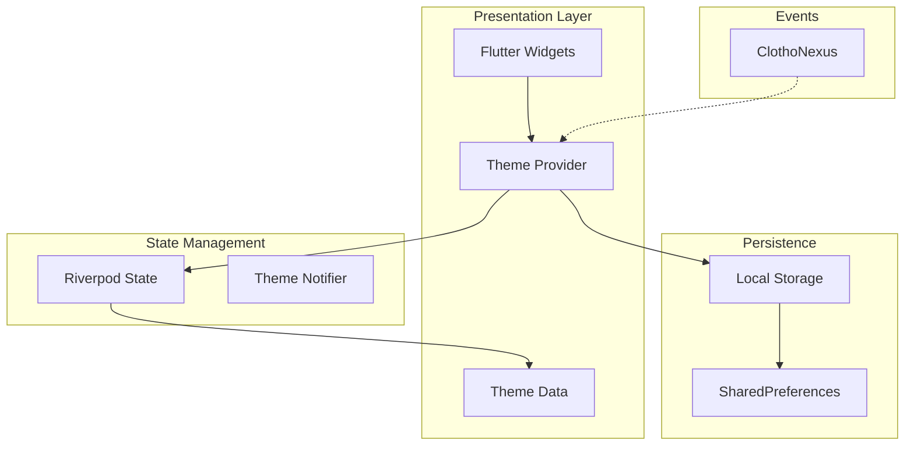

# 主题系统实现 (Theme System Implementation)

**版本**: 1.0.0
**日期**: 2026-02-26
**状态**: Draft
**类型**: Implementation Guide
**作者**: Clotho 架构团队

---

## 1. 概述 (Overview)

本规范定义 Clotho 表现层主题系统的完整实现方案。主题系统是表现层的核心基础设施，为整个应用提供一致的视觉语言和用户体验。

### 1.1 设计目标

| 目标 | 描述 |
|------|------|
| **Material 3 集成** | 基于 Flutter Material 3 构建语义化主题系统 |
| **多主题支持** | 支持深色/浅色模式、自定义主题 |
| **无缝切换** | 支持运行时主题切换，带平滑动画过渡 |
| **状态持久化** | 主题偏好跨会话持久化存储 |
| **动态主题** | 支持运行时动态加载和创建主题 |

### 1.2 核心内容

| # | 内容 | 优先级 |
|---|------|--------|
| 1 | 主题系统概述 | P0 |
| 2 | Material 3 主题 | P0 |
| 3 | 暗黑模式 | P0 |
| 4 | 主题切换 | P0 |
| 5 | 自定义主题 | P1 |
| 6 | 主题持久化 | P0 |
| 7 | 主题动画 | P1 |

---

## 2. 架构设计 (Architecture)

### 2.1 模块关系图



### 2.2 核心组件

| 组件 | 职责 | 位置 |
|------|------|------|
| `ClothoTheme` | 主题数据定义（静态） | `presentation/theme/` |
| `ThemeProvider` | 主题状态管理与切换 | `presentation/providers/` |
| `ThemePersistence` | 主题持久化逻辑 | `infrastructure/storage/` |
| `ThemeEvents` | 主题相关事件定义 | `infrastructure/events/` |

---

## 3. 主题数据模型 (Theme Data Models)

### 3.1 主题模式枚举

```dart
/// 主题模式枚举
enum ThemeMode {
  system,  // 跟随系统
  light,   // 浅色模式
  dark,    // 深色模式
}
```

### 3.2 主题配置模型

```dart
/// 主题配置模型
class ThemeConfig {
  final String id;
  final String name;
  final Color seedColor;
  final Brightness brightness;
  final ThemeExtension? customColors;
  
  const ThemeConfig({
    required this.id,
    required this.name,
    required this.seedColor,
    required this.brightness,
    this.customColors,
  });
  
  ThemeConfig copyWith({
    String? id,
    String? name,
    Color? seedColor,
    Brightness? brightness,
    ThemeExtension? customColors,
  }) {
    return ThemeConfig(
      id: id ?? this.id,
      name: name ?? this.name,
      seedColor: seedColor ?? this.seedColor,
      brightness: brightness ?? this.brightness,
      customColors: customColors ?? this.customColors,
    );
  }
}
```

### 3.3 内置主题

```dart
/// 内置主题集合
class BuiltInThemes {
  BuiltInThemes._();
  
  static const dark = ThemeConfig(
    id: 'clotho-dark',
    name: 'Clotho 深色',
    seedColor: Color(0xFF6750A4),
    brightness: Brightness.dark,
  );
  
  static const light = ThemeConfig(
    id: 'clotho-light',
    name: 'Clotho 浅色',
    seedColor: Color(0xFF6750A4),
    brightness: Brightness.light,
  );
  
  static const ocean = ThemeConfig(
    id: 'ocean',
    name: '海洋',
    seedColor: Color(0xFF0D47A1),
    brightness: Brightness.dark,
  );
  
  static const forest = ThemeConfig(
    id: 'forest',
    name: '森林',
    seedColor: Color(0xFF2E7D32),
    brightness: Brightness.dark,
  );
  
  static const sunset = ThemeConfig(
    id: 'sunset',
    name: '日落',
    seedColor: Color(0xFFE65100),
    brightness: Brightness.dark,
  );
  
  static List<ThemeConfig> get all => [dark, light, ocean, forest, sunset];
  
  static ThemeConfig? findById(String id) {
    try {
      return all.firstWhere((t) => t.id == id);
    } catch (_) {
      return null;
    }
  }
}
```

---

## 4. Material 3 主题构建 (Material 3 Theme Builder)

### 4.1 主题构建器

```dart
import 'package:flutter/material.dart';

/// Clotho 主题构建器
/// 基于 Material 3 ColorScheme.fromSeed 构建语义化主题
class ClothoThemeBuilder {
  ClothoThemeBuilder._();
  
  /// 构建主题数据
  static ThemeData build(ThemeConfig config, Brightness? brightness) {
    final resolvedBrightness = brightness ?? config.brightness;
    
    final scheme = ColorScheme.fromSeed(
      seedColor: config.seedColor,
      brightness: resolvedBrightness,
      // 自定义语义色映射
      primary: _mapSemanticColor(config, 'primary', resolvedBrightness),
      onPrimary: _mapSemanticColor(config, 'onPrimary', resolvedBrightness),
      primaryContainer: _mapSemanticColor(config, 'primaryContainer', resolvedBrightness),
      onPrimaryContainer: _mapSemanticColor(config, 'onPrimaryContainer', resolvedBrightness),
      secondary: _mapSemanticColor(config, 'secondary', resolvedBrightness),
      onSecondary: _mapSemanticColor(config, 'onSecondary', resolvedBrightness),
      secondaryContainer: _mapSemanticColor(config, 'secondaryContainer', resolvedBrightness),
      onSecondaryContainer: _mapSemanticColor(config, 'onSecondaryContainer', resolvedBrightness),
      surface: _mapSemanticColor(config, 'surface', resolvedBrightness),
      onSurface: _mapSemanticColor(config, 'onSurface', resolvedBrightness),
      surfaceContainer: _mapSemanticColor(config, 'surfaceContainer', resolvedBrightness),
      surfaceContainerLow: _mapSemanticColor(config, 'surfaceContainerLow', resolvedBrightness),
      surfaceContainerHigh: _mapSemanticColor(config, 'surfaceContainerHigh', resolvedBrightness),
      error: _mapSemanticColor(config, 'error', resolvedBrightness),
      onError: _mapSemanticColor(config, 'onError', resolvedBrightness),
      outline: _mapSemanticColor(config, 'outline', resolvedBrightness),
      outlineVariant: _mapSemanticColor(config, 'outlineVariant', resolvedBrightness),
    );
    
    return ThemeData(
      useMaterial3: true,
      colorScheme: scheme,
      scaffoldBackgroundColor: scheme.surface,
      // 组件主题配置
      appBarTheme: _buildAppBarTheme(scheme),
      cardTheme: _buildCardTheme(scheme),
      inputDecorationTheme: _buildInputDecorationTheme(scheme),
      navigationRailTheme: _buildNavigationRailTheme(scheme),
      navigationDrawerTheme: _buildNavigationDrawerTheme(scheme),
      listTileTheme: _buildListTileTheme(scheme),
      dividerTheme: _buildDividerTheme(scheme),
      chipTheme: _buildChipTheme(scheme),
      floatingActionButtonTheme: _buildFABTheme(scheme),
    );
  }
  
  static Color _mapSemanticColor(ThemeConfig config, String key, Brightness brightness) {
    // 从 config.customColors 获取自定义颜色映射
    // TODO: 实现自定义颜色映射
    return Colors.transparent;
  }
  
  // --- 组件主题构建方法 ---
  
  static AppBarTheme _buildAppBarTheme(ColorScheme scheme) {
    return AppBarTheme(
      backgroundColor: scheme.surface,
      foregroundColor: scheme.onSurface,
      elevation: 0,
      centerTitle: false,
      titleTextStyle: TextStyle(
        color: scheme.onSurface,
        fontSize: 22,
        fontWeight: FontWeight.w500,
      ),
    );
  }
  
  static CardThemeData _buildCardTheme(ColorScheme scheme) {
    return CardThemeData(
      color: scheme.surfaceContainer,
      elevation: 0,
      shape: RoundedRectangleBorder(
        borderRadius: BorderRadius.circular(12),
      ),
    );
  }
  
  static InputDecorationTheme _buildInputDecorationTheme(ColorScheme scheme) {
    return InputDecorationTheme(
      filled: true,
      fillColor: scheme.surfaceContainerHighest,
      border: OutlineInputBorder(
        borderRadius: BorderRadius.circular(24),
        borderSide: BorderSide.none,
      ),
      contentPadding: const EdgeInsets.symmetric(horizontal: 16, vertical: 12),
    );
  }
  
  static NavigationRailThemeData _buildNavigationRailTheme(ColorScheme scheme) {
    return NavigationRailThemeData(
      backgroundColor: scheme.surface,
      selectedIconTheme: IconThemeData(color: scheme.onSecondaryContainer),
      unselectedIconTheme: IconThemeData(color: scheme.onSurfaceVariant),
      selectedLabelTextStyle: TextStyle(
        color: scheme.onSecondaryContainer,
        fontSize: 12,
      ),
      unselectedLabelTextStyle: TextStyle(
        color: scheme.onSurfaceVariant,
        fontSize: 12,
      ),
      indicatorColor: scheme.secondaryContainer,
    );
  }
  
  static NavigationDrawerThemeData _buildNavigationDrawerTheme(ColorScheme scheme) {
    return NavigationDrawerThemeData(
      backgroundColor: scheme.surface,
      indicatorColor: scheme.secondaryContainer,
    );
  }
  
  static ListTileThemeData _buildListTileTheme(ColorScheme scheme) {
    return ListTileThemeData(
      iconColor: scheme.onSurfaceVariant,
      textColor: scheme.onSurface,
    );
  }
  
  static DividerThemeData _buildDividerTheme(ColorScheme scheme) {
    return DividerThemeData(
      color: scheme.outlineVariant,
      thickness: 1,
    );
  }
  
  static ChipThemeData _buildChipTheme(ColorScheme scheme) {
    return ChipThemeData(
      backgroundColor: scheme.surfaceContainerHighest,
      selectedColor: scheme.secondaryContainer,
      labelStyle: TextStyle(color: scheme.onSurface),
      shape: RoundedRectangleBorder(
        borderRadius: BorderRadius.circular(8),
      ),
    );
  }
  
  static FloatingActionButtonThemeData _buildFABTheme(ColorScheme scheme) {
    return FloatingActionButtonThemeData(
      backgroundColor: scheme.primaryContainer,
      foregroundColor: scheme.onPrimaryContainer,
      elevation: 4,
      shape: RoundedRectangleBorder(
        borderRadius: BorderRadius.circular(16),
      ),
    );
  }
}
```

### 4.2 简化使用

```dart
// 使用内置深色主题
final darkTheme = ClothoThemeBuilder.build(BuiltInThemes.dark, null);

// 使用内置浅色主题
final lightTheme = ClothoThemeBuilder.build(BuiltInThemes.light, null);

// 自定义亮度覆盖
final darkThemeLightMode = ClothoThemeBuilder.build(BuiltInThemes.dark, Brightness.light);
```

---

## 5. 主题状态管理 (Theme State Management)

### 5.1 主题状态

```dart
/// 主题状态
class ThemeState {
  final ThemeMode themeMode;
  final ThemeConfig currentTheme;
  final List<ThemeConfig> customThemes;
  final bool isInitialized;
  
  const ThemeState({
    this.themeMode = ThemeMode.dark,
    required this.currentTheme,
    this.customThemes = const [],
    this.isInitialized = false,
  });
  
  ThemeState copyWith({
    ThemeMode? themeMode,
    ThemeConfig? currentTheme,
    List<ThemeConfig>? customThemes,
    bool? isInitialized,
  }) {
    return ThemeState(
      themeMode: themeMode ?? this.themeMode,
      currentTheme: currentTheme ?? this.currentTheme,
      customThemes: customThemes ?? this.customThemes,
      isInitialized: isInitialized ?? this.isInitialized,
    );
  }
  
  /// 获取当前实际亮度
  Brightness resolveBrightness(BuildContext context) {
    switch (themeMode) {
      case ThemeMode.light:
        return Brightness.light;
      case ThemeMode.dark:
        return Brightness.dark;
      case ThemeMode.system:
        return MediaQuery.platformBrightnessOf(context);
    }
  }
}
```

### 5.2 主题 Notifier

```dart
import 'dart:convert';
import 'package:flutter/material.dart';
import 'package:flutter_riverpod/flutter_riverpod.dart';
import 'package:shared_preferences/shared_preferences.dart';

/// 主题操作
enum ThemeAction {
  modeChanged,
  themeChanged,
  customThemeAdded,
  customThemeRemoved,
}

/// 主题 Notifier
class ThemeNotifier extends StateNotifier<ThemeState> {
  final SharedPreferences _prefs;
  
  // 存储键
  static const _keyThemeMode = 'theme_mode';
  static const _keyCurrentTheme = 'current_theme_id';
  static const _keyCustomThemes = 'custom_themes';
  
  ThemeNotifier(this._prefs) 
      : super(_loadInitialState(_prefs));
  
  /// 加载初始状态
  static ThemeState _loadInitialState(SharedPreferences prefs) {
    final themeModeIndex = prefs.getInt(_keyThemeMode) ?? 2; // 默认深色
    final themeId = prefs.getString(_keyCurrentTheme) ?? 'clotho-dark';
    final customThemes = _loadCustomThemes(prefs);
    
    final themeMode = ThemeMode.values[themeModeIndex];
    final theme = BuiltInThemes.findById(themeId) ?? BuiltInThemes.dark;
    
    return ThemeState(
      themeMode: themeMode,
      currentTheme: theme,
      customThemes: customThemes,
      isInitialized: true,
    );
  }
  
  /// 加载自定义主题
  static List<ThemeConfig> _loadCustomThemes(SharedPreferences prefs) {
    final jsonStr = prefs.getString(_keyCustomThemes);
    if (jsonStr == null) return [];
    
    try {
      final List<dynamic> jsonList = jsonDecode(jsonStr);
      return jsonList.map((json) => ThemeConfig(
        id: json['id'],
        name: json['name'],
        seedColor: Color(json['seedColor']),
        brightness: json['brightness'] == 'dark' ? Brightness.dark : Brightness.light,
      )).toList();
    } catch (_) {
      return [];
    }
  }
  
  /// 切换主题模式
  void setThemeMode(ThemeMode mode) {
    state = state.copyWith(themeMode: mode);
    _prefs.setInt(_keyThemeMode, mode.index);
    _publishThemeEvent(ThemeAction.modeChanged, mode);
  }
  
  /// 切换主题
  void setTheme(ThemeConfig theme) {
    state = state.copyWith(currentTheme: theme);
    _prefs.setString(_keyCurrentTheme, theme.id);
    _publishThemeEvent(ThemeAction.themeChanged, theme);
  }
  
  /// 切换到内置主题
  void setThemeById(String themeId) {
    final theme = BuiltInThemes.findById(themeId) ?? 
                  state.customThemes.firstWhere(
                    (t) => t.id == themeId, 
                    orElse: () => BuiltInThemes.dark,
                  );
    setTheme(theme);
  }
  
  /// 添加自定义主题
  void addCustomTheme(ThemeConfig theme) {
    // 限制自定义主题数量
    if (state.customThemes.length >= 10) {
      return; // 最多 10 个自定义主题
    }
    
    final themes = [...state.customThemes, theme];
    state = state.copyWith(customThemes: themes);
    _saveCustomThemes(themes);
    _publishThemeEvent(ThemeAction.customThemeAdded, theme);
  }
  
  /// 删除自定义主题
  void removeCustomTheme(String themeId) {
    final themes = state.customThemes.where((t) => t.id != themeId).toList();
    state = state.copyWith(customThemes: themes);
    _saveCustomThemes(themes);
    _publishThemeEvent(ThemeAction.customThemeRemoved, themeId);
  }
  
  /// 保存自定义主题列表
  void _saveCustomThemes(List<ThemeConfig> themes) {
    final json = themes.map((t) => {
      'id': t.id,
      'name': t.name,
      'seedColor': t.seedColor.value,
      'brightness': t.brightness == Brightness.dark ? 'dark' : 'light',
    }).toList();
    _prefs.setString(_keyCustomThemes, jsonEncode(json));
  }
  
  /// 发布主题事件到 ClothoNexus
  void _publishThemeEvent(ThemeAction action, dynamic data) {
    // TODO: 集成 ClothoNexus
    // final event = ThemeChangedEvent(
    //   mode: action == ThemeAction.modeChanged ? data : state.themeMode,
    //   config: action == ThemeAction.themeChanged ? data : state.currentTheme,
    // );
    // ClothoNexus.instance.publish(event);
  }
  
  /// 切换到下一个主题（用于快速测试）
  void cycleToNextTheme() {
    final allThemes = [...BuiltInThemes.all, ...state.customThemes];
    final currentIndex = allThemes.indexWhere((t) => t.id == state.currentTheme.id);
    final nextIndex = (currentIndex + 1) % allThemes.length;
    setTheme(allThemes[nextIndex]);
  }
}
```

### 5.3 Riverpod Provider

```dart
/// SharedPreferences Provider
/// 必须在应用根目录注入
final sharedPreferencesProvider = Provider<SharedPreferences>((ref) {
  throw UnimplementedError('必须在应用根目录注入 SharedPreferences');
});

/// 主题 Provider
final themeProvider = StateNotifierProvider<ThemeNotifier, ThemeState>((ref) {
  final prefs = ref.watch(sharedPreferencesProvider);
  return ThemeNotifier(prefs);
});

/// 便捷扩展：获取当前主题数据
final currentThemeDataProvider = Provider<ThemeData>((ref) {
  final themeState = ref.watch(themeProvider);
  // 这里需要传入 context 的 brightness，后续在 Widget 中处理
  return ClothoThemeBuilder.build(themeState.currentTheme, null);
});
```

---

## 6. 主题切换与动画 (Theme Switching & Animation)

### 6.1 应用级主题动画

```dart
import 'package:flutter/material.dart';
import 'package:flutter_riverpod/flutter_riverpod.dart';

/// Clotho 应用入口
class ClothoApp extends ConsumerWidget {
  const ClothoApp({super.key});
  
  @override
  Widget build(BuildContext context, WidgetRef ref) {
    final themeState = ref.watch(themeProvider);
    
    // 根据 themeMode 解析实际 brightness
    Brightness? overrideBrightness;
    if (themeState.themeMode == ThemeMode.system) {
      overrideBrightness = null; // 使用系统亮度
    }
    
    // 构建 ThemeData
    final themeData = ClothoThemeBuilder.build(
      themeState.currentTheme, 
      overrideBrightness,
    );
    
    return AnimatedTheme(
      data: themeData,
      duration: const Duration(milliseconds: 300),
      curve: Curves.easeInOut,
      child: MaterialApp(
        title: 'Clotho',
        debugShowCheckedModeBanner: false,
        theme: themeData,
        home: const HomeScreen(),
      ),
    );
  }
}
```

### 6.2 主题切换 UI 示例

```dart
import 'package:flutter/material.dart';
import 'package:flutter_riverpod/flutter_riverpod.dart';

/// 主题设置页面
class ThemeSettingsPage extends ConsumerWidget {
  const ThemeSettingsPage({super.key});
  
  @override
  Widget build(BuildContext context, WidgetRef ref) {
    final themeState = ref.watch(themeProvider);
    final themeNotifier = ref.read(themeProvider.notifier);
    
    return Scaffold(
      appBar: AppBar(
        title: const Text('主题设置'),
      ),
      body: ListView(
        children: [
          // 主题模式选择
          _buildSectionHeader('主题模式'),
          _buildThemeModeTile(
            context,
            '跟随系统',
            ThemeMode.system,
            themeState.themeMode,
            () => themeNotifier.setThemeMode(ThemeMode.system),
          ),
          _buildThemeModeTile(
            context,
            '浅色模式',
            ThemeMode.light,
            themeState.themeMode,
            () => themeNotifier.setThemeMode(ThemeMode.light),
          ),
          _buildThemeModeTile(
            context,
            '深色模式',
            ThemeMode.dark,
            themeState.themeMode,
            () => themeNotifier.setThemeMode(ThemeMode.dark),
          ),
          
          const Divider(),
          
          // 内置主题选择
          _buildSectionHeader('主题'),
          ...BuiltInThemes.all.map((theme) => _buildThemeTile(
            context,
            theme,
            themeState.currentTheme.id,
            () => themeNotifier.setTheme(theme),
          )),
          
          // 自定义主题
          if (themeState.customThemes.isNotEmpty) ...[
            const Divider(),
            _buildSectionHeader('自定义主题'),
            ...themeState.customThemes.map((theme) => _buildThemeTile(
              context,
              theme,
              themeState.currentTheme.id,
              () => themeNotifier.setTheme(theme),
              onDelete: () => themeNotifier.removeCustomTheme(theme.id),
            )),
          ],
        ],
      ),
    );
  }
  
  Widget _buildSectionHeader(String title) {
    return Padding(
      padding: const EdgeInsets.fromLTRB(16, 16, 16, 8),
      child: Text(
        title,
        style: const TextStyle(
          fontSize: 14,
          fontWeight: FontWeight.w500,
          color: Colors.grey,
        ),
      ),
    );
  }
  
  Widget _buildThemeModeTile(
    BuildContext context,
    String title,
    ThemeMode mode,
    ThemeMode currentMode,
    VoidCallback onTap,
  ) {
    final isSelected = mode == currentMode;
    final colorScheme = Theme.of(context).colorScheme;
    
    return ListTile(
      title: Text(title),
      leading: Icon(
        mode == ThemeMode.system 
            ? Icons.brightness_auto
            : mode == ThemeMode.light
                ? Icons.light_mode
                : Icons.dark_mode,
        color: isSelected ? colorScheme.primary : colorScheme.onSurfaceVariant,
      ),
      trailing: isSelected 
          ? Icon(Icons.check, color: colorScheme.primary)
          : null,
      onTap: onTap,
    );
  }
  
  Widget _buildThemeTile(
    BuildContext context,
    ThemeConfig theme,
    String currentId,
    VoidCallback onTap, {
    VoidCallback? onDelete,
  }) {
    final isSelected = theme.id == currentId;
    final colorScheme = Theme.of(context).colorScheme;
    
    // 预览颜色
    final previewScheme = ColorScheme.fromSeed(
      seedColor: theme.seedColor,
      brightness: theme.brightness,
    );
    
    return ListTile(
      title: Text(theme.name),
      leading: Container(
        width: 40,
        height: 40,
        decoration: BoxDecoration(
          color: previewScheme.primary,
          borderRadius: BorderRadius.circular(8),
          border: isSelected 
              ? Border.all(color: colorScheme.primary, width: 2)
              : null,
        ),
      ),
      trailing: Row(
        mainAxisSize: MainAxisSize.min,
        children: [
          if (isSelected) 
            Icon(Icons.check, color: colorScheme.primary),
          if (onDelete != null)
            IconButton(
              icon: const Icon(Icons.delete_outline),
              onPressed: onDelete,
            ),
        ],
      ),
      onTap: onTap,
    );
  }
}
```

---

## 7. 自定义主题 (Custom Themes)

### 7.1 自定义主题创建器

```dart
/// 自定义主题编辑器
class CustomThemeEditor extends ConsumerStatefulWidget {
  final ThemeConfig? existingTheme;
  
  const CustomThemeEditor({super.key, this.existingTheme});
  
  @override
  ConsumerState<CustomThemeEditor> createState() => _CustomThemeEditorState();
}

class _CustomThemeEditorState extends ConsumerState<CustomThemeEditor> {
  late TextEditingController _nameController;
  late Color _selectedColor;
  late Brightness _brightness;
  
  @override
  void initState() {
    super.initState();
    _nameController = TextEditingController(
      text: widget.existingTheme?.name ?? '',
    );
    _selectedColor = widget.existingTheme?.seedColor ?? Colors.purple;
    _brightness = widget.existingTheme?.brightness ?? Brightness.dark;
  }
  
  @override
  void dispose() {
    _nameController.dispose();
    super.dispose();
  }
  
  @override
  Widget build(BuildContext context) {
    final previewScheme = ColorScheme.fromSeed(
      seedColor: _selectedColor,
      brightness: _brightness,
    );
    
    return Scaffold(
      appBar: AppBar(
        title: Text(widget.existingTheme == null ? '创建主题' : '编辑主题'),
        actions: [
          TextButton(
            onPressed: _saveTheme,
            child: const Text('保存'),
          ),
        ],
      ),
      body: ListView(
        padding: const EdgeInsets.all(16),
        children: [
          // 主题名称
          TextField(
            controller: _nameController,
            decoration: const InputDecoration(
              labelText: '主题名称',
              hintText: '输入主题名称',
            ),
          ),
          
          const SizedBox(height: 24),
          
          // 亮度选择
          const Text('亮度模式'),
          const SizedBox(height: 8),
          SegmentedButton<Brightness>(
            segments: const [
              ButtonSegment(
                value: Brightness.light,
                label: Text('浅色'),
                icon: Icon(Icons.light_mode),
              ),
              ButtonSegment(
                value: Brightness.dark,
                label: Text('深色'),
                icon: Icon(Icons.dark_mode),
              ),
            ],
            selected: {_brightness},
            onSelectionChanged: (selection) {
              setState(() => _brightness = selection.first);
            },
          ),
          
          const SizedBox(height: 24),
          
          // 种子颜色选择
          const Text('主题颜色'),
          const SizedBox(height: 8),
          Wrap(
            spacing: 8,
            runSpacing: 8,
            children: _presetColors.map((color) {
              final isSelected = _selectedColor.value == color.value;
              return GestureDetector(
                onTap: () => setState(() => _selectedColor = color),
                child: Container(
                  width: 48,
                  height: 48,
                  decoration: BoxDecoration(
                    color: color,
                    borderRadius: BorderRadius.circular(8),
                    border: isSelected 
                        ? Border.all(color: Colors.white, width: 3)
                        : null,
                  ),
                  child: isSelected 
                      ? const Icon(Icons.check, color: Colors.white)
                      : null,
                ),
              );
            }).toList(),
          ),
          
          const SizedBox(height: 32),
          
          // 预览
          const Text('预览'),
          const SizedBox(height: 8),
          Card(
            color: previewScheme.surfaceContainer,
            child: Padding(
              padding: const EdgeInsets.all(16),
              child: Column(
                crossAxisAlignment: CrossAxisAlignment.start,
                children: [
                  Text(
                    '标题文本',
                    style: TextStyle(
                      color: previewScheme.onSurface,
                      fontSize: 18,
                      fontWeight: FontWeight.bold,
                    ),
                  ),
                  const SizedBox(height: 8),
                  Text(
                    '这是示例内容文本，展示了主题颜色的预览效果。',
                    style: TextStyle(
                      color: previewScheme.onSurfaceVariant,
                      fontSize: 14,
                    ),
                  ),
                  const SizedBox(height: 16),
                  Row(
                    children: [
                      FilledButton(
                        onPressed: () {},
                        child: const Text('主要按钮'),
                      ),
                      const SizedBox(width: 8),
                      OutlinedButton(
                        onPressed: () {},
                        child: const Text('次要按钮'),
                      ),
                    ],
                  ),
                ],
              ),
            ),
          ),
        ],
      ),
    );
  }
  
  static const _presetColors = [
    Color(0xFF6750A4), // Purple
    Color(0xFF0D47A1), // Blue
    Color(0xFF2E7D32), // Green
    Color(0xFFE65100), // Orange
    Color(0xFFC62828), // Red
    Color(0xFF6A1B9A), // Deep Purple
    Color(0xFF00838F), // Cyan
    Color(0xFF4E342E), // Brown
  ];
  
  void _saveTheme() {
    if (_nameController.text.trim().isEmpty) {
      ScaffoldMessenger.of(context).showSnackBar(
        const SnackBar(content: Text('请输入主题名称')),
      );
      return;
    }
    
    final theme = ThemeConfig(
      id: widget.existingTheme?.id ?? 'custom_${DateTime.now().millisecondsSinceEpoch}',
      name: _nameController.text.trim(),
      seedColor: _selectedColor,
      brightness: _brightness,
    );
    
    final notifier = ref.read(themeProvider.notifier);
    if (widget.existingTheme == null) {
      notifier.addCustomTheme(theme);
    } else {
      // 编辑现有主题
      notifier.removeCustomTheme(widget.existingTheme!.id);
      notifier.addCustomTheme(theme);
    }
    
    Navigator.of(context).pop();
  }
}
```

---

## 8. ClothoNexus 事件集成 (ClothoNexus Events)

### 8.1 主题事件定义

```dart
/// 主题变更事件
class ThemeChangedEvent extends ClothoEvent {
  final ThemeMode? mode;
  final ThemeConfig? config;
  
  ThemeChangedEvent({
    this.mode,
    this.config,
    Map<String, dynamic>? metadata,
  }) : super(metadata: metadata);
  
  @override
  String get eventType => 'theme.changed';
  
  @override
  Map<String, dynamic> toJson() => {
    'eventType': eventType,
    'id': id,
    'timestamp': timestamp,
    'mode': mode?.index,
    'configId': config?.id,
    'configName': config?.name,
    'metadata': metadata,
  };
}

/// 主题事件类型常量
class ThemeEventTypes {
  ThemeEventTypes._();
  
  static const String themeModeChanged = 'theme.mode.changed';
  static const String themeConfigChanged = 'theme.config.changed';
  static const String themeLoaded = 'theme.loaded';
  static const String customThemeAdded = 'theme.custom.added';
  static const String customThemeRemoved = 'theme.custom.removed';
}
```

---

## 9. 实现步骤 (Implementation Steps)

### 阶段 1: 核心基础设施

| 步骤 | 任务 | 依赖 |
|------|------|------|
| 1.1 | 创建主题数据模型（ThemeConfig, ThemeMode） | - |
| 1.2 | 扩展 ClothoThemeBuilder 支持内置主题 | 1.1 |
| 1.3 | 实现 ThemeNotifier 状态管理 | 1.1, 1.2 |
| 1.4 | 集成 SharedPreferences 持久化 | 1.3 |

### 阶段 2: 主题切换功能

| 步骤 | 任务 | 依赖 |
|------|------|------|
| 2.1 | 实现 ThemeMode 切换（深色/浅色/系统） | 1.4 |
| 2.2 | 实现内置主题切换 | 1.4 |
| 2.3 | 添加主题切换动画 | 2.2 |
| 2.4 | 集成 ClothoNexus 事件 | 2.3 |

### 阶段 3: 自定义主题

| 步骤 | 任务 | 依赖 |
|------|------|------|
| 3.1 | 实现自定义主题数据模型 | - |
| 3.2 | 添加自定义主题存储 | 2.4 |
| 3.3 | 实现自定义主题编辑器 UI | 3.2 |
| 3.4 | 添加主题预览功能 | 3.3 |

### 阶段 4: 高级特性

| 步骤 | 任务 | 依赖 |
|------|------|------|
| 4.1 | 实现动态主题加载 | 3.4 |
| 4.2 | 添加主题渐变背景支持 | 3.4 |
| 4.3 | 实现主题色温调节 | 4.1 |
| 4.4 | 添加高对比度模式 | 4.2 |

---

## 10. API 参考 (API Reference)

### 10.1 主题 Provider 使用

```dart
// 读取当前主题状态
final themeState = ref.watch(themeProvider);

// 切换主题模式
ref.read(themeProvider.notifier).setThemeMode(ThemeMode.dark);

// 切换到内置主题
ref.read(themeProvider.notifier).setTheme(BuiltInThemes.ocean);

// 通过 ID 切换主题
ref.read(themeProvider.notifier).setThemeById('ocean');

// 添加自定义主题
ref.read(themeProvider.notifier).addCustomTheme(customTheme);

// 删除自定义主题
ref.read(themeProvider.notifier).removeCustomTheme('my-theme');
```

### 10.2 主题数据使用

```dart
// 在 Widget 中使用当前主题
final theme = Theme.of(context);
final colorScheme = theme.colorScheme;

// 使用语义颜色
Container(
  color: colorScheme.primaryContainer,
  child: Text(
    'Hello',
    style: TextStyle(color: colorScheme.onPrimaryContainer),
  ),
)
```

---

## 11. 性能考虑 (Performance Considerations)

| 优化点 | 策略 |
|--------|------|
| **主题切换** | 使用 AnimatedTheme 避免全量重建 |
| **主题数据缓存** | 预生成 ThemeData 并缓存 |
| **持久化优化** | 异步写入 SharedPreferences |
| **内存管理** | 限制自定义主题数量（最多 10 个） |

---

## 12. 验收标准 (Acceptance Criteria)

- [ ] 深色/浅色/系统主题模式切换正常工作
- [ ] 至少 5 个内置主题可切换
- [ ] 主题切换带 300ms 平滑动画
- [ ] 主题偏好跨应用重启持久化
- [ ] 自定义主题可添加、切换、删除
- [ ] ClothoNexus 事件正确发布
- [ ] 代码示例可运行

---

**关联文档**:
- [`02-color-theme.md`](./02-color-theme.md) - 颜色主题基础规范
- [`01-design-tokens.md`](./01-design-tokens.md) - 设计令牌系统
- [`infrastructure/clotho-nexus-events.md`](../infrastructure/clotho-nexus-events.md) - 事件总线
- [`presentation/clotho-nexus-integration.md`](./clotho-nexus-integration.md) - 表现层事件集成
- [`08_demo/lib/theme/app_theme.dart`](../../08_demo/lib/theme/app_theme.dart) - 演示应用主题

---

**最后更新**: 2026-02-26
**文档状态**: Draft