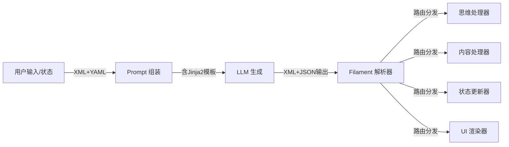

# 协议与格式文档目录

**定位**: 系统间通信的标准化协议
**目标读者**: 协议开发者、集成工程师
**文档状态**: Active (2026-04-03)

> 术语体系参见 [naming-convention.md](../naming-convention.md)

---

## 📖 目录简介

本目录包含 Clotho 系统的通信协议和数据格式规范。核心是 **Filament 协议**，它仅作用于 **Clotho 与 LLM 的边界接口**，系统内部组件之间使用 Dart 原生对象直接通信，不经过 Filament 转换。

> **唯一事实来源**: Filament 的标签名称、语法基线、版本基线与兼容策略统一由 [`filament-canonical-spec.md`](filament-canonical-spec.md) 定义。其他文档只负责说明实现、输入、输出、解析与扩展机制。

## 📚 文档列表

### 1. Filament Canonical Spec

- **文件**: [`filament-canonical-spec.md`](filament-canonical-spec.md)
- **简介**: Filament 协议的唯一事实来源，定义 canonical 标签、语法、版本基线和兼容策略。
- **核心内容**: 协议边界、`Filament Spec 3.0.0`、canonical tags、strict/compat 模式、legacy 映射
- **阅读建议**: **所有人优先阅读**

### 2. Filament 协议概述

- **文件**: [`filament-protocol-overview.md`](filament-protocol-overview.md)
- **简介**: Filament 协议的整体定位与阅读导航。
- **核心内容**: 协议边界、设计摘要、文档关系图
- **阅读建议**: 理解协议的整体设计理念和基本原则
- **关联文档**: 输入格式 [`filament-input-format.md`](filament-input-format.md)，输出格式 [`filament-output-format.md`](filament-output-format.md)

### 3. 输入格式 (XML+YAML)

- **文件**: [`filament-input-format.md`](filament-input-format.md)
- **简介**: 输入侧块组织、规范化和 Jinja2 集成说明。
- **核心内容**: 输入块推荐命名、YAML 规范化、模板渲染边界
- **阅读建议**: 了解如何为 LLM 构建结构化的输入 Prompt
- **关联文档**: Jinja2 宏系统 [`jinja2-macro-system.md`](jinja2-macro-system.md)，输出格式 [`filament-output-format.md`](filament-output-format.md)

### 4. Schema 库规范 (Schema Library)

- **文件**: [`schema-library.md`](schema-library.md)
- **简介**: 协议库的存储、引用和注入机制，旨在解决 Prompt 复用和维护问题。
- **核心内容**: Schema YAML 存储格式、静态与动态引用、与 canonical tags 的映射
- **阅读建议**: 了解如何标准化管理和注入复杂的逻辑规则（如状态更新、直播间格式）
- **关联文档**: Schema YAML 示例标准库 [`schema-yaml-standard-library/README.md`](schema-yaml-standard-library/README.md)，Jacquard 编排层 [`../jacquard/README.md`](../jacquard/README.md)

### 5. Schema YAML 示例标准库

- **文件**: [`schema-yaml-standard-library/README.md`](schema-yaml-standard-library/README.md)
- **简介**: 提供一套与 `data/schemas/` 镜像的 YAML 示例库，便于直接复制和裁剪。
- **核心内容**: `core / extensions / modes / overrides` 样例文件、字段模型、使用建议
- **阅读建议**: 当需要新增或重构 Schema 时，先从这里复制最接近的样例再改
- **关联文档**: Schema 库规范 [`schema-library.md`](schema-library.md)，Schema Injector [`../jacquard/schema-injector.md`](../jacquard/schema-injector.md)

### 6. Jinja2 宏系统

- **文件**: [`jinja2-macro-system.md`](jinja2-macro-system.md)
- **简介**: Clotho 的模板引擎系统，用于动态提示词构建和安全的逻辑控制。
- **核心内容**: 凯撒原则下的模板渲染、宏分类与规范、安全沙箱、迁移映射表
- **阅读建议**: 了解如何将 SillyTavern 的 EJS 逻辑迁移到 Jinja2 模板
- **关联文档**: 输入格式 [`filament-input-format.md`](filament-input-format.md)，工作流目录 [`../workflows/`](../workflows/)

### 7. 输出格式 (XML+JSON)

- **文件**: [`filament-output-format.md`](filament-output-format.md)
- **简介**: 输出端的落地约束、富文本渲染和扩展标签使用建议。
- **核心内容**: 文本标签渲染规则、structured tags 使用建议、legacy 迁移
- **阅读建议**: 了解 LLM 应如何格式化输出，以及系统如何解析这些输出
- **关联文档**: 解析流程 [`filament-parsing-workflow.md`](filament-parsing-workflow.md)，Jacquard 编排层 [`../jacquard/README.md`](../jacquard/README.md)

### 8. 解析流程

- **文件**: [`filament-parsing-workflow.md`](filament-parsing-workflow.md)
- **简介**: Filament 协议的实时流式解析机制，包括路由分发和错误处理。
- **核心内容**: ESR、strict/compat 模式、alias 归一化、容错与重整
- **阅读建议**: 了解系统如何实时解析 LLM 的流式输出并分发到相应处理器
- **关联文档**: 输出格式 [`filament-output-format.md`](filament-output-format.md)，Jacquard 编排层 [`../jacquard/README.md`](../jacquard/README.md)

### 9. 跨模块接口契约草案

- **文件**: [`cross-module-interface-contracts.md`](cross-module-interface-contracts.md)
- **简介**: 汇总 Schema Injector、Filament Parser、JacquardUIAdapter 三者之间的边界与 blackboard 契约。
- **核心内容**: 统一接口契约表、blackboard key 标准、Parser 初始化契约、待裁决项
- **阅读建议**: 当需要同时调整协议、解析器和 UI 代理边界时优先查阅
- **关联文档**: 接口定义 [`interface-definitions.md`](interface-definitions.md)，Schema Injector [`../jacquard/schema-injector.md`](../jacquard/schema-injector.md)，解析流程 [`filament-parsing-workflow.md`](filament-parsing-workflow.md)

## 🔗 协议架构关系

## 🧭 导航指南

### 从哪里开始？

如果您是**协议开发者**：

1. 按顺序阅读本目录的所有文档：canonical spec → 概述 → 输入格式 → Schema 库规范 → Schema YAML 示例标准库 → Jinja2 宏系统 → 输出格式 → 解析流程
2. 重点关注协议版本演进和兼容性要求

如果您是**集成工程师**：

1. 先阅读 [`filament-canonical-spec.md`](filament-canonical-spec.md) 确认协议基线
2. 再阅读 [`filament-protocol-overview.md`](filament-protocol-overview.md) 了解整体设计
2. 根据需要查阅输入格式或输出格式的具体规范

如果您是**迁移工程师**：

1. 重点阅读 [`jinja2-macro-system.md`](jinja2-macro-system.md) 了解模板迁移
2. 查阅工作流目录 [`../workflows/`](../workflows/) 中的迁移指南

### 相邻目录

- **Jacquard 编排层** ([`../jacquard/`](../jacquard/)): 协议在编排层中的应用
- **Mnemosyne 数据引擎** ([`../mnemosyne/`](../mnemosyne/)): 协议在数据引擎中的应用
- **工作流与处理** ([`../workflows/`](../workflows/)): 使用协议的具体业务流程
- **运行时环境** ([`../runtime/`](../runtime/)): 协议在运行时环境中的应用
- **参考文档** ([`../reference/`](../reference/)): 协议相关的技术参考

## 📝 文档更新记录

| 日期 | 版本 | 变更说明 |
|------|------|----------|
| 2026-04-03 | 3.0.0 | 新增 canonical spec，协议文档改为“引用规范，不重复定义” |
| 2025-12-30 | 2.0.0 | 文档重组，将原始 Filament 协议文档拆分为 5 个专题文件 |
| 2025-12-28 | 2.3.0 | Filament 协议 v2.3 版本，增强 Jinja2 宏系统支持 |
| 2025-12-23 | 1.0.0 | 原始文档创建 |

---

**最后更新**: 2026-04-03
**维护者**: Clotho 协议团队
