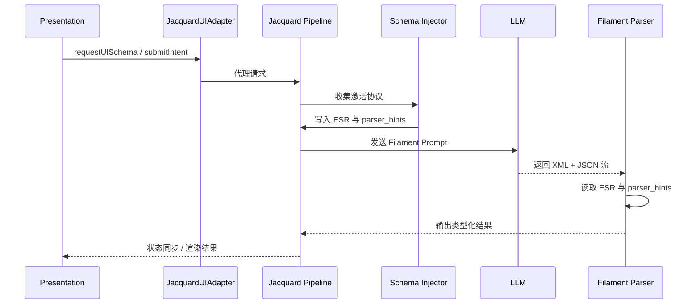

# 跨模块接口契约草案 (Cross-Module Interface Contracts)

**版本**: 1.0.0
**日期**: 2026-04-03
**状态**: Draft
**作者**: Clotho 协议团队
**关联文档**:
- [`filament-canonical-spec.md`](filament-canonical-spec.md) - Filament 协议唯一事实来源
- [`filament-parsing-workflow.md`](filament-parsing-workflow.md) - Parser 的 ESR 与路由规则
- [`interface-definitions.md`](interface-definitions.md) - `JacquardUIAdapter` 正式接口
- [`../jacquard/schema-injector.md`](../jacquard/schema-injector.md) - Schema Injector 组件规范
- [`../jacquard/plugin-architecture.md`](../jacquard/plugin-architecture.md) - Jacquard Blackboard 协作面
- [`../presentation/README.md`](../presentation/README.md) - Presentation 层边界原则
- [`../workflows/post-generation-processing.md`](../workflows/post-generation-processing.md) - 生成后处理工作流

---

> 术语体系参见 [`../naming-convention.md`](../naming-convention.md)。

## 1. 文档定位

本文档用于**收口 Schema Injector、Filament Parser、JacquardUIAdapter 三者之间的跨模块接口契约**，解决规范分散在不同目录、不同文档中时的阅读与对齐成本。

本文档的职责仅限于：

1. 汇总跨模块边界
2. 统一 blackboard key 约定
3. 收口输入输出责任
4. 标记现阶段仍待裁决的漂移项

本文档**不重新定义**以下内容：

1. Filament 的 canonical 标签与 JSON 语法
2. `JacquardUIAdapter` 的完整 Dart 类定义
3. 各子模块的内部实现细节

上述定义仍分别以 [`filament-canonical-spec.md`](filament-canonical-spec.md)、[`interface-definitions.md`](interface-definitions.md)、[`../jacquard/schema-injector.md`](../jacquard/schema-injector.md) 为准。

---

## 2. 作用边界

跨模块协作在本议题下分为两类边界：

| 边界 | 是否使用 Filament | 正式协作介面 | 说明 |
|------|------------------|-------------|------|
| `LLM ↔ Jacquard` | 是 | Filament (`XML + YAML` 输入，`XML + JSON` 输出) | 协议边界，由 Schema Injector 与 Parser 参与 |
| `Presentation ↔ Jacquard` | 否 | `JacquardUIAdapter` | 应用内对象边界，不经过 Filament |
| `Jacquard 插件 ↔ Jacquard 插件` | 否 | `JacquardContext.blackboard` | 内部临时协作面，仅传递非持久化中间产物 |
| `Presentation ↔ Mnemosyne` | 否 | 禁止直连 | 必须经 Jacquard 代理 |

---

## 3. 统一接口契约表

| 模块 | 所属边界 | 核心职责 | 直接输入 | blackboard 读取 | blackboard 写入 | 直接输出 | 下游消费者 |
|------|----------|----------|----------|-----------------|-----------------|----------|------------|
| `Schema Injector` | Jacquard 内部插件协作 + LLM 输入准备 | 激活协议、加载 Schema、生成 ESR 与 Parser 元数据、向 Prompt 注入协议块 | Pattern 静态 `protocols`、`<use_protocol>`、Planner 协议意图、Schema Library YAML | 无强制标准输入键 | `expected_structure_registry`、`parser_hints`、`active_schemas` | 注入后的协议块、Parser 初始化所需注册信息 | `Template Renderer`、`Filament Parser` |
| `Filament Parser` | `LLM ↔ Jacquard` 输出解析边界 | 解析 XML 标签流、执行 ESR 校验、兼容 alias、容错并路由类型化结果 | LLM Raw Token Stream、Filament canonical tags | `expected_structure_registry`、`parser_hints` | 无稳定标准输出键 | `content`、`thought`、`state_update`、`choice`、`status_bar`、`ui_component`、`tool_call` 等类型化结果 | UI 渲染器、State Updater、Tool Runtime、Turn Accumulator |
| `JacquardUIAdapter` | `Presentation ↔ Jacquard` 应用内接口 | 代理 UI 读取 Schema 投影、数据投影、提交 Intent、订阅状态同步 | UI request objects | 不使用 | 不使用 | `UISchemaResponse`、`DataProjectionResponse`、`IntentSubmitResponse`、状态同步流 | `Inspector`、`InputDraftController`、其他 UI 组件 |

---

## 4. 输入输出契约

### 4.1 Schema Injector

| 项 | 契约 |
|----|------|
| 输入源 | `Pattern.configuration.protocols`、`<use_protocol>`、Planner 协议意图、Schema YAML |
| 输入语义 | “本轮允许哪些协议生效，以及它们如何扩展 Prompt 与 Parser” |
| 输出一 | 写入 `expected_structure_registry`，声明当前轮合法标签集与结构约束 |
| 输出二 | 写入 `parser_hints`，提供标签级处理提示 |
| 输出三 | 生成协议块并交给 Prompt 组装链路消费 |

### 4.2 Filament Parser

| 项 | 契约 |
|----|------|
| 输入源 | LLM 输出流 |
| 输入格式 | `XML + JSON`，语法以 canonical spec 为准 |
| 初始化依赖 | 从 blackboard 读取 `expected_structure_registry` 与 `parser_hints` |
| 输出形式 | 类型化处理结果，而非“原始 XML 透传” |
| 输出去向 | UI 渲染、状态更新、工具调用、回合数据累积 |

### 4.3 JacquardUIAdapter

| 项 | 契约 |
|----|------|
| 输入源 | Presentation 层 request objects |
| 输入意图 | 查询 UI Schema、查询数据投影、提交 Intent、订阅状态同步 |
| 输出形式 | Dart response objects 或 `Stream<Map<String, dynamic>>` |
| 约束 | 不读写 blackboard；不暴露 Mnemosyne 直连；不接受 Filament XML/JSON 作为接口形态 |

---

## 5. Blackboard 键统一规范

### 5.1 命名规则

所有标准 blackboard key 必须满足：

1. 使用 `lower_snake_case`
2. 以“共享产物语义”命名，而非实现类名命名
3. 仅用于 Jacquard 内部插件协作
4. 不向 Presentation 层直接暴露

以下命名不应继续扩散：

- `schema_parser_hints`

统一命名为：

- `parser_hints`

### 5.2 标准键表

| Key | 写入者 | 读取者 | 类型 | 用途 |
|-----|--------|--------|------|------|
| `scheduler_injects` | Scheduler | Skein Builder | `List<PromptBlock>` | 定时/事件驱动注入块 |
| `rag_assets` | RAG Retriever | Skein Builder | `List<FloatingAsset>` | 检索出的浮动资产 |
| `expected_structure_registry` | Schema Injector | Filament Parser | `Map<String, dynamic>` | 当前轮合法标签集、拓扑、cardinality、policies |
| `parser_hints` | Schema Injector | Filament Parser | `Map<String, dynamic>` | 标签级处理提示、根标签、组件附加信息、流式支持 |
| `active_schemas` | Schema Injector | 调试、诊断或日志链路 | `List<String>` | 当前轮已激活 Schema 列表 |

### 5.3 Typed Channel 规范

以下共享产物不属于 blackboard，而通过强类型上下文传递：

| Channel | 写入者 | 读取者 | 类型 | 用途 |
|---------|--------|--------|------|------|
| `plannerContext.weavingGuide` | Planner | Skein Builder | `WeavingGuide` | 编织指导信息 |

### 5.4 Blackboard 作用域规则

| 规则 | 说明 |
|------|------|
| 内部性 | blackboard 仅属于 Jacquard 插件协作面 |
| 临时性 | blackboard 仅承载非持久化中间产物 |
| 单轮性 | 除非显式复制，blackboard 数据默认仅在当前流水线轮次有效 |
| 非权威性 | blackboard 不是状态真源，不替代 Mnemosyne |

---

## 6. Parser 初始化契约

Filament Parser 初始化时，必须按以下顺序建立标签路由：

1. 注册 core tags：`thought`、`content`
2. 读取 `expected_structure_registry.expected_tags`
3. 结合 `parser_hints` 注册 extension 或 mode tags
4. 依据 ESR 的 `topology`、`cardinality`、`policies` 启用校验与容错

参考初始化形态如下：

```dart
void initialize(JacquardContext context) {
  final esr = context.blackboard['expected_structure_registry'];
  final parserHints = context.blackboard['parser_hints'];

  _registerCoreTags(['thought', 'content']);
  _registerExtensions(esr['expected_tags'], parserHints);
}
```

### 6.1 ESR 最小契约

`expected_structure_registry` 至少应包含：

```json
{
  "version": "2.5",
  "expected_tags": ["thought", "content", "state_update", "choice"],
  "topology": {
    "sequence": ["thought", "state_update", "content", "choice"]
  },
  "cardinality": {
    "mandatory": ["content"],
    "optional": ["thought", "state_update", "choice"]
  },
  "policies": {
    "missing_start": "inject_content",
    "out_of_order": "degrade_to_text",
    "unclosed_tag": "auto_close",
    "unknown_tag": "treat_as_text"
  }
}
```

### 6.2 `parser_hints` 最小契约

`parser_hints` 至少应支持以下字段语义：

| 字段 | 含义 |
|------|------|
| `root_tag` | 该协议实际注册的根标签名 |
| `required_fields` | 结构化 JSON body 的必需字段提示 |
| `streaming` / `streaming_support` | 是否允许流式增量处理 |
| `component_type` | UI 相关标签的组件类型提示 |
| `partial_tag` | 流式分块标签名（如存在） |

---

## 7. Presentation 侧适配器契约

`JacquardUIAdapter` 是 Presentation 层访问 Jacquard 的唯一正式数据入口。

### 7.1 方法面

| 方法 | 输入 | 输出 | 说明 |
|------|------|------|------|
| `requestUISchema` | `UISchemaRequest` | `UISchemaResponse` | 查询指定状态路径的 UI Schema 投影 |
| `requestDataProjection` | `DataProjectionRequest` | `DataProjectionResponse` | 查询指定路径的数据投影 |
| `submitIntent` | `IntentSubmitRequest` | `IntentSubmitResponse` | 将 UI 交互转化为 Jacquard 可处理 Intent |
| `onStateSync` | 无 | `Stream<Map<String, dynamic>>` | 订阅状态同步事件 |

### 7.2 输入输出边界

| 规则 | 说明 |
|------|------|
| UI 不直接读 Mnemosyne | 必须经 Jacquard 代理 |
| UI 不直接写 Mnemosyne | 必须通过 `submitIntent` |
| UI 不读 blackboard | blackboard 仅供 Jacquard 内部插件使用 |
| UI 不消费原始 Filament | UI 只消费经 Parser/Jacquard 归一化后的结果 |

---

## 8. 统一时序视图



---

## 9. 已收口决议

### 9.1 Schema Injector 的 Skein 修改权限

`Schema Injector` 被定义为 **post-build prompt-shaping 组件**，允许直接向已构建 Skein 注入协议块。
这是一条显式例外规则，不适用于 Scheduler、RAG Retriever 等 `preparation` 阶段注入组件。

### 9.2 `expected_structure_registry` 的标准地位

`expected_structure_registry` 已提升为 Jacquard 标准 blackboard key。
其职责是向 Parser 提供当前轮次的合法标签集、拓扑约束、cardinality 与容错策略。

### 9.3 `weavingGuide` 的归属层级

编织指导统一归属于 `PlannerContext`，正式访问路径为：

```dart
context.plannerContext.weavingGuide
```

`weavingGuide` 不再视为 blackboard 标准键。

### 9.4 `state_update` 的 `required_fields` 统一

canonical spec 采用 JSON Patch 风格：

```json
{
  "ops": [
    { "op": "replace", "path": "/character/mood", "value": "happy" }
  ]
}
```

因此 `parser_hints.required_fields` 统一使用顶层字段：

```json
["ops"]
```

嵌套的 `ops[].op / path / value` 约束继续以 canonical spec 为准，不再使用 `operation` 命名。

---

## 10. 收口结果

本草案对应的文档收口已落实到以下来源文档：

1. [`../jacquard/plugin-architecture.md`](../jacquard/plugin-architecture.md)
2. [`../jacquard/schema-injector.md`](../jacquard/schema-injector.md)
3. [`../jacquard/README.md`](../jacquard/README.md)
4. [`../jacquard/planner-component.md`](../jacquard/planner-component.md)
5. [`../jacquard/skein-and-weaving.md`](../jacquard/skein-and-weaving.md)
6. [`../jacquard/preset-system.md`](../jacquard/preset-system.md)

---

## 11. 相关阅读

- [`filament-canonical-spec.md`](filament-canonical-spec.md)
- [`filament-parsing-workflow.md`](filament-parsing-workflow.md)
- [`interface-definitions.md`](interface-definitions.md)
- [`../jacquard/schema-injector.md`](../jacquard/schema-injector.md)
- [`../jacquard/plugin-architecture.md`](../jacquard/plugin-architecture.md)
- [`../presentation/README.md`](../presentation/README.md)

---

**最后更新**: 2026-04-03
**维护者**: Clotho 协议团队
