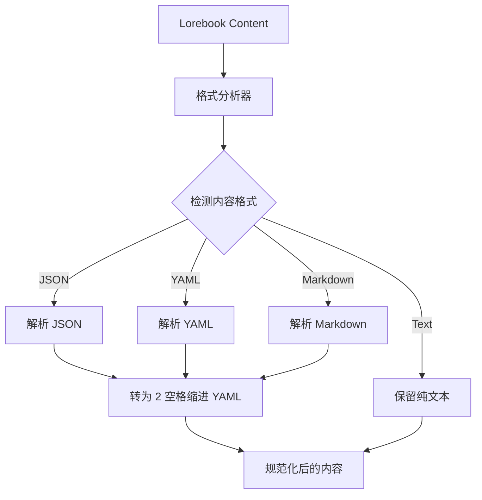

# 输入格式：XML+YAML (Input Format: XML+YAML)

**版本**: 2.3.0  
**日期**: 2025-12-28  
**状态**: Draft  
**作者**: 资深系统架构师 (Architect Mode)  
**关联文档**:

- 概述 [`filament-protocol-overview.md`](filament-protocol-overview.md)
- Jinja2 宏系统 [`jinja2-macro-system.md`](jinja2-macro-system.md)
- 输出格式 [`filament-output-format.md`](filament-output-format.md)
- 解析流程 [`filament-parsing-workflow.md`](filament-parsing-workflow.md)

---

## 概述 (Introduction)

Filament 协议的输入端采用 **XML + YAML** 格式构建结构化提示词。XML 标签提供骨架和语义边界，YAML 则用于描述数据内容。这种设计既保证了 LLM 对内容层级的清晰理解，又通过 YAML 的低 Token 消耗提高了效率。

## 基础数据块格式 (Basic Block Format)

Jacquard 使用 Filament 格式组装最终的 Prompt，确保 LLM 清晰感知不同信息的语义边界。

### 示例 (Example)

```xml
<system_instruction>
role: Dungeon Master
tone: Dark Fantasy
rules:
  - strict_physics
  - permadeath
</system_instruction>

<character_card>
name: Seraphina
class: Mage
attributes:
  int: 18
  str: 4
</character_card>

<world_state>
location: Ancient Ruins
time: Midnight
weather: Stormy
</world_state>
```

## 世界书条目格式 (Lorebook Entry Format)

世界书条目在导入时会经过**格式规范化**处理，统一转换为 **"XML 包裹 YAML"** 格式：

```xml
<location_forest>
  name: Dark Forest
  atmosphere: Eerie, misty
  creatures:
    - Shadow Wolves
    - Forest Spirits
  loot:
    - Ancient Bark
    - Moon Petals
</location_forest>
```

### 格式转换规则 (Format Conversion Rules)

| 原始格式 | 检测特征 | 转换目标 | 备注 |
|----------|----------|----------|------|
| **JSON** | `{...}`, `[...]` | **保留 XML 标签，内部 JSON 转为 2 空格缩进的 YAML** | 保留 `<Soyo>` 等语义标签 |
| **YAML** | `key: value` | **保留 XML 标签，统一内部缩进为 2 空格** | 保证缩进一致性 |
| **Markdown** | `-`, `*`, `#` 等 | **尽力将列表、标题等结构转换为 YAML 格式** | 转换失败时保留原始文本 |

## 标签语义体系 (Tag Semantics)

### 顶层结构标签 (Top-Level Structure Tags)

| 标签 | 用途 | 示例 |
|------|------|------|
| `<system_instruction>` | 系统级指令和规则 | 角色扮演规则、输出格式要求 |
| `<character_card>` | **织谱 (Pattern) 定义** | 姓名、性格、外貌、背景 (对应 L2 Pattern) |
| `<world_state>` | 当前世界状态 | 位置、时间、环境 |
| `<lorebook_entry>` | 世界书条目 | 设定、规则、背景知识 |
| `<conversation_history>` | 对话历史 | 历史消息列表 |
| `<use_protocol>` | **引用协议 Schema** (v2.1) | 动态加载 Schema 库中的定义。详见 [Schema 库规范](schema-library.md) |

### 元数据标签 (Metadata Tags)

| 标签 | 用途 | 示例 |
|------|------|------|
| `<block>` | 标记文本块边界 | `<block role="system">...</block>` |
| `<format>` | 格式化指令 | `<format type="yaml">...</format>` |
| `<priority>` | 优先级标记 | `<priority level="high">...</priority>` |

## 与 Jinja2 宏系统的集成

Filament 协议与 Clotho 的 **Jinja2 宏系统** 紧密集成，实现了动态提示词构建和安全的模板渲染。关于宏系统的完整规范，请参阅 **[Jinja2 宏系统文档](jinja2-macro-system.md)**。

### 分工原则 (Division of Responsibilities)

- **Filament XML (`<thought>`, `<content>`, `<variable_update>`)**: 作为 LLM 输出的结构骨架，用于解析意图和边界
- **Jinja2 逻辑 (``, `{{ var }}`)**: 完全接管输入端的逻辑控制，在发送给 LLM 前被渲染为纯文本

### 核心差异：模板渲染 vs 脚本执行

| 特性 | SillyTavern | Clotho (Jinja2) |
|------|-------------|----------------|
| 执行方式 | 正则替换 + JS `eval` | TemplateRenderer (模板渲染) |
| 逻辑控制 | 分散且不安全 | 由 Jinja2 接管 |
| 结构支撑 | 混合 | XML 作为结构骨架，Jinja2 处理逻辑 |
| 输出纯净度 | 可能残留标签 | 完全渲染为纯文本 |

## 格式规范化流程 (Normalization Workflow)



## 最佳实践 (Best Practices)

1. **保持 YAML 简洁**: YAML 应专注于描述数据，避免复杂的嵌套结构。
2. **使用 Schema Library**: 避免将复杂的逻辑规则（如 `<UpdateVariable>` 的具体格式）直接写在 System Prompt 中，应使用 [Schema 库规范](schema-library.md) 进行管理，通过 Character Card 的 `protocols` 字段引用。
3. **善用 `<use_protocol>`**: 仅在运行时动态需要某种模式时使用此标签。
4. **标签语义化**: 使用有意义的标签名称，如 `<location_forest>` 而非 `<entry>`。
5. **缩进一致**: 统一使用 2 空格缩进，确保 YAML 的可读性。

## 相关阅读

- **[Jinja2 宏系统](jinja2-macro-system.md)**: 深入了解模板引擎和宏映射
- **[输出格式](filament-output-format.md)**: 了解 LLM 输出的标签体系
- **[工作流与处理](../workflows/README.md)**: 查看实际应用中如何使用这些格式

---

**最后更新**: 2025-12-28  
**维护者**: Clotho 协议团队
