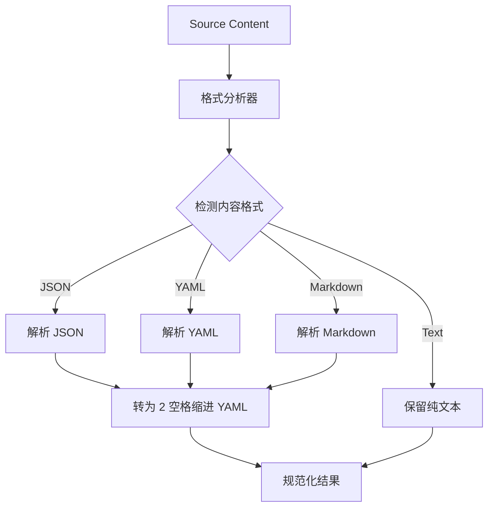

# 输入格式：XML+YAML (Input Format: XML+YAML)

**版本**: 3.0.0
**日期**: 2026-04-03
**状态**: Active
**作者**: Clotho 协议团队
**关联文档**:

- Canonical 规范 [`filament-canonical-spec.md`](filament-canonical-spec.md)
- 协议概述 [`filament-protocol-overview.md`](filament-protocol-overview.md)
- Jinja2 宏系统 [`jinja2-macro-system.md`](jinja2-macro-system.md)
- Schema 库规范 [`schema-library.md`](schema-library.md)

> 术语体系参见 [naming-convention.md](../naming-convention.md)

---

## 1. 文档角色

本文档不再重复定义 Filament 的 canonical 标签与版本基线。

**输入端的唯一语法基线，请参阅 [`filament-canonical-spec.md`](filament-canonical-spec.md)。**

本文档只补充三类实现信息：

1. Jacquard 如何组织输入块
2. 导入内容如何规范化为 XML + YAML
3. 输入侧如何与 Jinja2 宏系统协作

---

## 2. 输入块组织方式

在 `strict` 模式下，输入端使用统一封套：

```xml
<filament_input version="3.0">
  ...
</filament_input>
```

Jacquard 组装 Prompt 时，推荐使用以下保留块名：

| 标签 | 用途 | Body 格式 |
|------|------|-----------|
| `<system_instruction>` | 系统规则、风格、输出要求 | YAML |
| `<persona>` | Persona / 角色设定投影 | YAML |
| `<world_state>` | 当前世界状态快照 | YAML |
| `<lorebook_entry>` | 世界书条目 | YAML 或纯文本 |
| `<conversation_history>` | 历史对话 | YAML 或纯文本 |
| `<use_protocol>` | 动态启用扩展协议 | 纯文本 |

> 这些输入块是 **输入端推荐语义块**，不是输出解析阶段的 core tags。

### 示例

```xml
<filament_input version="3.0">
  <system_instruction>
role: Dungeon Master
tone: dark_fantasy
rules:
  - strict_physics
  - permadeath
  </system_instruction>

  <persona>
name: Seraphina
class: Mage
attributes:
  int: 18
  str: 4
  </persona>

  <world_state>
location: Ancient Ruins
time: Midnight
weather: Stormy
  </world_state>
</filament_input>
```

---

## 3. 规范化策略

导入内容进入 Jacquard 之前，应尽量被规范化为“XML 包裹 YAML”的一致形式。

### 3.1 规范化规则

| 原始格式 | 检测特征 | 规范化目标 |
|----------|----------|------------|
| JSON | `{...}`, `[...]` | 转为 2 空格缩进 YAML |
| YAML | `key: value` | 保持 YAML，统一缩进 |
| Markdown | 列表、标题、分段文本 | 尽力提升为 YAML；失败则保留文本 |
| Plain Text | 无结构文本 | 保留纯文本 |

### 3.2 世界书条目示例

```xml
<lorebook_entry>
name: Dark Forest
atmosphere: Eerie, misty
creatures:
  - Shadow Wolves
  - Forest Spirits
loot:
  - Ancient Bark
  - Moon Petals
</lorebook_entry>
```

### 3.3 规范化流程


```mermaid
graph TD
    Content[Source Content] --> Analyzer[格式分析器]
    Analyzer --> Detect{检测内容格式}

    Detect -- JSON --> ParseJSON[解析 JSON]
    Detect -- YAML --> ParseYAML[解析 YAML]
    Detect -- Markdown --> ParseMD[解析 Markdown]
    Detect -- Text --> KeepText[保留纯文本]

    ParseJSON --> Normalize[转为 2 空格缩进 YAML]
    ParseYAML --> Normalize
    ParseMD --> Normalize
    Normalize --> Final[规范化结果]
    KeepText --> Final
```

---

## 4. 与 Jinja2 的职责边界

Filament 输入端与 Jinja2 宏系统协作，但职责不同：

| 组件 | 职责 |
|------|------|
| Filament XML | 提供结构边界与块级语义 |
| YAML | 提供低 token 成本的数据描述 |
| Jinja2 | 提供输入端的动态逻辑控制与模板渲染 |

### 4.1 分工原则

- **Filament 输入块** 负责组织上下文
- **Jinja2 逻辑** 负责在发送给 LLM 前完成变量替换、条件裁剪和片段拼装
- **LLM 输出标签** 的 canonical 定义不在本文档中维护，统一由 canonical spec 定义

### 4.2 模板渲染约束

1. Jinja2 运行在受限模板环境中
2. 模板渲染不得直接修改 Mnemosyne 状态
3. 渲染结果必须在发送前变为纯文本

---

## 5. 最佳实践

1. YAML 只描述数据，不要在其中堆叠复杂控制逻辑。
2. 需要启用协议扩展时，优先使用 `<use_protocol>` 或角色配置中的 `protocols` 字段。
3. 统一使用 2 空格缩进。
4. 尽量让输入块名表达清晰语义，不要滥用泛化标签。
5. 如果某项规则属于输出约束或动作协议，不要在输入文档中重新定义，直接链接到 canonical spec。

---

## 6. 相关阅读

- [`filament-canonical-spec.md`](filament-canonical-spec.md)
- [`jinja2-macro-system.md`](jinja2-macro-system.md)
- [`schema-library.md`](schema-library.md)
- [`../workflows/prompt-processing.md`](../workflows/prompt-processing.md)

---

**最后更新**: 2026-04-03
**维护者**: Clotho 协议团队
