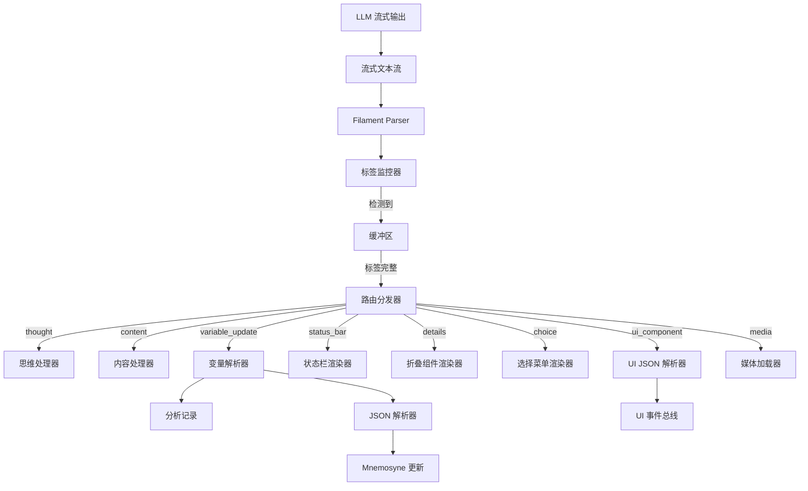

# 解析流程 (Parsing Workflow)

**版本**: 2.3.0  
**日期**: 2025-12-28  
**状态**: Draft  
**作者**: 资深系统架构师 (Architect Mode)  
**关联文档**:

- 概述 [`filament-protocol-overview.md`](filament-protocol-overview.md)
- 输出格式 [`filament-output-format.md`](filament-output-format.md)
- 核心架构 [`../core/`](../core/)

---

## 概述 (Introduction)

Filament 协议的解析是实时流式进行的，v2.1 增加了对扩展标签的路由支持。解析器需要处理 LLM 输出的不确定性（如标签缺失、未闭合、顺序混乱），同时确保系统的稳定性和响应速度。

## 流式解析架构 (Streaming Parsing Architecture)



## 路由分发表 (Routing Table) - v2.1

| 标签类型 | 目标处理器 | 处理动作 | 备注 |
|----------|------------|----------|------|
| `<thought>` | ThoughtHandler | 存储思维日志 | 默认折叠 |
| `<content>` | ContentHandler | 推送正文 | 支持 HTML 注释过滤 |
| `<variable_update>` | VariableParser | 记录分析 + 更新状态 | 替代 `<state_update>` |
| `<status_bar>` | StatusBarRenderer | 动态渲染状态标签 | 灵活结构 |
| `<details>` | DetailsRenderer | 渲染折叠块 | 标准 HTML 行为 |
| `<choice>` | ChoiceRenderer | 渲染交互按钮 | 替代 `<xx>` |
| `<ui_component>` | UIJSONParser | 渲染复杂原生组件 | |
| `<tool_call>` | ToolExecutor | 执行外部工具 | |

## 输出结构鲁棒性 (Output Structure Robustness)

### 设计挑战

在复杂的 RPG 场景中，Prompt 可能会启用多种协议功能（如思维链、状态更新、状态栏），且其顺序可能因 System Prompt 的微调或随机因素而波动。传统的严格解析器在面对 LLM 的"幻觉"（如遗漏标签、标签未闭合）时往往会失败。Clotho 引入 **"期望结构注册表"** 与 **"流式模糊修正器"** 来解决这一问题。

### 期望结构注册表 (Expected Structure Registry)

Jacquard 在组装 Prompt 时，会根据启用的模块动态生成一个 **"期望结构表"**。这个表定义了当前回复中 *可能* 出现的标签及其 *推荐* 顺序，作为解析器的指导（Hint）。

```dart
// 伪代码定义
class ExpectedStructure {
  final List<String> mandatoryTags; // 必须出现的标签 (e.g., content)
  final List<String> optionalTags;  // 可能出现的标签 (e.g., thought, status_bar)
  final Map<String, String> dependency; // 依赖关系 (e.g., variable_update 必须在 content 之后)
}
```

- **自动生成**: Jacquard 根据 `<use_protocol>` 自动填充。
- **手动调整**: 高级用户可以在 System Instruction 中微调。

### 流式模糊修正器 (Streaming Fuzzy Corrector)

解析器不再是简单的正则匹配，而是一个 **容错状态机 (Fault-Tolerant State Machine)**。

#### 核心修正策略

1. **首部缺失自动补全**:
    - *场景*: 期望 `<think>` 开头，但 LLM 直接输出了文本。
    - *动作*: 如果首个非空字符不是 `<`，且期望表中包含 `<think>`，则自动插入 `<think>` 标签头，并标记状态为 `InThought`。

2. **尾部闭合预测**:
    - *场景*: 检测到 `<tag>` 开始，但在遇到下一个 `<tag2>` 时仍未闭合。
    - *动作*: 如果 `<tag2>` 是期望表中的顶层标签，则推断 `<tag>` 已结束，自动插入 `</tag>`。

3. **相邻冗余修正**:
    - *场景*: `</content><content>` (LLM 意外分段)。
    - *动作*: 自动合并为单一流，忽略中间的闭合与开启标签。

#### 状态机流程图

```mermaid
graph TD
    Start((Start)) -->|非 < 字符| AutoInsert{需自动补全?}
    Start -->|<| DetectTag[检测标签]
    
    AutoInsert -->|Yes (Exp: think)| InsertThink[插入 <think>] --> InThink
    AutoInsert -->|No| InContent[默认进入 Content]
    
    DetectTag -->|Known Tag| EnterState[进入特定标签状态]
    DetectTag -->|Next Top-Level Tag| AutoClose{上个标签未闭合?}
    
    AutoClose -->|Yes| InsertClose[插入 </prev_tag>] --> EnterState
    
    InThink -->|</think>| EndThink[结束 Think]
    InContent -->|</content>| EndContent[结束 Content]
```

### 容错降级

如果修正器无法确定结构（如 JSON 语法严重错误），系统将执行降级策略：

1. **Raw Text Fallback**: 将所有无法解析的内容视为 `<content>` 的一部分展示给用户。
2. **Error Toast**: 在 UI 侧轻量级提示"部分状态更新失败"，但不阻断对话流程。

## 协议版本演进 (Protocol Evolution)

### v1.0 - 初始版本

* 使用重复的 XML 标签表示状态更新。
- Token 效率低。

### v2.0 - 结构化版本

* 引入 `<state_update>` 和 JSON 数组三元组。
- Token 效率提升，解析简化。

### v2.1 - 混合扩展版本 (当前)

* **标签重命名与增强**: `<UpdateVariable>` (遗留) -> `<variable_update>`，增加了分析字段。
- **交互标准化**: `<xx>` (遗留) -> `<choice>`。
- **UI 灵活性**: 引入 `<status_bar>` 和 `<details>`，允许更灵活的非结构化展示。
- **混合策略**: 核心逻辑保持严格 JSON Schema，展示层允许 XML 自由结构。

## 最佳实践与约束 (Best Practices & Constraints)

### LLM 输出约束

1. **标签闭合**: 所有标签必须严格闭合，禁止自闭合标签（`<media>` 除外，如果 Parser 支持）。
2. **JSON 格式**: `<variable_update>` 和 `<ui_component>` 内部的 JSON 必须严格符合标准（双引号、无尾随逗号）。
3. **注释规范**: 在 `<content>` 中使用 `<!-- -->` 进行内部标记，不要将用户不可见的内容裸露在正文中。

### 迁移指南

对于从 SillyTavern 或旧系统迁移的内容：

- **变量更新**: 将 `<UpdateVariable>` 映射为 `<variable_update>`。
- **选择菜单**: 将 `<xx>` 或纯文本选项映射为 `<choice>`。
- **状态栏**: 将 HTML 状态栏映射为 `<status_bar>` 或 `<ui_component>`。

### UI 组件设计规范

1. **view 命名**: 使用 `namespace.component` 格式。
2. **降级策略**: 关键交互组件应提供文本降级方案，以防 UI 渲染失败。

## 性能优化 (Performance Optimization)

### 流式处理优化

- **缓冲区管理**: 使用滑动窗口缓冲区，避免内存无限增长。
- **并行解析**: 对于不同标签类型，可并行启动多个处理器。
- **懒加载**: UI 组件和媒体资源按需加载，不阻塞主解析流程。

### 错误恢复

- **增量重试**: JSON 解析失败时，尝试修复常见错误（如缺失引号、尾随逗号）。
- **上下文感知**: 利用期望结构表预测缺失标签，提高修正准确率。

## 相关阅读

- **[输出格式](filament-output-format.md)**: 了解被解析的标签格式
- **[核心架构](../core/README.md)**: 查看解析器在系统核心架构中的位置
- **[工作流与处理](../workflows/README.md)**: 了解解析流程在整体工作流中的作用

---

**最后更新**: 2025-12-28  
**维护者**: Clotho 解析器团队
