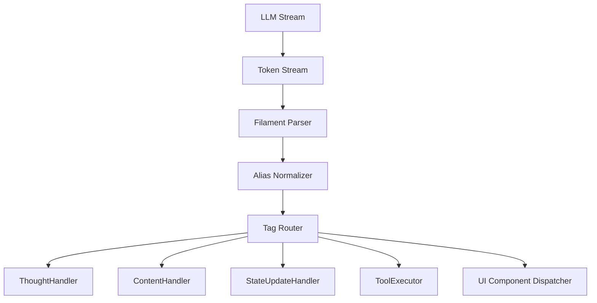

# 解析流程 (Parsing Workflow)

**版本**: 3.0.0
**日期**: 2026-04-03
**状态**: Active
**作者**: Clotho 解析器团队
**关联文档**:

- Canonical 规范 [`filament-canonical-spec.md`](filament-canonical-spec.md)
- 输出侧实现说明 [`filament-output-format.md`](filament-output-format.md)
- Schema 库规范 [`schema-library.md`](schema-library.md)
- Jacquard 编排层 [`../jacquard/README.md`](../jacquard/README.md)

> 术语体系参见 [naming-convention.md](../naming-convention.md)

---

## 1. 文档角色

本文档不再重复定义 canonical 标签、JSON schema 或 legacy 标签名。

**所有协议名称、标签名和语法基线统一引用 [`filament-canonical-spec.md`](filament-canonical-spec.md)。**

本文档只补充 Parser 的工程实现：

1. 流式解析架构
2. ESR 的组织方式
3. `strict / compat` 两种运行模式
4. 容错、重整与可观测性

---

## 2. 流式解析架构


```mermaid
graph TD
    LLM[LLM Stream] --> Stream[Token Stream]
    Stream --> Parser[Filament Parser]

    Parser --> Normalizer[Alias Normalizer]
    Normalizer --> Router[Tag Router]

    Router --> Thought[ThoughtHandler]
    Router --> Content[ContentHandler]
    Router --> State[StateUpdateHandler]
    Router --> Tool[ToolExecutor]
    Router --> UI[UI Component Dispatcher]
```

解析流程分三层：

1. **Tag Detection**: 识别 XML 标签边界
2. **Alias Normalization**: 在 `compat` 模式下将 legacy 标签归一化为 canonical 标签
3. **ESR Routing**: 依据 `expected_structure_registry` 做拓扑校验、路由与容错

---

## 3. 路由分发表

### 3.1 Core Tags

| 标签 | 处理器 | 行为 |
|------|--------|------|
| `<thought>` | `ThoughtHandler` | 存储思维日志，默认折叠 |
| `<content>` | `ContentHandler` | 推送正文并执行净化 |

### 3.2 Extension Tags

| 标签 | 处理器 | 行为 |
|------|--------|------|
| `<state_update>` | `StateUpdateHandler` | 解析 JSON 并生成状态变更请求 |
| `<tool_call>` | `ToolExecutor` | 调用工具运行时 |
| `<ui_component>` | `UIComponentHandler` | 派发到表现层 |
| `<choice>` | `ChoiceHandler` | 生成选项模型 |
| `<status_bar>` | `StatusBarHandler` | 更新轻量状态展示 |
| `<details>` | `DetailsHandler` | 生成折叠内容 |
| `<media>` | `MediaHandler` | 处理媒体引用 |

> Parser 只识别 ESR 注册表中的 canonical 标签。未注册标签在默认策略下按普通文本处理。

---

## 4. ESR Engine 2.5

### 4.1 角色

ESR 负责描述当前轮次的合法结构，Parser 负责消费 ESR。

### 4.2 黑板键约定

Schema Injector 与 Parser 统一使用以下 blackboard key：

| Key | 用途 |
|-----|------|
| `expected_structure_registry` | 当前轮次合法标签集与拓扑约束 |
| `parser_hints` | 具体标签的处理提示与组件附加信息 |

不再使用并行的 `schema_parser_hints` 命名。

### 4.3 初始化流程

```dart
void initialize(JacquardContext context) {
  final esr = context.blackboard['expected_structure_registry'];
  final parserHints = context.blackboard['parser_hints'];

  _registerCoreTags(['thought', 'content']);
  _registerExtensions(esr['expected_tags'], parserHints);
}
```

### 4.4 ESR 示例

```json
{
  "expected_structure_registry": {
    "version": "2.5",
    "expected_tags": ["thought", "content", "state_update", "choice"],
    "topology": {
      "sequence": ["thought", "state_update", "content", "choice"]
    },
    "cardinality": {
      "mandatory": ["content"],
      "optional": ["thought", "state_update", "choice"]
    },
    "policies": {
      "missing_start": "inject_content",
      "out_of_order": "degrade_to_text",
      "unclosed_tag": "auto_close",
      "unknown_tag": "treat_as_text"
    }
  }
}
```

---

## 5. 运行模式

### 5.1 Strict Mode

用于文档、测试、CI 和 schema conformance：

- 只接受 canonical 标签
- 只接受 canonical JSON 结构
- 非法标签直接报错

### 5.2 Compat Mode

用于生产运行时：

1. 先执行 alias 归一化
2. 再按 canonical 标签集进行 ESR 校验
3. 尽量将 legacy 输出纠正到 canonical 结构

### 5.3 Alias 归一化

兼容期支持以下映射：

| Legacy | Canonical |
|--------|-----------|
| `think` | `thought` |
| `reply` | `content` |
| `variable_update` | `state_update` |

---

## 6. 容错与重整

### 6.1 流式容错

Parser 应支持：

- 起始标签缺失补全
- 非法闭合标签回退
- 低风险别名修正
- EOF 级联闭合

### 6.2 二阶段重整

如果流式阶段触发严重结构污染，应标记 `dirty_structure = true`，在流结束后做一次全文档重整：

1. 重建 DOM
2. 根据 ESR 物理重排节点
3. 用清洗后结构刷新 UI / 持久化输入

### 6.3 优先级

重整阶段以 **数据完整性优先于流式外观连续性** 为原则。

---

## 7. 可观测性

Parser 应输出以下调试数据：

1. **Correction Log**
   记录 alias 归一化、自动闭合、顺序修正
2. **Structure Diff**
   展示原始流与清洗后结构的差异
3. **Compatibility Metrics**
   统计 legacy 标签命中率，便于逐步淘汰兼容层

---

## 8. 性能约束

- 单次扫描复杂度应保持 `O(n)`
- 尽量使用切片与缓冲区，减少字符串复制
- 只有在 `dirty_structure` 为真时触发全文档重整

---

## 9. 相关阅读

- [`filament-canonical-spec.md`](filament-canonical-spec.md)
- [`filament-output-format.md`](filament-output-format.md)
- [`schema-library.md`](schema-library.md)
- [`../workflows/post-generation-processing.md`](../workflows/post-generation-processing.md)

---

**最后更新**: 2026-04-03
**维护者**: Clotho 解析器团队
