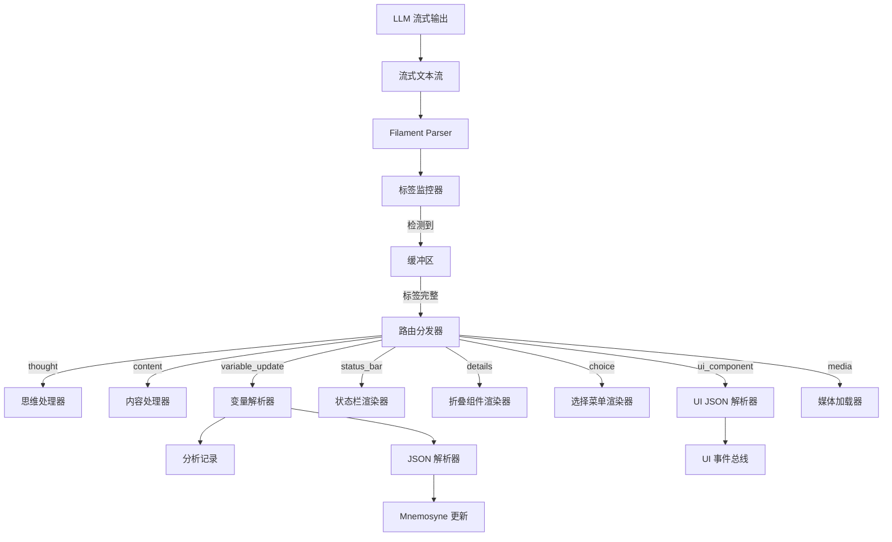
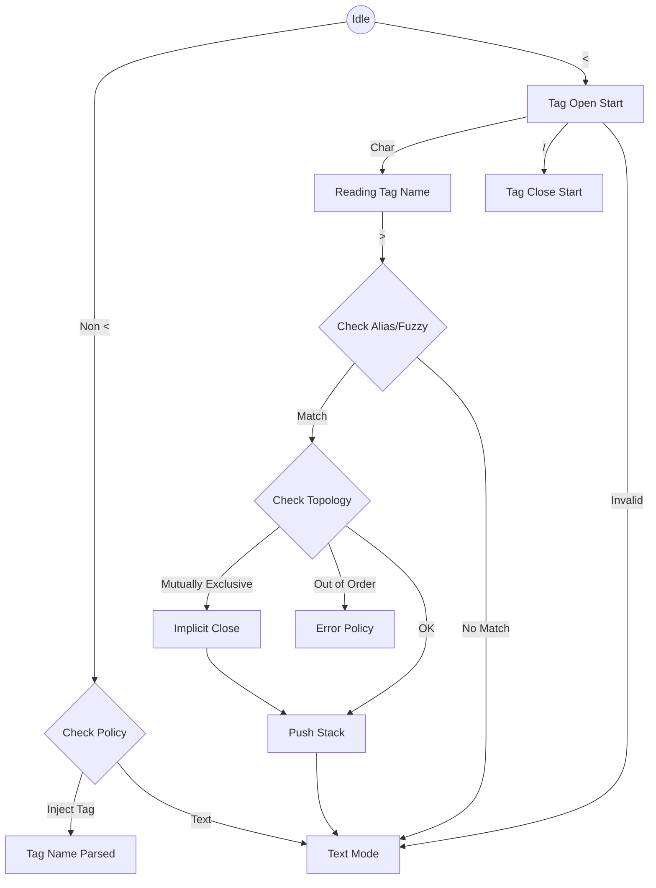

# 解析流程 (Parsing Workflow)

**版本**: 2.4.0  
**日期**: 2026-02-12  
**状态**: Active  
**作者**: 资深系统架构师 (Architect Mode)  
**关联文档**:

- 概述 [`filament-protocol-overview.md`](filament-protocol-overview.md)
- 输出格式 [`filament-output-format.md`](filament-output-format.md)
- Jacquard 编排层 [`../jacquard/README.md`](../jacquard/README.md)

---

## 概述 (Introduction)

Filament 协议的解析是实时流式进行的，v2.1 增加了对扩展标签的路由支持，v2.4 引入了**期望结构注册表 (ESR) v2.0** 和 **增强型流式模糊修正器**。解析器不仅能处理 LLM 输出的不确定性（如标签缺失、未闭合、顺序混乱），还能根据动态的结构约束进行智能纠错和规范化。

## 流式解析架构 (Streaming Parsing Architecture)


```mermaid
graph TD
    LLM[LLM 流式输出] --> Stream[流式文本流]
    Stream --> Parser[Filament Parser]
    
    Parser --> Monitor[标签监控器]
    Monitor -->|检测到 <tag>| Buffer[缓冲区]
    
    Buffer -->|标签完整| Router[路由分发器]
    
    Router -- thought --> ThoughtHandler[思维处理器]
    Router -- content --> ContentHandler[内容处理器]
    
    Router -- variable_update --> VariableParser[变量解析器]
    VariableParser --> AnalysisHandler[分析记录]
    VariableParser --> StateParser[JSON 解析器]
    StateParser --> Mnemosyne[Mnemosyne 更新]
    
    Router -- status_bar --> StatusBarRenderer[状态栏渲染器]
    Router -- details --> DetailsRenderer[折叠组件渲染器]
    Router -- choice --> ChoiceRenderer[选择菜单渲染器]
    
    Router -- ui_component --> UIJSONParser[UI JSON 解析器]
    UIJSONParser --> UIEventBus[UI 事件总线]
    
    Router -- media --> MediaLoader[媒体加载器]
```

## 路由分发表 (Routing Table) - v2.1

| 标签类型 | 目标处理器 | 处理动作 | 备注 |
|----------|------------|----------|------|
| `<thought>` | ThoughtHandler | 存储思维日志 | 默认折叠 |
| `<content>` | ContentHandler | 推送正文 | 支持 HTML 注释过滤 |
| `<variable_update>` | VariableParser | 记录分析 + 更新状态 | 替代 `<state_update>` |
| `<status_bar>` | StatusBarRenderer | 动态渲染状态标签 | 灵活结构 |
| `<details>` | DetailsRenderer | 渲染折叠块 | 标准 HTML 行为 |
| `<choice>` | ChoiceRenderer | 渲染交互按钮 | 替代 `<xx>` |
| `<ui_component>` | UIJSONParser | 渲染复杂原生组件 | |
| `<tool_call>` | ToolExecutor | 执行外部工具 | |

## 期望结构注册表 (Expected Structure Registry, ESR) v2.0

ESR 是一个定义当前交互轮次中**合法**且**推荐**的 Filament 协议结构的元数据对象。它由 Jacquard 编排层在生成 Prompt 时动态构建，并作为解析器的核心指导引擎。

### 组件构成

一个完整的 ESR 包含以下四个子模块：

1.  **拓扑约束 (Topology Constraints)**: 定义标签的出现顺序和嵌套关系。
2.  **必须性约束 (Cardinality Constraints)**: 定义哪些标签是必须的，哪些是可选的。
3.  **别名映射 (Alias Mapping)**: 定义标签的同义词和模糊匹配规则。
4.  **自动修正策略 (Auto-Correction Policies)**: 定义当违反上述约束时，解析器应采取的行动。

### JSON Schema 示例

```json
{
  "expected_structure_registry": {
    "version": "2.0",
    "topology": {
      // 方式 A: 显式数组定义 (简单模式)
      "sequence": ["thought", "variable_update", "content"],
      // 方式 B: FST DSL 定义 (高级模式，优先级高于 sequence)
      "template": "thought -> {variable_update, content}* -> choice",
      
      "hierarchy": {
        "content": ["bold", "italic", "image"], 
        "thought": []
      },
      "mutually_exclusive": [["thought", "content"], ["thought", "variable_update"]]
    },
    "cardinality": {
      "mandatory": ["content"],
      "optional": ["thought", "variable_update", "status_bar"],
      "repeatable": ["tool_call"]
    },
    "aliases": {
      "exact": {
        "thinking": "thought",
        "state": "variable_update",
        "act": "action",
        "user_action": "action"
      },
      "fuzzy_threshold": 0.8
    },
    "policies": {
      "missing_start": "inject_content",
      "out_of_order": "degrade_to_text",
      "unclosed_tag": "auto_close",
      "unknown_tag": "fuzzy_match_or_ignore"
    }
  }
}
```

### Filament 结构模板 (Filament Structure Template, FST) DSL

为了更灵活地定义复杂的拓扑结构（如循环、分支、无序组合），ESR v2.0 支持嵌入式 DSL。这允许开发者以编程方式为不同模型定制“期望形状”。

#### 语法规范
*   **Sequence (序列)**: `A -> B` (A 之后必须是 B)
*   **Choice (选择)**: `A | B` (A 或 B)
*   **Parallel/Unordered (无序组)**: `{A, B}` (A 和 B 必须出现，但顺序不限，等价于 `(A->B)|(B->A)`)
*   **Repetition (重复)**: `A*` (0次或多次), `A+` (1次或多次), `A?` (可选)
*   **Grouping (分组)**: `( ... )`

#### 常见模式示例
*   **标准 CoT**: `thought -> content`
*   **混合叙事 (循环)**: `thought -> content -> (thought | content)*`
*   **RPG 严格模式**: `status_bar? -> variable_update? -> content -> choice`
*   **无序混合模式**: `thought -> {variable_update, content}* -> choice`

#### 编译原理：DSL to DFA
解析器在初始化时，会将 FST DSL 编译为确定的状态转换表，确保运行时性能：
1.  **AST 构建**: 解析 DSL 字符串为抽象语法树。
2.  **NFA 生成**: 使用 Thompson 构造法将 AST 转换为非确定性有限自动机（处理 ε-转换）。
3.  **DFA 转换**: 使用子集构造法 (Powerset Construction) 将 NFA 转换为 DFA，消除不确定性。
4.  **最小化**: 合并等价状态，生成最终的高效跳转表。运行时仅需 O(1) 查表即可决定状态流转。

## 流式模糊修正器 (Streaming Fuzzy Corrector)

解析器是一个基于 ESR 的 **容错确定性有限自动机 (DFA)**。它不再是简单的正则匹配，而是具备上下文感知的智能纠错系统。

### 状态机定义

| 状态 (State) | 描述 | 允许的转换 |
| :--- | :--- | :--- |
| **`IDLE`** | 初始状态，等待输入 | `TEXT`, `TAG_OPEN_START` |
| **`TEXT`** | 正在读取普通文本内容 | `TAG_OPEN_START`, `EOF` |
| **`TAG_OPEN_START`** | 检测到 `<`，等待下一个字符 | `TAG_NAME`, `TAG_CLOSE_START`, `TEXT` (回退) |
| **`TAG_CLOSE_START`** | 检测到 `</`，等待标签名 | `TAG_CLOSE_NAME`, `TEXT` (回退) |
| **`TAG_NAME`** | 正在读取起始标签名 (e.g., `thought`) | `TAG_OPEN_END`, `TEXT` (非法字符回退) |
| **`TAG_CLOSE_NAME`** | 正在读取闭合标签名 | `TAG_CLOSE_END`, `TEXT` (非法字符回退) |
| **`TAG_OPEN_END`** | 检测到 `>`，标签开启完成 | `TEXT`, `IDLE` |
| **`TAG_CLOSE_END`** | 检测到 `>`，标签闭合完成 | `TEXT`, `IDLE` |

### 核心修正策略

#### 1. 智能标签推断与归一化 (Normalization)

*   **标签判定**: 在 `TAG_OPEN_START` 状态，如果后续字符不符合 XML 名称规范（如空格、数字开头），则回退为普通文本。
*   **别名匹配**: 解析出的标签名首先在 ESR 的 `aliases.exact` 表中查找。例如，解析出 `<thinking>`，自动映射为 `<thought>`。
*   **模糊匹配**: 如果标签未知，且 `policies.unknown_tag` 允许，计算 Levenshtein 距离。如果相似度高于 `fuzzy_threshold`，则自动纠正为标准标签。

#### 2. 拓扑约束执行 (Topology Enforcement)

*   **自动闭合 (Auto-Closing)**: 
    *   当检测到新标签 `T_new` 开启时，检查当前栈顶标签 `T_top`。
    *   如果 ESR `topology.mutually_exclusive` 定义了两者互斥（如 `<thought>` 和 `<content>`），则**隐式闭合** `T_top`（虚拟插入 `</thought>`），再处理 `T_new`。

*   **异常嵌套提升 (Abnormal Nesting Lifting)**:
    *   **场景**: `<content>... <choice>...</choice> ...</content>`。ESR 定义 `<choice>` 为顶层标签，不允许嵌套在 `<content>` 中。
    *   **动作 (Context Splitting)**:
        1.  检测到内部非法标签 `<choice>`。
        2.  立即**隐式闭合**当前父标签 `</content>`。
        3.  正常解析 `<choice>...</choice>`。
        4.  在 `<choice>` 闭合后，**自动重新开启** `<content>` 继续接收后续文本。

*   **顺序检测 (Sequence Detection)**:
    *   维护一个 `sequence_cursor` 指向 `topology.sequence`。
    *   如果检测到的标签在序列中位于当前游标之前（**逆流**），根据策略处理（通常降级为文本或浮动显示）。
    *   如果位于游标之后（**跳过**），则推进游标，视为中间步骤被跳过。

#### 3. 首部缺失补全 (Head Injection)

*   **场景**: ESR 期望 `<thought>` 开头，但 LLM 直接输出文本。
*   **动作**: 如果流开头没有标签，且 `policies.missing_start` 配置为 `inject_thought`，则虚拟插入 `<thought>`。如果配置为 `inject_content`（默认），则进入内容模式。

#### 4. 幽灵闭合处理 (Ghost Close)

*   **场景**: 遇到 `</tag>` 但栈中无此标签。
*   **动作**: 
    *   如果在栈深处找到该标签，说明中间标签未闭合，执行级联自动闭合。
    *   如果栈中完全不存在，视为孤儿标签，直接丢弃或作为文本输出。

#### 5. 流式截断处理 (EOF Handling Strategy)

*   **场景**: 网络中断或生成被强制停止，导致流在非闭合状态结束 (`Unexpected EOF`)。
*   **动作**: 
    *   解析器在收到 `EOS` (End of Stream) 信号时，检查 `TagStack`。
    *   **级联闭合**: 依次弹出栈中剩余标签，并生成对应的闭合事件 `</tag>`，确保 DOM 树完整。
    *   **状态标记**: 标记 `stream_truncated = true`，这可能会触发前端显示一个“生成中断”的视觉提示（如破碎的末尾图标）。

### 状态机流程图 (更新版)


```mermaid
graph TD
    IDLE((Idle)) -->|Non <| AutoInject{Check Policy}
    IDLE -->|<| TagStart[Tag Open Start]
    
    AutoInject -->|Inject Tag| TagParsed[Tag Name Parsed]
    AutoInject -->|Text| TextState[Text Mode]
    
    TagStart -->|Char| TagName[Reading Tag Name]
    TagStart -->|/| CloseStart[Tag Close Start]
    TagStart -->|Invalid| TextState
    
    TagName -->|>| CheckAlias{Check Alias/Fuzzy}
    
    CheckAlias -->|Match| CheckTopology{Check Topology}
    CheckAlias -->|No Match| TextState
    
    CheckTopology -->|Mutually Exclusive| AutoClose[Implicit Close]
    CheckTopology -->|Out of Order| HandleError[Error Policy]
    CheckTopology -->|OK| PushStack[Push Stack]
    
    AutoClose --> PushStack
    
    PushStack --> TextState
```

## 协议版本演进 (Protocol Evolution)

### v1.0 - 初始版本
* 使用重复的 XML 标签表示状态更新。

### v2.0 - 结构化版本
* 引入 `<state_update>` 和 JSON 数组三元组。

### v2.1 - 混合扩展版本
* 引入 `<variable_update>`, `<choice>`, `<status_bar>`。

### v2.4 - 智能容错版本 (当前)
* **ESR v2.0**: 引入完整的拓扑、别名和策略控制。
* **DFA 解析器**: 替代正则，支持流式纠错。

## 最佳实践与约束 (Best Practices & Constraints)

### LLM 输出约束

1. **标签闭合**: 虽然有自动修正，但 Prompt 仍应要求 LLM 闭合标签以减少歧义。
2. **JSON 格式**: `<variable_update>` 内部 JSON 必须严格符合标准。

### 迁移指南

- **ESR 配置**: 为不同模型配置不同的 ESR 模板（如 DeepSeek R1 倾向于先 `<thought>`，而 Claude 可能混合）。
- **别名表**: 收集用户反馈的常见幻觉标签，添加到 ESR 别名表中。

## 生成后重处理 (Post-Generation Reprocessing)

虽然流式修正器能解决大部分问题，但某些严重的乱序或结构错误无法在流式传输中完美修复（一旦数据发送到 UI，就难以撤回）。为此，系统引入了 **"二阶段重整 (Two-Pass Reorganization)"** 机制。

### 触发条件
解析器在流式处理过程中，如果触发了以下情况，会标记 `dirty_structure = true`：
1.  发生了严重的标签逆流 (Out-of-Order)。
2.  检测到非法嵌套并执行了强制提升。
3.  模糊匹配置信度较低的操作。

### 重整逻辑
当流结束 (`EOS`) 且 `dirty_structure == true` 时，前端或中间件层执行以下操作：

1.  **DOM 重建**: 将完整的 `raw_output` 文本加载到基于 DOM 的解析器（非流式，支持全文档遍历）。
2.  **拓扑重排**: 根据 ESR 的 `topology.sequence` 规则，将 DOM 节点物理移动到正确顺序。
    *   *Example*: 将散落在文末的 `<variable_update>` 移动到 `<content>` 之前。
3.  **UI 刷新**: 使用重排后的干净结构替换之前的流式渲染结果。

> **优先级声明**: 重整过程以**数据完整性 (Data Integrity)** 为第一优先级，不强制追求毫秒级完成。如果文档结构极其复杂，系统允许短暂的 Loading 状态，以确保最终生成的 TAPESTRY 存档是绝对正确的。用户可能会看到界面从"原始流式状态"刷新为"清洗后状态"，这是符合预期的行为。

## 可观测性与调试 (Observability & Debugging)

为了帮助 Prompt 工程师优化模型指令，解析器应提供详细的调试信息：

1.  **修正日志 (Correction Log)**:
    *   记录所有触发模糊修正的事件。
    *   *Example*: `[WARN] @Pos:150 - Implicitly closed <thought> due to start of <content>.`
    *   *Example*: `[INFO] @Pos:45 - Auto-corrected tag <thinking> to <thought> (Confidence: 0.9).`

2.  **结构可视化 (Structure Visualizer)**:
    *   在开发模式下，UI 可提供一个“X-Ray 视图”，展示原始流与修正后流的 Diff。
    *   高亮显示被“提升”或“重排”的区域，帮助开发者识别 Prompt 的结构性弱点。

## 性能优化 (Performance Optimization)

- **单次遍历**: DFA 保证 O(n) 的解析复杂度，无回溯成本（除微小缓冲区外）。
- **零拷贝**: 尽可能在原字符串切片上操作，减少内存分配。
- **按需重整**: 仅在检测到 `dirty_structure` 时才触发 DOM 重解析，正常情况下零额外开销。

---

**最后更新**: 2026-02-12  
**维护者**: Clotho 解析器团队
