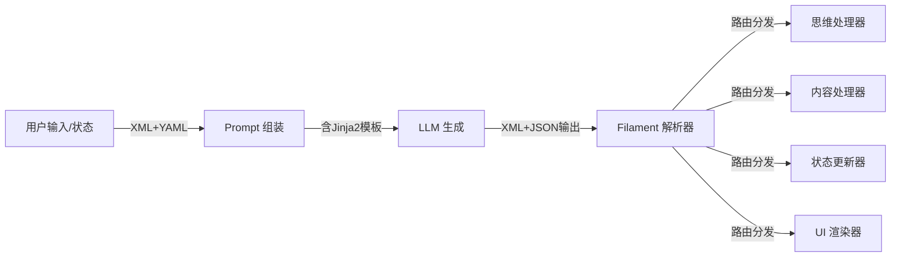

# Filament 协议概述 (Filament Protocol Overview)

**版本**: 2.3.0  
**日期**: 2025-12-28  
**状态**: Draft  
**作者**: 资深系统架构师 (Architect Mode)  
**关联文档**:

- 输入格式 [`filament-input-format.md`](filament-input-format.md)
- 输出格式 [`filament-output-format.md`](filament-output-format.md)
- Jinja2 宏系统 [`jinja2-macro-system.md`](jinja2-macro-system.md)
- 解析流程 [`filament-parsing-workflow.md`](filament-parsing-workflow.md)
- 核心架构 [`../core/`](../core/)

---

## 协议定位 (Protocol Positioning)

**Filament 协议**是 Clotho 系统的通用交互语言，旨在消除“自然语言”与“机器指令”之间的模糊地带。它贯穿于系统的所有交互环节，从提示词构建、逻辑控制到界面渲染，实现了统一的语义表达和确定性通信。

## 核心设计哲学 (Core Design Philosophy)

Filament 遵循以下两大设计哲学：

### 1. 非对称交互 (Asymmetric Interaction)

- **输入端 (Context Ingestion): XML + YAML**
  - **结构 (XML)**: 使用 XML 标签构建 Prompt 的骨架 (Skein Blocks)，确保 LLM 理解内容的层级与边界。
  - **数据 (YAML)**: 在标签内部使用 YAML 描述属性与状态。YAML 相比 JSON 更符合人类阅读习惯，且 Token 消耗更低，适合作为大量的上下文输入。
- **输出端 (Instruction Generation): XML + JSON**
  - **意图 (XML)**: 使用 XML 标签明确标识 LLM 的意图类型 (如思考、说话、操作)。
  - **参数 (JSON)**: 在标签内部使用 JSON 描述具体的参数。JSON 的严格语法更易于机器解析，确保工具调用与状态变更的确定性。

### 2. 混合扩展策略 (Mixed Extension Strategy) - v2.1 新增

- **核心严格性 (Core Strictness)**: 对于影响系统逻辑的关键指令（如变量更新、工具调用），采用严格的 Schema 验证和标准格式。
- **边缘灵活性 (Edge Flexibility)**: 对于展示层和辅助信息（如自定义状态栏、摘要），允许更灵活的自定义标签结构，以适应多变的业务需求。

## 协议在系统中的应用范畴

Filament 不仅是 LLM 的输出协议，更是系统的通用语言，统一管理：

1. **提示词格式 (Prompt Engineering)**: 所有的 Character Card、World Info 均通过 Filament 结构化注入。
2. **标签类型 (Tag System)**: 定义一套标准化的 XML 标签集，用于控制流程。
3. **嵌入式前端 (Embedded UI)**: 允许 LLM 通过协议直接请求渲染原生的嵌入式网页组件（Mini-Apps），实现交互维度的升维。
4. **状态管理 (State Management)**: 统一的状态更新指令格式。

## 文档导航

本目录包含 Filament 协议的完整规范，建议按以下顺序阅读：

1. **本文档 (概述)** → 了解协议的整体设计理念和基本原则
2. **[输入格式](filament-input-format.md)** → 了解如何为 LLM 构建结构化的输入 Prompt
3. **[Jinja2 宏系统](jinja2-macro-system.md)** → 了解动态提示词构建和安全模板渲染
4. **[输出格式](filament-output-format.md)** → 了解 LLM 应如何格式化输出，以及系统如何解析这些输出
5. **[解析流程](filament-parsing-workflow.md)** → 了解协议在系统中的实时解析和分发机制

## 协议版本演进 (Protocol Evolution)

| 版本 | 代号 | 核心特性 | 状态 |
|------|------|----------|------|
| v1.0 | 初始版本 | 使用重复的 XML 标签表示状态更新 | 已废弃 |
| v2.0 | 结构化版本 | 引入 `<state_update>` 和 JSON 数组三元组 | 兼容 |
| v2.1 | 混合扩展版本 | 标签重命名、交互标准化、UI 灵活性 | **当前版本** |
| v2.3 | 宏系统增强 | 增强 Jinja2 宏系统支持，完善 HTML 安全过滤 | 草案 |

**注意**: 本系列文档基于 v2.3 草案撰写，但大部分内容兼容 v2.1。

## 协议架构关系

## 相关阅读

- **[架构核心](../core/README.md)**: 协议在系统核心架构中的应用
- **[工作流与处理](../workflows/README.md)**: 使用协议的具体业务流程
- **[迁移指南](../migration/README.md)**: 从遗留系统迁移到 Filament 协议的实践指导

---

**最后更新**: 2025-12-28  
**维护者**: Clotho 协议团队
