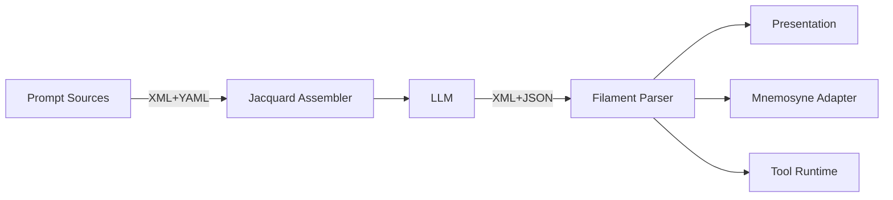

# Filament 协议概述 (Filament Protocol Overview)

**版本**: 3.0.0
**日期**: 2026-04-03
**状态**: Active
**作者**: Clotho 协议团队
**关联文档**:

- Canonical 规范 [`filament-canonical-spec.md`](filament-canonical-spec.md)
- 输入侧实现说明 [`filament-input-format.md`](filament-input-format.md)
- 输出侧实现说明 [`filament-output-format.md`](filament-output-format.md)
- 解析器实现说明 [`filament-parsing-workflow.md`](filament-parsing-workflow.md)
- Jinja2 宏系统 [`jinja2-macro-system.md`](jinja2-macro-system.md)

> 术语体系参见 [naming-convention.md](../naming-convention.md)

---

## 1. 文档角色

本文档只回答三个问题：

1. Filament 是什么
2. Filament 用在什么边界
3. 读者应该按什么顺序阅读相关规范

**关于标签名称、语法、版本基线、兼容策略的唯一事实来源，请参阅 [`filament-canonical-spec.md`](filament-canonical-spec.md)。**

---

## 2. 协议定位

**Filament 是 Clotho 与 LLM 之间的边界协议。**

它的职责是：

- 为 Prompt 组装提供结构化输入载体
- 为 LLM 输出提供可解析的协议外壳
- 为 Parser、Schema Injector、测试夹具提供统一语义基线

它**不**负责：

- Jacquard 与 Mnemosyne 的内部调用
- UI 与编排层的内部接口
- 数据库存储格式

这些内部通信统一使用 Dart 对象、接口契约和领域模型，而不是 Filament。

---

## 3. 设计摘要

Filament 采用非对称设计：

| 方向 | 格式 | 目标 |
|------|------|------|
| 输入端 | XML + YAML | 强化结构边界，降低上下文描述成本 |
| 输出端 | XML + JSON | 明确标签语义，保证机器动作可验证 |

从 `Filament Spec 3.0.0` 开始：

- canonical core tags 统一为 `<thought>` 与 `<content>`
- 结构化动作统一使用严格 JSON body
- 旧标签只作为运行时兼容别名保留

---

## 4. 与其他组件的关系

```mermaid
graph LR
    Input[Prompt Sources] --> |XML+YAML| Assembler[Jacquard Assembler]
    Assembler --> LLM[LLM]
    LLM --> |XML+JSON| Parser[Filament Parser]
    Parser --> UI[Presentation]
    Parser --> State[Mnemosyne Adapter]
    Parser --> Tools[Tool Runtime]
```

上图中的两条边界链路是 Filament 的完整作用范围：

1. `Assembler -> LLM`
2. `LLM -> Parser`

---

## 5. 阅读路径

建议按以下顺序阅读：

1. [`filament-canonical-spec.md`](filament-canonical-spec.md)
   目标：建立唯一协议基线
2. [`filament-input-format.md`](filament-input-format.md)
   目标：了解输入块如何组织、规范化和与 Jinja2 集成
3. [`filament-output-format.md`](filament-output-format.md)
   目标：了解输出标签如何使用、渲染和落地
4. [`filament-parsing-workflow.md`](filament-parsing-workflow.md)
   目标：了解 ESR、路由、容错与兼容实现
5. [`schema-library.md`](schema-library.md)
   目标：了解协议扩展如何存储、启用与注入

---

## 6. 版本关系

| 名称 | 当前基线 | 说明 |
|------|----------|------|
| **Filament Spec** | `3.0.0` | 对外协议定义 |
| **ESR Engine** | `2.5.x` | 解析器的结构约束与容错引擎 |

协议文档默认以 `Filament Spec 3.0.0` 为准；涉及 ESR 的实现细节，以 [filament-parsing-workflow.md](filament-parsing-workflow.md) 为准。

---

## 7. 相关阅读

- [`../jacquard/README.md`](../jacquard/README.md)
- [`../mnemosyne/README.md`](../mnemosyne/README.md)
- [`../workflows/prompt-processing.md`](../workflows/prompt-processing.md)
- [`../workflows/post-generation-processing.md`](../workflows/post-generation-processing.md)

---

**最后更新**: 2026-04-03
**维护者**: Clotho 协议团队
