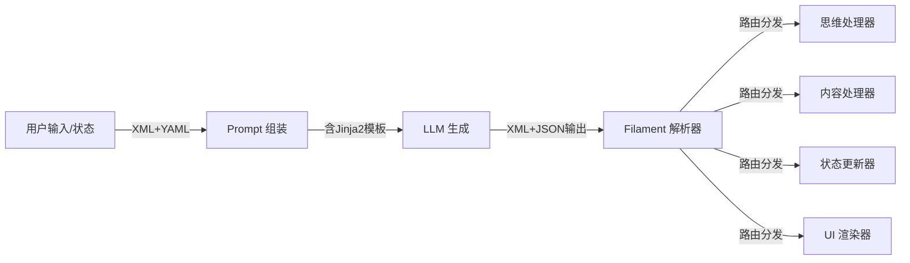

# Filament 协议概述 (Filament Protocol Overview)

**版本**: 2.4.0
**日期**: 2026-03-11
**状态**: Active
**作者**: 资深系统架构师 (Architect Mode)
**关联文档**:

- 输入格式 [`filament-input-format.md`](filament-input-format.md)
- 输出格式 [`filament-output-format.md`](filament-output-format.md)
- Jinja2 宏系统 [`jinja2-macro-system.md`](jinja2-macro-system.md)
- 解析流程 [`filament-parsing-workflow.md`](filament-parsing-workflow.md)
- Jacquard 编排层 [`../jacquard/README.md`](../jacquard/README.md)
- Mnemosyne 数据引擎 [`../mnemosyne/README.md`](../mnemosyne/README.md)

> 术语体系参见 [naming-convention.md](../naming-convention.md)

---

## 协议定位 (Protocol Positioning)

**Filament 协议**是 Clotho 系统LLM 的专用母语交互语言，旨在消除“自然语言”与“机器指令”之间的模糊地带。它贯穿于系统的所有交互环节，从提示词构建、逻辑控制到界面渲染，实现了统一的语义表达和确定性通信。

> **适用范围声明**:
> Filament 协议是**专属于 LLM 的通信语言**，而非系统内部组件的通用交互语言。
> - **LLM 通信**: Filament 强制规范 LLM 的输入 (XML+YAML) 和输出 (XML+JSON)
> - **内部组件**: 系统内部各层之间使用 Dart 对象直接通信，不经过 Filament 协议转换
> - **数据持久化**: 数据库和存储层使用原生数据结构，与 Filament 格式解耦

## 核心设计哲学 (Core Design Philosophy)

Filament 遵循以下两大设计哲学：

### 1. 非对称交互 (Asymmetric Interaction)

- **输入端 (Context Ingestion): XML + YAML**
  - **结构 (XML)**: 使用 XML 标签构建 Prompt 的骨架 (Skein Blocks)，确保 LLM 理解内容的层级与边界。
  - **数据 (YAML)**: 在标签内部使用 YAML 描述属性与状态。YAML 相比 JSON 更符合人类阅读习惯，且 Token 消耗更低，适合作为大量的上下文输入。
- **输出端 (Instruction Generation): XML + JSON**
  - **意图 (XML)**: 使用 XML 标签明确标识 LLM 的意图类型 (如思考、说话、操作)。
  - **参数 (JSON)**: 在标签内部使用 JSON 描述具体的参数。JSON 的严格语法更易于机器解析，确保工具调用与状态变更的确定性。

### 2. 混合扩展策略 (Mixed Extension Strategy) - v2.1 新增

- **核心严格性 (Core Strictness)**: 对于影响系统逻辑的关键指令（如变量更新、工具调用），采用严格的 Schema 验证和标准格式。
- **边缘灵活性 (Edge Flexibility)**: 对于展示层和辅助信息（如自定义状态栏、摘要），允许更灵活的自定义标签结构，以适应多变的业务需求。

## 协议在系统中的应用范畴

Filament 是**专门针对 LLM 设计的通信协议**，其应用范畴严格限定于：

1. **提示词组装 (Prompt Assembly)**: 通过 XML+YAML 结构化注入 Pattern (织谱)、Lore (纹理) 等上下文。
2. **LLM 输出解析 (Output Parsing)**: 解析 XML+JSON 格式的响应，提取思考过程、内容、状态更新等指令。
3. **标签语义体系 (Tag Semantics)**: 定义标准化的 XML 标签集，明确表达 LLM 的意图（如 `<thought>`, `<content>`, `<variable_update>`）。
4. **嵌入式 UI 指令 (Embedded UI)**: 允许 LLM 通过协议标签（如 `<mini_app>`）请求渲染原生组件。

> **重要区分**: Filament 仅作用于与 LLM 的**边界接口**（如图所示的 Assembler 和 Parser 之间）。系统内部组件（Jacquard、Mnemosyne、Stage）之间使用 Dart 原生对象直接通信，不经过 Filament 转换。

## 文档导航

本目录包含 Filament 协议的完整规范，建议按以下顺序阅读：

1. **本文档 (概述)** → 了解协议的整体设计理念和基本原则
2. **[输入格式](filament-input-format.md)** → 了解如何为 LLM 构建结构化的输入 Prompt
3. **[Jinja2 宏系统](jinja2-macro-system.md)** → 了解动态提示词构建和安全模板渲染
4. **[输出格式](filament-output-format.md)** → 了解 LLM 应如何格式化输出，以及系统如何解析这些输出
5. **[解析流程](filament-parsing-workflow.md)** → 了解协议在系统中的实时解析和分发机制

## 协议版本演进 (Protocol Evolution)

| 版本 | 代号 | 核心特性 | 状态 |
|------|------|----------|------|
| v1.0 | 初始版本 | 使用重复的 XML 标签表示状态更新 | 已废弃 |
| v2.0 | 结构化版本 | 引入 `<state_update>` 和 JSON 数组三元组 | 兼容 |
| v2.1 | 混合扩展版本 | 标签重命名、交互标准化、UI 灵活性 | 兼容 |
| v2.3 | 宏系统增强 | 增强 Jinja2 宏系统支持，完善 HTML 安全过滤 | 兼容 |
| v2.4 | 智能容错版本 | 引入 ESR v2.0 与 DFA 流式修正器 | **当前版本** |

**注意**: 本系列文档基于 v2.4 撰写，完全兼容 v2.1/v2.3。

## 协议架构关系

```mermaid
graph LR
    Input[用户输入/状态] --> |XML+YAML| Assembler[Prompt 组装]
    Assembler --> |含Jinja2模板| LLM[LLM 生成]
    LLM --> |XML+JSON输出| Parser[Filament 解析器]
    Parser --> |路由分发| Thought[思维处理器]
    Parser --> |路由分发| Content[内容处理器]
    Parser --> |路由分发| State[状态更新器]
    Parser --> |路由分发| UI[UI 渲染器]
```

## 相关阅读

- **[Jacquard 编排层](../jacquard/README.md)**: 协议在编排层中的应用
- **[Mnemosyne 数据引擎](../mnemosyne/README.md)**: 协议在数据引擎中的应用
- **[工作流与处理](../workflows/README.md)**: 使用协议的具体业务流程
- **[Pattern (织谱) 导入与迁移](../workflows/character-import-migration.md)**: 从遗留系统迁移到 Filament 协议的实践指导

---

**最后更新**: 2026-01-15
**维护者**: Clotho 协议团队
