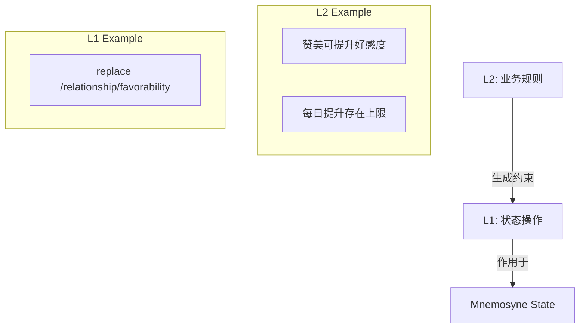

# Schema 库规范 (Schema Library Specification)

**版本**: 1.2.0
**日期**: 2026-04-03
**状态**: Active
**作者**: 资深系统架构师 (Architect Mode)
**关联文档**:

- Filament Canonical Spec [`filament-canonical-spec.md`](filament-canonical-spec.md)
- Schema YAML 示例标准库 [`schema-yaml-standard-library/README.md`](schema-yaml-standard-library/README.md)
- Jacquard 编排层 [`../jacquard/README.md`](../jacquard/README.md)
- Schema Injector 组件规范 [`../jacquard/schema-injector.md`](../jacquard/schema-injector.md)

> 术语体系参见 [naming-convention.md](../naming-convention.md)

---

## 1. 背景与目标 (Context & Objectives)

> **协议事实来源声明**: 本文档只定义 Schema 的存储、引用与注入机制。Filament 的 canonical 标签、语法与版本基线统一以 [`filament-canonical-spec.md`](filament-canonical-spec.md) 为准。

在角色扮演和复杂交互场景中，团队经常需要反复复用同一类 Prompt 规则，例如状态变更、直播口播风格、工具调用格式或 UI 组件描述。如果这些规则直接散落在 Persona 配置、Prompt 模板或 Few-shot 片段中，会带来三个问题：

- 复用困难，协议逻辑容易在多个 Prompt 中分叉
- 维护成本高，Parser 与 Prompt 难以同步演进
- 测试困难，无法为同一类协议建立稳定夹具

Schema Library 的目标就是把这类规则从具体 Persona 和单次 Prompt 中剥离出来，变成可复用、可装配、可测试的协议资产。

---

## 2. 核心概念：分层 Schema 架构 (Layered Schema Architecture)

为了响应“数据与规则分离”的需求，Schema 设计分为两层：

### 2.1 L1: State Manipulation Protocol (状态操作层)

定义 **“如何修改状态”** 的基础机制。这一层不承载业务判断，只负责描述结构化变更的提交形态。

- **职责**: 提供标准化状态变更指令集，典型代表为 `<state_update>`
- **示例**: `ops` 数组中的 JSON Patch 风格操作
- **复用性**: 极高，适合跨 Persona、跨场景复用

### 2.2 L2: Business Rule Schema (业务规则层)

定义 **“何时修改状态”** 以及 **“修改的限制条件”**。

- **职责**: 表达规则、触发条件、风格模式和场景约束
- **示例**: “接受委托时更新任务树”、“直播模式下压缩段落长度”
- **复用性**: 按业务域复用，例如恋爱系统、冒险系统、主播模式

### 2.3 层级关系



---

## 3. 存储设计 (Storage Design)

### 3.1 运行时目录结构

建议在项目根目录下建立如下目录：

```text
project_root/
└── data/
    └── schemas/
        ├── core/
        ├── extensions/
        ├── modes/
        └── overrides/
```

### 3.2 设计期参考目录

为了避免文档里的 YAML 示例继续散落在正文中，`00_active_specs/` 内提供一套镜像结构的参考实现：

```text
00_active_specs/protocols/schema-yaml-standard-library/
├── core/
├── extensions/
├── modes/
└── overrides/
```

参考入口见 [`schema-yaml-standard-library/README.md`](schema-yaml-standard-library/README.md)。

**约束**:

- 运行时目录是实际加载路径
- 设计期目录是标准库样例与测试夹具参考
- 两者的目录层级与文件命名应尽量保持一一对应

---

## 4. 推荐 YAML 字段模型 (Recommended YAML Shape)

示例标准库统一使用下列字段约定：

| 字段 | 是否必需 | 说明 |
|------|----------|------|
| `meta` | 是 | 元数据，至少包含 `id`、`version`、`schema_type`、`filament_spec` |
| `tags` | 否 | 当前 Schema 提供或约束的标签定义 |
| `injection` | 是 | 注入位置与优先级 |
| `instruction` | 是 | 注入到 Prompt 的规则说明 |
| `examples` | 否 | Few-shot 示例，必须使用 strict Filament 语法 |
| `parser_hints` | 否 | 供 Parser 使用的解析提示 |
| `requires` | 否 | 依赖的其他 Schema ID |
| `conflicts_with` | 否 | 互斥的其他 Schema ID |
| `replaces` | 否 | `override` 类型替换的目标 Schema |

### 4.1 最小模板

```yaml
meta:
  id: example_schema
  name: 示例协议
  version: 1.0.0
  schema_type: extension
  filament_spec: 3.0.0
  author: Clotho 协议团队
  description: 示例说明。

tags:
  - name: example_tag
    body_format: json
    description: 标签用途说明。

injection:
  position: system_end
  priority: 100

instruction: |
  这里编写注入到 Prompt 的规则说明。

examples:
  - name: minimal_case
    input: |
      用户输入或语义条件。
    output: |
      <example_tag>
      {
        "key": "value"
      }
      </example_tag>

parser_hints:
  root_tag: example_tag
  body_format: json
  behavior: display
```

### 4.2 设计约束

1. `instruction` 负责定义协议规则，不承担业务计算。
2. `examples` 只展示最小必要路径，不要把复杂业务逻辑塞进 few-shot。
3. `parser_hints` 只说明解析行为，不重复定义 canonical tag 语法。
4. 所有 structured tag 示例都必须保持严格 JSON。

---

## 5. 引用机制 (Reference Mechanism)

### 5.1 Persona 静态引用

在 Persona 配置中通过 `configuration.protocols` 声明需要启用的 Schema：

```yaml
name: 巡夜人
configuration:
  protocols:
    - state_update
    - choice
    - text_adventure
```

### 5.2 运行时动态引用

支持通过输入侧保留块动态启用协议：

```xml
<use_protocol>live_stream</use_protocol>
```

当 Jacquard 识别到该块时，可在 Prompt 组装阶段额外注入目标 Schema。

---

## 6. 注入与处理流程 (Injection Workflow)

### 6.1 Jacquard 组装流程

1. **扫描**: 读取 Persona 的静态 `protocols` 配置与当前动态激活协议。
2. **加载**: 从 `data/schemas/` 读取对应 YAML 文件。
3. **合并**: 将 `instruction` 合并到 System Prompt，将 `examples` 合并到 Few-shot 区域。
4. **注册**: 将 `parser_hints` 写入 blackboard，供 Parser 初始化时读取。

### 6.2 冲突解决

- 若多个 Schema 声明相同标签且存在 `override` 关系，优先使用 `override`
- 若多个 `mode` 互斥同时启用，应按 `priority` 选择一个并记录告警
- 若同名 Schema 在运行时存在多版本，应由 Schema Loader 负责版本裁决

---

## 7. 标准库定义 (Standard Library Definitions)

具体 YAML 样例统一收纳于 [`schema-yaml-standard-library/README.md`](schema-yaml-standard-library/README.md)。

### 7.1 Core

| ID | 提供标签 | 描述 |
|----|----------|------|
| `filament_minimal` | `<thought>`, `<content>` | 所有会话默认启用的核心协议 |

### 7.2 Extensions

| ID | 提供标签 | 描述 | 适用场景 |
|----|----------|------|----------|
| `state_update` | `<state_update>` | 提交状态变更 | RPG、任务系统 |
| `choice` | `<choice>` | 输出交互选项 | 交互叙事 |
| `status_bar` | `<status_bar>` | 输出轻量状态栏 | 常驻状态展示 |
| `tool_call` | `<tool_call>` | 请求外部工具调用 | 工具集成 |
| `details` | `<details>` | 输出折叠补充信息 | 辅助说明 |
| `ui_component` | `<ui_component>` | 输出复杂组件描述 | 富交互界面 |
| `media` | `<media>` | 引用媒体资源 | 图片、音频、视频 |
| `chain_of_thought` | 不新增标签 | 约束 `<thought>` 的内部使用纪律 | 复杂推理 |

### 7.3 Modes

| ID | 描述 | 作用范围 |
|----|------|----------|
| `live_stream` | 直播口播风格 | 全局 `<content>` 风格 |
| `text_adventure` | 文字冒险叙述风格 | 全局 `<content>` 风格 |
| `json_mode` | Filament 内 JSON-first 输出模式 | 强调 structured tags，保留 XML 封套 |

### 7.4 Overrides

| ID | 描述 | 替换目标 |
|----|------|----------|
| `options_format` | 将 `<choice>` 固定为 9 选项宫格 | `choice` |
| `json_state_update` | 对 `<state_update>` 增加更严格的业务字段要求 | `state_update` |

---

## 8. 配置示例 (Configuration Examples)

### 8.1 极简对话

```yaml
configuration:
  protocols: []
```

### 8.2 冒险 Persona

```yaml
configuration:
  protocols:
    - state_update
    - choice
    - status_bar
    - text_adventure
```

### 8.3 工具助手

```yaml
configuration:
  protocols:
    - tool_call
    - json_mode
```

---

## 9. 落地建议 (Implementation Notes)

1. 先将样例标准库复制到 `data/schemas/`，再按业务裁剪，不要直接把文档示例当成生产配置终版。
2. 让 Schema Loader 与测试夹具优先消费同一批 YAML 文件，减少 Prompt 示例与 Parser 夹具漂移。
3. 若未来需要扩展字段，请先更新本规范与样例标准库，再更新 Schema Injector 和 Loader。

---

**最后更新**: 2026-04-03
**维护者**: Clotho 协议团队
