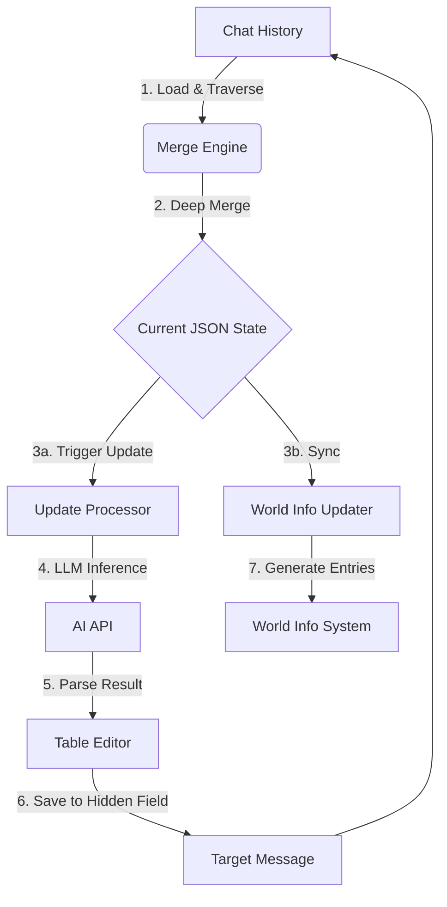

# 神·数据库 (ACU) 架构分析 (AutoCardUpdater Architecture Analysis)

**版本**: 1.0.0
**日期**: 2026-01-04
**状态**: Reference
**源文档**: `10_references/数据库/js-split-merged/AI_REFERENCE_README.md`, `10_references/数据库/ACU_Architecture_Analysis.md`
**关联文档**: [`../core/mnemosyne-data-engine.md`](../core/mnemosyne-data-engine.md)

---

## 1. 简介

本文档提供了对 "神·数据库 V8" (AutoCardUpdater, ACU) 插件的深入架构分析。ACU 是 Clotho 项目中 Mnemosyne 数据引擎的重要设计参考来源，特别是其 **"基于聊天记录的去中心化存储"** 和 **"自动数据更新循环"** 理念。

## 2. 核心架构模式

ACU 采用 **全局函数式架构**，主要特征如下：

*   **命名空间隔离**: 所有核心函数和变量均挂载在全局作用域下，并统一使用 `_ACU` 后缀（如 `settings_ACU`, `processUpdates_ACU`），以避免与 SillyTavern 其他插件冲突。
*   **隐式依赖**: 模块间不通过 `import` 显式引用，而是依赖 HTML 加载顺序和全局变量的存在性。
*   **分散式存储**: 数据并不存储在单一的物理文件中，而是分散存储在聊天记录 (Chat History) 的隐藏字段 (`TavernDB_ACU_IsolatedData`) 中，运行时通过遍历合并。

## 3. 数据流转机制 (Data Flow)

ACU 的核心创新在于其数据处理流水线，这一设计直接启发了 Clotho 的 Mnemosyne 引擎。

### 3.1 关键环节详解

1.  **加载与合并 (Merge Engine)**:
    *   **逻辑**: 倒序遍历聊天记录，查找包含 `TavernDB_ACU_IsolatedData` 的消息。
    *   **策略**: 对每个数据表 (Sheet)，取其**最后一次出现**的版本作为最新状态，并在内存中合并为一个完整的 JSON 对象。
    *   **Clotho 借鉴**: 演化为 Mnemosyne 的 **Layered Runtime** 和 **Patching** 机制。

2.  **自动更新 (Update Processor)**:
    *   **触发**: 基于 Token 阈值或对话轮次。
    *   **上下文**: 构建一个包含 "当前数据库状态" + "新增聊天内容" 的 Prompt。
    *   **AI 任务**: 要求 AI 识别聊天中的状态变更（如好感度变化、物品获得），并返回结构化的更新指令。

3.  **数据隔离 (Data Isolation)**:
    *   **机制**: 每个数据块都有唯一的 `isolationCode`。
    *   **目的**: 支持多时间线 (Timelines) 和分支剧情 (Branches)，防止不同分支的数据相互污染。

## 4. 目录结构与功能映射

为了方便 AI 检索，以下是 ACU 源码目录与功能的映射表：

| 目录/文件 | 描述 | 关键函数 (以 `_ACU` 结尾) |
| :--- | :--- | :--- |
| `core/` | **核心层**: 初始化、配置加载、API 桥接 | `mainInitialize`, `loadSettings` |
| `chat/loader.js` | **数据源**: 从 ST 获取聊天记录 | `loadAllChatMessages` |
| `data/data-merge.js` | **合并引擎**: 核心逻辑，合并分散数据 | `mergeAllIndependentTables` |
| `data/isolation.js` | **存储层**: 处理数据隔离与写入 | `saveIndependentTableToChatHistory` |
| `update/processor.js` | **更新控制器**: 协调 AI 调用流程 | `processUpdates` |
| `ai/api-call.js` | **AI 接口**: 封装 LLM 请求 | `callCustomOpenAI` |
| `worldbook/` | **同步层**: 将数据转换为 World Info | `updateReadableLorebookEntry` |

## 5. 对 Clotho 的启示

ACU 的架构设计为 Clotho 提供了宝贵的经验：

1.  **去中心化存储的可行性**: 证明了将状态分散存储在 Timeline 中是实现"时间旅行"和"分支管理"的有效手段。
2.  **结构化更新的重要性**: 让 LLM 输出结构化数据（JSON/XML）而非自然语言，是实现自动化状态管理的关键。
3.  **可读性与数据性的平衡**: 通过 `World Info Updater` 将 JSON 数据转化为人类和 LLM 均可读的 Markdown 表格，极大地提升了 RAG 的效果。
