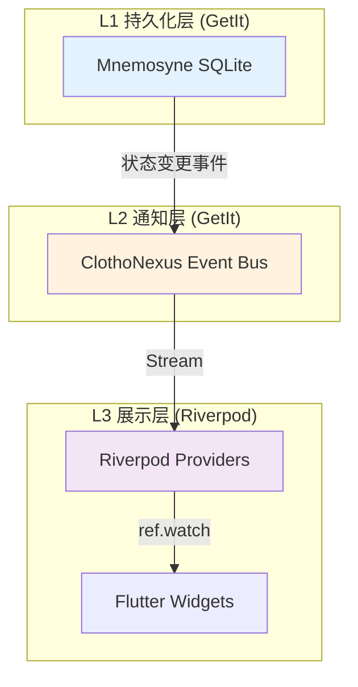
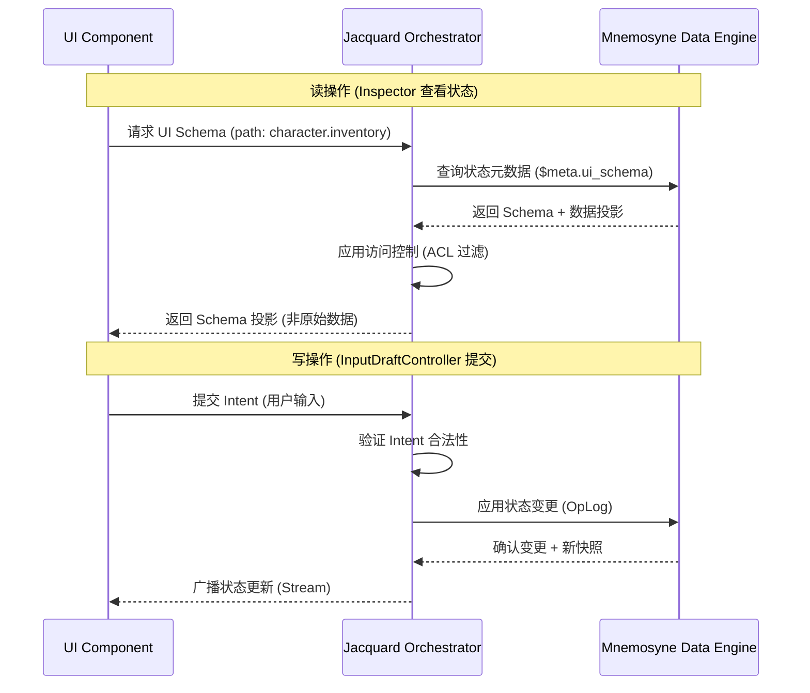
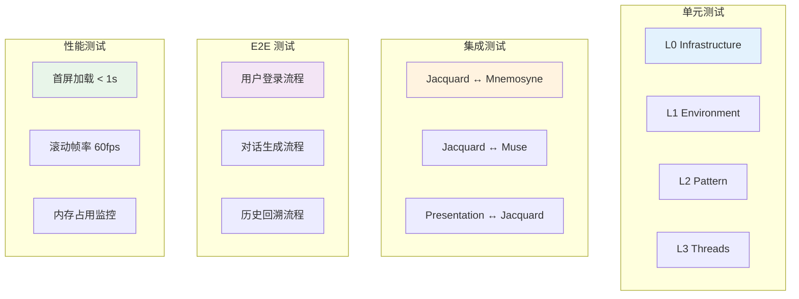

# Clotho 架构一致性审计报告 (Architecture Consistency Audit Report)

**版本**: 1.2.0
**日期**: 2026-03-11
**状态**: Active
**审计范围**: `00_active_specs/` 目录下所有设计文档
**审计依据**: Flutter 最佳实践、Clean Architecture、SOLID 原则、官方设计指南

---

## 📖 术语使用说明

本文档使用**技术语义术语**：

| 术语 | 说明 |
|------|------|
| **Session** | 会话实例 |
| **Persona** | 角色设定 |
| **Jacquard** | 编排层 |
| **Mnemosyne** | 数据引擎 |

在代码实现时，请使用 [`../naming-convention.md`](../naming-convention.md) 中定义的技术术语。

> **注**: 本文档中引用的旧术语（如 "Character Card"）仅用于标识需要修复的文档位置。

---

## 执行摘要 (Executive Summary)

本次审计对 Clotho 项目 `00_active_specs/` 目录下的全部设计文档进行了深度交叉比对分析，涵盖基础设施层、编排层、数据层、表现层、智能服务层及协议规范。

### 审计发现概览

| 严重程度 | 问题数量 | 状态 |
| :--- | :--- | :--- |
| 🔴 **高 (High)** | 5 | 3 已修复，2 待处理 |
| 🟡 **中 (Medium)** | 8 | 1 已修复，7 待处理 |
| 🟢 **低 (Low)** | 6 | 建议优化 |

### 整体评估

Clotho 架构设计在核心理念（凯撒原则、分层架构、协议统一）上表现出高度一致性，文档质量整体优秀。

### 修复进度

| 问题编号 | 问题描述 | 状态 | 修复文档 |
|----------|----------|------|----------|
| H-01 | 状态管理策略定义冲突 | ✅ 已修复 | [`architecture-principles.md`](../architecture-principles.md), [`clotho-nexus-events.md`](../infrastructure/clotho-nexus-events.md), [`multi-package-architecture.md`](../infrastructure/multi-package-architecture.md) |
| H-02 | 错误处理机制在关键模块缺失 | ✅ 已修复 | [`module-error-handling-strategies.md`](../infrastructure/module-error-handling-strategies.md) |
| H-03 | 依赖注入方案描述不一致 | ✅ 已修复 | [`dependency-injection.md`](../infrastructure/dependency-injection.md) |
| H-04 | API 接口契约未明确定义 | ✅ 已修复 | [`interface-definitions.md`](../protocols/interface-definitions.md) |
| H-05 | UI 组件规范与底层数据流存在耦合风险 | ✅ 已修复 | [`presentation/README.md`](../presentation/README.md), [`13-inspector.md`](../presentation/13-inspector.md), [`15-input-draft-controller.md`](../presentation/15-input-draft-controller.md) |
| M-02 | 测试策略缺失 | ✅ 已修复 | [`testing-strategy.md`](../reference/testing-strategy.md) |

---

## 第一部分：高严重性问题 (High Severity Issues)

### H-01: 状态管理策略定义冲突

**问题描述**: 多个文档对状态管理的权威源定义存在不一致。

**冲突位置**:
| 文档 | 位置 | 定义 |
|------|------|------|
| [`architecture-principles.md`](../architecture-principles.md:53) | 2.2 单向数据流 | "Mnemosyne 是唯一的状态权威源" |
| [`clotho-nexus-events.md`](../infrastructure/clotho-nexus-events.md:14-24) | 4. 核心职责 | ClothoNexus 负责"生命周期广播"和"驱动自动化" |
| [`multi-package-architecture.md`](../infrastructure/multi-package-architecture.md:175-196) | 4.2 混合 DI 架构 | GetIt 管理核心层状态，Riverpod 管理 UI 层状态 |

**潜在影响**:
- 开发人员可能混淆状态存储位置，导致状态同步问题
- 在回溯/分支操作时可能出现状态不一致
- 测试时难以 Mock 正确的状态源

**修复状态**: ✅ **已修复**

**修复内容**:

1. **在 [`architecture-principles.md`](../architecture-principles.md) 中新增"2.3 状态管理分层"章节**
   - 定义三层状态管理架构：持久化层 (Mnemosyne)、通知层 (ClothoNexus)、展示层 (Riverpod)
   - 提供状态管理分层表格和 Mermaid 数据流示意图
   - 明确核心原则：状态存储唯一性、状态通知解耦、状态投影局部性
   - 提供职责边界说明表格

2. **在 [`clotho-nexus-events.md`](../infrastructure/clotho-nexus-events.md) 中新增"2.1 与 Mnemosyne 的职责边界"章节**
   - 明确 ClothoNexus 是状态变更通知总线，Mnemosyne 是状态存储权威源
   - 提供职责对照表格（状态存储、事件广播、历史回溯、快照生成、数据持久化）
   - 添加协作流程序列图
   - 链接到架构原则的状态管理分层章节

3. **在 [`multi-package-architecture.md`](../infrastructure/multi-package-architecture.md) 中新增"4.2.1 状态管理分层"章节**
   - 将状态管理分层与 DI 边界对应
   - 提供 DI 容器与状态管理层次映射表格
   - 添加 Mermaid 图示说明 GetIt 容器与 Riverpod 容器的关系

**修复后的状态管理架构**:



**核心原则**:
- **状态存储唯一性**: Mnemosyne 是唯一的状态存储权威源 (SSOT for State Storage)
- **状态通知解耦**: ClothoNexus 是状态变更通知总线 (State Change Notification Bus)，不存储状态
- **状态投影局部性**: Riverpod 管理 UI 层的状态投影，数据来源于 ClothoNexus 事件流

**优先级**: 🔴 P0 - ✅ 已完成

---

### H-02: 错误处理机制在关键模块缺失

**问题描述**: 虽然 [`error-handling-and-cancellation.md`](../infrastructure/error-handling-and-cancellation.md) 定义了通用错误处理框架，但多个关键模块未明确其错误处理策略。

**缺失位置**:
| 模块 | 文档 | 缺失内容 |
|------|------|----------|
| **Jacquard Pipeline** | [`jacquard/README.md`](../jacquard/README.md) | 插件崩溃时的恢复策略、Pipeline 中断处理 |
| **Filament Parser** | [`filament-parsing-workflow.md`](../protocols/filament-parsing-workflow.md) | ESR 注册表为空时的降级策略 |
| **Mnemosyne OpLog** | [`mnemosyne/sqlite-architecture.md`](../mnemosyne/sqlite-architecture.md) | OpLog 应用失败时的回滚机制 |
| **Muse Gateway** | [`muse/README.md`](../muse/README.md) | Provider 切换时的状态一致性保证 |

**潜在影响**:
- 生产环境中单点故障可能导致整个系统崩溃
- 用户数据可能在错误恢复过程中丢失或损坏
- 难以进行故障诊断和根因分析

**修复建议**:
1. 在各模块文档中增加 **"错误处理 (Error Handling)"** 章节
2. 定义统一的错误传播链:
   ```mermaid
   graph LR
       L1[组件内部错误] --> L2[组件错误处理器]
       L2 --> L3{可恢复？}
       L3 -->|是 | L4[执行恢复策略]
       L3 -->|否 | L5[上报 ClothoNexus]
       L5 --> L6[全局错误处理器]
       L6 --> L7[用户提示/日志记录]
   ```

**优先级**: 🔴 P0 - 需在实现前补充

---

### H-03: 依赖注入方案描述不一致

**问题描述**: 不同文档对依赖注入的实现方案描述存在矛盾。

**冲突位置**:
| 文档 | 位置 | 描述 |
|------|------|------|
| [`multi-package-architecture.md`](../infrastructure/multi-package-architecture.md:167-196) | 4.1 技术选型 | "GetIt（核心层） + Riverpod（UI 层）的混合架构" |
| [`clotho-nexus-events.md`](../infrastructure/clotho-nexus-events.md:101-142) | 5. 接口规范 | "ClothoNexus 作为单例服务由 GetIt 管理" |
| [`presentation/README.md`](../presentation/README.md:109-117) | 5.1 单向数据流 | "UI 是消费者...通过 Stream 广播状态变更" |

**问题分析**:
- 未明确说明 GetIt 和 Riverpod 之间的边界和交互方式
- 未定义跨包依赖注入的具体实现模式
- 缺少服务生命周期管理的说明

**修复建议**:
1. 在 [`multi-package-architecture.md`](../infrastructure/multi-package-architecture.md) 中增加详细的 DI 边界图:
   ```mermaid
   graph TB
       subgraph "Core Packages (GetIt)"
           G1[Repository]
           G2[UseCase]
           G3[Service]
       end
       
       subgraph "UI Package (Riverpod)"
           R1[Provider]
           R2[StateNotifier]
           R3[StreamProvider]
       end
       
       G1 -.->|暴露为| R1
       G2 -.->|暴露为| R2
       G3 -.->|暴露为| R3
       
       style G1 fill:#e3f2fd
       style R1 fill:#fff3e0
   ```
2. 明确服务注册和解析的责任边界

**优先级**: 🔴 P0 - 需在实现前澄清

---

### H-04: API 接口契约未明确定义

**问题描述**: 多个关键组件间的接口契约仅以伪代码形式存在，缺少正式的接口定义。

**缺失位置**:
| 接口 | 相关文档 | 缺失内容 |
|------|----------|----------|
| **Jacquard ↔ Mnemosyne** | [`jacquard/README.md`](../jacquard/README.md), [`mnemosyne/README.md`](../mnemosyne/README.md) | 快照请求/响应的正式 Schema |
| **Jacquard ↔ Muse** | [`muse/README.md`](../muse/README.md) | LLM 请求/响应的完整类型定义 |
| **Presentation ↔ Jacquard** | [`presentation/README.md`](../presentation/README.md) | Intent/Event 的完整类型列表 |
| **Schema Injector ↔ Parser** | [`schema-injector.md`](../jacquard/schema-injector.md), [`filament-parsing-workflow.md`](../protocols/filament-parsing-workflow.md) | `parser_hints` 的完整 Schema |

**潜在影响**:
- 不同开发者实现同一接口时可能产生不兼容
- 难以进行接口级别的单元测试
- 文档与实现容易脱节

**修复建议**:
1. 在 `protocols/` 目录下新增 `interface-definitions.md` 文档
2. 使用 Dart 语言定义所有公共接口:
   ```dart
   /// Jacquard 与 Mnemosyne 的接口契约
   abstract class IMnemosyneAdapter {
     /// 请求上下文快照
     Future<Punchcards> getSnapshot({
       required String sessionId,
       required int turnIndex,
       SnapshotOptions? options,
     });
     
     /// 应用状态变更
     Future<void> applyChanges({
       required String sessionId,
       required List<OpLog> changes,
     });
   }
   ```

**优先级**: 🔴 P0 - 需在实现前补充

---

### H-05: UI 组件规范与底层数据流存在耦合风险

**问题描述**: 表现层文档中部分描述暗示 UI 组件可能直接访问底层数据，违反"凯撒原则"和单向数据流。

**风险位置**:
| 文档 | 位置 | 风险描述 |
|------|------|----------|
| [`presentation/README.md`](../presentation/README.md:84-93) | 4.2 Inspector | "当用户在 Inspector 中选择查看某个状态节点时...系统会检查该节点及其父节点中的 `$meta.ui_schema` 属性" |
| [`presentation/README.md`](../presentation/README.md:95-104) | 4.3 InputDraftController | "UI 子系统与用户输入之间的**唯一写通道**" |

**问题分析**:
- Inspector 组件直接读取 `$meta.ui_schema` 可能绕过 Jacquard 编排层
- "写通道"的定义不清晰，未说明如何与 Mnemosyne 状态更新协调

**修复状态**: ✅ **已修复**

**修复内容**:

1. **在 [`presentation/README.md`](../presentation/README.md) 中新增"5.3 数据访问边界"章节**
   - 定义了 UI 组件的数据访问路径表格
   - 添加了完整的 Mermaid 序列图说明读/写操作的正确流程
   - 列举了违反边界的后果和正确做法
   - 提供了正确和错误的代码示例对比

2. **在 [`13-inspector.md`](../presentation/13-inspector.md) 中新增"1.2 数据访问边界"章节**
   - 明确 Inspector 通过 Jacquard 获取 UI Schema
   - 添加了数据访问流程图
   - 提供了状态同步机制的正确实现示例

3. **在 [`15-input-draft-controller.md`](../presentation/15-input-draft-controller.md) 中新增"1.2 写通道与 Mnemosyne 协调机制"章节**
   - 明确 InputDraftController 作为唯一写通道的职责边界
   - 添加了写操作的完整数据流序列图
   - 提供了安全约束表格和正确/错误示例对比

4. **在 [`interface-definitions.md`](../protocols/interface-definitions.md) 中新增"5.5 Presentation ↔ Jacquard 接口"章节**
   - 定义了 `JacquardUIAdapter` 接口契约
   - 包含 `UISchemaRequest/Response`、`DataProjectionRequest/Response`、`IntentSubmitRequest/Response` 等类型定义
   - 提供了完整的使用示例和错误示例

**修复后的数据流**:



**核心原则**:
- ❌ **禁止**: UI 直接读取 Mnemosyne 状态树
- ✅ **允许**: UI 通过 Jacquard 代理访问数据
- ❌ **禁止**: UI 直接写入 Mnemosyne
- ✅ **允许**: UI 通过 `Jacquard.submitIntent()` 提交意图

**优先级**: 🔴 P0 - ✅ 已完成

---

## 第二部分：中严重性问题 (Medium Severity Issues)

### M-01: 文档版本不一致

**问题描述**: 部分文档版本号与内容成熟度不匹配。

| 文档 | 当前版本 | 状态 | 问题 |
|------|----------|------|------|
| [`filament-protocol-overview.md`](../protocols/filament-protocol-overview.md) | v2.3.0 | Draft | 协议已相对成熟，建议升级为 Active |
| [`architecture-principles.md`](../architecture-principles.md) | v1.0.0 | Draft | 核心原则文档应标记为 Active |
| [`mnemosyne/README.md`](../mnemosyne/README.md) | v1.1.0 | Draft | 内容完整，建议升级 |

**修复建议**: 统一审查所有文档版本，将成熟文档状态更新为 Active

**优先级**: 🟡 P1

---

### M-02: 测试策略缺失

**问题描述**: 所有文档均未定义明确的测试策略。

**缺失内容**:
- 单元测试覆盖范围要求
- 集成测试场景定义
- 端到端测试流程
- 性能基准测试方法

**修复状态**: ✅ **已修复**

**修复内容**:

1. **创建 [`testing-strategy.md`](../reference/testing-strategy.md) 文档**
   - 定义测试金字塔模型（单元测试、集成测试、E2E 测试、性能基准测试）
   - 定义 L0-L3 分层测试策略
   - 定义子系统测试规范（Jacquard、Mnemosyne、Presentation、Muse）
   - 定义 Filament 协议测试规范
   - 定义测试工具与技术栈
   - 定义 CI/CD 集成方案
   - 提供测试数据管理指南
   - 包含测试检查清单附录

**修复后的测试策略架构**:



**优先级**: 🟡 P1 - ✅ 已完成

---

### M-03: 安全审计日志规范缺失

**问题描述**: [`logging-standards.md`](../infrastructure/logging-standards.md) 定义了通用日志规范，但未涉及安全审计日志。

**缺失内容**:
- 用户操作审计日志
- 状态变更审计追踪
- 敏感数据访问日志

**修复建议**: 在 [`logging-standards.md`](../infrastructure/logging-standards.md) 中增加 **"安全审计日志"** 章节

**优先级**: 🟡 P1

---

### M-04: 性能优化策略未定义

**问题描述**: 虽然 [`architecture-principles.md`](../architecture-principles.md:84-90) 定义了性能基调，但未提供具体优化策略。

**缺失内容**:
- 大数据量历史记录的惰性加载策略
- 图片/媒体资源的缓存策略
- 向量检索的性能优化

**修复建议**: 在各模块文档中增加 **"性能考虑 (Performance Considerations)"** 章节

**优先级**: 🟡 P1

---

### M-05: 国际化 (i18n) 支持未定义

**问题描述**: 文档中未涉及多语言支持策略。

**缺失内容**:
- UI 文本的多语言方案
- LLM 输出的语言选择机制
- 日期/时间/数字的本地化

**修复建议**: 在 `presentation/` 目录下新增 `internationalization.md` 文档

**优先级**: 🟡 P1

---

### M-06: 数据迁移策略不完整

**问题描述**: [`migration-strategy.md`](../workflows/migration-strategy.md) 仅关注 ST 生态迁移，未涉及 Clotho 自身版本间的数据迁移。

**修复建议**: 扩展迁移策略文档，增加 **"Clotho 版本间数据迁移"** 章节

**优先级**: 🟡 P1

---

### M-07: 监控与可观测性定义不足

**问题描述**: [`logging-standards.md`](../infrastructure/logging-standards.md) 定义了日志规范，但缺少完整的可观测性策略。

**缺失内容**:
- 性能指标收集 (Metrics)
- 分布式追踪 (Tracing)
- 健康检查端点

**修复建议**: 在 `infrastructure/` 目录下新增 `observability.md` 文档

**优先级**: 🟡 P1

---

### M-08: 第三方依赖管理策略缺失

**问题描述**: 文档中未定义第三方依赖的选择标准、版本管理和安全更新策略。

**修复建议**: 在 `infrastructure/` 目录下新增 `dependency-management.md` 文档

**优先级**: 🟡 P1

---

## 第三部分：低严重性问题 (Low Severity Issues)

### L-01: 术语使用不一致

**问题描述**: 部分文档中混用新旧术语。

| 文档 | 位置 | 问题 |
|------|------|------|
| [`mnemosyne/sqlite-architecture.md`](../mnemosyne/sqlite-architecture.md) | 1.1 | 使用"Character Card"而非"Pattern" |
| [`workflows/character-import-migration.md`](../workflows/character-import-migration.md) | 多处 | 混用"Character Card"和"Pattern" |

**修复状态**: ✅ **已修复**

**修复内容**: 执行全局术语审查，统一使用 [`metaphor-glossary.md`](../metaphor-glossary.md) 定义的标准术语

**修复范围**:
1. **Character Card (角色卡)** → **Pattern (织谱)**: 统一替换所有非引用性使用的"角色卡"和"Character Card"
2. **World Info (世界书)** → **Lore (纹理)**: 统一替换所有非引用性使用的"世界书"和"World Info"
3. **Chat History/Message History (历史记录)** → **Threads (丝络)**: 统一替换所有非引用性使用的"历史记录"

**例外保留**:
- `metaphor-glossary.md` 中的概念映射表（作为新旧术语对照参考）
- `runtime/layered-runtime-architecture.md` 中的注释性说明"(原 Character Card)"
- 代码示例中的遗留宏名称（如 `{{wiBefore}}` 等）
- 与 SillyTavern 直接相关的迁移文档中的引用性描述

**优先级**: 🟢 P2 - ✅ 已完成

---

### L-02: 代码示例风格不统一

**问题描述**: 不同文档中的代码示例风格不一致。

**问题**:
- 部分使用 TypeScript，部分使用 Dart
- 缩进风格不统一
- 注释风格不一致

**修复建议**: 在 [`documentation_standards.md`](../reference/documentation_standards.md) 中增加 **"代码示例规范"** 章节

**优先级**: 🟢 P2

---

### L-03: Mermaid 图表语法错误风险

**问题描述**: 部分 Mermaid 图表中使用了可能导致解析错误的语法。

**问题**:
- 在 `[]` 内使用双引号
- 节点 ID 包含特殊字符

**修复建议**: 使用 Mermaid 语法验证工具检查所有图表

**优先级**: 🟢 P2

---

### L-04: 文档链接有效性

**问题描述**: 部分文档中的相对链接可能指向不存在的文件。

**修复建议**: 执行链接有效性检查脚本

**优先级**: 🟢 P2

---

### L-05: 缺少快速入门指南

**问题描述**: 新开发者难以快速上手。

**修复建议**: 在 `00_active_specs/` 目录下新增 `quick-start.md` 文档

**优先级**: 🟢 P2

---

### L-06: 缺少架构决策记录 (ADR)

**问题描述**: 关键设计决策未记录决策过程和备选方案。

**修复建议**: 在 `00_active_specs/reference/` 目录下新增 `adr/` 子目录，记录关键架构决策

**优先级**: 🟢 P2

---

## 第四部分：Clean Architecture 合规性评估

### 依赖规则合规性

| 原则 | 合规状态 | 说明 |
|------|----------|------|
| **依赖向内** | ✅ 符合 | 文档中定义的依赖方向正确：UI → Jacquard → Mnemosyne → Infrastructure |
| **层次隔离** | ⚠️ 部分符合 | 部分文档暗示 UI 可能直接访问 Mnemosyne |
| **实体独立性** | ✅ 符合 | 实体层不依赖任何外部组件 |

### SOLID 原则合规性

| 原则 | 合规状态 | 说明 |
|------|----------|------|
| **单一职责 (SRP)** | ✅ 符合 | 各组件职责定义清晰 |
| **开闭原则 (OCP)** | ✅ 符合 | 插件化设计支持扩展 |
| **里氏替换 (LSP)** | ⚠️ 待验证 | 需要接口定义后才能验证 |
| **接口隔离 (ISP)** | ⚠️ 待验证 | 需要接口定义后才能验证 |
| **依赖倒置 (DIP)** | ✅ 符合 | 依赖注入设计合理 |

---

## 第五部分：建议优先级汇总

| 优先级 | 问题编号 | 建议完成时间 |
|--------|----------|--------------|
| **P0** | H-01, H-02, H-03, H-04, H-05 | 实现开始前 |
| **P1** | M-01, M-03 ~ M-08 | 第一个里程碑前 |
| **P2** | L-01 ~ L-06 | 文档持续改进 |

---

## 第六部分：审计结论

### 架构优势

1. **核心理念清晰**: 凯撒原则、分层架构、协议统一等核心设计理念贯穿所有文档
2. **隐喻体系完整**: 纺织隐喻体系（Pattern、Tapestry、Threads、Jacquard）应用一致
3. **模块化设计优秀**: 各子系统职责边界清晰，插件化设计支持扩展

### 需改进领域

1. **接口契约形式化**: 需要将伪代码升级为正式的接口定义
2. **错误处理完整性**: 各模块需补充错误处理策略
3. **状态管理澄清**: 需明确区分状态存储和状态通知

### 总体评价

Clotho 架构设计文档整体质量优秀，核心理念先进且一致。高严重性问题主要集中在**实现细节的形式化定义**上，建议在进入实现阶段前优先解决这些问题。

**修复进度更新**: 截至 2026-03-02，M-02（测试策略缺失）已修复，[`testing-strategy.md`](../reference/testing-strategy.md) 文档已创建，定义了完整的测试金字塔模型、L0-L3 分层测试策略、子系统测试规范及 CI/CD 集成方案。

---

**审计完成日期**: 2026-02-26  
**审计者**: 资深 Flutter 架构师 (Architect Mode)  
**下次审计建议**: 在首个 MVP 版本完成后进行二次审计，验证实现与文档的一致性
