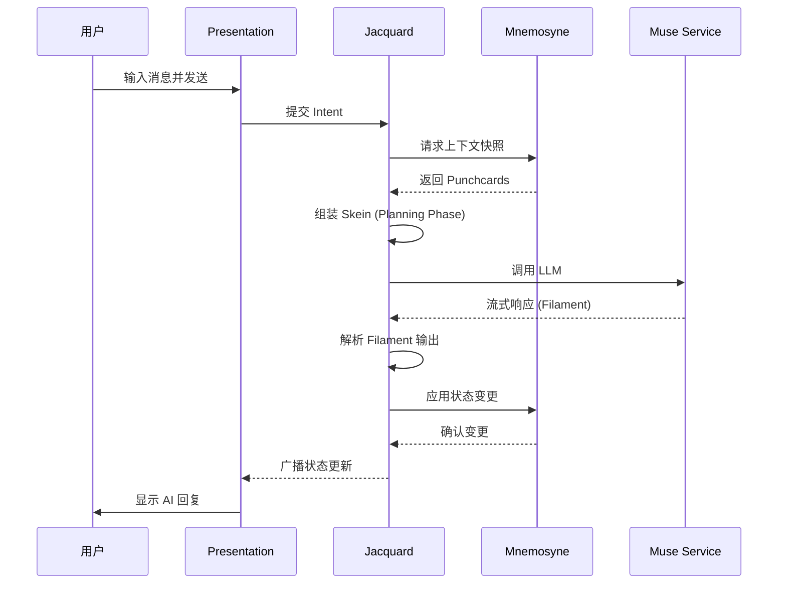

# Clotho 测试策略 (Clotho Testing Strategy)

**版本**: 1.0.0
**日期**: 2026-03-02
**状态**: Active
**关联审计**: [`architecture-audit-report.md`](architecture-audit-report.md#m-02-测试策略缺失)

---

## 1. 简介 (Introduction)

### 1.1 文档目的

本文档定义 Clotho 项目的完整测试策略，涵盖测试金字塔模型、各层测试责任、子系统测试规范、协议测试、工具链选型及 CI/CD 集成。

### 1.2 测试哲学

> **"测试是织卷的质检工序——确保每一根丝络 (Threads) 都牢固，每一幅织谱 (Pattern) 都可信赖。"**

Clotho 采用 **测试金字塔 (Test Pyramid)** 模型，强调：
- **大量单元测试**: 快速反馈，覆盖核心逻辑
- **适量集成测试**: 验证组件间交互
- **少量 E2E 测试**: 确保完整用户流程正确

### 1.3 测试覆盖目标

| 测试类型 | 覆盖率目标 | 执行频率 | 执行阶段 |
| :--- | :--- | :--- | :--- |
| **单元测试** | ≥80% 行覆盖率 | 每次提交 | Pre-commit / CI |
| **集成测试** | 关键路径 100% | 每次 PR | CI |
| **E2E 测试** | 核心用户流程 | 每日/发布前 | CI / Staging |
| **性能基准** | 关键指标监控 | 每周/发布前 | CI |

---

## 2. 测试金字塔模型 (Test Pyramid Model)

### 2.1 金字塔结构

```mermaid
graph BT
    subgraph "测试金字塔"
        E2E[E2E 测试 (5-10%)\n完整用户流程\n慢速、高成本]
        INT[集成测试 (20-30%)\n组件间交互\n中速、中成本]
        UNIT[单元测试 (60-70%)\n函数/方法级别\n快速、低成本]
    end
    
    UNIT -->|支撑 | INT
    INT -->|支撑 | E2E
    
    style UNIT fill:#e8f5e9
    style INT fill:#fff3e0
    style E2E fill:#fce4ec
```

### 2.2 单元测试 (Unit Tests)

**定义**: 测试最小的可测试单元，通常是单个函数、方法或类。

**覆盖范围要求**:
- 所有业务逻辑函数
- 数据转换/解析函数
- 状态计算逻辑
- 工具类方法

**编码规范**:
```dart
// ✅ 正确示例：单元测试命名规范
test('SkeinBuilder 应从 Mnemosyne 加载上下文快照', () {
  // Given
  final mockMnemosyne = MockMnemosyne();
  final builder = SkeinBuilder(mnemosyne: mockMnemosyne);
  
  // When
  await builder.build(tapestryId: 'test-123', turnId: 'turn-5');
  
  // Then
  verify(mockMnemosyne.getSnapshot(
    tapestryId: 'test-123',
    turnId: 'turn-5',
  )).called(1);
});

// ❌ 错误示例：命名不清晰
test('test1', () { ... });
test('builder test', () { ... });
```

**AAA 模式**:
- **Arrange (准备)**: 设置测试数据和 Mock 对象
- **Act (执行)**: 调用被测试的方法
- **Assert (断言)**: 验证结果是否符合预期

### 2.3 集成测试 (Integration Tests)

**定义**: 测试多个组件之间的交互和协作。

**测试场景**:
| 场景 | 组件 | 验证点 |
| :--- | :--- | :--- |
| **Jacquard → Mnemosyne** | 编排层 + 数据层 | 快照获取、状态更新、OpLog 应用 |
| **Jacquard → Muse** | 编排层 + 智能服务 | LLM 请求/响应、流式处理 |
| **Presentation → Jacquard** | UI 层 + 编排层 | Intent 提交、状态订阅 |
| **Filament Parser → State Updater** | 协议解析 + 状态更新 | 解析结果正确应用 |

**示例**:
```dart
// 集成测试：Jacquard 与 Mnemosyne 交互
test('Jacquard 应能从 Mnemosyne 获取快照并组装 Skein', () async {
  // Given: 设置集成测试环境
  final container = createTestContainer();
  final jacquard = container.read<Jacquard>();
  final mnemosyne = container.read<Mnemosyne>();
  
  // 预置测试数据
  await mnemosyne.createTapestry(patternId: 'pattern-001');
  await mnemosyne.addTurn(tapestryId: 'tapestry-001', messages: [...]);
  
  // When: 执行 Jacquard 流程
  final result = await jacquard.processTurn(
    tapestryId: 'tapestry-001',
    userInput: '你好',
  );
  
  // Then: 验证集成结果
  expect(result.skein, isNotNull);
  expect(result.skein.historyChain, isNotEmpty);
  verify(mnemosyne.getSnapshot(any)).called(1);
});
```

### 2.4 端到端测试 (E2E Tests)

**定义**: 测试完整的用户流程，从 UI 交互到数据持久化。

**核心用户流程**:


**E2E 测试用例**:
1. **创建新织卷 (Tapestry)**: 选择织谱 → 创建实例 → 验证初始状态
2. **发送消息**: 输入 → 发送 → 等待响应 → 验证历史更新
3. **状态变更**: 触发状态更新 → 验证 Inspector 显示
4. **历史回溯**: 选择历史消息 → 分支 → 验证新分支状态
5. **织卷切换**: 保存当前 → 切换织卷 → 验证状态恢复

### 2.5 性能基准测试 (Performance Benchmarks)

**性能指标**:
| 指标 | 目标值 | 测量方法 |
| :--- | :--- | :--- |
| **冷启动时间** | < 2s (Web), < 1s (Desktop) | `integration_test` |
| **首帧渲染时间** | < 100ms | `flutter_performance_test` |
| **历史加载 (1000 轮)** | < 500ms | 自定义基准测试 |
| **状态更新延迟** | < 50ms | 事件时间戳对比 |
| **内存占用** | < 200MB (空闲), < 500MB (负载) | `dart:developer` |

**基准测试示例**:
```dart
// 性能基准测试：历史加载
@BenchmarkGroup()
class HistoryLoadingBenchmarks {
  @Benchmark()
  @Timeout(Duration(seconds: 5))
  Future<void> load1000Turns(Suite suite) async {
    final mnemosyne = createTestMnemosyne();
    
    // 预置 1000 轮历史
    await seedHistory(mnemosyne, turnCount: 1000);
    
    // 测量加载时间
    suite.benchmark(
      'load_1000_turns',
      () => mnemosyne.getSnapshot(tapestryId: 'test', turnId: '1000'),
      unit: 'ms',
    );
  }
}
```

---

## 3. 分层测试策略 (Layered Testing Strategy)

根据 Clotho 的 **L0-L3 分层运行时架构**，各层测试责任定义如下：

### 3.1 L0 Infrastructure 层测试

**测试对象**: 依赖注入容器、事件总线、日志系统

**测试重点**:
```dart
// 测试：DI 容器服务注册与解析
test('GetIt 容器应正确注册和解析核心服务', () {
  // Given
  final container = GetIt.instance;
  container.registerSingleton<Mnemosyne>(MockMnemosyne());
  container.registerSingleton<Jacquard>(JacquardImpl());
  
  // When
  final jacquard = container<Jacquard>();
  
  // Then
  expect(jacquard, isA<JacquardImpl>());
  expect(jacquard.mnemosyne, isA<MockMnemosyne>());
});

// 测试：ClothoNexus 事件总线
test('ClothoNexus 应正确广播和订阅事件', () async {
  // Given
  final nexus = ClothoNexus();
  final events = <Event>[];
  
  nexus.subscribe<StateChangeEvent>((event) {
    events.add(event);
  });
  
  // When
  nexus.publish(StateChangeEvent(
    tapestryId: 'test-001',
    newState: {'hp': 100},
  ));
  
  // Then
  await pumpEventQueue();
  expect(events.length, 1);
  expect(events.first, isA<StateChangeEvent>());
});

// 测试：日志系统
test('Logger 应正确记录不同级别的日志', () {
  // Given
  final logger = Logger('TestComponent');
  final logSink = TestLogSink();
  logger.addSink(logSink);
  
  // When
  logger.info('测试信息');
  logger.warning('警告信息');
  logger.error('错误信息');
  
  // Then
  expect(logSink.entries.length, 3);
  expect(logSink.entries[0].level, LogLevel.info);
  expect(logSink.entries[1].level, LogLevel.warning);
  expect(logSink.entries[2].level, LogLevel.error);
});
```

### 3.2 L1 Environment 层测试

**测试对象**: 全局 Lore 管理、User Persona

**测试重点**:
```dart
// 测试：全局 Lore 加载与过滤
test('Environment 层应正确加载和过滤全局 Lore', () {
  // Given
  final environment = EnvironmentLayer(
    globalLorebooks: [
      Lorebook(name: '世界规则', entries: [...]),
      Lorebook(name: '通用知识', entries: [...]),
    ],
  );
  
  // When: 根据条件过滤 Lore
  final filtered = environment.getLore(
    categories: ['世界规则'],
    enabled: true,
  );
  
  // Then
  expect(filtered.length, 1);
  expect(filtered.first.name, '世界规则');
});

// 测试：User Persona 管理
test('User Persona 应支持多配置文件切换', () async {
  // Given
  final personaManager = PersonaManager();
  await personaManager.loadProfile('profile-001');
  
  // When: 切换到另一个配置
  await personaManager.switchProfile('profile-002');
  
  // Then
  expect(personaManager.currentProfile.id, 'profile-002');
  expect(personaManager.currentProfile.name, '测试用户');
});
```

### 3.3 L2 Pattern 层测试

**测试对象**: 织谱加载、织谱验证、Pattern 投影

**测试重点**:
```dart
// 测试：织谱加载与验证
test('PatternLoader 应正确加载和验证织谱文件', () async {
  // Given
  final loader = PatternLoader();
  final patternData = {
    'spec': 'v3.0',
    'name': '测试角色',
    'description': '测试描述',
    'first_mes': '你好！',
  };
  
  // When
  final pattern = await loader.loadFromData(patternData);
  
  // Then
  expect(pattern.name, '测试角色');
  expect(pattern.isValid, true);
  expect(pattern.errors, isEmpty);
});

// 测试：Pattern 验证规则
test('Pattern 验证器应检测缺失的必要字段', () {
  // Given
  final validator = PatternValidator();
  final invalidPattern = {
    'spec': 'v3.0',
    // 缺失 name 字段
  };
  
  // When
  final result = validator.validate(invalidPattern);
  
  // Then
  expect(result.isValid, false);
  expect(result.errors, contains('缺少必要字段：name'));
});

// 测试：L3 Patch 应用到 L2 Pattern
test('Patching 机制应正确应用 L3 变更到 L2 基底', () {
  // Given
  final basePattern = {
    'character': {
      'name': '原始名称',
      'description': '原始描述',
    },
  };
  
  final patches = {
    'character.description': '更新后的描述',
  };
  
  // When
  final projected = applyPatches(basePattern, patches);
  
  // Then
  expect(projected['character']['name'], '原始名称'); // 未变更
  expect(projected['character']['description'], '更新后的描述'); // 已更新
});
```

### 3.4 L3 Threads 层测试

**测试对象**: 状态变更、历史回溯、分支操作

**测试重点**:
```dart
// 测试：状态变更与 OpLog 记录
test('L3 层应正确记录状态变更 OpLog', () async {
  // Given
  final session = SessionLayer(tapestryId: 'test-001');
  await session.initialize();
  
  // When: 执行状态变更
  await session.updateState(
    path: 'character.hp',
    value: 80,
  );
  
  // Then
  final oplog = session.oplogs.last;
  expect(oplog.operation, 'replace');
  expect(oplog.path, '/character/hp');
  expect(oplog.value, 80);
});

// 测试：历史回溯 (Time Travel)
test('Session 层应支持回溯到历史任意节点', () async {
  // Given: 创建包含多个轮次的历史
  final session = SessionLayer(tapestryId: 'test-001');
  await session.addTurn(messages: [...]); // Turn 1
  await session.addTurn(messages: [...]); // Turn 2
  await session.addTurn(messages: [...]); // Turn 3
  
  // When: 回溯到 Turn 2
  await session.rewindTo(turnId: 'turn-2');
  
  // Then
  expect(session.currentTurn.index, 2);
  expect(session.history.length, 2);
  // Turn 3 的状态变更不应存在
  expect(session.state['character']['hp'], isNot(equals(turned3Hp)));
});

// 测试：分支操作 (Branching)
test('Session 层应支持从历史节点创建新分支', () async {
  // Given
  final session = SessionLayer(tapestryId: 'test-001');
  await session.addTurn(messages: [...]); // Turn 1
  await session.addTurn(messages: [...]); // Turn 2
  
  // When: 从 Turn 1 创建分支
  final branchId = await session.createBranch(
    fromTurnId: 'turn-1',
    branchName: '分支剧情',
  );
  
  // Then
  expect(branchId, isNotEmpty);
  final branch = await session.loadBranch(branchId);
  expect(branch.history.length, 1); // 只包含 Turn 1
  expect(branch.id, isNot(equals('test-001')));
});
```

---

## 4. 子系统测试规范 (Subsystem Testing Specifications)

### 4.1 Jacquard 编排层测试

**测试对象**: Pipeline 执行、插件系统、Skein 容器

#### 4.1.1 Pipeline 测试

```dart
// 测试：完整 Pipeline 执行流程
test('Jacquard Pipeline 应正确执行完整生成流程', () async {
  // Given
  final pipeline = JacquardPipeline();
  pipeline.registerPlugin(PlannerPlugin());
  pipeline.registerPlugin(SchedulerPlugin());
  pipeline.registerPlugin(SkeinBuilderPlugin());
  pipeline.registerPlugin(RendererPlugin());
  pipeline.registerPlugin(InvokerPlugin());
  pipeline.registerPlugin(ParserPlugin());
  pipeline.registerPlugin(StateUpdaterPlugin());
  
  // When
  final result = await pipeline.execute(
    tapestryId: 'test-001',
    userInput: '你好',
  );
  
  // Then: 验证每个阶段的输出
  expect(result.plannerContext, isNotNull);
  expect(result.skein, isNotNull);
  expect(result.llmResponse, isNotNull);
  expect(result.stateChanges, isNotEmpty);
});

// 测试：插件执行顺序
test('Pipeline 应按正确顺序执行插件', () async {
  // Given
  final executionOrder = <String>[];
  final pipeline = JacquardPipeline();
  
  pipeline.registerPlugin(TestPlugin(
    name: 'A',
    phase: Phase.decision,
    onExecute: () => executionOrder.add('A'),
  ));
  pipeline.registerPlugin(TestPlugin(
    name: 'B',
    phase: Phase.preparation,
    onExecute: () => executionOrder.add('B'),
  ));
  pipeline.registerPlugin(TestPlugin(
    name: 'C',
    phase: Phase.construction,
    onExecute: () => executionOrder.add('C'),
  ));
  
  // When
  await pipeline.execute(tapestryId: 'test', userInput: 'test');
  
  // Then
  expect(executionOrder, ['A', 'B', 'C']);
});
```

#### 4.1.2 插件测试

```dart
// 测试：Planner 插件的聚焦管理
test('PlannerPlugin 应正确检测意图变更并更新 Focus', () async {
  // Given
  final planner = PlannerPlugin();
  final context = PlannerContext(
    activeQuestId: 'quest-001',
    history: [...],
  );
  
  // When: 用户输入暗示话题切换
  final decision = await planner.analyzeIntent(
    userInput: '我们先不聊这个了，说说那个任务吧',
    context: context,
  );
  
  // Then
  expect(decision.shouldSwitchFocus, true);
  expect(decision.newActiveQuestId, isNotNull);
});

// 测试：Scheduler 插件的时间触发
test('SchedulerPlugin 应在达到指定楼层时触发事件', () async {
  // Given
  final scheduler = SchedulerPlugin();
  final state = SessionState(
    schedulerContext: SchedulerContext(
      currentFloor: 99,
    ),
  );
  
  // When: 楼层 +1，达到 100 的触发条件
  final injects = await scheduler.onTurnEnd(
    state: state,
    floorThreshold: 100,
  );
  
  // Then
  expect(injects, isNotEmpty);
  expect(injects.first.type, PromptBlockType.system);
});
```

#### 4.1.3 Skein 容器测试

```dart
// 测试：Skein 编织算法
test('Skein Weaving 应正确将 Floating Chain 注入 History Chain', () {
  // Given
  final skein = Skein(
    systemChain: [SystemBlock('系统指令')],
    historyChain: [
      HistoryBlock('用户：你好'),
      HistoryBlock('AI: 你好！'),
      HistoryBlock('用户：今天天气如何？'),
      HistoryBlock('AI: 天气不错。'),
    ],
    floatingChain: [
      FloatingBlock(
        content: 'World Info: 低语森林',
        injectionConfig: InjectionConfig(
          position: RelativePosition.relativeToEnd,
          depth: 2, // 倒数第 2 条之前
        ),
      ),
    ],
  );
  
  // When
  final woven = skein.weave();
  
  // Then: World Info 应注入到倒数第 2 条之前
  expect(woven.length, 5);
  expect(woven[2].content, 'World Info: 低语森林');
});
```

### 4.2 Mnemosyne 数据引擎测试

**测试对象**: SQLite 操作、OpLog 系统、快照生成

#### 4.2.1 SQLite 操作测试

```dart
// 测试：SQLite 事务处理
test('Mnemosyne 应正确处理 SQLite 事务和回滚', () async {
  // Given
  final db = MnemosyneDatabase();
  await db.initialize();
  
  // When: 执行事务性操作
  await db.transaction(() async {
    await db.insertTurn(tapestryId: 'test', turnData: {...});
    await db.updateState(tapestryId: 'test', path: 'hp', value: 50);
    // 模拟错误
    throw Exception('测试回滚');
  }).catchError((_) => null);
  
  // Then: 事务应回滚，数据不变
  final turns = await db.getTurns(tapestryId: 'test');
  expect(turns.length, 0); // 没有新增 Turn
});

// 测试：批量操作性能
test('Mnemosyne 应支持批量插入历史数据', () async {
  // Given
  final db = MnemosyneDatabase();
  final turns = List.generate(100, (i) => TurnData(
    index: i,
    messages: [...],
  ));
  
  // When
  final stopwatch = Stopwatch()..start();
  await db.batchInsertTurns(tapestryId: 'test', turns: turns);
  stopwatch.stop();
  
  // Then
  expect(stopwatch.elapsedMilliseconds, lessThan(1000)); // < 1s
  final count = await db.getTurnCount(tapestryId: 'test');
  expect(count, 100);
});
```

#### 4.2.2 OpLog 测试

```dart
// 测试：OpLog 应用与回滚
test('OpLog 系统应正确应用和回滚操作', () async {
  // Given
  val initialState = {'hp': 100, 'mana': 50};
  val oplog = OpLog(
    operation: 'replace',
    path: '/hp',
    value: 80,
  );
  
  // When: 应用 OpLog
  val newState = applyOpLog(initialState, oplog);
  
  // Then
  expect(newState['hp'], 80);
  expect(newState['mana'], 50); // 未变更
  
  // When: 回滚 OpLog
  val rolledBack = rollbackOpLog(newState, oplog);
  
  // Then
  expect(rolledBack['hp'], 100);
});

// 测试：OpLog 序列化与反序列化
test('OpLog 应支持 JSON 序列化和反序列化', () {
  // Given
  final oplog = OpLog(
    operation: 'add',
    path: '/inventory/sword',
    value: {'count': 1, 'type': 'weapon'},
    timestamp: DateTime(2026, 3, 2),
  );
  
  // When
  final json = oplog.toJson();
  final restored = OpLog.fromJson(json);
  
  // Then
  expect(restored.operation, oplog.operation);
  expect(restored.path, oplog.path);
  expect(restored.value, oplog.value);
});
```

#### 4.2.3 快照生成测试

```dart
// 测试：稀疏快照生成
test('Mnemosyne 应每 50 轮生成一个全量快照', () async {
  // Given
  final mnemosyne = Mnemosyne();
  await mnemosyne.initialize();
  
  // When: 添加 100 轮历史
  for (var i = 0; i < 100; i++) {
    await mnemosyne.addTurn(tapestryId: 'test', messages: [...]);
  }
  
  // Then: 应有 2 个全量快照 (第 50 轮和第 100 轮)
  final snapshots = await mnemosyne.getSnapshots(tapestryId: 'test');
  expect(snapshots.length, 2);
  expect(snapshots[0].turnIndex, 50);
  expect(snapshots[1].turnIndex, 100);
});

// 测试：快照重建 (Snapshot + OpLog)
test('Mnemosyne 应能从快照和 OpLog 重建状态', () async {
  // Given
  final snapshot = Snapshot(
    turnIndex: 50,
    state: {'hp': 100, 'level': 10},
  );
  final oplogs = [
    OpLog(operation: 'replace', path: '/hp', value: 80),
    OpLog(operation: 'replace', path: '/level', value: 11),
  ];
  
  // When
  final restored = await Mnemosyne.rebuildState(
    snapshot: snapshot,
    oplogs: oplogs,
  );
  
  // Then
  expect(restored['hp'], 80);
  expect(restored['level'], 11);
});
```

### 4.3 Presentation 表现层测试

**测试对象**: Widget 测试、Riverpod Provider 测试、SDUI 渲染测试

#### 4.3.1 Widget 测试

```dart
// 测试：MessageBubble Widget
testWidgets('MessageBubble 应正确显示用户消息', (tester) async {
  // Given
  final message = Message(
    role: MessageRole.user,
    content: '测试消息',
    timestamp: DateTime(2026, 3, 2),
  );
  
  // When
  await tester.pumpWidget(
    MaterialApp(
      home: MessageBubble(message: message),
    ),
  );
  
  // Then
  expect(find.text('测试消息'), findsOneWidget);
  expect(find.byIcon(Icons.person), findsOneWidget); // 用户图标
});

// 测试：InputArea Widget
testWidgets('InputArea 应在点击发送按钮时触发回调', (tester) async {
  // Given
  var submitCalled = false;
  await tester.pumpWidget(
    MaterialApp(
      home: InputArea(
        onSubmit: (text) => submitCalled = true,
      ),
    ),
  );
  
  // When: 输入文本并点击发送
  await tester.enterText(find.byType(TextField), '测试输入');
  await tester.tap(find.byIcon(Icons.send));
  await tester.pump();
  
  // Then
  expect(submitCalled, true);
});
```

#### 4.3.2 Riverpod Provider 测试

```dart
// 测试：SessionState Provider
testWidgets('SessionStateProvider 应正确管理会话状态', (tester) async {
  // Given
  final container = ProviderContainer();
  addTearDown(container.dispose);
  
  // When: 更新状态
  container.read(sessionStateProvider.notifier).update(
    (state) => state.copyWith(hp: 80),
  );
  
  // Then
  final state = container.read(sessionStateProvider);
  expect(state.hp, 80);
});

// 测试：StreamProvider 状态同步
testWidgets('StreamProvider 应正确接收 Jacquard 的状态更新', (tester) async {
  // Given
  final mockJacquard = MockJacquard();
  final stateStream = StreamController<StateUpdate>();
  when(mockJacquard.stateStream).thenAnswer((_) => stateStream.stream);
  
  final container = ProviderContainer(
    overrides: [
      jacquardProvider.overrideWithValue(mockJacquard),
    ],
  );
  
  // When: 发送状态更新
  stateStream.add(StateUpdate(hp: 80));
  await tester.pump();
  
  // Then
  final state = container.read(sessionStateProvider);
  expect(state.hp, 80);
});
```

#### 4.3.3 SDUI 渲染测试

```dart
// 测试：Hybrid SDUI 路由调度
test('SDUI 路由应优先使用 RFW 渲染器', () async {
  // Given
  final registry = MockExtensionRegistry();
  when(registry.hasExtension('status_bar')).thenAnswer((_) => true);
  
  final router = SDUIRouter(registry: registry);
  
  // When
  final renderer = await router.getRenderer(
    contentType: 'status_bar',
    contentId: 'character-status',
  );
  
  // Then
  expect(renderer, isA<RFWRenderer>());
});

// 测试：WebView 兜底机制
test('SDUI 路由应在无 RFW 扩展时使用 WebView 兜底', () async {
  // Given
  final registry = MockExtensionRegistry();
  when(registry.hasExtension('unknown_type')).thenAnswer((_) => false);
  
  final router = SDUIRouter(registry: registry);
  
  // When
  final renderer = await router.getRenderer(
    contentType: 'unknown_type',
    contentId: 'test',
  );
  
  // Then
  expect(renderer, isA<WebViewRenderer>());
});
```

### 4.4 Muse 智能服务测试

**测试对象**: LLM Gateway、Provider 切换、技能系统

#### 4.4.1 LLM Gateway 测试

```dart
// 测试：Raw Gateway 执行
test('IntelligenceGateway 应正确执行 LLM 请求', () async {
  // Given
  final gateway = IntelligenceGateway();
  final config = ModelConfig(
    provider: 'openai',
    model: 'gpt-4',
  );
  final messages = [
    RawMessage(role: 'system', content: '你是一个助手'),
    RawMessage(role: 'user', content: '你好'),
  ];
  
  // When
  final response = await gateway.executeRaw(
    config: config,
    messages: messages,
  );
  
  // Then
  expect(response.content, isNotEmpty);
  expect(response.usage, isNotNull);
});

// 测试：流式响应处理
test('IntelligenceGateway 应正确处理流式响应', () async {
  // Given
  final gateway = IntelligenceGateway();
  final stream = gateway.streamRaw(
    config: ModelConfig(provider: 'openai', model: 'gpt-4'),
    messages: [...],
  );
  
  // When & Then: 收集流式响应
  final chunks = <String>[];
  await for (final chunk in stream) {
    chunks.add(chunk.content);
  }
  expect(chunks.length, greaterThan(0));
  expect(chunks.join(''), isNotEmpty);
});
```

#### 4.4.2 Provider 切换测试

```dart
// 测试：Model Router 路由策略
test('ModelRouter 应根据配置正确路由到 Provider', () async {
  // Given
  final router = ModelRouter(
    config: RouterConfig(
      defaultProvider: 'openai',
      fallbackProvider: 'anthropic',
    ),
  );
  
  // When: 请求 OpenAI
  final provider = await router.selectProvider(
    preference: ProviderPreference.openai,
  );
  
  // Then
  expect(provider.id, 'openai');
});

// 测试：故障转移机制
test('ModelRouter 应在主 Provider 失败时切换到备用', () async {
  // Given
  final mockOpenAI = MockOpenAIProvider();
  when(mockOpenAI.generate(any)).thenThrow(Exception('API Error'));
  
  final router = ModelRouter(
    providers: [mockOpenAI, MockAnthropicProvider()],
    fallbackStrategy: FallbackStrategy.nextAvailable,
  );
  
  // When & Then: 应自动切换到备用 Provider
  final response = await router.generate(messages: [...]);
  expect(response, isNotNull);
  verifyNever(mockOpenAI.generate(any)); // OpenAI 未被调用（或调用后切换）
});
```

---

## 5. Filament 协议测试 (Filament Protocol Testing)

### 5.1 输入格式 (XML+YAML) 解析测试

```dart
// 测试：Filament 输入格式解析
test('FilamentInputParser 应正确解析 XML+YAML 输入', () {
  // Given
  final input = '''
<filament_input>
  <context>
    <character>
      name: 爱丽丝
      description: 森林中的治愈师
    </character>
    <state>
      hp: 100
      mana: 50
    </state>
  </context>
  <user_input>你好，爱丽丝</user_input>
</filament_input>
''';
  
  // When
  final parsed = FilamentInputParser.parse(input);
  
  // Then
  expect(parsed.context.character.name, '爱丽丝');
  expect(parsed.context.state['hp'], 100);
  expect(parsed.userInput, '你好，爱丽丝');
});

// 测试：YAML 数据绑定
test('FilamentInputParser 应正确处理 YAML 中的复杂数据结构', () {
  // Given
  final yamlBlock = '''
inventory:
  - id: sword
    count: 1
    type: weapon
  - id: potion
    count: 5
    type: consumable
''';
  
  // When
  final data = YamlUtils.parse(yamlBlock);
  
  // Then
  expect(data['inventory'].length, 2);
  expect(data['inventory'][0]['id'], 'sword');
});
```

### 5.2 输出格式 (XML+JSON) 解析测试

```dart
// 测试：Filament 输出格式解析
test('FilamentOutputParser 应正确解析 XML+JSON 输出', () async {
  // Given
  final output = '''
<filament_output>
  <thought>{"content": "用户打招呼了，我应该友好回应"}</thought>
  <reply>{"content": "你好！我是爱丽丝，森林里的治愈师。"}</reply>
  <state_update>
    [{"op": "replace", "path": "/character/mood", "value": "happy"}]
  </state_update>
</filament_output>
''';
  
  // When
  final parsed = await FilamentOutputParser.parse(output);
  
  // Then
  expect(parsed.thoughts, isNotEmpty);
  expect(parsed.reply, isNotEmpty);
  expect(parsed.stateUpdates.length, 1);
  expect(parsed.stateUpdates[0].path, '/character/mood');
});

// 测试：流式解析
test('FilamentOutputParser 应支持流式解析', () async {
  // Given
  final stream = Stream.fromIterable([
    '<filament_output>',
    '  <reply>{"content": "你好',
    '！"}</reply>',
    '</filament_output>',
  ]);
  
  // When
  final chunks = <ParsedChunk>[];
  await for (final chunk in FilamentOutputParser.parseStream(stream)) {
    chunks.add(chunk);
  }
  
  // Then
  expect(chunks.any((c) => c.type == ChunkType.reply), true);
});
```

### 5.3 Jinja2 宏系统测试

```dart
// 测试：Jinja2 模板渲染
test('Jinja2Renderer 应正确渲染模板', () {
  // Given
  final template = '''

状态良好

需要治疗

''';
  final context = {'character': {'hp': 80}};
  
  // When
  final rendered = Jinja2Renderer.render(template, context);
  
  // Then
  expect(rendered.trim(), '状态良好');
});

// 测试：Jinja2 沙箱安全
test('Jinja2Renderer 应阻止危险操作', () {
  // Given
  final maliciousTemplate = '''
{{ ''.__class__.__mro__[2].__subclasses__() }}
''';
  
  // When & Then: 应抛出安全异常
  expect(
    () => Jinja2Renderer.render(maliciousTemplate, {}),
    throwsA(isA<Jinja2SecurityError>()),
  );
});

// 测试：宏函数注册与调用
test('Jinja2Renderer 应支持自定义宏函数', () {
  // Given
  Jinja2Renderer.registerFunction('format_hp', (int hp) {
    if (hp > 80) return '健康';
    if (hp > 50) return '轻伤';
    return '重伤';
  });
  
  final template = '{{ format_hp(character.hp) }}';
  final context = {'character': {'hp': 60}};
  
  // When
  final rendered = Jinja2Renderer.render(template, context);
  
  // Then
  expect(rendered.trim(), '轻伤');
});
```

### 5.4 Schema 验证测试

```dart
// 测试：Filament Schema 验证
test('FilamentSchemaValidator 应验证输出格式合规性', () {
  // Given
  const validOutput = '''
<filament_output>
  <reply>{"content": "测试"}</reply>
</filament_output>
''';
  
  const invalidOutput = '''
<filament_output>
  <reply>纯文本，没有 JSON</reply>
</filament_output>
''';
  
  // When & Then
  expect(
    FilamentSchemaValidator.validate(validOutput).isValid,
    true,
  );
  expect(
    FilamentSchemaValidator.validate(invalidOutput).isValid,
    false,
  );
});

// 测试：动态协议 Schema 注入
test('SchemaInjector 应正确注入动态协议 Schema', () async {
  // Given
  final injector = SchemaInjector();
  await injector.loadSchema('combat_protocol.yaml');
  
  // When
  final injected = await injector.inject(
    basePrompt: '基础 Prompt',
    activeProtocols: ['combat_protocol'],
  );
  
  // Then
  expect(injected, contains('战斗协议指令'));
  expect(injected, contains('combat_protocol 的示例'));
});
```

---

## 6. 测试工具与技术栈 (Testing Tools & Tech Stack)

### 6.1 Flutter 测试框架

| 工具 | 用途 | 版本 |
| :--- | :--- | :--- |
| **flutter_test** | 官方单元测试框架 | Flutter 内置 |
| **mockito** | Mock 对象生成 | ^5.4.0 |
| **riverpod_test** | Riverpod Provider 测试 | ^2.0.0 |
| **fake_async** | 异步代码测试 | ^1.3.0 |

**依赖配置**:
```yaml
# pubspec.yaml
dev_dependencies:
  flutter_test:
    sdk: flutter
  mockito: ^5.4.0
  riverpod_test: ^2.0.0
  fake_async: ^1.3.0
```

### 6.2 集成测试工具

| 工具 | 用途 | 说明 |
| :--- | :--- | :--- |
| **integration_test** | 官方集成测试框架 | Flutter 内置 |
| **patrol** | 跨平台 E2E 测试 | 支持原生交互 |

**Patrol 配置**:
```yaml
# patrol.yaml
app_name: Clotho
test_runner: dart
android:
  package_name: com.clotho.app
ios:
  bundle_id: com.clotho.app
```

### 6.3 性能测试工具

| 工具 | 用途 |
| :--- | :--- |
| **flutter_performance_test** | 性能基准测试 |
| **dart:developer** | 内存/CPU 分析 |
| **Flutter DevTools** | 性能分析工具 |

### 6.4 代码覆盖率工具

| 工具 | 用途 |
| :--- | :--- |
| **lcov** | 覆盖率数据生成 |
| **coverde** | 覆盖率缺口检测 |

**覆盖率生成命令**:
```bash
# 运行测试并生成覆盖率
flutter test --coverage

# 生成 HTML 报告
genhtml coverage/lcov.info -o coverage/html

# 查看覆盖率报告
open coverage/html/index.html
```

---

## 7. CI/CD 集成 (CI/CD Integration)

### 7.1 GitHub Actions 工作流

```yaml
# .github/workflows/test.yml
name: Tests

on:
  push:
    branches: [main, develop]
  pull_request:
    branches: [main]

jobs:
  unit-tests:
    runs-on: ubuntu-latest
    steps:
      - uses: actions/checkout@v4
      - uses: subosito/flutter-action@v2
        with:
          flutter-version: '3.x'
      
      - name: Install dependencies
        run: flutter pub get
        working-directory: 08_demo
      
      - name: Run unit tests
        run: flutter test --coverage
        working-directory: 08_demo
      
      - name: Upload coverage
        uses: codecov/codecov-action@v3
        with:
          files: 08_demo/coverage/lcov.info
          fail_ci_if_error: true

  integration-tests:
    runs-on: ubuntu-latest
    steps:
      - uses: actions/checkout@v4
      - uses: subosito/flutter-action@v2
      
      - name: Run integration tests
        run: flutter test integration_test/
        working-directory: 08_demo

  code-analysis:
    runs-on: ubuntu-latest
    steps:
      - uses: actions/checkout@v4
      - uses: subosito/flutter-action@v2
      
      - name: Run analyzer
        run: flutter analyze
        working-directory: 08_demo

  performance-benchmarks:
    runs-on: ubuntu-latest
    if: github.event_name == 'push' && github.ref == 'refs/heads/main'
    steps:
      - uses: actions/checkout@v4
      - uses: subosito/flutter-action@v2
      
      - name: Run benchmarks
        run: flutter test --benchmark
        working-directory: 08_demo
      
      - name: Upload benchmark results
        uses: actions/upload-artifact@v3
        with:
          name: benchmark-results
          path: 08_demo/benchmarks/
```

### 7.2 测试触发条件

| 事件 | 触发的测试 |
| :--- | :--- |
| **本地提交** | 单元测试 (Pre-commit Hook) |
| **PR 创建** | 单元测试 + 集成测试 + 代码分析 |
| **合并到 main** | 全部测试 + 性能基准 |
| **每日定时** | E2E 测试 + 性能回归检测 |

### 7.3 覆盖率报告生成

**覆盖率要求**:
- 整体覆盖率 ≥ 80%
- 核心模块 (Jacquard, Mnemosyne) ≥ 90%
- 新增代码覆盖率 ≥ 95%

**Codecov 配置**:
```yaml
# codecov.yml
coverage:
  status:
    project:
      default:
        target: 80%
        threshold: 5%
    patch:
      default:
        target: 95%
```

### 7.4 性能回归检测

**性能阈值**:
```yaml
# benchmarks/thresholds.yaml
cold_start:
  warning: 2500ms
  error: 3000ms

history_load_1000:
  warning: 600ms
  error: 1000ms

memory_idle:
  warning: 250MB
  error: 300MB
```

**回归检测逻辑**:
- 如果性能指标超过 `error` 阈值 → CI 失败
- 如果性能指标超过 `warning` 阈值 → 发出警告通知

---

## 8. 测试数据管理 (Test Data Management)

### 8.1 测试织谱 (Pattern) 数据

**测试织谱分类**:
| 类型 | 用途 | 示例 |
| :--- | :--- | :--- |
| **基础织谱** | 基础功能测试 | `test-minimal-pattern.json` |
| **完整织谱** | 集成测试 | `test-full-pattern.json` |
| **边界织谱** | 边界条件测试 | `test-edge-case-pattern.json` |
| **无效织谱** | 验证错误处理 | `test-invalid-pattern.json` |

**示例：基础织谱**:
```json
{
  "spec": "v3.0",
  "name": "测试角色 - 最小化",
  "description": "用于单元测试的最小化织谱",
  "first_mes": "你好！",
  "creator_notes": "测试用途，不包含复杂设定"
}
```

### 8.2 测试织卷 (Tapestry) 数据

**测试织卷场景**:
| 场景 | 数据量 | 用途 |
| :--- | :--- | :--- |
| **空织卷** | 0 轮次 | 初始状态测试 |
| **短历史** | 10 轮次 | 基础功能测试 |
| **中历史** | 100 轮次 | 性能测试 |
| **长历史** | 1000+ 轮次 | 压力测试 |
| **多分支** | 3+ 分支 | 分支操作测试 |

**生成测试数据脚本**:
```dart
// test/fixtures/tapestry_generator.dart
Future<TapestryData> generateTestTapestry({
  required int turnCount,
  required String patternId,
}) async {
  final tapestry = TapestryData(
    id: uuid.v4(),
    patternId: patternId,
    createdAt: DateTime.now(),
  );
  
  for (var i = 0; i < turnCount; i++) {
    tapestry.turns.add(TurnData(
      index: i,
      messages: [
        Message(role: 'user', content: '测试消息 $i'),
        Message(role: 'assistant', content: '测试回复 $i'),
      ],
    ));
  }
  
  return tapestry;
}
```

### 8.3 Mock LLM 响应

**Mock 响应分类**:
| 类型 | 用途 | 示例 |
| :--- | :--- | :--- |
| **正常响应** | 基础流程测试 | 包含完整 Filament 标签 |
| **流式响应** | 流式处理测试 | 分块返回内容 |
| **错误响应** | 错误处理测试 | API 错误、超时 |
| **边界响应** | 边界条件测试 | 空响应、超长响应 |

**Mock LLM 实现**:
```dart
// test/mocks/mock_llm_gateway.dart
class MockLLMGateway implements IntelligenceGateway {
  final List<MockResponse> _responses = [];
  
  void addResponse(MockResponse response) {
    _responses.add(response);
  }
  
  @override
  Future<LLMResponse> executeRaw({
    required ModelConfig config,
    required List<RawMessage> messages,
    GenerationOptions? options,
  }) async {
    if (_responses.isEmpty) {
      return MockResponse.defaultResponse();
    }
    return _responses.removeAt(0);
  }
  
  @override
  Stream<LLMChunk> streamRaw({
    required ModelConfig config,
    required List<RawMessage> messages,
    GenerationOptions? options,
  }) async* {
    final response = await executeRaw(
      config: config,
      messages: messages,
      options: options,
    );
    
    // 模拟流式输出
    for (var i = 0; i < response.content.length; i += 10) {
      yield LLMChunk(
        content: response.content.substring(i, min(i + 10, response.content.length)),
      );
      await Future.delayed(const Duration(milliseconds: 50));
    }
  }
}

class MockResponse {
  final String content;
  final Map<String, dynamic>? stateUpdate;
  final List<String>? thoughts;
  
  MockResponse({
    required this.content,
    this.stateUpdate,
    this.thoughts,
  });
  
  static MockResponse defaultResponse() {
    return MockResponse(
      content: '''
<filament_output>
  <thought>{"content": "默认回复"}</thought>
  <reply>{"content": "你好！我是测试 AI。"}</reply>
</filament_output>
''',
    );
  }
}
```

---

## 9. 关联文档 (Related Documents)

| 文档 | 链接 |
| :--- | :--- |
| **文档标准** | [`documentation_standards.md`](documentation_standards.md) |
| **隐喻术语表** | [`../metaphor-glossary.md`](../metaphor-glossary.md) |
| **架构审计报告** | [`architecture-audit-report.md`](architecture-audit-report.md) |
| **分层运行时架构** | [`../runtime/layered-runtime-architecture.md`](../runtime/layered-runtime-architecture.md) |
| **Jacquard 编排层** | [`../jacquard/README.md`](../jacquard/README.md) |
| **Mnemosyne 数据引擎** | [`../mnemosyne/README.md`](../mnemosyne/README.md) |
| **Presentation 表现层** | [`../presentation/README.md`](../presentation/README.md) |
| **Muse 智能服务** | [`../muse/README.md`](../muse/README.md) |
| **Filament 协议概述** | [`../protocols/filament-protocol-overview.md`](../protocols/filament-protocol-overview.md) |

---

## 10. 附录：测试检查清单 (Appendix: Testing Checklist)

### 10.1 单元测试检查清单

- [ ] 所有公共方法都有对应的单元测试
- [ ] 边界条件已测试 (空值、最大值、最小值)
- [ ] 错误路径已测试 (异常、无效输入)
- [ ] Mock 对象正确隔离了外部依赖
- [ ] 测试命名清晰表达了测试意图

### 10.2 集成测试检查清单

- [ ] 组件间数据流正确
- [ ] 事件总线消息正确传递
- [ ] 数据库事务正确处理
- [ ] 跨层调用链路完整

### 10.3 E2E 测试检查清单

- [ ] 核心用户流程可执行
- [ ] UI 状态与后端同步
- [ ] 错误场景有适当提示
- [ ] 性能指标符合预期

### 10.4 性能测试检查清单

- [ ] 冷启动时间 < 2s
- [ ] 历史加载 (1000 轮) < 500ms
- [ ] 内存占用 < 500MB
- [ ] 帧率稳定在 60fps

---

**文档维护者**: Clotho 架构团队  
**最后更新**: 2026-03-02
