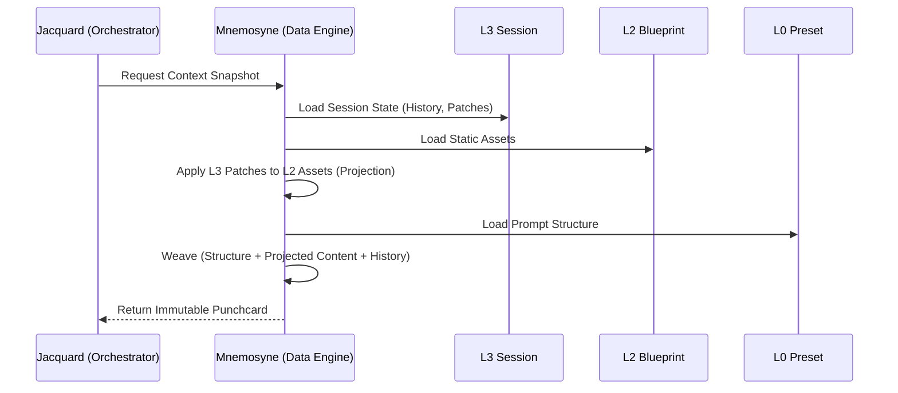

# 分层运行时环境架构 (Layered Runtime Architecture)

**版本**: 1.1.0
**日期**: 2025-12-30
**状态**: Draft
**作者**: 资深系统架构师 (Architect Mode)
**源文档**: `doc/architecture/00_architecture_panorama.md`

---

## 1. 核心设计哲学 (Core Philosophy)

为了解决传统 AI RPG 客户端（如 SillyTavern）中存在的状态混乱、设定成长与原始数据冲突、以及环境配置耦合严重的问题，Clotho 引入了 **"分层运行时环境 (Layered Runtime Architecture)"**。

这一架构借鉴了游戏引擎的 **"蓝图 (Blueprint) vs 实例 (Instance)"** 以及 Git 的 **"写时复制 (Copy-on-Write)"** 思想，将一个运行中的角色会话解构为四个物理隔离但逻辑叠加的层次。

在 Clotho 的隐喻体系中，我们将这种运行时结构描述为 **"织卷 (The Tapestry)"** 的编织过程。

**核心价值**:

* **动静分离**: 原始 **织谱 (The Pattern / L2)** 永远保持只读，作为编织的基准纹样。
* **成长性**: **织卷 (The Tapestry)** 可以在编织过程中通过 **丝络 (The Threads / L3)** 的变化经历性格突变，而不会污染原始织谱。
* **模版独立**: Prompt 结构（如 ChatML/Alpaca）与角色内容彻底解耦。
* **平行宇宙**: 支持基于同一角色的无限分支存档。

---

## 2. 四层叠加模型 (The Layered Sandwich)

Clotho 的 **织卷 (The Tapestry)** 是由以下四层数据在内存中动态 **"编织 (Weaving)"** 而成的：

```mermaid
graph TD
    subgraph "Top Level: The Tapestry (织卷 / 运行时实例)"
        direction TB
        
        subgraph "L0: Infrastructure (骨架)"
            Preset[Prompt Template]
        end

        subgraph "L1: Global Context (环境)"
            GlobalLore[通用纹理 / Lore]
            Persona[观察者 / Persona]
        end

        subgraph "L2: The Pattern (织谱 / 蓝图)"
            CardMeta[静态设定 (Name, Desc)]
            CharLore[固有纹理 (Base Lore)]
            CharAssets[视觉图样 (Assets)]
            Note2[Read-Only: 静态基因，决定织物底色]
        end

        subgraph "L3: The Threads (丝络 / 状态)"
            History[历史经纬 (History Chain)]
            StateTree[状态变量 (VWD)]
            Patches[动态修补 (Patches)]
            Note3[Read-Write: 动态生长，随时间演进]
        end
        
        Preset & GlobalLore --> TapestryNode((Tapestry Instance))
        CardMeta -->|Instantiated as| TapestryNode
        Patches -.->|Override| CardMeta
        History -->|Woven into| TapestryNode
    end
```

### 2.1 层级详解

| 层级 | 隐喻名称 (Metaphor) | 功能名称 | 职责 (Responsibility) | 读写权限 | 典型数据内容 |
| :--- | :--- | :--- | :--- | :--- | :--- |
| **L0** | **Infrastructure** | **骨架** | 定义与 LLM 的通信协议和 Prompt 结构。 | Read-Only | Prompt Template, API Config |
| **L1** | **Environment** | **环境** | 定义跨角色共享的世界规则与用户身份。 | Read-Only | User Persona, Global Lorebooks |
| **L2** | **The Pattern (织谱)** | **蓝图** | 定义角色的初始设定、固有特质与潜在逻辑。**(原 "Character Card")** | Read-Only | **Pattern Data** (Name, Desc, First Mes), Base Lorebooks, Regex Scripts |
| **L3** | **The Threads (丝络)** | **状态** | 记录角色的成长、记忆与状态变更。 | **Read-Write** | **Patches**, History Chain, VWD State Tree |

---

## 3. Patching 机制 (The Patching Mechanism)

Patching 是 L3 层的核心特性，它允许运行时状态对 L2 的静态定义进行 **非破坏性修改**。这是实现“角色成长”与“平行宇宙”的核心技术基础，遵循 **"写时复制 (Copy-on-Write)"** 原则。

### 3.1 工作原理

Mnemosyne 在 **上下文加载 (Context Load)** 阶段执行一次性的 **Deep Merge (深度合并)** 操作，构建运行时的 `Projected Entity`。为了优化启动性能，引入了 **Head State** 优先策略：

1.  **Fast Path (Head State)**: 尝试从 `active_states` 表读取最新的完整状态树。如果命中，直接跳过 OpLog 重放过程，仅需将状态树中的 `patches` 应用于 L2 基底。
2.  **Slow Path (Reconstruction)**: 如果 Head State 缺失，则回退到 "Snapshot + OpLog" 机制，重建出最新的状态树。
3.  **Hydrate (注水)**: 将重建/加载的状态树（包含变量与 Patch）应用到 L2 静态基底上，生成最终的 `Projected State`。
4.  **Runtime Modification (运行时修改)**: 此后所有的属性变更直接作用于内存对象，并同步触发 **Write-Back (回写)**，同时更新 `active_states` (热缓存) 和 `oplogs` (变更日志)。

`patches` 字典采用 **"路径-值"** 结构，例如：

```json
{
  "character.description": "A brave warrior who has seen many battles.",
  "character.lorebooks.town.enabled": false
}
```

### 3.2 Deep Merge 算法

Mnemosyne 的 Deep Merge 遵循以下优先级顺序：

1.  **L2 Base**: 加载 L2 的原始数据。
2.  **L3 Patches**: 遍历 L3 中的 `patches` 对象。
3.  **Merge**: 将 Patch 值覆盖到 Base 对象的对应路径上。
4.  **Conflict Resolution**: 如果同一路径存在多个 Patch（理论上不应发生，但作为防御性编程），后应用的 Patch 覆盖先前的。

```dart
// 伪代码：展示 Deep Merge 逻辑
Map<String, dynamic> applyPatches(Map<String, dynamic> base, Map<String, dynamic> patches) {
  // 1. 从 Base 创建副本 (Copy-on-Write)
  finalResult = Map<String, dynamic>.from(base);
  
  // 2. 遍历 Patches 并应用
  patches.forEach((path, value) {
    // 处理嵌套路径 "character.description"
    applyPathValue(finalResult, path.split('.'), value);
  });
  
  return finalResult;
}

void applyPathValue(Map target, List<String> pathSegments, dynamic value) {
    // 递归查找或创建路径，直到最后一个 segment，然后赋值
    // 此处省略具体递归实现细节
}
```

### 3.3 应用场景

*   **属性成长**: 角色从 level 1 升级到 level 99。L3 的 State Tree 更新，不影响 L2 的原始设定。
*   **设定重写**: 剧情导致角色从“修女”黑化为“魔女”。L3 存储一个针对 `description` 字段的 Patch，覆盖 L2 的原始描述。
*   **世界变迁**: 角色炸毁了“新手村”。L3 将 L2 中的“新手村”Lorebook 条目标记为 `enabled: false`，并新增一个 L3 独有的“废墟”条目。
*   **平行宇宙**: 基于同一 L2 创建多个 L3 实例（分支存档），每个实例拥有独立的 Patch 和 History，互不干扰。

---

## 4. 运行时数据流 (Runtime Data Flow)

当 Jacquard 发起推理请求时，数据流经各层并在 Mnemosyne 中聚合：



---

## 5. 聚合实体：Mnemosyne Context

最终传递给编排层 (Jacquard) 的是一个聚合后的上下文对象，我们称之为 **Mnemosyne Context**。

详细的数据结构定义请参阅 👉 **[Mnemosyne 抽象数据结构设计](../mnemosyne/abstract-data-structures.md#41-mnemosyne-context-聚合根)**。

```text
// 抽象结构示意 (Abstract Structure)
MnemosyneContext {
  // Layer 0: 策略与骨架
  infrastructure: {
    preset: PromptTemplate
    apiConfig: ApiConfiguration
  }
  
  // Layer 1 & 2 (Projected): 静态引用的投影 (已应用 Patch)
  world: {
    activeCharacter: ProjectedCharacter // L2 + L3 Patch
    globalLore: List<LorebookEntry>     // L1 + L3 Status
    user: PersonaData                   // L1
  }

  // Layer 3: 纯动态状态
  session: {
    history: List<Message>
    state: StateTree            // 完整的状态树视图
    planner: PlannerContext     // 规划上下文 (v1.2)
    patches: PatchMap           // 持久化变更集
  }
}
```

---

## 6. 关联文档

* **数据引擎**: [`../mnemosyne/README.md`](../mnemosyne/README.md)
* **工作流**: [`../workflows/character-import-migration.md`](../workflows/character-import-migration.md)
