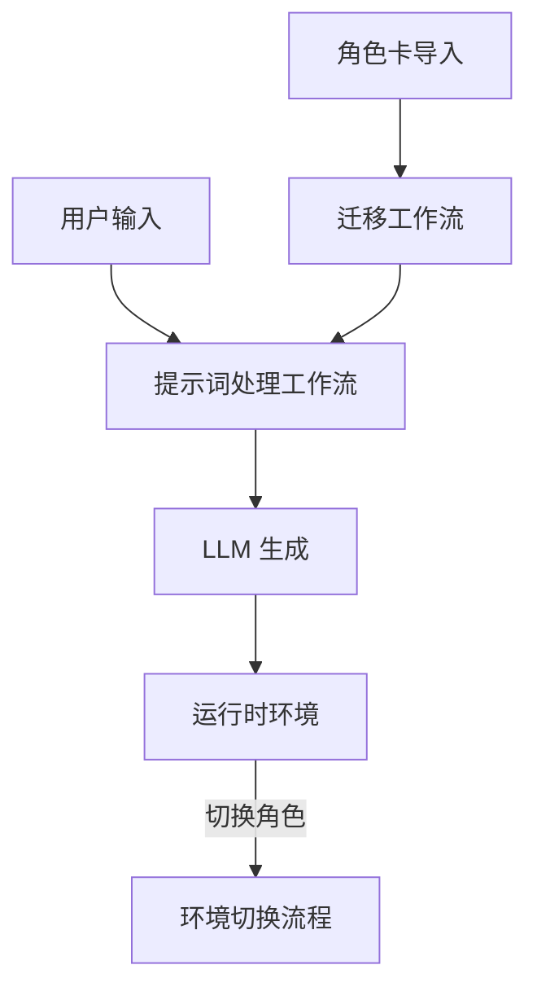

# 工作流与处理文档目录

**定位**: 系统核心业务流程和数据处理流程  
**目标读者**: 业务分析师、流程工程师、集成开发者  
**文档状态**: 已重组 (2025-12-30)

---

## 📖 目录简介

本目录包含 Clotho 系统的核心工作流和数据处理流程。这些文档描述了系统如何将用户输入转化为 LLM 请求，如何处理角色卡导入，以及如何管理复杂的迁移任务。

## 📚 文档列表

### 1. 提示词处理工作流

- **文件**: [`prompt-processing.md`](prompt-processing.md)
- **简介**: 描述 Clotho 的提示词处理流程，这是一个高度结构化、确定性的流水线。
- **核心内容**: 五阶段处理流程 (Planner → Skein Builder → Template Renderer → Assembler → LLM Invoker)、Late Binding 原则、Zero Side-Effect 原则
- **阅读建议**: 了解系统如何构建和发送 Prompt 给 LLM
- **关联文档**: 核心架构 [`../core/`](../core/)，协议目录 [`../protocols/`](../protocols/)

### 2. 角色卡导入与迁移指南

- **文件**: [`character-import-migration.md`](character-import-migration.md)
- **简介**: 完整的角色卡导入与迁移系统设计，采用“深度分析 → 双重分诊 → 专用通道”的半自动处理范式。
- **核心内容**: 核心分析引擎、世界书分诊策略、正则脚本分诊策略、交互流程设计、Prompt 格式规范化
- **阅读建议**: 了解如何将 SillyTavern 角色卡迁移到 Clotho 架构
- **关联文档**: 迁移策略 [`migration-strategy.md`](migration-strategy.md)，协议目录 [`../protocols/`](../protocols/)

### 3. 遗留生态迁移策略

- **文件**: [`migration-strategy.md`](migration-strategy.md)
- **简介**: 专注于 ST-Prompt-Template (EJS) 的迁移策略与流程设计。
- **核心内容**: 遗留系统分析、迁移流程设计 (扫描-建议-交互)、集成与实施计划
- **阅读建议**: 了解如何将 SillyTavern 的 EJS 脚本迁移到 Clotho 的 Jinja2 模板
- **关联文档**: 角色卡导入 [`character-import-migration.md`](character-import-migration.md)，协议目录 [`../protocols/jinja2-macro-system.md`](../protocols/jinja2-macro-system.md)

### 4. 运行时环境切换流程

- **文件**: [`runtime-environment-switching.md`](runtime-environment-switching.md)
- **简介**: 描述系统如何在不同的运行时环境（角色、预设、场景）之间切换。
- **核心内容**: Freeze-Unload-Hydrate-Resume 四阶段流程、状态保存与恢复、UI 组件重建
- **阅读建议**: 了解系统如何管理多角色会话和平行宇宙
- **关联文档**: 运行时环境 [`../runtime/`](../runtime/)，核心架构 [`../core/`](../core/)

## 🔗 工作流关系图

## 🧭 导航指南

### 从哪里开始？

如果您是**业务分析师**：

1. 从 [`prompt-processing.md`](prompt-processing.md) 开始，了解核心处理流程
2. 阅读 [`character-import-migration.md`](character-import-migration.md) 了解数据迁移过程

如果您是**流程工程师**：

1. 按顺序阅读所有文档，重点关注流程间的依赖关系
2. 使用流程图理解各阶段的数据转换

如果您是**集成开发者**：

1. 关注 [`migration-strategy.md`](migration-strategy.md) 了解与遗留系统的集成点
2. 查看 [`runtime-environment-switching.md`](runtime-environment-switching.md) 了解状态管理机制

### 相邻目录

- **核心架构** ([`../core/`](../core/)): 工作流的架构支撑
- **协议与格式** ([`../protocols/`](../protocols/)): 工作流中使用的数据格式
- **运行时环境** ([`../runtime/`](../runtime/)): 工作流的执行环境
- **参考文档** ([`../reference/`](../reference/)): 工作流中使用的技术参考

## 📝 文档更新记录

| 日期 | 版本 | 变更说明 |
|------|------|----------|
| 2025-12-30 | 2.0.0 | 文档重组，创建统一的工作流目录 |
| 2025-12-27 | 1.0.0 | 提示词处理工作流创建 |
| 2025-12-27 | 2.0.0 | 角色卡导入与迁移系统 v2.0 |
| 2025-12-23 | 1.0.0 | 遗留生态迁移策略创建 |

---

**最后更新**: 2025-12-30  
**维护者**: Clotho 工作流团队
