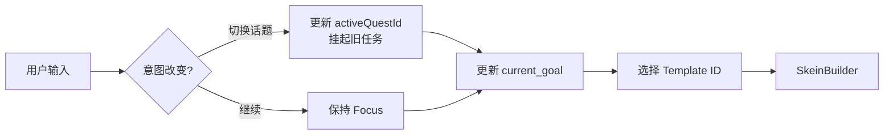
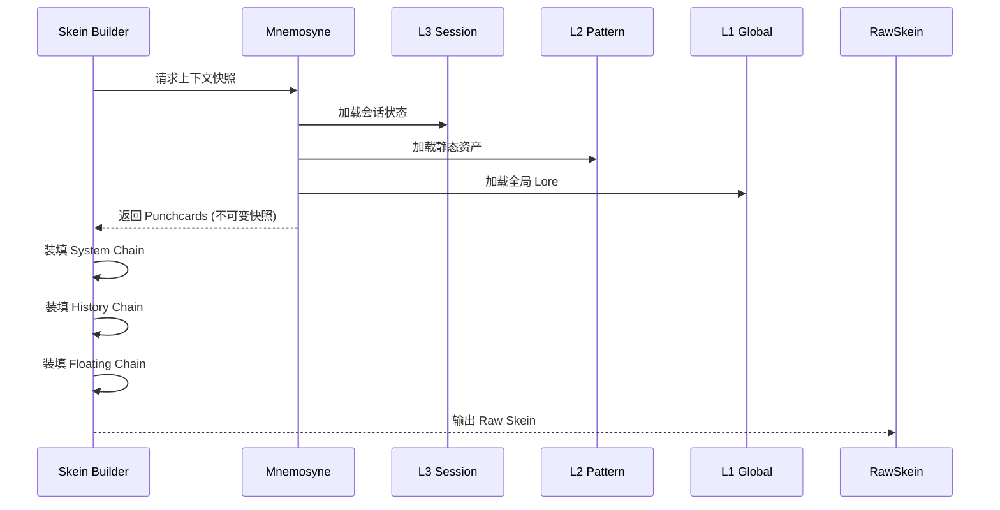
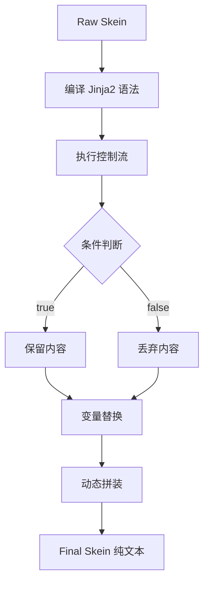
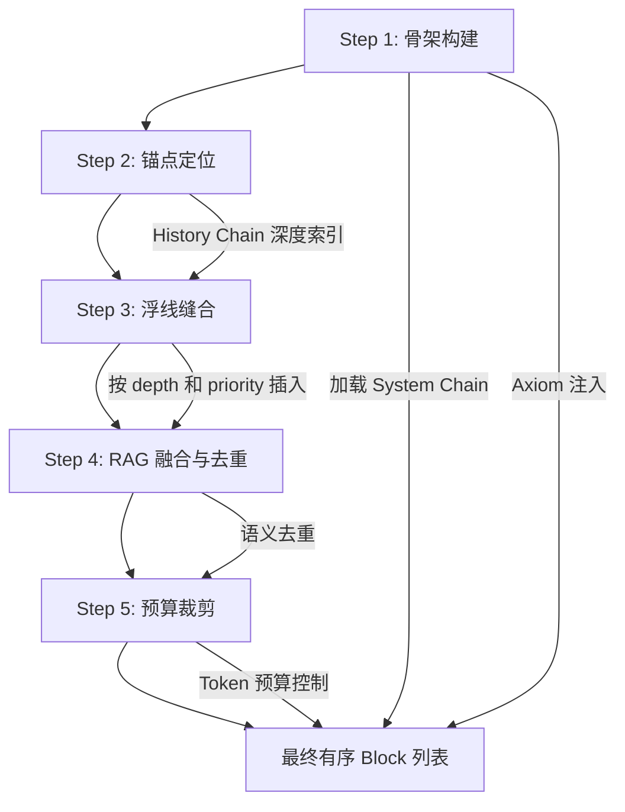
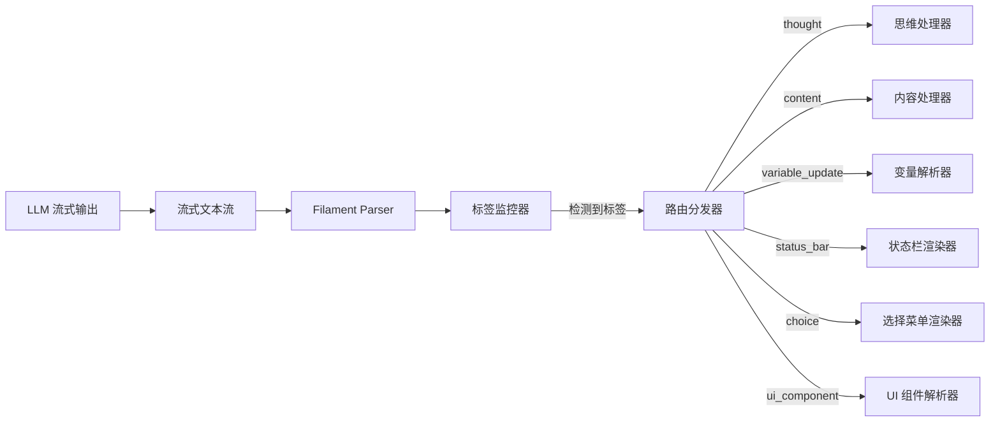
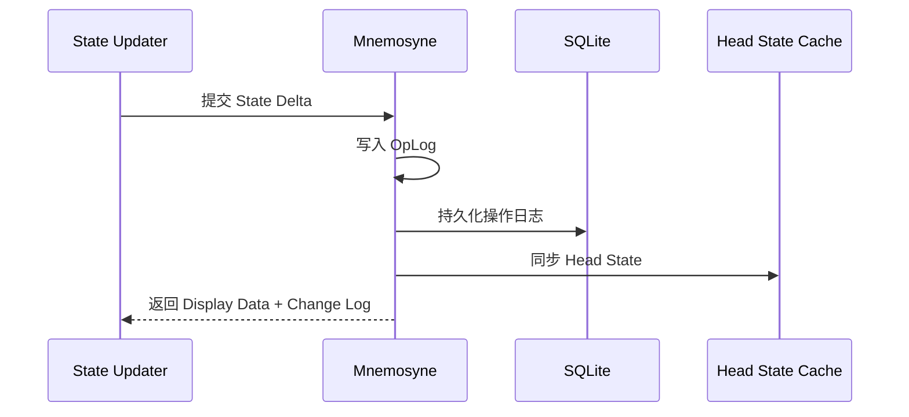
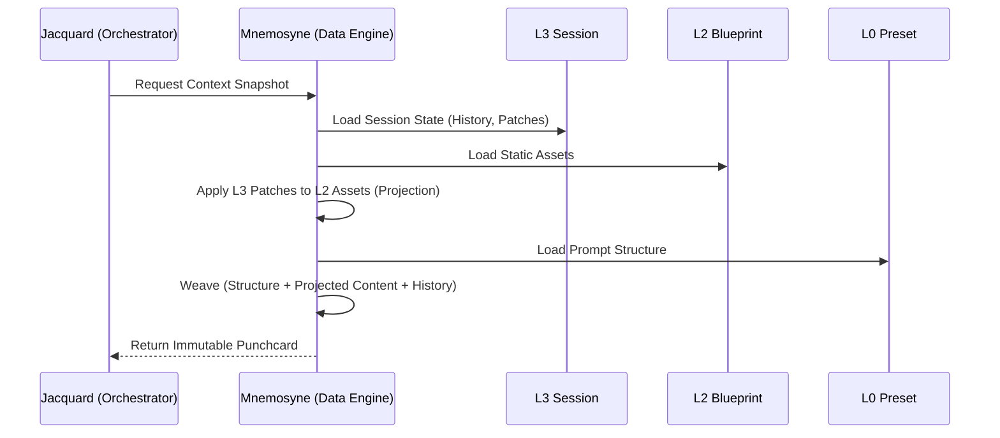

# 提示词处理工作流 (Prompt Processing Workflow)

**版本**: 2.0.0
**日期**: 2026-02-10
**状态**: Draft
**关联文档**:

- Jacquard 编排层 [`../jacquard/README.md`](../jacquard/README.md)
- Mnemosyne 数据引擎 [`../mnemosyne/README.md`](../mnemosyne/README.md)
- 协议目录 [`../protocols/jinja2-macro-system.md`](../protocols/jinja2-macro-system.md)
- Skein 编织系统 [`../jacquard/skein-and-weaving.md`](../jacquard/skein-and-weaving.md)
- Schema 注入器 [`../jacquard/schema-injector.md`](../jacquard/schema-injector.md)
- 规划器组件 [`../jacquard/planner-component.md`](../jacquard/planner-component.md)
- 分层运行时架构 [`../runtime/layered-runtime-architecture.md`](../runtime/layered-runtime-architecture.md)

---

## 1. 工作流概览 (Workflow Overview)

Clotho 的提示词处理流程是一个高度结构化、确定性的流水线（Pipeline）。它遵循 **"晚期绑定 (Late Binding)"** 和 **"无副作用 (Zero Side-Effect)"** 原则，确保 LLM 接收到的始终是基于最新状态的纯净文本。

整个流程由 **Jacquard** 编排层驱动，核心数据载体是 **Skein (绞纱)**。

### 1.1 核心流程图

```mermaid
graph TB
    subgraph "输入层"
        UserInput[用户输入]
        Pattern[L2 Pattern 织谱]
        Preset[L0 Preset 预设]
        GlobalLore[L1 Global Lore]
    end
    
    subgraph "Jacquard 编排流水线"
        Planning[1. Planning Phase (Planner)]
        SkeinBuilder[2. Skein Builder]
        Renderer[3. Template Renderer]
        Assembler[4. Assembler]
        Invoker[5. LLM Invoker]
        Parser[6. Filament Parser]
        Updater[7. State Updater]
        Consolidation[8. Consolidation Phase (Async)]
    end
    
    subgraph "Mnemosyne 数据引擎"
        StateTree[VWD 状态树]
        HistoryChain[历史链]
        EventChain[事件链]
        RAGChain[RAG 检索]
        HeadState[Head State 缓存]
    end
    
    UserInput --> Planning
    Pattern --> SkeinBuilder
    Preset --> Assembler
    GlobalLore --> SkeinBuilder
    
    Planning --> SkeinBuilder
    SkeinBuilder --> Renderer
    Renderer --> Assembler
    Assembler --> Invoker
    Invoker --> Parser
    Parser --> Updater
    Updater --> Consolidation
    
    SkeinBuilder -.->|快照| StateTree
    SkeinBuilder -.->|历史| HistoryChain
    SkeinBuilder -.->|检索| RAGChain
    Updater -.->|更新| StateTree
    Consolidation -.->|整合| EventChain
    Consolidation -.->|回写| HeadState
```

---

## 2. 详细处理阶段 (Detailed Stages)

### 2.1 第一阶段：Planning Phase (Planner)

**定位**: Jacquard 编排流水线中的第一道关卡，系统的"副官 (Adjutant)"。

**输入**: 用户发送的消息文本、当前会话 ID。

**核心职责 (The 3 Pillars)**:

| 职责 | 描述 | 数据权限 |
|------|------|----------|
| **聚焦管理** | 检测用户是否想切换话题，更新 `activeQuestId`，实现任务挂起与激活 | Read: History, Active Quests<br>Write: `planner_context.activeQuestId` |
| **目标规划** | 为 Main LLM 设定具体的战术目标，写入 `current_goal` 和 `pending_subtasks` | Write: `state.planner_context` (Pre-Generation) |
| **策略选型** | 决定使用哪个 Prompt Template（如日常模式、战斗模式、回忆模式） | Output: `PlanContext.templateId` |

**决策流程**:



**产出**: `PlanContext` (包含模板 ID、初始指令、更新后的 `planner_context`)。

### 2.2 第二阶段：Skein 构建 (Skein Builder + Schema Injector)

**输入**: `PlanContext`

**职责**: 初始化 `Skein` 容器，填充**原始数据**，并注入**协议 Schema**。

本阶段由两个插件协作完成：

| 插件 | 优先级 | 职责 |
|------|--------|------|
| **Skein Builder** | 300 | 构建基础 Skein，装填 System/History/Floating Chain |
| **Schema Injector** | 350 | 扫描并加载协议 Schema，转换为 Block 注入 Skein |

**Skein 结构**:

```dart
// lib/models/skein.dart
/// Skein - Prompt 组装容器
///
/// 包含经线 (System Chain)、纬线 (History Chain) 和浮线 (Floating Chain)
class Skein {
  /// 1. 经线 (System Chain): 静态骨架，定义认知框架
  final List<PromptBlock> systemChain;
  
  /// 2. 纬线 (History Chain): 动态基底，即线性时间轴
  final List<PromptBlock> historyChain;
  
  /// 3. 浮线 (Floating Chain): 待注入的动态资产
  final List<FloatingAsset> floatingChain;
  
  /// 元数据与约束
  final SkeinMetadata metadata;
  
  const Skein({
    required this.systemChain,
    required this.historyChain,
    required this.floatingChain,
    required this.metadata,
  });
}

/// Skein 元数据
class SkeinMetadata {
  /// Token 限制
  final int tokenLimit;
  
  /// 激活的预设 ID
  final String activePresetId;
  
  /// 聚焦模式
  final String focusMode;
  
  const SkeinMetadata({
    required this.tokenLimit,
    required this.activePresetId,
    required this.focusMode,
  });
}
```

**数据获取流程**:



**装填操作**:

| 操作 | 执行者 | 描述 |
|------|--------|------|
| **快照获取** | Skein Builder | 向 `Mnemosyne` 请求当前时间点 (`TimePointer`) 的状态快照 (`Punchcards`)，这是一个**只读的深拷贝** |
| **上下文检索** | Skein Builder | 根据语义检索相关的 Lorebook 条目 |
| **System Chain** | Skein Builder | 将 System Template 填入 `System Chain` |
| **History Chain** | Skein Builder | 将历史对话填入 `History Chain` |
| **Floating Chain** | Skein Builder | 将检索到的 World Info 和 Author's Note 封装为带 `InjectionConfig` 的 PromptBlock |
| **Schema 注入** | Schema Injector | 扫描 `<use_protocol>` 和配置，加载 Schema 并注入为 Block |
| **Parser Hints** | Schema Injector | 向 `blackboard['parser_hints']` 写入标签解析提示 |

**装填策略（基于 Mnemosyne 四象限分类）**:

| Mnemosyne 分类 | 语义位置 | 注入策略 | 典型示例 |
| :--- | :--- | :--- | :--- |
| **Axiom（公理）** | System Extension | `pos: system_extension`, `prio: 100` | 物理法则、魔法基础设定 |
| **Agent（代理）** | Recent History | `pos: floating_relative`, `depth: 2-4`, `prio: 90` | NPC 状态、当前环境 |
| **Encyclopedia（百科）** | Deep Context | `pos: floating_relative`, `depth: 5-10`, `prio: 50` | 历史背景、物品说明 |
| **Directive（指令）** | User Anchor | `pos: user_anchor`, `prio: 110` | GM 指令、越狱 Prompt |

**关键点**: 此时 Block 中的内容包含 **未处理的 Jinja2 标签**。

**产出**: `Raw Skein`。

### 2.3 第三阶段：模板渲染 (Template Renderer)

这是流程的核心，负责将动态逻辑转化为静态文本。

**输入**: `Raw Skein`, `Mnemosyne Snapshot` (作为 Context)。

**引擎**: **Jinja2 (Dart)**。

**渲染过程**:



**核心职责**:

1. **编译**: 解析所有 Block 中的 Jinja2 语法
2. **逻辑执行**: 运行控制流
   - 示例: `` -> 检查 Context 中的 `is_night` 变量，决定是否保留夜间描述
3. **动态拼装**: 处理 `...`，将复杂文本块存入临时变量并注入
4. **变量替换**: 将 `{{ char }}` 替换为 "Seraphina"，将 `{{ state.gold }}` 替换为 "100"

**Jinja2 宏分类**:

| 类别 | 语法 | 示例 |
|------|------|------|
| **身份与上下文** | `{{ user }}`, `{{ char }}` | 用户名、角色名 |
| **状态变量** | `{{ state.hp }}`, `{{ state.inventory[0].name }}` | 获取数值、列表访问 |
| **逻辑控制** | ``, `` | 条件渲染、定义临时变量 |
| **格式化工具** | `{{ random(['a', 'b']) }}` | 随机选择 |

**安全沙箱**:
- 渲染过程**严禁**修改 Mnemosyne 数据库
- 禁止文件/网络访问
- 所有变量仅在渲染周期内有效
- `state` 对象为只读，无法执行 `state.hp = 0`
- 函数白名单机制

**产出**: `Final Skein` (纯文本)。

### 2.4 第四阶段：最终拼接 (Assembler)

**输入**: `Final Skein`。

**职责**: 将分散的 Block 链编织并转换为 LLM 请求体。

**编织算法（Weaving）**:



**操作流程**:

1. **Weaving（编织）**: 将 `Floating Chain` 中的块，根据其 `depth` (如倒数第2条) 插入到 `History Chain` 的对应索引中
2. **Format**: 将 `System Chain` 和编织后的 `History Chain` 转换为 JSON 列表 `[{role: "system", ...}, {role: "user", ...}]`
3. **Truncate**: (可选) 如果超长，根据优先级丢弃旧的 History Block

**编织规则（来自 Preset 配置）**:

| 类型 | 目标链 | 位置策略 | 深度范围 | 优先级 |
|------|--------|----------|----------|--------|
| `AGENT` | History | `relative_to_message` | 2-4 | 90 |
| `ENCYCLOPEDIA` | History | `relative_to_message` | 5-10 | 50 |
| `DIRECTIVE` | History | `anchor_to_user` | 0 | 110 |

**智能裁剪策略**:
1. **Phase 1**: 丢弃优先级 < 50 的 Encyclopedia 条目
2. **Phase 2**: 从最久远的 History 消息开始丢弃
3. **Phase 3**: 仅保留 System + Recent History

**产出**: `JSON Object` (发送给 API 的 Body)。

### 2.5 第五阶段：LLM 调用 (Invoker)

**输入**: 最终渲染的 Prompt 字符串（JSON 格式）。

**职责**: 调用底层 API (OpenAI, Anthropic, Local) 发送请求并接收流式响应。

**输入格式示例**:

```json
[
  { "role": "system", "content": "..." },
  { "role": "user", "content": "..." },
  { "role": "assistant", "content": "..." }
]
```

### 2.6 第六阶段：Filament 解析器 (Parser)

**职责**: 实时解析 LLM 的 Filament 输出。

**流式解析架构**:



**Filament 输出格式**:

| 标签 | 用途 | 示例 |
|------|------|------|
| `<thought>` | 思维链 | 推理、规划与自我反思 |
| `<content>` | 最终回复 | 直接展示给用户的对话内容 |
| `<variable_update>` | 变量更新 | `[SET, path, value]`, `[ADD, path, number]` |
| `<status_bar>` | 自定义状态栏 | `<mood>anxious</mood>` |
| `<choice>` | 选择菜单 | `<option id="investigate">调查废墟</option>` |

**容错机制**:
- 首部缺失自动补全
- 尾部闭合预测
- 相邻冗余修正

### 2.7 第七阶段：状态更新器 (State Updater)

**职责**: 收集所有状态变更指令，调用 Mnemosyne 更新状态。

**更新流程**:



**VWD（Value with Description）渲染策略**:
- **System Prompt**: 渲染完整的 `[Value, Description]`
- **UI Display**: 仅渲染 `Value`

### 2.8 第八阶段：Consolidation Phase（记忆整合）- 异步

**触发**: 当 Active Context 达到阈值或会话结束。

**职责**:
- **日志压缩**: 将近期对话生成摘要（Turn Summary）
- **事件提取**: 提取关键剧情点存入 Event Chain
- **归档**: 将原始日志移入冷存储

---

## 3. 数据流变迁 (Data Transformation)

| 阶段 | 数据对象 | 状态描述 | 示例内容 |
| :--- | :--- | :--- | :--- |
| **Input** | `UserMessage` | 原始输入 | "你好，你是谁？" |
| **Build** | `Raw Skein` | 含模板 | `Hello, I am {{ char }}. Go away!` |
| **Render** | `Final Skein` | 纯文本 | "Hello, I am Seraphina. Go away!" (假设 mood=='angry') |
| **Assemble** | `Prompt String` | 含格式 | `<|im_start|>assistant\nHello, I am Seraphina...<|im_end|>` |

---

## 4. 分层运行时架构 (Layered Runtime Architecture)

Clotho 采用 **四层叠加模型** 构建 **织卷（The Tapestry）**，支持动静分离、角色成长和平行宇宙。

| 层级 | 隐喻 | 功能名称 | 职责 | 读写权限 | 典型数据内容 |
| :--- | :--- | :--- | :--- | :--- | :--- |
| **L0** | Infrastructure | 骨架 | 定义与 LLM 的通信协议和 Prompt 结构 | Read-Only | Prompt Template, API Config |
| **L1** | Environment | 环境 | 定义跨角色共享的世界规则与用户身份 | Read-Only | User Persona, Global Lorebooks |
| **L2** | The Pattern（织谱） | 蓝图 | 定义角色的初始设定、固有特质与潜在逻辑 | Read-Only | **Pattern Data** (Name, Desc), Base Lorebooks |
| **L3** | The Threads（丝络） | 状态 | 记录角色的成长、记忆与状态变更 | **Read-Write** | **Patches**, History Chain, VWD State Tree |

**Patching 机制**:
- L3 的 `patches` 对象采用 **"路径-值"** 结构
- 遵循 **"写时复制（Copy-on-Write）"** 原则
- 支持角色成长、设定重写、平行宇宙等场景

**Deep Merge 算法**:
1. **L2 Base**: 加载 L2 的原始数据
2. **L3 Patches**: 遍历 L3 中的 `patches` 对象
3. **Merge**: 将 Patch 值覆盖到 Base 对象的对应路径上
4. **Conflict Resolution**: 后应用的 Patch 覆盖先前的

**运行时数据流**:



---

## 5. 设计原则总结

### 5.1 Late Binding（晚期绑定）
- 变量替换发生在发送给 LLM 的**最后一刻**
- 确保如果用户在生成前一秒修改了状态（如修改了名字），Prompt 会立即反映最新值，无需重启会话

### 5.2 Zero Side-Effect（无副作用）
- 渲染层 (`TemplateRenderer`) 是**纯函数**：`f(Template, State) -> Text`
- 它绝对不会因为渲染了 `` 而改变 `state.hp`
- 状态变更只能通过 LLM 输出后的 `Parser` 阶段进行

### 5.3 Structured Container（结构化容器）
- 使用 `Skein` 而非长字符串传递数据
- 允许在 Pipeline 的任何阶段对特定部分（如 System Prompt）进行独立修改、替换或调试

---

## 6. 相关阅读

- **[Jacquard 编排层](../jacquard/README.md)**: 了解工作流的编排支撑
- **[Mnemosyne 数据引擎](../mnemosyne/README.md)**: 了解工作流的数据支撑
- **[协议目录](../protocols/README.md)**: 了解工作流中使用的数据格式
- **[运行时环境](../runtime/README.md)**: 了解工作流的执行环境
- **[Skein 编织系统](../jacquard/skein-and-weaving.md)**: 了解 Skein 数据结构与编织算法
- **[规划器组件](../jacquard/planner-component.md)**: 了解 Planning Phase (Planner) 的详细设计

---

**最后更新**: 2026-02-10
**维护者**: Clotho 工作流团队