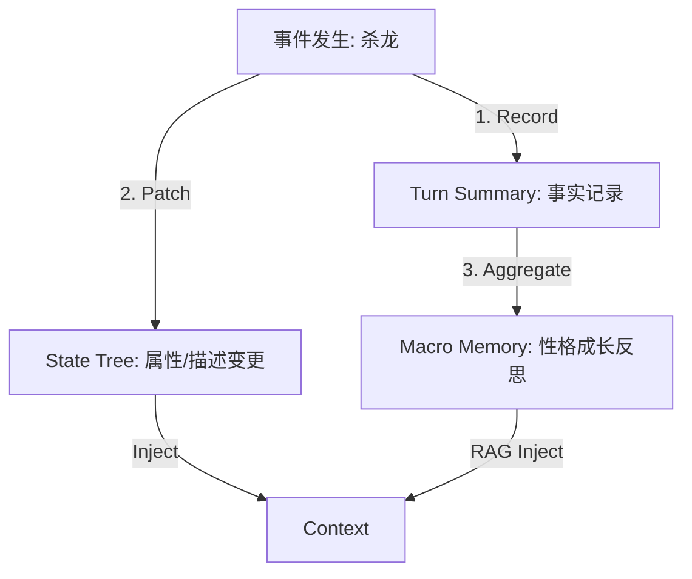

# Mnemosyne 架构决策分析：微观叙事与事件的融合

**日期**: 2026-02-09
**状态**: Proposal
**关联文档**:
- `00_active_specs/mnemosyne/abstract-data-structures.md`
- `01_drafts/mnemosyne_redundancy_analysis.md`

## 1. 核心冲突 (The Conflict)

当前 Mnemosyne 规范 (`00_active_specs`) 采用了“关注点分离” (Separation of Concerns) 的极致设计，将数据分为了 **History** (原文), **Event** (逻辑事实), **Narrative** (语义记忆), **State** (数值) 四条链。

**主要问题**: `Narrative Chain (Micro Level)` 与 `Event Chain` 存在显著的内容冗余。
- **NarrativeLog (Micro)**: "第10轮：亚瑟拔出了石中剑。" (用于 RAG)
- **GameEvent**: `type: item_get, payload: {id: excalibur}, summary: "亚瑟拔出了石中剑。"` (用于逻辑)

这种冗余导致了：
1.  **存储浪费**: 相同的语义文本存储了两份。
2.  **一致性风险**: 更新了事件摘要可能忘记更新叙事日志。
3.  **系统复杂度**: 需要维护额外的 `narrative_logs` 表和同步逻辑。

## 2. 方案比较 (Comparison)

### 方案 A: 现状 (Current Spec) - 分离架构

保持 `NarrativeLog` 和 `Event` 独立。

| 维度 | 评价 |
| :--- | :--- |
| **RAG 精度** | **高**。Micro-Log 是专门为向量检索优化的，可以改写得更利于机器理解（例如包含指代消解）。 |
| **逻辑清晰度** | **高**。Event 纯粹服务于逻辑，Narrative 纯粹服务于记忆。 |
| **维护成本** | **高**。双重写入，双重更新。 |
| **存储效率** | **低**。 |

### 方案 B: Turn-Centric (推荐) - 回合摘要中心制

取消 `Micro Narrative Log` 实体，将其职能合并入 `Turn` 对象。每个 Turn 增加 `summary` 字段。

**数据结构变更**:
```typescript
class Turn {
  id: string;
  messages: Message[];
  events: GameEvent[]; // 结构化逻辑
  summary: string;     // <--- 新增：充当 Micro-Narrative，用于 RAG
  vector_id?: string;  // 关联向量库
}
```

| 维度 | 评价 |
| :--- | :--- |
| **RAG 精度** | **中高**。以 Turn 为单位进行检索是非常自然的粒度。检索结果直接指向 Turn，包含了该回合发生的所有事（对话+事件）。 |
| **逻辑清晰度** | **高**。Event 专注于结构化数据 (Payload)，不再负担“被搜索”的重任，甚至可以简化 `summary` 字段。 |
| **维护成本** | **低**。单一事实来源 (Single Source of Truth)。 |
| **存储效率** | **高**。少了一张表。 |

### 方案 C: Event-Centric - 事件中心制

强行让 Event 承担叙事功能。

| 维度 | 评价 |
| :--- | :--- |
| **RAG 精度** | **低**。大量纯对话的回合没有 Event，导致这些回合无法被“事件搜索”覆盖，除非引入“对话事件”，这会污染事件流。 |
| **逻辑清晰度** | **中**。混合了过多非逻辑性的描述。 |
| **维护成本** | **中**。 |

## 3. 深入分析：Turn-Centric 的优势

采用 **方案 B (Turn-Centric)** 是目前最优解。

### 3.1 语义完整性 (Semantic Integrity)
一个 Turn (用户输入 + AI 输出) 是一个最小的完整叙事单元。
- 如果我们只存 `Event` (如 "获得物品")，我们丢失了 "获得物品时的对话氛围"。
- 如果我们只存 `MicroLog`，我们丢失了与 Turn 的强绑定。
- **Turn.summary** 完美捕捉了该时刻的快照："用户询问关于剑的事，AI 解释了传说，并赠送了石中剑。" -> 这既包含了对话，也包含了事件。

### 3.2 简化 RAG 流程
- **Current**: Search -> NarrativeLog -> (join) -> Turn -> History.
- **Proposed**: Search -> Turn.summary -> (direct access) -> Turn.
路径缩短，查询更高效。

### 3.3 兼容 Macro Narrative
我们仍然保留 `Narrative Chain` 的 **Macro Level (宏观层)**。
- **Chapter Summaries**: 跨越 50-100 个 Turns 的总结。
- 这是一个独立的层级，不受 Turn-Centric 变更的影响。

## 4. 实施建议 (Action Plan)

1.  **修改 SQLite Schema**:
    - 在 `turns` 表中添加 `summary` (TEXT) 和 `vector_id` (TEXT) 字段。
    - 删除 `narrative_logs` 表中 `level='micro'` 的设计，或者完全删除 `narrative_logs` 表，将宏观叙事改名为 `narrative_chapters` 或 `memory_segments` 以示区分。
    
2.  **更新抽象数据结构**:
    - 更新 `00_active_specs/mnemosyne/abstract-data-structures.md`，移除 `2.5 叙事日志` 中的 Micro 定义，增强 `2.2 回合`。

3.  **调整工作流**:
    - **Post-Flash**: 原本生成 Micro-Log 的任务，改为“生成 Turn Summary 并更新 Turn 行”。

## 5. 应对“角色成长” (Handling Character Growth)

针对用户关于“人物改变与成长”的关切，单纯依靠 `Turn.summary` (记录事实) 是不够的。成长属于 **状态 (State)** 和 **认知 (Cognition)** 的范畴。

在 Turn-Centric 架构下，我们通过 **"状态突变 + 宏观反思"** 双管齐下来记录成长：

### 5.1 显式状态成长 (Explicit State Mutation)
利用 Mnemosyne 强大的 **VWD State Tree**。当角色经历重大事件后，Post-Flash 不仅生成摘要，还应直接修改 L3 State。

*   **数值**: `level: 1 -> 2`, `courage: 10 -> 15`
*   **文本**: 通过 Patch 机制修改 `character.description` 或 `character.personality`。
    *   *Before*: "胆小的乡村少女。"
    *   *After*: "经历过恶龙之战的坚毅战士。"

### 5.2 隐式宏观反思 (Implicit Macro Reflection)
成长的“记忆”不应淹没在琐碎的 Turn Summary 中，而应上升为 **Macro Narrative (宏观叙事)**。

*   **机制**: 每隔一段时间（如 20-50 Turns 或章节结束），系统执行 "Consolidation (整合)"。
*   **产物**: 生成一条 **Macro Log** (Memory Segment)。
    *   *内容*: "在击败巨龙后，Alice 意识到力量的重要性，她不再像以前那样依赖他人。"
    *   **作用**: 这条 Macro Log 会被高优先级地通过 RAG 注入到 Prompt 中，作为“长期性格背景”影响 AI 的扮演。

### 5.3 架构图解



## 6. L2与L3的融合：角色投影 (L2/L3 Fusion: Character Projection)

针对“如何将变化后的角色 (L3) 与原本的角色设定 (L2) 结合”的问题，Mnemosyne 采用了 **Layered Projection (分层投影)** 机制。

### 6.1 核心原则：L3 覆盖 L2 (L3 Overrides L2)
系统永远不会“修改” L2 的原始文件（只读），而是通过 L3 的 **Patch Map** 动态覆盖它。

*   **L2 (Original)**: 类似于 OOP 中的 `Class` 或 `Prototype`。
*   **L3 (Session)**: 类似于 `Instance`。
*   **Runtime**: `Runtime = DeepMerge(L2, L3)`。

### 6.2 融合策略 (Fusion Strategy)

| 数据类型 | 融合方式 | 示例 |
| :--- | :--- | :--- |
| **属性 (Attributes)** | **完全覆盖 (Override)** | L2 `hp: 100` + L3 `hp: 80` = Runtime `hp: 80`。如果 L2 更新了 `hp: 120`，由于 L3 有补丁，仍显示 80 (或基于逻辑重算)。 |
| **描述 (Description)** | **完全替换 (Replace)** | 描述通常需要整体重写以保持连贯。当角色性格大变时，L3 会存储一份完整的、新的 `description` 字符串，完全取代 L2 的旧描述。 |
| **知识/设定 (Lore)** | **并存 (Coexist)** | L2 的 World Lore (世界观) 和 L3 的 Narrative (经历) 是**并存**关系。RAG 会同时检索两者。LLM 会根据上下文权重（近期经历 > 远古设定）来理解角色。 |

### 6.3 实际运作流程

1.  **Load Phase**:
    *   加载 L2 静态资源 (`character.yaml`).
    *   加载 L3 `patches` (`session.db`).
    *   执行 `apply_patches()` 生成 **Projected Character**。
2.  **Prompt Construction**:
    *   System Prompt 注入的是 **Projected Character** 的数据（即“现在的 Alice”）。
    *   RAG 检索混合了 L2 Lorebook 和 L3 Turn Summaries。

### 6.4 解决“割裂感”
如果 L2 设定是“永远长不大的孩子”，而 L3 变成了“沧桑老人”，如何结合？
*   **机制**: `State Tree` 的 `description` 字段必须被 L3 Patch 更新。
*   **关键**: 我们不依赖 LLM 去“脑补”两个冲突设定的平均值。我们必须显式地在 L3 State 中**更新**设定文本。这就是为什么 **State Tree** 必须包含 `description`, `personality` 等文本字段，而不仅仅是数字。

## 7. 综合存储机制：全景视图 (Comprehensive Storage Mechanism)

结合上述所有分析（微观叙事融合、角色成长、L2/L3 投影），Mnemosyne 的最终存储架构如下。这是一套“以时间为轴，动静分离”的有机系统。

### 7.1 数据分层与职责 (Data Layering & Responsibility)

| 层级 | 实体 (Entity) | 存储位置 | 职责 (Responsibility) | 生命周期 | 隐喻 |
| :--- | :--- | :--- | :--- | :--- | :--- |
| **L2** | **Library Pattern** | YAML (Read-Only) | **定义原型**。提供角色的出厂设置（性格、初始属性、世界观）。 | 永恒不变 | **织谱 (Pattern)** |
| **L3** | **Turn** (Timeline) | SQLite (Rows) | **记录事实**。包含对话原文 (`messages`)、发生的事实 (`events`) 和时刻快照 (`summary`)。 | 只增不减 (Append-only) | **丝络 (Threads)** |
| **L3** | **State Tree** | SQLite (Snapshots) | **记录现状**。角色的当前属性 (`hp`)、状态 (`status`) 和自我认知 (`description`)。 | 随时间突变 (Mutable) | **织卷 (Tapestry)** |
| **L3** | **Macro Narrative** | SQLite (Rows) | **沉淀记忆**。跨越时间段的总结与反思，用于长期回忆。 | 周期性生成 | **结 (Knots)** |

### 7.2 关键工作流 (Critical Workflows)

#### A. 启动与投影 (Load & Projection)
当加载存档时，系统执行 **Deep Merge**：
1.  读取 **L2 Pattern** (原型)。
2.  读取 **L3 State** (当前补丁与变量)。
3.  `Runtime Context = Merge(L2, L3)`。
    *   *Result*: 此时的 Context 中，`description` 是“屠龙者”（L3），而不再是“乡村少女”（L2）。

#### B. 交互与记录 (Interaction & Recording)
在一个 Turn 中：
1.  **用户输入**: "我们去杀龙吧！"
2.  **推理**: LLM 基于 Runtime Context 生成回复。
3.  **Post-Flash (事后处理)**:
    *   **生成 Summary**: "Alice 同意了用户的提议，眼中闪过一丝决绝。" -> 存入 `Turn.summary`。
    *   **提取 Event**: `type: quest_start, id: kill_dragon` -> 存入 `Turn.events`。
    *   **更新 State**: `mood: determined` -> 更新内存 State Tree。

#### C. 成长与反思 (Growth & Reflection)
当 `kill_dragon` 任务完成时：
1.  **显式成长**: 脚本或 LLM 触发 State Patch，将 `character.title` 更新为 "Dragon Slayer"，`character.description` 重写为 "一位传奇的屠龙英雄..."。
2.  **隐式反思**: 系统检测到章节结束，触发 Consolidation Worker。
    *   Worker 读取过去 50 个 Turns 的 Summaries。
    *   生成 **Macro Narrative**: "这一战让 Alice 彻底告别了过去的软弱。"
    *   存入 `narrative_chapters` 表。

#### D. 检索与增强 (RAG & Injection)
在下一次生成时，Prompt 将包含：
*   **System**: L3 覆盖后的新角色设定（屠龙者）。
*   **Short-term**: 最近 10-20 条对话历史。
*   **Long-term (RAG)**:
    *   检索 **L2 Lorebook**: "龙的弱点是逆鳞" (世界知识)。
    *   检索 **L3 Macro**: "Alice 曾击败过红龙" (重要经历)。
    *   检索 **Turn Summary**: "上次提到剑在背包里" (细节回忆)。

### 7.3 统一数据结构定义 (Unified Data Structure)

```typescript
// 1. 时间轴单元 (The Atom of Time)
class Turn {
    id: string;
    index: number;
    messages: Message[];       // 原文
    events: GameEvent[];       // 逻辑钩子
    summary: string;           // 微观叙事 (RAG Unit)
    vector_id?: string;        // 向量索引
}

// 2. 状态快照 (The Snapshot of Being)
class StateTree {
    // 混合了 L2 原型与 L3 补丁的最终结果
    character: {
        name: string;
        description: string;   // 可能已被 L3 覆盖
        attributes: Map<string, VWD>;
    };
    world: { ... };
    quests: QuestState[];
}

// 3. 宏观记忆 (The Condensed Memory)
class MacroNarrative {
    id: string;
    period: [startTurn, endTurn];
    content: string;           // 高度概括的反思
    vector_id: string;
}

// 4. 世界书 (The Static Knowledge)
class LorebookEntry {
    id: string;
    keys: string[];
    content: string;
    // L2 定义内容，L3 仅存储启用/禁用状态或微小修正
}
```

## 8. 结论

**建议正式采纳上述架构方案。**

该方案成功地将：
1.  **Turn-Centric** (减少微观冗余)
2.  **Layered Projection** (解决 L2/L3 融合)
3.  **State/Log Separation** (明确成长与事实的边界)

融合为一个逻辑自洽的整体。它既保证了机器逻辑的严谨性 (Events/State)，又保留了文学叙事的丰富性 (Summaries/Macro Narrative)。
