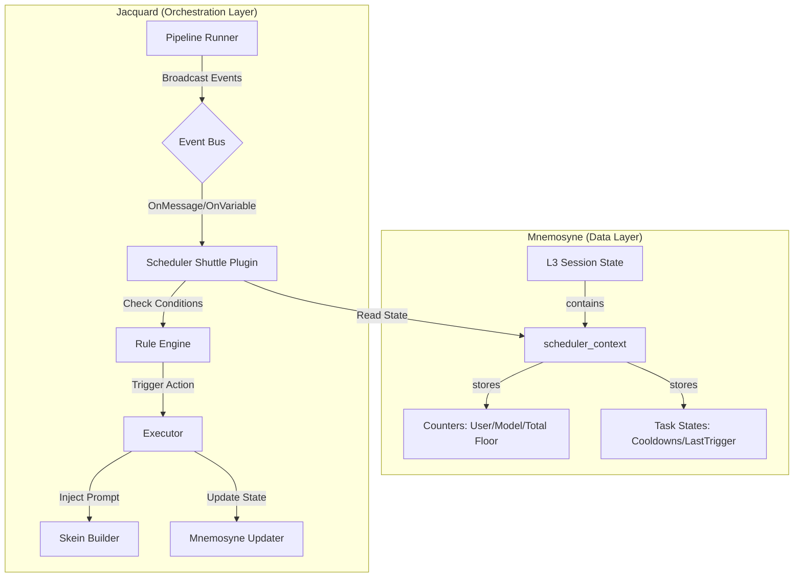

# 设计方案草稿：Clotho 调度系统 (Scheduler System) 集成

**版本**: Draft 1.0
**日期**: 2026-01-15
**状态**: Proposal

---

## 1. 概述 (Overview)

本方案旨在将 LittleWhiteBox (LWB) 的核心调度机制（精细化间隔控制、事件触发）融入 Clotho 的分层架构中。

我们遵循 **“凯撒原则 (The Caesar Principle)”**，将调度逻辑作为确定性的代码逻辑（Caesar's Domain），由 `Jacquard` 和 `Mnemosyne` 共同掌管，而非交由 LLM 判断。

## 2. 架构集成图 (Architecture Integration)

我们将在 `Jacquard`（编排层）引入一个新的穿梭机插件 `Scheduler Shuttle`，并在 `Mnemosyne`（数据层）的 L3 状态中增加 `scheduler_context`。



## 3. 详细设计 (Detailed Design)

### 3.1 Mnemosyne: L3 状态扩展

我们需要在 `L3 Session State` 中持久化调度器的状态。

**Schema 定义**:

```json
{
  "scheduler_context": {
    "$meta": { 
      "template": { "description": "System Scheduler State" },
      "updatable": false // 仅允许通过 Scheduler Shuttle 修改
    },
    // 1. 全局计数器 (Global Counters)
    "counters": {
      "total_floor": 0,       // 总消息数 (Total Messages)
      "user_floor": 0,        // 用户发送数 (User Messages)
      "model_floor": 0,       // 模型回复数 (Model Messages)
      "last_interaction_ts": 0 // 最后交互时间戳 (Unix Timestamp)
    },
    // 2. 任务状态追踪 (Task Tracking)
    "tasks": {
      // Key 是 Task ID
      "daily_greeting": {
        "last_triggered_floor": 10,
        "last_triggered_ts": 1700000000,
        "trigger_count": 1,
        "status": "active" // active | suspended | completed
      },
      "random_encounter_01": {
        "cooldown_remaining": 0
      }
    }
  }
}
```

### 3.2 Jacquard: Scheduler Shuttle 插件

**职责**:
1.  **监听 (Listen)**: 订阅 Jacquard Pipeline 的生命周期事件。
2.  **维护 (Maintain)**: 自动更新 `scheduler_context.counters`。
3.  **评估 (Evaluate)**: 遍历活跃的调度规则 (Rules)，检查触发条件。
4.  **执行 (Execute)**: 执行预定义的动作 (Inject / Reply / StateUpdate)。

**核心事件 (Event Hooks)**:

| 事件名 | 触发时机 | 处理逻辑 |
| :--- | :--- | :--- |
| `OnChatCreated` | 新会话初始化时 | 初始化计数器，触发 `type: "startup"` 的任务 |
| `OnChatLoaded` | 会话加载完成时 | 检查离线时间，触发 `type: "resume"` 的任务 |
| `OnMessageReceived` | 收到用户消息后 (Pre-LLM) | `user_floor++`, `total_floor++`，检查 `trigger: "message"` 的任务 |
| `OnModelReplied` | 模型回复生成后 (Post-LLM) | `model_floor++`, `total_floor++` |
| `OnVariableChanged` | Mnemosyne 状态变更后 | 检查 `trigger: "variable"` 的任务 (需防止死循环) |

## 3.3 流程定义 (Process Definition)

> **修订说明**: 考虑到 Filament 协议主要聚焦于 LLM 的 I/O 交互，调度规则 (Scheduler Rules) 更适合作为**流程配置 (Process Configuration)** 独立存在，或者作为 `Pattern` (织谱) 的一部分元数据，而不是作为 Filament 协议的扩展。

**配置位置**:
- 这些规则应定义在 **World Info / Lorebook** 的元数据中，或者作为 **Character Card** 的扩展字段（例如 V3 规范的 `extensions` 字段）。
- 在运行时，`Scheduler Shuttle` 会读取这些配置并注册监听器。

**JSON 配置示例**:

```json
{
  "scheduler_rules": [
    {
      "id": "ambient_description",
      "type": "interval",
      "trigger": {
        "counter": "total_floor",
        "mod": 10
      },
      "action": {
        "type": "inject_system",
        "content": "[System Note: Briefly describe the changing environment sounds.]",
        "probability": 0.8
      },
      "conditions": ["world.location != 'home'"]
    },
    {
      "id": "low_health_reaction",
      "type": "event",
      "trigger": {
        "event": "OnVariableChanged",
        "path": "character.health",
        "operator": "<",
        "value": 20
      },
      "action": [
        { "type": "force_thought", "content": "I'm losing too much blood..." },
        { "type": "update_state", "path": "character.status", "value": "wounded" }
      ],
      "cooldown": 5
    }
  ]
}
```

## 4. 实现路线图 (Roadmap)

1.  **Phase 1: 数据层准备**
    *   修改 `Mnemosyne` 默认 Schema，增加 `scheduler_context`。
    *   实现计数器更新的原子操作。

2.  **Phase 2: 编排层核心**
    *   在 `Jacquard` 中实现 `EventBus`。
    *   开发 `Scheduler Shuttle` 基础框架（仅支持 Interval）。

3.  **Phase 3: 协议与高级功能**
    *   `Filament` 解析器支持 `<scheduler>` 标签。
    *   实现 `OnVariableChanged` 监听和复杂条件判断。

## 5. 待讨论点 (Open Questions)

1.  **死循环防护**: `OnVariableChanged` 触发 Action 修改变量，可能导致无限循环。是否引入 `MaxRecursionDepth`？
2.  **Schema 位置**: 调度规则是仅存在于 Pattern (L2)，还是允许在运行时 (L3) 动态添加？(建议 V1 仅 L2)。
3.  **执行时机**: 注入的 Prompt 是放在 `System` 还是 `User` 上下文？(建议通过 `action.type` 灵活配置)。

---

请审阅此草稿。如果满意，我将把它正式转化为规范文档。
